# AWS Route 53 SME - Core Topic Modules

> Comprehensive deep-dive topic guides 00a to 23.

---

# FILE: topics/00a-dns-protocol-basics.md
<!-- SOURCE FILE: topics/00a-dns-protocol-basics.md -->

# Topic 00a — DNS 协议基础（SME 底座）

> **定位**：这是所有其他 topic 的**协议底座**。R53 是 DNS 生态里的一个权威实现，客户追问"为什么改了记录没生效""为什么 dig 有时走 TCP""SERVFAIL 到底断在哪""NXDOMAIN 和空答案区别在哪"时，答案都落在**协议层**——先懂 DNS 报文/委派/缓存的原生语义，再谈 R53 特性才不会张冠李戴。本专题只讲**RFC 级的协议原理**，不讲 R53 配置。
> **九大基础块**：(1) 迭代 vs 递归解析；(2) delegation（委派）与 glue；(3) bailiwick 与 in/out-of-bailiwick glue（RFC 9471）；(4) UDP 截断 / TC 位 / TCP fallback；(5) EDNS0（RFC 6891）；(6) NXDOMAIN vs NODATA；(7) 负缓存与 SOA MINIMUM（RFC 2308）；(8) TTL 语义；(9) DNS 报文头标志（AA/RD/RA/AD/CD，**AD≠AA**）。
> **配套 topic**：14（技术原理深挖，讲 R53 权威侧 anycast/委派机制的机制底座）、01（Hosted Zone）、07（DNSSEC，AD 位的密码学来源）、05（Resolver/递归数据面）、13（排障纪律）。

---

## 一、迭代 vs 递归解析（三种角色，别混）

DNS 里有三种角色，SME 最常被客户问混：

| 角色 | 谁 | 做什么 | 查询里怎么体现 |
|---|---|---|---|
| **Stub resolver（存根解析器）** | 终端 OS（glibc / EC2 内核）| 只把查询丢给配置的递归解析器，自己**不迭代** | 发出 **RD=1** 的查询 |
| **Recursive resolver（递归解析器）** | ISP / 企业 / 8.8.8.8 / **VPC Resolver** | 替客户端"跑完全程"：从根开始**迭代**问下去，缓存结果 | 对上游权威做迭代时通常发 **RD=0**；自己缓存（RD 只表是否请求递归，不据此判定角色——见第九块）|
| **Authoritative server（权威服务器）** | zone 所有者侧（**Route 53 就在这一层**）| 只回答"我负责的 zone"，**从不迭代、从不缓存别人的数据** | 应答置 **AA=1** |

- **递归（recursive）**：客户端说"请你替我把答案查全，直接给我最终结果"。递归解析器承担这份工作。
- **迭代（iterative）**：递归解析器逐跳去问——**根 → TLD → 权威**，每一跳只拿到"下一跳该问谁"的委派（referral），直到某台权威给出带 **AA=1** 的最终答案。
- **核心心法**：R53（托管 zone 那侧）是**权威**，不是递归；它收到 RD=1 也**不会**替你递归，只按权威身份对"它负责的 zone"作答。VPC Resolver 才是递归层。

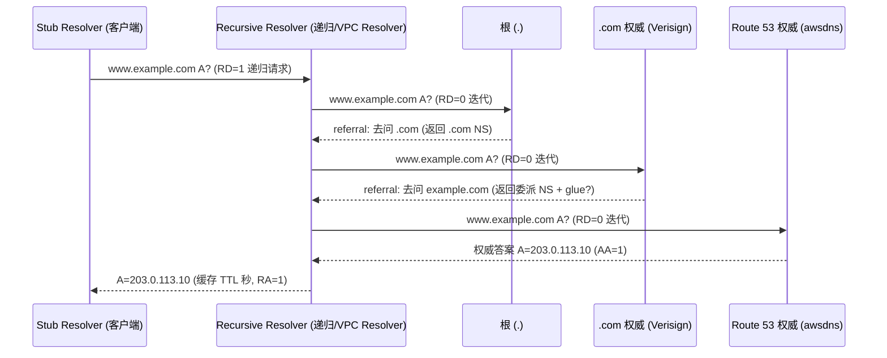
```mermaid
sequenceDiagram
    participant C as Stub Resolver (客户端)
    participant R as Recursive Resolver (递归/VPC Resolver)
    participant Root as 根 (.)
    participant TLD as .com 权威 (Verisign)
    participant A as Route 53 权威 (awsdns)

    C->>R: www.example.com A?  (RD=1 递归请求)
    R->>Root: www.example.com A?  (RD=0 迭代)
    Root-->>R: referral: 去问 .com (返回 .com NS)
    R->>TLD: www.example.com A?  (RD=0 迭代)
    TLD-->>R: referral: 去问 example.com (返回委派 NS + glue?)
    R->>A: www.example.com A?  (RD=0 迭代)
    A-->>R: 权威答案 A=203.0.113.10 (AA=1)
    R-->>C: A=203.0.113.10 (缓存 TTL 秒, RA=1)
```

> **SME 排障锚点**：客户 `dig +trace` 看到的是**迭代过程**（模拟递归解析器逐跳）；客户 `dig @8.8.8.8` 看到的是**递归结果**（RD=1，答案可能来自缓存，AA=0）。两者不一样是正常的，不是 R53 出错。

---

## 二、delegation（委派）与 glue

- **delegation（委派）** = 父 zone 用 **NS 记录**把某个子域名的权威"下放"给一组名字服务器。例：`.com` 里存 `example.com. NS ns-xxx.awsdns-yy.net.`，这就是把 `example.com` 委派给 R53。委派**只靠 NS 记录的名字**完成。
- **glue（黏合记录）** = 委派时**在父 zone 的 additional section 里附带的 NS 名字的 A/AAAA 地址**。为什么需要它？看下一块的 bailiwick 死循环。
- **delegation set**：一个 R53 hosted zone 拿到的**四条委派 NS 名字**（`awsdns-*`，横跨 .com/.net/.org/.co.uk 四个 TLD——机制详见 topic 14 第二块）。客户在**域名注册商侧**必须把这四条 NS 填成"父级委派"，否则解析链断在 TLD 那一跳。

> **SME 排障锚点**：客户"域名解析全线不通、连 SOA 都拿不到"——第一步查**注册商侧的 NS 委派**是否等于 hosted zone 的四条 `awsdns` NS。委派没配对 = 全世界都找不到这台权威。

---

## 三、bailiwick 与 in/out-of-bailiwick glue（RFC 9471，硬考点）

**bailiwick（管辖范围）** 指"某台权威服务器的名字是否落在它自己被委派的域之内"。这决定了 glue 是**必需**还是**可选**。

### 3.1 in-bailiwick（in-domain）NS —— glue 是**必需**

- NS 名字**落在被委派域内部**，例：`example.com` 的 NS 是 `ns1.example.com`。
- 死循环问题：要解析 `ns1.example.com` 的地址，就得先找到 `example.com` 的权威——可 `example.com` 的权威**正是** `ns1.example.com`。鸡生蛋。
- **解法：父 zone（`.com`）必须附带 glue**，即在 referral 里直接给出 `ns1.example.com A 192.0.2.1`，打破循环。
- **RFC 9471 的硬要求（更新 RFC 1034）**：权威服务器生成 referral 时，**MUST** 包含所有 in-domain NS 的可用 glue；若**报文太大放不下**，**MUST 置 TC=1** 告知客户端"答案被截断，请改用 TCP 重取"（见第四块）。

### 3.2 out-of-bailiwick / sibling NS —— glue 只是**优化，非必需**

- NS 名字**落在被委派域之外**。两种情况：
  - **out-of-bailiwick（域外）**：NS 在完全另一棵子树，例：`example.com` 用 `ns.provider.net`。
  - **sibling（同父兄弟域）**：NS 在同一父级下的另一个被委派子域，例：`foo.test` 用 `ns1.bar.test`（`bar.test` 与 `foo.test` 都是 `test` 的子域）。
- 这些情况**不需要**父级 glue：解析器可以**独立**沿 `.net`/`bar.test` 各自的链路解析出 NS 地址，不依赖这条委派附带的 glue。
- **RFC 9471**：sibling glue 权威 **SHOULD** 附带（作为优化，省一次往返）；若 in-domain glue 塞满后 sibling glue 放不下，权威 **MAY**（但不强制）置 TC=1。
- **例外——cyclic sibling（循环兄弟依赖）**：`bar.test` 用 `ns1.foo.test`，同时 `foo.test` 用 `ns2.bar.test`，互相指向对方。此时**只有**父级 `test` 附带 glue 才能打破循环。RFC 9471 指出这种情况极罕见（2021 年 ICANN CZDS 全量数据里约 2.09 亿委派中仅 222 个）。

### 3.3 与 Route 53 的关系（考点落点）

- R53 的 `awsdns-*` NS 属于 **out-of-bailiwick**（对客户的 `example.com` 而言，NS 名字在 `.net/.org/.co.uk` 等别的树上）。所以客户 zone 的委派**不依赖** `.com` 附带 `awsdns` 的 glue——解析器能独立解析出 `awsdns` 地址。这是 R53 委派设计能横跨四个 TLD 的前提（topic 14 第二块）。
- **常见误区**：客户以为"R53 没给我 glue 所以解析不了"。对 out-of-bailiwick 的 awsdns NS，**本就不需要** child 侧 glue。真正会因缺 glue 断链的是 **in-bailiwick 自建 NS** 场景（客户用 `ns1.example.com` 却没在注册商侧配 glue）。

---

## 四、UDP 截断 / TC 位 / TCP fallback

- **DNS 传输默认走 UDP/53**（一来一回、无连接、低开销）。传统 UDP 无 EDNS0 时上限 **512 字节**。
- **TC（TrunCation）位**：当权威要回的答案**超过所选传输能容纳的大小**时，它把能放的放进去，并置 **TC=1** 表示"答案不完整"。
- **改用另一种 transport**：客户端看到 **TC=1**，**SHOULD 用另一种能承载更大响应的 transport 重发同一查询**——经典场景下即改用 **TCP/53**（RFC 1035 起 DNS 客户端/服务端必须支持 TCP），TCP 报文上限 **65535 字节**，足以承载完整答案。
- **触发 TC 的典型场景**：
  - 大量记录的应答（很多 A / 很多 MX / 很多 TXT）。
  - **DNSSEC 签名记录**（RRSIG/DNSKEY 体积大，最容易撑爆 UDP）——topic 07。
  - **in-domain glue 放不下**（RFC 9471 要求此时 MUST 置 TC=1）。
- **RFC 9471 的运维影响提示**：新要求可能让"UDP 置 TC 的比例"上升，进而**增加落到 TCP 的查询量**——网络中间设备（防火墙/SG）**必须同时放行 UDP/53 和 TCP/53**，只放 UDP 会导致大应答场景（DNSSEC、多记录）间歇性 SERVFAIL。

> **SME 排障锚点**：客户"平时好好的，加了 DNSSEC / 记录变多后偶发解析失败"——查中间链路是否**阻断了 TCP/53**。这是"UDP 通、TCP 不通"经典故障。

---

## 五、EDNS0（RFC 6891）

- **EDNS0（Extension Mechanisms for DNS）** 用一条伪记录 **OPT** 扩展 DNS，无需改协议头。
- 最重要的字段：**requestor's UDP payload size**——客户端用它**声明"我这条 UDP 链路最多能接收多大的响应"**，常见值 **1232 / 4096**（DNS Flag Day 2020 推荐 **1232** 以规避 IP 分片黑洞）。它是**接收方能力的上报值，不是一个硬截断阈值**：实际能走多大 UDP 还同时受**服务端自身的 payload 上限、路径 MTU、双方取较小值**等影响。它把 UDP 上限从古老的 512 提升到 1232~4096，**减少不必要的 TCP fallback**。
- 还承载：**DO 位**（DNSSEC OK，表示客户端要 DNSSEC 记录，topic 07）、扩展 RCODE、以及 **EDNS Client Subnet（ECS）** 等选项（把客户端网段带给权威做地理定位，topic 14）。
- **与第四块的关系**：EDNS0 声明的 payload size 决定"多大之内还能走 UDP"；超过它，才置 TC=1 走 TCP。所以 EDNS0 是"UDP 能撑多大"的旋钮，TC/TCP 是"撑不下时的兜底"。

> **SME 排障锚点**：`dig` 输出里出现 `; EDNS: version: 0; udp: 1232` 就是 EDNS0 在起作用；**DO 位只有在显式 `+dnssec` 时才置位**（届时才会看到 `flags: do`），普通 EDNS 查询不带 DO。若中间设备**丢弃带 OPT 的包**（老旧防火墙），会退化到 512 甚至完全失败。

---

## 六、NXDOMAIN vs NODATA（RFC 2308，别混）

两者都是"负答案"，但语义**完全不同**：

| | **NXDOMAIN**（Name Error）| **NODATA** |
|---|---|---|
| 含义 | **这个域名不存在**（任何类型都没有）| **域名存在，但没有你问的那个类型**的记录 |
| RCODE | `NXDOMAIN`（Name Error，RCODE=3）| **`NOERROR`（RCODE=0）** + answer 段为空 |
| 怎么判定 | 直接看 RCODE | **无专用 RCODE，必须从应答内容"算"出来**：RCODE=NOERROR 且 answer 空、authority 段有 SOA |
| 例子 | 查 `nonexistent.example.com A` → 整个名字不存在 | 查 `example.com AAAA`，但该名只有 A、没有 AAAA |

- **关键陷阱**：NODATA **没有**独立的返回码，它是 `NOERROR + 空 answer` 的组合，必须由解析器**算法推断**。客户"我明明查到了 NOERROR 为什么没数据"——那就是 NODATA，说明**该类型**没记录，不代表域名不存在。
- **权威侧硬要求（RFC 2308 §3）**：权威在回 NXDOMAIN 或 NODATA 时**MUST 在 authority 段放入该 zone 的 SOA 记录**——这是负答案能被缓存的前提（见第七块）。RFC 2308 还建议权威只发 TYPE 2 形态（authority 段只含 SOA、不含 NS），以免老解析器把它误当 referral。

---

## 七、负缓存与 SOA MINIMUM（RFC 2308）

- **负缓存（negative caching）** = 缓存"某记录/某域名不存在"这一事实。RFC 2308 把它从"可选"升级为"**只要解析器缓存正答案，就必须也缓存负答案**"。
- **负答案的 TTL 来自哪里？** 负答案的 answer 段是空的，没有普通记录可挂 TTL——所以 TTL **由 authority 段那条 SOA 记录承载**。
- **SOA MINIMUM 字段的现代含义（RFC 2308 §4，硬考点）**：SOA 的最后一个字段（MINIMUM）历史上被赋过三种含义，RFC 2308 明确它的**唯一现代含义 = 负答案的缓存 TTL**。
  - 具体规则（§5）：负答案的缓存时长 = **min(SOA.MINIMUM, SOA 记录自身的 TTL)**。
  - 另两种旧含义（"zone 内所有 RR 的最小 TTL""无显式 TTL 记录的默认 TTL"）已废弃/被 `$TTL` 指令取代。
- **实践值**：RFC 2308 建议负缓存 TTL 取 **1~3 小时**较合理，超过 1 天会出问题。
- **SERVFAIL / 死服务器的负缓存上限（§7）**：server failure 和 unreachable server 的负缓存 **MUST NOT 超过 5 分钟**，且按 `<query name, type, class, server IP>` 元组缓存。

> **SME 排障锚点**：客户"我刚创建了记录，为什么还是查不到（NXDOMAIN）"——很可能**创建前**的那次查询已被下游解析器**负缓存**，卡在负缓存窗口内。R53 默认 SOA 的 **MINIMUM 字段 = 86400 秒**，而 **SOA 记录自身的 TTL 默认 = 900 秒**，按 RFC 2308 §5 有效负缓存 = **min(86400, 900) = 900 秒**（起决定作用的是较小的 SOA TTL，不是 MINIMUM 字段）。让客户等负缓存过期，或换未缓存过的解析器验证。R53 权威侧改动传播很快（`GetChange` 返回 `INSYNC` 即完成），卡的是**下游负缓存**。

---

## 八、TTL 语义

- **TTL（Time To Live）** = 权威授权"这条答案可以被缓存多少秒"。**倒计时归零即失效**，必须重新查权威。
- **谁在倒计时**：递归解析器（主缓存层）持有答案时倒扣 TTL；它把答案转给下游时，会带**剩余 TTL**（不是重置为原值）。所以链路上每一跳看到的 TTL 只减不增。
- **正 TTL vs 负 TTL**：普通记录的 TTL 是记录自身字段；**负答案的 TTL 来自 SOA MINIMUM**（第七块）——两者是不同来源，别混。
- **"改记录多久生效"取决于链路上任一缓存层旧记录的剩余 TTL**，不只是最近那一跳。降 TTL 要**提前**做（比如迁移前 24h 把 TTL 从 3600 降到 60），因为降 TTL 本身也要等旧的高 TTL 过期才生效。
- **TTL=0**：表示"不要缓存"，每次都回权威。R53 alias 到 AWS 资源时有其特殊 TTL 行为（继承目标，topic 02）。

> **SME 排障锚点**：迁移/切换类 case 的第一问永远是"**旧记录 TTL 是多少、你提前多久降的**"。没提前降 TTL 就切换 = 全网按旧的高 TTL 继续解析到旧目标。

---

## 九、DNS 报文头标志（AA/RD/RA/AD/CD，AD≠AA）

DNS 报文头有一组 1-bit 标志，SME 必须能逐位读懂 `dig` 输出里的 `flags:` 段：

| 标志 | 全称 | 谁置位 | 含义 | 常见误区 |
|---|---|---|---|---|
| **QR** | Query/Response | 服务器 | 0=查询，1=应答 | — |
| **AA** | Authoritative Answer | **权威服务器** | =1 表示"**该答案来自对此 zone 有权威的服务器**（原话，非缓存转述）" | **AA=1 只表来源权威，不提供任何密码学真实性**——防不了路径伪造 |
| **RD** | Recursion Desired | 客户端 | =1"请你替我递归查全" | **RD 只表达是否请求递归，不标识角色**：stub→recursive 通常带 RD=1；recursive→权威做迭代时通常 RD=0；但 forwarder（转发器）转发给上游递归时也可带 RD=1，别用 RD 反推角色 |
| **RA** | Recursion Available | 递归解析器 | =1"我支持递归" | 权威服务器通常 RA=0（它不递归）|
| **AD** | Authentic Data | **验证型递归解析器** | =1 表示"**该答案经 DNSSEC 验证通过、密码学可信**"（RFC 4035）| **AD≠AA**：AD 是"密码学验证过"，AA 是"来源权威"，两个完全不同层次 |
| **CD** | Checking Disabled | 客户端 | =1"**请求递归器不要为我做 DNSSEC 验证**，把未验证数据也返给我" | 用于调试：客户端想自己验签，让解析器别拦。**注意：CD=1 只是"请求"不验证，最终仍受递归器实现、本地策略以及已有 BAD cache（先前验证失败的缓存）影响，不保证一定返回未经任何拦截的原始数据** |

- **AA≠AD（最高频考点）**：
  - **AA=1**：答案来自权威服务器本身（不是缓存）。只说明"来源正确"，**不能防篡改**——路径上的中间人仍可伪造 AA=1 的假答案。
  - **AD=1**：递归解析器**做了 DNSSEC 验证并通过**，答案密码学可信（RFC 4035）。这才是"authenticated"。
  - 关系：R53 权威应答带 AA=1；只有当 zone 启用 DNSSEC 且递归解析器开启验证、验签成功，客户端拿到的应答才会带 AD=1。DNSSEC 报 **SERVFAIL** 常见于验证失败（验证型解析器拒绝返回不可信数据）——topic 07。
- **CD 位排障用法**：客户报"DNSSEC SERVFAIL"时，用 `dig +cd`（置 CD=1，**请求解析器不做验证**）对比：若 `+cd` 能拿到数据而默认 SERVFAIL，则**问题大概率出在 DNSSEC 验证链**（DS/DNSKEY/RRSIG 不匹配），而非记录本身缺失。（CD=1 是请求不验证，个别实现/本地策略仍可能不完全服从，但作为定位手法足够。）这是 DNSSEC 断链定位的关键手法。

---

## dig 实验（把上面九块都验一遍）

```bash
# 1. 迭代过程：看逐跳委派（根→TLD→权威），观察每跳 referral
dig +trace www.example.com A

# 2. delegation / glue：向父级(.com 权威)问委派，看 authority(NS) + additional(glue) 段
dig @a.gtld-servers.net example.com NS +norec

# 3. bailiwick：out-of-bailiwick 的 awsdns NS 通常不带 child 侧 glue；
#    自建 in-bailiwick NS(ns1.example.com) 才必须有 glue
dig example.com NS +norec        # 看返回的 NS 名字落在域内还是域外

# 4. TC 位 / TCP fallback：强制小 UDP 缓冲触发截断，观察 flags 出现 tc
dig +dnssec +bufsize=512 +ignore example.com DNSKEY   # 看 ";; flags: ... tc"
dig +tcp example.com DNSKEY                            # 改 TCP 拿完整答案

# 5. EDNS0：看 OPT 伪记录与协商的 udp payload size；DO 位只有 +dnssec 才置
dig example.com A                # 普通查询: "; EDNS: version: 0; udp: 1232"（无 do）
dig example.com A +dnssec        # 显式请求 DNSSEC: 才出现 "flags: do"

# 6. NXDOMAIN vs NODATA：对比状态码
dig nonexistent-xyz.example.com A   # status: NXDOMAIN
dig example.com AAAA                # status: NOERROR + 空 ANSWER = NODATA(该类型无记录)

# 7. 负缓存 / SOA MINIMUM：看 SOA 最后一个字段(负答案 TTL)
dig example.com SOA +short          # 末尾数字即 minimum = 负缓存 TTL

# 8. TTL 语义：连查两次看剩余 TTL 递减(经缓存解析器时)
dig @8.8.8.8 example.com A +noall +answer   # 记 TTL，稍后再查看它变小

# 9. 报文头标志：读 flags 段
dig @8.8.8.8 example.com A          # 递归结果: flags 常见 qr rd ra (无 aa)
dig @ns-xxx.awsdns-yy.net example.com A +norec   # 权威直答: flags 含 aa
dig example.com A +dnssec           # DNSSEC 验证通过时 flags 含 ad
dig example.com A +cd               # 置 CD=1 关闭验证, 用于 SERVFAIL 定位
```

---

## SME 考点速记

1. **迭代 vs 递归**：递归解析器替客户端"跑全程"（RD=1 请求它）；它对上游权威做**迭代**（RD=0），逐跳拿 referral。R53 是**权威**不是递归，收到 RD=1 也不递归。
2. **delegation 靠 NS 名字，glue 是父级附带的 NS 地址**。委派没在注册商侧配对 = 全网找不到权威。
3. **bailiwick（RFC 9471）**：in-domain NS 的 glue **MUST** 有（否则死循环），放不下时权威 **MUST 置 TC=1**；sibling/out-of-bailiwick glue 仅 **SHOULD**（优化）。R53 的 awsdns 是 out-of-bailiwick，不依赖 child 侧 glue。
4. **TC 位 → TCP fallback**：UDP 装不下就置 TC=1，客户端改 TCP/53 重取（上限 65535）。中间链路**必须同时放行 UDP/53 + TCP/53**，否则 DNSSEC/大应答间歇失败。
5. **EDNS0（RFC 6891）**：OPT 伪记录声明 UDP payload size（1232/4096），承载 DO 位/ECS。是"UDP 能撑多大"的旋钮。
6. **NXDOMAIN（域名不存在，RCODE=3）vs NODATA（域名在、该类型无记录，RCODE=NOERROR+空 answer）**。NODATA 无专用 RCODE，靠算法推断。
7. **负缓存 TTL = min(SOA.MINIMUM, SOA 自身 TTL)（RFC 2308）**。SOA MINIMUM 的现代唯一含义就是负答案缓存时长；R53 默认 **MINIMUM=86400 秒、SOA 记录 TTL=900 秒 → 有效负缓存 = min(86400,900)=900 秒**（较小的 SOA TTL 起决定作用）。SERVFAIL/死服务器负缓存 **≤5 分钟**。
8. **TTL 语义**：只减不增，链路每跳带剩余 TTL；"改记录多久生效"取决于**任一缓存层旧记录的剩余 TTL**；迁移要**提前降 TTL**。
9. **AA≠AD（最高频）**：AA=1 只表"来源权威"（防不了伪造）；AD=1 表"DNSSEC 验证通过、密码学可信"（RFC 4035）。CD=1 关掉解析器侧验证，是 DNSSEC SERVFAIL 定位的关键手法（`dig +cd`）。

---

## 来源

- [RFC 1034 — Domain Names: Concepts and Facilities](https://www.rfc-editor.org/rfc/rfc1034.html)（迭代/递归、委派、glue、报文头基础；被 RFC 2308 / 9471 更新）
- [RFC 1035 — Domain Names: Implementation and Specification](https://www.rfc-editor.org/rfc/rfc1035.html)（报文格式、TC 位、UDP 512 上限、TCP/53、SOA 字段）
- [RFC 2308 — Negative Caching of DNS Queries (DNS NCACHE)](https://www.rfc-editor.org/rfc/rfc2308.html)（NXDOMAIN vs NODATA 定义、负缓存必需化、**SOA MINIMUM = 负答案 TTL**、SERVFAIL/死服务器负缓存 ≤5 分钟）
- [RFC 6891 — Extension Mechanisms for DNS (EDNS(0))](https://www.rfc-editor.org/rfc/rfc6891.html)（OPT 伪记录、requestor UDP payload size、扩展 RCODE/标志）
- [RFC 9471 — DNS Glue Requirements in Referral Responses](https://www.rfc-editor.org/rfc/rfc9471.html)（更新 RFC 1034；in-domain glue MUST + 放不下 MUST 置 TC=1；sibling glue SHOULD；cyclic sibling；EDNS0 UDP 1232-4096 / TCP 65535）
- [RFC 4035 — Protocol Modifications for the DNS Security Extensions](https://www.rfc-editor.org/rfc/rfc4035.html)（**AD（Authentic Data）位**由验证型解析器在 DNSSEC 验证通过后置位；CD 位关闭验证）
- [RFC 8499 — DNS Terminology](https://www.rfc-editor.org/rfc/rfc8499.html)（bailiwick / in-domain / sibling 等术语权威定义）
- [DNS Flag Day 2020](https://dnsflagday.net/2020/)（推荐 EDNS0 UDP payload size 1232 以规避 IP 分片）
- [Amazon Route 53 concepts](https://docs.aws.amazon.com/Route53/latest/DeveloperGuide/route-53-concepts.html)（R53 作为权威、hosted zone / NS 委派 / SOA / GetChange INSYNC）
- 配套内部 topic：14-technical-deep-principles（R53 权威侧 anycast/四组委派机制底座）、07-dnssec（AD 位密码学来源与 SERVFAIL 定位）、05-resolver-hybrid-dns（VPC Resolver 递归数据面）。


================================================================================

# FILE: topics/01-hosted-zones.md
<!-- SOURCE FILE: topics/01-hosted-zones.md -->

# 01. Hosted Zones（Public / Private / Split-horizon）

> 驱动表定位：第一梯队基础地基，考试占比最大。绑定真实 case 178118102100384（★合并 vs 分离）、178239640400861（PHZ 只经 VPC DNS）、178782060900806（跨区/跨账号关联、同名 PHZ 冲突）。SME 高频考点编号：B11、E27、外部第 2 节最长匹配。

---

## 1. 概念（Concept）

### 1.1 两种 Hosted Zone

- **Public Hosted Zone（公有）**：控制域名在 **internet** 上如何路由。注册域名时 Route 53 自动创建同名 public zone、分配 **4 个 name server**、写回域名。（外部研究 §2 / AboutHZWorkingWith.html）
- **Private Hosted Zone（PHZ，私有）**：与一个或多个 **VPC** 关联，只在这些 VPC 内经 Route 53 **VPC Resolver（.2 / VPC+2）** 解析。（外部 §2 / hosted-zone-private-considerations.html）

### 1.2 PHZ 的启用前提与关联

- 使用 PHZ 需 VPC 属性 **`enableDnsHostnames=true` 且 `enableDnsSupport=true`**；否则 PHZ 记录不生效。（内部 §1 / 外部 §2）
- **DHCP Option Set 指定自定义 DNS** 时，查询不走 VPC Resolver → PHZ 记录返回 **NXDOMAIN**（内部案例 Index-9 系列）。
- **跨账号关联** PHZ 到别账号的 VPC：需先做 **`VpcAssociationAuthorization`**（或改用 **Route 53 Profiles** 免此步）。（内部 §1）

### 1.3 apex（顶点）记录约束（考点核心）

- **Zone apex 不能建 CNAME**：DNS RFC 规定 CNAME 不能与其他类型共存，而 apex 已强制带 **NS + SOA** 记录 → apex 只能用 **Alias** 记录指向 AWS 资源（ELB/CloudFront/API GW/S3/同 zone 内另一记录）。（内部 §1 / 外部 §3、§4）
- 新建 zone 的 apex **NS + SOA 由 Route 53 自动生成**，迁移记录时**不复制** NS 与 SOA。（case 178118102100384 reply2）

### 1.4 PHZ 支持的路由策略与健康检查（背记表）

| 维度 | PHZ 支持 | PHZ **不支持** |
|---|---|---|
| 路由策略 | simple / failover / multivalue / weighted / latency / geolocation / geoproximity | **IP-based** |
| DNSSEC | — | **不支持**（仅 public zone） |
| 健康检查 | 可与 failover / multivalue / weighted / latency / geolocation / geoproximity 关联 | — |

来源：外部 §2（hosted-zone-private-considerations.html）。

### 1.5 Split-view / Split-horizon 与重叠命名空间

- **Split-view DNS**：同名建 **public + private 两个 hosted zone**；VPC 内解析走 PHZ（内部内容），internet 解析走 public zone。（外部 §2）
- **重叠命名空间取最长 / 最具体匹配（most-specific-match）**：当 public 与 private、或多个 PHZ 命名空间重叠（如 `example.com` 与 `accounting.example.com`），VPC Resolver 按**最具体**选中 PHZ。匹配定义 = 完全相同，或 PHZ 名是请求域名的父级；`seattle.accounting.example.com` 同时命中 `accounting.example.com` 与 `example.com`，**取更具体者**。无匹配 PHZ 时转公网递归。（外部 §2）
- **同域名 PHZ 与 Resolver Forward Rule 冲突 → Forward Rule 优先**（详见 topic 05；本域只需记结论）。（内部 §1 QA-3982）

### 1.6 子域：合并进父域 vs 保持分离（NS 委派）

- **分离**：父域用一条 **NS delegation 记录**把子域委派给独立的子 zone；只要该 NS 委派记录存在，Route 53 就把该子域的所有查询**引向子 zone**，父域里同名的记录**不会被查询**。
- **合并**：把子域记录直接作为父 zone 内的普通记录（FQDN 自带 `sub.` 前缀），删除子域的 NS 委派记录后，父 zone 直接应答。

**边界数字速记**：每个 hosted zone 收费 **$0.50/月**（前 25 个）；同一 zone **12 小时内删除不重复收费**；每 zone 记录默认配额（见 topic 12）。

---

## 2. 真实案例说明（Real Case）

### ★ 核心案例 178118102100384 —— 子域 PHZ 合并进父域 vs 保持分离

- **客户**：Habitat Energy，域名 `habitat-energy.au`，同账号（049918644387）内**同时持有** `habitat-energy.au`（父）与 `prod.habitat-energy.au`（子）两个 public zone。
- **症状 / 问题**：客户问是否应把子域 zone **合并**进父域，有何风险，还是**保持分离**？其中 `my-app.habitat-energy.au` = 客户面 URL，`my-other-app.prod.habitat-energy.au` = 内部生产系统。
- **知识点落点**：
  1. **合并技术可行**：`my-other-app.prod.habitat-energy.au` 作为父 zone 内的普通记录完全正常，不需要为子域单独建 zone —— **除非**需要不同 IAM 访问控制或不同 DNS 服务商。
  2. **NS 委派的关键行为（考点）**：只要 `prod.habitat-energy.au` 的 **NS 委派记录**还在父 zone 里，Route 53 就**始终把 `*.prod.habitat-energy.au` 的查询引向子 zone**；你在父 zone 里预建的同名记录**在删除 NS 委派前不会被查询**。这反而是安全的：**先在父 zone 建全所有记录 → 再删 NS 委派 → 最后删旧 zone**，切换无缝。
  3. **推荐结论**：鉴于客户「客户面 vs 内部」的区分，**保持分离是更好的实践**（IAM 管理边界、爆炸半径隔离、未来可独立委派）；成本差仅 $0.50/月，可忽略。但**合并也是技术上有效**的选项，客户偏好简化即可合并。
  4. **合并时的真实坑（本 case reply3 明确）**：ACM 证书验证的 **CNAME 记录必须精确复制**（否则证书续期失败）；使用 Kubernetes **ExternalDNS** 时（TXT 记录含 `heritage=external-dns`），删旧 zone 前必须把 ExternalDNS 的 `--zone-id-filter`/`--domain-filter` 改指新 zone ID，否则它会继续往已删除的旧 zone 写记录。

### 补充案例

- **178239640400861**（PHZ 只经 VPC DNS）：`inner.yxaws` PHZ 私有域名间歇性 "Name does not resolve"，根因是 K8s Pod 的 `/etc/resolv.conf` 写死了公共 DNS fallback（223.5.5.5），CoreDNS 慢时 fallback 到公共 DNS，而**公共 DNS 无法解析 PHZ → NXDOMAIN**。钉住"PHZ 只能经 VPC Resolver 解析"这条边界。
- **178782060900806**（跨区/跨账号关联、同名 PHZ 冲突）：split-horizon + 多区 DR 场景，引出 **Resolver rule regional 且优先 PHZ**、**同名 PHZ 不能同 VPC 双关联**、**PHZ 跨区/跨账号关联**、以及 Route 53 Profiles 作为 >300 VPC-PHZ 关联时的治理选项。

---

## 3. 实验步骤（Hands-on Lab）

> 主题取自驱动表：①子域 PHZ 零停机合并进父域；②`dig @169.254.169.253` 直验 VPC DNS 命中 PHZ。所有步骤为**受控/非破坏性演示**，删 zone 步骤请在测试域名上做。

### Lab A：子域 PHZ 零停机合并进父域（复现 case 178118102100384 的迁移法）

前置：父 zone `example.com` 与子 zone `sub.example.com` 均在同一账号；父 zone 里有一条 `sub.example.com` 的 NS 委派记录。

```bash
# 1) 列出子 zone 的全部记录（排除 SOA/NS），确认要搬的记录清单
aws route53 list-resource-record-sets --hosted-zone-id <CHILD_ZONE_ID> \
  --query "ResourceRecordSets[?Type!='SOA' && Type!='NS']"

# 2) 在父 zone 里把这些记录逐条 UPSERT 建好（FQDN 自带 sub. 前缀）
#    —— 此时 NS 委派仍在，父 zone 的这些记录还不会被查询（安全预建）
aws route53 change-resource-record-sets --hosted-zone-id <PARENT_ZONE_ID> \
  --change-batch file://records-to-merge.json

# 3) 降低父 zone 里 sub.example.com 那条 NS 委派记录的 TTL 到 60-300 秒，等旧 TTL 过期
#    （提前几天做，缩短切换窗口）

# 4) 删除父 zone 里 sub.example.com 的 NS 委派记录
#    —— 删除瞬间，Route 53 开始用父 zone 直接应答 *.sub.example.com
aws route53 change-resource-record-sets --hosted-zone-id <PARENT_ZONE_ID> \
  --change-batch '{"Changes":[{"Action":"DELETE","ResourceRecordSet":{...NS delegation...}}]}'

# 5) 验证解析已由父 zone 应答
dig +short app.sub.example.com
dig sub.example.com NS      # 应不再返回子 zone 的独立 NS（委派已删）

# 6) 观察 24-48h、确认无流量后，删除子 zone
aws route53 delete-hosted-zone --id <CHILD_ZONE_ID>
```

**预期与判读**：步骤 2 完成后、步骤 4 之前，`dig app.sub.example.com` 仍走子 zone（NS 委派优先）；步骤 4 之后同一查询由父 zone 应答。**关键风险**：若在父 zone 记录未建全并验证前就删 NS 委派，`*.sub.example.com` 会解析失败。**清理**：确认无误后删子 zone；若用 ExternalDNS，删 zone 前先改其 zone-id filter。

### Lab B：`dig` 直验 VPC DNS 命中 PHZ

在 VPC 内的 EC2 上执行（`169.254.169.253` 是 VPC Resolver 的固定 link-local 地址，等价于 VPC+2）：

```bash
# 直接向 VPC Resolver 查一条只存在于 PHZ 的私有记录
dig @169.254.169.253 internal.example.com +short
# 预期：返回 PHZ 里配置的私有 IP —— 证明查询命中 PHZ

# 对照：从公网 resolver 查同名（若无 public zone 同名记录）
dig @8.8.8.8 internal.example.com +short
# 预期：NXDOMAIN / 空 —— 证明公网无法解析 PHZ（呼应 case 178239640400861）
```

**判读**：VPC Resolver 命中 PHZ，公共 DNS 命不中 —— 这正是 resolv.conf fallback 到公共 DNS 会导致 PHZ 域名 NXDOMAIN 的原因。

---

## 4. SME 考点 / 易错点（Exam Points & Pitfalls）

- **B11（IP-based PHZ 不支持）**：PHZ 只支持 simple / failover / multivalue / weighted / latency / geolocation / geoproximity；**IP-based routing 在 PHZ 不支持**。
  - 常见错误认知：以为 8 种路由策略在 PHZ 都能用。
- **外部第 2 节最长匹配（most-specific-match）**：重叠命名空间下 VPC Resolver 取**最具体**的 PHZ；`accounting.example.com` 胜过 `example.com`；无匹配转公网。
  - 常见错误认知：以为按创建时间/随机选一个 zone。
- **E27（Profile 最具体 / local 优先）**：跨 VPC 治理时，**local VPC 设置优先于 Profile**，域名冲突取**最具体**者；**1 VPC 只能 1 Profile**；>300 VPC-PHZ 关联建议改用 Profiles（详见 topic 10）。
- **apex 只能 Alias 不能 CNAME**：因 apex 已带 NS+SOA，CNAME 不能与其他类型共存。裸域指向 ELB/CloudFront 必须用 **A-Alias**。
- **PHZ 只能经 VPC Resolver 解析**：公共 DNS 无法解析 PHZ；resolv.conf/DHCP Option Set 指向自定义或公共 DNS 会导致 PHZ 记录 **NXDOMAIN**（case 178239640400861）。
- **NS 委派存在期间父 zone 同名记录不被查询**：合并子域时，先建全记录再删 NS 委派，切换无缝；顺序颠倒会解析失败（case 178118102100384）。
- **迁移不复制 NS 与 SOA**：新 zone 的 apex NS+SOA 由 Route 53 自动生成，保持原样，只搬其余记录。
- **PHZ 不支持 DNSSEC**（仅 public zone，详见 topic 07）。
- **跨账号关联 PHZ 需 `VpcAssociationAuthorization`**（或用 Profiles 免此步）；启用 PHZ 需 `enableDnsHostnames` + `enableDnsSupport`。
- **删除带 KSK 的 zone 报 `HostedZoneNotEmpty`**：需先 deactivate/delete KSK（内部 §1 QA-325）。
- **边界数字**：hosted zone $0.50/月（前 25 个）；同 zone 12h 内删不重复收费；每 PHZ 关联 **300 VPC**（更多用 Profiles）。

---

## 5. 该域 Mermaid 逻辑导图（Logic Diagram）

VPC 内一次查询在 Hosted Zone / Resolver 层的解析决策链（含最长匹配与合并/分离的委派分支）：

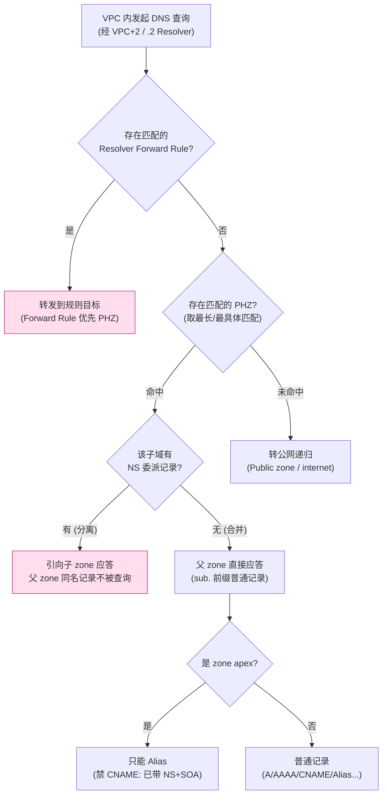
```mermaid
flowchart TD
    Q["VPC 内发起 DNS 查询<br/>(经 VPC+2 / .2 Resolver)"] --> FR{"存在匹配的<br/>Resolver Forward Rule?"}
    FR -- "是" --> FWD["转发到规则目标<br/>(Forward Rule 优先 PHZ)"]
    FR -- "否" --> PHZ{"存在匹配的 PHZ?<br/>(取最长/最具体匹配)"}
    PHZ -- "命中" --> SUB{"该子域有<br/>NS 委派记录?"}
    SUB -- "有 (分离)" --> CHILD["引向子 zone 应答<br/>父 zone 同名记录不被查询"]
    SUB -- "无 (合并)" --> PARENT["父 zone 直接应答<br/>(sub. 前缀普通记录)"]
    PHZ -- "未命中" --> PUB["转公网递归<br/>(Public zone / internet)"]

    PARENT --> APEX{"是 zone apex?"}
    APEX -- "是" --> ALIAS["只能 Alias<br/>(禁 CNAME: 已带 NS+SOA)"]
    APEX -- "否" --> REC["普通记录<br/>(A/AAAA/CNAME/Alias...)"]

    classDef warn fill:#fde,stroke:#b36;
    class FWD,CHILD warn;
```

> 图注：`Forward Rule > PHZ > 公网` 的优先级链跨 topic 05；本域重点是 **PHZ 最长匹配** 与 **NS 委派决定「子域走子 zone 还是父 zone」** 两个决策点。


================================================================================

# FILE: topics/02-records-and-alias.md
<!-- SOURCE FILE: topics/02-records-and-alias.md -->

# 02. 记录类型与 Alias

## 1. 概念（Concept）

### 1.1 支持的记录类型

Route 53 支持标准 DNS 记录类型，外加自有扩展 **Alias**（不是标准记录类型，是 R53 对 DNS 的专有扩展）。

标准类型：**A / AAAA / CAA / CNAME / DS / HTTPS / MX / NAPTR / NS / PTR / SOA / SPF / SRV / SSHFP / SVCB / TLSA / TXT**（外部 §3，`ResourceRecordTypes.html`）。内部研究常提到的子集：A / AAAA / CNAME / MX / TXT / PTR / SRV / SPF(不推荐) / NAPTR / CAA / NS / SOA。

> **新增记录类型（2024-10-30）**：Route 53 于 2024 年 10 月 30 日发布，新增支持 **SVCB / HTTPS / TLSA / SSHFP** 四种记录类型（AWS Networking & Content Delivery 博客 *"Improving security and performance with additional DNS resource record types in Amazon Route 53"*）。其中 **HTTPS/SVCB（RFC 9460）** 因涉及 apex 别名、HTTP/3 加速、ECH 等 SME 高频考点，单列 **§1.4 深度专节**；TLSA（DANE，RFC 6698）与 SSHFP（RFC 4255）为 DNSSEC 依赖型安全记录，见 §1.4 末尾对比。

各类型 SME 要点：
- **A** = IPv4 地址；**AAAA** = IPv6 地址。
- **CNAME** = 别名到另一个 DNS 名。**关键 DNS 规则：CNAME 不能与任何同名的其他类型记录共存** → 因此 **zone apex（裸域）不能建 CNAME**（apex 至少已有 NS + SOA）。
- **MX** = 邮件路由（含优先级）；**TXT** = 任意文本，用于 SPF/DKIM/DMARC/域名所有权验证；**SRV** = 服务定位（端口/权重/优先级）。
- **CAA** = 限制哪些 CA 可为域名签发证书；同样不能与同名 CNAME 共存。
- **NS / SOA** = 每个 hosted zone 在 apex 自动创建，是委派与权威信息的基础。
- **DS**（Delegation Signer）= DNSSEC 信任链，父 zone 持有子 zone 的 DS 记录。
- 域名尾点可选：`www.example.com` 与 `www.example.com.` 等价。

### 1.2 TTL 与 RRSET 轮换

- **TTL**：系统不为记录设默认 TTL，需自行设定（建议 60–172800 秒）。SOA 也可缩短 TTL，无副作用（内部 §2 QA-322）。
- **Simple RRSET 返回全部值并随机排序**：一个命名空间下 simple 记录只能有一条 RRSET；RRSET 内可含多个值，R53 name server 返回该 RRset 的**全部值并随机排序**（不是"每次最多 8 个"——8 值上限属于 **Multivalue answer** 路由策略）。单条 RRset 的值受配额约束（**每个 RRset 最多 400 个值/资源记录**）。这是 simple routing 的粗粒度"负载分散"，不是真正的负载均衡。

### 1.3 Alias vs CNAME（SME 高频七维对比）

Alias 记录把查询直接路由到选定 AWS 资源或**同 zone 内另一条记录**，R53 在权威侧直接返回目标 IP，隐藏背后的 ELB/CloudFront（外部 §4，`resource-record-sets-choosing-alias-non-alias.html`；内部 §2）。

| 维度 | Alias | CNAME |
|---|---|---|
| **可指向目标** | 选定 AWS 资源（CloudFront、S3 静态站点、ELB/ALB/NLB/CLB、API Gateway、VPC 接口端点、VPC Lattice、Global Accelerator、App Runner、Elastic Beanstalk、OpenSearch、AppSync 等）或**同 zone 内另一条记录（可为另一条 Alias——Alias 链受支持）** | 任意 DNS 名（含非 R53 托管的外部域名） |
| **Zone apex（裸域 example.com）** | **可以** | **不可以**（DNS RFC 禁止 CNAME 与 NS/SOA 共存） |
| **TTL** | 指向 AWS 资源时**不能设 TTL**（用资源默认 TTL）；指向同 zone 记录时用目标记录的 TTL | 可自设 TTL |
| **收费** | 指向 **AWS 资源的查询免费** | 正常按查询计费 |
| **性能（额外 lookup）** | R53 直接回 IP，**少一次 DNS 往返** | resolver 需**额外一次 DNS lookup** 去解析别名目标 |
| **目标健康感知** | 可设 **Evaluate Target Health（ETH）**——自动跟随资源 IP 变化并感知健康 | **无** ETH |
| **记录类型约束** | 同 zone 内目标通常要求 alias 与目标记录**同类型**；记录**类型取决于目标资源**（如 CloudFront 启用 IPv6 才加 AAAA，API Gateway/接口端点通常用 A），不能一概用 A/AAAA；zone apex 因不能建 CNAME，故 apex 处的 Alias **不能最终指向 CNAME 型**目标 | — |

补充边界：
- **Alias 链约束**：Alias 的 target **可以是同 zone 内另一条 Alias（Alias 链受支持）**；同 zone 内目标通常要求同类型，且 **zone apex 处的链不能最终指向 CNAME**。CNAME 的 target 也可以是 Alias/CNAME（内部 §2 QA-317）。整条 Alias 链若末端是合格 AWS 资源，查询仍免费。
- **付费归属**：Alias 指向 AWS 资源的常见查询免费；Alias 指向的**目标记录**查询由"被指向资源的所有者"付费；Alias 指向本 zone 内其他记录仍由本 zone 所有者付费（内部 §2）。
- **apex 指向 ELB/NLB**：apex 必须用 **A-Alias**（不能 CNAME）；子域两者皆可，但 Alias 免费且能配 ETH（内部 §2 QA-305）。

### 1.4 HTTPS / SVCB 记录深度（RFC 9460）★ SME 高频

SVCB（Service Binding，RR type **64**）与 HTTPS（RR type **65**）是 **RFC 9460**（2023-11，Standards Track）定义的一对记录。核心目的：在**建连之前**，把"该连哪个端点、走什么协议、用什么参数（含 TLS ClientHello 加密密钥）"通过一次 DNS 应答一并告诉客户端，减少往返、提升安全与隐私。HTTPS 是 SVCB 针对 `https`/`http` scheme 的**变体**（编码/格式/语义完全相同，只是省去 Attrleaf 下划线前缀）。

Route 53 于 **2024-10-30** 起支持 SVCB/HTTPS/TLSA/SSHFP。

#### 1.4.1 记录结构与两种模式

呈现格式（三字段，空格分隔）：`Name TTL IN HTTPS <SvcPriority> <TargetName> <SvcParams>`
- SVCB 的 owner name 需带 **端口 + 协议** 下划线前缀（Attrleaf，如 `_8443._foo.api.example.com`）；HTTPS **不带**前缀（`https`+443 时 owner name 就是服务名本身），这是两者主要区别。

**模式由 SvcPriority（优先级）字段决定**：
- **AliasMode（priority = 0）**：把一个名字别名到 `TargetName`，语义类似 CNAME，但**只作用于该 RR 类型的查询**（不像 CNAME 劫持整个名字的所有类型），因此**可用于 zone apex**——这是它相对 CNAME 的关键价值（apex 别名，CNAME 做不到）。AliasMode 里的 SvcParams 被**忽略**。
- **ServiceMode（priority ≥ 1，任意非 0 值）**：`TargetName` 是一个候选端点，后附一组 `key=value` 的 **SvcParam** 描述如何连它。可有多条 ServiceMode RR，**优先级越小越优先**；**同优先级的多条要随机洗牌**（均衡负载，注意 SVCB 只支持"均衡"随机，不像 SRV 有 weight 加权）。

优先级取值范围：**RFC 定义 0–65535；Route 53 只支持 0–32767**（SME 易错数字点）。

一个 apex AliasMode + 两条子域 ServiceMode 的典型例（来自 R53 博客）：
```
example.com.        300 IN HTTPS 0 www.example.com.
www.example.com.    300 IN HTTPS 1 host1.example.com. alpn="h3,h2" ipv4hint="192.0.2.34,198.51.100.103" ipv6hint="2001:db8:8f9::c8e1"
www.example.com.    300 IN HTTPS 2 host2.example.com. alpn="h2,http/1.1" ech="123abc456efh789ijk012mno"
```
判读：apex 用 priority 0 别名到 `www`；`host1`（priority 1，更优先）支持 HTTP/3+HTTP/2 并带 IP hint；`host2`（priority 2，次选）支持 HTTP/2+HTTP/1.1 并带 ECH 公钥。

> **AliasMode vs Route 53 Alias 的关键差异**：R53 自有 Alias 只能指向**受支持的 AWS 资源或同 zone 记录**；而 SVCB/HTTPS 的 **AliasMode 可别名到任意 DNS 名**（含外部）。二者都能用于 apex，但能指向的目标范围不同——别混为一谈。

#### 1.4.2 SvcParam（服务参数）逐个说清

RFC 9460 初始注册的 SvcParamKey（IANA "SvcParamKeys" 注册表，SVCB 系列共享）：

| Key（编号） | 含义 | 要点 |
|---|---|---|
| **mandatory**（0） | 声明本 RR 中哪些 key 是"必须理解"的 | 客户端不认其中任一 key 就**整条忽略**；自身永远"自动 mandatory"且不能列自己 |
| **alpn**（1） | 端点支持的 ALPN 协议列表（如 `h3,h2,http/1.1`） | 逗号分隔；客户端据此选传输（QUIC/TLS-over-TCP） |
| **no-default-alpn**（2） | 声明不含 scheme 默认 ALPN | 出现时**必须同时给 alpn** 才自洽 |
| **port**（3） | 非默认 TCP/UDP 端口 | 单个 0–65535 整数 |
| **ipv4hint**（4） | IPv4 地址提示 | 逗号分隔；仅在拿不到 TargetName 的 A/AAAA 时用，拿到就忽略 hint |
| **ech**（5） | Encrypted ClientHello 配置（base64） | **注意：RFC 9460 里 key 5 状态为 RESERVED（held for ECH）**，其正式格式随 ECH 草案（draft-ietf-tls-esni）演进；R53 已可配置该参数 |
| **ipv6hint**（6） | IPv6 地址提示 | 同 ipv4hint；给 v4hint 时 SHOULD 一并给 v6hint |
| **dohpath** | DoH 模板路径 | **来自 RFC 9461（DNS-over-HTTPS 的 SVCB 映射），不属 RFC 9460 初始集**——SME 别把它算进 9460 |
| **keyNNNNN** | 未知/私有参数的通用表示 | `key` 后接十进制编号（无前导零）；65280–65534 为 Private Use，65535 为 Invalid |

- **HTTPS scheme 的默认 ALPN 集 = `["http/1.1"]`；自动 mandatory 的 key = `port` 和 `no-default-alpn`。**
- **Route 53 不支持 `keyNNNNN` 通用未知参数格式**（只支持已命名的标准参数）——这是 R53 相对 RFC 的一个实现限制，SME 高频考点。

#### 1.4.3 主要用例：HTTP/3 加速 与 ECH

- **HTTP/3（QUIC）加速**：没有 HTTPS 记录时，客户端要先建 TCP+TLS、发 HTTP 请求、服务器用 `Alt-Svc` 头告知"我支持 QUIC"、客户端再另起 QUIC 连接（多次往返）。有了 HTTPS 记录（`alpn` 含 `h3`），客户端在 DNS 阶段就知道端点支持 HTTP/3，可直接发起 QUIC，**省掉多次往返**。这是 HTTPS 记录的头号价值。
- **ECH（Encrypted ClientHello）**：ESNI 的继任者，加密整个 ClientHello（不只是 SNI）。主流浏览器依赖 **HTTPS 记录**里的 `ech` 参数拿到服务器公钥来加密 ClientHello。因此 ECH ↔ HTTPS 记录强绑定。
- **HSTS 式升级**：HTTPS 记录的存在本身就是"请用 https 而非 http 连我"的信号（类似 HSTS 的 307 重定向语义）；但因 DNS 是不可信信道，客户端信任度不超过一个明文 HTTP 307。

#### 1.4.4 zone 类型支持差异 与 TLSA/SSHFP 对比（★ 高频考点）

- **HTTPS / SVCB**：**public HZ 和 private HZ（PHZ）都支持**。
- **TLSA / SSHFP**：**仅 public HZ 支持**，且依赖 **DNSSEC**——
  - **TLSA**（DANE，RFC 6698）：把 TLS 证书/公钥指纹放进 DNS，让客户端校验服务器证书是否为域名所有者预期。owner name 需带端口+协议前缀（`_25._tcp.mail.example.com`），值 = `usage selector matching-type cert-data` 四字段。头号用例 **SMTP over TLS（防降级攻击）**。必须 DNSSEC 签名才有信任链意义。
  - **SSHFP**（RFC 4255）：把 SSH 主机密钥指纹放进 DNS，防 SSH 首次连接盲信指纹（中间人）。值 = `key-algorithm hash-type fingerprint`。**必须 DNSSEC 签名**，且**校验要在客户端做**（客户端设 DO 位、解析器能做 DNSSEC 验证）。

一句话记忆：**HTTPS/SVCB → public+PHZ 皆可、DNSSEC 可选；TLSA/SSHFP → 仅 public、DNSSEC 必需。**


---

## 2. 真实案例说明（Real Case）

### Case 178602594200640（SP Global，★ apex A-Alias 指向 NLB）

**一句话**：客户把公网 apex 子域配成 **A (Alias) 指向 Kong NLB**，配置 100% 正确，但 VPC 内解析却返回旧 Apigee ELB —— 根因不在记录/Alias 本身，而在 VPC 解析优先级（Forward Rule 优先于公网）。

- **症状**：`soaapi-av.spgidev.spglobal.com` 在 Public HZ 配置为 `A (Alias) → kong-nlb-dev-av-migen-eks-soa-...elb.us-east-1.amazonaws.com`（HostedZoneID `Z26RNL4JYFTOTI` = NLB us-east-1），但客户 dig 得到旧 `internal-apigee-elb-9001`（10.95.145.77 / 10.95.146.46）。
- **本 topic 的落点**：这正是 Alias 指向 NLB 的**规范用法**——用 A-Alias 而非 CNAME 指向 NLB DNS 名，R53 直接返回 NLB 的 IP。案例里 `Evaluate Target Health: false`，说明客户没有开 ETH（本可开）。
- **根因（属 topic 05 Resolver）**：VPC 内有 `spglobal.com` Forward Rule 和 dot(.) 全局 Forward Rule，把查询转发到企业 Infoblox DNS，**Forward Rule 优先级高于 PHZ 高于公网**，所以公网 HZ 里那条正确的 Alias 记录根本没被查到。
- **教学价值**：即使记录/Alias 配得完全正确，"解析结果不对"也可能是解析路径被上游拦截。SME 要能区分"记录配置层"与"解析优先级层"两类根因——Alias→NLB 是本 topic 的正面范例，而它"看起来失效"的真实原因归入 topic 05。

---

## 3. 实验步骤（Hands-on Lab）

**主题**：建 apex A-Alias 指向 ELB 并开 Evaluate Target Health，对比同目标 CNAME 的 dig 往返差异。

前置：一个测试 public hosted zone（如 `lab.example.com`）+ 一个 ALB/NLB（拿到其 DNS 名与 canonical HostedZoneId）。

### 步骤 1：在 apex 建 A-Alias 指向 ELB（开 ETH）
```bash
# change-batch.json
{
  "Changes": [{
    "Action": "UPSERT",
    "ResourceRecordSet": {
      "Name": "lab.example.com.",
      "Type": "A",
      "AliasTarget": {
        "HostedZoneId": "<ELB-canonical-hosted-zone-id>",
        "DNSName": "<my-alb>.us-east-1.elb.amazonaws.com.",
        "EvaluateTargetHealth": true
      }
    }
  }]
}

aws route53 change-resource-record-sets \
  --hosted-zone-id <ZONEID> \
  --change-batch file://change-batch.json
```
预期：apex 成功建 A-Alias（若尝试在 apex 建 CNAME 会被 API 拒绝——验证"apex 不能 CNAME"）。

### 步骤 2：对比 dig 往返
```bash
# Alias（apex）：权威直接回 A 记录，无中间 CNAME
dig +noall +answer lab.example.com A
# 预期：lab.example.com.  <ttl>  A  <ELB-ip>   ← 直接是 IP，无 CNAME 链

# CNAME（子域）：先返回别名，再解析目标 → 多一跳
dig +noall +answer www.lab.example.com CNAME
# 预期：www.lab.example.com.  <ttl>  CNAME  <my-alb>...elb.amazonaws.com.
#      解析器需再查该目标的 A 记录，比 Alias 多一次往返
```
判读：Alias 应答里**看不到 ELB DNS 名**（只有最终 IP）；CNAME 应答**暴露 ELB DNS 名**且需额外 lookup。

### 步骤 3：验证 Alias 不接受 TTL / ETH 生效
- 在控制台或 API 尝试给指向 AWS 资源的 Alias 设 TTL → 不允许（用资源默认）。
- 把 ELB 目标健康检查打到不健康，开了 ETH 的 Alias 会随目标健康状态收敛（概念验证）。

### 清理
```bash
aws route53 change-resource-record-sets --hosted-zone-id <ZONEID> \
  --change-batch '{"Changes":[{"Action":"DELETE","ResourceRecordSet":{...}}]}'
```
（把 UPSERT 记录改为 DELETE，值需与现有记录完全一致。）

> 全程为只读/可控实验；不涉及需 2PR 的破坏性操作。

---

## 4. SME 考点 / 易错点（Exam Points & Pitfalls）

对应外部速记 **A. Alias vs CNAME（A1–A5）** + 本 topic 边界数字。

- **A1 — CNAME 不能位于 zone apex（裸域）；Alias 可以建在 apex。**
  - 准确说法：**apex 上不能建 CNAME**（DNS RFC 禁止 CNAME 与 apex 已有的 NS/SOA 共存），但 apex 可以有普通 **A/AAAA/MX/TXT** 等记录，也可以用 **Alias**。
  - 结论：apex 指向 ELB/CloudFront/S3/API GW 时用 **A/AAAA-Alias**（具体 A 还是 AAAA 取决于目标是否支持 IPv6）。
  - 常见错误：以为"给 apex 建个 CNAME 指向 ALB"就行——API 会拒绝，因为 apex 已有 NS/SOA，CNAME 不能与其共存。

- **A2 — Alias 指向 AWS 资源不能设 TTL（用资源默认）；指向同 zone 记录用目标记录的 TTL。**
  - 常见错误：以为可以给 Alias 单独调 TTL 来控制缓存时长。

- **A3 — Alias 指向 AWS 资源的查询免费；CNAME 正常计费且多一次 DNS 往返。**
  - 结论：成本 + 性能双优，能用 Alias 就别用 CNAME 指 AWS 资源。
  - 常见错误：忽略 CNAME 的**额外 lookup**（多一跳）与计费。

- **A4 — Alias 目标限选定 AWS 资源或同 zone 记录（可含另一条 Alias）；CNAME 可指任意 DNS 名（含外部）。**
  - 结论：要指向**外部/非 R53 托管**域名，只能用 CNAME；Alias 做不到。记录类型取决于目标资源（如 CloudFront 启 IPv6 才加 AAAA），不要一概认为都是 A/AAAA。
  - 常见错误：想用 Alias 指向第三方域名。

- **A5 — Alias 有 Evaluate Target Health；CNAME 无。**
  - 结论：Alias→可建 alias 的 AWS 资源做 failover 时，用 **ETH=Yes**，**不要再单独建健康检查**（外部 §4 / A14 易错点）。
  - 常见错误：既开 ETH 又另建独立 HC，或对 CNAME 期望有健康感知。

**Alias 链 / apex 类型约束（补）**：
- Alias 的 target **可以是同 zone 内另一条 Alias（Alias 链受支持）**；zone apex 处的链**不能最终指向 CNAME**（apex 用 A/AAAA-Alias）。

**HTTPS / SVCB / TLSA / SSHFP 考点（RFC 9460 深度，2024-10 R53 新增）**：
- **H1 — priority 0 = AliasMode，非 0 = ServiceMode。** AliasMode 可用于 apex（只作用于该 RR 类型，不像 CNAME 劫持整名），SvcParams 被忽略；ServiceMode 才带 SvcParam。常见错误：以为 priority 只是排序，忽略"0 切换成别名模式"这一语义。
- **H2 — R53 优先级只支持 0–32767，RFC 是 0–65535。** 数字点必背。
- **H3 — R53 不支持 `keyNNNNN` 通用未知参数格式**，只支持已命名标准参数（mandatory/alpn/no-default-alpn/port/ipv4hint/ipv6hint/ech）。
- **H4 — SVCB/HTTPS AliasMode 可别名到任意 DNS 名（含外部）**，比 R53 自有 Alias（只能指 AWS 资源/同 zone）范围更大；两者都能用于 apex，别混淆。
- **H5 — 头号用例是 HTTP/3 加速（alpn=h3，省往返）与 ECH（ech 参数携带公钥）。** HTTPS 记录存在即"请走 https"（HSTS 式信号）。
- **H6 — zone 类型：HTTPS/SVCB 支持 public + PHZ；TLSA/SSHFP 仅 public，且必须 DNSSEC 签名。** SSHFP 校验须在客户端做。常见错误：想在 PHZ 里配 TLSA/SSHFP，或忘了 TLSA/SSHFP 的 DNSSEC 依赖。
- **H7 — SVCB owner name 带端口+协议下划线前缀；HTTPS 不带（https+443 时就是服务名）。** TLSA owner name 也带 `_port._proto` 前缀。

**记录类型速记（补）**：- **CNAME 不能与同名其他类型共存** → CNAME 不能位于 apex；apex 可用 Alias，也可有普通 A/AAAA/MX/TXT 等记录。
- **RRSET 返回全部值并随机排序**（simple routing）；这是分散不是负载均衡（"最多 8 个值"是 Multivalue answer 的特性，非 Simple；单 RRset 配额 400 个值）。
- **TTL 无默认值，需自设**（60–172800 秒建议区间）；SOA 缩短 TTL 无副作用。
- **免费边界**：仅"Alias 指向 **AWS 资源**"的查询免费；Alias 指向同 zone 普通记录、CNAME、非 AWS 目标均正常计费。

---

## 5. 该域 Mermaid 逻辑导图（Logic Diagram）

"该用 Alias 还是 CNAME"决策树 + 记录类型约束：

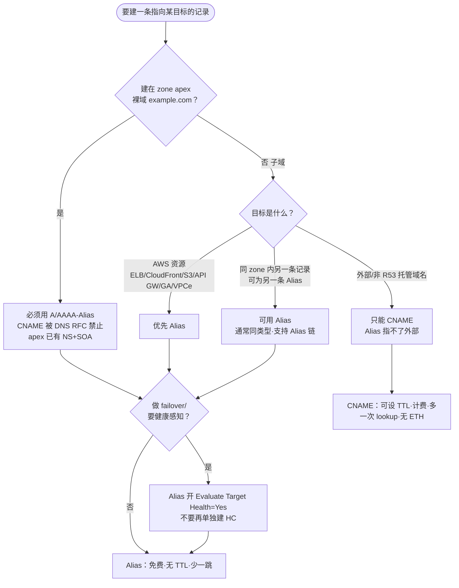
```mermaid
flowchart TD
    START([要建一条指向某目标的记录]) --> APEX{建在 zone apex<br/>裸域 example.com？}

    APEX -->|是| MUSTALIAS[必须用 A/AAAA-Alias<br/>CNAME 被 DNS RFC 禁止<br/>apex 已有 NS+SOA]
    APEX -->|否 子域| TARGET{目标是什么？}

    TARGET -->|AWS 资源<br/>ELB/CloudFront/S3/API GW/GA/VPCe| PREFERALIAS[优先 Alias]
    TARGET -->|外部/非 R53 托管域名| MUSTCNAME[只能 CNAME<br/>Alias 指不了外部]
    TARGET -->|同 zone 内另一条记录<br/>可为另一条 Alias| ALIASOK[可用 Alias<br/>通常同类型·支持 Alias 链]

    MUSTALIAS --> ETH{做 failover/<br/>要健康感知？}
    PREFERALIAS --> ETH
    ALIASOK --> ETH
    ETH -->|是| SETETH[Alias 开 Evaluate Target Health=Yes<br/>不要再单独建 HC]
    ETH -->|否| DONEA[Alias：免费·无 TTL·少一跳]

    MUSTCNAME --> DONEC[CNAME：可设 TTL·计费·多一次 lookup·无 ETH]

    SETETH --> DONEA
```

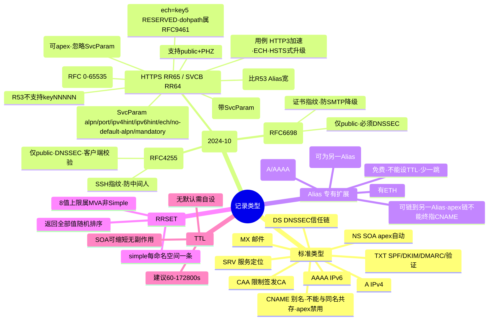
```mermaid
mindmap
  root((记录类型))
    标准类型
      A IPv4
      AAAA IPv6
      CNAME 别名·不能与同名共存·apex禁用
      MX 邮件
      TXT SPF/DKIM/DMARC/验证
      SRV 服务定位
      CAA 限制签发CA
      NS SOA apex自动
      DS DNSSEC信任链
    新增RFC9460类(2024-10)
      HTTPS RR65 / SVCB RR64
        priority0=AliasMode(可apex·忽略SvcParam)
        priority非0=ServiceMode(带SvcParam)
        R53优先级0-32767(RFC 0-65535)
        SvcParam alpn/port/ipv4hint/ipv6hint/ech/no-default-alpn/mandatory
        ech=key5 RESERVED·dohpath属RFC9461
        R53不支持keyNNNNN
        AliasMode可指任意名(比R53 Alias宽)
        用例 HTTP3加速·ECH·HSTS式升级
        支持public+PHZ
      TLSA DANE(RFC6698)
        证书指纹·防SMTP降级
        仅public·必须DNSSEC
      SSHFP(RFC4255)
        SSH指纹·防中间人
        仅public·DNSSEC·客户端校验
    Alias 专有扩展
      指AWS资源或同zone记录(可为另一Alias)
      apex可建 类型随目标(A/AAAA)
      免费·不能设TTL·少一跳
      有ETH
      可链到另一Alias·apex链不能终指CNAME
    RRSET
      simple每命名空间一条
      返回全部值随机排序
      8值上限属MVA非Simple
    TTL
      无默认需自设
      建议60-172800s
      SOA可缩短无副作用
```

---

## 来源锚点

- **外部**：`ResourceRecordTypes.html`（记录类型）、`resource-record-sets-choosing-alias-non-alias.html`（Alias vs CNAME）；r53-external-research.md §3、§4、速记 A1–A5。
- **HTTPS/SVCB 深度（§1.4）**：**RFC 9460**（SVCB/HTTPS，2023-11，SvcPriority/AliasMode/ServiceMode/SvcParamKeys/IANA 注册表 mandatory=0·alpn=1·no-default-alpn=2·port=3·ipv4hint=4·ech=5 RESERVED·ipv6hint=6·keyNNNNN·HTTP mapping 默认 alpn=http/1.1、自动 mandatory=port+no-default-alpn）；**RFC 9461**（`dohpath` 等 DoH 的 SVCB 映射，非 9460 初始集）；**RFC 6698**（DANE/TLSA）、**RFC 4255**（SSHFP）；AWS 博客 *Improving security and performance with additional DNS resource record types in Amazon Route 53*（2024-10-30，R53 支持 SVCB/HTTPS/TLSA/SSHFP、优先级 0–32767、apex AliasMode 例、ECH/HTTP3 用例、DNSSEC 依赖）；`ResourceRecordTypes.html#SVCBFormat` / `#TLSAFormat` / `#SSHFPFormat`。
- **内部**：r53-internal-research.md §2（记录类型与 ALIAS、TTL、Simple RRSET 返回全部值随机排序、Alias 链 QA-317、apex A-Alias 指 NLB QA-305）；R53PublicDNS / TAM Field Guides。
- **绑定 case**：178602594200640（apex A-Alias 指向 Kong NLB 的规范配置；解析"看似失效"的真实根因归 topic 05）。


================================================================================

# FILE: topics/03-routing-policies.md
<!-- SOURCE FILE: topics/03-routing-policies.md -->

# 03. 路由策略（8 种）

## 1. 概念（Concept）

Route 53 用**路由策略**决定"对一条查询返回哪个（些）记录值"。同一命名空间下、同名同类型的一组记录只能用**同一种**路由策略。总览见外部 §5（`routing-policy.html`）、内部 §3（R53PublicDNS / kyoheibb / TSR53DNSService）。

### 1.1 八种策略逐个

1. **Simple（简单）**
   - 单资源、单条 RRSET；一条记录内可含多个值，权威 NS 返回该 RRset 的**全部值并随机排序**（这是粗粒度分散，不是负载均衡）。单 RRset 值的数量受**单 RRset 配额 400 条**约束（并非"最多 8 值"，8 值上限是 Multivalue 的特性）。
   - **不能关联健康检查**（simple 记录本身无 HC 概念）。PHZ 里可建。
   - 外部 §5.1 `routing-policy-simple.html`；内部 §3。

2. **Weighted（加权）**
   - 按权重比例分流：某记录流量占比 = 该记录 weight ÷ 组内所有 weight 之和。
   - **weight 上限 255**（单条）。可关联健康检查。
   - **权重 0 的行为（考点）**：单条设 0 = 停止该记录流量；零权重记录本身仍受健康检查影响。**仅当组内所有非 0 权重记录都不健康时**，才会考虑启用 0 权重记录——但此时是 fail-open 后**仍按权重选取**，零权重记录不会自动成为唯一兜底（组内全 0 时才对 0 权重记录平均分）。
   - 实务：同一个 ELB 可被多条加权记录引用，以实现比 256 更细的分配（内部 §3 QA-483）。加权是**概率分布**：要观察实际分配比例需直接向权威 NS 采样，样本量按统计目标定，1–2 次查询看不出。
   - 外部 §5.8 `routing-policy-weighted.html`；内部 §3 TSR53DNSService。

3. **Latency（延迟）**
   - 多 Region 部署时，路由到对用户**延迟最低的 AWS Region** 的资源；每条记录**必须指定一个 AWS Region**，但目标资源**可以在 AWS 之外**（延迟依据是用户到该 AWS 数据中心的测量，故对外部资源可能不准）。
   - 基于 AWS **长期测量**的延迟数据（**非实时**），会随网络状况漂移；数据只覆盖到 AWS 数据中心之间的流量。
   - 外部 §5.5 `routing-policy-latency.html`；内部 §3。

4. **Failover（故障转移）**
   - active-passive 主备：Primary 健康回 Primary，Primary 不健康回 Secondary。
   - **要实现有效的故障转移，Primary 需关联健康检查（HC），或对 Alias Primary 启用 EvaluateTargetHealth（ETH）**；无 HC 的记录会被视为**始终健康**，Primary 因此不会切到 Secondary（并非"无法创建 failover 策略"）。
   - **考点（fail-open）**：仅当 Primary 与 Secondary **都真正参与健康评估**且**都不健康时 → R53 返回 Primary**（fail open 到 primary），此行为**不可配置**（内部 §3 QA-337）。注意 Secondary 无 HC 时始终健康，此时不存在"两者均不健康"的情形。
   - 外部 §5.2 `routing-policy-failover.html`；内部 §3。

5. **Geolocation（地理位置）**
   - 按**用户所在地（查询来源地）**路由，粒度可到大洲 / 国家 / 美国州。
   - 重叠时**最小地理区优先**（Canada 优先于 North America）。
   - **可建 default 记录兜底**无法映射的来源；**若无 default，未覆盖来源返回 "no answer"**（考点，见下）。
   - 外部 §5.3 `routing-policy-geo.html`；内部 §3。

6. **Geoproximity（地理邻近）**
   - 按**资源位置 + 用户位置**路由到"最近"资源，且可用 **bias** 扩张/收缩某资源的地理吸引范围。
   - **bias 范围 -99..99（含 0）**：**0 = 无偏移**；**正 bias（+1..+99）扩大**本资源吸引范围（相应缩小相邻资源），**负 bias（-1..-99）缩小**本资源范围。
   - **不再必须使用 Traffic Flow**：自 2024 起可通过普通记录 / API / CLI / SDK 直接创建 geoproximity 记录；**仅地图可视化仍限 Traffic Flow**。
   - **同名同类型 geoproximity 记录上限仅 30**（其他分散型策略是 100，见 topic 12 配额）。
   - 外部 §5.4 `routing-policy-geoproximity.html`；内部 §3。

7. **Multivalue answer（多值应答，MVA）**
   - 正常随机返回**最多 8 条健康记录**，每条可各带健康检查；**当全部记录都不健康时 fail-open，返回最多 8 条（不健康的）记录**。
   - 是"带健康检查的简单负载分散"，**不是 ELB 替代**（无真正负载均衡 / 会话保持）。
   - 外部 §5.7 `routing-policy-multivalue.html`；内部 §3。

8. **IP-based（基于 IP）**
   - 按**客户端源 IP** 的 CIDR-to-endpoint 映射路由（CIDR collection / location / block）。
   - **匹配规则**：查询源 CIDR 比集合中某项更长（更具体）时，匹配到那个**较短**的指定 CIDR。掩码范围：普通条目 **IPv4 /1–/24、IPv6 /1–/48**；可设**默认位置 `*`（相当于 /0，IPv6 为 `::/0`）** 兜底，无匹配且**无默认 `*`** 时返回 **NODATA**。
   - **PHZ 不支持 IP-based**（PHZ 只支持 simple/failover/multivalue/weighted/latency/geolocation/geoproximity）。
   - 外部 §5.6 `routing-policy-ipbased.html`；内部 §3 TSR53DNSService。

### 1.2 EDNS0 / ECS（地理与延迟类策略正确性的核心）

- geolocation / geoproximity / latency / IP-based 依赖"客户端在哪"。若中间 resolver 支持 **EDNS0 的 edns-client-subnet (ECS)**，R53 权威 NS 能拿到用户 IP 的**截断前缀**来更准确估位；不支持 ECS 时，只能用 **resolver 自身的源 IP** 近似判断，可能定位错误。
- **VPC 的 .2 resolver 支持 EDNS0，但不支持 ECS**（考点，内部 §3 / 附录速记）。
- **PHZ 不使用 EDNS0**，改用所在 AWS Region 的 VPC Resolver 数据做路由决策（见绑定 case 分析）。
- 检测 resolver 是否支持 ECS：`dig TXT o-o.myaddr.google.com -4`（或 `host -t txt o-o.myaddr.google.com.`），响应含 `edns0-client-subnet` 即支持。R53 对 ECS 的支持说明见 AWS Knowledge Center 文章 [route-53-resolver-edns-client-subnet](https://repost.aws/knowledge-center/route-53-resolver-edns-client-subnet)（如需在特定域名上验证，将命令中的检测域名替换为目标域名）。
- GeoIP 库：R53 用第三方商业 IP 地理库（内部指引：**MaxMind**），**AWS 官方不公开披露具体供应商**（见绑定 case）。外部 §5.5/§15 `routing-policy-edns0.html`。

### 1.3 八种策略对比表

| 策略 | 依据 | 健康检查 | 关键边界 | PHZ 支持 | 典型场景信号词 |
|---|---|---|---|---|---|
| Simple | 单资源 | **不支持** | 返回 RRset 全部值随机排序（单 RRset 配额 400） | ✅ | 单一后端、无需分流/健康感知 |
| Weighted | 你设的权重比例 | 支持 | **weight ≤255**；权重 0=停流量（全非0不健康才启用0） | ✅ | 灰度/金丝雀、A/B、按比例分流 |
| Latency | AWS 实测网络延迟（非实时） | 支持 | 须指定 AWS Region，目标可在 AWS 外；数据会漂移 | ✅ | 多 Region 求"最低延迟/性能" |
| Failover | Primary/Secondary + HC | **Primary 需 HC 或 ETH 才能有效切换** | 主备都不健康→**返回 Primary（fail open）** | ✅ | active-passive 主备灾备 |
| Geolocation | **用户位置** | 支持 | 重叠取最小区；**无 default→"no answer"** | ✅ | 按国家/州做内容合规、本地化 |
| Geoproximity | **资源+用户位置** | 支持 | **bias -99..99（含0）**；仅可视化需 Traffic Flow；上限 **30** | ✅ | 按地理距离+可调边界的流量再平衡 |
| Multivalue | 随机健康记录 | 支持（每条） | **最多 8 值**；全挂 fail-open 返回不健康记录；非 ELB 替代 | ✅ | DNS 级简单分散+健康剔除 |
| IP-based | **客户端源 IP CIDR** | 支持 | 最长匹配到较短 CIDR；无`*`→NODATA | **❌不支持** | 按已知客户端 IP 段定向（ISP/专线） |

**Weighted vs Latency（高频区分）**：weighted 按**你设的比例**分（负载/灰度）；latency 按 **AWS 测得的网络延迟**（多 Region 性能）。latency 非实时、会漂移、只覆盖到 AWS 数据中心。

**Geolocation vs Geoproximity（高频区分）**：geolocation **只看用户位置**、按大洲/国家/州、重叠取最小区、可设 default 兜底；geoproximity **看资源+用户位置**、可用 **bias（-99..99，含 0）** 移动边界、**仅地图可视化需 Traffic Flow（记录本身可直接创建）**、上限仅 **30**。

---

## 2. 真实案例说明（Real Case）

### Case 178246722300140（Goclouds Data / oasgames.com，★ Geolocation GeoIP + EDNS0）

**一句话**：客户（游戏公司，PLS 合作伙伴）准备用 **Geolocation Routing**，问两件事——① R53 用的 IP 地理库是什么？② 更新频率？根因不是故障，而是对 geolocation **定位机制与边界**的 SME 级理解。

- **落点 1 — IP 库**：R53 geolocation 用**第三方商业 IP 地理库将 IP → 地理位置**；内部指引明确是 **MaxMind**，但**不对客户披露供应商名**（"Do not disclose to customer about the database we use"）。回复用"业界领先的第三方商业 IP 地理定位数据库 + 商业协议限制不便披露"表述。
- **落点 2 — 更新频率**：MaxMind 通常**每周更新一次**（约周二晚），R53 在其发布后自动摄取；但 **R53 传播时间 AWS 无公开承诺**。对客户只说"会定期更新、AWS 持续跟进"，不给具体周期。
- **落点 3 — 判定机制（EDNS0/ECS）**：resolver 支持 EDNS0/ECS 时，R53 用用户 IP 的**截断前缀**更精确定位；不支持时用 **resolver 源 IP** 近似（可能定位偏差）。**PHZ 不使用 EDNS0**，改用所在 Region 的 VPC Resolver 数据。
- **落点 4 — 必配 default（本 topic 硬考点）**：部分 IP 无法映射到任何地理位置，**必须建 Default 记录兜底**，否则这些查询得到 **"no answer"**。回复把"务必建 Default 记录"列为首要建议。
- **落点 5 — 准确性**：国家级映射准确率约 **99.8%**（引 WAF FAQ 公开口径，同库）；粒度越细（省/州）准确率越低。
- **教学价值**：一个"纯咨询"case 串起 geolocation 的三大 SME 要点——**GeoIP 库不披露、default 兜底否则 no answer、EDNS0/ECS 决定定位精度（且 .2 resolver 不支持 ECS、PHZ 不用 EDNS0）**。这三点都是考试反复出现的正误分界。

> 关联：本 case 也是 topic 12（配额/集成）与 topic 05（Resolver/EDNS0）的交叉锚点；failover 设计参考 case 178782060900806（见 topic 01/13）。

---

## 3. 实验步骤（Hands-on Lab）

> 主题（取自驱动表）：**建多个路由策略实验、观察实际解析**——重点做加权比例实测与 ECS 支持检测。全程只读/可控，不涉及需 2PR 的破坏性操作。

前置：一个测试 public hosted zone（如 `lab.example.com`）+ 两个可区分的目标（如两台 EC2 的 EIP，记为 IP_A / IP_B）。先用 `dig NS lab.example.com +short` 拿到该 zone 的 4 个权威 NS。

### 实验 A：加权路由按权重实测分配比例
```bash
# 1) 建两条同名同类型 weighted 记录：A 权重 90，B 权重 10
cat > weighted.json <<'JSON'
{"Changes":[
 {"Action":"UPSERT","ResourceRecordSet":{
   "Name":"w.lab.example.com.","Type":"A","TTL":10,
   "SetIdentifier":"A-90","Weight":90,
   "ResourceRecords":[{"Value":"IP_A"}]}},
 {"Action":"UPSERT","ResourceRecordSet":{
   "Name":"w.lab.example.com.","Type":"A","TTL":10,
   "SetIdentifier":"B-10","Weight":10,
   "ResourceRecords":[{"Value":"IP_B"}]}}
]}
JSON
aws route53 change-resource-record-sets --hosted-zone-id <ZONEID> --change-batch file://weighted.json

# 2) 向权威 NS 采样统计比例（避免 resolver 缓存干扰）；加权是概率分布，
#    样本量按你的统计目标定（样本越大比例越稳），此处示例取若干千次
NS=$(dig NS lab.example.com +short | head -1)
for i in $(seq 1 5000); do dig @"$NS" w.lab.example.com A +short; done | sort | uniq -c
# 预期：IP_A 与 IP_B 约呈 90:10。样本太小（1-2 次）看不出分布，是概率抽样不是精确配额。
```
判读：直接向权威 NS 采样能减少缓存干扰、更快看出概率分布；经缓存/单次查询会误判"加权没生效"。此处顺序循环只是采样手段，并非 AWS 要求的"必须并发/必须直查权威 NS"。

**权重 0 观察**：把 B 改成 weight 0 → 正常只返回 A；再对 A 挂一个**不健康**的 HC → 此时 B（0 权重）才被启用（验证"仅当所有非 0 权重不健康才用 0 权重"）。

### 实验 B：Geolocation + Default 兜底
```bash
# 建：CN→IP_A，default(*)→IP_B
cat > geo.json <<'JSON'
{"Changes":[
 {"Action":"UPSERT","ResourceRecordSet":{
   "Name":"g.lab.example.com.","Type":"A","TTL":30,
   "SetIdentifier":"cn","GeoLocation":{"CountryCode":"CN"},
   "ResourceRecords":[{"Value":"IP_A"}]}},
 {"Action":"UPSERT","ResourceRecordSet":{
   "Name":"g.lab.example.com.","Type":"A","TTL":30,
   "SetIdentifier":"default","GeoLocation":{"CountryCode":"*"},
   "ResourceRecords":[{"Value":"IP_B"}]}}
]}
JSON
aws route53 change-resource-record-sets --hosted-zone-id <ZONEID> --change-batch file://geo.json
```
- 用**控制台 "Test record"**（`dns-test.html`）模拟不同来源国/不同 resolver IP，看命中 CN 还是 default。
- **对照实验**：删除 default 记录后，从"未覆盖来源"测试 → 观察返回 **"no answer"**（坐实"无 default → no answer"考点）。

### 实验 C：检测 resolver 是否支持 EDNS Client Subnet (ECS)
```bash
dig TXT o-o.myaddr.google.com -4 +short
# 响应含 edns0-client-subnet=<你的前缀>  → 该 resolver 支持 ECS，geo/latency 定位更准
# 只回 resolver 自身 IP、无 edns0-client-subnet → 不支持 ECS，按 resolver IP 近似
# 在 VPC 内对 .2 resolver 做同样查询：可观察到 EDNS0 存在但无 ECS
```

### 清理
把上述各 `UPSERT` 改为 `DELETE`（值须与现有记录完全一致）后重放，删掉 `w./g.` 实验记录。

---

## 4. SME 考点 / 易错点（Exam Points & Pitfalls）

对应外部速记 **B. 路由策略对比 / 边界（B6–B12）** + 本域内部边界数字。每条给"考点结论 + 常见错误认知"。

- **B6 — Weighted vs Latency**
  - 结论：weighted = 你设的比例（负载/灰度）；latency = AWS 测得的网络延迟（多 Region 性能），**非实时、会漂移、只覆盖到 AWS 数据中心**。
  - 常见错误：以为 latency 是"实时探测"或能覆盖到客户端的真实网络路径。

- **B7 — Geolocation vs Geoproximity**
  - 结论：geolocation **只看用户位置**、大洲/国家/州、重叠取最小区、可设 default；geoproximity **看资源+用户位置**、可用 **bias -99..99（含 0）** 移动边界、**仅地图可视化需 Traffic Flow**、上限 **30**。
  - 常见错误：把两者混为一谈；以为 geolocation 也能调"吸引范围"（那是 geoproximity 的 bias）。

- **B8 — Geolocation 无 default → "no answer"**
  - 结论：未映射/未覆盖来源，**没有 default 记录就返回 "no answer"**（不是随便挑一个）。
  - 常见错误：以为 R53 会兜底返回某个记录——必须显式建 default（`CountryCode:"*"`）。

- **B9 — Multivalue answer 最多 8 个健康记录、带健康检查，但不是 ELB 替代**
  - 结论：MVA 是 DNS 级简单分散 + 健康剔除，正常返回最多 8 条健康记录；**全部不健康时 fail-open，返回最多 8 条不健康记录**；**无真正负载均衡/会话保持**。
  - 常见错误：拿 MVA 当负载均衡器用；以为全挂时"什么都不返回"。

- **B10 — Simple 路由不能关联健康检查**
  - 结论：simple 记录无 HC；要健康感知就换 failover/MVA/weighted+HC 或用 Alias+ETH。
  - 常见错误：想给 simple 记录直接挂 HC。

- **B11 — IP-based 在 PHZ 不支持**
  - 结论：PHZ 仅支持 simple/failover/multivalue/weighted/latency/geolocation/geoproximity；**IP-based 只能在 public zone**。
  - 常见错误：在 PHZ 里尝试建 IP-based 记录。（IP-based 无默认 `*` 且不匹配 → **NODATA**。）

- **B12 — Weighted 权重 0**
  - 结论：单条设 0 = 停该记录流量；**仅当所有非 0 权重记录都不健康时**才启用 0 权重记录（全 0 才对 0 权重平均分）。
  - 常见错误：以为设 0 就是"永远不返回"——它在"非 0 全挂"时会成为兜底。

**本域内部边界数字速记（补）**：
- **weight 上限 255**（单条）。
- **geoproximity bias 范围 -99..99（含 0，0=无偏移）**；**同名同类型 geoproximity 上限 30**（其他分散型策略 100）。
- **Simple 返回 RRset 全部值并随机排序**（单 RRset 配额 400）；**MVA 每查询最多 8 值**（随机取健康记录，全挂 fail-open 返回不健康记录）。
- **Failover**：Primary 需 HC 或 Alias ETH 才能有效切换（无 HC 视为始终健康）；**主备都参与评估且都不健康 → 返回 Primary（fail open，不可配置）**。
- **VPC .2 resolver 支持 EDNS0 但不支持 ECS**；**PHZ 不用 EDNS0**（用所在 Region VPC Resolver 数据）。
- **GeoIP 库**：第三方商业库（内部：MaxMind），**不对客户披露**；国家级准确率约 **99.8%**。
- 加权是概率分布，观察实际比例需向权威 NS 采样，样本量按统计目标定（样本越大越稳）；缓存/单次查询会误判。

---

## 5. 该域 Mermaid 逻辑导图（Logic Diagram）

"按需求选路由策略"决策树 + geolocation 定位链：

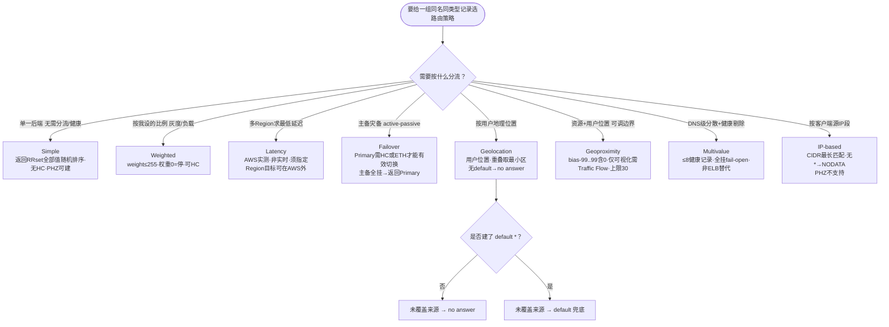
```mermaid
flowchart TD
    START([要给一组同名同类型记录选路由策略]) --> Q1{需要按什么分流？}

    Q1 -->|单一后端 无需分流/健康| SIMPLE[Simple<br/>返回RRset全部值随机排序·无HC·PHZ可建]
    Q1 -->|按我设的比例 灰度/负载| WEIGHTED[Weighted<br/>weight≤255·权重0=停·可HC]
    Q1 -->|多Region求最低延迟| LATENCY[Latency<br/>AWS实测·非实时·须指定Region目标可在AWS外]
    Q1 -->|主备灾备 active-passive| FAILOVER[Failover<br/>Primary需HC或ETH才能有效切换<br/>主备全挂→返回Primary]
    Q1 -->|按用户地理位置| GEOLOC[Geolocation<br/>用户位置·重叠取最小区<br/>无default→no answer]
    Q1 -->|资源+用户位置 可调边界| GEOPROX[Geoproximity<br/>bias-99..99含0·仅可视化需Traffic Flow·上限30]
    Q1 -->|DNS级分散+健康剔除| MVA[Multivalue<br/>≤8健康记录·全挂fail-open·非ELB替代]
    Q1 -->|按客户端源IP段| IPBASED[IP-based<br/>CIDR最长匹配·无*→NODATA<br/>PHZ不支持]

    GEOLOC --> HASDEF{是否建了 default *？}
    HASDEF -->|否| NOANS[未覆盖来源 → no answer]
    HASDEF -->|是| OKGEO[未覆盖来源 → default 兜底]
```

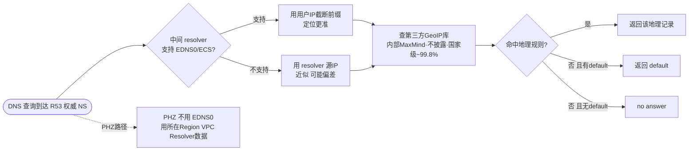
```mermaid
flowchart LR
    Q([DNS 查询到达 R53 权威 NS]) --> ECS{中间 resolver<br/>支持 EDNS0/ECS?}
    ECS -->|支持| SUB[用用户IP截断前缀<br/>定位更准]
    ECS -->|不支持| RIP[用 resolver 源IP<br/>近似 可能偏差]
    SUB --> GEOIP[查第三方GeoIP库<br/>内部MaxMind·不披露·国家级~99.8%]
    RIP --> GEOIP
    GEOIP --> DEC{命中地理规则?}
    DEC -->|是| RET[返回该地理记录]
    DEC -->|否 且有default| RETDEF[返回 default]
    DEC -->|否 且无default| NOANS2[no answer]
    note1[PHZ 不用 EDNS0<br/>用所在Region VPC Resolver数据]
    Q -.PHZ路径.-> note1
```

---

## 来源锚点

- **外部**：`routing-policy.html`（总览）、`routing-policy-simple/failover/geo/geoproximity/latency/ipbased/multivalue/weighted.html`（八策略）、`routing-policy-edns0.html`（EDNS0/ECS）；r53-external-research.md §5、§15 速记 B6–B12。
- **内部**：r53-internal-research.md §3（八策略逐条、weight≤255、权重0、failover fail-open QA-337、geoproximity bias/上限30、IP-based NODATA、EDNS0/ECS 与 .2 不支持 ECS、加权按概率分布采样 QA-483）；R53PublicDNS / kyoheibb / TSR53DNSService。
- **绑定 case**：178246722300140（Goclouds Data / oasgames.com，Geolocation GeoIP 库不披露 + 更新频率 + EDNS0/ECS + 必配 default 否则 no answer + 国家级 ~99.8% 准确率）。


================================================================================

# FILE: topics/03b-routing-failover-deepdive.md
<!-- SOURCE FILE: topics/03b-routing-failover-deepdive.md -->

# 03b. 路由策略 × 健康检查 × Failover 交互决策（深度专题）

> **定位**：SME 最高频、最易错的交叉区。单看 topic 03（路由策略）或 topic 04（健康检查）都不够——真正的陷阱都出在"某路由策略 **绑定 HC 之后** 到底怎么应答"这个交叉点上。本专题把这条交叉线一次性钉死。
> **来源锚点**：topics/03-routing-policies.md（八策略 + fail-open）、topics/04-health-checks.md（四类 HC + 18% 规则 + ETH 绑定）、exam/codex-review-findings.md（topic 03 第 3/4/5/8 项、topic 04 全部）。
> **核心心法（背记）**：Route 53 的 DNS 层设计原则是 **"宁可返回一个可能坏的答案，也不返回空"**——所以几乎所有"全挂"场景的终局都是 **fail-open**，而不是 no answer。唯一的例外是 **geolocation 无 default** 和 **IP-based 无 `*`**，那不是"全挂"而是"根本没匹配上规则"。把这两类分清，本域大半陷阱自解。

---

## 1. 各路由策略绑定 HC 后的完整行为

先建立统一的判读框架：一条记录能否被返回，取决于三层串联——

1. **该记录是否"参与健康评估"**：绑定了独立 HC，或（对 alias）开了 Evaluate Target Health（ETH）。**没有任何一个 = 该记录"永远健康"**（见第 4 节的核心陷阱）。
2. **参与评估者的健康判定**：Endpoint 走 18% 规则、Calculated 走子检查计数、CloudWatch 走 alarm 数据流（详见 topic 04）。
3. **策略层的选取 + fail-open 兜底**：当"该选的都不健康"时，各策略如何兜底。

下面逐策略给出**绑定 HC 后的完整行为**，重点是每种策略的 **fail-open / 无匹配 终局**。

### 1.1 Weighted（加权）+ HC — 含 0-weight 与全挂

| 场景 | 行为 |
|---|---|
| 组内有健康记录 | 只在**健康**记录中按权重比例分流；不健康记录被剔除，其权重份额按比例重分给健康记录 |
| 单条 weight=0 | 该记录停流量；但它**本身仍受 HC 影响**（0 权重 ≠ 不评估健康） |
| **所有非 0 权重记录都不健康** | 才开始考虑 **0 权重记录**；此时若 0 权重记录健康则返回它 |
| **全部记录（含 0 权重）都不健康** | **fail-open**：按权重在**全部（不健康）记录**里选取——0 权重记录**不会**自动变成唯一兜底 |
| 组内全部 weight=0 | 对 0 权重记录做**平均**分配（等价均分） |

> **易错点（codex-review-findings topic 03 第 5 项）**：很多人以为"设 weight=0 就是永远不返回"。错。0 权重是"正常情况下不引流，但在所有非 0 权重都挂时充当次级候选"；而真正全挂时是 fail-open 按权重选，0 权重也不会独占兜底。

### 1.2 Latency（延迟）+ HC

- 每条 latency 记录**必须指定一个 AWS Region**（目标资源可在 AWS 外，见 findings topic 03 第 2 项）。
- 绑 HC 后：R53 先按用户到各 Region 的**长期实测延迟**排序候选，**再在候选中过滤健康记录**——即"先延迟后健康"，返回**延迟最优且健康**的记录。
- 若延迟最优的 Region 记录不健康 → 顺延到**次优且健康**的 Region。
- **全部 Region 记录都不健康** → **fail-open**，返回延迟最优的那条（即使不健康）。

### 1.3 Geolocation（地理位置）+ HC — 区分"无匹配"与"全挂"

这是最容易和 fail-open 混淆的策略，必须把**两条不同的失败路径**分开：

| 情况 | 是"无匹配"还是"全挂"？ | 终局 |
|---|---|---|
| 用户来源命中某地理规则，该记录健康 | 正常 | 返回该地理记录 |
| 用户来源命中某地理规则，该记录**不健康**，**有 default** | 全挂路径 | 落到 **default**（若 default 健康） |
| 用户来源命中某地理规则，该记录**不健康**，**无 default** | 全挂路径 | **no answer** |
| 用户来源**不匹配任何地理规则**，**有 default** | 无匹配路径 | 返回 **default** |
| 用户来源**不匹配任何地理规则**，**无 default** | 无匹配路径 | **no answer**（findings topic 03 第 8 项硬考点） |

> **关键区分**：geolocation 的"no answer"**不是 fail-open**，而是"没有可返回的地理记录 + 没有 default"。它是本域**唯一不 fail-open 的分散型策略**（连同 IP-based 无 `*`）。**务必建 default（`CountryCode:"*"`）**。

### 1.4 Multivalue Answer（MVA）+ HC

- 正常：随机返回**最多 8 条健康记录**（每条可各带 HC）。
- **全部记录都不健康** → **fail-open**：返回最多 8 条**不健康**记录（findings topic 03 第 8 项：不是"什么都不返回"）。
- **不是 ELB 替代**：无真正负载均衡 / 会话保持。

### 1.5 Simple（简单）— 不能绑 HC

- simple 记录**无 HC 概念**，返回 RRset 全部值随机排序。
- 要健康感知只能换策略（failover / MVA / weighted + HC）或用 **Alias + ETH**（见第 3 节）。

### 1.6 IP-based + HC

- 按客户端源 IP 最长匹配到较短 CIDR；绑 HC 后同样"先匹配 CIDR 后过滤健康"。
- **无 `*`（默认位置）且不匹配任何 CIDR** → **NODATA**（同 geolocation 无 default，非 fail-open）。
- **PHZ 不支持 IP-based**。

### 1.7 一张表：全挂 / 无匹配终局对照（★背记）

| 策略 | 组内全部不健康 | 无匹配规则 |
|---|---|---|
| Weighted | fail-open：按权重选（含不健康/0 权重） | N/A |
| Latency | fail-open：返回延迟最优（不健康） | N/A |
| **Geolocation** | 有 default→default；**无 default→no answer** | 有 default→default；**无 default→no answer** |
| Multivalue | fail-open：返回≤8 条不健康 | N/A |
| Failover | fail-open：**返回 Primary**（见第 2 节） | N/A |
| **IP-based** | fail-open | 有 `*`→`*`；**无 `*`→NODATA** |
| 整个 Hosted Zone 所有 HC 全挂 | **fail-open**：当作全部通过应答 | — |

> 记住这条主线：**分散型策略全挂 = fail-open（返回坏答案）；geolocation/IP-based 无兜底记录 = no answer/NODATA（返回空）**。前者是"健康筛选后全没了"，后者是"压根没进筛选"。

---

## 2. Failover：active-active vs active-passive vs 嵌套（nested）

### 2.1 术语先对齐（findings topic 04 第 C13 项）

- **Active-passive（主备）= failover 路由策略本身**。不存在一个另叫 "active-passive" 的独立策略——它就是 failover。
- **Active-active = 除 failover 外的任意策略**（weighted / latency / MVA / geolocation…）：所有同名同类型同策略记录都活跃，除非被 HC 判不健康而剔除。

### 2.2 Active-passive（单层 failover）完整行为

```
Primary 健康        → 返回 Primary
Primary 不健康,
  Secondary 健康    → 返回 Secondary
Primary + Secondary
  都参与评估且都不健康 → fail-open：返回 Primary（不可配置）
```

- **要"有效"故障转移，Primary 必须真正参与健康评估**：绑独立 HC，或对 alias Primary 开 ETH（findings topic 03 第 3 项）。
- **陷阱（findings topic 03 第 4 项）**：如果 **Secondary 没有 HC**，Secondary **永远健康** → 不存在"两者都不健康"的情形，也就永远不会 fail-open 回 Primary（而是稳定停在 Secondary）。所以"主备都不健康返回 Primary"这句话**只在主备都真正参与评估时成立**。
- **多资源主/备记录**：一条 failover 记录可关联多个资源，**只要至少一个健康，该 failover 记录即视为健康**。

### 2.3 Active-active（用非 failover 策略实现"多活"）

不用 failover，而是用 weighted / latency / MVA 等 + HC：所有端点同时活跃，HC 把不健康的自动剔除，健康的继续分流。**这才是"active-active"**。适合"多个端点同时服务、坏了就摘"的场景，而不是"平时只走主、主挂才走备"。

### 2.4 Nested failover（嵌套 / 与其他策略组合）

真实高可用架构常把 failover 与分散型策略**嵌套**，用 **Traffic Flow policy record** 或**记录集互相引用**实现多层决策。典型两种嵌套：

**嵌套 A：Failover → (Weighted / Latency)**
主备各自内部再做一层分散。

```
              ┌─ Primary 分支（健康时走这里）
              │     └─ Weighted: 90% EndpointA1 / 10% EndpointA2（各带 HC）
Failover 顶层 ┤
              └─ Secondary 分支（Primary 全挂才走）
                    └─ Latency: 就近选备用 Region（各带 HC）
```

- 顶层按 failover 判 Primary 分支是否健康；**Primary 分支的"健康"= 其下 weighted 组里至少一条健康**（子记录的健康向上聚合）。
- Primary 分支整体全挂 → 切到 Secondary 分支的 latency 组。

**嵌套 B：Weighted / Geolocation → Failover**
先按比例/地理分流，每个分片内部再各自做主备。

```
Geolocation 顶层
  ├─ CN  → Failover(Primary=北京主, Secondary=北京备)
  ├─ US  → Failover(Primary=弗吉尼亚主, Secondary=俄勒冈备)
  └─ *   → Failover(default 主备)
```

- **健康向上传递**：内层 failover 记录的健康状态，决定外层分片这条"记录"是否健康、是否被外层策略选中。
- **每一层的 fail-open 独立生效**：内层 failover 全挂 → 内层 fail-open 回其 Primary；外层再看这个（fail-open 返回的）结果是否满足外层选取。
- **实现方式**：嵌套需要**记录集之间的引用关系**，实操上通过 **Traffic Flow policy**（可视化编排）或手工把一条记录指向另一组记录集来搭建。

> **SME 判读要点**：嵌套架构里出问题，先定位**哪一层**在做决策、**那一层的健康是怎么向上聚合的**。一个常见误诊是"外层 failover 没切"，真相往往是内层 fail-open 返回了 Primary 的坏答案，外层据此认为"分支还健康"。

---

## 3. Evaluate Target Health（ETH）在 alias 链上的传递

### 3.1 ETH 是什么、和独立 HC 的关系（findings topic 04 第 C14 项）

- 记录指向**可建 alias 的 AWS 资源**（ELB / CloudFront / S3 网站端点 / API Gateway / 另一条 R53 记录等）时：**不要再单独建 endpoint HC**，而是把该 alias 记录的 **Evaluate Target Health = Yes**。
- ETH = Yes 时，R53 用**目标资源自身的健康状态**决定这条 alias 记录是否健康：
  - alias → ELB：看 ELB 后端 target 健康（至少一个健康 target）。
  - alias → CloudFront：CloudFront 始终视为健康（无 ETH 意义，通常不开）。
  - alias → S3 网站端点：看端点是否可用。
  - alias → **另一条 R53 记录**：看那条记录（及其 HC / 下层 ETH）的健康。

> **易错点**：给一条指向 ELB 的 alias 记录**同时**开 ETH **又**挂一个独立 endpoint HC —— 多余且可能语义冲突。二选一，AWS 资源用 ETH。

### 3.2 ETH 沿 alias 链的传递规则（★本节核心）

Alias 可以指向另一条 alias，形成**链**（findings topic 02 第 2 项：Alias 链受支持）。ETH 的健康信号沿链传递，规则是：

> **只有"该跳 alias 记录本身 ETH=Yes"，它才会去评估自己目标的健康并向上传递；某一跳 ETH=No，则该跳对上层"永远健康"，链上更深处的真实健康被这一跳掩盖。**

用一个三跳链说明：

```
记录1 (apex, alias, ETH=?) ─→ 记录2 (alias, ETH=?) ─→ ELB(有健康/不健康 target)
```

| 记录1 ETH | 记录2 ETH | ELB 实际 | 记录1 对外表现 | 说明 |
|---|---|---|---|---|
| Yes | Yes | 不健康 | **不健康** | 健康信号从 ELB 完整传到顶层 ✅ |
| Yes | **No** | 不健康 | **健康**（假健康） | 记录2 ETH=No → 记录2 对记录1 永远健康，掩盖了 ELB 真实状态 ❌ |
| **No** | Yes | 不健康 | **健康**（假健康） | 顶层不评估目标健康，直接视记录2 健康 |
| Yes | Yes | 健康 | 健康 | 正常 |

> **判读口诀**：**ETH 的传递会被链上任意一跳的 ETH=No"截断"**。排查"底层明明挂了、DNS 还在返回它"的 alias 链故障，逐跳核对 ETH 是否都为 Yes——**一跳为 No，下游健康就传不上来**。
>
> 另注（findings topic 12）：**单条 simple alias 即使目标不健康也可能 fail-open 仍返回**——要真正验证 ETH 生效，需在**多记录组（如 failover/weighted）**里验证，而不是拿一条孤立 alias 看。

---

## 4. "无 HC = 永远健康" 陷阱（本域最高频误诊）

### 4.1 一句话陷阱

> **一条记录如果既没绑独立 HC，也没开 ETH（对 alias），Route 53 就把它视为"永远健康"，永远可被返回。** 它不会因为后端真的挂了而被摘掉。

### 4.2 三种典型踩坑现场

1. **Failover Primary 无 HC**：Primary 指向的真实后端已死，但因为 Primary 记录没 HC / alias 没开 ETH → R53 认为 Primary 永远健康 → **永远不切 Secondary**。客户报"配了 failover 却不切换"，根因几乎都是这个（findings topic 03 第 3 项）。
2. **Failover Secondary 无 HC**：如 2.2 所述，Secondary 永远健康，导致主挂后稳定停在 Secondary、且永不 fail-open 回 Primary——看起来像"切过去就回不来了"。
3. **Alias 链某跳 ETH=No**：如第 3 节，底层 ELB target 全挂，但中间跳 ETH=No 截断了健康信号，顶层始终返回这条链——"后端全红，DNS 还在发流量过去"。

### 4.3 为什么这么设计

这是 DNS 层"**fail-open / 宁可返回坏答案也不返回空**"哲学的直接体现：R53 缺省不假设"没配 HC 就是坏的"，而是"没让我评估健康，我就默认它能用"。所以**健康感知是要显式开启的**——绑 HC 或开 ETH。

### 4.4 排查清单（记录"永远返回坏后端"时逐条核对）

- [ ] 这条记录（及 failover 的 Primary **和** Secondary）**是否各自绑了 HC 或开了 ETH**？
- [ ] 若是 alias 链，**每一跳的 ETH 是否都为 Yes**？（一跳 No 即截断）
- [ ] HC 本身是否卡在假健康？（Endpoint HTTPS **不校验证书**、CloudWatch `InsufficientDataHealthStatus` 配成 Healthy、新建 HC 数据不足前默认健康——见 topic 04）
- [ ] 是否落进了 fail-open？（分散型策略**全挂**、或整个 zone HC 全挂 → 都会 fail-open 返回坏答案，此时"返回坏答案"是**预期行为**不是 bug）
- [ ] simple 记录想要健康感知？—— simple 不能绑 HC，**换策略或 Alias+ETH**。

---

## 5. 高难度场景题（8 道，带详解）

> 难度对标 SME 认证 + 真实疑难 case。先自己判，再看详解。

---

**Q1.** 某 failover 配置：Primary = alias → ALB（ALB 后端 target 全部 unhealthy），ETH=Yes；Secondary = 一条指向 EIP 的 A 记录，**未绑任何 HC**。此刻 ALB 又完全恢复健康。问：从 ALB 挂到恢复的整个过程，R53 分别返回什么？

<details><summary>详解</summary>

- ALB 全挂期间：Primary（ETH=Yes）读到 ALB target 全 unhealthy → Primary 不健康；Secondary 无 HC → **永远健康** → 返回 **Secondary**。
- ALB 恢复后：Primary 重新健康 → 立即切回 → 返回 **Primary**。
- **关键**：因为 Secondary 永远健康，**从不存在"主备都不健康"**，所以全程不会 fail-open。这套配置能正常主备切换（Secondary 是静态 EIP，无 HC 是合理的"总是可用兜底"设计）。对比 Q2 看差异。
</details>

---

**Q2.** 同 Q1，但把 **Primary 的 ETH 改成 No**（其它不变，ALB target 全挂）。R53 返回什么？为什么？这是"正确行为"吗？

<details><summary>详解</summary>

- Primary ETH=No → R53 **不评估** ALB 健康 → Primary **视为永远健康** → 返回 **Primary**（指向全挂的 ALB）。
- 结果：**永远不切 Secondary**，客户流量持续打到死后端。
- 这是**配置错误导致的假健康**，不是预期行为。这正是第 4 节陷阱 1 / findings topic 03 第 3 项。修复：Primary alias 开 ETH=Yes（或改绑独立 HC）。
</details>

---

**Q3.** 一个 weighted 组：A(weight=70, HC 健康)、B(weight=30, HC 健康)、C(weight=0, HC 健康)。现在 A 和 B 的 HC **同时变不健康**。R53 返回谁？如果随后 C 的 HC 也变不健康呢？

<details><summary>详解</summary>

- A、B（非 0 权重）都不健康 → 触发"考虑 0 权重记录"→ C 健康 → 返回 **C**。
- C 也不健康后：**全部记录都不健康** → **fail-open**，按权重（70/30/0）在**全部不健康记录**中选 → 实际在 A、B 间按 70:30 分（C 权重 0 不参与）→ 返回 **A 或 B**（不健康的）。
- **关键**：0 权重记录 C 只在"非 0 权重全挂"时充当次级候选，**不会**在真正全挂时独占兜底（findings topic 03 第 5 项）。
</details>

---

**Q4.** geolocation 记录：`CountryCode=CN → IP_A(HC 健康)`、`CountryCode=US → IP_B(HC 健康)`，**未建 default**。三个查询：(a) 来自中国、IP_A 健康；(b) 来自中国、IP_A **不健康**；(c) 来自德国。分别返回什么？

<details><summary>详解</summary>

- (a) 命中 CN、IP_A 健康 → 返回 **IP_A**。
- (b) 命中 CN、IP_A 不健康、**无 default** → **no answer**（不会跳去返回 US 的 IP_B——geolocation 不跨地理区兜底）。
- (c) 德国不匹配任何规则、**无 default** → **no answer**（findings topic 03 第 8 项）。
- **关键**：geolocation 的失败终局是 **no answer 而非 fail-open**。建 `CountryCode:"*"` default 才能兜住 (b) 的全挂和 (c) 的无匹配。
</details>

---

**Q5.** 嵌套：顶层 failover，Primary 分支指向一个 **weighted 组（A 50% / B 50%，各带 HC）**，Secondary 分支指向单个备用端点（带 HC 健康）。现在 weighted 组里 **A 挂了、B 还健康**。顶层会切到 Secondary 吗？

<details><summary>详解</summary>

- 不会。Primary 分支的健康 = 其下 weighted 组"**至少一条健康**"。B 还健康 → Primary 分支整体**仍视为健康** → 顶层 failover 停在 Primary，只是内部全走 B。
- 只有当 **A 和 B 都挂**（weighted 组全挂）时，Primary 分支才整体不健康，顶层才切 Secondary。
- **关键**：嵌套里"分支健康"是**子记录健康向上聚合**的结果，不是"分支内某一条挂了就切"。
</details>

---

**Q6.** 三跳 alias 链：`apex 记录(ETH=Yes) → 中间记录(ETH=Yes) → 末端 alias → CloudFront`。CloudFront 分发正常但**源站(origin)全挂**。R53 返回什么？这暴露了 ETH 的什么局限？

<details><summary>详解</summary>

- 每跳 ETH=Yes，健康信号沿链传递没问题；但**末端目标是 CloudFront**——CloudFront 对 ETH **始终视为健康**（ETH 看的是"CloudFront 分发是否存在/可用"，不深入探测你的 origin）。
- 所以链上健康 = CloudFront 健康 = **健康** → R53 正常返回这条链，**尽管 origin 全挂**。
- **局限**：ETH 只到"AWS 资源自身层"，不代表业务后端健康。CloudFront/API Gateway 这类目标，ETH 无法反映其背后 origin 的真实状态——需要在 origin 侧另配 endpoint/CloudWatch HC + 用 failover 组来感知。
</details>

---

**Q7.** 一个 multivalue answer 记录集有 6 条记录，各带 endpoint HC。某时刻**全球网络出现大范围隔离**，导致所有 6 条记录的 endpoint HC 都只有约 10% 的全球 checker 能连上（<18%）。R53 此刻返回什么？和"后端真的全挂"有何不同？

<details><summary>详解</summary>

- 每条记录 <18% checker 报健康 → 按 18% 规则**判不健康** → 6 条**全部不健康**。
- MVA 全挂 → **fail-open**，返回最多 8 条（这里 6 条）**不健康**记录。
- 与"后端真挂"**在 DNS 应答上没有区别**——都是返回这些记录。差别在**根因**：这里后端可能其实活着，是**网络隔离**让 checker 连不上；18% 门槛本就是为了缓解"某处隔离误判全挂"，但当隔离范围过大（<18%）仍会判死。
- **判读**：看到"HC 全红但客户说服务正常"，优先怀疑 checker 侧网络/防火墙（HC 源是多 region managed prefix list，别只放本 region CIDR），而非后端。
</details>

---

**Q8.** 某 zone 内所有记录的 HC **同时全部不健康**（比如一次误操作把所有目标端口封了）。R53 对这个 zone 的查询会怎么应答？为什么 AWS 这么设计？运维上这意味着什么？

<details><summary>详解</summary>

- **整个 Hosted Zone 所有 HC 全不健康 → R53 fail-open**：当作"全部通过"来应答，正常返回记录（topic 04 fail-open 行为）。
- **设计原因**：DNS 是流量入口，如果"全挂就返回空"，等于把整个域名从互联网上抹掉，故障被放大到不可恢复；fail-open 至少保留"返回一个地址、让流量到达、可能触发后端自愈"的机会。
- **运维含义**：**不能靠 DNS HC 全红来"熔断"整个域**——它不会熔断，反而照发。真正需要"全挂就停"的语义要在应用层/ELB 层做。同时监控上要意识到：zone 级 fail-open 期间，DNS 应答"看起来正常"会掩盖底层全挂，需用独立的后端监控而非 DNS 探测来发现。
</details>

---

## 6. 交叉决策 Mermaid 树

### 6.1 "一条记录到底会不会被返回"总决策树

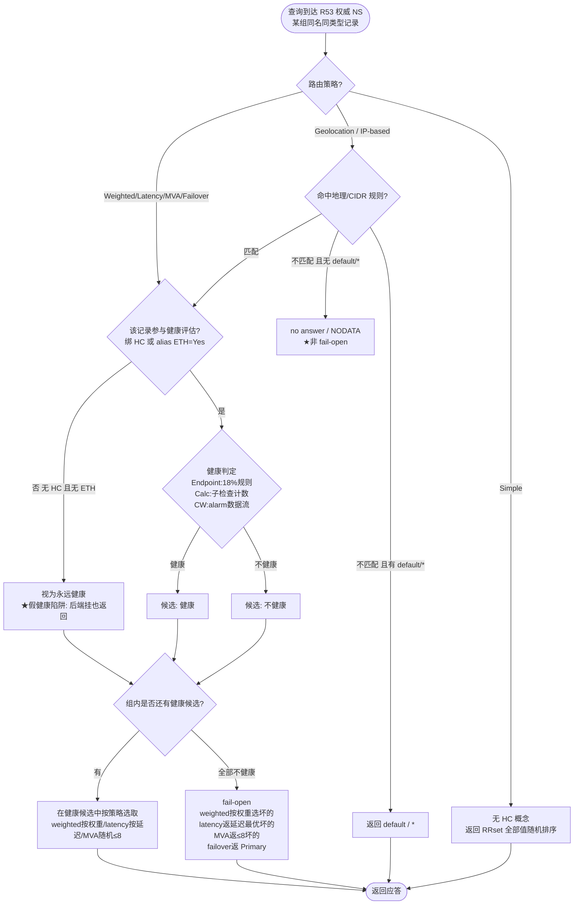
```mermaid
flowchart TD
    START([查询到达 R53 权威 NS<br/>某组同名同类型记录]) --> POL{路由策略?}

    POL -->|Simple| SIMPLE[无 HC 概念<br/>返回 RRset 全部值随机排序]
    POL -->|Geolocation / IP-based| MATCH{命中地理/CIDR 规则?}
    POL -->|Weighted/Latency/MVA/Failover| EVAL{该记录参与健康评估?<br/>绑 HC 或 alias ETH=Yes}

    MATCH -->|不匹配 且有 default/*| RETDEF[返回 default / *]
    MATCH -->|不匹配 且无 default/*| NOANS[no answer / NODATA<br/>★非 fail-open]
    MATCH -->|匹配| EVAL

    EVAL -->|否 无 HC 且无 ETH| ALWAYS[视为永远健康<br/>★假健康陷阱: 后端挂也返回]
    EVAL -->|是| HCJUDGE{健康判定<br/>Endpoint:18%规则<br/>Calc:子检查计数<br/>CW:alarm数据流}

    HCJUDGE -->|健康| HEALTHY[候选: 健康]
    HCJUDGE -->|不健康| UNHEALTHY[候选: 不健康]

    ALWAYS --> PICK
    HEALTHY --> PICK
    UNHEALTHY --> PICK

    PICK{组内是否还有健康候选?} -->|有| RETHEALTHY[在健康候选中按策略选取<br/>weighted按权重/latency按延迟/MVA随机≤8]
    PICK -->|全部不健康| FAILOPEN[fail-open<br/>weighted按权重选坏的<br/>latency返延迟最优坏的<br/>MVA返≤8坏的<br/>failover返 Primary]

    RETHEALTHY --> DONE([返回应答])
    FAILOPEN --> DONE
    RETDEF --> DONE
    SIMPLE --> DONE
```

### 6.2 Failover + 嵌套 + 健康向上聚合

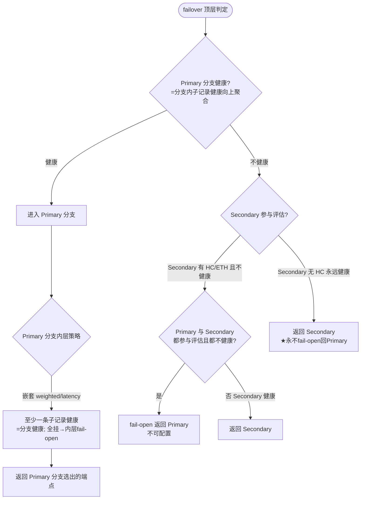
```mermaid
flowchart TD
    Q([failover 顶层判定]) --> P{Primary 分支健康?<br/>=分支内子记录健康向上聚合}

    P -->|健康| INP[进入 Primary 分支]
    P -->|不健康| S{Secondary 参与评估?}

    INP --> INNER1{Primary 分支内层策略}
    INNER1 -->|嵌套 weighted/latency| AGG1[至少一条子记录健康<br/>=分支健康; 全挂→内层fail-open]

    S -->|Secondary 有 HC/ETH 且不健康| BOTH{Primary 与 Secondary<br/>都参与评估且都不健康?}
    S -->|Secondary 无 HC 永远健康| RETS[返回 Secondary<br/>★永不fail-open回Primary]

    BOTH -->|是| FO[fail-open 返回 Primary<br/>不可配置]
    BOTH -->|否 Secondary 健康| RETS2[返回 Secondary]

    AGG1 --> RETP[返回 Primary 分支选出的端点]
```

### 6.3 ETH 沿 alias 链传递（一跳 No 即截断）

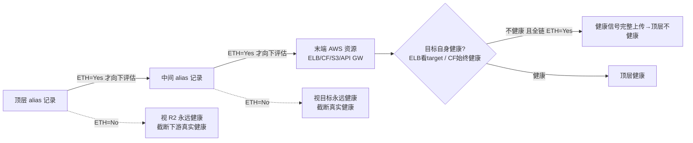
```mermaid
flowchart LR
    R1[顶层 alias 记录] -->|ETH=Yes 才向下评估| R2[中间 alias 记录]
    R1 -.->|ETH=No| CUT1[视 R2 永远健康<br/>截断下游真实健康]
    R2 -->|ETH=Yes 才向下评估| TGT[末端 AWS 资源<br/>ELB/CF/S3/API GW]
    R2 -.->|ETH=No| CUT2[视目标永远健康<br/>截断真实健康]
    TGT --> REAL{目标自身健康?<br/>ELB看target / CF始终健康}
    REAL -->|不健康 且全链 ETH=Yes| UP[健康信号完整上传→顶层不健康]
    REAL -->|健康| UP2[顶层健康]
```

---

## 7. 一页速记（交叉区结论）

- **fail-open 主线**：分散型策略（weighted/latency/MVA/failover）**全挂 = 返回坏答案**；整个 zone HC 全挂 = fail-open。
- **no answer 主线**：**geolocation 无 default** / **IP-based 无 `*`** = 返回空（**非** fail-open）——这是"没进筛选"，不是"筛完全没了"。
- **Failover**：Primary 必须真参与评估（HC 或 ETH）才切；主备**都参与评估且都不健康** → fail-open 回 **Primary**（不可配置）；**Secondary 无 HC = 永远健康 = 永不 fail-open**。
- **无 HC = 永远健康**：既没 HC 也没 ETH 的记录，后端挂了也照返回——failover 不切、alias 链假健康的头号根因。
- **ETH 沿 alias 链传递，任一跳 ETH=No 即截断**下游真实健康；ETH 只到 AWS 资源自身层（CloudFront/API GW 的 origin 健康它看不到）。
- **嵌套**：分支健康 = 子记录健康**向上聚合**（至少一条健康则分支健康）；每层 fail-open 独立生效；排查先定位是哪一层在决策。
- **简单记录不能绑 HC**；要健康感知换策略或 Alias+ETH。
- 验证 ETH 真生效要用**多记录组**（单条 simple alias 会 fail-open 掩盖）。

---

## 来源锚点

- **本仓**：topics/03-routing-policies.md（八策略、fail-open QA-337、weighted 0 权重、geolocation no answer）、topics/04-health-checks.md（四类 HC、18% 规则、响应时间阈值、ETH 绑定 C14、fail-open 单条/整 zone、Primary 必须 HC）、topics/02-records-and-alias.md（Alias 链受支持）、topics/12-integrations-quotas.md（单条 simple alias fail-open、验证 ETH 需多记录组）。
- **审校**：exam/codex-review-findings.md — topic 03 第 2/3/4/5/8/9 项、topic 04 第 C13/C14/C15/C16 全部、topic 02 第 2 项、topic 12 ETH 实验修正。
- **绑定 case**：178246722300140（geolocation 必配 default 否则 no answer）、P460958645（CloudWatch HC 假健康/状态同步）、178782060900806（failover 设计，见 topic 01/13）。


================================================================================

# FILE: topics/04-health-checks.md
<!-- SOURCE FILE: topics/04-health-checks.md -->

# 04. 健康检查（Health Check / HaaS）

> 来源锚点：外部 `r53-external-research.md` 第 6 节 + 第 15 节速记 C13–C19；内部 `r53-internal-research.md` §4 + TSR53HealthCheckService + MR-TSOA Troubleshooting Runbook。
> 绑定真实 case：**P460958645**（CALCULATED/CloudWatch HC 卡 Unhealthy，★）、**V2254930641**（Unwanted HC abuse，★）。

---

## 1. 概念（Concept）

Route 53 健康检查（HaaS = Health check as a Service）由全球分布的 health checker 组成，用来判断某个 endpoint/资源是否健康，并驱动 failover / multivalue / weighted 等路由策略是否返回某条记录。

### 四类健康检查（考点核心，必须条件反射区分）

1. **Endpoint（端点检查）**
   - 监控一个 IP 或域名 + 端口，协议为 **HTTP / HTTPS / TCP**，可选 **string matching（字符串匹配）**。
   - 由**全球分布的 health checker** 各自独立探测目标端点，无相互协调。
   - **不能对 local / private / 不可路由 / multicast IP 段建 endpoint 检查**（内部 ALB / 非公网资源无法用，建议 EC2 用 EIP 固定公网 IP，或改用 CloudWatch/Calculated HC）。
   - **探测间隔仅 10s（快速，附加费）或 30s（标准），默认 30s，且创建后不可修改**（要改间隔只能删掉重建）。
   - **FailureThreshold（失败阈值）= 连续多少次探测结果一致才翻转健康状态，取值 1–10，默认 3。**

2. **Calculated（计算/组合检查）**
   - 一个父检查监控多个子检查，**1 父最多管 255 子**，配置一个 **HealthThreshold（健康阈值）**。
   - 父检查的健康判定 = **当前处于健康的子检查数量 ≥ HealthThreshold 则父健康**（不是"某个 alarm 状态"，而是对子检查计数）。
   - 用于把多个独立探测聚合成一个总体健康判断。

3. **CloudWatch alarm-based（基于告警的检查）**
   - 监控某个 CloudWatch Alarm 的**数据流（metric data stream）而非 alarm 的最终 state**。映射：`OK → 健康`、`ALARM → 不健康`、`INSUFFICIENT_DATA → 按 InsufficientDataHealthStatus 配置`。
   - 用于监控无法直接 endpoint 探测的资源（如内部 ALB、自定义业务指标）。
   - **配置字段名是 `InsufficientDataHealthStatus`，三态**：`Unhealthy`（默认，数据不足即判不健康）、`Healthy`（数据不足仍健康）、`LastKnownStatus`（保持上次已知状态）。
   - **不支持跨账号 alarm**——被引用的 CloudWatch alarm 必须与健康检查在**同一 AWS 账号**内。

4. **ARC Recovery Control（`RECOVERY_CONTROL` 类型）**
   - 关联一个 **Application Recovery Controller（ARC）routing control**，随 routing control 的 On/Off 状态判定健康，用于 ARC 主导的故障转移编排。
   - 是官方文档列出的第四类健康检查类型，早期"只有三类"的说法已过时。

### 判定机制 / 阈值参数（★背记 — 陷阱题密集）

- Endpoint HC 由全球多地 health checker 探测，**互不协调**；探测间隔 **10s（快速，附加费）或 30s（标准），默认 30s，创建后不可改**。
- **聚合规则（18% 规则）**：**> 18% 的全球 checker 报健康 → 判健康；≤ 18% → 判不健康**。设 18% 门槛是为了防止某处网络隔离导致的误判。
  - ⚠️ **18% 规则仅适用于由全球 checker 探测的 Endpoint 健康检查**；Calculated（按子检查计数 vs HealthThreshold）与 CloudWatch alarm-based（按 alarm 数据流）**不适用 18% 规则**。
- **响应时间阈值（仅 Endpoint HC）**：
  - **HTTP / HTTPS**：需 **4s 内**建立 TCP 连接 + 连接建立后 **2s 内**回 2xx/3xx 状态码。
  - **TCP**：需 **10s 内**建立连接。
  - **string matching**：在收到状态码后需再 **2s 内**收到响应 body，且匹配串必须落在 body 的**前 5,120 字节**内。
  - **字符串匹配区分大小写（case-sensitive）**，须完整落在前 5,120 字节内才算命中。
- **HTTPS 健康检查不校验证书**——证书过期/无效**不会**导致检查失败。（高频陷阱题）
- **新建健康检查在数据足够前默认视为健康**（若开启 invert 反转，则默认不健康）。

### 与 failover 绑定（考点）

- **Active-passive（主备）= failover 路由策略**；**Active-active = 除 failover 外任意策略**（所有同名同类型同策略记录都活跃，除非被判不健康）。
- **绑定方式二选一（易错点）**：
  - 记录指向**可建 alias 的 AWS 资源**（ELB/CloudFront 等）→ **不要**再建独立健康检查，而是把 alias 记录的 **Evaluate Target Health (ETH) 设 Yes**。
  - 记录指向**不能建 alias 的资源** → 才关联独立健康检查。
- **Failover Primary 必须关联 HC**（否则无法创建 failover 策略）。
- **fail-open 行为（内部 runbook 明确的坑）**：
  - 单条 failover 记录：**Primary + Secondary 的 HC 都 unhealthy → R53 返回 Primary**（fail open 到 primary），此行为**不可配置**。
  - 整个 Hosted Zone 视角：**该 zone 所有 HC 都 unhealthy → R53 fail open**（当作全部通过来应答）。
- **多资源主/备记录**：只要至少一个关联资源健康，该 failover 记录即视为健康。

### 健康检查器源 IP（运维/防火墙相关）

- 2023/09 起以 **AWS managed prefix list** 形式提供，IP 由 AWS 自动更新；该 prefix list 消耗名额 weight = 25。
- 防火墙放行时**不能只放自己 region 的 CIDR**——健康检查器来自多个 region。
- 探测请求携带 **User-Agent: `Amazon-Route53-Health-Check-Service`**（见 case V2254930641 证据）。

### Unwanted HC abuse（滥用）流程

- 任意账户都可创建一个指向**不属于自己**的 IP/域名的 endpoint HC，导致受害方持续收到探测请求。
- 处理是 **Support Ops 专属权限**（`Only Support Ops can address - Permission / Tooling restriction`）。
- 标准流程：确认 HC → 联系 offending account → 等待 **7 天** → 无回复则用 **Mechanic `controlapi disable-health-check`** 强制禁用（需 **2PR / Consensus Review**）。**禁用 ≠ 删除**：记录仍存在但 `Disabled=true`，不再发探测。

---

## 2. 真实案例说明（Real Case）

### ★ P460958645 — CloudWatch alarm-based HC 卡在 Unhealthy 约 53 分钟

- **症状**：关联的 CloudWatch Alarm（`pg-uat-euc1-wallstreetsuite-ec2-app-2-alarm`）已在 06:26 UTC 转为 **OK**，但 Route 53 HC（`9e5ef064-...`）仍停留在 **Unhealthy** 约 53 分钟，直到客户 07:16–07:18 手动执行 `UpdateHealthCheck` 才在 07:19 恢复 Healthy。
- **根因落点**：这是一个 **CloudWatch alarm 类型 HC**。失败消息明确是 "CloudWatch didn't have enough data to determine the state of the alarm"，即 alarm 一度进入 `INSUFFICIENT_DATA`，而 HC 的 `InsufficientDataHealthStatus` 为默认 **Unhealthy** → 数据不足即判不健康。正常情况下 R53 对 CW alarm 状态变化的响应应在 **1–2 分钟内**，本例 53 分钟属异常，怀疑 HC control plane 轮询 CloudWatch 时出现暂时性状态同步延迟。
- **知识点钉法**：① CloudWatch HC 监控的是 alarm **数据流**、三态里 INSUFFICIENT_DATA 走 `InsufficientDataHealthStatus`；② 默认 Unhealthy 是"数据不足即判死"的陷阱，改 `LastKnownStatus` 可缓解；③ **`UpdateHealthCheck` 会触发 HC 重新评估**，可作紧急恢复手段。

### ★ V2254930641 — Unwanted Health Check abuse（滥用）

- **症状**：受害账户 `611757617007` 的 ALB（`app/prd01-iotube-web-alb/...`，域名 `goodgearjapan.com`，IP `54.168.27.241`）持续收到来自 Route 53 Health Check Service 的探测。
- **根因**：另一个账户 `035745015862` 创建了一个 **HTTP 类型 endpoint HC**（ID `28e27f8c-...`，端口 80，间隔 30s，失败阈值 3），把目标指向了**不属于它的 IP**。ALB access log 里 `User-Agent: Amazon-Route53-Health-Check-Service (ref 28e27f8c-...)` 是决定性证据。
- **处理落点**：走标准 Unwanted HC abuse 流程——Route 53 Information Search 确认 HC → 向 offending / victim 双方发 outbound case → 等 7 天无回复 → 用 Mechanic `controlapi disable-health-check`（Namespace `haas-support`、us-east-1、2PR + Review ID）禁用，最终状态 `Disabled=true`。
- **知识点钉法**：① 探测源 User-Agent 与 `ref=<HC ID>` 是识别 HC abuse 的关键；② 禁用是 Support Ops 专属、需 2PR、禁用非删除。

---

## 3. 实验步骤（Hands-on Lab）

> 主题取自驱动表：CloudWatch alarm-based HC + `UpdateHealthCheck` 触发重评估观察状态同步；识别 HC User-Agent/prefix list 并演练 abuse outbound 流程（**只读理解，禁用需 2PR，不执行**）。

### Lab A：CloudWatch alarm-based HC 状态同步（复现 P460958645 现象，非破坏性）

```bash
# 1. 先建一个 CloudWatch Alarm（示例：监控某 EC2 StatusCheckFailed）
aws cloudwatch put-metric-alarm \
  --alarm-name r53-lab-hc-alarm \
  --namespace AWS/EC2 --metric-name StatusCheckFailed \
  --dimensions Name=InstanceId,Value=<i-xxxx> \
  --statistic Maximum --period 60 --evaluation-periods 1 \
  --threshold 1 --comparison-operator GreaterThanOrEqualToThreshold \
  --region eu-central-1

# 2. 建 CloudWatch alarm-based 健康检查，注意 InsufficientDataHealthState
aws route53 create-health-check \
  --caller-reference r53-lab-$(date +%s) \
  --health-check-config '{
    "Type":"CLOUDWATCH_METRIC",
    "AlarmIdentifier":{"Region":"eu-central-1","Name":"r53-lab-hc-alarm"},
    "InsufficientDataHealthState":"Unhealthy"
  }'
# 预期：新建 HC 在拿到足够数据前默认 Healthy；alarm 进 INSUFFICIENT_DATA 时按上面配置判 Unhealthy

# 3. 查 HC 当前状态与最近失败原因
aws route53 get-health-check-status --health-check-id <HC_ID>
#   观察各 checker region 的 StatusReport（会写明 "CloudWatch didn't have enough data ..." 等）

# 4. 复现"触发重新评估"：改任一无害字段（如 Inverted 再改回）触发 UpdateHealthCheck
aws route53 update-health-check --health-check-id <HC_ID> --inverted
aws route53 update-health-check --health-check-id <HC_ID> --no-inverted
#   预期：UpdateHealthCheck 触发 HC 重新评估，状态在 1–2 分钟内同步（对照 case 的 53 分钟异常）

# 5. 对比把 InsufficientDataHealthState 改成 LastKnownStatus 的缓解效果
aws route53 update-health-check --health-check-id <HC_ID> \
  --insufficient-data-health-status LastKnownStatus

# 清理
aws route53 delete-health-check --health-check-id <HC_ID>
aws cloudwatch delete-alarms --alarm-names r53-lab-hc-alarm --region eu-central-1
```

判读要点：`get-health-check-status` 返回多个 region checker 的 `StatusReport`；用 **18% 规则**理解"少数 checker 报健康也可能判健康"。

### Lab B：识别 HC 探测源与 abuse 流程（只读演练，禁用步骤不执行）

```bash
# 1. 在被探测资源（如 ALB）的 access log 里识别 R53 HC 探测
#    关键特征：User-Agent 含 Amazon-Route53-Health-Check-Service (ref <HC_ID>; report http://amzn.to/1vsZADi)
grep 'Amazon-Route53-Health-Check-Service' alb_access.log

# 2. 用 HC 源 IP prefix list 核对来源（健康检查器多 region，勿只放本 region CIDR）
aws ec2 get-managed-prefix-list-entries \
  --prefix-list-id <route53-healthchecks-pl-id> --region us-east-1

# 3.（内部工具，只读）用 Route 53 Information Search 按 HC ID 查 owner/配置：
#    https://route53-information-search.amazon.com/customersearch?searchFieldType=Any&searchFieldValue=<HC_ID>
```

> **禁用属破坏性且 Support-Ops 专属**：Mechanic `controlapi disable-health-check`（Namespace `haas-support`）**需 2PR / Consensus Review**，本 lab **只做概念演练，不执行**。禁用是 `Disabled=true`（非删除）。

---

## 4. SME 考点 / 易错点（Exam Points & Pitfalls）

逐条对应外部第 15 节速记 **C13–C19**（附常见错误认知正误对照）：

- **C13**：**Active-passive = failover 策略；active-active = 除 failover 外任意策略**。
  - ✗ 错误认知：以为"主备"就是一定要用某个专门的"active-passive 策略"名——它就是 failover 策略本身。
- **C14**：指向可建 alias 的 AWS 资源做 failover 时，用 **Evaluate Target Health = Yes**，**不要**再单独建健康检查。
  - ✗ 错误认知：给指向 ELB 的 alias 记录又额外挂一个 endpoint HC——多余且可能冲突，应改用 ETH。
- **C15**：**> 18% 的全球 checker 报健康才算健康；≤ 18% 判不健康**；**此规则仅适用于 Endpoint 健康检查**。
  - ✗ 错误认知：以为"多数（>50%）checker 健康才算健康"——门槛是 18%，用于防网络隔离误判；也别把 18% 套到 Calculated（按子检查数 vs HealthThreshold）或 CloudWatch（按 alarm 数据流）上。
- **C16**：**HTTP/HTTPS：4s 建连 + 2s 回 2xx/3xx；TCP：10s 建连；string match 收到状态码后 2s 内收 body，匹配串须落在 body 前 5,120 字节内且区分大小写**。
  - ✗ 错误认知：把 4s / 2s / 10s / 5120B 混记，或以为字符串可在整个 body 任意位置匹配、以为大小写不敏感。
- **C17**：**HTTPS 健康检查不校验证书**（证书过期/无效不导致失败）。
  - ✗ 错误认知：以为证书过期会让 HTTPS HC 变红——不会，这是经典陷阱题。
- **C18**：**Calculated：1 父最多 255 子，按健康子检查数 ≥ HealthThreshold 判健康**；**CloudWatch alarm HC 监控 alarm 的数据流而非直接 alarm 状态，字段 `InsufficientDataHealthStatus`，且不支持跨账号 alarm**；**新检查在数据足够前默认健康（除非 invert）**。
  - ✗ 错误认知：以为 CloudWatch HC 读的是 alarm 的 state 字段——实际读数据流；以为新建 HC 一开始是 unhealthy；以为能引用别的账号的 alarm。
- **C19**：**不能对 private / 不可路由 / multicast IP 建 endpoint 健康检查**。
  - ✗ 错误认知：想给内部 ALB 直接建 endpoint HC——建不了/状态异常，应改用 CloudWatch alarm-based 或 calculated HC（配合 EIP 固定 IP）。

### 该域特有内部边界数字速记（internal §4 / TSOA runbook）

- **InsufficientDataHealthStatus 三态**：Unhealthy（默认，坑）/ Healthy / LastKnownStatus。P460958645 的缓解就是改 LastKnownStatus。CloudWatch HC 读 alarm 数据流、不支持跨账号 alarm。
- **`UpdateHealthCheck` 会触发 HC 重新评估**——紧急恢复手段。
- **Endpoint HC 间隔仅 10s/30s，默认 30s，创建后不可改**；**FailureThreshold 连续 1–10 次，默认 3**。
- **Calculated：按健康子检查数 vs HealthThreshold**；四类 HC = Endpoint / Calculated / CloudWatch / ARC Recovery Control。
- **Failover fail-open**：单条 Primary+Secondary 都不健康 → 返回 Primary（不可配置）；整 zone HC 全不健康 → fail open。
- **Failover Primary 必须有 HC**，否则建不了 failover。
- **HC 器源 IP = AWS managed prefix list（weight 25）**，多 region，防火墙别只放本 region。
- **Unwanted HC abuse**：Support Ops 专属，联系 offending → 等 7 天 → Mechanic 禁用（2PR），禁用非删除。
- **PHZ 支持的 HC**：仅可与 failover / multivalue / weighted / latency / geolocation / geoproximity 记录关联；**simple 记录不能关联 HC**。
- 探测间隔 **10s（快速，附加费）/ 30s（标准）**；非 AWS endpoint / HTTPS / string-match / 10s 快检 / 延迟测量均为**附加费**。

---

## 5. 该域 Mermaid 逻辑导图（Logic Diagram）

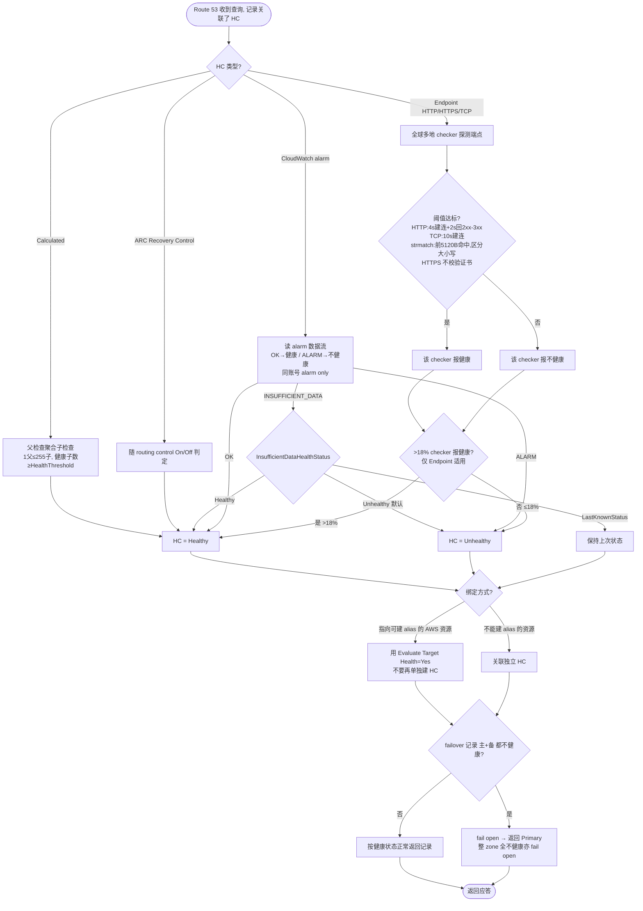
```mermaid
flowchart TD
    START([Route 53 收到查询, 记录关联了 HC]) --> TYPE{HC 类型?}

    TYPE -->|Endpoint HTTP/HTTPS/TCP| EP[全球多地 checker 探测端点]
    TYPE -->|Calculated| CALC[父检查聚合子检查<br/>1父≤255子, 健康子数≥HealthThreshold]
    TYPE -->|CloudWatch alarm| CW[读 alarm 数据流<br/>OK→健康 / ALARM→不健康<br/>同账号 alarm only]
    TYPE -->|ARC Recovery Control| RC[随 routing control On/Off 判定]

    EP --> THRESH{阈值达标?<br/>HTTP:4s建连+2s回2xx-3xx<br/>TCP:10s建连<br/>strmatch:前5120B命中,区分大小写<br/>HTTPS 不校验证书}
    THRESH -->|是| CHECKER_OK[该 checker 报健康]
    THRESH -->|否| CHECKER_BAD[该 checker 报不健康]

    CHECKER_OK --> AGG{>18% checker 报健康?<br/>仅 Endpoint 适用}
    CHECKER_BAD --> AGG
    CALC --> HC_OK
    CW -->|INSUFFICIENT_DATA| IDHS{InsufficientDataHealthStatus}
    RC --> HC_OK
    IDHS -->|Unhealthy 默认| HC_BAD
    IDHS -->|Healthy| HC_OK
    IDHS -->|LastKnownStatus| LAST[保持上次状态]
    CW -->|OK| HC_OK
    CW -->|ALARM| HC_BAD

    AGG -->|是 >18%| HC_OK[HC = Healthy]
    AGG -->|否 ≤18%| HC_BAD[HC = Unhealthy]

    HC_OK --> BIND
    HC_BAD --> BIND
    LAST --> BIND

    BIND{绑定方式?} -->|指向可建 alias 的 AWS 资源| ETH[用 Evaluate Target Health=Yes<br/>不要再单独建 HC]
    BIND -->|不能建 alias 的资源| INDEP[关联独立 HC]

    ETH --> FO
    INDEP --> FO
    FO{failover 记录 主+备 都不健康?}
    FO -->|是| FAILOPEN[fail open → 返回 Primary<br/>整 zone 全不健康亦 fail open]
    FO -->|否| NORMAL[按健康状态正常返回记录]

    NORMAL --> DONE([返回应答])
    FAILOPEN --> DONE
```


================================================================================

# FILE: topics/05-resolver-hybrid-dns.md
<!-- SOURCE FILE: topics/05-resolver-hybrid-dns.md -->

# 05. Resolver 与混合 DNS（解析优先级）

> 高频重灾区（第二梯队之首）。真实 case 最集中，考试最爱考**解析优先级链**与 **Inbound/Outbound 方向**。绑定 case：178602594200640（Forward Rule > PHZ > 公网，★核心）、178767531400698（多 ENI + NACL，★核心）。
> 来源锚点：内部 §5（QA-385 / QA-1466 / Learn108 / BootCamp 1154827 / Networking TFC）；外部 §7 + §15.D（考点 D20–D24）+ re:Post forwarding-rule-and-phz。

---

## 1. 概念（Concept）

### 1.1 VPC Resolver（.2 / VPC+2 架构）
- VPC 内所有资源的 DNS 入口是 **VPC Resolver**，接入地址是 **VPC+2**：VPC 主 CIDR 基地址 +2（经典的 ".2 resolver"，也叫 AmazonProvidedDNS）。例：VPC CIDR `10.201.244.0/22` → VPC DNS = **10.201.244.2**（case 178767531400698 实证）。
- VPC Resolver 默认在所有 VPC 可用，对 VPC 内资源递归应答三类名字：**公网记录（递归查询）、VPC 专有 DNS 名、关联到该 VPC 的 PHZ 记录**。
- **VPC Resolver 是 Regional 服务，不是 global**（区别于 Public DNS / Domains 的全球性）。
- **关键边界：EC2 → VPC DNS（.2）的流量不经过 SG / NACL / 路由表。** 这是排障最常见的方向性误判（见 §2 case 二的 Genie 初稿纠错）。
- 来源：外部 §7 resolver.html；内部 §5 QA-385。

### 1.2 Inbound / Outbound Endpoint（方向易混，考点 D21）
| Endpoint | 方向 | 用途 |
|---|---|---|
| **Inbound** | on-prem → AWS | 让本地/其他网络向本 VPC 发 DNS 查询，解析 PHZ / AWS 内部名 |
| **Outbound** | AWS → on-prem | 让本 VPC 的查询转发到本地/其他网络的 DNS |

- **Outbound endpoint 是私有 IP**；要转发到公网 DNS（8.8.8.8 等）需经 **NAT Gateway**（外部 §7 + 内部 BootCamp 1154827）。
- 混合云（VPN / Direct Connect）DNS：outbound endpoint 把查询转发到 on-prem resolver；on-prem 把 AWS 名转发到 inbound endpoint。

### 1.3 Resolver Rule（条件转发规则）
- **Conditional forwarding rule**：每个域名一条转发规则，指定把该域名的查询转发到哪些目标 DNS IP；直接作用于 VPC。
- **`.`（dot）rule**：你**手动创建**的、域名为 `.` 的 **FORWARD 规则**，覆盖除更具体规则（PHZ / AWS 内部名的 autodefined 规则）以外的所有域名。**要把 VPC 内几乎所有查询都转发到企业 DNS，就建一条域名为 `.` 的 FORWARD 规则**（case 178602594200640 实证）。
  - ⚠️ **`.` 规则并非真的转发"全部"查询**：VPC Resolver 仍保留一批 AWS 内部域名（见 autodefined system rules 列表，如部分 amazonaws.com 子域、反向 DNS）不转发，否则会破坏内部功能。要强制连这些也转发，需把 VPC 的 `enableDnsHostnames` 设为 false，或为这些内部域名单独建规则。
  - 不要把这条你创建的 `.` FORWARD 规则与默认的 `Internet Resolver`（Type=Recursive、不可删）混为一谈。
- **Rule 必须关联一个 outbound endpoint 才生效。**
- **RAM 跨账号共享（考点 D24）**：一个账号建的 forward rule 可用 AWS RAM 共享给**同 Region** 其他账号；共享 rule 的父账号 outbound endpoint 也随之共享，无需额外 VPC peering；成员账号不能改/删共享 rule。

### 1.4 解析优先级链（★★★ 最核心考点 D22 / D23）
对 VPC 内的一次 DNS 查询，VPC Resolver **首先按"最具体域名匹配（most-specific match）"选规则**；当多条规则命中的域名层级相同时，再按**规则类型优先级**打破平手：

```
同域名层级时的类型优先级：
1. Route 53 Resolver Forward Rule   ← Resolver 转发规则
   ↓
2. Private Hosted Zone (PHZ) 规则    ← 关联到该 VPC 的 PHZ
   ↓
3. Auto-defined / Internal 规则      ← amazonaws.com 等 AWS 内部名（含反向 DNS 自动规则）
   ↓
4. 默认 Recursive 规则 "Internet Resolver" → 公网递归 DNS → Public Hosted Zone
```

**两条铁律**：
- **同域名层级时 Forward Rule 优先于 PHZ，PHZ 优先于内部规则**（官方 knowledge-center：same domain level → 1. Resolver rule / 2. Private hosted zone rule / 3. Internal rule）。同一域名既有 PHZ 又有 Forward Rule 时，**Rule 胜**，查询被转发出去而不是用 PHZ 记录解析。
- **先比"最具体"，再比"类型"**：更具体的域名匹配永远优先于更泛的匹配，**跨类型也如此**——例如 `acct.example.com` 的 PHZ 会胜过 `example.com` 的 Forward Rule（因为前者更具体）；只有当两者域名层级相同时才用上面的类型优先级。（`accounting.example.com` 胜过 `example.com`）
- **System 规则可"反向覆盖"Forward Rule**：Forward Rule 默认作用于该域名及其所有子域；若想让某子域**不**被转发、改由 VPC Resolver 本地解析，为该子域建一条 **System 规则**（例：`example.com` 建 FORWARD、`acme.example.com` 建 System，则 acme 子域不转发）。这正是 case 一"方案 B（加更具体的 System Rule）"的机制。
- **默认递归规则名为 `Internet Resolver`（Type=Recursive），不可删除**；它对所有没有自定义规则、也没有 autodefined 规则命中的域名做递归解析。
- 来源：官方 knowledge-center route-53-fix-dns-resolution-private-zone / route-53-override-reverse-dns-rules；DeveloperGuide resolver-rules 系列；内部 §5 QA-3982 + Sage #275365 / #221751。

### 1.5 QPS / 吞吐边界（务必背记）
- **每 Outbound Endpoint 最多 6 个 ENI**，可承受高达 **~60,000 请求/秒**（每 ENI 分担一部分）。
- **每 ENI ~10K QPS**，但**经 NLB 或 Security Group 会因强制 connection tracking 把每 ENI 有效 QPS 从 ~10K 降到 ~1.5–1.7K（约 6 倍下降）**——高 QPS 场景应避免把 Resolver 流量经 NLB。
- ⚠️ **别与 1024 PPS 混淆**：EC2 实例每个网络接口 → VPC+2 link-local 最多 **1024 packets/second 且不可调**（见 topic 12 配额域）；这是**实例侧**限制，与 **endpoint 侧** ~10K QPS/ENI 是两回事。
- 来源：内部 §5 Learn108 + Networking TFC（Resolver QPS 段）。

### 1.6 resolv.conf fallback 陷阱
- 客户端 `/etc/resolv.conf` 若在 VPC DNS 之外还列了公共 DNS（8.8.8.8）做 fallback，当 VPC DNS 因 PHZ 无记录返回 NXDOMAIN 时，客户端会转向公共 DNS，导致本应命中 PHZ 的私有名解析失败/解析到公网结果（关联 case 178239640400861，resolv.conf fallback）。

---

## 2. 真实案例说明（Real Case）

### ★核心 Case 一：178602594200640 —— Forward Rule > PHZ > 公网（SP Global）
- **症状**：域名 `soaapi-av.spgidev.spglobal.com` 在 Public HZ 里明明配成 A(Alias) 指向 Kong NLB，客户在 VPC 内却解析到旧的 Apigee ELB（10.95.145.77 / 10.95.146.46）。
- **排查路径**：先确认 Public HZ 配置 100% 正确（Kong NLB，无 apigee 记录）→ 搜 6 个 spglobal.com PHZ 均无该记录 → **发现两条 FORWARD 规则**：`SPG`（`spglobal.com.` → 企业 Infoblox DNS 10.164.130.42/61/71）和 `RULE-INFOBLX`（`.` 全局 → 企业 DNS）。
- **根因落点**：查询在 VPC Resolver 层就命中 Forward Rule 被转发到企业 DNS，**根本没到达公网 Route 53**；企业 DNS 返回了未同步的旧 Apigee 记录。客户做 Apigee→Kong 迁移只改了 R53 Public HZ，没同步企业 DNS。
- **知识点**：这就是「Forward Rule > PHZ > 公网」的教科书现场。**方案 C（在 PHZ 加正确记录）不可行**——PHZ 优先级低于 Forward Rule，加了也不生效；正解是 A（在 Infoblox 上更新/删除该记录）或 B（加更具体的 System Rule 让子域不走 Forward Rule）。
- **SME 提醒**：大企业 hybrid DNS case **先查 Resolver Rules**，Forward Rule 是比 PHZ 更常见的 DNS 覆盖来源；看到 `.`(dot) 全局 Forward Rule 就知道 VPC 内永远走企业 DNS、不走公网。

### ★核心 Case 二：178767531400698 —— 多 ENI + NACL 双向放行（J Crew）
- **症状**：EC2（AL2023）无法加域，`nslookup jcrew.com 10.201.244.2` 三次全超时（`communications error ... timed out`）。
- **场景建模**：10.201.244.2 = VPC DNS（CIDR `10.201.244.0/22` +2）。流量路径：EC2 → VPC DNS（**不过 SG/NACL**）→ Forward Rule `jcrew-com-DR` → Outbound Endpoint（有 **2 个 ENI**：10.201.200.201 / .216，位于**另一个 VPC**）→ 目标 DNS 10.201.244.12。
- **根因**：Outbound Endpoint 的 **ENI2 所在子网 NACL** 阻断了到目标 DNS 的 DNS 流量——出站命中 `Rule 63 DENY 10.0.0.0/8`（目标 10.201.244.12 落在 10.0.0.0/8 内）；入站只有 `Rule 99 ALLOW TCP 1024-65535`，**UDP DNS 回包被隐式 DENY**。精确缺口 3 条：出站 UDP 53、出站 TCP 53、入站 UDP ephemeral（入站 TCP ephemeral 已被 Rule 99 覆盖，不需新增）。
- **多 ENI 关键推断**：Resolver 可经任一 ENI 发出查询。ENI2 被双向阻断必然超时；但**三次全超时**说明 ENI1 路径可能也有问题（TGW 路由 / 目标 DNS 不响应）→ **NACL 修复是必要条件而非充分条件**，不能承诺"修了就好"。
- **方向性纠错**：Genie AI 初稿建议查 EC2→10.201.244.2 的 SG/路由——**错**，因为 EC2 到 VPC DNS 的流量不经 SG/NACL/路由表，真正阻断点在 Outbound Endpoint 的 ENI 子网 NACL。
- **知识点**：Outbound Endpoint 的**每个 ENI 子网都要在 NACL 上双向放行 DNS**（出站 UDP/TCP 53 + 入站 UDP/TCP ephemeral 1024-65535）；多 ENI 跨不同子网/NACL 时配置必须一致，否则部分查询超时、表现为间歇故障。

---

## 3. 实验步骤（Hands-on Lab）

> 主题（驱动表）：建 outbound endpoint + resolver rule 观察混合解析；差分诊断 UDP vs TCP。
> 标注：以下为**受控实验**（在测试 VPC 内做），涉及 Endpoint/Rule 会产生小额费用，实验后清理。

### 步骤 A：建 Outbound Endpoint（观察混合解析路径）
```bash
# 前提：一个测试 VPC，2 个不同 AZ 的私有子网，一个允许 DNS 的 SG
# 1) 建 outbound endpoint（2 个 ENI，跨 2 AZ）
aws route53resolver create-resolver-endpoint \
  --creator-request-id lab-$(date +%s) \
  --name lab-outbound \
  --direction OUTBOUND \
  --security-group-ids sg-xxxxxxxx \
  --ip-addresses SubnetId=subnet-aaa SubnetId=subnet-bbb
# 预期：返回 ResolverEndpointId=rslvr-out-xxxx，Status=CREATING → OPERATIONAL
# 记下 ENI 私有 IP（两条），后面要在这两个 ENI 子网的 NACL 上放行 DNS
```

### 步骤 B：建 Forward Rule 并关联 VPC（观察优先级压过 PHZ）
```bash
# 2) 对 example.internal. 建 FORWARD 规则，目标指向你的测试 DNS（可临时指向另一台跑 dnsmasq 的 EC2）
aws route53resolver create-resolver-rule \
  --creator-request-id lab-rule-$(date +%s) \
  --name lab-fwd-example \
  --rule-type FORWARD \
  --domain-name example.internal. \
  --resolver-endpoint-id rslvr-out-xxxx \
  --target-ips Ip=10.0.5.53,Port=53
# 3) 关联到测试 VPC
aws route53resolver associate-resolver-rule \
  --resolver-rule-id rslvr-rr-xxxx --vpc-id vpc-xxxx
```
**对照实验（验证 Forward Rule > PHZ）**：先在测试 VPC 关联一个 `example.internal` 的 PHZ、里面放一条 A 记录；再建上面的 Forward Rule 指向另一个目标。从 VPC 内 EC2 执行：
```bash
dig example.internal @10.0.0.2 +short     # .2 = VPC DNS（按你 VPC CIDR 换算）
# 预期：返回的是 Forward Rule 目标 DNS 的应答，而不是 PHZ 里的 A 记录
# → 现场验证「Forward Rule 优先于 PHZ」
```

### 步骤 C：差分诊断（UDP vs TCP，定位出站/入站/路由/目标故障）
```bash
dig example.internal @10.0.0.2            # 默认 UDP
dig example.internal @10.0.0.2 +tcp       # 强制 TCP
dig -t SRV _ldap._tcp.example.internal @10.0.0.2   # AD SRV 记录
```
判读（源自 case 二测试方案）：
- **UDP 失败 / TCP 成功** → UDP 腿有问题：出站 UDP 53 或入站 UDP ephemeral 未放行、目标 DNS 不应答 UDP、或 UDP 响应分片被丢。
- **两者都失败** → 出站被拦 / 跨网络路由不可达 / 目标 DNS 不响应。
- **均成功** → 该路径通；但因 Resolver 可经任一 ENI 发出，**单次成功不能证明两条 ENI 路径都通**——若"有时成功有时超时"，是另一条 ENI 子网 NACL/路由未修好。

### 步骤 D：NACL 放行清单（Outbound Endpoint 每个 ENI 子网都要）
```
出站  UDP 53   → 目标DNS/32
出站  TCP 53   → 目标DNS/32
入站  UDP 1024-65535  from 目标DNS/32
入站  TCP 1024-65535  from 目标DNS/32
# 规则号要放在所有 DENY 之前，用最小 /32 范围
```

### 步骤 E：混合 DNS 中的 Pod 视角（可选）
```bash
kubectl exec -it <pod> -- cat /etc/resolv.conf   # 看 dnsPolicy 与 nameserver 是否指向 CoreDNS/VPC DNS
```

### 清理
```bash
aws route53resolver disassociate-resolver-rule --resolver-rule-id rslvr-rr-xxxx --vpc-id vpc-xxxx
aws route53resolver delete-resolver-rule --resolver-rule-id rslvr-rr-xxxx
aws route53resolver delete-resolver-endpoint --resolver-endpoint-id rslvr-out-xxxx
```

---

## 4. SME 考点 / 易错点（Exam Points & Pitfalls）

逐条对应外部 §15.D（D20–D24）+ 内部边界数字：

- **D20 VPC+2 / .2 resolver**：VPC 内解析入口 = VPC 主 CIDR 基地址 +2，默认所有 VPC 可用。
  - ✅ 结论：`10.201.244.0/22` → VPC DNS = 10.201.244.2。
  - ❌ 常见错误：以为 EC2→VPC DNS 的流量受 SG/NACL/路由表管控（实际**不经过**）——这是排障最大方向性坑（case 二 Genie 初稿即犯此错）。

- **D21 Inbound vs Outbound 方向**：Inbound = on-prem→AWS 查询；Outbound = AWS→on-prem 查询。
  - ❌ 常见错误：方向记反。记忆法：**In**bound 是"别人进来查我"，**Out**bound 是"我出去查别人"。
  - 附加：Outbound 出公网需 NAT Gateway（outbound endpoint 是私有 IP）。

- **D22 Resolver 转发规则优先于 PHZ（★最高频）**：**同域名层级**冲突时 **Forward Rule 胜**。
  - ✅ 结论：同层级类型优先级 **Forward Rule > PHZ > 内部/autodefined 规则 > 默认 Recursive 规则 `Internet Resolver`（公网递归）**；但先比"最具体域名匹配"，再比类型——更具体的匹配跨类型也优先。
  - ❌ 常见错误：以为"在 PHZ 里加条记录就能覆盖"——同层级时 PHZ 优先级低于 Forward Rule，加了不生效（case 一方案 C 不可行的原因）；正解是改企业 DNS，或为子域建更具体的 System 规则让它本地解析。
  - ❌ 常见错误：忘了 `.`(dot) FORWARD 规则会把 VPC 内**几乎所有**查询转出去（AWS 内部名仍默认保留不转），也别把它与默认的 `Internet Resolver` 递归规则混淆。

- **D23 重叠命名空间取最长/最具体匹配**：`accounting.example.com` 胜过 `example.com`；匹配定义 = 完全相同或 PHZ/Rule 名是请求域名的父级。**"最具体"跨规则类型都成立**，只有同层级才用类型优先级打破平手。
  - ❌ 常见错误：以为按创建顺序或随机选，实际是 most-specific-match；也别以为"Forward Rule 永远压 PHZ"——更具体的 PHZ 会压更泛的 Forward Rule。

- **D24 Resolver rule 可经 RAM 跨账号共享**：同 Region、无需 VPC peering；成员账号只能用不能改/删共享 rule。
  - ❌ 常见错误：以为跨账号共享 rule 还要单独建 outbound endpoint（实际父账号 endpoint 随 rule 一起共享）。

**该域特有边界数字速记（内部 §5）**：
- 每 Outbound Endpoint **≤6 ENI**，聚合 **~60K req/s**；每 ENI **~10K QPS**；**经 NLB/SG 降到 ~1.5–1.7K QPS**（connection tracking，约 6 倍）。
- **1024 PPS/ENI 不可调**（实例侧 VPC+2 link-local 限制，别与 endpoint QPS 混淆）。
- Rule 必须关联 outbound endpoint 才生效。
- Resolver / Endpoints 是 **Regional**（Public DNS / Domains 才是 global us-east-1）。
- VPC .2 resolver **支持 EDNS0 但不支持 ECS**（影响 geo/latency/IP 路由准确性，见 topic 03）。
- **多 ENI 排障铁律**：每个 endpoint ENI 子网的 NACL 都要双向放行 DNS（出站 UDP/TCP 53 + 入站 UDP/TCP ephemeral）；单条 ENI 通不代表全通，三次全失败≠只是 NACL（可能 TGW 路由/目标 DNS）。

---

## 5. 该域 Mermaid 逻辑导图（Logic Diagram）

### 5.1 VPC 内 DNS 解析优先级决策链（★核心）
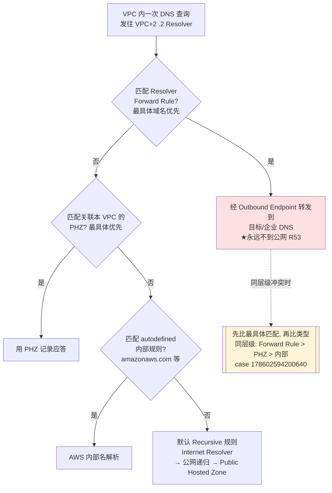
```mermaid
flowchart TD
    Q[VPC 内一次 DNS 查询<br/>发往 VPC+2 .2 Resolver] --> R1{匹配 Resolver<br/>Forward Rule?<br/>最具体域名优先}
    R1 -- 是 --> FWD[经 Outbound Endpoint 转发到<br/>目标/企业 DNS<br/>★永远不到公网 R53]
    R1 -- 否 --> R2{匹配关联本 VPC 的<br/>PHZ? 最具体优先}
    R2 -- 是 --> PHZ[用 PHZ 记录应答]
    R2 -- 否 --> R3{匹配 autodefined<br/>内部规则?<br/>amazonaws.com 等}
    R3 -- 是 --> SYS[AWS 内部名解析]
    R3 -- 否 --> PUB[默认 Recursive 规则<br/>Internet Resolver<br/>→ 公网递归 → Public Hosted Zone]

    FWD -.同层级冲突时.-> NOTE1[[先比最具体匹配, 再比类型<br/>同层级: Forward Rule > PHZ > 内部<br/>case 178602594200640]]
    style FWD fill:#ffe0e0
    style NOTE1 fill:#fff4d6
```

### 5.2 混合 DNS 数据面路径与多 ENI/NACL 阻断点
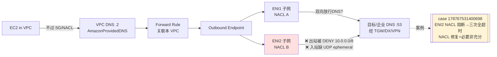
```mermaid
flowchart LR
    EC2[EC2 in VPC] -->|不过 SG/NACL| VPCDNS[VPC DNS .2<br/>AmazonProvidedDNS]
    VPCDNS --> RULE[Forward Rule<br/>关联本 VPC]
    RULE --> EP[Outbound Endpoint]
    EP --> ENI1[ENI1 子网<br/>NACL A]
    EP --> ENI2[ENI2 子网<br/>NACL B]
    ENI1 -->|双向放行DNS?| TGT[目标/企业 DNS :53<br/>经 TGW/DX/VPN]
    ENI2 -->|❌ 出站被 DENY 10.0.0.0/8<br/>❌ 入站缺 UDP ephemeral| TGT
    TGT -.案例.-> NOTE2[[case 178767531400698<br/>ENI2 NACL 阻断→三次全超时<br/>NACL 修复=必要非充分]]
    style ENI2 fill:#ffe0e0
    style NOTE2 fill:#fff4d6
```

### 5.3 Inbound/Outbound 方向 + RAM 共享结构
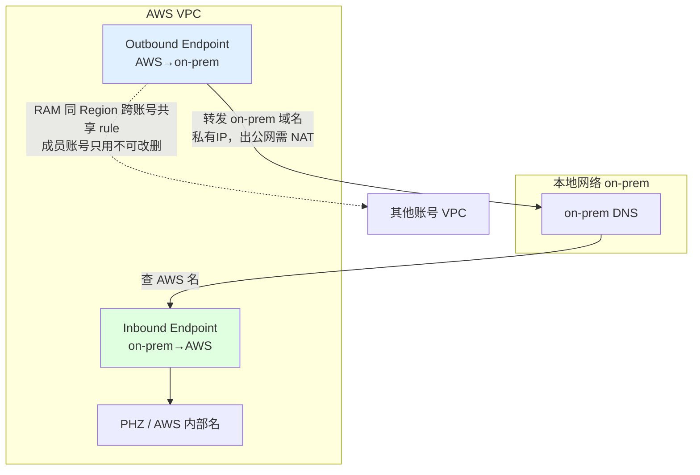
```mermaid
flowchart TB
    subgraph OnPrem[本地网络 on-prem]
      OPDNS[on-prem DNS]
    end
    subgraph AWS[AWS VPC]
      IN[Inbound Endpoint<br/>on-prem→AWS]
      OUT[Outbound Endpoint<br/>AWS→on-prem]
      PHZa[PHZ / AWS 内部名]
    end
    OPDNS -->|查 AWS 名| IN --> PHZa
    OUT -->|转发 on-prem 域名<br/>私有IP，出公网需 NAT| OPDNS
    OUT -. RAM 同 Region 跨账号共享 rule<br/>成员账号只用不可改删 .-> ACCT2[其他账号 VPC]
    style OUT fill:#e0f0ff
    style IN fill:#e0ffe0
```


================================================================================

# FILE: topics/06-dns-firewall.md
<!-- SOURCE FILE: topics/06-dns-firewall.md -->

# 06. DNS Firewall / Global Resolver

## 1. 概念（Concept）

DNS Firewall 是 Route 53 Resolver 的一个特性，对 **出站（outbound）DNS 查询** 做 **域名层过滤**，主要用途是防 **DNS 数据渗漏（exfiltration）**——攻击者把窃取的数据编码进 DNS 查询里发往受控域名。它在查询被解析成 IP 之前就检查域名，命中恶意/黑名单域名或高级威胁模式的查询被直接拦截，永远到不了目标 name server。无需额外部署，它就是 VPC Resolver（VPC+2 / .2 resolver）路径上的一层。

**核心组件**
- **Rule group（规则组）**：一组可复用的 rule 集合，**关联到 VPC** 后生效。
- **Rule（规则）**：组内一条过滤规则，指定一个 domain list（或 Advanced 保护）+ 一个动作。
- **Domain list（域名列表）**：待匹配的域名集合。分两类——**自建（customer-managed）** 与 **AWS 托管（AWS-managed）**。托管列表覆盖 C2、恶意软件、钓鱼等类别，由 AWS 持续维护、**至少每日更新一次**、**具体域名不公开**、每个列表含数千域名。
- **DNS Firewall Advanced**：基于机器学习检测 **DNS tunneling / DGA（域名生成算法）** 这类无法用静态列表覆盖的高级威胁。

**匹配特性（只看域名）**
- **只按域名字符串过滤，不解析成 IP，也不看 HTTPS/SSH/TLS/FTP 等应用层协议**。因此即使某域名在公网根本不存在，只要查询字符串命中列表就会被拦截。
- 自建列表支持 **精确匹配**（`example.com`）与 **通配符**（`*.example.com` 匹配所有子域名）。

**动作（Action）**——SME 关键区分：
- **含 domain list 的规则**可选 **ALLOW / BLOCK / ALERT** 三种动作。
- **不含 domain list 的规则（即 Advanced 保护）只能 BLOCK / ALERT**，不能 ALLOW。
- **BLOCK 响应有三种**可自定义：**NXDOMAIN / NODATA / OVERRIDE（CNAME 重定向）**。

**优先级（priority，SME 高频必背）**
- 一个 VPC 关联多个 rule group 时，**按关联的 priority 数字从小到大** 处理（lowest numeric priority first，先执行）。
- 一个 rule group **内部**每条 rule 有组内唯一 priority，**同样从小到大** 处理。
- 用 **AWS Firewall Manager** 集中管理时，FM 管的关联占据**最低（first）与最高（last）** 两个优先级位置。
- 来源：external §8 / 考点 E25；docs `resolver-dns-firewall-overview.html`。

**Domain redirection（重定向链）设置**
- 默认会**检查整条重定向链**（CNAME/DNAME…）。若一个被 ALLOW 的域名，其 CNAME target 指向另一个**不在列表里**的域名，链上后续域名须**显式加入 domain list 并设动作**，否则可能因 A+AAAA 记录缺失而被 BLOCK。trust 行为仅在**单次查询事务内**有效。（对应内部 QA-497 的 allowlist CNAME 未列被 BLOCK 陷阱。）

**与 Network Firewall 的区别（考点 E26）**
- **DNS Firewall**：只看**经 VPC Resolver 的出站 DNS 查询**，域名层。
- **Network Firewall**：过滤网络/应用层流量，但**看不到 Resolver 发起的 DNS 查询**。二者互补，不是替代关系。

**Global Resolver + DNS View（新形态）**
- **Global Resolver** 提供一组**全球可达的 Anycast IP**，授权客户端（办公网、分支、远程用户）从任何位置解析公共域名和 PHZ 私有域名，**无需 VPN**。（旧称 Route 53 Resolver，因引入 Global Resolver 而把 VPC 内那套更名为 **VPC Resolver**。）
- **DNS View** 是 Global Resolver 里承载策略的对象：**DNS Firewall 规则绑定到 DNS View，不是 VPC**（这与 VPC Resolver 的 DNS Firewall 绑定 VPC 相对）。
- 客户端身份靠 **Access Source（源 IP CIDR 匹配）** 或 **Access Token** 验证。
- **Global Resolver 控制面 API 固定在 us-east-2（Ohio）**。
- 查询日志走 **OCSF 格式**，落 CloudWatch Logs。
- **Global Resolver DNS Firewall 保护 VPC 外部客户端；VPC Resolver DNS Firewall 保护 VPC 内部工作负载**——二者互补。

---

## 2. 真实案例说明（Real Case）

本 topic 无绑定的 Support case，教学锚点是 re:Post 文章 + Global Resolver 实验草稿；内部 QA-497 提供一个经典陷阱。

- **场景（re:Post 教学文章）**：企业要阻止 VPC 外部客户端（办公/远程/分支）解析恶意域名。通过 Global Resolver + DNS View + DNS Firewall 三种规则（自定义黑名单、AWS 托管 Malware 列表、DGA 高级检测）在**查询解析前**拦截。落点：DNS Firewall 是 Global Resolver 安全架构的核心层，在解析发生前评估查询。

- **陷阱案例（内部 QA-497，对应考点"Domain redirection"）**：采用 **allowlist（只放行白名单）** 方式时，一个被允许域名的 **CNAME target 指向另一个未列入白名单的域名**，结果因该 target 的 `A+AAAA 记录` 相当于"未被 ALLOW 命中"而被 `firewall_rule_action: BLOCK`。根因是**重定向链上的后续域名没有显式加入 domain list**。知识点落点：ALLOW 白名单要把整条 CNAME 链的域名都覆盖，或正确配置 Trust Redirection Domains 设置。

- **验证陷阱（贯穿实验）**：**ALERT 规则命中的流量，OCSF 日志里 `action_name` 仍是 `Allowed`（因为被放行了）**，只能靠日志中的 `firewall_rule_id` 区分它是否命中了某条 ALERT 规则；同理 **DGA 规则是否命中不能仅凭 dig 返回 NXDOMAIN 判断，必须查日志的 `firewall_rule_id`**。这是"用户可见形态 ≠ 中间判据"的典型：单看 dig 结果会误判。

---

## 3. 实验步骤（Hands-on Lab）

完整端到端实验：**建 Global Resolver → DNS View → Access Source → Query Logging → 三类 Firewall 规则 → dig 验证 → CloudWatch Logs Insights 查 OCSF `firewall_rule_id`**。

> Region 固定 **us-east-2（Ohio）**；资源前缀 `lab-`；预计 30–40 分钟。属**创建资源型（有成本）** 实验，做完务必按 Step 9 清理。

**前提条件**
- IAM 权限：`AmazonRoute53GlobalResolverFullAccess` + `CloudWatchLogsFullAccess`。
- 最新 AWS CLI v2：`aws route53globalresolver help` 确认子命令可用。
- 取本机公网 IPv4：`curl -4 -s https://checkip.amazonaws.com`

**Step 1：创建 Global Resolver**
1. Console → Region 切到 **US East (Ohio) us-east-2** → Route 53 → 左侧 **Global Resolver** → **Create global resolver**。
2. Resolver name `lab-global-resolver`；Regions 选 `us-east-2` + `us-west-2`（≥2 个，就近选）；IP address type `Dual-stack`。
3. Create → 等状态 **Operational**（约 3–5 分钟）→ **记下分配的 Anycast IPv4 地址**（后续测试用）。

**Step 2：创建 DNS View**
1. 进入 `lab-global-resolver` → **DNS views** tab → **Create DNS view** → name `lab-dns-view`。
2. 默认项：DNSSEC validation `Enable`、Firewall rules fail open `Disable`、EDNS client subnet `Enable`。
3. Create → 等 **Operational** 再继续。

**Step 3：配置 Access Source（授权客户端）**
1. `lab-dns-view` → **Access sources** tab → **Create access source**。
2. Name `lab-my-ip`；CIDR block = `你的IPv4/32`（精确匹配本机公网 IP）；Protocol `Do53`。
3. Create → 等 **Operational**。

**Step 4：启用 Query Logging（测试前先开，否则查询不被捕获）**
1. 回 `lab-global-resolver` 详情页 → Resolver details 里 **Observability Region** → **Edit** → 选 `US East (Ohio) us-east-2` → Save。
2. **Log delivery** tab → 目标 **CloudWatch Logs log group**，Log type 保持 `GLOBAL_RESOLVER_LOGS`；log group 用系统推荐路径（形如 `/aws/vendedlogs/route53globalresolver/...`）或建 `/aws/route53globalresolver/lab-firewall-logs` → Save。

**Step 5：创建自定义域名列表**
1. `lab-global-resolver` → **Domain lists** tab（**注意是 Global Resolver 内部的 Domain lists，不是左侧菜单 VPC Resolver 下的**）→ **Create domain list** → name `lab-blocked-domains` → Create → 等 **Operational**。
2. 进入 `lab-blocked-domains` → **Add domains**（Specify manually），每行一个：
   ```
   malicious-test.example.com
   *.phishing-demo.net
   bad-site.org
   ```
3. Add → 再次等 **Operational**。（精确匹配 + 通配符；域名即使公网不存在也会被拦。）

**Step 6：创建三条 Firewall 规则**（`lab-dns-view` → **DNS Firewall rules** tab → **Create rule**）

- **规则 A — 自定义域名 Block**：name `lab-block-custom`；type **Customer managed domain lists**；Domain list 选 `lab-blocked-domains`；Query type 留空（匹配所有类型）；Action **Block**；Block 响应 **NXDOMAIN**。
- **规则 B — AWS 托管恶意域名 Block**：name `lab-block-malware`；type **AWS managed domain lists**；下拉选 **Malware** 类别；Action **Block**；响应 **NXDOMAIN**。
- **规则 C — DGA 高级检测**：name `lab-detect-dga`；type **DNS Firewall Advanced protections**；Protection type **Domain Generation Algorithms (DGAs)**；Confidence threshold **HIGH**；Action **Block**；响应 **NXDOMAIN**。

创建后在规则列表确认三条全为 **Operational**，并**记下每条的 Firewall Rule ID（`fr-xxxxxxxxx`）**。**Priority 由系统按创建顺序自动分配 1、2、3，数字越小越先执行**；如需调整顺序 → 选中规则 → Edit → 改 Priority。

| Priority | Name | Action | Type |
|---|---|---|---|
| 1 | lab-block-custom | Block | Domain lists |
| 2 | lab-block-malware | Block | AWS Managed |
| 3 | lab-detect-dga | Block | Advanced DGA |

**Step 7：dig 测试验证**（从**已授权**客户端执行，`ANYCAST_IP` 换成 Step 1 的 IP）
```bash
ANYCAST_IP="x.x.x.x"

# 1. 正常域名 → 预期 status: NOERROR，返回正常 A 记录
dig @$ANYCAST_IP aws.amazon.com

# 2. 自定义黑名单精确匹配（规则 A）→ 预期 status: NXDOMAIN
dig @$ANYCAST_IP malicious-test.example.com

# 3. 通配符匹配 → 预期 status: NXDOMAIN
dig @$ANYCAST_IP anything.phishing-demo.net

# 4. DGA 风格随机域名（规则 C 可能命中，不保证）
dig @$ANYCAST_IP xk3f9a2bz7mqp4dwn.evil-test.com
```
**判读——如何区分 Firewall Block 与正常公网 NXDOMAIN**：
- Firewall 拦截：flags 含 `qr aa rd`，**无 AUTHORITY section，无 OPT PSEUDOSECTION**。
- 正常公网 NXDOMAIN：flags 含 `qr rd ra`，**有 SOA AUTHORITY section + OPT**。

**Step 8：OCSF 日志确认命中**（等 1–2 分钟日志到 CloudWatch → us-east-2 → Logs Insights → 选对应 log group）
```
fields @timestamp, query.hostname, action_name, rcode
| sort @timestamp desc
| limit 20
```
- `action_name = Denied` → 被拦截；`action_name = Allowed` → 放行（含 DGA 未命中）。
- 展开 Denied 条目，看 `enrichments[].data.firewall_rule_id` 是否与你的规则 ID 一致。
- **DGA 规则是否命中，只能靠此处的 `firewall_rule_id` 确认**，不能凭 dig 的 NXDOMAIN 判断。HIGH 阈值较保守，未命中随机域名属正常行为（可降到 MEDIUM 重建再测）。

**Step 9：清理（按序）**
1. DNS View → Firewall rules → 逐条删 3 条规则；
2. Global Resolver → Domain lists → 删 `lab-blocked-domains`；
3. DNS View → Access sources → 删 `lab-my-ip`；
4. Global Resolver → DNS views → 删 `lab-dns-view`；
5. Global Resolver 列表 → 删 `lab-global-resolver`；
6. CloudWatch → Log groups → 删对应 log group。

---

## 4. SME 考点 / 易错点（Exam Points & Pitfalls）

**E25 — DNS Firewall 基本盘**
- 结论：**只管出站、只按域名、防 exfiltration**；rule group 与 rule **都按 priority 数字从小到大** 处理；**含 domain list 的规则才能 ALLOW，Advanced 只能 BLOCK/ALERT**。
- 常见错误：以为它能按 IP/端口/应用层过滤（错，只看域名字符串）；以为 priority 数字大的先执行（错，**小的先**）；以为任何规则都能 ALLOW（错，Advanced 不行）。

**E26 — DNS Firewall vs Network Firewall**
- 结论：DNS Firewall 看**经 Resolver 的出站 DNS 查询**；Network Firewall 看网络/应用层但**看不到 Resolver 发起的 DNS 查询**。
- 常见错误：以为 Network Firewall 能拦住 DNS exfiltration（拦不到 Resolver 的查询），或以为二者二选一（其实互补）。

**BLOCK 响应三选一**：**NXDOMAIN / NODATA / OVERRIDE（CNAME 重定向）**。易错：以为只有 NXDOMAIN 一种。

**Domain redirection 陷阱（内部 §5 QA-497）**
- 结论：allowlist 模式下，被 ALLOW 域名的 CNAME target 若未列入 domain list，会被 BLOCK；默认检查整条重定向链，链上域名须显式加入并设动作，trust 仅在单次查询事务内有效。
- 常见错误：只把入口域名加白名单，忘了 CNAME 指向的后续域名。

**ALERT / DGA 的验证陷阱（横切"报收工前硬性自检"）**
- 结论：**ALERT 命中流量的 `action_name` 仍是 `Allowed`**；**DGA 是否命中必须查 OCSF `firewall_rule_id`，不能凭 dig 的 NXDOMAIN 判断**。
- 常见错误：单看 dig 返回值就下"规则命中/未命中"结论。OCSF 里动作值是 `Allowed`/`Denied`，**不是** `ALLOW`/`BLOCK`。

**AWS 托管域名列表**：具体域名**不公开**，每列表数千域名，**至少每日更新一次**，覆盖 C2/恶意软件/钓鱼等类别。易错：以为能查看/编辑托管列表里的具体域名。

**Firewall Manager**：可跨组织集中管理 rule group 关联，FM 的关联占据**最低与最高**两个优先级位置。

**Global Resolver 特有考点**
- **控制面 API 固定 us-east-2（Ohio）**。
- **Firewall 规则绑定 DNS View，不是 VPC**（对比 VPC Resolver 绑 VPC）。
- 客户端授权靠 **Access Source（源 IP）或 Access Token**。
- **Global Resolver 保护 VPC 外部客户端；VPC Resolver 保护 VPC 内部**。
- **Advanced Protection 与域名列表不能放在同一条规则里**。
- 每个资源（DNS View / Access Source / Domain List / Firewall Rule）创建后都需等 **Operational** 才生效；Domain List 建好等一次、加域名后再等一次。

**内部边界速记（§5）**：DNS Firewall 是 VPC Resolver 特性，无需额外部署；VPC .2 resolver 支持 EDNS0 但不支持 ECS（与 Firewall 无关但同属 Resolver 层，勿混）。

---

## 5. 该域 Mermaid 逻辑导图（Logic Diagram）

出站 DNS 查询经 DNS Firewall 的处理决策链（priority 从小到大，含 Block 三响应与 OCSF 日志判读）：

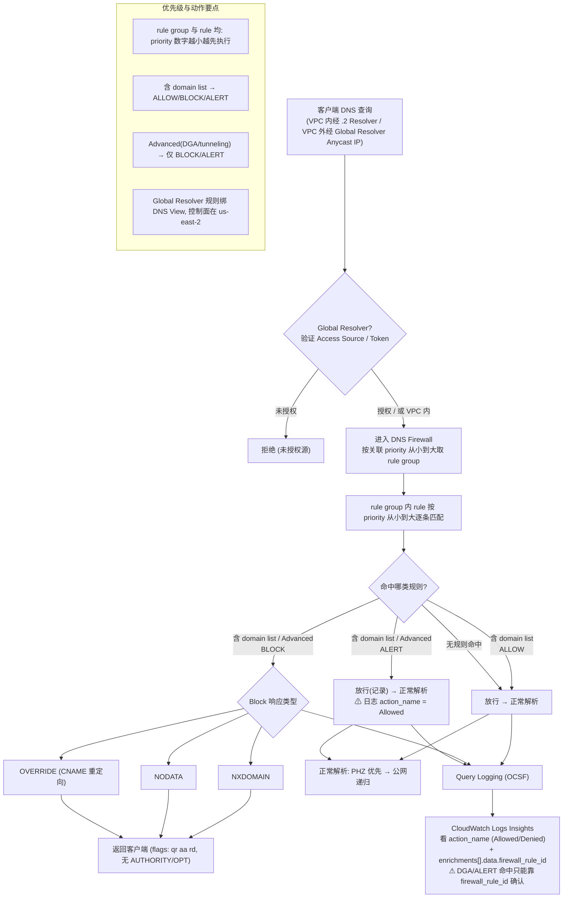
```mermaid
flowchart TD
    A["客户端 DNS 查询<br/>(VPC 内经 .2 Resolver / VPC 外经 Global Resolver Anycast IP)"] --> B{"Global Resolver?<br/>验证 Access Source / Token"}
    B -->|未授权| BX["拒绝 (未授权源)"]
    B -->|授权 / 或 VPC 内| C["进入 DNS Firewall<br/>按关联 priority 从小到大取 rule group"]
    C --> D["rule group 内 rule 按 priority 从小到大逐条匹配"]
    D --> E{"命中哪类规则?"}

    E -->|"含 domain list<br/>ALLOW"| F["放行 → 正常解析"]
    E -->|"含 domain list / Advanced<br/>BLOCK"| G{"Block 响应类型"}
    E -->|"含 domain list / Advanced<br/>ALERT"| H["放行(记录) → 正常解析<br/>⚠ 日志 action_name = Allowed"]
    E -->|"无规则命中"| F

    G --> G1["NXDOMAIN"]
    G --> G2["NODATA"]
    G --> G3["OVERRIDE (CNAME 重定向)"]

    F --> I["正常解析: PHZ 优先 → 公网递归"]
    G1 --> J["返回客户端 (flags: qr aa rd, 无 AUTHORITY/OPT)"]
    G2 --> J
    G3 --> J
    H --> I

    F --> K["Query Logging (OCSF)"]
    G --> K
    H --> K
    K --> L["CloudWatch Logs Insights<br/>看 action_name (Allowed/Denied)<br/>+ enrichments[].data.firewall_rule_id<br/>⚠ DGA/ALERT 命中只能靠 firewall_rule_id 确认"]

    subgraph note["优先级与动作要点"]
      P1["rule group 与 rule 均: priority 数字越小越先执行"]
      P2["含 domain list → ALLOW/BLOCK/ALERT"]
      P3["Advanced(DGA/tunneling) → 仅 BLOCK/ALERT"]
      P4["Global Resolver 规则绑 DNS View, 控制面在 us-east-2"]
    end
```


================================================================================

# FILE: topics/07-dnssec.md
<!-- SOURCE FILE: topics/07-dnssec.md -->

# Topic 07 — DNSSEC

## 一、概念

DNSSEC（DNS Security Extensions）用数字签名为 DNS 应答提供**来源认证**与**完整性校验**，防止应答被篡改或投毒。它**只鉴权 + 保完整性，不提供机密性——不加密** DNS 查询或应答内容（明文照旧可被中间人看到，只是无法被篡改而不被发现）。

### 签名与验证的角色分工（考点）

- **权威服务器（Route 53）只负责"提供签名数据"**：随应答附上 RRSIG 签名、DNSKEY、（否定应答时）NSEC/NSEC3 记录。
- **DNSSEC 验证通常由递归解析器（recursive resolver / validating resolver）完成**：解析器逐级取签名、沿信任链校验，验证通过才在应答里置 **AD（Authenticated Data）**标志。权威服务器本身不做"验证"动作。

### RRSIG：对整个 RRset 签名（考点）

- **RRSIG 覆盖的是"同名 + 同类型"的整个 RRset**，不是单独某一条记录。例如某域名下的一组 A 记录（同名同类）作为一个 RRset 由同一条 RRSIG 一起签，不能只对其中一条签。
- **RRSIG 有独立的有效期（inception / expiration 时间戳），与记录的 TTL 是两回事**：TTL 控制"应答能被缓存多久"，RRSIG 的 inception/expiration 控制"这份签名在什么时间窗口内被解析器视为有效"。签名过期会导致验证失败（SERVFAIL），即使 TTL 还没到；Route 53 managed signing 会自动在过期前重签，用户不需手动续。

### 两类密钥（KSK / ZSK）

| 密钥 | 全称 | DNSKEY flag（algo 13） | 作用 |
|---|---|---|---|
| KSK | Key Signing Key | **257** | 签署**整个 DNSKEY RRset**（这个 RRset 同时包含 KSK 自身和 ZSK 的公钥），是信任链上被父区 DS 指向的那把钥匙 |
| ZSK | Zone Signing Key | **256** | 签署 zone 内其余所有 RRset（A、MX、TXT……） |

> 易错点：KSK **不是"签 ZSK"**，而是签"包含 KSK+ZSK 两把公钥的那条 DNSKEY RRset"。解析器用父区 DS 验证 KSK → KSK 验证 DNSKEY RRset（从而信任其中的 ZSK）→ ZSK 验证具体业务记录的 RRSIG。

Route 53 托管（managed）signing：ZSK 由 Route 53 内部管理并自动轮换，用户只需管理 KSK（KSK 绑定一个 KMS 客户主密钥 CMK）。

### 信任链与 DS 记录

信任是**逐级从父区向下建立**的：

```
根区 (.)  →  顶级域 (.com)  →  子区 (pd-market.com)
              放 DS 记录            放 DNSKEY(KSK/ZSK)
```

- **DS 记录（Delegation Signer）放在父区**，内容是**子区 KSK 对应 DNSKEY 的摘要（digest）加上算法元数据**（Key Tag、Algorithm、Digest Type、Digest），**并不包含完整的 KSK 公钥**——它只是一个指向、校验子区 KSK 的"指纹 + 元数据"。
- 解析器验证时：拿到子区 DNSKEY → 按 DS 里的 Digest Type 算法算出子区 KSK 的摘要 → 与父区 DS 的 Digest 比对 → 一致则信任该 zone 的签名 → 用 ZSK 验证具体记录。
- **DS 缺失 = 信任链断**：父区没有指向子区 KSK 的 DS，验证链就接不上。

> 记忆点：**DS 在父区，DNSKEY 在子区**，方向别搞反。DS 是"父指子"的摘要指针（子区 KSK 的 digest + 算法元数据），不含完整公钥。

### island of trust（信任孤岛）

zone 自己已经 signing（有 DNSKEY、记录都带 RRSIG 签名），但**父区没有对应的 DS 记录** → 有签名却接不上信任链。此状态下：

- 支持 DNSSEC 的解析器**不会做验证**（因为父区没告诉它该 zone 是签名的），按普通 DNS 正常返回。
- **解析仍然正常，不影响可用性**。
- 这是"半启用"的中间态，常见于：刚在 Route 53 启用了 signing、但还没到父区/注册商建 DS；或禁用过程中先删了 DS 但还没关 signing。

### 启用流程（概览）

1. 在 Route 53 Hosted Zone 启用 DNSSEC signing —— 需要创建一个 **KSK**，绑定一个符合要求的 **KMS CMK**（该 CMK 必须在 **us-east-1**、asymmetric ECC_NIST_P256）。
2. Route 53 生成 DNSKEY，开始对 zone 签名。
3. 到**父区/注册商建立 DS 记录**（把 Route 53 给出的 DS 值填进去），信任链闭合。

### 禁用流程（概览，考点）

**必须先解除信任链**：**先删父区的 DS 记录**，Route 53 才允许关闭 signing。若直接禁用，Route 53 报错：

```
Please remove DS records in the parent zone first
```

例外：处于 **island of trust**（父区本就无 DS）时，文档允许**跳过删 DS 直接禁用**。若此时 Console 仍报"先删 DS"，多半是此前在注册商/父区上传过 DS、Console 的信任链状态尚未同步。参考文档：`dns-configuring-dnssec-disable.html`。

### KSK 的 KMS CMK 硬性要求（考点）

创建 KSK 绑定的 KMS 客户主密钥必须满足：

- **必须位于 us-east-1（N. Virginia）** —— Route 53 DNSSEC 的 KSK 只能用 us-east-1 区域的 KMS 密钥，其他区域的 key 无法绑定；
- **asymmetric（非对称）密钥** —— 不能是对称 key；
- 密钥规格 **ECC_NIST_P256**（用途 SIGN_VERIFY）；
- **key policy 授权 Route 53 DNSSEC 服务**（`dnssec-route53.amazonaws.com`）使用该密钥。

任一不满足，启用/使用时报错：

```
<key ARN> could not be used by Route 53 DNSSEC
```

### 否定应答的鉴权：NSEC / NSEC3（考点）

DNSSEC 也要能"可验证地证明某名字/类型不存在"。这靠 NSEC / NSEC3 记录实现：

- **NSEC** 按字典序把 zone 内的名字串成一个环，每条 NSEC 指出"下一个存在的名字"，从而证明中间的名字不存在。副作用是它**明文暴露了相邻的真实名字**，攻击者可沿链逐跳把整个 zone 的名字全部"走"出来（zone walking / 区域枚举）。
- **NSEC3** 改用名字的**哈希值**串环，不再明文暴露名字。但要清楚：**NSEC3 只是提高了区域枚举的成本，并不能彻底阻止枚举**——攻击者仍可离线对哈希做字典/暴力破解还原名字，NSEC3 只是让这件事更贵、更慢，而非不可能。想真正减小枚举面还需配合白谎（NSEC3 white lies / minimally covering）等手段。

> 易错点：不要把"NSEC3 彻底防止 zone 枚举"当成正确表述——它只是抬高成本。


- 父区 DS、注册商侧的变更都有**传播延迟**（受父区 TTL / 注册商处理影响）。
- **轮换 KSK 需走 DS 双记录过渡**：新旧 DS 并存一段时间，等旧 DS 在解析器缓存中过期后再撤旧，避免中途验证失败。

---

## 二、真实案例说明（Case 178970323600938 · pd-market.com）

**背景**：客户从 EC2 实例 `dig pd-market.com` 持续 **SERVFAIL**（加 `+cd` 仍 SERVFAIL），而公网 8.8.8.8 正常。

**关键澄清**：此案 SERVFAIL 的**真正根因是 stale NS 委派**（解析路径取到了旧的一组 NS，旧 NS 已不托管该 zone、返回 REFUSED，逐级传导为 SERVFAIL），**并非 DNSSEC 问题**。这一点对 SME 很重要：SERVFAIL 会让人第一反应怀疑 DNSSEC 验证失败，但要先区分——见下方考点⑤。

客户在处理过程中**另外**想禁用 DNSSEC，撞上两个真实卡点：

### 卡点 1：禁用报"先删父区 DS"

客户禁用 signing 时报 `Please remove DS records in the parent zone first`。

主会话实测（DIRECTLY_OBSERVED）：

| 查询 | 结果 | 含义 |
|---|---|---|
| `dig DNSKEY pd-market.com @ns-63.awsdns-07.com` | 返回 **256 / 257，algo 13** | zone 已 signing（KSK+ZSK 都在） |
| `dig DS pd-market.com @a.gtld-servers.net`（.com） | **空** | 父区 .com 无 DS |

→ zone 有 DNSKEY 但父区无 DS = **island of trust**。按文档此状态本可直接禁用而无需删 DS。客户仍遇"先删 DS"报错，判定为：此前曾在 Registered domain 上传过 DS，Console 信任链状态未同步。**处理建议**：先到 Route 53 → Registered domains → pd-market.com 的 DNSSEC 区确认已无 DS，再重试禁用。

### 卡点 2：KMS key 报错

客户 KSK 绑定的 CMK `arn:aws:kms:us-east-1:026955879080:key/3564b66a-...` 报 `could not be used by Route 53 DNSSEC`。原因落在上述 KMS 硬性要求上：CMK 非 asymmetric ECC_NIST_P256，或 key policy 未授权 Route 53 DNSSEC，或该 key 被禁用/删除（本案未实查该 key 状态，标 UNKNOWN；仅在客户坚持禁用且卡在 KMS 时才深入排查此项）。

### island of trust 判定小结

`.com 无 DS`（父区）+ `ns-63 有 DNSKEY 256/257`（子区已签名）→ 典型 island of trust → **不影响解析**。本案公网各路径解析 44.196.71.67 均正常，正好印证"有签名无信任链不等于解析故障"。

---

## 三、实验步骤（可复现）

以下命令用 pd-market.com 举例，替换成你自己的 zone 与 CMK。

### 3.1 准备 KSK 用的 KMS CMK（必须符合硬性要求）

```bash
# 创建 asymmetric ECC_NIST_P256、用途为 SIGN_VERIFY 的 CMK
aws kms create-key \
  --key-spec ECC_NIST_P256 \
  --key-usage SIGN_VERIFY \
  --description "Route53 DNSSEC KSK" \
  --policy file://ksk-key-policy.json \
  --region us-east-1
```

`ksk-key-policy.json` 需在 policy 中授权 Route 53 DNSSEC 服务主体（`dnssec-route53.amazonaws.com`）对该 key 执行 `kms:DescribeKey / kms:GetPublicKey / kms:Sign / kms:CreateGrant` 等操作，否则会报 "could not be used by Route 53 DNSSEC"。

### 3.2 启用 DNSSEC signing 并创建 KSK

```bash
# 1) 在 Hosted Zone 上创建 KSK，绑定上一步的 CMK
aws route53 create-key-signing-key \
  --hosted-zone-id Z006303821TK6RC84YJ8P \
  --key-management-service-arn arn:aws:kms:us-east-1:<acct>:key/<key-id> \
  --name my-ksk \
  --status ACTIVE \
  --caller-reference $(date +%s)

# 2) 启用 zone 级 signing
aws route53 enable-hosted-zone-dnssec \
  --hosted-zone-id Z006303821TK6RC84YJ8P

# 3) 取出 Route 53 生成的 DS 值（填到父区/注册商用）
aws route53 get-dnssec \
  --hosted-zone-id Z006303821TK6RC84YJ8P
# 关注返回中的 KeySigningKeys[].DSRecord
```

（控制台路径：Hosted zones → 选中 zone → DNSSEC signing → Enable → 选 CMK / 建 KSK。）

### 3.3 在父区 / 注册商建立 DS 记录

- **注册商在 Amazon Registrar**：Route 53 → Registered domains → 域名 → DNSSEC → 添加上一步的 DS。
- **注册商在第三方**：把 DS 的 Key Tag / Algorithm(13) / Digest Type / Digest 填到注册商控制台。

### 3.4 验证

```bash
# 子区已签名？应看到 256(ZSK) 与 257(KSK)，algo 13
dig DNSKEY pd-market.com @ns-63.awsdns-07.com +short

# 父区已有 DS？信任链是否闭合（向 .com 权威查）
dig DS pd-market.com @a.gtld-servers.net +short
#   有 DS  = 信任链已建立
#   DS 为空 = island of trust（zone 签名了但父区没 DS）

# 完整验证：向支持验证的递归查，看是否带 AD（Authenticated Data）标志
dig pd-market.com @8.8.8.8 +dnssec
#   header 出现 flags: ... ad  → 验证通过

# 区分 SERVFAIL 是不是 DNSSEC 验证失败
dig pd-market.com @<recursive>          # SERVFAIL
dig pd-market.com @<recursive> +cd      # +cd 关闭验证：
#   变 NOERROR → 原 SERVFAIL 是 DNSSEC 验证失败
#   仍 SERVFAIL → 与 DNSSEC 无关（如本案：stale NS 委派）
```

### 3.5 按正确顺序禁用

```bash
# 1) 先删父区 / 注册商的 DS（解除信任链）
#    Amazon Registrar：Registered domains → 域名 → DNSSEC → 删除 DS
#    第三方注册商：在其控制台删 DS
#    等父区 DS TTL 过期、传播完成

# 2) 确认父区已无 DS
dig DS pd-market.com @a.gtld-servers.net +short   # 应为空

# 3) 关闭 signing（此时才允许）
aws route53 disable-hosted-zone-dnssec \
  --hosted-zone-id Z006303821TK6RC84YJ8P

# 4) （可选）删除 KSK
aws route53 deactivate-key-signing-key --hosted-zone-id <id> --name my-ksk
aws route53 delete-key-signing-key     --hosted-zone-id <id> --name my-ksk
```

> island of trust（父区本就无 DS）时可跳过步骤 1；若 Console 仍报"先删 DS"，先到 Registered domains 的 DNSSEC 区确认无 DS 后重试。

---

## 四、SME 考点 / 易错点

1. **禁用必须先删父区 DS（顺序）**：不删父区 DS 就禁用会报 `Please remove DS records in the parent zone first`。正确顺序是"先解信任链（删 DS）→ 等传播 → 再关 signing"。island of trust 时可跳过删 DS。
2. **KSK 的 KMS CMK 必须位于 us-east-1、且是 asymmetric ECC_NIST_P256**（不是对称 key），并且 key policy 要授权 Route 53 DNSSEC（`dnssec-route53.amazonaws.com`）；任一不满足报 `could not be used by Route 53 DNSSEC`。仅"在 us-east-1"并不够，非对称/规格/授权三者也都要满足。
3. **island of trust 不影响解析**：zone 有 DNSKEY 但父区无 DS，只是"有签名无信任链"，解析器不验证、按普通 DNS 正常返回，可用性不受影响。
4. **DS 在父区、DNSKEY 在子区，别搞反**：DS 是子区 KSK 对应 DNSKEY 的**摘要 + 算法元数据**（不含完整公钥）、放在父区做"父指子"的信任指针；DNSKEY（KSK 257 / ZSK 256）在子区自身。
5. **DNSSEC 验证失败表现为 SERVFAIL**：但 SERVFAIL 原因很多（如本案是 stale NS 委派）。用 `dig +cd`（关闭验证）区分——`+cd` 后变 NOERROR 才是 DNSSEC 验证问题；仍 SERVFAIL 则与 DNSSEC 无关。
6. **KSK 签的是整个 DNSKEY RRset（含 KSK+ZSK），不是"签 ZSK"**；ZSK 签其余业务 RRset。**RRSIG 对"同名同类型的整个 RRset"签名**，不是对单条记录签名。
7. **验证由递归解析器做，权威只提供签名**：Route 53（权威）随应答附 RRSIG/DNSKEY/NSEC(3)，真正的信任链校验与 AD 标志由 validating recursive resolver 完成。
8. **DNSSEC 只鉴权 + 保完整性，不加密**：DNS 内容仍是明文，DNSSEC 不提供机密性。
9. **签名有效期与 TTL 独立**：RRSIG 的 inception/expiration 控签名有效窗口，TTL 只控缓存时长；签名过期即使 TTL 未到也会 SERVFAIL（Route 53 managed signing 自动重签）。
10. **NSEC3 只提高枚举成本、不彻底阻止**：NSEC 会明文暴露相邻名字（可 zone walking），NSEC3 用哈希串环降低暴露，但仍可被离线破解还原，只是更贵。

---

## 五、Mermaid 逻辑导图

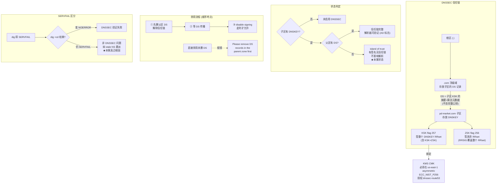
```mermaid
flowchart TD
    subgraph Chain["DNSSEC 信任链"]
        ROOT["根区 (.)"] --> TLD[".com 顶级域<br/>存放子区的 DS 记录"]
        TLD -->|"DS = 子区 KSK 的<br/>摘要+算法元数据<br/>(不含完整公钥)"| ZONE["pd-market.com 子区<br/>存放 DNSKEY"]
        ZONE --> KSK["KSK flag 257<br/>签整个 DNSKEY RRset<br/>(含 KSK+ZSK)"]
        ZONE --> ZSK["ZSK flag 256<br/>签其余 RRset<br/>(RRSIG 覆盖整个 RRset)"]
    end

    KSK -->|绑定| CMK["KMS CMK<br/>必须在 us-east-1<br/>asymmetric<br/>ECC_NIST_P256<br/>授权 dnssec-route53"]

    subgraph State["状态判定"]
        Q1{"子区有 DNSKEY?"}
        Q2{"父区有 DS?"}
        Q1 -->|否| S0["未启用 DNSSEC"]
        Q1 -->|是| Q2
        Q2 -->|是| S1["信任链完整<br/>解析器可验证 (AD 标志)"]
        Q2 -->|否| S2["island of trust<br/>有签名无信任链<br/>不影响解析<br/>★本案状态"]
    end

    subgraph Disable["禁用流程 (顺序考点)"]
        D1["① 先删父区 DS<br/>解除信任链"] --> D2["② 等 DS 传播"]
        D2 --> D3["③ disable signing<br/>此时才允许"]
        DX["直接禁用未删 DS"] -.报错.-> ERR["Please remove DS<br/>records in the<br/>parent zone first"]
    end

    subgraph Diag["SERVFAIL 区分"]
        F1["dig 得 SERVFAIL"] --> F2{"dig +cd 结果?"}
        F2 -->|变 NOERROR| F3["DNSSEC 验证失败"]
        F2 -->|仍 SERVFAIL| F4["非 DNSSEC 问题<br/>如 stale NS 委派<br/>★本案真正根因"]
    end
```


================================================================================

# FILE: topics/08-subdomain-takeover.md
<!-- SOURCE FILE: topics/08-subdomain-takeover.md -->

# 08. DNS 安全 / dangling delegation / subdomain takeover

## 1. 概念（Concept）

本域讲**子域接管（subdomain takeover）**这一类 DNS 安全风险的原理、Route 53 的防护边界（StopZoneSniping / dangling delegation 保护），以及运维侧的正确删除顺序与防御手段。核心心智模型：**接管不是 AWS 服务漏洞，而是父域侧留下的"悬空指针"被他人抢占**——属**共享责任模型的客户侧**（外部 §14/security blog；内部 §1/§12）。

### 1.1 什么是 dangling DNS 记录 / 悬空委派

- **dangling DNS record（悬空记录）**：一条 DNS 记录仍指向一个**已不再由你掌控**的目标。两种典型向量：
  - **CNAME 向量**：`app.example.com` CNAME 指向一个已释放的 AWS 资源。当前典型可被抢注的目标是 **S3 静态站点桶、Elastic Beanstalk 环境、以及 AWS 重新分配域名场景下的 CloudFront**——攻击者在同一服务里"抢注"那个已释放的名字/桶/环境，就能用你的子域名提供内容（AWS security blog 主讲这一向量）。（注意：不要把 ELB/ALB 的 DNS 名列为典型可抢注目标。）
  - **NS 委派向量（本 topic 绑定 case 的向量）**：父 zone 里 `sub.example.com` 的 **NS 委派记录**仍指向一组 Route 53 权威 NS，但那组 NS 上**对应的 child hosted zone 已被删除**（或从未建立）。递归解析器仍会把该子域的查询送到那组 NS。
- **悬空委派（dangling delegation）**：即上面的 NS 向量——**父域的委派"悬空"**，指向没有权威 zone 撑腰的 NS 组。

### 1.2 subdomain takeover 原理

1. 父 zone 保留了 `sub.example.com` 的 NS 记录（4 个 awsdns NS），但 child zone 已删。
2. 攻击者在**任意 AWS 账号**里反复创建同名 hosted zone（`sub.example.com`），直到 Route 53 分配给它的委派组**与那 4 个悬空 NS 有重叠**（哪怕只重叠 **1 个** NS）。
3. 递归解析器在委派的多个 NS 间选择/重试，只要命中攻击者掌控的那个重叠 NS，就会拿到攻击者 zone 里的权威应答——攻击者即可用**你的子域名**发内容（钓鱼、发证书、Cookie 窃取等）。**重叠的 NS 越多，接管越稳定**（"只需命中 1 个 NS 就一定接管"是不精确的稳定性描述）。

### 1.3 Route 53 的防护：StopZoneSniping 与 5 个 Scenario（硬考点）

官方文档 `protection-from-dangling-dns.html` 定义 5 个场景，**Route 53 只对 Scenario 1 提供防护**：

| Scenario | 情形 | R53 是否防护 |
|---|---|---|
| **1** | child zone **曾存在**→被删除，父域**仍留委派** | **✅ 唯一会防护**（对被删 zone 的那组 NS 加 **hold**，阻止重叠 NS 被重新分配给任何新同名 zone） |
| 2 | 迁移/换 DNS 供应商，主动 remove the hold | ❌ 不防护（hold 被移除） |
| 3 | 委派到 R53 NS 但记录配置错误 | ❌ 不防护 |
| 4 | 用了不属于你的 zone 的 NS | ❌ 不防护 |
| 5 | **先委派、后建 zone**（那组 NS 从未托管过该域，从无 hold 可建立） | ❌ 不防护 |

- 文档原文：**"scenarios 2 through 5 ... Route 53 can't protect against"**。
- **StopZoneSniping 保护特性（对外公开结论，不涉内部实现）**：
  - **全局 / 跨账号**：保护阻止**任何账号**被分配到与已删 zone 重叠的 NS（Harbinger notice: "all Route 53 customers are now protected"；文档 "prevent any overlapping name servers from being assigned"）。**不是"仅限删除账号内"**。
  - **per-NS（覆盖任一重叠 NS）**：新同名 zone 只要**重叠一个或多个** NS 即被阻止（"share one or more Route 53 name servers"）。**不是"必须整组重叠才拦"**。
  - **hold 生命周期（公开结论层面）**：删父区委派后 hold 被移除、对应 NS 组不再被保护；因此**hold 不是永久的**——父域委派仍在时才持续保护，委派移除后保护随之解除。（其内部实现机制不是公开契约，不作展开。）
  - **backfill 边界**：保护启用**之前**就已 dangling 的委派，若未 backfill，可能不覆盖（重用概率更高）。

### 1.4 边界数字 / 硬结论（背记）

- **只有 Scenario 1 有防护**；2–5 一律不防护。
- 接管**命中 1 个重叠 NS 即可**（保护也按 per-NS 生效）。
- 保护是**跨账号全局**的，不是账号内。
- child zone 委派**新建的空 zone SOA serial 常为 1**，但这**不是可靠的修复指纹**（1 只是默认示例值，不会自动递增、也可被改写）；判定修复应**核对父区委派是否指向真正权威的目标 NS**，而非看 serial 值。
- **删 zone 正确顺序**：先删父域 NS 记录 → **等 TTL 过** → 再删 child zone（见 §3）。
- **DNSSEC signing** 是对该风险的密码学防护（应答需权威源签名，伪造 zone 无法通过验真）。
- AWS **无法读取/删除第三方账号的 Hosted Zone**；NS 向量的修复只能由**父域持有方**在父域侧完成。

---

## 2. 真实案例说明（Real Case）

### Case 178715620200407（Thales / kycshowcase.d1.thalescloud.io，★ subdomain takeover + StopZoneSniping）

**一句话**：客户（Thales，父域 `thalescloud.io` / `d1.thalescloud.io` 持有方）内部 pentest 成功接管子域 `kycshowcase.d1.thalescloud.io`；客户不求修复，只问**为何 Route 53 的 dangling delegation 保护（StopZoneSniping）没能阻止这次接管**。根因是 NS 委派向量的悬空 + hold 未在效——把 Scenario 1 的防护边界钉到真实故事上。

**事件链（客户第一手确认）**：
- child zone `kycshowcase.d1.thalescloud.io` **曾存在**，退役时被删，但父域 `d1` 里那 4 个 NS 委派**未同步删** → 悬空委派。
- 约 2026-03-03，pentester 在**另一个 AWS 账号**反复建同名 zone，直到分配到的委派组与悬空 NS 中的**一个**重叠，用那个重叠 NS 发权威内容，接管成功。
- 客户已自行修复（新建占位 zone + 换新 NS 组）。

**场景归类的反转（教学关键）**：
- 首轮据"报告时点 SERVFAIL（无权威 zone）"**推断为 Scenario 5**（从无 zone，by-design 不防护）。
- 客户澄清后翻案为 **Scenario 1**（zone 曾存在→删→父域留委派）——即文档声称 R53 **会**防护的**唯一**场景。**教训**：Scenario 归类必须以父域/删除历史的第一手信息为准，不能只凭报告时点的 dig 签名反推。

**张力与 Q1/Q2/Q3（SME 级思辨）**：
- **Q1（跨账号？）**：现行设计答案 = **全局/跨账号**（与客户"账号内"假设相反）。
- **Q2（per-NS？）**：现行设计答案 = **覆盖任一重叠 NS**（单 NS 即拦，与客户"单 NS 可绕过"相反）。
- **Q3（为何这次没拦？）**：Q1/Q2 都成立 → 按设计本应被阻止，但确实发生了。差别不在"是否跨账号/per-NS"，而在"**这次删除的 hold 为何当时不在效**"。三种可能无法从公开数据区分：① hold 从未成立 / 已被 purge 释放（委派不再被观测）；② 委派早于保护 backfill；③ 已知 backlog 边界。→ **需 Route 53 服务团队查后端删除事件 + hold 记录**才能定性，已起 escalation TT。

**对客纪律（可迁移到任何安全 case）**：拿到后端记录前，**不对客下"保护本应生效却失效（defect）"的定性**；先给 Q1/Q2 方向性答案 + 明说 Q3 已升级待回。若服务团队确认属保护缺陷 → 走 **MAPS** 后再对外，并同步 **SecOps**。

**实测证据（DIRECTLY_OBSERVED，2026-08-20 已不复现）**：
```
# 父域权威确认子域委派到全新一组 NS（非报告里的旧 NS）
dig kycshowcase.d1.thalescloud.io NS @ns-459.awsdns-57.com.
# 新 NS 权威应答（flags: qr aa），SOA serial=1 的占位空 zone
dig kycshowcase.d1.thalescloud.io SOA @ns-997.awsdns-60.net.  -> aa, SOA serial=1
dig kycshowcase.d1.thalescloud.io A @8.8.8.8                  -> NOERROR, ANSWER:0 (NODATA)
# 报告里的旧 NS 已不托管该域
dig kycshowcase.d1.thalescloud.io SOA @ns-90.awsdns-11.com.   -> REFUSED
```
判读："新建占位 zone（serial=1）+ 重新委派到新 NS 组 + 旧 NS 对该域 REFUSED" 是**修复 dangling delegation 的典型指纹**。

**共享责任 / abuse 入口（DOCUMENTED_FACT）**：subdomain takeover "does not leverage vulnerabilities of AWS services. It exploits a dangling DNS record"（AWS security blog）——属客户侧。研究员报告漏洞应走 **AWS abuse form**（`aws.amazon.com/forms/report-abuse`，备用 `trustandsafety@support.aws.com`），**不由普通 support case 直接触发**对接管者账号的动作（须经 T&S/Abuse 正式定性）。

---

## 3. 实验步骤（Hands-on Lab）

> 主题（取自驱动表）：**复现 Scenario 1 的 dangling 风险并演示检测/清理**。**受控 / 概念演练**——真正"抢注"需第二账号反复建 zone 撞 NS，属破坏性/滥用类，本 lab **只做检测与正确清理**，不执行抢注、不触碰他人 zone。

前置：一个你掌控的父 public zone（如 `d1.example.com`）+ 权限建/删 child zone。

### 实验 A：制造并检测一个悬空委派（Scenario 1 的"错误顺序"）

> ⚠️ **破坏性实验**：本实验会真实制造一个 dangling delegation（悬空委派），期间该子域存在被抢注接管的窗口。**仅在你完全掌控、严格隔离的专用测试域上执行**（切勿在生产域或对外可见的真实域上做），并在演示结束后**立即按实验 B 修复**、消除悬空状态。

```bash
# 1) 建 child zone sub.d1.example.com，记下它的 4 个 NS
aws route53 create-hosted-zone --name sub.d1.example.com --caller-reference lab-$(date +%s)
aws route53 get-hosted-zone --id <CHILD_ZONE_ID> --query 'DelegationSet.NameServers'
# 2) 在父 zone d1.example.com 里为 sub 建 NS 委派记录（指向上面 4 个 NS）
#    （UPSERT 一条 Type=NS 的 sub.d1.example.com 记录）
# 3) 验证委派生效
dig sub.d1.example.com NS +short            # 应返回那 4 个 awsdns NS
dig sub.d1.example.com SOA @<其中一个NS>     # flags 含 aa（权威）

# 4) *错误操作*：直接删 child zone，但父域 NS 委派不删
aws route53 delete-hosted-zone --id <CHILD_ZONE_ID>

# 5) 检测悬空：父域仍委派，但 NS 上已无权威 zone
dig sub.d1.example.com NS +short            # 仍返回 4 个 NS（父域委派还在 = 悬空）
dig sub.d1.example.com SOA @<被删NS>         # REFUSED / SERVFAIL（无权威 zone）
dig anything.sub.d1.example.com A @8.8.8.8   # SERVFAIL / 无权威 = 悬空信号
```
判读：**父域仍返回 NS 委派**（步骤 5 第一行）**但那组 NS 对该域不再权威**（REFUSED/SERVFAIL）= **典型悬空委派签名**。此刻若他人抢到重叠 NS 即可接管。

### 实验 B：正确清理 / 修复顺序（消除悬空）

```bash
# 修复路线一（退役子域）：先删父域委派，等 TTL，再删 child zone
# 1) 在父 zone 删除 sub.d1.example.com 的 NS 委派记录（DELETE，值须与现有完全一致）
# 2) 等待该 NS 记录的 TTL 完全过期（确保各 resolver 缓存清空）
dig sub.d1.example.com NS +short            # 应为空/NXDOMAIN（委派已撤）
# 3) 此时才删 child zone（若还没删）——不再有悬空指针可被劫持

# 修复路线二（已经悬空、要恢复控制，同本 case 客户做法）：
# 新建同名占位 zone -> 拿到新 NS 组 -> 父域委派改指向新 NS 组
dig sub.d1.example.com SOA @<新NS>           # 期望 aa + SOA serial=1（占位空 zone）
```
**文档原句锚点**（删 zone 顺序，`DeleteHostedZone.html`）：**"delete the NS record first, and wait for the TTL ... before you delete the child hosted zone. This ensures that no one can hijack the child hosted zone."**

### 实验 C：DNSSEC 作为密码学防护（概念演练）

- 对父 zone 启用 **DNSSEC signing** 后，resolver 会验证应答"确来自权威源且未被篡改"。即使他人抢到重叠 NS，其伪造 zone 的应答**无法通过 DNSSEC 验真**（无正确签名 / DS 信任链断裂），验证型 resolver 将拒绝。
- 文档原句：**"enabling DNSSEC signing ... authenticates that DNS answers come from the authoritative source, effectively protecting against this risk."**
- 注意：DNSSEC 启用后**签名 zone 的最大有效 TTL 为 1 周**（原本 TTL 小于 1 周的记录不受影响，仍按其自身较短的 TTL）、**PHZ 不支持**、需父域支持 **DS 记录**（细节见 topic 07）。这是**纵深防御**，不替代"正确的删除顺序"。

### 检测巡检（可日常做的只读检查）

```bash
# 对所有子域委派做悬空巡检：父域有 NS 委派 但 该 NS 对子域非权威 = 悬空
for sub in $(列出父zone里所有 Type=NS 的子域名); do
  NS=$(dig $sub NS +short | head -1)
  RESULT=$(dig $sub SOA @"$NS" +noall +comment 2>/dev/null | grep -o 'status: [A-Z]*')
  echo "$sub -> $NS -> $RESULT"   # REFUSED/SERVFAIL 且父域仍委派 = 需处理的悬空
done
```

---

## 4. SME 考点 / 易错点（Exam Points & Pitfalls）

对应外部速记 **E28（DNSSEC 作为防护）** + **F 组（故障排查纪律）**，补本域特有结论。每条给"考点结论 + 常见错误认知"。

- **只有 Scenario 1 有防护（核心）**
  - 结论：child zone 曾存在→删→父域留委派 = **唯一**被 StopZoneSniping 防护的场景；Scenario 2–5 **一律不防护**。
  - 常见错误：以为 Route 53 会防所有 dangling 委派；把"先委派后建 zone"（Scenario 5）当成也受保护。

- **保护是跨账号全局，且 per-NS（本 case Q1/Q2）**
  - 结论：hold 阻止**任何账号**拿到重叠 NS；**重叠 1 个 NS 即拦**。
  - 常见错误：以为保护只在删除账号内生效；以为"必须整组 4 个 NS 都重叠才拦 / 单 NS 能绕过"。

- **hold 不是永久的（本 case Q3）**
  - 结论：hold 靠"父域仍观测到委派"续命（`DaasPurgeDelegations`/`DaasDNSLookUpLambda` 周期重评估）；委派从父域消失后 hold 被 purge、NS 回池；保护 backfill 之前的老悬空委派可能不覆盖。
  - 常见错误：以为删过 zone 的 NS 组"永远被锁定"；忽略"委派早于 backfill 可能不受保护"。

- **subdomain takeover 属客户侧（共享责任）**
  - 结论：不是 AWS 服务漏洞，是父域侧悬空指针被抢；AWS 不能读/删第三方账号 zone，NS 向量修复只能父域持有方做。
  - 常见错误：把它当成"AWS 该负责的服务缺陷"；期望 support 直接删掉接管者的 zone。

- **删 zone 正确顺序（硬考点）**
  - 结论：**先删父域 NS 记录 → 等 TTL → 再删 child zone**；反过来（先删 zone 后留委派）就制造了 Scenario 1 悬空。
  - 常见错误：直接删 child zone、忘了父域还留着委派记录。

- **E28 — DNSSEC 作为防护**
  - 结论：DNSSEC signing 让应答需权威源签名，伪造 zone 无法验真——是对该风险的纵深防御；但受"签名 zone 最大有效 TTL 为 1 周（原 TTL<1 周者不受影响）、PHZ 不支持、需父域 DS"约束（详见 topic 07）。
  - 常见错误：把 DNSSEC 当成能"替代"正确删除顺序；忘了 PHZ 不支持、启用后签名 zone 的 TTL 上限被压到 1 周。

- **F — 排查纪律（安全 case 版）**
  - 结论：Scenario 归类**以第一手删除/委派历史为准**，不凭报告时点 dig 签名反推（本 case 从 Scenario 5 翻案到 1）；拿到后端记录前**不下 defect 定性**；确认缺陷走 **MAPS + SecOps**；研究员漏洞报告走 **abuse form**，非 support case 直接处置。
  - 常见错误：只看 SERVFAIL 就定 Scenario；未经服务团队后端就对客说"保护失效是 bug"。

**本域悬空/接管签名速记（背记）**：
- **悬空委派签名**：父域 `dig NS +short` **仍返回**那组 NS，但 `dig SOA @那组NS` **REFUSED/SERVFAIL**（NS 上无权威 zone）。
- **修复指纹**：新委派 NS 组 + 旧 NS 对该域 **REFUSED** + 目标 NS 对该域**真正权威（aa）**。（占位空 zone 常见 `SOA serial=1`，但 serial 值本身不可靠，不作为判定依据——以父区委派是否指向真正权威 NS 为准。）
- **接管条件**：只需重叠 **≥1** 个 NS（多重叠更稳）。

---

## 5. 该域 Mermaid 逻辑导图（Logic Diagram）

subdomain takeover 成因链 + StopZoneSniping 防护/失效判定：

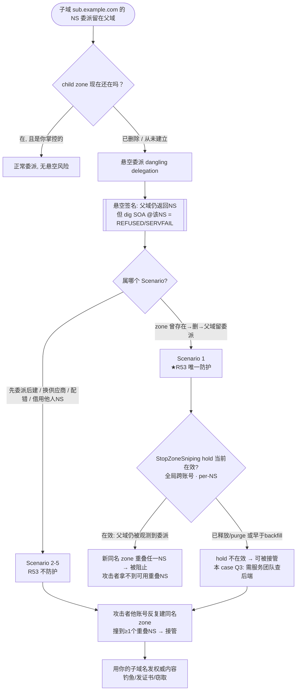
```mermaid
flowchart TD
    START([子域 sub.example.com 的 NS 委派留在父域]) --> Q1{child zone 现在还在吗？}
    Q1 -->|在, 且是你掌控的| SAFE[正常委派, 无悬空风险]
    Q1 -->|已删除 / 从未建立| DANGLE[悬空委派 dangling delegation]

    DANGLE --> SIG[[悬空签名: 父域仍返回NS<br/>但 dig SOA @该NS = REFUSED/SERVFAIL]]
    SIG --> SCN{属哪个 Scenario?}
    SCN -->|zone 曾存在→删→父域留委派| S1[Scenario 1<br/>★R53 唯一防护]
    SCN -->|先委派后建 / 换供应商 / 配错 / 借用他人NS| S25[Scenario 2-5<br/>R53 不防护]

    S1 --> HOLD{StopZoneSniping hold 当前在效?<br/>全局跨账号 · per-NS}
    HOLD -->|在效: 父域仍被观测到委派| BLOCK[新同名 zone 重叠任一NS → 被阻止<br/>攻击者拿不到可用重叠NS]
    HOLD -->|已释放/purge 或早于backfill| GAP[hold 不在效 → 可被接管<br/>本 case Q3: 需服务团队查后端]

    S25 --> TAKE[攻击者他账号反复建同名zone<br/>撞到≥1个重叠NS → 接管]
    GAP --> TAKE
    TAKE --> IMPACT[用你的子域名发权威内容<br/>钓鱼/发证书/窃取]
```

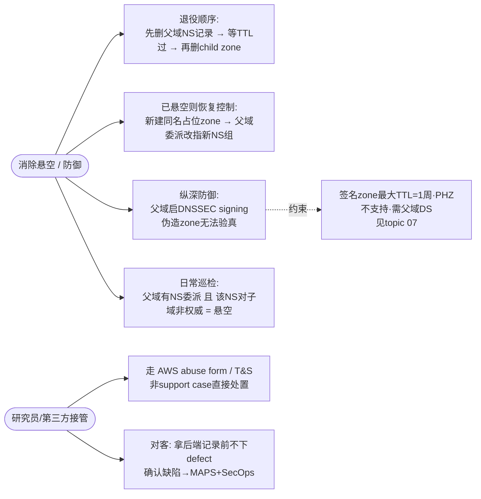
```mermaid
flowchart LR
    FIX([消除悬空 / 防御]) --> ORDER[退役顺序:<br/>先删父域NS记录 → 等TTL过 → 再删child zone]
    FIX --> RECLAIM[已悬空则恢复控制:<br/>新建同名占位zone → 父域委派改指新NS组]
    FIX --> DNSSEC[纵深防御:<br/>父域启DNSSEC signing<br/>伪造zone无法验真]
    FIX --> PATROL[日常巡检:<br/>父域有NS委派 且 该NS对子域非权威 = 悬空]
    DNSSEC -.约束.-> C[签名zone最大TTL=1周·PHZ不支持·需父域DS<br/>见topic 07]
    REPORT([研究员/第三方接管]) --> ABUSE[走 AWS abuse form / T&S<br/>非support case直接处置]
    REPORT --> DISC[对客: 拿后端记录前不下defect<br/>确认缺陷→MAPS+SecOps]
```

---

## 来源锚点

- **外部**：`protection-from-dangling-dns.html`（5 个 Scenario，只防护 Scenario 1）、`DeleteHostedZone.html`（先删 NS 记录等 TTL 再删 child zone）、`welcome-dns-service.html`（委派链 / NS 缓存典型 2 天）、`dns-configuring-dnssec.html`（DNSSEC 防护，topic 07）、AWS security blog "Threat tactic spotlight: subdomain takeover"（共享责任、CNAME 向量）、`aws.amazon.com/forms/report-abuse`（abuse 入口）；r53-external-research.md §1/§9/§15 速记 E28、F。
- **内部**：r53-internal-research.md §1（PHZ/委派）、§12（NXDOMAIN/Subdomain Delegation Failure/Lame delegation 签名、排查纪律）；StopZoneSniping 控制面项目、DaasPurgeDelegations Runbook、Tech Talk broadcast 352435（hold 生命周期 / 跨账号 / per-NS / backfill 边界，对客不引用内部链接）。
- **绑定 case**：178715620200407（Thales / `kycshowcase.d1.thalescloud.io`，NS 委派向量的 subdomain takeover；Scenario 5→1 翻案；StopZoneSniping 跨账号 + per-NS + hold 生命周期；Q1/Q2/Q3 与 escalation TT；DNSSEC 防护、删 zone 顺序、abuse 流程、MAPS/SecOps 对客纪律）。


================================================================================

# FILE: topics/09-domain-registration.md
<!-- SOURCE FILE: topics/09-domain-registration.md -->

# 09. 域名注册 / TLD 特性 / 生命周期（Domain Registration · Lifecycle · TLD Differences）

> 驱动表定位：Route 53 Domains（注册商侧）核心域，考察「注册商 vs Hosted Zone 边界」「续期/赎回生命周期」「TLD 差异」三条主线。绑定真实 case 178238086600080（★.jp WHOIS 到期日显示机制 / Gandi 注册商）、178636929200282（★关闭账号域名迁移 / Amazon Registrar / suspend-delete 生命周期）。SME 高频易错点：注册商到期日 vs 注册局(registry)到期日、transfer lock、EPP auth code、赎回期不保证、NS 委派 vs 注册局同步。

---

## 1. 概念（Concept）

### 1.1 Route 53 的两个角色：注册商 vs DNS 托管（考点地基）

Route 53 同名一物两职，SME 必须分清：

- **Route 53 Domains（域名注册商侧）**：`Registered domains` 面板，负责向**注册局（registry）**注册/续期/转移域名、管理联系人、transfer lock、auto-renew、WHOIS/RDAP 信息。**AWS 不是注册局**，它通过下游注册商代理。具体某个域名由哪家注册商承接，**以 `GetDomainDetail` 返回的注册商信息 / AWS 官方 TLD 支持表为准**，不要凭 TLD 类别泛化：
  - **Amazon Registrar**（内部代号 `AMAZON_KS` / `AMAZON_REGISTRAR`）：承接 AWS 官方列出的一部分 TLD。（case 178636929200282，registrant 为 Amazon Registrar）
  - **Gandi**（内部注册商 ID `GANDI (81)`）：承接 Amazon Registrar 不直接支持的 TLD（含相当一部分国家代码 TLD ccTLD，如 .jp）。（case 178238086600080，registrar = GANDI）
  - 注意："gTLD 一律 Amazon Registrar、ccTLD 一律 Gandi" 是**过度概括**——实际归属按官方 TLD 表 / `GetDomainDetail` 逐个确认。
- **Route 53 Hosted Zone（DNS 托管侧）**：只负责域名**如何解析**（见 topic 01）。删除 hosted zone **不会**注销域名注册；注销域名注册**不会**自动删 hosted zone。

> 核心边界：**注册（registration）与解析（resolution）是两套独立生命周期**。域名到期/被 suspend 影响的是注册局对 NS 委派的呈现（clientHold），hosted zone 里的记录仍在——但公网查不到，因为注册局停止委派。

### 1.2 域名生命周期与状态（Lifecycle）

标准 gTLD 生命周期（Amazon Registrar 侧，case 178636929200282 观察 + 文档）：

| 阶段 | 触发 | 行为 | 是否可恢复 |
|---|---|---|---|
| Active | 注册成功 | 正常解析、可管理 | — |
| 续期窗口 | 到期前一定天数 | auto-renew 默认开启，AWS 提前扣费续期 | — |
| Expired / Grace | 到期未续 | 部分 TLD 有宽限续期期 | 宽限期内正常续 |
| **Redemption（赎回期）** | 宽限期后 | 域名暂停，注册局保留；赎回**通常收费且不保证成功** | 需走 restore 流程，**not guaranteed** |
| Pending Delete | 赎回期后 | 进入删除队列，不可赎回 | 否 |
| Released | 删除完成 | 域名回到公开可注册池 | 需重新抢注 |

**账号关闭触发的独立生命周期**（case 178636929200282，Amazon Registrar 侧）：账号关闭 → 每日 `WILL_SUSPEND` 通知 5 天 → `SUSPEND_DOMAIN`（域名进入 **clientHold**，公网 DNS 中断） → suspend 约 **30 天后进入删除流程** → 关闭后 **90 天是 AWS 账号可重开（reopen）的期限**（此期限针对的是账号本身能否恢复，**不是"域名 90 天后被永久删除"的定时器**；域名的最终处置仍依 registrar/registry 的删除生命周期）。在账号可重开期内重开会触发 **AES 事件驱动的自动 unsuspend**（文档给出恢复窗口最长 24 小时，为指引性说明非合同 SLA）。

### 1.3 到期日：注册商到期日 vs 注册局到期日（★.jp 高频易错点）

出自 case 178238086600080 的核心机制——**两个到期日可以不一致，且都"正确"**：

- **Gandi / Route 53 到期日**：客户的**实际有效到期日**。续期窗口、auto-renew 都以它为准。
- **注册局(registry) WHOIS 到期日**：由注册局按自身规则呈现，可能滞后或按 TLD 特殊规则显示。
- **.jp（JPRS 注册局）特殊规则**（Gandi 官方确认）：
  1. JPRS WHOIS 显示的到期日**始终是"到期月的月末日"**（实际 6/29 → WHOIS 显示 6/30）。
  2. JPRS **只在旧到期月过去后**才把 WHOIS 更新到新年份（5 月续期成功，WHOIS 要等 7/1 左右才更新）。
  3. 对客户**无实际影响**——有效期以 Gandi/Route 53 记录为准。
  4. **.jp 续期窗口很窄：仅到期前 30 天到 6 天（D-30 ~ D-6）**；**.jp 不支持 late renewal**；**.jp 不支持 transfer lock**（状态码显示 "-" 属正常）。

### 1.4 Transfer Lock 与 EPP Auth Code（转移机制）

- **Transfer Lock（转移锁 / registrar lock）**：防止未授权转出。转出前必须**先解锁**。**部分 TLD 不支持 transfer lock**（如 .jp，case 178238086600080 中状态码 "-" 即因此）。
- **EPP Auth Code（转移授权码，又称 auth code / EPP code / transfer code）**：转出到别的注册商时，源注册商生成的一次性授权凭证，交给目标注册商完成转移。转入 Route 53 需向原注册商索取此码。
- **转移前提清单（按 TLD / 注册商规则确认，非一刀切）**：解除 transfer lock（**部分 TLD 不支持锁**，如 .jp）、取得 **EPP auth code**（**部分 TLD 不要求 auth code**）、域名满足最短持有期后方可转出（新注册/刚转入常见 **60 天**锁，但**具体天数与是否适用按 TLD/注册商规则确认**）、admin/registrant 邮箱可达（转移确认邮件）。**不要把"解锁+一次性 auth code+60 天"当成对所有 TLD 通用的绝对条件。**

### 1.5 联系人：Registrant / Admin / Tech（WHOIS 联系人）

- **Registrant（注册人）**：域名的**法律所有人**，权重最高，变更 registrant 常触发 60 天转移锁。
- **Admin（管理联系人）**：接收管理类通知、转移确认。
- **Tech（技术联系人）**：接收技术类通知。
- Route 53 允许三类联系人分别设置；转移/续期确认邮件的可达性是常见故障点（case 178636929200282 中 registrant 邮箱 `domain-renewals@...` 退信是关闭通知未被察觉的一环）。

### 1.6 WHOIS vs RDAP（目录服务）

- **WHOIS**：传统文本协议，不同注册局格式各异（.jp 走 `whois.jprs.jp`，返回日文字段）。
- **RDAP（Registration Data Access Protocol）**：WHOIS 的现代 JSON/HTTP 替代，结构化、支持权限分级。**自 2025-01-28 起，RDAP 已成为 gTLD 注册数据的权威来源**（ICANN 的 gTLD 合同要求已从 WHOIS 迁移到 RDAP）；WHOIS 对 gTLD 而言已不再是权威渠道。
- **隐私保护（Privacy Protection）**：Route 53 默认对支持的 TLD 开启隐私保护，WHOIS/RDAP 中隐藏个人联系人信息（部分 ccTLD 不支持隐私保护，信息公开可见）。

### 1.7 NS 委派与注册局同步（注册侧 ↔ 解析侧的接缝）

- 注册域名时 Route 53 自动创建同名 public hosted zone、分配 **4 个 NS**、并把这 4 个 NS **写回注册局（NS 委派）**。
- 改 hosted zone 的 NS 后，必须在 **`Registered domains` 侧同步更新 NS 委派**，否则注册局仍指向旧 NS——解析不生效。这是"改了 hosted zone 却不解析"的经典坑。
- 转入的域名/外部注册的域名，需手动把 Route 53 的 4 个 NS 填到注册商的委派配置里。

**边界数字速记**：新注册/转入后常见 **60 天**内不可再转出（具体按 TLD/注册商规则确认）；gTLD 赎回期恢复**收费且不保证**；.jp 续期窗 **D-30~D-6**、无 late renewal、无 transfer lock；账号关闭后域名 suspend **约 30 天**进入删除流程，**90 天是 AWS 账号可重开的期限**（非"域名 90 天必被删"）。

---

## 2. 真实案例说明（Real Case）

### ★ 核心案例 178238086600080 —— .jp 域名注册局到期日显示机制（Gandi 注册商）

- **客户**：Gate Information（gate.io），域名 `gateio.jp`，Enterprise。
- **症状 / 问题**：客户发现三处"矛盾"：① Route 53 控制台显示到期 **2027/6/29**；② WHOIS（whois.jprs.jp）显示到期 **2026/06/30**；③ 域状态码显示 **"-"**，疑似异常。想知道哪个到期日有效、是否需续期。
- **内部验证**：RISOps 显示 Expiration **6/29/27**、Auto Renewable **true**、Registrar **GANDI (81)**；`RENEW_DOMAIN` 操作 5/25/26 **SUCCESSFUL**（续期已成功）。
- **知识点落点**：
  1. **两个到期日都对**：Route 53/Gandi 的 2027/6/29 是有效到期日；JPRS WHOIS 的 2026/06/30 是注册局按"到期月月末"呈现的旧年份值。
  2. **JPRS 更新滞后是设计行为**，非 bug：5 月续期成功，JPRS 要等旧到期月（6 月）过完，约 **7/1 左右**自动更新为 2027/06/30。
  3. **状态码 "-" 正常**：.jp **不支持 transfer lock**，无锁状态即显示 "-"。
  4. **客户无需任何操作**，保持 auto-renew 开启即可。
  5. 同类先例 momentapharma.jp（V987680859）、pnxr.jp/pnvr.jp（P403473906）均由 Gandi 确认同一机制："it's at the end of the month the domain expires"、"they renew all domains at once on their end at the end of each month"。
- **SME 提炼**：注册商到期日 ≠ 注册局到期日；ccTLD 由 Gandi 代理且各有特殊规则；.jp 三特性（月末显示 / 滞后更新 / 无 transfer lock）成套记忆。

### ★ 核心案例 178636929200282 —— 关闭账号的域名迁移（Amazon Registrar / suspend-delete 生命周期）

- **场景**：客户在域名转移**完成前**关闭了源账号（003013821629），三个域名（omnipresent.com / omnipresentdev.com / omnipresent.group，registrar = **Amazon Registrar / AMAZON_KS**）被账号关闭流水线 suspend，进入 **clientHold**，公网 DNS 中断。
- **观察到的生命周期（DIRECTLY_OBSERVED 公网+内部双源）**：
  - 关闭后 8/5–8/9 每日 `WILL_SUSPEND` 通知 ×5；
  - 8/10 15:17 UTC `SUSPEND_DOMAIN` 成功 → 三域名 **clientHold** → 公网 NS/A/MX 查询为空；
  - suspend **+30 天**（≈9/9）进入删除流程，删除后"might be able to be restored"（**不保证**）；
  - **90 天**为账号关闭后可重开（reopen）的期限（针对账号恢复，非"域名 90 天被永久删除"的定时器）。
- **恢复路径**：重开源账号（Account & Billing case）→ **AES 事件驱动自动 unsuspend**（重开后域名自动解锁，文档恢复窗口最长 24 小时，非合同 SLA）→ 随后走标准跨账号转移四步。case 最终结果：账号 08-11 重开，域名 14:40 自动 unsuspend，16:02–16:07 完成转移到目标账号；剩余 hosted zone AES isolation 另线处理。
- **知识点落点**：
  1. **转移必须由源账号发起**——账号一关，自助转移路径被切断，只能重开或走服务团队（Route 53 CS Domains TT，先例 Primary Review 双人审核）。
  2. **suspend ≠ delete**：clientHold 后仍有约 30 天窗口；**删除后的赎回不保证**。
  3. **注册侧生命周期独立于 hosted zone**：域名 unsuspend 后，hosted zone 可能仍处 isolation（权威 NS REFUSED），DNS 恢复是另一条恢复链。
  4. **合规三分法**（跨账号信息边界）：客户自报的可复述；公网 WHOIS/DNS 可引用并注明来源；内部 RISOps 数据不进客户回复。
- **SME 提炼**：账号关闭是域名生命周期的**独立触发器**；转移的账号归属前提；suspend→delete 进程 + **90 天账号可重开期限**（非域名删除定时器）三段时限；registrar 为 Amazon Registrar（非 Gandi 释放路径）。

---

## 3. 实验步骤（Hands-on Lab）

> 主题：①查 WHOIS/RDAP 对比注册商与注册局到期日；②查看 transfer lock 状态；③改 NS 委派并观察注册局同步/传播。均为**只读或受控演示**，改 NS 请在测试域名上做。

### Lab A：WHOIS / RDAP 查询与到期日对比（复现 case 178238086600080 的判读）

```bash
# 1) gTLD WHOIS（如 .com）——观察 Registrar、Expiration、Domain Status
whois example.com | grep -iE "registrar:|expiry|expiration|status"
# 关注 Registrar（Amazon Registrar? Gandi?）与 Registry Expiry Date

# 2) ccTLD 走各注册局的 WHOIS 服务器（.jp 示例，复现 case）
whois -h whois.jprs.jp gateio.jp
# 预期字段：[有効期限]=到期月月末日；[状態]=Active；状態锁位可能为 "-"（.jp 无 transfer lock）

# 3) RDAP（结构化 JSON，ICANN gTLD 引导）
curl -s "https://rdap.org/domain/example.com" | python3 -m json.tool | grep -iE "eventAction|eventDate|status"
# events 里 registration / expiration / last changed；status 数组含 client transfer prohibited 等

# 4) Route 53 侧的注册商到期日（需域名在本账号 Registered domains）
aws route53domains get-domain-detail --region us-east-1 --domain-name example.com \
  --query "{Expiry:ExpirationDate, AutoRenew:AutoRenew, Locked:StatusList, Registrar:RegistrarName}"
```

**判读**：Route 53/`get-domain-detail` 的 `ExpirationDate` 是**有效到期日**；WHOIS 到期日可能滞后或按 TLD 规则（.jp 月末）呈现。两者不一致时，先确认 `RENEW_DOMAIN`/续期是否成功，再对照该 TLD 的注册局更新规则判断是否为正常滞后（呼应 case 178238086600080）。

### Lab B：查看 / 判断 Transfer Lock 状态

```bash
# StatusList 里含 clientTransferProhibited 即为已上锁；空或 "-" 视 TLD 而定
aws route53domains get-domain-detail --region us-east-1 --domain-name example.com \
  --query "StatusList"

# 对照 WHOIS 的 Domain Status 行
whois example.com | grep -i "Domain Status"
# clientTransferProhibited = 已锁；ok / active = 未锁
# .jp 等不支持 transfer lock 的 TLD：状态位可能显示 "-"（正常，非异常）
```

**判读**：转出前若 `StatusList` 含 `clientTransferProhibited`，须先 `disable-domain-transfer-lock` 解锁并取得 EPP auth code；若该 TLD 本就不支持 transfer lock（.jp），"-" 是正常状态，无需也无法解锁。

### Lab C：改 NS 委派并观察注册局同步 / 传播

```bash
# 1) 查看当前注册局侧的 NS 委派（Route 53 Domains 侧）
aws route53domains get-domain-detail --region us-east-1 --domain-name example.com \
  --query "Nameservers[].Name"

# 2) 更新注册局侧 NS 委派为新的 4 个 NS（改 hosted zone NS 后必做的同步）
aws route53domains update-domain-nameservers --region us-east-1 --domain-name example.com \
  --nameservers Name=ns-1.awsdns-00.org Name=ns-2.awsdns-00.co.uk \
                Name=ns-3.awsdns-00.com Name=ns-4.awsdns-00.net

# 3) 观察公网委派传播（父区 NS 记录）
dig example.com NS @8.8.8.8 +short          # 递归解析器视角
dig example.com NS @<TLD-authoritative> +trace | tail -20   # 从根到 TLD 看委派链
```

**判读**：`update-domain-nameservers` 改的是**注册局侧委派**，传播受父区（TLD）NS 记录 TTL 影响，通常数分钟到数十分钟可见。**只改 hosted zone 而不改注册局委派 → 解析仍走旧 NS**，这是"改了 NS 却不生效"的根因。**清理**：测试后把 NS 委派改回原值。

---

## 4. SME 考点 / 易错点（Exam Points & Pitfalls）

- **注册商到期日 vs 注册局到期日**：`get-domain-detail`/Route 53 的到期日是有效期；WHOIS 到期日可能滞后或按 TLD 规则显示。
  - 常见错误认知：以为 WHOIS 到期日是权威、两者不一致就是 bug。（case 178238086600080）
- **.jp 三特性成套记忆**：① WHOIS 到期日恒为到期月**月末**；② 旧到期月过完才更新新年份（约次月 1 日）；③ **不支持 transfer lock**（状态 "-" 正常）；④ 续期窗 **D-30~D-6**、**无 late renewal**。
- **注册 ≠ 解析（两套独立生命周期）**：删 hosted zone 不注销域名；注销域名不删 hosted zone；域名 suspend/clientHold 断的是注册局委派，hosted zone 记录仍在但公网查不到。
  - 常见错误认知：以为 hosted zone 存在就代表域名注册有效。
- **改 NS 必须两侧同步**：改 hosted zone NS 后，要在 `Registered domains` 更新注册局 NS 委派，否则解析走旧 NS。
- **transfer lock + EPP auth code + 最短持有期（按 TLD 确认）**：转出前一般须解锁、取 EPP auth code，但**部分 TLD 不支持锁 / 不要求 auth code**；新注册/刚转入常见 **60 天**锁、变更 registrant 常触发 60 天锁——具体天数与是否适用**按 TLD/注册商规则确认**，勿一刀切。
- **赎回期不保证**：进入 redemption 后 restore **收费且不保证成功**；进入 pending delete 后不可赎回。
  - 常见错误认知：以为过期域名随时能免费找回。
- **注册商归属按官方 TLD 表 / GetDomainDetail 确认**：Amazon Registrar（AMAZON_KS）与 Gandi (81) 各承接一部分 TLD，**不要凭"gTLD=Amazon / ccTLD=Gandi"泛化**；ccTLD 特殊规则要查该 TLD 的注册局机制（.jp→JPRS）。
- **账号关闭是域名生命周期独立触发器**：关闭 → 每日通知 5 天 → suspend(clientHold) → +30 天进入删除流程 → **90 天为账号可重开期限**（非域名删除定时器）；转移必须由源账号发起，账号关了只能重开或走服务团队 TT。（case 178636929200282）
- **重开自动 unsuspend，但 hosted zone 恢复是另一条链**：AES 事件驱动，文档恢复窗口最长 24h（指引非 SLA）；域名 unsuspend 后 hosted zone 可能仍 isolation（NS REFUSED）。
- **联系人可达性**：admin/registrant 邮箱退信会导致转移确认、关闭/续期通知漏收——排查转移/续期失败先查联系人邮箱可达性。
- **隐私保护与 RDAP**：Route 53 对支持的 TLD 默认开隐私保护；部分 ccTLD 不支持；**RDAP 自 2025-01-28 已是 gTLD 注册数据的权威来源**（WHOIS 对 gTLD 不再权威）。
- **跨账号信息合规三分法**：客户自报可复述、公网 WHOIS/DNS 可引用注明来源、内部 RISOps 数据不进客户回复。（case 178636929200282）

---

## 5. 该域 Mermaid 逻辑导图（Logic Diagram）

域名从注册到到期/关闭的生命周期决策链，及注册商侧与注册局/解析侧的接缝：

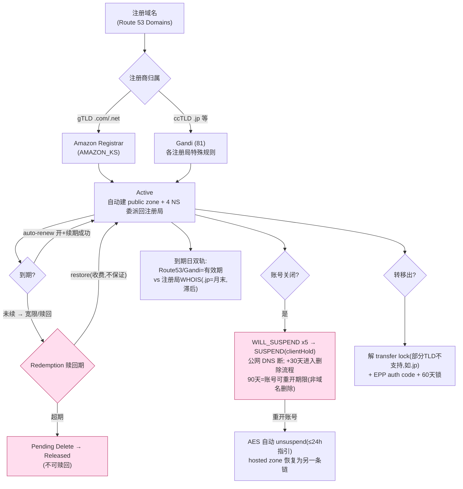
```mermaid
flowchart TD
    REG["注册域名<br/>(Route 53 Domains)"] --> RGR{"注册商归属"}
    RGR -- "gTLD .com/.net" --> AMZ["Amazon Registrar<br/>(AMAZON_KS)"]
    RGR -- "ccTLD .jp 等" --> GANDI["Gandi (81)<br/>各注册局特殊规则"]

    AMZ --> ACT["Active<br/>自动建 public zone + 4 NS 委派回注册局"]
    GANDI --> ACT

    ACT --> EXP{"到期?"}
    EXP -- "auto-renew 开+续期成功" --> ACT
    EXP -- "未续 → 宽限/赎回" --> RDM{"Redemption 赎回期"}
    RDM -- "restore(收费,不保证)" --> ACT
    RDM -- "超期" --> DEL["Pending Delete → Released<br/>(不可赎回)"]

    ACT --> CLOSE{"账号关闭?"}
    CLOSE -- "是" --> SUS["WILL_SUSPEND x5 → SUSPEND(clientHold)<br/>公网 DNS 断; +30天进入删除流程<br/>90天=账号可重开期限(非域名删除)"]
    SUS -- "重开账号" --> UNSUS["AES 自动 unsuspend(≤24h指引)<br/>hosted zone 恢复为另一条链"]

    ACT --> DUAL["到期日双轨:<br/>Route53/Gandi=有效期<br/>vs 注册局WHOIS(.jp=月末,滞后)"]
    ACT --> XFER{"转移出?"}
    XFER --> LOCK["解 transfer lock(部分TLD不支持,如.jp)<br/>+ EPP auth code + 60天锁"]

    classDef warn fill:#fde,stroke:#b36;
    class RDM,SUS,DEL warn;
```

> 图注：左侧 `注册商归属`（Amazon Registrar vs Gandi）决定 TLD 特殊规则查证方向；`账号关闭`是与正常到期并行的独立 suspend→delete 触发器（case 178636929200282）；`到期日双轨`是 .jp 类 WHOIS 到期日矛盾的判读依据（case 178238086600080）；转移三前提（解锁 / EPP code / 60 天锁）为高频易错点。


================================================================================

# FILE: topics/10-profiles.md
<!-- SOURCE FILE: topics/10-profiles.md -->

# 10. Route 53 Profiles（跨账号 / 跨 VPC 集中式 DNS 治理）

> 驱动表定位：治理规模化梯队。核心价值 = 把一组 DNS 配置**打包分发**到多个 VPC，解决「逐 VPC 手工配置」在几十上百个 VPC 时的运维爆炸。无绑定真实 case（用典型多-VPC 企业治理场景推演）。SME 高频考点：Profile 是**打包分发**非取代 PHZ、**每 VPC 只能 1 个 Profile**、**最具体匹配优先（仅同名冲突时 local 优先）**、**跨账号靠 RAM 共享**、**Profile/资源/VPC 必须同 Region**。

---

## 1. 概念（Concept）

### 1.1 Route 53 Profile 是什么

- **Profile = 一组 DNS 配置的可复用「打包容器」**。把以下资源装进一个 Profile，然后把这个 Profile **一次性关联到多个 VPC**：
  1. **Private Hosted Zones（PHZ）**
  2. **Resolver rules**（转发规则 / 系统规则）
  3. **DNS Firewall rule groups**（含优先级与 fail-open/fail-closed 等行为设置）
  4. **Resolver query logging 配置**
  5. **Interface VPC endpoints**（可作为 Profile 资源随之下发）
  6. **VPC 级 DNS 设置**：如 DNSSEC validation、反向 DNS（reverse DNS）、DNS Firewall failure mode 等设置项也可通过 Profile 统一下发。
- 目的：把「本该逐 VPC 重复配置」的 DNS 治理策略，变成**建一次 Profile → 关联到 N 个 VPC**，实现**集中式、规模化**的 DNS 治理。（对应 case 178782060900806 引出的 >300 VPC-PHZ 关联的治理选项）

### 1.2 核心心智模型：打包分发，不是取代

- **关键考点①**：Profile 是**分发机制**，不是新的 DNS 资源类型。PHZ 还是 PHZ、Resolver rule 还是 Resolver rule —— Profile 只是把它们**成组、批量、集中**地关联到多个 VPC。
- 因此："用了 Profile 就不用 PHZ 了" 是**错误**认知。你仍然先创建 PHZ / Resolver rule / Firewall rule group，再把它们**放进** Profile 分发。

### 1.3 每 VPC 只能关联一个 Profile

- **关键考点②**：**1 个 VPC 同时只能关联 1 个 Profile**。想给一个 VPC 下发多组策略，必须把这些策略**合并进同一个 Profile**，不能叠加多个 Profile。
- 反过来：**1 个 Profile 可以关联到很多 VPC**（这正是它规模化的意义）；跨账号时这些 VPC 可以分属不同账号（见 §1.5）。

### 1.4 优先级：最具体匹配优先；仅同名冲突时 local 优先

- **关键考点③（对应 topic 01 的 E27）**：VPC 本地（local）配置与 Profile 下发的配置共存时，解析**首先遵循 DNS 的最具体匹配（most-specific-match）原则**——命名空间更具体（更长/更精确匹配查询名）的那条胜出，无论它来自 local 还是 Profile。
  - **只有当 local 与 Profile 存在"相同域名/相同命名空间"的冲突时，才由 local 优先**（就近覆盖）。
- 心智模型：**先看谁更具体；只有同名平手时才 local > Profile**。不要笼统记成"local 永远压过 Profile"——若 Profile 下发的是更具体的域名，仍是 Profile 命中。

### 1.5 跨账号：靠 RAM（Resource Access Manager）共享

- **关键考点④**：Profile 本身是一个可被 **AWS RAM 共享**的资源。跨账号治理的路径是：
  1. 中心账号创建 Profile 并装入配置；
  2. 通过 **RAM** 把该 Profile **共享**给成员账号（或整个 Organization / OU）；
  3. 成员账号接受共享后，把 Profile **关联到自己账号内的 VPC**。
- 由此实现**集中定义、跨账号统一下发**。这也**免去了逐个 PHZ 做 `VpcAssociationAuthorization` 跨账号授权**的繁琐（呼应 topic 01：跨账号关联 PHZ 需授权，或改用 Profiles 免此步）。
- **RAM 权限不局限于只读**：RAM 共享 Profile 时可选用允许成员账号"关联/管理"的权限集，不一定只授予只读——按治理需要选择权限即可（不要默认"RAM 共享的 Profile 只能被成员账号只读查看"）。

### 1.5b 同 Region 边界（硬约束）

- **Profile、被打包的资源、以及被关联的 VPC 必须处于同一 Region**：Profile 是区域性资源，不能跨 Region 关联 VPC 或跨 Region 打包资源。跨 Region 治理需在每个 Region 各自建立 Profile。
- **Organizations 共享可自动接受**：通过 Organizations 范围共享时，成员账号的接受可自动化；但 RAM 授予的权限集按所选 permission 决定，不必只读。

### 1.6 与「逐 VPC 配置」的对比（治理规模化）

| 维度 | 逐 VPC 手工配置 | Route 53 Profiles |
|---|---|---|
| 配置动作 | 每个 VPC 逐条关联 PHZ / Resolver rule / Firewall group | 建一次 Profile，批量关联多个 VPC |
| 跨账号 | 每个 PHZ 逐个 `VpcAssociationAuthorization` | 一次 RAM 共享，成员账号自助关联 |
| 一致性 | 靠人工/脚本保证，易漂移 | 集中定义，天然一致 |
| 变更传播 | 改动需遍历所有 VPC | 改 Profile，自动作用于所有关联 VPC |
| 规模上限痛点 | 每 PHZ 300 VPC、几十上百 VPC 运维爆炸 | 为规模化治理而生 |
| 覆盖内容 | 单类资源逐个处理 | PHZ + Resolver rules + DNS Firewall + query logging + Interface VPC endpoints 及 VPC 级设置一起打包 |

---

## 2. 案例说明（典型多-VPC 企业治理场景）

> 无真实 case；用典型企业多账号/多 VPC 集中式 DNS 治理场景推演。

### 场景 —— 「一次定义、全组织下发」的企业内网 DNS 治理

- **背景**：某企业用 AWS Organizations 管理 40+ 账号、上百个 VPC。安全与网络团队在**中心网络账号**统一管理：
  - 一个内网 PHZ `corp.internal`（所有工作负载访问内部服务）；
  - 一条 Resolver forward rule：把 `onprem.example.com` 转发到本地数据中心 DNS（走 Direct Connect / VPN）；
  - 一个 DNS Firewall rule group：拦截已知恶意域名；
  - Resolver query logging：把所有 VPC 的 DNS 查询集中投递到中心日志。
- **痛点（逐 VPC 配置时）**：每上线一个新 VPC / 新账号，网络团队都要重复：关联 PHZ（跨账号还要授权）、关联 Resolver rule、关联 Firewall group、配置 query logging —— 上百个 VPC 时极易漏配、不一致、审计困难。
- **用 Profile 后的解法**：
  1. 中心账号把上述配置（含可选的 Interface VPC endpoints 与 VPC 级 DNS 设置）**装进一个 Profile** `corp-dns-baseline`；
  2. 通过 **RAM** 把该 Profile 共享给整个 Organization；
  3. 各成员账号把 Profile **关联到本账号的每个 VPC**（一步到位，打包的配置全部生效；须与 Profile 同 Region）；
  4. **例外覆盖**：某个测试 VPC 需要一个只对它可见的临时 PHZ `sandbox.corp.internal`（与 Profile 基线**同名冲突**），直接在该 VPC **本地关联**这个 PHZ —— 因**同名冲突时 local 优先于 Profile**，测试 VPC 就近命中本地 PHZ，其余 VPC 仍走 Profile 下发的基线。
- **知识点落点**：
  1. Profile 把**多类 DNS 配置一起打包**（PHZ / Resolver rules / DNS Firewall / query logging / Interface VPC endpoints 及相关 VPC 级设置），而非只搬 PHZ（考点①的正例）；
  2. 每个 VPC 关联的是**这一个** `corp-dns-baseline` Profile，不能再叠加第二个 Profile（考点②）；
  3. 测试 VPC 的本地同名 PHZ 覆盖 Profile 基线，体现**同名冲突时 local 优先**（考点③；无同名冲突时按最具体匹配）；
  4. 跨 40+ 账号的下发靠**一次 RAM 共享**，免去逐 PHZ 授权（考点④）；前提是各资源与 VPC 同 Region。

---

## 3. 实验步骤（Hands-on Lab）

> 演示：建 Profile → 装入 PHZ + Resolver rule → 关联多个 VPC → RAM 跨账号共享 → 验证解析。所有步骤为受控/非破坏性演示，在测试资源上做。命令以 `aws route53profiles` 与 `aws ram` 为主。

### Lab：从零搭建并分发一个 DNS 治理 Profile

前置：已有一个测试 PHZ（`corp.internal`，zone id `<PHZ_ID>`）与一条 Resolver rule（`<RESOLVER_RULE_ID>`）；两个测试 VPC `<VPC_A>`、`<VPC_B>`（可跨账号）。

```bash
# 1) 创建 Profile
aws route53profiles create-profile --name corp-dns-baseline
#   记下返回的 Profile Id：<PROFILE_ID>

# 2) 把 PHZ 装进 Profile（ResourceArn 为该 PHZ 的 ARN）
aws route53profiles associate-resource-to-profile \
  --profile-id <PROFILE_ID> \
  --name attach-corp-internal \
  --resource-arn arn:aws:route53:::hostedzone/<PHZ_ID>

# 3) 把 Resolver rule 装进 Profile
aws route53profiles associate-resource-to-profile \
  --profile-id <PROFILE_ID> \
  --name attach-onprem-forward \
  --resource-arn arn:aws:route53resolver:<region>:<acct>:resolver-rule/<RESOLVER_RULE_ID>
#   （DNS Firewall rule group、query logging 配置同理，各用一次 associate-resource-to-profile）

# 4) 把 Profile 关联到本账号的多个 VPC
aws route53profiles associate-profile \
  --profile-id <PROFILE_ID> --name assoc-vpc-a --resource-id <VPC_A>
aws route53profiles associate-profile \
  --profile-id <PROFILE_ID> --name assoc-vpc-b --resource-id <VPC_B>
#   注意：若某 VPC 已关联了另一个 Profile，此步会失败（每 VPC 只能 1 个 Profile）

# 5) 跨账号：用 RAM 把 Profile 共享给成员账号（或 Organization）
aws ram create-resource-share \
  --name corp-dns-baseline-share \
  --resource-arns arn:aws:route53profiles:<region>:<acct>:profile/<PROFILE_ID> \
  --principals <MEMBER_ACCOUNT_ID>
#   成员账号接受共享后，在自己账号内执行第 4 步把 Profile 关联到本账号 VPC

# 6) 验证解析（在关联了 Profile 的 VPC 内的 EC2 上）
dig @169.254.169.253 service.corp.internal +short   # 命中 Profile 下发的 PHZ → 返回私有 IP
dig @169.254.169.253 host.onprem.example.com +short  # 命中 Profile 下发的 forward rule → 转发本地 DNS 应答
```

**预期与判读**：
- 第 4 步对已有 Profile 的 VPC 会报错 —— 直接印证**每 VPC 只能 1 个 Profile**。
- 第 6 步在**任何**关联了该 Profile 的 VPC 上都得到一致结果 —— 证明"建一次、多 VPC 生效"的分发效果。
- **同名冲突 local 优先验证**：在其中一个 VPC 上**本地**再关联一个**同名**但不同记录的 PHZ，重复第 6 步该记录，会看到返回的是**本地 PHZ** 的值而非 Profile 的值 —— 印证**同名冲突时 local 优先**（非同名时仍按最具体匹配）。

**清理**：先 `disassociate-profile`（解绑各 VPC）→ `disassociate-resource-from-profile`（卸下 PHZ/rule）→ 删除 RAM share → `delete-profile`。测试 PHZ / Resolver rule 按各自 topic 的清理方式删除。

---

## 4. SME 考点 / 易错点（Exam Points & Pitfalls）

- **①Profile 是打包分发，不是取代 PHZ**：Profile 只是把 PHZ / Resolver rule / DNS Firewall group / query logging **成组批量关联**到多 VPC。PHZ 等资源仍需先单独创建。
  - 常见错误认知：以为"改用 Profile 后就不需要 PHZ 了"。
- **②每 VPC 只能关联一个 Profile**：一个 VPC 同时最多绑 1 个 Profile；要下发多组策略必须**合并进同一个 Profile**，不能叠加。反向 1 个 Profile 可关联到很多 VPC。
  - 常见错误认知：以为可以给一个 VPC 叠加多个 Profile 分层下发。
- **③最具体匹配优先；仅同名冲突时 local 优先（E27）**：local 与 Profile 共存时，先按 DNS **最具体匹配**决定命中方（更具体者胜，无论来源）；**只有当两者是相同域名/命名空间冲突时，才由 local 优先**（就近覆盖）。
  - 常见错误认知：笼统记成"local 永远压过 Profile"——若 Profile 下发的域名更具体，仍是 Profile 命中。
- **④跨账号靠 RAM 共享**：Profile 通过 **AWS RAM** 共享给成员账号 / Organization，成员账号接受后关联到自身 VPC。这**免去逐 PHZ 的 `VpcAssociationAuthorization`** 跨账号授权。
  - 常见错误认知：以为跨账号用 Profile 仍要对每个 PHZ 单独授权。
- **RAM 权限不必只读**：RAM 共享 Profile 时按所选 permission 集授予权限，可允许成员账号关联/管理，不一定只读。
  - 常见错误认知：以为 RAM 共享的 Profile 成员账号只能只读查看。
- **同 Region 边界（硬约束）**：Profile、被打包的资源、被关联的 VPC 必须处于**同一 Region**；跨 Region 治理需每个 Region 各建 Profile。Organizations 范围共享可自动接受。
  - 常见错误认知：以为一个 Profile 能跨 Region 关联 VPC 或打包异地资源。
- **打包的资源类型要记全**：PHZ、Resolver rules、DNS Firewall rule groups、Resolver query logging 配置、**Interface VPC endpoints**，以及 **DNSSEC validation / 反向 DNS / DNS Firewall failure mode 等 VPC 级设置** —— 都能进 Profile，不要只记"四类"。
- **治理规模化定位**：当 PHZ-VPC 关联逼近 **每 PHZ 300 VPC** 上限、或几十上百 VPC 逐个配置不可维护时，Profiles 是标准治理方案（呼应 case 178782060900806）。
- **变更传播**：改 Profile 内的配置会作用于**所有**关联该 Profile 的 VPC —— 集中一致是优点，但也意味着一次误改的**爆炸半径覆盖全部关联 VPC**，变更需谨慎评审。

---

## 5. 该域 Mermaid 逻辑导图（Logic Diagram）

Profile 从中心账号定义、经 RAM 跨账号分发、到 VPC 内解析时与 local 配置的优先级决策链：

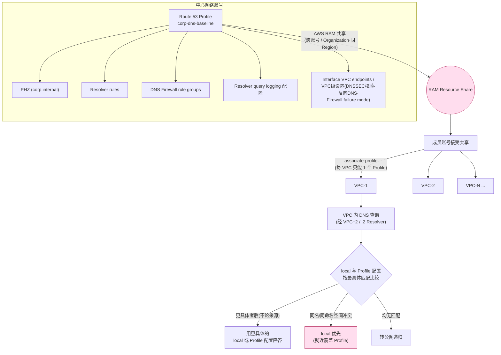
```mermaid
flowchart TD
    subgraph HUB["中心网络账号"]
      P["Route 53 Profile<br/>corp-dns-baseline"]
      P --> R1["PHZ (corp.internal)"]
      P --> R2["Resolver rules"]
      P --> R3["DNS Firewall rule groups"]
      P --> R4["Resolver query logging 配置"]
      P --> R5["Interface VPC endpoints /<br/>VPC级设置(DNSSEC校验·反向DNS·<br/>Firewall failure mode)"]
    end

    P -->|"AWS RAM 共享<br/>(跨账号 / Organization·同Region)"| SHARE(("RAM Resource Share"))
    SHARE --> MA["成员账号接受共享"]
    MA -->|"associate-profile<br/>(每 VPC 只能 1 个 Profile)"| V1["VPC-1"]
    MA --> V2["VPC-2"]
    MA --> V3["VPC-N ..."]

    V1 --> Q["VPC 内 DNS 查询<br/>(经 VPC+2 / .2 Resolver)"]
    Q --> MATCH{"local 与 Profile 配置<br/>按最具体匹配比较"}
    MATCH -- "更具体者胜(不论来源)" --> WINSPEC["用更具体的<br/>local 或 Profile 配置应答"]
    MATCH -- "同名/同命名空间冲突" --> USELOCAL["local 优先<br/>(就近覆盖 Profile)"]
    MATCH -- "均无匹配" --> PUB["转公网递归"]

    classDef warn fill:#fde,stroke:#b36;
    class USELOCAL,SHARE warn;
```

> 图注：两个核心决策点 —— **RAM 共享**是跨账号分发的唯一途径（免逐 PHZ 授权，且资源/VPC 须同 Region）；VPC 内解析时**先按最具体匹配决定命中方，仅同名冲突时 local 优先**，均无匹配才转公网。每个 VPC 只挂一个 Profile，一个 Profile 可覆盖 N 个（跨账号）VPC。


================================================================================

# FILE: topics/11-arc.md
<!-- SOURCE FILE: topics/11-arc.md -->

# 11. Application Recovery Controller (ARC)：Routing Control / Readiness Check / Zonal Shift / Zonal Autoshift

> 驱动表定位：Wave3 高可用 / DR 进阶主题，考"确定性人工切流"与普通 health check 探测切流的本质区别，以及 ARC 四大能力（跨 Region 的 routing control / readiness check，单 Region 多 AZ 的 zonal shift / zonal autoshift）的职责边界与选型。无绑定真实 case，用多 Region 主备切换（DR failover）与单 Region 多 AZ 受损隔离场景说明。SME 高频易错点：①routing control 是开关不是探测；②灾难时用 cluster data plane endpoint 而非 control plane；③5-Region cluster 高可用（3/5 quorum）；④safety rule 防全关；⑤与普通 health check failover 的区别；⑥zonal shift 是单 AZ、手动、最长 72h；⑦zonal autoshift 是 AWS 代管自动、必须配 practice run；⑧readiness check 只是"配置就绪度审计"，不是健康探测、不可作灾难切流的主触发、且已停止对新客户开放。

> **ARC 能力全景（先建立框架，细节见后文各节）**：ARC 是一把"恢复控制"伞，下面挂着四类相互独立的能力，按"作用范围（跨 Region vs 单 Region 多 AZ）×动作性质（人工/编程 vs AWS 代管 vs 只审计不动作）"划分：
>
> | 能力 | 作用范围 | 谁来动作 | 本质 | 典型用途 |
> |---|---|---|---|---|
> | **Routing Control** | 跨 Region / 跨 AZ | 人工 / 编程（确定性开关） | 拨开关→改 RECOVERY_CONTROL health check→切 R53 failover 记录 | 大规模 DR 演练、灾难确定性人工切 Region |
> | **Readiness Check** | 多 Region / 多 AZ 副本间 | 只审计、不切流 | 每分钟持续校验各副本配置/容量是否对齐 | 确认 standby 副本随时具备接管能力（**注：已停止对新客户开放**）|
> | **Zonal Shift** | 单 Region 内一个 AZ | 人工 / 编程（单动作） | 把某 AZ 标记为不健康，流量移走 | AZ 级受损/坏部署时手动隔离一个 AZ |
> | **Zonal Autoshift** | 单 Region 内一个 AZ | **AWS 代管自动** | AWS 依内部遥测检测 AZ 受损，自动移走流量 | 无人值守下自动规避 AZ 级故障（必须配 practice run）|
>
> 记忆口诀：**routing control / readiness check 面向"跨 Region DR"；zonal shift / zonal autoshift 面向"单 Region 内某个 AZ 受损"。** readiness check 只"看"不"动"；routing control 与 zonal shift 是"人拨"；zonal autoshift 是"AWS 替你拨"。

---

## 1. 概念（Concept）

### 1.1 什么是 ARC Routing Control

- **Routing Control** 是一个 **开关式（on/off）** 的控制开关，由运维人员 **手动** 或 **编程**（API/CLI）切换，用来 **确定性地** 触发或撤销跨 Region / 跨可用区的 **failover**。
- 切换一个 routing control 的状态（`On`/`Off`），背后会 **改变一个 Route 53 health check 的状态**，从而让绑定该 health check 的 **Route 53 failover 记录** 把流量切到/切走某个端点。
- **本质**：ARC 把"要不要把流量放到这个 Region"这件事，从"由探测结果自动决定"变成"由人/程序确定性地拨动开关决定"。

### 1.2 与普通 Route 53 Health Check 的根本区别（核心考点）

| 维度 | 普通 R53 Health Check | ARC Routing Control |
|---|---|---|
| 触发切流的依据 | **主动探测**端点（HTTP/HTTPS/TCP、CloudWatch 告警、计算型），探测失败自动切 | **人工 / 编程拨开关**，确定性，不依赖探测结果 |
| 决定权 | 系统自动（探测健康度） | 运维人员 / 应用程序显式控制 |
| 典型误判风险 | 探测抖动 / 误报导致误切、灰色故障探不到 | 无探测抖动；风险在误操作（人为切错） |
| 适用场景 | 端点自身健康的自动摘除 | **大规模 DR 演练 / 灾难时的确定性人工切换** |

- 关键记忆点：**ARC routing control 是「开关」，不是「探针」**。它不去 ping 你的应用；它是你（或你的自动化）来决定 Region 上下线，规避了灰色故障下探测不准、或探测本身也故障时无法可靠切流的问题。

### 1.3 Routing Control 如何绑定到 R53 Failover 记录

- routing control 与 health check **不是自动一一对应**——你必须**显式创建**一个 `Type=RECOVERY_CONTROL` 的 Route 53 health check，并在创建时用 `RoutingControlArn` 把它**关联**到某个 routing control（这种 health check 的状态由该 routing control 直接驱动，而非探测得出）。
- 再把这个 health check **关联到一条 Route 53 failover 类型的记录**（Primary / Secondary）。
- 拨动 routing control → 其驱动的 RECOVERY_CONTROL health check 状态变化 → failover 记录按 Primary/Secondary 逻辑切换应答 → DNS 层完成切流（实际客户端看到切换还受 **DNS TTL/缓存**影响，不是瞬时）。

### 1.4 Cluster：5-Region 高可用 Data Plane（核心考点）

- **Cluster** 是承载 routing control 状态的高可用基础设施，由 **5 个 AWS Region** 组成，跨 Region 分布以获得极高可用性。
- **3/5 quorum 是 ARC 后端的复制一致性**：cluster 在后端跨 5 个 Region 复制 routing control 状态，读/写需 **5 个中至少 3 个达成一致**——即使有 2 个 Region 不可用，状态仍可靠。
- **客户端只需调用「一个」data plane endpoint**：5 个 endpoint 是等价的接入点，客户端脚本任选一个即可切换状态（灾难时可轮询换用另一个），quorum 由 ARC 后端自动完成，**不需要客户端自己去访问 3 个端点凑 quorum**。
- 这正是 ARC 在灾难场景下值得信赖的原因：**你要用来救灾的切换机制，本身不能和被救的系统一起挂掉**。

### 1.5 Control Plane 与 Data Plane 分离（核心考点）

- **Control Plane（控制平面）**：用于 **创建 / 配置** cluster、routing control、safety rule 等。**ARC 的控制平面位于 `us-west-2`**（配置类 API 在此 Region）。控制平面像多数 AWS 服务一样，可用性正常但不保证在大区域性灾难中始终可达。
- **Cluster Endpoint Data Plane（数据平面，5 个 Region 各一个 endpoint）**：用于 **读取和切换 routing control 状态**。这是高可用、专为灾难时刻设计的路径。
- **考点铁律**：**灾难发生时，用 cluster 的 data plane endpoint（5 个 Region endpoint）去切 routing control，绝不要依赖 control plane。** 平时配置用 control plane，救灾切流用 data plane —— 切换脚本应轮询 5 个 data plane endpoint 直到有一个成功。

### 1.6 Safety Rules：防误操作（核心考点）

Safety rule 是加在 routing control 之上的护栏，防止一次误操作把所有 Region 同时关掉、导致"两边都没流量"的自陷式全局中断。两类：

- **Assertion Rule（断言规则）**：约束一组 routing control 必须满足某条件才允许改变。例如"这 3 个 Region 的 routing control 至少有 1 个必须为 On" —— 当你试图把最后一个也关掉时，切换被拒绝。
- **Gating Rule（门控规则）**：用一个"门"control 来 **允许/禁止** 对另一组 control 的更改。例如只有先打开"允许 DR 切换"这个门，才准许切换生产 Region 的 routing control，防止误触。

> 记忆点：safety rule 的核心目的是 **防止"全关"**（防止同时把所有区切下线）以及防止未授权/误触的切换。
>
> **但 safety rule 不是绝对不可逾越**：紧急情况下，`update-routing-control-states` 可带 **`SafetyRulesToOverride`** 参数（传入要绕过的 safety rule ARN）来**显式覆盖**该护栏、强制执行本会被拒绝的切换。护栏是"防误触"，不是"锁死"——真需要全关时运维仍可有意覆盖。

---

## 1B. Readiness Check（就绪度校验）—— 只审计，不切流（核心考点）

### 1B.1 是什么

- **Readiness Check** 让 ARC **持续（每分钟一次）审计**你的多 Region / 多 AZ 应用副本，校验各副本的 **配置与运行时状态是否对齐**——例如各 Region 的 **EC2 实例数、Aurora 读写容量单元、EBS 卷大小、Auto Scaling 组的 min/max、网络路由策略** 等是否匹配，确保 standby 副本随时具备接管 failover 流量的能力。
- 建模结构：**Recovery Group（代表整个应用）→ Cell（每个失败隔离单元/副本，如每个 Region 或 AZ 的版本）→ Resource Set（按资源类型分组）→ Readiness Check（关联到 resource set）**。ARC 由此逐副本给出就绪状态（`Ready` / `Not ready`），可经 EventBridge 通知状态变化。
- 还有一类 **DNS target resource readiness check**：持续扫描应用架构与 Route 53 路由策略，审计 **跨 AZ / 跨 Region 的依赖**是否被正确"隔离（siloed）"，并给出架构改进建议。

### 1B.2 与 Routing Control 的根本区别（易错点）

| 维度 | Readiness Check | Routing Control |
|---|---|---|
| 动作性质 | **只审计、不切流**（观测/告警） | **切流开关**（确定性拨动触发 failover）|
| 回答的问题 | "我的 standby 副本**准备好接管**了吗？"（配置/容量是否对齐）| "现在**把流量切**到哪个副本？" |
| 频率/触发 | 后台每分钟持续跑，被动出状态 | 由人/程序主动拨动 |
| 高可用性 | **不是高可用**，灾难时可能不可达 | cluster data plane 高可用（5-Region 3/5 quorum）|

### 1B.3 铁律与限制（考点）

- **不要把 readiness check 当作灾难切流的主触发**：它 **不是** 用来判断生产副本是否健康的探针，**不可依赖它作为灾难时 failover 的主要触发器**。灾难切流的健康判断应来自你自己的监控/health check 体系，readiness check 只是**补充**（确认"备用副本配置是否对齐"）。
- **readiness check 本身不是高可用**：灾难中它可能不可达，被校验的资源也可能不可用——所以更不能在救灾链路上依赖它。
- **可用性变更（必答点）**：ARC 的 readiness check 特性 **已不再对新客户开放**；现有客户可继续正常使用。SME 遇到"想新用 readiness check"的诉求，应告知此变更，并引导用其自有监控 + routing control 组合来实现确定性切流。
- 记忆点：**readiness check = "副本配置对齐度的持续体检"，是"准备度"不是"健康度"，只看不动、非高可用、不作切流主触发、且已停止新开放。**

来源：
- [What is readiness check in ARC?（recovery-readiness / readiness-what-is）](https://docs.aws.amazon.com/r53recovery/latest/dg/readiness-what-is.html)
- [Readiness check in ARC（含"不再对新客户开放"说明）](https://docs.aws.amazon.com/r53recovery/latest/dg/recovery-readiness.html)
- [DNS target resource readiness checks（架构/隔离审计）](https://docs.aws.amazon.com/r53recovery/latest/dg/recovery-readiness.readiness-checks.architectural.html)

---

## 1C. Zonal Shift（可用区移流）—— 单 Region 内手动隔离一个 AZ（核心考点）

### 1C.1 是什么

- **Zonal Shift** 让你用 **单个动作**，把某个 **受损可用区（AZ）** 的流量 **临时移走**，让应用继续用同一 Region 内的其它健康 AZ 运行。用于 AZ 级问题：如坏部署导致某 AZ 延迟飙升、或 AWS 单 AZ 基础设施故障。
- 支持的资源：**Application Load Balancer (ALB)、Network Load Balancer (NLB)、EC2 Auto Scaling groups、Amazon EKS**。（资源由 AWS 自动注册到 ARC；部分资源需先"启用 zonal shift"。）
- 机制：启动 zonal shift 后，ARC 让集成的资源把 **指定 AZ 标记为不健康**，从而把流量移出该 AZ。**移流不是瞬时**——已建立的在途连接需要几分钟自然完成（DNS/连接复用等因素），新连接会绕开该 AZ。

### 1C.2 关键约束（易错点）

- **一次只能移一个 AZ**：对一个负载均衡器，一次 zonal shift 只针对 **单个 AZ**，不能一次移多个 AZ。
- **必须设过期时间，最长 72h，可延长/可取消**：启动时必须设置过期（**初始最长 3 天 / 72 小时**）；之后可随时 **update** 设一个新的过期时间（**即可延长**），也可在到期前 **cancel** 提前恢复。到期或取消后，ARC 反向操作、恢复的 AZ 重新接收流量。
- **fail-open 例外**：若目标 AZ 的 target group 本就没有实例、或实例全不健康（负载均衡器处于 fail-open），启动 zonal shift **不会** 真的移走流量。
- **容量提示**：移走一个 AZ 前应确认其余 AZ 有足够容量接住流量；NLB 关闭跨区负载均衡时，移走某 AZ 的 IP 也会同时损失该 AZ 的目标容量。

### 1C.3 与 Region 级 failover 的区别

- Zonal shift 处理的是 **同一 Region 内的一个 AZ**，不涉及跨 Region 切换、不改 Route 53 failover 记录、不需要 cluster/routing control。它是"把一个坏 AZ 从负载均衡里摘出去"的轻量、快速、可自愈的操作。
- 记忆点：**zonal shift = 单 Region、单 AZ、手动/编程、单动作、临时（≤72h 可延可取消）、面向 ALB/NLB/ASG/EKS 的"把坏 AZ 移出去"。**

来源：
- [How a zonal shift works（含 72h、可 update 延长、可 cancel、fail-open）](https://docs.aws.amazon.com/r53recovery/latest/dg/arc-zonal-shift.how-it-works.html)
- [start-zonal-shift CLI（支持资源：ALB/NLB/ASG/EKS；"temporarily move"）](https://docs.aws.amazon.com/cli/latest/reference/arc-zonal-shift/start-zonal-shift.html)
- [Zonal shift for your Network Load Balancer（在途连接不被终止、需几分钟）](https://docs.aws.amazon.com/elasticloadbalancing/latest/network/zonal-shift.html)

---

## 1D. Zonal Autoshift（可用区自动移流）—— AWS 代管自动，需 practice run（核心考点）

### 1D.1 是什么

- **Zonal Autoshift** 是 zonal shift 的 **自动、AWS 代管** 版本：你 **授权 AWS**，当其 **内部遥测（internal telemetry）** 检测到某 AZ 受损、可能影响客户时，**AWS 代替你自动** 把该 AZ 的流量移走，**无需人工介入**，以缩短恢复时间（time to recovery）。启用后状态为 `ENABLED` 即表示已授权。
- 支持资源与 zonal shift 相同：ALB / NLB / EC2 Auto Scaling groups / EKS。

### 1D.2 必须配 Practice Run（易错必答点）

- **启用 zonal autoshift 必须配置 practice run**：这是 **强制的每周演练**——ARC 每周自动为资源发起一次 zonal shift，把流量从某个 AZ 移走 **约 30 分钟**，验证你的应用在少一个 AZ 时仍能正常运行，并记录结果（`SUCCEEDED` / `FAILED`）。
- **可控时间窗**：可配置 **blocked windows**（阻塞时间窗），定义不允许做 practice run 的时段（如业务高峰或维护窗口）。
- 目的：practice run 保证"真正的自动移流"在紧急时刻是安全可行的——不会因为应用其实无法承受少一个 AZ 而在自动移流时造成更大故障。

### 1D.3 与 Zonal Shift 的区别

| 维度 | Zonal Shift | Zonal Autoshift |
|---|---|---|
| 谁触发 | **你**（人工/编程）start & stop | **AWS** 依内部遥测自动 start/stop |
| 是否需授权 | 不需要额外授权，直接动作 | 需 **显式授权 AWS**（`ENABLED`）|
| 演练 | 无强制演练 | **强制每周 practice run（~30 分钟）** + 可配 blocked windows |
| 期限 | 手动设过期（≤72h，可延可取消）| 由 AWS 依 AZ 恢复情况自动结束 |

- 记忆点：**zonal shift 是"你拨"，zonal autoshift 是"AWS 替你拨"；开 autoshift 就必须接受强制每周 practice run（~30min），否则不给开。**

来源：
- [ARC FAQs — Zonal Autoshift（practice run ~30min、blocked windows、与 zonal shift 区别）](https://aws.amazon.com/application-recovery-controller/faqs/)
- [Zonal autoshift Getting started（AWS 代管、依内部遥测、必须配 practice run）](https://docs.aws.amazon.com/help-panel/r53recovery/latest/help-panel/zonalautoshift.html)
- [UpdateZonalAutoshiftConfiguration API（ENABLED=授权 AWS 代切、每周 practice run）](https://docs.aws.amazon.com/arc-zonal-shift/latest/api/API_UpdateZonalAutoshiftConfiguration.html)

---

## 1E. 四大能力选型与职责边界（核心考点）

先问两个问题即可定位到正确能力：

1. **故障/演练的作用范围是"跨 Region"还是"单 Region 内的某个 AZ"？**
   - 跨 Region / 整副本级 → **routing control**（要切）或 **readiness check**（先确认备副本准备好）。
   - 单 Region、只是一个 AZ 坏了 → **zonal shift**（手动移）或 **zonal autoshift**（AWS 自动移）。
2. **你要"动作切流"还是"只审计准备度"？要人拨还是让 AWS 自动？**
   - 只审计、不切 → **readiness check**（且注意已停止新开放）。
   - 人工/编程确定性切 Region → **routing control**。
   - 人工/编程移走一个坏 AZ（≤72h）→ **zonal shift**。
   - 让 AWS 依遥测自动移坏 AZ（须每周 practice run）→ **zonal autoshift**。

常见组合：跨 Region DR 用 **routing control 做确定性切换** + 自有监控做健康判断（readiness check 作补充确认副本对齐，不作切流主触发）；单 Region 高可用用 **zonal autoshift 兜底自动隔离坏 AZ**，配合运维在特定事件时用 **zonal shift 手动干预**。


### 场景：跨 Region 主备（Active/Standby）DR 切换

- **架构**：应用在 `us-east-1`（Primary）与 `us-west-2`（Secondary）各部署一套，域名 `app.example.com` 用 **Route 53 failover 记录**：Primary 指向 us-east-1 端点、Secondary 指向 us-west-2 端点。
- **诉求**：客户要做 **可控的 DR 演练** 和 **灾难时确定性切换**，不希望"靠探测自动切"—— 因为一次区域性灰色故障中，探测可能既不稳定又不可信，团队要的是"我说切就切、我说切回就切回"的确定性开关。
- **落点（ARC 如何解）**：
  1. 建一个 **cluster**（自动跨 5 个 Region 部署，3/5 quorum 保证救灾时可切）。
  2. 建两个 **routing control**：`rc-primary`（对应 us-east-1）、`rc-secondary`（对应 us-west-2）；再为每个**显式创建**一个 `Type=RECOVERY_CONTROL` 的 R53 health check，用 `RoutingControlArn` 关联到对应的 routing control。
  3. 把 `rc-primary` 的 health check 绑到 failover **Primary** 记录，`rc-secondary` 的绑到 **Secondary** 记录。
  4. **平时**：`rc-primary=On`、`rc-secondary=Off` → 流量在 us-east-1。
  5. **灾难/演练切换**：通过 **cluster data plane endpoint**（不是 control plane）执行 `rc-primary=Off`、`rc-secondary=On` → failover 记录把流量切到 us-west-2。**确定性、不等探测**。
  6. **加 safety rule**：assertion rule 约束"`rc-primary` 与 `rc-secondary` 不能同时为 Off"，防止运维一次误操作把两边都关掉、导致全站无端点。
- **对比普通 health check 方案**：若只用普通 failover + 探测型 health check，切流由探测结果自动决定；灰色故障下探测可能误判，团队无法确定性掌控切换时机。ARC 把决定权交回给人/自动化，这就是它在 DR 场景的价值。

---

## 3. 实验步骤（Hands-on Lab）

> 目标：建 cluster → 建 routing control 并绑 R53 failover 记录 → 通过 data plane endpoint 切换 → 配 safety rule。ARC 的操作命令行属于 `route53-recovery-control-config`（控制平面，配置用）与 `route53-recovery-cluster`（数据平面，切换用）两组。均在测试域名/测试栈上演示。

### Lab A：建 Cluster 与 Routing Control（控制平面）

```bash
# 1) 创建 cluster（自动跨 5 个 Region 部署，返回 5 个 data plane endpoint）
aws route53-recovery-control-config create-cluster \
  --cluster-name dr-cluster
# 记下返回里的 ClusterArn 与 ClusterEndpoints（5 个，每个含 Endpoint + Region）—— 切换时要用

# 2) 创建 control panel（承载 routing control 的面板）
aws route53-recovery-control-config create-control-panel \
  --cluster-arn <CLUSTER_ARN> --control-panel-name dr-panel

# 3) 创建两个 routing control
aws route53-recovery-control-config create-routing-control \
  --cluster-arn <CLUSTER_ARN> --control-panel-arn <PANEL_ARN> \
  --routing-control-name rc-primary
aws route53-recovery-control-config create-routing-control \
  --cluster-arn <CLUSTER_ARN> --control-panel-arn <PANEL_ARN> \
  --routing-control-name rc-secondary
```

### Lab B：为 Routing Control 建 Health Check 并绑 R53 Failover 记录

```bash
# 4) 为每个 routing control 建一个 "由 routing control 驱动" 的 R53 health check
#    —— 类型为 RECOVERY_CONTROL，用 RoutingControlArn 关联（不是探测型 health check）
aws route53 create-health-check \
  --caller-reference rc-primary-hc-$(date +%s) \
  --health-check-config Type=RECOVERY_CONTROL,RoutingControlArn=<RC_PRIMARY_ARN>
# 记下返回的 HealthCheckId（primary），对 rc-secondary 重复本步

# 5) 把这两个 health check 绑到 app.example.com 的 failover 记录
#    Primary 记录关联 rc-primary 的 HealthCheckId，Secondary 记录关联 rc-secondary 的
aws route53 change-resource-record-sets --hosted-zone-id <ZONE_ID> \
  --change-batch file://failover-records-with-arc-hc.json
# failover-records-with-arc-hc.json 中：Primary 记录 Failover=PRIMARY + HealthCheckId=<primary hc>
#                                       Secondary 记录 Failover=SECONDARY + HealthCheckId=<secondary hc>
```

### Lab C：通过 Data Plane Endpoint 切换（救灾路径 —— 关键考点）

```bash
# 6) 【核心】切换 routing control 必须走 cluster 的 data plane endpoint（--region + --endpoint-url）
#    生产脚本应遍历 5 个 endpoint，直到有一个成功（灾难时部分 Region 可能不可用）
#    先读当前状态：
aws route53-recovery-cluster get-routing-control-state \
  --routing-control-arn <RC_PRIMARY_ARN> \
  --region <ENDPOINT_REGION> --endpoint-url <CLUSTER_ENDPOINT_URL>

# 7) 执行确定性切换：把 primary 关掉、secondary 打开（原子地一起改）
aws route53-recovery-cluster update-routing-control-states \
  --update-routing-control-state-entries \
  '[{"RoutingControlArn":"<RC_PRIMARY_ARN>","RoutingControlState":"Off"},
    {"RoutingControlArn":"<RC_SECONDARY_ARN>","RoutingControlState":"On"}]' \
  --region <ENDPOINT_REGION> --endpoint-url <CLUSTER_ENDPOINT_URL>

# 8) 验证 DNS 已切到 us-west-2
dig +short app.example.com    # 预期返回 secondary（us-west-2）端点
```

**判读**：步骤 7 拨开关后，routing control 驱动的 health check 状态翻转，failover 记录把 Primary 判为不健康、Secondary 判为健康，DNS 应答切到 us-west-2。**全程不依赖对应用的探测**。**关键风险**：若在灾难中改用 control plane 去切，可能因区域性故障而不可达 —— 必须走 data plane 的 5 个 endpoint 轮询。

### Lab D：配 Safety Rule 防全关

```bash
# 9) 建 assertion rule：约束 [rc-primary, rc-secondary] 中为 On 的数量必须 >= 1（不允许同时全 Off）
aws route53-recovery-control-config create-safety-rule \
  --assertion-rule '{
    "Name":"at-least-one-region-on",
    "ControlPanelArn":"<PANEL_ARN>",
    "AssertedControls":["<RC_PRIMARY_ARN>","<RC_SECONDARY_ARN>"],
    "RuleConfig":{"Type":"ATLEAST","Threshold":1,"Inverted":false},
    "WaitPeriodMs":5000
  }'

# 10) 验证护栏生效：尝试把两个 control 都设为 Off（应被拒绝）
aws route53-recovery-cluster update-routing-control-states \
  --update-routing-control-state-entries \
  '[{"RoutingControlArn":"<RC_PRIMARY_ARN>","RoutingControlState":"Off"},
    {"RoutingControlArn":"<RC_SECONDARY_ARN>","RoutingControlState":"Off"}]' \
  --region <ENDPOINT_REGION> --endpoint-url <CLUSTER_ENDPOINT_URL>
# 预期：被 safety rule 拒绝（会导致所有区下线，违反 ATLEAST 1 On 断言）
```

**判读**：assertion rule 拦下"全关"操作，证明 safety rule 起到了防误操作、防全局自陷中断的作用。**清理**：演练后删 safety rule → routing control → control panel → cluster，以及测试用的 health check 与 failover 记录。

---

## 4. SME 考点 / 易错点（Exam Points & Pitfalls）

- **①routing control 是开关，不是探测**：ARC routing control 由人工/编程确定性拨动，背后改 R53 health check 状态切流；它 **不主动探测应用**。
  - 常见错误认知：以为 ARC 会像普通 health check 那样去 ping 端点、探测失败才切。
- **②灾难时用 data plane endpoint，不是 control plane**：切换 routing control 走 **cluster 的 5 个 data plane endpoint**（`route53-recovery-cluster`，轮询直到成功）；control plane（`route53-recovery-control-config`）只用于平时配置，灾难中可能不可达。
  - 常见错误认知：以为救灾时也用控制平面 API 去切开关。
- **③5-Region cluster 高可用，3/5 quorum**：cluster 跨 5 个 Region，读写状态需 **至少 3 个** 一致；即使 2 个 Region 挂掉仍可切换 —— 保证"救灾工具本身不和被救系统同挂"。
  - 常见错误认知：以为 cluster 是单 Region、或以为需要 5 个全在线才能切。
- **④safety rule 防"全关"**：**assertion rule**（约束一组 control 必须满足条件，如至少 1 个 On）与 **gating rule**（用门 control 控制能否更改其它 control）防止一次误操作把所有 Region 同时下线或误触切换。
  - 常见错误认知：以为切换 routing control 没有任何护栏、可任意全关。
- **⑤与普通 health check failover 的区别**：普通 failover 靠探测结果自动切（有探测抖动/灰色故障误判风险）；ARC 把切换决定权交给人/自动化，**确定性、不依赖探测**，适合大规模 DR 演练与灾难确定性切换。
  - 常见错误认知：把两者混为一谈，或认为 ARC 只是"更贵的 health check"。
- **绑定关系速记**：`routing control ── 驱动 ──> R53 health check (Type=RECOVERY_CONTROL) ── 关联 ──> failover 记录 (Primary/Secondary)`；拨开关即改 health check 状态即切 DNS。
- **⑥zonal shift 是单 Region、单 AZ、手动、临时**：一次只移一个 AZ；**必须设过期，初始最长 72h（3 天），可 update 延长、可 cancel 提前恢复**；支持 ALB/NLB/ASG/EKS；fail-open 时（目标 AZ 无健康实例）不会真的移流。
  - 常见错误认知：以为能一次移多个 AZ、以为无期限、或以为它会改跨 Region failover 记录。
- **⑦zonal autoshift 是 AWS 代管自动，须配 practice run**：授权 AWS（`ENABLED`）依 **内部遥测** 检测 AZ 受损后 **自动移流**；**强制每周 practice run（约 30 分钟）**，可用 **blocked windows** 排除高峰/维护时段。
  - 常见错误认知：以为开 autoshift 不用演练、或把它和手动 zonal shift 混为一谈。
- **⑧readiness check 是"准备度审计"，不是"健康探针"**：每分钟持续校验多副本 **配置/容量是否对齐**；**非高可用、不可作灾难切流的主触发**；且 **已停止对新客户开放**（现有客户继续可用）。
  - 常见错误认知：把 readiness check 当作 failover 的触发器、或当作判断生产副本是否健康的探针。

---

## 5. 该域 Mermaid 逻辑导图（Logic Diagram）

ARC 切流决策链与"平时配置 / 灾难切换"的平面分离：

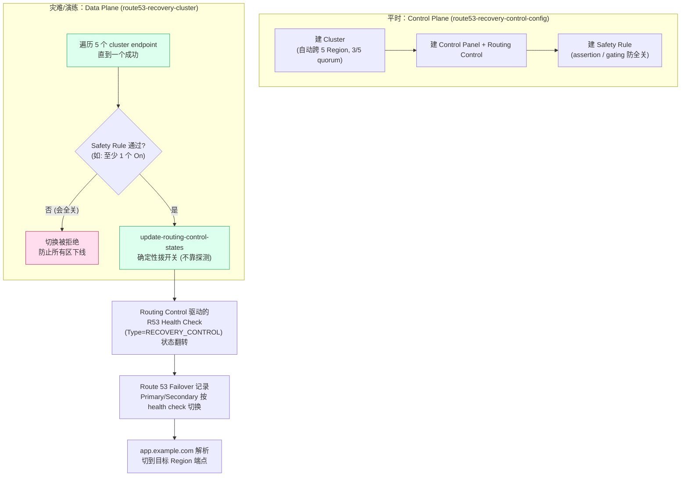
```mermaid
flowchart TD
    subgraph CFG["平时：Control Plane (route53-recovery-control-config)"]
        C1["建 Cluster<br/>(自动跨 5 Region, 3/5 quorum)"] --> C2["建 Control Panel + Routing Control"]
        C2 --> C3["建 Safety Rule<br/>(assertion / gating 防全关)"]
    end

    subgraph SW["灾难/演练：Data Plane (route53-recovery-cluster)"]
        D1["遍历 5 个 cluster endpoint<br/>直到一个成功"] --> D2{"Safety Rule 通过?<br/>(如: 至少 1 个 On)"}
        D2 -- "否 (会全关)" --> BLOCK["切换被拒绝<br/>防止所有区下线"]
        D2 -- "是" --> D3["update-routing-control-states<br/>确定性拨开关 (不靠探测)"]
    end

    D3 --> HC["Routing Control 驱动的<br/>R53 Health Check<br/>(Type=RECOVERY_CONTROL) 状态翻转"]
    HC --> FO["Route 53 Failover 记录<br/>Primary/Secondary 按 health check 切换"]
    FO --> DNS["app.example.com 解析<br/>切到目标 Region 端点"]

    classDef warn fill:#fde,stroke:#b36;
    classDef good fill:#dfe,stroke:#3a6;
    class BLOCK warn;
    class D1,D3 good;
```

> 图注：左上"平时用 control plane 配置"，右侧"灾难用 data plane 切换（5 endpoint 轮询）"是两条必须分清的路径；safety rule 在切换前拦"全关"；开关 → health check → failover 记录 → DNS 是确定性、无探测的切流链。这四点（data plane 救灾、5-Region quorum、safety rule 防全关、开关非探测）是 SME 最易错处。

ARC 四大能力选型决策树（先分"作用范围"，再分"动作性质"）：

```mermaid
flowchart TD
    Q0["ARC 恢复控制：需要哪种能力?"] --> Q1{"故障/演练作用范围?"}

    Q1 -- "跨 Region / 整副本级" --> R1{"要动作切流, 还是只审计准备度?"}
    R1 -- "只审计副本是否对齐<br/>(不切流)" --> RC["Readiness Check<br/>每分钟持续校验配置/容量对齐<br/>⚠非高可用·不作切流主触发<br/>⚠已停止对新客户开放"]
    R1 -- "确定性人工/编程切 Region" --> RTC["Routing Control<br/>拨开关→RECOVERY_CONTROL health check<br/>→R53 failover 记录→DNS<br/>cluster 5-Region 3/5 quorum + safety rule"]

    Q1 -- "单 Region 内某个 AZ 受损" --> R2{"人工移, 还是 AWS 自动移?"}
    R2 -- "人工/编程, 单动作" --> ZS["Zonal Shift<br/>移走 1 个 AZ (ALB/NLB/ASG/EKS)<br/>必设过期≤72h, 可延长/可取消<br/>fail-open 时不移"]
    R2 -- "AWS 依内部遥测自动移" --> ZAS["Zonal Autoshift<br/>授权 AWS 自动移坏 AZ<br/>必须配每周 practice run(~30min)<br/>可设 blocked windows"]

    classDef region fill:#dfe,stroke:#3a6;
    classDef zonal fill:#def,stroke:#36b;
    classDef warn fill:#fde,stroke:#b36;
    class RTC region;
    class RC warn;
    class ZS,ZAS zonal;
```

> 图注：**第一刀切"作用范围"**——跨 Region 走绿/黄支（routing control 切 / readiness check 审计），单 Region 内某个 AZ 走蓝支（zonal shift 手动 / zonal autoshift 自动）。**第二刀切"动作性质"**——只审计不动作的是 readiness check（且非高可用、已停新开放，最易错）；人拨的是 routing control 与 zonal shift；AWS 替你拨的是 zonal autoshift（代价是强制每周 practice run）。记住三个数字：routing control 的 **5-Region 3/5 quorum**、zonal shift 的 **72h 上限**、zonal autoshift practice run 的 **~30 分钟/周**。


================================================================================

# FILE: topics/12-integration-quotas.md
<!-- SOURCE FILE: topics/12-integration-quotas.md -->

# Topic 12：服务集成 + 配额与限流

> Route 53 SME 培训材料 · Wave3
> 覆盖 Route 53 与其它 AWS 服务的集成（Alias、Evaluate Target Health、Global Accelerator）以及账号级配额、API/DNS 限流与排查。

---

## 一、概念

### 1.1 服务集成 —— Alias 记录

Alias 记录是 Route 53 独有的扩展（非标准 DNS），把一条记录直接指向 AWS 资源，而不是指向一个 IP 或域名。相比 CNAME 有三个关键优势：

- **可用于 zone apex（根域，如 `example.com`）**：标准 DNS 禁止在 apex 放 CNAME，Alias 没有这个限制。
- **不额外收费**：查询 Alias 指向 AWS 资源不计入 DNS 查询费。
- **AWS 自动维护目标 IP**：目标资源换 IP 时 Route 53 自动跟踪，无需手工改记录。

支持作为 Alias 目标的资源类型（SME 高频考点）：

| Alias 目标 | 说明 | 可放 apex？ |
|-----------|------|:---:|
| CloudFront distribution | 目标必须是 CloudFront 域名（`d111111abcdef8.cloudfront.net`），记录类型 A/AAAA | ✅ |
| ELB（ALB / NLB / CLB） | 指向 LB DNS 名，Route 53 解析到 LB 各节点的 A/AAAA | ✅ |
| S3 静态网站 endpoint | **必须是"网站托管" endpoint**（`s3-website-<region>`），不是普通 REST endpoint；bucket 名须与记录名完全一致 | ✅ |
| API Gateway（自定义域名） | 指向 API GW 的 regional / edge 域名 | ✅ |
| VPC Interface Endpoint（PrivateLink） | 指向接口端点的 DNS 名 | ✅ |
| Global Accelerator | 指向 accelerator 的静态 DNS 名 | ✅ |
| Elastic Beanstalk 环境 | 指向 EB 环境的 CNAME/域名 | ✅ |
| App Runner 服务 | 指向 App Runner 服务默认域名 | ✅ |
| AppSync GraphQL API（自定义域名） | 指向 AppSync 自定义域名 | ✅ |
| Amazon OpenSearch Service 域 | 指向 OpenSearch 域端点 | ✅ |
| Lightsail | 指向 Lightsail 负载均衡/实例 | ✅ |
| VPC Lattice service | 指向 VPC Lattice 服务域名 | ✅ |
| 同一 hosted zone 内另一条记录 | Alias 到本 zone 的其它记录 | ✅ |

> 上表为**常见示例**，Alias 支持的 AWS 目标类型仍在扩展，具体以官方文档为准。

> 易混：Alias 到 EC2 实例**不直接支持**——EC2 没有稳定 DNS 名，需在前面放 ELB 或用普通 A 记录指向 EIP。

### 1.2 Evaluate Target Health（评估目标运行状况）

Alias 记录上的一个开关。开启后 Route 53 不需要单独建 health check，就能根据**目标资源自身的健康状态**决定是否返回该记录：

- Alias → ELB：`Evaluate Target Health = Yes` 时，Route 53 看 LB 后端目标组是否有健康目标；全不健康则不返回这条 Alias。
- Alias → CloudFront：**不支持** Evaluate Target Health（CloudFront 是全球边缘，无"目标"概念）。
- Alias → S3 网站：不支持。
- 多级 Alias 链（Alias → Alias → ELB）：健康状态**逐层向上传递**，任一层设了 Evaluate Target Health=Yes 都会参与判定。

这是做故障转移（Failover）路由时的核心机制——把主/备两条 Alias 指向不同区域的 ELB，配 failover 路由 + Evaluate Target Health，即可零 health-check 成本实现区域级切换。

### 1.3 与 Global Accelerator 的集成

- Global Accelerator 提供**两个静态 anycast IP**（Anycast，全球任播），流量从最近边缘接入 AWS 骨干网。
- 集成方式：Route 53 用 A 记录直接指向这两个静态 IP，或用 Alias 指向 accelerator DNS 名。
- 与 Route 53 延迟路由/地理路由的取舍：GA 在网络层做最优接入（TCP/UDP、非 DNS 依赖），Route 53 在 DNS 层做解析选路。二者可叠加，但 SME 要能说清"GA 解决客户端到入口的网络路径，Route 53 解决把哪个 IP 返给客户端"。

### 1.4 配额与限流（Quotas & Throttling）

| 维度 | 默认配额 | 可否提额 | 备注 |
|------|---------|:---:|------|
| 每账号 hosted zones | **500** | ✅ 可提 | 通过 Service Quotas / 开 case |
| 每 hosted zone records | **10,000** | ✅ 可提 | 超大 zone 建议拆分或提额 |
| Resolver endpoint 每 ENI QPS | **~10,000 QPS / IP(ENI)** | 通过加 IP 扩 | endpoint 至少 2 个 IP，加 IP 线性扩吞吐 |
| 公网权威查询（Public HZ 被外部解析） | **不计入账号限流** | — | 权威侧由 AWS anycast 车队承载，客户无需担心 QPS |
| Route 53 公共 API 请求速率（账号桶） | **持续 10 RPS / 突发 50** | 部分可议 | 账号级令牌桶，覆盖 `ChangeResourceRecordSets` 等控制面 API；超限返回 `Throttling` |
| DNS 记录变更（`ChangeResourceRecordSets` 应用速率） | **持续 100 changes/s / 突发 1500** | — | 变更**应用**吞吐，独立于上面的 API 调用速率 |
| Resolver API 速率 | **~5 RPS/账号** | — | 5 RPS 主要指 **Resolver** API（`route53resolver`），别把它当成整个 Route 53 API 的上限 |

要点：

- **数据面 vs 控制面**：公网权威 DNS 查询（数据面）几乎无限、不计账号配额；能被限流的是**控制面 API**（改记录、建 zone）——Route 53 公共 API 账号桶为**持续 10 RPS / 突发 50**，记录变更的**应用**吞吐另有**持续 100 changes/s / 突发 1500**。批量改记录要用**单次 ChangeResourceRecordSets 打包多个变更**，而不是循环单条调用（否则秒级触发 `Throttling` / `PriorRequestNotComplete`）。
- **别把"5 RPS"当成整个 Route 53 API 的上限**：5 RPS 主要指 **Resolver** API（`route53resolver`），与上面的公共 Route 53 API（10 RPS）是不同服务的不同桶。
- Resolver（VPC 递归解析，`.2` 或 Resolver endpoint）才有 per-ENI QPS 上限；不要把它和公网权威混为一谈。

### 1.5 DNS 查询错误 vs 限流的区分（排查核心）

SME 必须能把"响应码"和"被限流"分开：

- **SERVFAIL**：服务器端处理失败——常见是 DNSSEC 验证失败、上游/转发规则问题、Resolver endpoint 后端不可达。**不是限流**。
- **REFUSED**：服务器拒绝应答——常见是查询到了非权威/未委派该 zone 的服务器，或访问控制拒绝。**不是限流**。
- **NXDOMAIN**：记录不存在（正常否定应答）。
- **真限流的表现**：Resolver endpoint 超过 per-ENI QPS 时表现为**丢包/超时**（而非返回某个 rcode），CloudWatch `InboundQueryVolume` / `OutboundQueryVolume` 打满、`EndpointHealthyENICount` 与实际 ENI 数据对不上。控制面被限流则 API 直接返回 `Throttling`。

排查次序：先看是**响应码类**（SERVFAIL/REFUSED/NXDOMAIN，属配置/委派/DNSSEC）还是**无响应类**（超时/丢包，才往 QPS 限流查），避免把配置错误误判为限流去盲目提额。

---

## 二、真实案例：178602958500732（National Bank of Canada）

**背景**：客户（加拿大国家银行，账号 578091176149，Enterprise Support）咨询如何在防火墙上放行 AWS 公共 DNS 服务器的 IP，以实现 DNS zone delegation。属纯咨询（Informational/How-to），无生产影响。

**与本 topic 的关联点 —— 权威 NS 的"集成边界"与限流认知**：

1. **`ip-ranges.json` 中的 service 语义分层**（集成识别的易错点）：
   - `ROUTE53` = 公网**权威 NS** 的 IP 范围（客户要放行的正是这个）。
   - `ROUTE53_RESOLVER` = VPC 内**递归解析器**（就是有 per-ENI QPS 限流的那层）。
   - `ROUTE53_HEALTHCHECKS` = 健康检查车队（Evaluate Target Health 之外的显式 health check 探测源）。
   - SME 必须能瞬间区分这三者——它们分别对应"权威/递归/探测"三条完全不同的数据路径。

2. **公网权威查询不计账号限流的实证**：客户担心放行后的查询量，但权威侧由 AWS **Anycast**（任播）车队承载，属数据面、不计入账号配额，客户无需为 QPS 提额——正好对应本 topic 1.4 的"公网权威查询不计入账号限流"。

3. **静态但可增长**：已有 Route 53 NS IP 是**静态**的（文档原文 "Route 53 name server IP addresses are static."），但仍可能新增前缀。放行时**不按 region 过滤、全量收录**（实测 region 字段有 GLOBAL + us-west-2 / eu-central-1 / cn-north-1 / cn-northwest-1 / us-gov-east-1 / us-gov-west-1 / eusc-de-east-1 共 8 种），并订阅 SNS topic `arn:aws:sns:us-east-1:806199016981:AmazonIpSpaceChanged` 兜底监控变更。

4. **场景澄清**：NS delegation 本身**不需要**防火墙改动，需要放行的是**客户递归解析器 outbound 到权威 NS（UDP/TCP 目的端口 53）**的查询流量。这提醒 SME：集成/放行问题要先定位"是哪条数据路径"，而非按客户措辞直接动手。

**处置**：一次性回复关闭，无需 escalation。

---

## 三、实验步骤（动手 Lab）

目标：亲手建 Alias 记录指向 ELB 与 S3 网站，并观察 Evaluate Target Health 的效果。

### Lab A：Alias → ALB + Evaluate Target Health

1. 建一个 ALB（`my-alb`），目标组挂 1~2 台 EC2，配 HTTP health check。
2. **建成一个多记录组以验证 ETH**：单独一条 simple Alias 即使目标不健康、也可能因 **fail-open** 仍被返回，看不出 ETH 效果。要在 **failover 路由（Primary + Secondary）** 或 **加权/多值组** 里建这条 Alias——Primary 指向 `my-alb`（A 记录 Alias，`Evaluate Target Health = Yes`），Secondary 指向另一个健康端点。
3. 正常态下 `dig your-record.example.com` 返回 Primary（ALB 节点 IP）。
4. **制造故障**：把目标组里所有目标手工停掉/改成不健康（如关掉后端服务）。
5. 再 `dig`：Primary 目标组全不健康时 ETH 判其不健康，Route 53 切到 **Secondary** 记录。观察 TTL 到期后的行为变化。
6. **对照**：若把这条 Alias 单独建成一条 simple 记录（无同名兄弟记录），目标全不健康时它可能仍被 fail-open 返回——这正是"必须用多记录组才能验证 ETH 切换"的原因。

### Lab B：Alias → S3 静态网站

1. 建 bucket，名字**必须等于最终记录名**（如记录是 `www.example.com`，bucket 就叫 `www.example.com`）。
2. 开启 **Static website hosting**，拿到网站 endpoint（`www.example.com.s3-website-us-east-1.amazonaws.com`，注意是 `s3-website`，不是普通 REST endpoint）。
3. 在 hosted zone 建 A 记录 → Alias → "S3 website endpoint" → 选对 region 的 bucket。
4. `dig` + 浏览器访问，确认解析到 S3 并返回静态页。
5. 观察点：S3 网站 Alias **不支持** Evaluate Target Health（灰掉）——对比 Lab A 理解"哪些目标类型才有健康评估"。

### Lab C（可选）：控制面限流观察

- 写脚本循环调用 `aws route53 change-resource-record-sets` 单条变更、每秒持续 >10 次（超过公共 API 账号桶 10 RPS/突发 50）。
- 观察返回 `Throttling` / `PriorRequestNotComplete`，然后改成"单次请求打包多条 Changes"验证不再触发——理解 5 req/s 控制面限流与批处理正解。

---

## 四、SME 考点 / 易错点

1. **CNAME vs Alias**：apex 只能用 Alias；被问"为什么根域配了 CNAME 报错"要立刻答"apex 禁止 CNAME，改 Alias"。
2. **S3 网站 Alias 三条硬约束**：① 用网站 endpoint 不是 REST endpoint；② bucket 名 == 记录名；③ region 要选对。任一不满足解析/访问就失败。
3. **Evaluate Target Health 支持面**：ELB 支持；CloudFront、S3 网站**不支持**。别承诺 CloudFront Alias 能做目标健康评估。
4. **数据面 vs 控制面限流**：公网权威查询不限流、不计配额；被限的是控制面 API（Route 53 公共 API 账号桶 **10 RPS 持续/50 突发**，记录变更应用 **100/s 持续/1500 突发**）和 Resolver endpoint（per-ENI ~10k QPS）。注意 **5 RPS 是 Resolver API**，不是整个 Route 53 API 的上限——混答是高频扣分点。
5. **批量改记录**：用单次 `ChangeResourceRecordSets` 打包，别循环单条——否则触发 `Throttling`/`PriorRequestNotComplete`。
6. **SERVFAIL/REFUSED ≠ 限流**：响应码类问题查配置/委派/DNSSEC；限流表现为**超时/丢包**。排查先分"有响应码"还是"无响应"。
7. **500 zones / 10000 records 可提额**：客户撞上限先走 Service Quotas 提额或拆 zone，不要误报为"硬限制"。
8. **Resolver 三分层**（呼应真实案例）：ROUTE53（权威）/ ROUTE53_RESOLVER（递归、有 QPS 限流）/ ROUTE53_HEALTHCHECKS（探测），三条数据路径别混。
9. **Global Accelerator vs Route 53 选路**：GA 解决网络层最优接入（静态 anycast IP），Route 53 解决 DNS 层返哪个 IP，说清分工。

---

## 五、Mermaid 导图

```mermaid
mindmap
  root((Topic 12<br/>集成 + 配额限流))
    服务集成
      Alias 记录
        可用于 apex
        不额外收费
        AWS 自动维护目标
        目标类型
          CloudFront
          ELB (ALB/NLB/CLB)
          S3 静态网站 endpoint
          API Gateway
          VPC Interface Endpoint
          Global Accelerator
          Elastic Beanstalk
          App Runner
          AppSync
          OpenSearch
          Lightsail
          VPC Lattice
      Evaluate Target Health
        ELB 支持
        CloudFront 不支持
        S3 网站 不支持
        Failover 核心机制
      Global Accelerator
        静态 anycast IP x2
        GA 管网络接入
        R53 管 DNS 选路
    配额与限流
      每账号 500 hosted zones (可提)
      每 zone 10000 records (可提)
      Resolver endpoint ~10000 QPS/ENI
      公网权威查询 不计账号限流
      公共 API 账号桶 10 RPS/突发 50
      DNS 变更 100/s/突发 1500
      Resolver API ~5 RPS
      批量改记录打包 ChangeRRSets
    错误 vs 限流
      SERVFAIL DNSSEC/上游/后端
      REFUSED 非权威/未委派/ACL
      NXDOMAIN 记录不存在
      真限流 超时/丢包 非 rcode
    真实案例 178602958500732
      NBC 放行公网 NS IP
      ip-ranges service 三分层
        ROUTE53 权威
        ROUTE53_RESOLVER 递归
        ROUTE53_HEALTHCHECKS 探测
      公网权威 Anycast 不计限流
      NS IP 静态但可增长
      SNS 订阅变更兜底
```


================================================================================

# FILE: topics/13-troubleshooting-discipline.md
<!-- SOURCE FILE: topics/13-troubleshooting-discipline.md -->

# Topic 13：通用故障排查纪律（横切）

> 本 topic 是横切方法论，不绑定单一 R53 组件。它教 SME 在面对任意 R53/DNS 故障时，如何**建模、取证、定级、下结论**，避免最常见的两类错误：把单点当全局、把必要条件当充分条件。

---

## 1. 概念：排查纪律

DNS/R53 故障排查的核心不是"知道哪个组件会坏"，而是**用什么纪律去判断一个结论能不能下**。以下六条纪律贯穿所有 R53 case。

### 1.1 单点 vs 全局

一个实例（一台 EC2、一个 client、一次查询）解析失败，**不等于**服务整体故障。反过来，一次查询成功也**不等于**路径整体健康。

- R53 Resolver 的 Outbound/Inbound Endpoint 通常有 **多个 ENI**（IpCount≥2），Resolver 可经任一 ENI 发出查询。如果只有一个 ENI 的路径被阻断，则**部分查询成功、部分超时**——表现为"时好时坏"。
- 判断维度：失败是**确定性**（100% 失败）还是**概率性**（部分失败）？确定性全失败往往指向"所有路径共有的一环"（VPC DNS、权威 NS、目标 DNS 本身）；概率性失败往往指向"多路径中的某一条"（某个 ENI 子网的 NACL、某条 TGW 路由）。
- 纪律：**永远先界定故障范围（blast radius）再归因**。问清楚"是所有 client 还是这一台？所有域名还是这一个？所有查询还是偶发？"

### 1.2 证据分级

每条结论必须标注证据强度。四级：

| 级别 | 含义 | 措辞 |
|---|---|---|
| **DIRECTLY_OBSERVED** | 从客户提供的真实导出/日志/工具输出直接读到 | "已确认"/"observed" |
| **DOCUMENTED_FACT** | 官方文档明确规定的行为（如 VPC DNS = CIDR base + 2） | "根据文档" |
| **INFERENCE** | 由观测+文档推出，但存在反例可能 | "suggests"/"很可能" |
| **UNKNOWN** | 未验证、需客户提供 | "待确认"/列入索取清单 |

纪律：**回复中的每个断言都要能对应到一个级别**。INFERENCE 用"suggests"而非"is"；UNKNOWN 绝不当成事实写进结论或承诺。

### 1.3 必要非充分条件

发现一个阻断点（如某 NACL 拦了 DNS），**修它是恢复的必要条件，但不一定是充分条件**。可能同时存在第二个问题（TGW 路由不可达、目标 DNS 不响应）。

纪律：**不要承诺"修 X 就好了"**，除非已证明 X 是唯一阻断点。措辞用"这是需要修复的一处；同时请确认 A/B/C"。

### 1.4 VPC DNS（.2 resolver）不过 SG/NACL

VPC 内 EC2 到 **AmazonProvidedDNS（VPC CIDR base + 2，如 10.201.244.2）** 的查询流量，**不经过 Security Group、NACL、路由表**。这是 AWS 底层实现，不是可配置的数据面路径。

纪律：客户/AI 初稿常错误建议"检查 EC2 到 .2 的 SG/路由"。**SME 必须纠正方向**——EC2→VPC DNS 这段不可能被 SG/NACL 阻断，真正的阻断点在下游（Resolver Endpoint 的 ENI 子网 NACL、转发目标的路由）。

### 1.5 dig 分层定位

用 `dig` 逐层拆解"是权威侧问题还是递归侧问题"：

| 命令 | 定位什么 |
|---|---|
| `dig example.com NS` | NS 记录是否指向 R53 |
| `dig +trace example.com` | 从根逐级委派，定位断在哪一层委派 |
| `dig @ns-xxx.awsdns-yy.com example.com A` | 直接问**权威** NS（绕过递归缓存） |
| `dig +cd example.com` | 关闭 DNSSEC 校验，区分"记录错" vs "DNSSEC 验证失败" |
| `dig @10.x.x.x example.com`（指定 NS） | 直接问某个递归/转发目标，定位单点 |

纪律：**权威查询与递归查询要分开测**。权威直查成功但递归失败 → 递归/缓存/转发链问题；权威直查就失败 → 记录本身或委派问题。

### 1.6 响应码含义

| 响应 | 含义 | 常见方向 |
|---|---|---|
| **NXDOMAIN** | 权威明确回答"此名不存在" | 记录缺失/拼写/未创建；**是权威的确定回答，不是网络问题** |
| **SERVFAIL** | 递归/权威处理失败 | DNSSEC 验证失败、转发目标不响应、上游超时 |
| **REFUSED** | 服务器拒绝应答此查询 | 权限/ACL、非授权区、递归被关 |
| **timeout** | 根本没收到响应 | **网络层**：SG/NACL/路由阻断、目标 DNS 宕、UDP 分片丢失 |

纪律：**timeout 是网络问题，NXDOMAIN 是数据问题**。二者排查方向完全不同——把 timeout 当成"记录没配"会走错路。

### 1.7 负缓存 / TTL

- 记录的 TTL 决定改动后旧值还会被缓存多久。
- **负缓存（SOA minimum / negative TTL）**：NXDOMAIN 也会被缓存。刚创建一条记录，客户可能仍解析失败，因为之前的 NXDOMAIN 还在递归器负缓存里。
- 纪律：改完记录后若客户说"还是不通"，先问"等了多久？用了哪个递归器？"再直查权威确认改动已生效。

### 1.8 不做唱因归因（no premature root-causing）

在证据不足时，**不要为了给客户一个"确定的答案"而把 INFERENCE 说成根因**。收集证据 → 逐条定级 → 只对 DIRECTLY_OBSERVED 的阻断下"已确认"，其余列为待确认。宁可回复"这是一处确认的阻断，另有 A/B 需确认"，也不要唱一个未经证实的单一根因。

---

## 2. 真实案例

### 案例 A — Case 178222843600312（ysshop，三域名解析突然失效）

**现象**：客户三个域名（shop-app-admin.com / yaoshen123.com / yaoshenwang.com）"昨天正常、今早全挂"。

**排查纪律应用**：
- **单点 vs 全局**：三个域名**同时**失效 → 指向"三者共有的一环"（同一账户、同一 Hosted Zone、或注册商 NS 被改），而非单条记录。
- **分层取证顺序**：先 `whois`（域名注册状态/过期/NS 设置）→ 再 `dig <domain> NS`（NS 是否仍指 R53）→ 再查 R53 Hosted Zone 是否存在、NS 是否匹配 → 最后 CloudTrail 查 24-48h 内 `ChangeResourceRecordSets`/`DeleteHostedZone`/`UpdateDomainNameservers`。
- **响应码分层**：若 `dig NS` 返回 NXDOMAIN/无委派 → 注册商侧 NS 问题；若 NS 正确但 `dig A` 超时 → R53 侧或记录问题。
- **不唱因**：现象一致但根因未定，分析文档列出 5 个候选方向（域名过期、Hosted Zone 配置、注册商 NS 被改、记录被删、账户级问题），逐一给验证命令，**不预先断言是哪一个**。

**教学点**：多资源同时失效 → 找公共因子；`whois`→`dig NS`→控制台→CloudTrail 是"注册/委派链"故障的标准取证序列。

### 案例 B — Case 178767531400698（J Crew，EC2 无法解析 jcrew.com，三次全超时）

**现象**：EC2 `nslookup jcrew.com 10.201.244.2` 三次全部 `communications error ... timed out`。

**排查纪律应用**：
- **VPC DNS 不过 SG/NACL**：`10.201.244.2` = VPC CIDR（10.201.244.0/22）base + 2 = AmazonProvidedDNS（DOCUMENTED_FACT + VPC CIDR DIRECTLY_OBSERVED）。EC2→.2 这段**不经 SG/NACL**。Genie AI 初稿建议"查 EC2 到 .2 的 SG/路由"——**方向错误，SME 纠正**：真正阻断点在下游 Resolver Outbound Endpoint 的 ENI 子网 NACL。
- **响应码含义**：现象是 **timeout**（不是 NXDOMAIN）→ 网络层，不是记录问题。
- **证据分级**：NACL `acl-04b92237c4b6395f1`（ENI2 子网）出站命中 `Rule 63 DENY 10.0.0.0/8`、入站仅放行 TCP ephemeral 缺 UDP ephemeral（均 DIRECTLY_OBSERVED，逐条比对客户导出）；目标 DNS 10.201.244.12 是否健康、TGW 双向路由是否有效均 UNKNOWN。
- **单点 vs 全局 + 必要非充分**：Outbound Endpoint 有 2 个 ENI，Resolver 可经任一发出。ENI2 被双向阻断。但客户**三次全超时**——若 ENI1 路径畅通，应有部分成功。三次全失败构成"ENI1 路径亦有问题"的反向证据（INFERENCE，附反例检查：Resolver ENI 选择若粘滞则不成立）。**结论：修 NACL 是必要条件而非充分条件**，回复用"suggests"、不承诺修完即恢复，并把 TGW 路由/目标 DNS 列入索取清单。
- **差分诊断设计**：`nslookup`（UDP）vs `nslookup -vc`（TCP）vs SRV 查询，用于区分 UDP 腿 / TCP 腿 / 记录类型问题；并注明单次成功不能证明两条 ENI 都通。

**教学点**：`.2` = CIDR+2 且不过 SG/NACL；timeout=网络层；多 ENI 下"三次全超时"是判断"单点还是全局"的关键信号；确认的阻断只是必要条件，不做充分性承诺。

---

## 3. 实验步骤（复现"单点 vs 全局"区分）

目标：用 `dig` 分层实验，亲手区分**单点故障**与**全局故障**，并练习证据定级。

### 实验环境
- 任意 Linux 主机（装 `bind-utils` / `dnsutils` 获得 `dig`）。
- 一个自有域名 + 一个 R53 Hosted Zone（或用公共域名做只读观测）。

### 步骤 1：建立"全局正常"基线（权威 vs 递归分层）
```bash
# 递归查询（走本机配置的 resolver）
dig example.com A

# 直查权威 NS（绕过递归缓存）——先拿到权威
dig example.com NS +short
dig @ns-123.awsdns-45.com example.com A     # 用上一步返回的某个 NS

# 从根逐级委派
dig +trace example.com
```
> 判读：递归与权威都返回一致 A 记录 = 全局健康基线。记录每条结果的证据级别（此处均 DIRECTLY_OBSERVED）。

### 步骤 2：制造"单点故障"并观察（只影响一个 client）
```bash
# 在 client A 上把 resolver 指向一个不可达/错误的 DNS
#（实验：临时改 /etc/resolv.conf 指向一个黑洞 IP，如 192.0.2.1）
dig example.com A            # 预期 timeout

# client B 不动，仍用正常 resolver
dig example.com A            # 预期成功
```
> 判读：A 超时、B 成功 → **单点**（client A 的配置/路径问题），权威本身健康。这就是"一个实例失败 ≠ 服务故障"的实证。恢复 resolv.conf。

### 步骤 3：制造"全局故障"并观察（所有 client 都受影响）
```bash
# 在 R53 控制台把某条 A 记录删除，或改错 NS 委派（实验环境）
# 等待/清缓存后，从多个 client 分别查
dig @<权威NS> example.com A +short          # 直查权威：预期 NXDOMAIN 或无 A
dig example.com A                            # 递归：清负缓存前可能仍返回旧值
```
> 判读：多个 client **一致**失败、且**直查权威**就已失败 → **全局**（数据/委派问题）。恢复记录后立刻 `dig @权威` 确认已生效，再解释负缓存导致递归侧的延迟。

### 步骤 4：区分响应码
```bash
dig doesnotexist.example.com A          # 观察 NXDOMAIN（权威确定回答）
dig @192.0.2.1 example.com A            # 观察 timeout（网络不可达）
dig +cd example.com A                   # 关 DNSSEC 校验，若原来 SERVFAIL 现在成功 → DNSSEC 问题
```
> 判读：把 NXDOMAIN（数据）/ timeout（网络）/ SERVFAIL（处理失败）三种排查方向分清。

### 步骤 5：负缓存实测
```bash
# 步骤3删记录后先查一次（进负缓存），再重建记录，立即递归查
dig example.com A          # 重建后仍可能 NXDOMAIN —— 负缓存未过期
dig @<权威NS> example.com A # 直查权威已是新值 —— 证明是缓存而非配置问题
```
> 判读：递归失败但权威成功 = 缓存滞后，不是"没配好"。用 SOA 的 minimum 估算等待时间。

**清理**：恢复所有 resolv.conf 与被删记录，确认基线恢复。

---

## 4. SME 考点 / 易错点

**考点**
- 能对任一结论标注 DIRECTLY_OBSERVED / DOCUMENTED_FACT / INFERENCE / UNKNOWN，并据此选择措辞。
- 能说出 AmazonProvidedDNS = VPC CIDR base + 2，且 EC2→该地址**不过 SG/NACL**。
- 能用 `dig` 区分权威侧 vs 递归侧、用 `+trace`/`+cd`/指定 NS 定位层级。
- 能解释 NXDOMAIN / SERVFAIL / REFUSED / timeout 各自指向的排查方向。
- 能识别"必要条件 ≠ 充分条件"，并在回复中不做充分性承诺。

**易错点**
- ❌ 把"一台实例失败"直接当成"服务故障"下结论（未界定 blast radius）。
- ❌ 建议客户检查 EC2 到 `.2` VPC DNS 的 SG/NACL/路由（该段不经这些）。
- ❌ 把 **timeout** 当成"记录没配"去查记录（timeout 是网络层）。
- ❌ 发现一个 NACL 阻断就承诺"修完即恢复"（多 ENI/多路径下常有第二处问题）。
- ❌ 改完记录客户说不通就以为改错了（可能是负缓存/TTL 未过期，应直查权威确认）。
- ❌ 把 INFERENCE 用"is/确认"措辞写进结论，或把 UNKNOWN 当事实写进承诺。
- ❌ 证据不足时为给"确定答案"而唱一个未证实的单一根因。
- ❌ 多 ENI Endpoint 下用一次查询成功就断言"整条路径都通"。

---

## 5. Mermaid 导图

```mermaid
flowchart TD
    A[收到 DNS/R53 故障] --> B{界定范围<br/>单点 vs 全局}
    B -->|一个 client/域名/偶发| C[单点方向<br/>某 client 配置 / 某 ENI 子网 NACL / 某条路由]
    B -->|多 client/域名/确定性全失败| D[全局方向<br/>VPC DNS / 权威 NS / 目标 DNS / 委派]

    C --> E{看响应码}
    D --> E
    E -->|timeout| F[网络层<br/>SG/NACL/路由/目标宕/UDP分片]
    E -->|NXDOMAIN| G[数据层<br/>记录缺失/委派错]
    E -->|SERVFAIL| H[处理失败<br/>DNSSEC/转发目标不响应]
    E -->|REFUSED| I[权限/ACL/非授权区]

    F --> J[dig 分层定位<br/>+trace / 指定NS / @权威]
    G --> J
    H --> K["dig +cd 区分 DNSSEC"]
    K --> J

    J --> L{是 EC2→.2 VPC DNS?}
    L -->|是| M[[提醒: 不过 SG/NACL<br/>阻断点在下游 Endpoint ENI 子网]]
    L -->|否| N[逐跳核 SG/NACL/路由]
    M --> O
    N --> O[对每条发现定级<br/>OBSERVED/DOCUMENTED/INFERENCE/UNKNOWN]

    O --> P{阻断点是否唯一?}
    P -->|多路径/多ENI 未证唯一| Q[必要非充分<br/>不承诺修完即恢复<br/>列 UNKNOWN 到索取清单]
    P -->|已证唯一 OBSERVED| R[给出修复<br/>直查权威验证 + 提示负缓存/TTL]
    Q --> S[回复: 已确认项用OBSERVED措辞<br/>推断用 suggests<br/>不唱因归因]
    R --> S
```


================================================================================

# FILE: topics/14-technical-deep-principles.md
<!-- SOURCE FILE: topics/14-technical-deep-principles.md -->

# Topic 14 — 技术原理深挖（SME 要懂的底层机制）

> **定位**：本专题不讲"怎么配"，只讲"底层为什么这么设计、报文/信任链/数据面到底怎么流转"。SME 与普通用户的分界线就在这里——用户能配 failover，SME 要能在客户追问"为什么切换要等 X 秒""为什么 dig +short 拿到的 NS 和控制台不一样""DNSSEC 报 SERVFAIL 到底断在哪一环"时，从机制层给出准确答案。
> **五大原理块**：(1) 递归解析完整路径与 R53 权威定位；(2) 权威 anycast / 全球 NS 基础设施与四组委派 NS 选择机制；(3) VPC Resolver 数据面架构 / EDNS0 client subnet / 缓存与负缓存；(4) health checker 全球分布 / 18% 共识 / 数据面传播延迟；(5) DNSSEC 验证链密码学原理。
> **配套 topic**：01（Hosted Zone）、04（健康检查）、05（Resolver/混合 DNS）、07（DNSSEC）、03b（路由×HC 交互）。本专题是它们背后的"机制底座"。

---

## 一、DNS 递归解析完整路径与 Route 53 权威定位

### 1.1 三种角色：stub / recursive / authoritative（考点，别混）

| 角色 | 位置 | 职责 | R53 对应 |
|---|---|---|---|
| **Stub resolver（存根解析器）** | 终端设备（笔记本 / EC2 内核 glibc）| 只做一件事：把查询丢给配置的递归解析器，自己不迭代 | 客户端侧，不是 R53 |
| **Recursive resolver（递归解析器）** | ISP / 企业网 / 公共 DNS（8.8.8.8）/ **VPC Resolver** | 代替客户端"跑完全程"：迭代查询根→TLD→权威，缓存结果，回填答案 | **VPC Resolver 就是这一层** |
| **Authoritative name server（权威服务器）** | 域名所有者侧 | 持有 zone 的真实记录，只回答"我负责的 zone"，**从不迭代、从不缓存别人的数据** | **Route 53 public hosted zone 通过公开 awsdns NS 对外应答**；**private hosted zone 的数据不经公开 awsdns 地址暴露，而是经关联 VPC 的 VPC Resolver 私有连接访问**（见 §1.2 与第三块） |

> **核心心法**：Route 53（托管 zone 那一侧）是**权威**，不是递归。它只对"发到它这里的、它负责的 zone"作答，绝不会替你去问别人。VPC Resolver 才是递归。**SME 最常被问混的就是这两个**——见第三块。

### 1.2 一次冷缓存查询的完整迭代路径

以递归解析器解析 `www.pd-market.com`（缓存全空）为例：

```mermaid
sequenceDiagram
    participant C as Stub Resolver<br/>(客户端)
    participant R as Recursive Resolver<br/>(如 VPC Resolver / 8.8.8.8)
    participant Root as 根服务器 (.)
    participant TLD as .com TLD 服务器<br/>(Verisign)
    participant R53 as Route 53 权威<br/>(awsdns NS)

    C->>R: www.pd-market.com A?（递归标志 RD=1）
    R->>Root: www.pd-market.com A?
    Root-->>R: 我不知道，去问 .com（返回 .com NS + glue）
    R->>TLD: www.pd-market.com A?
    TLD-->>R: 我不知道，去问 pd-market.com<br/>（返回 4 条 awsdns NS 委派；awsdns-* 为域外名<br/>glue 可选，解析器可独立解析）
    R->>R53: www.pd-market.com A?
    R53-->>R: 权威应答：A = 203.0.113.10（AA 标志=1）
    R-->>C: A = 203.0.113.10（缓存 TTL 秒）
```

关键机制点：

- **RD（Recursion Desired）标志**：stub→recursive 的查询带 RD=1（"请你替我跑全程"）；recursive→权威的查询 **RD=0**（权威不递归）。R53 收到 RD=1 的查询也**不会**递归，它只按权威身份作答。
- **委派（delegation）靠 NS 记录，glue 仅对 in-bailiwick NS 必需**：`.com` 里存的是 `pd-market.com → 4 条 awsdns NS 名字`。**glue（NS 的 A/AAAA）只在 NS 名字落在被委派域内（in-bailiwick，如 `ns1.pd-market.com`）时才必需**——否则会陷入"要解析 NS 又要先解析 pd-market.com"的死循环。而 R53 的 `awsdns-*` NS 属于**委派域外（out-of-bailiwick）名称**，解析器可**独立**沿 `.net/.org/.co.uk` 等各自的链路解析出它们的地址，**不依赖 `pd-market.com` 这条 child delegation 附带的 glue**（RFC 9471）。TLD 侧仍可能附带 glue 作为优化，但对 awsdns-* 而言不是必需项。
- **AA（Authoritative Answer）标志**：R53 的应答置 AA=1，表示"该服务器对此答案具有权威性（是权威原话，非缓存转述）"，递归解析器据此判定可缓存。**注意：AA=1 只表权威来源，不提供任何密码学真实性**——它不能防止路径上的伪造/篡改。真正的"可信（authenticated data）"来自 **DNSSEC 验证成功后置位的 AD 标志**（RFC 4035），两者是不同层次，别混（见第五块）。
- **谁做缓存**：**递归解析器是主要缓存层**，但缓存不止它一家——**OS 本地存根缓存 / 本地转发代理（dnsmasq、systemd-resolved）/ 应用自身**都可能缓存。权威（R53）本身不缓存。**VPC Resolver（Nitro）作为递归层也维护本地短期缓存**，且在**上游权威故障时可能提供超出 TTL 的缓存答案**（serve-stale 式兜底）。所以"改了记录多久生效"取决于**这条链路上任一缓存层手里旧记录的剩余 TTL**，不只是最近那一跳的递归解析器——R53 权威侧改动本身传播很快（见第二块传播）。

> **SME 排障锚点**：客户说"我改了记录，为什么没生效"——先问"你在哪测的、经过哪个递归解析器、旧记录 TTL 多少"。R53 权威侧的变更**通常在 60 秒内传播到该 hosted zone 的全部 R53 NS**（应以 **`GetChange` 返回 `INSYNC`** 作为传播完成的权威确认，而不是假定"总是已更新"）；一旦 INSYNC，卡的通常就是**下游各缓存层的旧记录 TTL 尚未过期**，不能只归因于递归 TTL。
> 来源：[Amazon Route 53 concepts](https://docs.aws.amazon.com/Route53/latest/DeveloperGuide/route-53-concepts.html)、[A Case Study in Global Fault Isolation](https://aws.amazon.com/blogs/architecture/a-case-study-in-global-fault-isolation/)（"DNS Resolution"节）。

---

## 二、权威 anycast / 全球 NS 基础设施与四组委派 NS 选择机制

这一块是 R53 权威侧最"AWS 独有"的工程，来源核心是 2014 年架构博客 [A Case Study in Global Fault Isolation](https://aws.amazon.com/blogs/architecture/a-case-study-in-global-fault-isolation/)（shuffle sharding 系列），SME 必须能讲清楚。

### 2.1 Anycast：一个 IP，全球多个 edge 同时宣告

- R53 权威用 **anycast** 从全球**多个 edge location** 宣告同一批 NS IP 地址。
  > ⚠️ **数字口径提醒**：坊间常引的"**50+ edge**"来自 **2014 年架构博客** [A Case Study in Global Fault Isolation](https://aws.amazon.com/blogs/architecture/a-case-study-in-global-fault-isolation/) 当时的测量，只作**设计背景**，**不代表现行权威数字**（R53 边缘规模早已远超且持续变化，以官方最新文档为准）。
- Anycast 的路由语义：客户端发往某个 NS IP 的包，被 Internet 路由到**网络路径最近**（不是地理最近）的那个宣告该地址的 edge。
- 效果：同一个 `ns-584.awsdns-09.net`，澳洲的递归解析器命中悉尼 edge，欧洲的命中法兰克福 edge——**低延迟 + 天然抗单点**。

### 2.2 四组委派 NS = 四个 stripe（.com/.net/.co.uk/.org），带 shuffle sharding

这是本块最硬的考点。R53 背后有**数千个 NS 名字**，分布在**四个顶级域**上：

| Stripe | TLD | 说明 |
|---|---|---|
| .com stripe | `awsdns-XX.com` | Verisign 运营 |
| .net stripe | `awsdns-XX.net` | Verisign 运营 |
| .org stripe | `awsdns-XX.org` | 不同运营方 |
| .co.uk stripe | `awsdns-XX.co.uk` | 不同运营方 |

**每个 hosted zone 拿到的 4 条委派 NS = 从四个 stripe 各取一条**（一个 zone 的 delegation set 横跨四个 TLD）。

- **多 TLD 的意义**：`.com`/`.net` 同属 Verisign，若某 TLD 自身 DNS 故障（罕见），你至少还有另外两条（.org/.co.uk）能解析——**TLD 层容灾**。
- **shuffle sharding 规则（硬考点）**：分配 NS 时强制"**任意两个 hosted zone 的 4 条 NS 重叠不超过 2 条**"。这样某几个 NS 名字/IP 出问题时，受影响的 zone 集合彼此错开，**故障爆炸半径被切碎**（magical fault isolation）。

### 2.3 "每个 edge 一般只宣告一个 stripe"——延迟 vs 可用性的取舍

R53 **没有**在每个 edge 宣告全部四个 stripe，而是**每个 edge 一般只宣告一个 stripe**。原因：

- 若每个 edge 宣告全部四条：解析器无论选哪条 NS 都落到同一个最近 edge——延迟最优，但**该 edge 一旦不可达（断电 / 断网 / 中间传输商拥塞 / DDoS），四条 NS 全军覆没，解析器无处可退**（实测这类事件恢复约 5 分钟）。
- R53 选择每 edge 一个 stripe：解析器手里的 4 条 NS 分布在 4 个不同 edge，**任一 edge / 路径故障，还有 3 条在别处的 NS 可退**，并获得 Internet 路径多样性（绕开拥塞）。
- 代价：某些 NS 会从"较远的 edge"应答。但由于绝大多数递归解析器用 **SRTT（Smooth Round-Trip Time）自动收敛到最快的 NS**（上引 2014 博客当时测得**约 80% 的解析器**这么做——**此为该博客当年的测量背景，不作现行权威数字**），对最小 RTT / 最快应答几乎无影响。这是 R53 "100% DNS 查询 SLA"背后的取舍。

```mermaid
flowchart TB
    Z["Hosted Zone<br/>pd-market.com"]
    Z --> NS1[".com stripe<br/>ns-A.awsdns.com"]
    Z --> NS2[".net stripe<br/>ns-B.awsdns.net"]
    Z --> NS3[".org stripe<br/>ns-C.awsdns.org"]
    Z --> NS4[".co.uk stripe<br/>ns-D.awsdns.co.uk"]
    NS1 -. anycast .-> E1["Edge 悉尼<br/>(宣告 .com)"]
    NS2 -. anycast .-> E2["Edge 香港<br/>(宣告 .net)"]
    NS3 -. anycast .-> E3["Edge 新加坡<br/>(宣告 .org)"]
    NS4 -. anycast .-> E4["Edge 东京<br/>(宣告 .co.uk)"]
    E1 -. 单 edge 故障 .-x X["解析器仍可退到<br/>E2/E3/E4 的 3 条 NS"]
```

### 2.4 Reusable delegation set / white-label NS（衍生考点）

- 默认每个 hosted zone 分到**独立的一组 4 NS**。若要多个 zone 共用同一组 NS（便于在注册商侧集中配置委派），用 **reusable delegation set**（仅 API，控制台不支持）。
- **white-label（vanity）name server**：把 `ns-XXXX.awsdns-XX.com` 隐藏成 `ns1.yourbrand.com`——本质仍是那 4 台 awsdns NS，只是加了自定义 NS 名字外壳。

> **SME 排障锚点**：客户抱怨"控制台显示的 4 条 NS 和我 dig NS 拿到的不一致"——多半是父区（注册商 / 上级 zone）委派没同步、或存在旧 delegation set 残留。别动 R53 侧那条自动生成的 NS 记录（"Except in rare circumstances, don't change it")。
> 来源：[SOA and NS records R53 creates](https://docs.aws.amazon.com/Route53/latest/DeveloperGuide/SOA-NSrecords.html)、[Considerations for public hosted zones](https://docs.aws.amazon.com/Route53/latest/DeveloperGuide/hosted-zone-public-considerations.html)、[Configuring white-label name servers](https://docs.aws.amazon.com/Route53/latest/DeveloperGuide/white-label-name-servers.html)、上引 fault-isolation 博客。

---

## 三、VPC Resolver 数据面架构、EDNS0 client subnet、解析缓存与负缓存

### 3.1 VPC Resolver 是"递归数据面"，跑在 VPC+2

- VPC Resolver（旧称 "Amazon-provided DNS" / AmazonProvidedDNS）跑在 **VPC CIDR 基址 +2** 的地址上（例如 VPC `10.0.0.0/16` → Resolver 在 `10.0.0.2`），IPv6 上是 `fd00:ec2::253`，另外还有链路本地地址 `169.254.169.253`。
- 它是**递归解析器**（第一块的 recursive 角色）：对 public 记录会迭代到互联网权威；对 VPC 内名字（EC2 私有 DNS 名）、关联的 **private hosted zone** 直接本地作答。
- **PHZ 数据只经 VPC Resolver 私有连接可达**：private hosted zone 的记录**不发布到公开的 awsdns NS 地址**——从 VPC 外直接 `dig @ns-XXXX.awsdns-XX.com` 查 PHZ 里的名字**不会返回 PHZ 数据**（会得到公网权威的答案或 NXDOMAIN）。要命中 PHZ，查询必须来自关联 VPC 内、经 VPC+2 的 VPC Resolver。
- **可用性 / 扩展**：默认在所有 VPC 中就绪，AWS 侧自动横向扩展。但对**单个 ENI 出方向到 VPC+2 有每秒包数硬上限（约 1024 pps/ENI）**——大量并发解析（如 fleet 同时冷启动查外部域）可能撞这个上限触发丢包，表现为间歇性解析超时。这是 SME 级排障点，不在普通文档首页。

### 3.2 EDNS0 client subnet（ECS）——地理/延迟路由精度的底层报文机制

普通递归解析路径里，权威只看得到**递归解析器的源 IP**，看不到真实终端用户。这对 geolocation / geoproximity / latency / IP-based 路由是致命的——用户在巴西、但用了美国的 8.8.8.8，权威会以为用户在美国。

**EDNS0 的 edns-client-subnet（ECS，RFC 7871）解决这个问题：**

- 支持 ECS 的递归解析器，在转发给 R53 权威时，**在 OPT 伪记录里附带一段"截断后的用户源 IP 前缀"**（如 `203.0.113.0/24`，抹掉主机位保护隐私）。
- R53 据此按**真实用户位置**而非解析器位置做地理/延迟决策，精度大幅提升。
- 若解析器**不支持** ECS：R53 回退用**解析器的源 IP**猜位置（精度差）。
- **private hosted zone 不适用 EDNS0**：私有 zone 的地理/延迟决策改用"private hosted zone 所在 AWS Region 的 VPC Resolver 数据"来判定。

```mermaid
flowchart LR
    U["巴西用户<br/>src 200.x.x.x"] --> RSV["递归解析器<br/>(美国, 支持 ECS)"]
    RSV -->|"查询 + ECS: 200.x.x.0/24<br/>(截断主机位)"| R53["Route 53 权威"]
    R53 -->|"按真实用户地=巴西<br/>回巴西 endpoint"| RSV
    RSV --> U
    style R53 fill:#2d3748,color:#fff
```

> **易错点**：ECS 是"**解析器愿不愿意 + 支不支持**"的可选扩展，R53 侧被动接受。客户抱怨"geolocation 路由把用户导错区"，先查其递归解析器是否支持 ECS、是否发了 client-subnet——不支持时权威只能看解析器 IP。
> 来源：[How R53 uses EDNS0 to estimate user location](https://docs.aws.amazon.com/Route53/latest/DeveloperGuide/routing-policy-edns0.html)、[RFC 7871 Client Subnet in DNS Queries](https://datatracker.ietf.org/doc/html/rfc7871)、[VPC Resolver availability and scaling](https://docs.aws.amazon.com/Route53/latest/DeveloperGuide/resolver-availability-scaling.html)。

### 3.3 正缓存 vs 负缓存（NXDOMAIN / NODATA 缓存）——SOA MINIMUM 的真正用途

- **正缓存**：递归解析器按记录自身 TTL 缓存"有答案"的应答。
- **负缓存（negative caching，RFC 2308 / 更新为 RFC 9077）**：递归解析器也缓存**"这个名字不存在（NXDOMAIN）"或"名字在但该类型无记录（NODATA）"** 的否定应答，以减少对权威的重复无效查询。
- **负缓存时长 = min(SOA 的 MINIMUM 字段, SOA 记录自身 TTL)**。这就是 SOA 最后那个 MINIMUM 字段在现代 DNS 里的**唯一实际用途**——它**不是**记录默认 TTL（这是常见误解），而是**负缓存 TTL 上限**。
  - R53 默认 SOA 的 MINIMUM 约 **900 秒**。
  - **RFC 9077 修订点**：负缓存 TTL 现在取 `min(SOA.MINIMUM, SOA.TTL)`，两者取小，避免 SOA TTL 很小而 MINIMUM 很大时负缓存过久。
- **DNSSEC 下的否定应答**用 NSEC/NSEC3 证明"不存在"，同样受负缓存约束（见第五块）。

> **SME 排障锚点**：客户"新建了记录，但一直解析失败/NXDOMAIN"——若之前查过这个不存在的名字，递归解析器可能已**负缓存 NXDOMAIN 达 SOA MINIMUM 秒**，新建后仍要等负缓存过期。这类"记录明明建了却还 NXDOMAIN"十有八九是负缓存。
> 来源：[SOA/NS records R53 creates](https://docs.aws.amazon.com/Route53/latest/DeveloperGuide/SOA-NSrecords.html)、[RFC 2308](https://datatracker.ietf.org/doc/html/rfc2308)、[RFC 9077 (NSEC/NSEC3 TTL & negative caching)](https://www.rfc-editor.org/rfc/rfc9077.txt)。

---

## 四、health checker 全球分布、18% 共识与数据面传播延迟

配套 topic 04 讲"怎么配、四类 HC、fail-open"，本块只钉**底层三大机制**：全球分布、18% 共识数学、跨数据面异步传播。

### 4.1 health checker 是独立的全球数据面

- R53 health checker 分布在**全球多个 AWS Region 的检查点**。这是一个**独立于 DNS 权威的全球数据面**：它执行检查、**聚合结果**、再把结论**投递给 R53 public DNS / private DNS / Global Accelerator 各自的数据面**。
- **各检查点互不协调（don't coordinate）**：所以就算你配 30s 间隔，端点实际会**在某几秒收到多次请求、又有几秒完全没有**——因为多个 Region 的 checker 各自按自己的时钟发。平均下来端点大约**每 2 秒收到一次**探测。

### 4.2 18% 共识——为什么是这个数，数学在哪

聚合规则（硬考点）：

> **可用 checker 中,报告端点健康的比例 > 18% → R53 判定"健康";≤ 18% → 判定"不健康"。**

- **18% 的设计意图**：确保"多个 Region 的 checker 都认为健康"才算健康的反面——即**防止端点仅因为被少数几个检查点的网络路径隔离，就被误判为不健康**。低阈值 = 抗"局部网络隔离误报",偏向 fail-toward-available。
- **含义**：这是**"能被多少比例的全球检查点看到"的共识**,不是"端点自己的负载/业务健康"。所以会出现"端点只对 18%+ 的 checker 可达就被判健康"的场景——这**不可调**(文档明示 "This value might change in a future release",但用户不能设)。
- **各 HC 类型的单点判定阈值**(叠加在 18% 之上):
  - HTTP/HTTPS:4s 内建 TCP 连接 + 连上后 2s 内返回 2xx/3xx。
  - HTTP/HTTPS + 字符串匹配:同上,且响应体前 **5120 字节**内出现指定字符串。
  - TCP:10s 内建立 TCP 连接。
  - **HTTPS 健康检查不校验证书**——证书过期/无效**不会**让 HC 失败(易错,常被问)。

### 4.3 数据面传播延迟——failover"切换要等多久"的真正构成

客户最常问"为什么故障发生后没有立刻切"。SME 要能拆出**串联的三段时延**:

```mermaid
flowchart LR
    A["① 端点真的挂了"] --> B["② HC 达到失败阈值<br/>(间隔×连续失败次数<br/>快速 HC 最短≈10s)"]
    B --> C["③ 健康结论跨数据面<br/>异步传播到全球 DNS<br/>(秒级,非瞬时)"]
    C --> D["④ 递归解析器缓存中<br/>旧记录 TTL 过期<br/>(取决于 record TTL)"]
    D --> E["客户端才拿到新答案"]
    style A fill:#742a2a,color:#fff
    style E fill:#22543d,color:#fff
```

- **② 检测**:间隔 10s / 30s × 失败阈值(默认 3 次)。最快配置(10s 间隔 + 单次)也有**约 10s** 最小检测窗。
- **③ 传播**:health 数据面 → DNS 数据面是**异步**的,秒级但非瞬时,是一个独立的全球复制过程。
- **④ 缓存过期**:即使 R53 已改答案,**下游递归解析器仍会返回旧记录直到其缓存 TTL 到期**——这段完全不受 R53 控制,只由记录 TTL 决定。**failover 场景的记录 TTL 要设小**(如 60s)就是为了压这一段。
- 三段串联 = 客户感知的"切换总耗时"。**别把它简化成"HC 一失败就切"**——这是 SME 与用户的分水岭。

> **来源**:[How R53 determines whether a health check is healthy](https://docs.aws.amazon.com/Route53/latest/DeveloperGuide/dns-failover-determining-health-of-endpoints.html)(18% + 各类型阈值 + 不协调 + 新 HC 视为健康)、[Edge network global service guidance (fault isolation whitepaper)](https://docs.aws.amazon.com/whitepapers/latest/aws-fault-isolation-boundaries/appendix-b---edge-network-global-service-guidance.html)(health 数据面聚合→投递给 DNS/AGA 数据面)、[fault-isolation 博客](https://aws.amazon.com/blogs/architecture/a-case-study-in-global-fault-isolation/)(failover 最短 10s + TTL 叠加)。

---

## 五、DNSSEC 验证链密码学原理（RRSIG / DNSKEY / DS 摘要算法）

topic 07 已讲 KSK/ZSK、DS 在父区、island of trust。本块下沉到**密码学与报文层**,SME 要能定位"验证到底断在哪一环"。

### 5.1 三类密码学对象各自签什么、算什么

| 对象 | 全称 | 内容 | 密码学动作 |
|---|---|---|---|
| **RRSIG** | Resource Record Signature | 对**同名+同类型的整个 RRset** 的数字签名 + inception/expiration 时间戳 + 签名者 Key Tag | 用私钥(ZSK/KSK)对 RRset 规范化字节做**签名**;解析器用对应 DNSKEY 公钥**验签** |
| **DNSKEY** | — | zone 的公钥(KSK flag=257 / ZSK flag=256,algo 如 13=ECDSAP256SHA256) | 存放公钥;DNSKEY RRset 本身由 KSK 签(产生一条 RRSIG) |
| **DS** | Delegation Signer | 子区 **KSK** 的**摘要(digest)** + Key Tag + Algorithm + **Digest Type** | 放在**父区**;对子区 KSK 的 DNSKEY 做**哈希摘要**(不含完整公钥) |

### 5.2 验证链:从根信任锚一路验到业务记录

```mermaid
flowchart TB
    ROOT["根区 (.) 信任锚<br/>(解析器内置 root KSK)"]
    ROOT -->|"根 DS/DNSKEY 验证"| TLD["(.com) 区<br/>DNSKEY(KSK/ZSK)"]
    TLD -->|"父区(.com)持有<br/>pd-market.com 的 DS"| ZONE["pd-market.com 区"]
    subgraph ZONE_INNER["pd-market.com 内部验证"]
        DS["父区 DS<br/>= 子 KSK 的 digest"] -->|"① 按 Digest Type<br/>哈希子区 KSK<br/>比对 digest"| KSK["KSK (flag 257)"]
        KSK -->|"② KSK 签<br/>整个 DNSKEY RRset"| DNSKEYSET["DNSKEY RRset<br/>(含 KSK + ZSK)"]
        DNSKEYSET -->|"③ 从中信任 ZSK"| ZSK["ZSK (flag 256)"]
        ZSK -->|"④ ZSK 的 RRSIG<br/>验证业务记录"| REC["www A 记录<br/>+ 其 RRSIG"]
    end
    ZONE --> ZONE_INNER
```

四步链(SME 要能背):

1. **父区 DS → 子区 KSK**:解析器拿子区 DNSKEY 里的 KSK,按 DS 记录声明的 **Digest Type**(1=SHA-1 已淘汰 / **2=SHA-256** 主流 / 4=SHA-384)算出摘要,与父区 DS 的 Digest 比对。一致 → 信任这把 KSK。
2. **KSK 签 DNSKEY RRset**:KSK 对"包含 KSK+ZSK 两把公钥的那条 DNSKEY RRset"产生一条 RRSIG。解析器用刚信任的 KSK 验这条 RRSIG → 从而信任 RRset 里的 ZSK。
3. **信任 ZSK**。
4. **ZSK 的 RRSIG 验业务记录**:每条业务 RRset(A/MX/TXT)带一条由 ZSK 私钥产生的 RRSIG,解析器用 ZSK 公钥验签。全部通过 → 应答置 **AD(Authenticated Data)标志**。

### 5.3 常见签名算法(algo number,考点)

| Algo | 名称 | 密钥体系 | 说明 |
|---|---|---|---|
| 8 | RSASHA256 | RSA | 传统,密钥大 |
| **13** | **ECDSAP256SHA256** | 椭圆曲线 | **R53 用这个**,密钥短、签名小、报文更省 |
| 15 | Ed25519 | EdDSA | 新,部分解析器未普及 |

DS Digest Type:**2 = SHA-256** 是当前应建的类型(1=SHA-1 应淘汰)。

### 5.4 验证为什么会 SERVFAIL——按环定位(SME 排障树)

支持验证的递归解析器,任一环断裂都返回 **SERVFAIL**(不是 NXDOMAIN):

| 断点 | 现象 | 根因 |
|---|---|---|
| 父区无 DS | 不验证,普通解析(**island of trust**) | 签了名但父区没建 DS,信任链接不上——**不是故障,是半启用态** |
| DS digest 与子 KSK 对不上 | SERVFAIL | 换过 KSK 但父区 DS 没更新;或 DS Digest Type 填错 |
| RRSIG 过期 | SERVFAIL(TTL 未到也失败) | 签名 inception/expiration 窗口过期。R53 managed signing 会自动提前重签,一般是**手工/外部签名 zone** 才踩 |
| DNSKEY 缺失/被裁 | SERVFAIL | 中间盒子(老旧防火墙/解析器)裁掉大 DNSSEC 应答或不支持 EDNS0 大报文 |

> **关键区分(易错)**:
> - **RRSIG 有效期 ≠ TTL**。TTL 管"缓存多久",RRSIG inception/expiration 管"签名在什么时间窗内有效"。**签名过期即使 TTL 没到也 SERVFAIL**。
> - **DS 在父区、DNSKEY 在子区**,方向别反;DS 只是"子 KSK 的摘要指纹",不含完整公钥。
> - DNSSEC **只鉴权+保完整性,不加密**——查询/应答仍是明文。
> 来源:[Configuring DNSSEC signing in R53](https://docs.aws.amazon.com/Route53/latest/DeveloperGuide/dns-configuring-dnssec.html)、[RFC 4033/4034/4035 (DNSSEC 协议族)](https://datatracker.ietf.org/doc/html/rfc4035)、[RFC 9077 (NSEC/NSEC3 与负缓存 TTL)](https://www.rfc-editor.org/rfc/rfc9077.txt)、topic 07-dnssec.md。

---

## 六、SME 一页速记（本专题浓缩）

1. **R53 托管 zone = 权威(只答不迭代不缓存);VPC Resolver = 递归**。"改了没生效"先看链路上各缓存层(OS/代理/应用/递归解析器,含 VPC Resolver 本地缓存)旧记录 TTL,不是 R53 侧;R53 侧传播以 **GetChange=INSYNC** 确认。**PHZ 数据只经 VPC Resolver 私有连接可达,直查公开 awsdns 不返回 PHZ**。
2. **anycast + 四 stripe(.com/.net/.org/.co.uk)+ shuffle sharding(任两 zone NS 重叠≤2)+ 每 edge 一般只宣告一个 stripe**——延迟 vs 可用性的取舍;"约 80% 解析器靠 SRTT 收敛到最快 NS"与"50+ edge"均为 **2014 架构博客背景数字,非现行权威值**。
3. **ECS(EDNS0 client subnet,RFC 7871)**:解析器支持时发截断用户 IP 前缀,权威才按真实用户位置做地理/延迟路由;private zone 不用 ECS,改用 zone 所在 Region 的 VPC Resolver 数据。
4. **负缓存 TTL = min(SOA.MINIMUM, SOA.TTL)**(RFC 9077);SOA MINIMUM 是负缓存上限,**不是**默认记录 TTL。"建了记录还 NXDOMAIN"常是负缓存。
5. **health checker 独立全球数据面**;**>18% checker 报健康 → 判健康**(抗局部隔离误报,不可调);failover 总耗时 = 检测(≥10s)+ 跨数据面异步传播(秒级)+ 递归缓存 TTL 过期,三段串联。
6. **DNSSEC 验证链四步**:父区 DS(子 KSK 摘要,Digest Type 2=SHA-256)→ KSK 验 DNSKEY RRset → ZSK → 业务记录 RRSIG;R53 用 **algo 13(ECDSAP256SHA256)**。任一环断=SERVFAIL;RRSIG 过期即使 TTL 未到也失败;DNSSEC 不加密。


================================================================================

# FILE: topics/15-observability.md
<!-- SOURCE FILE: topics/15-observability.md -->

# 15. 可观测性（Observability：CloudWatch 指标 + Query Logging + CloudTrail）

> 来源锚点：AWS 官方 Route 53 Developer Guide（Public DNS query logging / Resolver query logging / Monitoring hosted zones / Monitoring health checks / Monitoring Resolver endpoints / Monitoring Resolver DNS Firewall / Integrating with CloudTrail）+ 内部 `r53-internal-research.md` §9（ARC 监控 region 坑）、§7（DNSSEC 指标告警）、§5/§11（Resolver/1024 PPS 诊断）。
> 两方评审（Claude / Codex）均标为**必补高频盲区**：多数 SME 陷阱集中在"哪层用哪个指标/日志、投递目标、缓存不产生日志、全球服务指标只在 us-east-1"。
> 本主题以"读信号"为核心：**指标 = 聚合趋势与告警；query logging = 逐条查询取证；CloudTrail = 谁改了配置**，三者互补、不可互相替代。

---

## 1. 概念（Concept）

Route 53 可观测性分三条独立数据面，考试与排障都要求条件反射选对层：

### 1.1 Public DNS Query Logging（公共托管区查询日志）

- 记录 Route 53 **收到的公共 DNS 查询**信息：请求的域名/子域名、请求日期时间、DNS 记录类型（A/AAAA…）、**响应查询的 Route 53 edge location**、DNS 响应码（`NoError` / `ServFail` 等）。
  来源：Route 53 DG — Public DNS query logging（"log information about the public DNS queries … Domain…, Date and time…, DNS record type…, Route 53 edge location…, DNS response code"）。
- **只能投递到 CloudWatch Logs**，且**日志组必须建在 US East (N. Virginia) us-east-1**；日志**永远不能从 Route 53 侧读**，只能用 CloudWatch Logs 工具查看/搜索/导出。
  来源：同上（"The log group must be in the US East (N. Virginia) Region." / "sends query logs directly to CloudWatch Logs; the logs are never accessible through Route 53"）。
- **每个 edge location 一个 log stream**，命名 `hosted-zone-id/edge-location-ID`，如 `Z1D633PJN98FT9/DFW3`；三字母码通常对应就近机场的 IATA 码。
  来源：同上（log stream 命名段）。
- **缓存命中不产生查询日志（★核心陷阱）**：resolver 若已缓存响应（如 example.com 的 LB IP），在 TTL 过期前会持续返回缓存**而不再向 Route 53 发查询**；因此日志可能**采样式**——"某些情况下每几千条查询只记录一条"。
  来源：同上（"Query logs contain only the queries that DNS resolvers send to Route 53. If a DNS resolver has already cached the response … logs contain only one query out of every several thousand"）。
- **配置查询日志本身不产生 Route 53 费用**（只付 CloudWatch Logs / S3 费用）；默认**无限期保留**，可设 retention，或导出到 S3 降存储成本。
  来源：同上（"you don't incur any Route 53 charges" / "By default, CloudWatch Logs stores query logs indefinitely" / "export logs to Amazon S3"）。
- **投 S3 是间接路径**：Public query logging 目标只有 CloudWatch Logs，"投 S3"是通过 **CloudWatch Logs → S3 export** 实现，不是 Route 53 直接投 S3。（区别于下面 Resolver query logging 可原生投 S3。）
  来源：同上（Changing retention & exporting to S3 段）。

### 1.2 Resolver Query Logging（VPC / 混合 DNS 查询日志）

- 记录四类查询：**① 指定 VPC 内产生的查询及其响应；② 经 inbound endpoint 的本地（on-premises）查询；③ 经 outbound endpoint 递归解析的查询；④ 命中 Resolver DNS Firewall 规则（block/allow/monitor）的查询**。
  来源：Route 53 DG — Resolver query logging（四类 bullet）。
- 日志字段：VPC 所在 **Region**、**VPC ID**、**发起查询的源 IP（srcaddr）**、请求的 DNS 名、记录类型、响应码、响应数据（返回的 IP）、以及 **DNS Firewall 规则动作的响应**。**粒度不固定到"实例/ENI"**：来源标识 **srcids 是一个可变字段，其内容取决于查询路径**——可能是发起查询的 **EC2 instance ID**、**Resolver endpoint ID**、或 **Route 53 Resolver network interface（RNI）** 等，并非总能落到某台实例/某个 ENI。
  来源：Route 53 DG — Resolver query logging（源 IP srcaddr + srcids 依查询路径而定）。
- **投递目标三选一（★与 Public query logging 的关键差异）**：**CloudWatch Logs 日志组 / S3 桶 / Firehose 投递流**。
  来源：同上（"You can send the logs to one of the following AWS resources: CloudWatch Logs …, Amazon S3 … bucket, Firehose delivery stream"）。
- **缓存同样不产生日志（★）**：VPC Resolver 缓存来自 VPC 的查询、能命中缓存就从缓存应答，**query logging 只记录唯一查询（unique queries），不记录缓存命中**。示例：同一 ENI 在 TTL 内二次查 accounting.example.com，第二次从缓存应答、**不记录**。
  来源：同上（"logs only unique queries, not queries that VPC Resolver is able to respond to from the cache … The second query is not logged"）。
- Resolver query logging 配置可跨账号用 **RAM 共享**、并被 **Profiles（2025/11 起）**纳入统一分发：建 VPC 分配 Profile 即自动带上 query logging 配置。
  来源：内部 `r53-internal-research.md` §10 Profiles（"2025/11 起 Profiles 支持把 Resolver Query Logging 配置纳入"）。

### 1.3 CloudWatch 指标（聚合趋势 / 告警）

按命名空间与层次分四组，**记牢命名空间 + 是否只在 us-east-1**：

**A. 公共托管区 `AWS/Route53`（全球服务，指标只在 us-east-1 可见）**
- **DNSQueries**：某托管区在指定时段响应的 DNS 查询数。统计 Sum / SampleCount，单位 Count，维度 `HostedZoneId`。granularity **1 分钟**。
- **DNSSECInternalFailure**：区内任一对象处于 INTERNAL_FAILURE 则为 **1**，否则 0。频率约 **1 次/4 小时/托管区**。
- **DNSSECKeySigningKeysNeedingAction**：处于 ACTION_NEEDED（KMS 失败）的 KSK 数。
- **DNSSECKeySigningKeyMaxNeedingActionAge** / **DNSSECKeySigningKeyAge**：KSK 处于 ACTION_NEEDED 的时长 / KSK 创建至今时长（单位 Seconds）。
  来源：Route 53 DG — Monitoring hosted zones with CloudWatch（`AWS/Route53` 指标表 + "you must specify US East (N. Virginia) for the Region" + "granularity of one minute"）。
- **DNSSEC 内部失败要设告警（内部强调）**：强烈建议对 `DNSSECInternalFailure` / `DNSSECKeySigningKeysNeedingAction` 设 CloudWatch 告警，否则失败可能**拖垮整个 zone**。
  来源：内部 `r53-internal-research.md` §7（"强烈建议对 DNSSECInternalFailure / DNSSECKeySigningKeysNeedingAction 设 CloudWatch 告警，快速处理否则可能整 zone 宕"）。

**B. 健康检查 `AWS/Route53`（Health Check Metrics，同样只在 us-east-1）**
- **HealthCheckStatus**：R53 对端点的整体健康判定，**1=健康 / 0=不健康**。
- **HealthCheckPercentageHealthy**：**仅 Endpoint HC**——报告端点健康的全球 checker 百分比（HC 被 disable 时此指标不可用）。
- **ChildHealthCheckHealthyCount（"Number of healthy child health checks"）**：**仅 Calculated HC**——健康子检查数量。
- **ConnectionTime（TCP connection time）**：HTTP + TCP HC，建立 TCP 连接耗时（毫秒）。
- **TimeToFirstByte**：收到首字节耗时。
- **SSLHandshakeTime（Time to complete SSL handshake）**：**仅 HTTPS HC**，SSL 握手耗时（毫秒）。
  来源：Route 53 DG — Monitoring health checks using CloudWatch（"1 indicates healthy and 0 indicates unhealthy" / "percentage of Route 53 health checkers…" / "Number of healthy child health checks" / "TCP connection time (HTTP and TCP health checks only)" / "Time to complete SSL handshake (HTTPS health checks only)"）。
- 告警链路：HC 指标 → CloudWatch Alarm → SNS 通知；**HC 失败到收到 SNS 之间可能间隔数分钟**。Alarm 三态 OK / INSUFFICIENT_DATA / ALARM（新告警初始为 INSUFFICIENT_DATA；删 HC 未删 alarm 也会回到 INSUFFICIENT_DATA）。
  来源：同上（"several minutes might elapse between the time that a health check fails and the time that you receive the associated SNS notification" + Alarm 三态段）。

**C. Resolver endpoint `AWS/Route53Resolver`（Regional 服务，在 endpoint 所在 region 看）**
- **InboundQueryVolume** / **OutboundQueryVolume**：inbound / outbound endpoint 的查询量；可选 **Across All Endpoints** 看账号内全部 inbound 或全部 outbound 汇总。
- **OutboundQueryAggregateVolume**：outbound 聚合查询量。
- **EndpointHealthyENICount** / **EndpointUnhealthyENICount**：endpoint 健康/不健康 ENI 计数。**注意：这两个 ENI Count 指标主要反映 ENI 的运行状态（OPERATIONAL / AUTO_RECOVERING），并不是判断"该不该扩容"的首选信号。**
- **ResolverEndpointCapacityStatus（容量判断首选）**：判断 endpoint 是否需要扩容（加 IP/ENI）应**优先看 `ResolverEndpointCapacityStatus`**，它直接反映端点当前容量档位/是否吃紧；ENI Count 只作辅助的状态观察。
  来源：Route 53 DG — Monitoring Route 53 VPC Resolver endpoints with CloudWatch（"choose InboundQueryVolume or OutboundQueryVolume"）+ CloudWatch component-config 示例（alarmMetricName: EndpointHealthyENICount / EndpointUnhealthyENICount / InboundQueryVolume / OutboundQueryVolume / OutboundQueryAggregateVolume）+ 2020/01 "Query Volume Metrics Now Available for Route 53 Resolver Endpoints"。
- **OutboundQueryVolume 与 VQL count 有差异**（内部排障点：两者口径不同，别当同一数）。
  来源：内部 `r53-internal-research.md` §5（"OutboundQueryVolume 与 VQL count 的差异"）。

**D. Resolver DNS Firewall `AWS/Route53Resolver`（Regional，5 分钟粒度，保留 2 周）**
- **FirewallRuleGroupQueryVolume**（维度 `FirewallRuleGroupId`）、**VpcFirewallQueryVolume**（维度 `VpcId`）、**FirewallRuleGroupVpcQueryVolume**（维度 `FirewallRuleGroupId, VpcId`），均统计命中防火墙规则的查询数（Sum / Count）。
  来源：Route 53 DG — Monitoring Resolver DNS Firewall with CloudWatch（"metric data … sent to CloudWatch at five-minute intervals" / "recorded for a period of two weeks" + 三个指标定义 + 命名空间 `AWS/Route53Resolver`）。

### 1.4 CloudTrail（配置变更审计 — "谁改了什么")

- Route 53（public zone / record / health check / domains 等）是**全球服务**，其 API 事件在 CloudTrail 里**记录到 us-east-1**；这与"指标只在 us-east-1 看"是**同一根因（全球服务归口 us-east-1）**，考试常合并考。
  来源：Route 53 DG — Integrating with CloudTrail（全球服务事件归 us-east-1）+ 内部 `r53-internal-research.md` §9（"Region switch 的部分控制面 API 事件记录在 us-east-1"）。
- **ARC 的可观测性归口不同（★内部易错）**：ARC routing control / readiness check 的 **CloudTrail / CloudWatch（命名空间 `AWS/Route53RecoveryReadiness`）/ EventBridge 事件发生在 us-west-2（俄勒冈）**；在东京等 region `list-metrics` 查不到，设计告警要以 us-west-2 为准。
  来源：内部 `r53-internal-research.md` §9（QA-3396："ARC … CloudWatch（AWS/Route53RecoveryReadiness 命名空间）/ EventBridge 事件发生在 us-west-2；在东京等 region list-metrics 查不到"）。
- **CloudTrail vs Query Logging 的分工**：CloudTrail 记 **管理面变更**（`ChangeResourceRecordSets`、`CreateHealthCheck`、`UpdateHealthCheck`…谁在何时改了配置）；query logging 记 **数据面查询**（谁在解析什么域名）。排 "记录被谁改了/HC 被谁禁用" 用 CloudTrail，排 "解析结果对不对/谁在查" 用 query logging。（惯例分工。）

---

## 2. 真实案例说明（Real Case）

### ★ 缓存导致"查询日志看不到查询"（Public/Resolver 通用高频认知题）

- **典型症状**：客户开了 query logging，但抱怨"某条热门记录几乎没有日志"或"日志条数远小于真实访问量"，怀疑日志功能坏了。
- **根因落点**：这是 DNS 缓存的正常表现——resolver 在 TTL 内命中缓存就不再向 Route 53 发查询，**缓存命中不产生日志**；Public query logging 甚至可能"每几千条只记一条"。所以 query logging **不能用来精确统计流量**。
- **正确做法**：要看"总查询量/趋势"用 **CloudWatch `DNSQueries`（公共区）/ `InboundQueryVolume`·`OutboundQueryVolume`（Resolver endpoint）**；query logging 只用于**逐条取证**（看具体域名/来源实例/响应码）。
  来源：Route 53 DG — Public DNS query logging（缓存段 + "If you don't need detailed logging … use CloudWatch metrics to see the total number of DNS queries"）；Resolver query logging（"logs only unique queries, not … from the cache"）。

### ★ DNSSEC 内部失败无告警 → 整 zone 解析风险（源自 topic 07 场景，可观测性侧钉法）

- **症状**：启用 DNSSEC signing 后 KSK 因 KMS 权限/密钥问题进入 ACTION_NEEDED / INTERNAL_FAILURE，若无告警，团队直到大面积解析失败才发现。
- **可观测性落点**：`DNSSECInternalFailure`（区内任一对象 INTERNAL_FAILURE 即为 1）与 `DNSSECKeySigningKeysNeedingAction` 是**必设告警**的两个指标，频率 1 次/4 小时/托管区；配合 `DNSSECKeySigningKeyMaxNeedingActionAge` 看已积压多久。
  来源：Route 53 DG — Monitoring hosted zones（DNSSEC* 指标定义）+ 内部 §7（强烈建议设告警，否则可能整 zone 宕）。

### ★ 混合 DNS 扩容判断用 endpoint 指标（Resolver 容量类）

- **症状**：on-prem ↔ AWS 混合解析间歇超时，怀疑 endpoint 吞吐不够。
- **可观测性落点**：容量是否吃紧**首选看 `ResolverEndpointCapacityStatus`**；再结合 `InboundQueryVolume` / `OutboundQueryVolume` 趋势判断是否需要给 endpoint 加 IP（每个 IP = 一个 ENI，有 PPS/QPS 上限），`EndpointHealthyENICount` / `EndpointUnhealthyENICount` 作 ENI 运行状态（OPERATIONAL/AUTO_RECOVERING）的辅助观察；同时结合每 ENI ~1.5K–10K PPS/QPS、经 NLB/SG connection tracking 降到 ~1.5–1.7K QPS 的内部经验值。**注意 OutboundQueryVolume 与 VQL count 口径不同，别混为一谈。**
  来源：Route 53 DG — Monitoring Resolver endpoints（Inbound/OutboundQueryVolume、ENI count 指标）+ 内部 §5/§11（ENI 吞吐经验值、OutboundQueryVolume vs VQL count 差异、1024 PPS）。

---

## 3. 实验步骤（Hands-on Lab）

> 主题：为公共区开 query logging + 读 DNSQueries 指标；对 Resolver 开 query logging（三目标之一）；读 HC/endpoint/firewall 指标；用 CloudTrail 查配置变更。**全部只读/可清理，非破坏性。**

### Lab A：公共托管区 Query Logging + DNSQueries 指标（注意 us-east-1）

```bash
# 1. 日志组必须建在 us-east-1
aws logs create-log-group --log-group-name /aws/route53/example.com --region us-east-1

# 2. 给 Route 53 写日志权限（resource policy），然后创建查询日志配置
aws route53 create-query-logging-config \
  --hosted-zone-id <ZONE_ID> \
  --cloud-watch-logs-log-group-arn arn:aws:logs:us-east-1:<ACCT>:log-group:/aws/route53/example.com
#   预期：几分钟后开始出现日志；每个 edge location 一个 log stream，名如 <ZONE_ID>/DFW3

# 3. 读逐条查询日志（数据面取证）
aws logs filter-log-events \
  --log-group-name /aws/route53/example.com --region us-east-1 \
  --filter-pattern '"ServFail"'
#   观察：域名 / 时间 / 记录类型 / edge location / 响应码

# 4. 读聚合趋势（DNSQueries）——务必 --region us-east-1（全球服务指标只在此可见）
aws cloudwatch get-metric-statistics \
  --namespace AWS/Route53 --metric-name DNSQueries \
  --dimensions Name=HostedZoneId,Value=<ZONE_ID> \
  --start-time $(date -u -d '-1 hour' +%FT%TZ) --end-time $(date -u +%FT%TZ) \
  --period 60 --statistics Sum --region us-east-1

# 5.（可选）验证缓存不产生日志：对一条低 TTL 记录 dig 多次，日志里不会逐次出现（resolver 缓存命中）
# 6. 清理
aws route53 delete-query-logging-config --id <QUERY_LOG_CONFIG_ID>
```

判读要点：**日志条数 ≪ 真实访问量是正常的（缓存 + 采样）**；要"总量/趋势"永远看 `DNSQueries`，不要用日志条数估算流量。

### Lab B：Resolver Query Logging（三目标之一）+ endpoint 指标

```bash
# 1. 建 Resolver query logging 配置，目标可选 CloudWatch Logs / S3 / Firehose（此处用 CloudWatch Logs）
aws route53resolver create-resolver-query-log-config \
  --name vpc-qlog --destination-arn arn:aws:logs:<region>:<ACCT>:log-group:/aws/route53resolver/vpc
#   （投 S3 则 destination-arn 用 S3 桶 ARN；投 Firehose 则用 delivery stream ARN——这是与 Public logging 的关键区别）

# 2. 关联到 VPC
aws route53resolver associate-resolver-query-log-config \
  --resolver-query-log-config-id <CFG_ID> --resource-id <VPC_ID>
#   预期日志字段含 VPC ID / 源 IP(srcaddr) / srcids(依查询路径含 instance ID / resolver endpoint / RNI) / 域名 / 记录类型 / 响应码 / 响应数据（粒度不固定到实例/ENI）

# 3. 读 endpoint 容量指标（Regional，在 endpoint 所在 region 看，不用 us-east-1）
aws cloudwatch get-metric-statistics --namespace AWS/Route53Resolver \
  --metric-name OutboundQueryVolume --dimensions Name=EndpointId,Value=<rslvr-out-id> \
  --start-time $(date -u -d '-1 hour' +%FT%TZ) --end-time $(date -u +%FT%TZ) \
  --period 300 --statistics Sum --region <region>
aws cloudwatch list-metrics --namespace AWS/Route53Resolver --region <region>
#   关注 InboundQueryVolume / OutboundQueryVolume / ResolverEndpointCapacityStatus（容量首选）/ EndpointHealthyENICount / EndpointUnhealthyENICount（ENI 运行状态）

# 清理：先 disassociate 再 delete config
```

### Lab C：健康检查指标 + DNS Firewall 指标 + CloudTrail 变更审计

```bash
# HC 指标（全球服务 → us-east-1；HealthCheckStatus 1/0，%healthy 仅 endpoint，ChildHealthCheckHealthyCount 仅 calculated）
aws cloudwatch get-metric-statistics --namespace AWS/Route53 \
  --metric-name HealthCheckStatus --dimensions Name=HealthCheckId,Value=<HC_ID> \
  --start-time $(date -u -d '-1 hour' +%FT%TZ) --end-time $(date -u +%FT%TZ) \
  --period 60 --statistics Minimum --region us-east-1

# DNS Firewall 指标（Regional，5 分钟粒度，保留 2 周）
aws cloudwatch list-metrics --namespace AWS/Route53Resolver --region <region>
#   关注 FirewallRuleGroupQueryVolume / VpcFirewallQueryVolume / FirewallRuleGroupVpcQueryVolume

# CloudTrail 查"谁改了记录/HC"——Route 53 全球服务事件在 us-east-1
aws cloudtrail lookup-events --region us-east-1 \
  --lookup-attributes AttributeKey=EventName,AttributeValue=ChangeResourceRecordSets
aws cloudtrail lookup-events --region us-east-1 \
  --lookup-attributes AttributeKey=EventName,AttributeValue=UpdateHealthCheck

# ARC 的审计/指标在 us-west-2（不是 us-east-1！）
aws cloudwatch list-metrics --namespace AWS/Route53RecoveryReadiness --region us-west-2
```

> 判读要点：**变更类问题（记录/HC 被谁改）用 CloudTrail@us-east-1；ARC 用 us-west-2；数据面查询用 query logging；总量趋势用 CloudWatch 指标。** 选错层是最常见失误。

---

## 4. SME 考点 / 易错点（Exam Points & Pitfalls）

- **O1 — 缓存命中不产生查询日志（★最高频）**：resolver 在 TTL 内命中缓存就不再问 Route 53，**日志缺该查询**；Public logging 甚至"每几千条记一条"。
  - ✗ 错误认知：用 query logging 条数当"真实查询量/流量统计"——应改用 `DNSQueries` / `InboundQueryVolume` / `OutboundQueryVolume`。
  来源：DG Public/Resolver query logging 缓存段。
- **O2 — 全球服务指标只在 us-east-1**：`AWS/Route53`（公共区 + 健康检查）指标**必须在 US East (N. Virginia) 看**，别的 region `list-metrics` 查不到。
  - ✗ 错误认知：在东京 region 找 DNSQueries / HealthCheckStatus 却"没有指标"。
  来源：DG Monitoring hosted zones / health checks（"you must specify US East (N. Virginia)"）。
- **O3 — Public logging 只能投 CloudWatch Logs（且日志组在 us-east-1）；Resolver logging 才能三选一投 CloudWatch Logs / S3 / Firehose**。
  - ✗ 错误认知：以为公共区查询日志能直接投 S3/Firehose——公共区投 S3 要走 CloudWatch Logs → S3 export，是间接的。
  来源：DG Public（"log group must be in us-east-1" / export to S3）vs Resolver（三目标 bullet）。
- **O4 — 三面分工不能互换**：CloudWatch 指标=聚合趋势/告警；query logging=逐条取证（域名/来源实例/响应码）；CloudTrail=配置变更审计（谁改了记录/HC）。
  - ✗ 错误认知：想用 CloudTrail 看 DNS 查询（看不到数据面）；想用查询日志看"谁改了记录"（那是 CloudTrail）。
- **O5 — HC 指标的适用范围**：`HealthCheckPercentageHealthy` **仅 Endpoint HC**（disable 时不可用）；`ChildHealthCheckHealthyCount`（healthy child count）**仅 Calculated HC**；`SSLHandshakeTime` **仅 HTTPS**；`ConnectionTime` HTTP+TCP。
  - ✗ 错误认知：对 calculated HC 找 %healthy，或对 TCP HC 找 SSL 握手时间。
  来源：DG Monitoring health checks（各指标 "…only" 限定）。
- **O6 — Resolver 是 Regional，指标在本 region 看**：`InboundQueryVolume` / `OutboundQueryVolume` / `EndpointHealthyENICount` / `EndpointUnhealthyENICount` / `ResolverEndpointCapacityStatus` 在 `AWS/Route53Resolver`，**endpoint 所在 region**；与公共区/HC 的 us-east-1 归口相反。
  - ✗ 错误认知：把 Resolver endpoint 指标也去 us-east-1 找；或用 ENI Count 指标判断扩容——**容量是否吃紧首选看 `ResolverEndpointCapacityStatus`**，ENI Count 只表 ENI 运行状态（OPERATIONAL/AUTO_RECOVERING）。
  来源：DG Monitoring Resolver endpoints + component-config 示例。
- **O7 — DNSSEC 必设告警**：`DNSSECInternalFailure`（1=有对象 INTERNAL_FAILURE）、`DNSSECKeySigningKeysNeedingAction`（ACTION_NEEDED 的 KSK 数，KMS 失败触发）是"整 zone 宕"级风险，务必设 CloudWatch 告警；这些指标 **1 次/4 小时/托管区**。
  - ✗ 错误认知：以为 DNSSEC 出问题会即时高频报——是 4 小时粒度，靠告警而非盯图。
  来源：DG Monitoring hosted zones（DNSSEC* 定义）+ 内部 §7。
- **O8 — ARC 可观测性在 us-west-2**：ARC routing control / readiness check 的 CloudTrail / CloudWatch（`AWS/Route53RecoveryReadiness`）/ EventBridge **在俄勒冈 us-west-2**，不是 us-east-1。
  - ✗ 错误认知：把 ARC 也当"全球服务归 us-east-1"去查。
  来源：内部 §9（QA-3396）。
- **O9 — HC 失败到 SNS 通知有分钟级延迟**：HealthCheckStatus → CloudWatch Alarm → SNS 之间"可能数分钟"，别把延迟当告警失效。
  来源：DG Monitoring health checks（"several minutes might elapse …"）。
- **O10 — DNS Firewall 指标粒度**：`AWS/Route53Resolver` 下 `FirewallRuleGroupQueryVolume` / `VpcFirewallQueryVolume` / `FirewallRuleGroupVpcQueryVolume`，**5 分钟粒度、保留 2 周**（比 1 分钟粒度粗）。
  来源：DG Monitoring Resolver DNS Firewall。

### 该域边界数字速记（★背记）

- Public query logging 目标：**仅 CloudWatch Logs**，日志组 **us-east-1**，log stream = `zone-id/edge-id`，配置本身**免 Route 53 费**，默认**无限期保留**。
- Resolver query logging 目标：**CloudWatch Logs / S3 / Firehose 三选一**；字段含 **VPC ID / 源 IP(srcaddr) / srcids（依查询路径可含 instance ID / resolver endpoint / RNI）**，**粒度不固定到实例/ENI**；**只记 unique 查询，缓存命中不记**。
- 公共区指标 `AWS/Route53`：**DNSQueries**（Sum/SampleCount，1 分钟）、**DNSSECInternalFailure / DNSSECKeySigningKeysNeedingAction / …Age / …MaxNeedingActionAge**（1 次/4 小时）；**只在 us-east-1**。
- 健康检查 `AWS/Route53`（us-east-1）：**HealthCheckStatus(1/0)、HealthCheckPercentageHealthy(仅 endpoint)、ChildHealthCheckHealthyCount(仅 calculated)、ConnectionTime、TimeToFirstByte、SSLHandshakeTime(仅 HTTPS)**。
- Resolver endpoint `AWS/Route53Resolver`（本 region）：**InboundQueryVolume / OutboundQueryVolume / OutboundQueryAggregateVolume / EndpointHealthyENICount / EndpointUnhealthyENICount / ResolverEndpointCapacityStatus**；**容量判断首选 `ResolverEndpointCapacityStatus`，ENI Count 只表运行状态**；OutboundQueryVolume ≠ VQL count。
- DNS Firewall `AWS/Route53Resolver`（本 region，5 分钟，2 周）：**FirewallRuleGroupQueryVolume / VpcFirewallQueryVolume / FirewallRuleGroupVpcQueryVolume**。
- CloudTrail：Route 53 全球服务事件 → **us-east-1**；**ARC → us-west-2**（`AWS/Route53RecoveryReadiness`）。

---

## 5. 该域 Mermaid 逻辑导图（Logic Diagram）

```mermaid
flowchart TD
    Q([排障/监控需求]) --> WHAT{要看什么?}

    WHAT -->|总量/趋势/告警| METRIC[CloudWatch 指标]
    WHAT -->|逐条查询取证<br/>域名/来源实例/响应码| QLOG[Query Logging]
    WHAT -->|谁改了配置<br/>记录/HC/domains| TRAIL[CloudTrail]

    METRIC --> NS{哪层?}
    NS -->|公共托管区| PZ["AWS/Route53<br/>DNSQueries + DNSSEC*<br/>★ 只在 us-east-1"]
    NS -->|健康检查| HC["AWS/Route53 Health Check<br/>Status1/0 · %Healthy(仅endpoint)<br/>ChildHealthyCount(仅calc)<br/>ConnectionTime/SSLHandshakeTime<br/>★ 只在 us-east-1"]
    NS -->|Resolver endpoint| RE["AWS/Route53Resolver<br/>In/OutboundQueryVolume<br/>Endpoint(Un)HealthyENICount<br/>★ 本 region"]
    NS -->|DNS Firewall| FW["AWS/Route53Resolver<br/>FirewallRuleGroup/Vpc QueryVolume<br/>★ 本 region · 5min · 保留2周"]
    NS -->|ARC| ARC["AWS/Route53RecoveryReadiness<br/>★ us-west-2!"]

    QLOG --> QTYPE{公共 or Resolver?}
    QTYPE -->|Public DNS| PUB["目标: 仅 CloudWatch Logs<br/>日志组 us-east-1<br/>投S3 = 经 CW Logs export<br/>缓存命中不记 · 可能采样"]
    QTYPE -->|Resolver VPC| RSV["目标三选一:<br/>CloudWatch Logs / S3 / Firehose<br/>字段: VPC/srcaddr/srcids(依路径:instance/endpoint/RNI)<br/>粒度不固定到实例·ENI<br/>只记 unique · 缓存命中不记"]

    TRAIL --> TREG{哪个 region?}
    TREG -->|Route53 全球服务| TE1["us-east-1<br/>ChangeResourceRecordSets<br/>Create/UpdateHealthCheck"]
    TREG -->|ARC| TW2["us-west-2"]

    PZ --> DONE([据信号定位])
    HC --> DONE
    RE --> DONE
    FW --> DONE
    ARC --> DONE
    PUB --> DONE
    RSV --> DONE
    TE1 --> DONE
    TW2 --> DONE

    CACHE{{★ 通用陷阱: 缓存命中不产生查询日志<br/>→ 日志条数 ≪ 真实流量 → 统计用指标不用日志}} -.-> QLOG
```


================================================================================

# FILE: topics/16-cost-model.md
<!-- SOURCE FILE: topics/16-cost-model.md -->

# 16. Route 53 成本 / 计费模型专题

> 来源（官方定价页，权威）：
> - Amazon Route 53 Pricing — https://aws.amazon.com/route53/pricing/
> - Route 53 域名注册 TLD 价目表（PDF）— https://d32ze2gidvkk54.cloudfront.net/Amazon_Route_53_Domain_Registration_Pricing_20140731.pdf
> - CloudWatch 定价（query logging 落此账单）— https://aws.amazon.com/cloudwatch/pricing/
> - KMS 定价（DNSSEC 签名落此账单）— https://aws.amazon.com/kms/pricing/
> - S3 定价（Resolver query log 目标 / 控制台 LIST 调用）— https://aws.amazon.com/s3/pricing/
>
> 价格为标准 AWS 商业区，US East (N. Virginia) 参考值；GovCloud 单列更贵。价格随时间可能调整，客户账单以官方页面当期值为准——本专题重点是**计费"结构"与陷阱**，不是背死数字。

---

## 一、核心心智模型：Route 53 按什么收费

Route 53 没有前期费用、没有查询量承诺，纯按用量走。收费点分成两大类：

1. **按月固定费**（有没有流量都在扣）：hosted zone 月费、health check 月费、Traffic Flow policy record 月费、Resolver endpoint 的 ENI 小时费、DNS Firewall Advanced 的小时费、Route 53 Profiles 小时费。
2. **按查询量费**（用多少扣多少，通常 prorated）：各种路由策略的 DNS query、Resolver endpoint 过境 query、DNS Firewall 检查的 query。

> **SME 第一考点**：区分"常驻固定费"和"按量费"。客户账单突然升高，先问是"多了一个常驻资源"（endpoint / health check / policy record）还是"查询量涨了"。**常驻费用是成本优化和账单意外的最大来源**（见第七节陷阱）。

---

## 二、Authoritative DNS（权威解析）

### 2.1 Hosted Zone 月费

| 项 | 价格 |
|---|---|
| 前 25 个 hosted zone | **$0.50 / zone / 月** |
| 第 26 个起（超出部分） | **$0.10 / zone / 月** |
| 每个 zone 前 10,000 条记录 | 免费 |
| 超过 10,000 条的每条记录 | $0.0015 / 记录 / 月 |

关键计费规则：
- **月费不按天 prorate**。zone 在创建当刻收一次，之后每月 1 号再收。月中删掉不退。
- **12 小时宽限**：创建后 12 小时内删除的 hosted zone 不收 zone 月费——但**这期间 public zone 上的查询照样按量收费**。（做测试/演示要记住这条。）
- **Private hosted zone 的查询完全免费**（zone 月费照收，query 不收）。
- 超过 500 个 zone 或单 zone 超 10,000 记录需要 contact us 提额。

### 2.2 DNS Query 计费（按路由策略分档）

除了指向 AWS 资源的 Alias A/AAAA（见 2.3），**每个被 Route 53 应答的 public zone 查询都收费**，包括不支持的记录类型、记录名匹配但类型不匹配、以及查询不存在的记录（NXDOMAIN）。查询费 **prorated**。

商业区价格（每百万查询；前 10 亿 / 超 10 亿两档）：

| 路由类型 | 前 10 亿 query/月 | 超 10 亿 query/月 |
|---|---|---|
| **Standard**（simple/weighted/failover/multivalue） | $0.40 / 百万 | $0.20 / 百万 |
| **Latency-Based Routing (LBR)** | $0.60 / 百万 | $0.30 / 百万 |
| **Geolocation / Geoproximity** | $0.70 / 百万 | $0.35 / 百万 |
| **IP-Based Routing** | $0.80 / 百万 | $0.40 / 百万 |

> **SME 考点**：查询单价随路由策略**越"智能"越贵**（standard < latency < geo/geoproximity < IP-based）。同样的流量，把 simple 换成 geoproximity 单查询贵约 75%。账单里对应的 usage 类型分别是 `DNS-Queries` / `LBR-Queries` / `Geo-Queries` / `Cidr-Queries`（Alias 版前缀 `Intra-AWS-`）。

IP-Based Routing 额外：前 1,000 个 IP(CIDR) block 存储免费，超出每个 $0.0015/月（prorated hourly）。

### 2.3 Alias 指向 AWS 资源 = 查询免费（重点省钱手段）

Alias A/AAAA 记录**指向下列 AWS 资源时，查询不收费**：
- Elastic Load Balancer（ELB/ALB/NLB）
- CloudFront distribution
- Elastic Beanstalk 环境
- API Gateway
- VPC endpoint
- S3 bucket（配置为 website endpoint）
- App Runner、AppSync、OpenSearch、Lightsail、Global Accelerator

免费成立的两个条件（都要满足）：
1. 查询的域名+记录类型（如 A）匹配到一条 alias 记录；
2. alias target 是上面这类 AWS 资源，而**不是同 zone 里的另一条普通（非 alias）记录**。

链式 alias（a → b → ELB）整条链都免费。但 alias 指向的是同 zone 的一条非 alias 记录时，按 standard 收费。

> **SME 考点（最常考）**：CNAME vs Alias 的成本差。
> - CNAME 指向 AWS 资源：**按 standard query 收费**，且 CNAME 不能用在 zone apex（根域）。
> - Alias 指向支持列表里的 AWS 资源：**查询免费**，且可用于 zone apex。
> 结论：把指向 ELB/CloudFront/S3-website 的记录用 **Alias 而非 CNAME**，既支持根域又省查询费。这是"零改架构直接降本"的标准答案。

### 2.4 Traffic Flow — policy record 月费

- **$50.00 / policy record / 月**（按月 prorate）。
- 当你把一个 Traffic Flow 策略与某个具体域名（如 www.example.com）关联，就产生一条 policy record。
- **没关联到域名的 traffic policy 不收费**。

> **SME 考点**：$50/月/record 是 Route 53 里单价最高的"隐形常驻费"之一。一个客户建了几十条 policy record，光这一项就上千刀/月。问账单意外时必查。策略本身（未关联）不花钱，钱花在"关联出来的 record"。

### 2.5 权威 DNS Query Logging

- Route 53 **对 query log 本身不收费**。
- 但日志写入 **CloudWatch Logs（固定在 us-east-1）**，产生 CloudWatch 的**数据摄入 + 存储 + 分析**费用。
- 成本取决于日志条目大小 × 查询量。高 QPS 域名开 query logging，CloudWatch 账单可能远超 Route 53 本体。

### 2.6 DNSSEC

- 启用 DNSSEC 签名（public zone）或 DNSSEC 验证（Resolver）**Route 53 不收费**。
- 但签名需要 **KMS** 存私钥 + 每次签名调用 → 产生 KMS 费用。
- 省钱技巧：**多个 public zone 可共用同一把 KMS 客户托管密钥**，减少 KMS 密钥数量。

---

## 三、Health Check（DNS 故障转移）

### 免费额度（关键）
- 新老客户对**同账户内 / 关联到同账户的 AWS endpoint**，最多 **50 个 health check 免费**。
- ELB 资源、S3 website bucket 的 health check 由 AWS 自动提供，**永远免费、不占这 50 个额度**。

### 收费表

| | AWS Endpoint | 非 AWS Endpoint（外部/公网 IP/on-prem） |
|---|---|---|
| 基础 health check（含 calculated、metric-based） | $0.50 / check / 月 | **$0.75 / check / 月** |
| 可选功能（HTTPS、字符串匹配、快速探测间隔、延迟测量）**每项** | $1.00 / 项 / 月 | **$2.00 / 项 / 月** |

- 月费按天 prorate。超 200 个需 contact us。

> **SME 考点（高频陷阱）**：
> 1. **"可选功能是按项叠加收费"**。一个监控外部 endpoint 且同时开了 HTTPS + string matching + fast interval + latency 的 health check，成本 = $0.75（基础）+ 4 × $2.00 = **$8.75/月**，不是 $0.75。客户以为 health check 很便宜，是因为没算这些附加项。
> 2. **AWS vs 非 AWS 单价差 50%**（基础）到 100%（可选项）。监控 on-prem/第三方 endpoint 明显更贵。
> 3. 优化：能用免费的 ELB/S3-website 自带 health check 就不要另建；把附加功能砍到实际需要的；用 **calculated health check**（父检点聚合多个子检点）而不是给每个子检点都堆满可选功能。

---

## 四、Route 53 Resolver（混合云 DNS）

### 4.1 Resolver Endpoint（inbound / outbound）

- **$0.125 / ENI / 小时**。一个 endpoint 至少 2 个 IP = 2 个 ENI，所以**最小成本 = 2 × $0.125 × 24 × 30 ≈ $180/月**，只要 endpoint 存在就一直扣，跟有没有查询无关。
- 一个 outbound endpoint 可被同区多账户的多个 VPC 复用。

### 4.2 过境查询（Recursive query to/from on-prem）

- 只有**穿过 endpoint（inbound 或 outbound）的查询才收费**；在 Resolver 本地解析（VPC 内 .2 resolver）的查询**不收费**。
- $0.40 / 百万（前 10 亿/月），$0.20 / 百万（超 10 亿）。

### 4.3 Resolver Query Log
- Route 53 对 VPC Resolver query log 不收费；日志按目标（CloudWatch / S3 / Kinesis Data Firehose）产生对应服务的费用。

> **SME 考点（最经典的"常驻费用"陷阱）**：
> - Resolver endpoint 是**按 ENI 小时常驻计费**，最低约 $180/月/endpoint，**空闲也扣**。客户在多个区/多个 VPC 各建 endpoint，很快堆到几千刀/月。
> - 优化：**尽量复用一个 outbound endpoint 给多 VPC**（RAM 共享 / Transit Gateway 集中），而不是每 VPC 一套；不再用的 endpoint 及时删；只对真正需要跨 on-prem 解析的 VPC 建 endpoint，VPC 内部解析走免费的本地 resolver。
> - **VPC 内 .2 resolver 解析免费**——不要为纯 VPC 内解析建 endpoint。

---

## 五、Resolver DNS Firewall

### Foundational
- **DNS query 检查费**：$0.60 / 百万（前 10 亿），$0.40 / 百万（超 10 亿）。对有 firewall rule group 关联的 VPC 发出的查询、以及经 inbound endpoint 进入这类 VPC 的查询收费；**CNAME 跟随产生的查询也收费**。
- **自定义域名列表**：每个存在自定义 domain list 里的域名 $0.0005/月（prorated hourly）。
- **托管域名列表（Managed Domain List）**：不收域名存储费，只收被检查的 query 费。

### Advanced
- 含一条或多条 Advanced 规则的 rule group，**每 VPC 关联 $0.16 / 小时**（按月聚合、prorated hourly）≈ $115.20/月/VPC 关联（满月）。用于 DGA、DNS Tunneling 等高级防护。

> **SME 考点**：DNS Firewall 是"按查询检查量 + Advanced 按小时"双重结构。Advanced 是又一个**常驻小时费**（$0.16/h/VPC 关联）。高 QPS VPC 开 Foundational，query 费可能很大（例：10 亿查询 = $600/月）。

---

## 六、其他常驻/固定费

### 6.1 Global Resolver（较新）
- 30 天免费试用（前两区 + DNS filtering + 至多 10 亿查询）。
- 区域小时费：前两区打包 **$5.00/小时**（不含 DNS filtering $4.50/h）；每多一区 $1.50/h（不含 filtering $0.75/h）。
- 查询量费：超首 10 亿查询/部署/月后 $1.50/百万。
- **这是重量级常驻费**（前两区就 $5/h ≈ $3,600/月），SME 要提醒客户仅在有全球递归解析需求时启用。

### 6.2 Route 53 Profiles
- **$0.75 / 小时 / 账户**（含前 100 个 Profile-VPC 关联，覆盖该账户该区所有 Profile）。
- 超过 100 个关联：$0.0014 / 关联 / 小时 / 区。
- 例：3 个 Profile 共 90 个 VPC 关联 → 前 100 内 → $0.75×720 = **$540/月**。
- 又一个**按小时常驻费**（≈$540/月起）。

### 6.3 Domain 注册
- 按 TLD 定价、**按年**注册（价目见 TLD PDF）。不提供批量折扣。
- 默认每账户 20 个域名注册上限，可 contact us 提额。
- **不能用 Promotional Credit 抵域名注册费**。
- 与 hosted zone 是**两笔独立费用**：注册域名（年费给注册局）≠ 托管解析（hosted zone 月费）。可以只注册不建 zone，也可以在 Route 53 建 zone 托管一个在别处注册的域名。

---

## 七、SME 高频考点汇总：成本优化 + 陷阱

**陷阱（账单意外的常见根因）：**
1. **常驻资源忘了删/复用**——Resolver endpoint（≈$180/月/个）、Traffic Flow policy record（$50/月/条）、DNS Firewall Advanced（$115/月/VPC）、Profiles（$540/月起）、Global Resolver（$3,600/月起）。这些**空闲也扣**，是账单意外的头号来源。
2. **Health check 可选功能按项叠加**——外部 endpoint 堆满附加项可到 $8.75/月/check，远超"$0.75"的直觉。
3. **hosted zone 月费不 prorate + 每月 1 号计费**——月中反复建删 zone 每次都收整月；只有 12 小时内删除才免 zone 费（但 query 仍收）。
4. **Query logging / DNSSEC "Route 53 免费"是误导**——真正的钱在下游 CloudWatch / KMS / S3 账单里。
5. **NXDOMAIN 和类型不匹配的查询也收费**——被打的不存在域名、只建了 A 没建 AAAA（浏览器双查）都在花钱。
6. **CNAME 指向 AWS 资源仍按 query 收费**，而等价的 Alias 免费。

**成本优化标准答案：**
1. 指向 AWS 资源（ELB/CloudFront/S3-website/API GW 等）一律用 **Alias 而非 CNAME** → 查询免费 + 支持根域。
2. **VPC 内解析走免费本地 .2 resolver**；只对真正跨 on-prem 的场景建 Resolver endpoint，并**跨 VPC/账户复用一套 outbound endpoint**（RAM 共享）。
3. Health check：优先用 ELB/S3-website 的**免费自带检查**；用 50 个 AWS endpoint 免费额度；砍掉不必要的可选功能；用 **calculated health check** 聚合。
4. 定期清理未使用的 **policy record、闲置 endpoint、闲置 Firewall Advanced 关联、闲置 Profiles**。
5. 路由策略按需选——不需要 geo/IP-based 就用 standard，单查询更便宜。
6. DNSSEC 多 zone **共用一把 KMS 密钥**降 KMS 成本。
7. Private hosted zone 查询免费——内部服务发现优先放 private zone。

**易混点速记：**
- Zone 月费 = 常驻按月（不 prorate）；Query 费 = 按量（prorate）。
- Alias 指 AWS 资源 = 免费；CNAME / Alias 指普通记录 = 收费。
- Resolver：本地解析免费；过 endpoint 才收 query，且 endpoint 有 ENI 小时常驻费。
- "Route 53 不收费" 的功能（query log / DNSSEC）钱在 CloudWatch / KMS。


================================================================================

# FILE: topics/17-differential-diagnosis.md
<!-- SOURCE FILE: topics/17-differential-diagnosis.md -->

# Topic 17：相似症状不同根因（同症状异根因对照库）

> 本 topic 是反例库/鉴别诊断（differential diagnosis）方法论。同一个**症状**（客户看到的表象）在 R53 里往往对应**多个互斥根因**，判错方向就修错东西。
> 与 topic 13 的关系：topic 13 教「排查纪律」（界定范围、证据分级、响应码语义、必要非充分）；topic 17 把纪律落到**具体症状**上——给每个高频症状列 3-5 个不同根因，每个根因配【判别特征】（怎么一眼区分它和邻居）+【下一步验证】（用哪条 dig/工具/日志坐实）。
> 核心纪律（继承 topic 13）：**症状 ≠ 根因**。看到 SERVFAIL 不能直接说「DNSSEC 坏了」；先按判别特征分流，再用验证命令坐实，只对 DIRECTLY_OBSERVED 的分支下「已确认」。

---

## 使用方法

1. 从客户描述里提取**症状类别**（下面 5 大类）。
2. 在该类的对照表里，用【判别特征】逐行排除——问：客户环境里哪个特征成立？
3. 对候选根因跑【下一步验证】命令/日志，坐实到 DIRECTLY_OBSERVED。
4. 未坐实的分支列入索取清单（UNKNOWN），**不预先唱因**。
5. 记住：同一症状可能**同时**有两个根因（必要非充分），修一个不代表恢复。

---

## 类别一：SERVFAIL

> SERVFAIL = 递归器/权威「处理失败」（不是「记录不存在」，那是 NXDOMAIN；不是「没收到响应」，那是 timeout）。它是**最容易误判为 DNSSEC** 的症状，实际有 5 个常见根因。

| # | 根因 | 判别特征（怎么区分） | 下一步验证 |
|---|---|---|---|
| 1.1 | **DNSSEC 验证失败**（信任链断/DS 缺/签名过期） | `dig +cd`（关校验）就**成功**，不加 `+cd` 才 SERVFAIL；查询名所在区已启用 DNSSEC | `dig +cd example.com A`（成功=DNSSEC）；`dig example.com DNSKEY`、`dig DS example.com @父区NS` 核对逐级 DS 是否注册到父区（KSK 哈希）；`delv example.com` 看链断在哪级 |
| 1.2 | **stale / 错误 NS 委派**（父区 NS 指向已释放或错误的区） | `dig +trace` 在某一级委派后拿到**指向无效 NS** 或该 NS 无应答；`+cd` 仍 SERVFAIL（排除 DNSSEC） | `dig +trace example.com`（看断在哪级委派）；`dig example.com NS @父区权威`，对比 R53 Hosted Zone 实际下发的 4 个 NS 是否一致 |
| 1.3 | **上游/转发目标超时**（Outbound Endpoint 转到的 on-prem NS 不响应） | 走 Resolver forward rule 的域才 SERVFAIL/timeout；同 VPC 查公网域正常；限流指标正常 | CloudWatch Insights 按分钟算 `sum(timeout_queries)/sum(received_queries)*100`；对 `eniloganalysisdb.eniloganalysis_new` 按 `destip` 聚合 `respcode='TIMEOUT'`，定位是哪台目标 NS 不响应（见 topic：Resolver 限流/出站） |
| 1.4 | **限流 / conntrack**（endpoint ENI 超 10K QPS，或 SG 限制/走 NLB 把上限压到 ~1.5K） | 高峰期概率性 SERVFAIL/丢包，低峰恢复；ENI 挂了限制性 SG 或查询经过 NLB | 查 `conntrack_allowance_exceeded_delta`（conntrack 根因）与 `udp_throttled_count`（超 10K 根因），两指标在 Proxy Instance 账户 `ProxyInstance/ContributorInsightsLog`（区域级）；对照 CloudWatch `InboundQueryVolume`/`OutboundQueryAggregateVolume` 是否逼近 `10000×ENI 数` |
| 1.5 | **空 zone / 记录类型缺失**（PHZ 存在但该名/该类型无记录，某些递归器对权威返回的空应答表现为 SERVFAIL 而非 NXDOMAIN；或 CNAME 链断） | 直查权威即空应答；换查询类型（A vs AAAA vs CNAME）行为不同 | `dig @权威NS example.com A +short` 与 `... AAAA` 分别测；核对 Hosted Zone 里是否真有对应 name+type 的记录；CNAME 链逐跳 `dig` 到底 |

**SERVFAIL 一句话判别顺序**：先 `dig +cd`（分出 DNSSEC）→ 再 `dig +trace`（分出委派）→ 再看是否走 forward rule（分出上游超时）→ 再看限流指标（分出 throttle/conntrack）→ 最后核记录本身（空 zone）。

---

## 类别二：解析不一致（同名不同答案 / 时对时错的解析值）

> 症状：不同 client、不同 resolver、不同区域，或不同时刻，对同一域名拿到**不同结果**（不同 IP、有时私有有时公网、有时 NXDOMAIN）。这是**「查的人不同答案不同」**类，根因几乎都在「解析路径分叉」。

| # | 根因 | 判别特征 | 下一步验证 |
|---|---|---|---|
| 2.1 | **PHZ vs 公网 split-view 命名空间重叠** | VPC 内解析到私有 IP / NXDOMAIN，VPC 外（8.8.8.8）解析到公网值；同名同类型 | VPC 内 `dig example.com A` vs `dig @8.8.8.8 example.com A` 对比；列出该 VPC 关联的所有 PHZ，看是否有覆盖该名的 PHZ（PHZ 内权威、**不 fallback 公网**） |
| 2.2 | **解析优先级命中不同规则**（Firewall→Resolver 规则→PHZ→公网，longest match） | 不同 VPC 关联的规则集不同 → 结果不同；同域 PHZ 子域 vs 父域 forward rule 命中不同 | 画出该 VPC 关联的全部 rule+PHZ，按域名前缀长度排序，逐条对照查询名判断命中哪条；用 **Resolver Query Log** 抓精确时间戳+域名确认分类 |
| 2.3 | **latency/geo 路由按 resolver IP（非客户端）判定** | 同一 DC 内经 NAT 的 server 与带公网 IP 的 resolver 解析到**不同区**；换 resolver 就变 | 查两条查询实际用的源 IP（ipinfo.io 看 ISP 归属）；确认 resolver 是否启用 EDNS0/ECS（VPC resolver **不支持 ECS**）；权威侧 latency 记录 vs resolver 地理判定 |
| 2.4 | **TTL / 负缓存滞后**（记录已改，部分递归器仍返回旧值或旧 NXDOMAIN） | 直查权威已是**新值**，递归侧仍旧值；「等一会就好」；改动时间越近越明显 | `dig @权威NS example.com A +short`（新值）对比 `dig example.com A`（旧值）；用 SOA `minimum` 估负缓存时长；问客户「改了多久、用哪个递归器」 |
| 2.5 | **多值/weighted/加权 0 交互**（一组记录返回不同成员，或健康状态变化导致成员进出） | 反复查返回不同 IP（正常的多值/加权）；或权重 0 成员只在非 0 全不健康时才出现 | 核对 routing policy（simple multivalue / weighted）；weighted+HC 先只考虑非 0 权重，全不健康才用 0 权重；看各成员 health check 状态 |

**解析不一致一句话判别**：先做**「VPC 内 vs VPC 外」双查**（分出 split-view）→ 再做**「递归 vs 直查权威」双查**（分出缓存滞后）→ 再看是否 latency/geo（换 resolver 变化）→ 最后核 routing policy。

---

## 类别三：间歇超时（时好时坏的 timeout）

> 症状：**概率性** timeout（不是 100% 失败）。topic 13 纪律：概率性失败通常指向「多路径中的某一条」。timeout = 网络层（没收到响应），不是记录问题。

| # | 根因 | 判别特征 | 下一步验证 |
|---|---|---|---|
| 3.1 | **多 ENI 中某条路径被阻断**（Outbound/Inbound Endpoint ≥2 ENI，某 ENI 子网 NACL 拦了 DNS） | 部分查询成功、部分超时；成功/失败比例≈健康 ENI 占比；换个查询有时通 | 列出 endpoint 各 ENI 及所在子网；逐 ENI 子网核 NACL 出入站是否放行 **UDP 53 + ephemeral**（易漏 UDP ephemeral）；Query Log 看失败查询集中在哪个源 ENI |
| 3.2 | **限流 / conntrack（概率性丢包）** | 高峰期超时率升、低峰恢复；ENI 逼近 10K QPS，或挂限制性 SG / 经 NLB（压到 ~1.5K） | `udp_throttled_count`（超 10K）与 `conntrack_allowance_exceeded_delta`（conntrack）；`InboundQueryVolume`/`OutboundQueryAggregateVolume` vs `10000×ENI 数`；修复：加 ENI/均衡分流（throttle）或去 SG 限制/不走 NLB（conntrack） |
| 3.3 | **1024 PPS 硬限（.2 每 ENI）被偷额度** | 单实例查询被丢，且**缓存命中也算**、IMDS 查询也吃这条 ENI 额度；不可提升 | 确认是否 `.2`（VPC CIDR+2）侧；查应用缓存是否过差、TTL 是否设太低、IMDS 是否高频；`.2` 侧 1024 PPS **不可增**，只能降查询量/改缓存 |
| 3.4 | **转发目标 NS 间歇不响应**（on-prem BIND 过载/丢包/UDP 分片） | 只有走 forward rule 的域间歇超时；同 VPC 公网域正常；按 destip 聚合超时集中在某台 NS | 按 destip 聚合 `respcode='TIMEOUT'`；`dig @on-prem-NS example.com A` 直接压测该目标；查大包切 TCP（EDNS0 >4096B）是否被中间设备丢 |
| 3.5 | **共享出站 endpoint 吵闹邻居**（多租户 endpoint 被同区他人打爆） | 你的查询量没变但突然大面积超时，且和某次外部流量峰值时间吻合；专用 endpoint 的服务无恙 | 看是否用**共享**出站 endpoint（rslvr-out-xxx）；对照区域共享容量与当时 QPS 峰值；缓解：迁专用 endpoint / tier-1 预置专用 |

**间歇超时一句话判别**：先确认**概率性**（部分成功=多路径其一，全失败=公共环）→ 多 ENI 就逐 ENI 核 NACL → 看限流/conntrack 指标 → 再看是否 forward 目标或共享 endpoint。**timeout 永远先往网络层查，别去查记录。**

---

## 类别四：NXDOMAIN（权威明确回答「此名不存在」）

> 症状：NXDOMAIN 是**权威的确定回答**（数据层），不是网络问题（那是 timeout）。纪律：看到 NXDOMAIN 去查**记录/委派/命名空间**，不要查 SG/NACL/路由。

| # | 根因 | 判别特征 | 下一步验证 |
|---|---|---|---|
| 4.1 | **PHZ 重叠命名空间「不 fallback 公网」** | VPC 内 NXDOMAIN，`@8.8.8.8` 却能解析；有覆盖该名的 PHZ 但 PHZ 里没这条记录 | VPC 内 vs `@8.8.8.8` 对比；确认存在覆盖查询名的 PHZ；正解 split-view（PHZ 内补记录）或收窄 PHZ；**反模式**：加 forward rule 想 fallback 公网（会让整域走公网） |
| 4.2 | **记录确实缺失 / 拼写 / 未创建** | 直查权威即 NXDOMAIN，VPC 内外一致；Hosted Zone 里搜不到该 name | `dig @权威NS example.com A`；到 Hosted Zone 核对 name/type 拼写（尾点、大小写、通配符 `*`） |
| 4.3 | **委派链断裂 / 跳级委派** | `dig +trace` 在某级委派后即 NXDOMAIN；多级子域被直接从顶级区委派（跳过中间区）→ 间歇 NXDOMAIN | `dig +trace dev.api.example.com`；核对逐级 NS：`example.com→api.example.com→dev.api.example.com` 每级 NS 建在**直接父区**（不可跳级） |
| 4.4 | **私区「最近父域 PHZ 吸走查询」** | 删掉某父域 PHZ 立即恢复；私区优先且从最靠近根域的区开始解析，多余父域 PHZ 返回空 | 列出 VPC 关联全部 PHZ，找把查询吸走的最近父域 PHZ；修复两条路：删该 PHZ，或在其内补齐指向 LB 的 A/别名记录 |
| 4.5 | **负缓存把旧 NXDOMAIN 留住**（记录刚建但递归器仍缓存之前的 NXDOMAIN） | 直查权威已能解析，递归侧仍 NXDOMAIN；「刚建的记录还不通」 | `dig @权威NS example.com A`（成功）vs `dig example.com A`（仍 NXDOMAIN）；按 SOA `minimum` 估等待；换未缓存的递归器验证 |

**NXDOMAIN 一句话判别**：先 **VPC 内 vs 8.8.8.8 双查**（分出 PHZ 重叠不 fallback）→ 再 `dig +trace`（分出委派断/跳级）→ 再 **递归 vs 直查权威**（分出负缓存）→ 最后核记录拼写。

---

## 类别五：Failover 不切换（主不健康但流量不转移）

> 症状：后端/主资源明显不健康，但 R53 不把流量切到备。纪律：failover 依赖 health check 的**真实**健康信号，多数根因是「HC 看到的健康 ≠ 后端真实健康」。

| # | 根因 | 判别特征 | 下一步验证 |
|---|---|---|---|
| 5.1 | **HC 探不了私有 IP**（R53 HC 从全球公网发起，私有资源永远探不到） | 主是私有 ALB/内部应用；自建 IP health check 对私有地址无效 | 确认目标是私有 IP；内部资源应改用 **CloudWatch alarm 型 HC** 或对 ELB 用 **Evaluate Target Health(ETH)**；核对当前 HC 类型 |
| 5.2 | **NLB fail-open**（后端 100% 不健康时 NLB 仍放行，ETH 认为「健康」） | 某区 NLB 后端全不健康但 R53 仍发流量该区；ETH 依赖 LB 上报，LB fail-open 骗过 ETH | 查 NLB 目标组健康状态（全 UNHEALTHY 仍收流量=fail-open）；改用 failover routing 配能反映真实后端的 HC（CW 复合指标/应用级 HC） |
| 5.3 | **ETH 与显式 HC 同开 = AND**（两者都过才算健康，产生不想要的结果） | Alias 记录既勾 ETH 又挂自定义 HC；行为「不一致/不可预期」 | 核对 Alias 记录是否同时开 ETH+HC；best practice **只开一个**；注意 **Simple routing 下 ETH 无效**（无论健康与否都返回） |
| 5.4 | **HC「假不健康」403/SNI/证书**（探测被鉴权拦或 HTTPS 探测失配 → 主被误判不健康，反而触发不该切的切换，或备也假不健康） | 新建 HC 立刻 unhealthy；探测路径需鉴权（403 算不健康）；HTTPS 探测缺 SNI / 证书不覆盖被探 FQDN | 确认探测路径返回 2xx/3xx（403=不健康）；HTTPS 开 SNI + 证书覆盖被探 FQDN；`describe-target-health` + 应用日志/SG |
| 5.5 | **Failover 双记录兜底语义被误读**（主备都不健康 → 返回主，不是不返回） | 主备都不健康时客户以为「应该返回备/应该失败」，实际返回主（last resort） | 确认这是**设计行为**：主健康→主；主坏备好→备；主备都坏→**返回主**；在目标 SG 移除 NLB VPC IP 制造不健康观察 DNS 变化验证 |

**Failover 一句话判别**：先问「HC 探的是私有还是公网」（分出 5.1）→ 是 NLB 就查 fail-open（5.2）→ 核 Alias 是否 ETH+HC 同开、是否 simple routing（5.3）→ 看 HC 是否 403/SNI 假不健康（5.4）→ 最后确认双记录兜底不是 bug（5.5）。

---

## 通用分流图（症状 → 判别 → 分支）

```mermaid
flowchart TD
    S[客户症状] --> C{哪类症状?}

    C -->|SERVFAIL| SF{dig +cd 是否成功?}
    SF -->|加+cd成功| SF1[DNSSEC 验证失败<br/>核逐级DS/DNSKEY]
    SF -->|+cd仍失败| SF2{dig +trace 断在委派?}
    SF2 -->|是| SF3[stale/错误NS委派]
    SF2 -->|否, 走forward rule| SF4[上游目标NS超时<br/>timeout% + destip聚合]
    SF2 -->|否, 高峰概率性| SF5[限流/conntrack<br/>udp_throttled/conntrack_delta]
    SF2 -->|否, 记录空| SF6[空zone/类型缺失<br/>直查权威分A/AAAA/CNAME]

    C -->|解析不一致| DI{VPC内 vs 8.8.8.8?}
    DI -->|结果不同| DI1[PHZ split-view重叠<br/>私区不fallback]
    DI -->|一致但递归旧值| DI2[TTL/负缓存滞后<br/>直查权威=新值]
    DI -->|换resolver就变| DI3[latency/geo按resolver IP<br/>ECS是否启用]
    DI -->|同VPC命中不同规则| DI4[解析优先级/longest match<br/>Query Log分类]

    C -->|间歇超时| TO{100%失败还是部分?}
    TO -->|部分失败| TO1[多ENI某路径NACL阻断<br/>逐ENI核UDP53+ephemeral]
    TO -->|高峰概率性| TO2[限流/conntrack/1024PPS<br/>看指标+PPS偷额度]
    TO -->|仅forward域| TO3[转发目标NS间歇不响应<br/>destip聚合超时]
    TO -->|吻合外部峰值| TO4[共享endpoint吵闹邻居<br/>迁专用endpoint]

    C -->|NXDOMAIN| NX{VPC内 vs 8.8.8.8?}
    NX -->|内NX外可解| NX1[PHZ重叠不fallback公网<br/>split-view补记录]
    NX -->|+trace断委派| NX2[委派断裂/跳级委派<br/>逐级NS建直接父区]
    NX -->|递归NX权威可解| NX3[负缓存留旧NXDOMAIN<br/>按SOA minimum等]
    NX -->|直查权威即NX| NX4[记录缺失/拼写 或<br/>最近父域PHZ吸走]

    C -->|Failover不切| FO{HC探私有还是公网?}
    FO -->|私有IP| FO1[HC探不了私有<br/>用CW-alarm HC或ETH]
    FO -->|NLB| FO2[NLB fail-open<br/>全不健康仍收流量]
    FO -->|Alias同开ETH+HC| FO3[ETH+HC=AND<br/>simple routing ETH无效]
    FO -->|HC假不健康| FO4[403/SNI/证书<br/>探测需2xx/3xx]
    FO -->|主备都坏| FO5[双记录兜底=返回主<br/>设计行为非bug]

    SF1 & SF3 & SF4 & SF5 & SF6 --> Z
    DI1 & DI2 & DI3 & DI4 --> Z
    TO1 & TO2 & TO3 & TO4 --> Z
    NX1 & NX2 & NX3 & NX4 --> Z
    FO1 & FO2 & FO3 & FO4 & FO5 --> Z
    Z[对坐实的分支下OBSERVED结论<br/>未坐实列UNKNOWN索取清单<br/>可能多根因并存-必要非充分]
```

---

## SME 考点 / 易错点

**考点**
- 能对每个症状说出 3-5 个互斥根因，并用**一个判别特征**把相邻根因区分开（不是背根因清单，是背「怎么区分」）。
- SERVFAIL：会用 `dig +cd` 一步分出 DNSSEC；知道 SERVFAIL 还可能是委派/上游超时/限流/空 zone。
- 解析不一致：会用「VPC 内 vs 8.8.8.8」和「递归 vs 直查权威」两组双查快速分流 split-view 和缓存滞后。
- 间歇超时：会用「部分 vs 全失败」判单点/全局；timeout 先查网络层不查记录。
- NXDOMAIN：知道它是权威确定回答（数据层），排查方向是记录/委派/命名空间，不是 SG/NACL。
- Failover：能列出 HC 探不了私有、NLB fail-open、ETH+HC=AND、假不健康、双记录兜底五种，并知道各自的验证手法。

**易错点**
- ❌ 看到 SERVFAIL 直接归因 DNSSEC——没先 `dig +cd`，漏掉委派/上游超时/限流/空 zone 四种。
- ❌ 把 NXDOMAIN 当网络问题去查 SG/NACL/路由（NXDOMAIN 是数据层的确定回答）。
- ❌ 把 timeout 当「记录没配」去查记录（timeout 是网络层）。
- ❌ 解析不一致不做「VPC 内外双查」就下结论，漏掉 PHZ split-view「不 fallback」。
- ❌ 间歇超时不先判「部分还是全失败」，把多路径其一的问题当全局。
- ❌ Failover 不切只想到「HC 配错」，漏掉 NLB fail-open 和「主备都坏返回主」是设计行为。
- ❌ 坐实一个根因就承诺「修完即恢复」——同症状可能多根因并存（必要非充分）。
- ❌ 把未坐实的分支（INFERENCE/UNKNOWN）用「已确认」措辞写进结论。


================================================================================

# FILE: topics/18-traffic-flow.md
<!-- SOURCE FILE: topics/18-traffic-flow.md -->

# 18. Traffic Flow / Policy Record（流量策略与可视化编排）

## 1. 概念（Concept）

**Traffic Flow** 是 Route 53 的一个**编排层**，用可视化编辑器把**多种路由策略嵌套成一棵记录树**，并把这棵树一次性物化成一组普通 DNS 记录。它不是"第 9 种路由策略"，而是"批量创建/维护同一 DNS 类型的路由记录树"的工具——**这棵树的节点可以是路由规则（rule）或 endpoint，并不要求节点都是 Alias**（alias 只是可选的一种 endpoint 引用方式）。核心解决两类难题：① 大量执行同一功能的资源（如同域名的多台 web 服务器）；② 想用多种路由策略（latency / failover / weighted / geolocation 等）嵌套组合出一棵复杂的、同一记录类型（如都是 A 记录）的记录树。来源：外部 `traffic-flow.html`（"Using Traffic Flow to route DNS traffic"）；内部 §3 "Traffic Flow / Traffic Policy"（kyoheibb 页 + TSR53DNSService）。

### 1.1 三个核心对象（考点：名词必须分清）

1. **Traffic policy（流量策略）**
   - 就是那棵"记录树"的**模板/定义**（一段 JSON 文档 + 一个版本号）。在可视化编辑器里画出来的东西就是一个 traffic policy。
   - **创建/存在本身不收费**，可以随便建。
   - 来源：外部 `traffic-flow.html`（"Each configuration is known as a *traffic policy*. You can create as many traffic policies as you want at no charge."）。

2. **Traffic policy version（版本）**
   - 一个 traffic policy 可以有**多个版本**——配置变更时不用推倒重来，新建一个版本即可；旧版本一直保留直到你手动删除；每个版本可选加描述。
   - **默认上限 1000 个版本 / 每个 traffic policy**。
   - 版本是"回滚"能力的基础（见 §1.3）。
   - 来源：外部 `traffic-flow.html`（"Versioning ... default limit of 1000 versions per traffic policy"）；配额页 `DNSLimitations.html`（Traffic policy versions = 1,000 per traffic policy）。

3. **Traffic policy record（策略记录）= API/SDK/CLI 里的 "policy instance"（策略实例）**
   - 把某个 traffic policy（的某个版本）**关联到一个具体的 hosted zone + 根记录名**（如 `example.com` 或 `www.example.com`），Route 53 就**自动创建整棵树的所有底层记录**。
   - **只有根记录（traffic policy record）显示在 hosted zone 记录列表里，其余底层记录被 Route 53 隐藏**。
   - **控制台叫 "traffic policy record"，但在 Route 53 API / SDK / CLI / PowerShell 里叫 "policy instance"**（同一个东西的两个名字——高频混淆点）。
   - **每条 policy record 按月收费 $50**（见 §1.4 计费）。
   - 来源：外部 `traffic-flow.html`（"Automatic record creation ... traffic policy record ... Route 53 hides all the other records"）；配额页 `DNSLimitations.html`（"Traffic policy records (referred to as 'policy instances' in the Route 53 API, AWS SDKs, AWS CLI ...)"）。

> 一句话关系链：**你画一个 traffic policy（免费）→ 存成一个 version（≤1000）→ 关联到 zone+名字生成一条 policy record / policy instance（$50/月）→ R53 自动展开整棵底层记录树（只露根）。**

### 1.2 可视化编辑器与嵌套多策略

- **可视化编辑器（visual editor）**：图形化拖拽出记录树并直观看到记录间关系。典型嵌套：**latency alias 记录 → 指向 weighted 记录 → weighted 记录再指向多个 Region 的资源**。一棵 policy 可以代表几十上百条记录。
- **geoproximity 地图**：Traffic Flow 编辑器里有 geoproximity 地图，能直观看到流量如何被路由到各全球端点。**注意（2024-01 起的变化）**：geoproximity **记录本身已可在 Traffic Flow 之外直接创建**（API/CLI/SDK/控制台/普通记录，含 public zone 与 PHZ），**只有"地图可视化"这一交互仍限 Traffic Flow**（见 topic 03 §1.1 第 6 项）。
- **单向性（考点）**：只能"用编辑器编排 → 生成普通记录"，**不能把已经手工建好的普通记录反向导入成 GUI 里的 policy**。排查线上 policy 展开了哪些记录时，用 **R53 Information Search Tool 查 Traffic Policy Instance**。来源：内部 §3（kyoheibb 页 + TSR53DNSService）。

### 1.3 更新与回滚（考点：这是 Traffic Flow 相对手工建记录的最大价值）

- **更新**：新建 traffic policy 的一个新版本后，可**选择性地把用旧版本创建的 policy record 更新到新版本**；更新一条 policy record 时，Route 53 **自动同步更新树里的所有底层记录**——不用你逐条改几十上百条记录。
- **回滚**：把同一条 policy record（policy instance）**再次 `UpdateTrafficPolicyInstance` 更新回某个旧版本**即可回滚整棵树。**注意这不是"秒回滚"**：`UpdateTrafficPolicyInstance` 是异步的控制面操作，有处理时间——需**轮询 instance 的 state**（如从 `APPLIED` 转 `CREATING/UPDATING` 再回 `APPLIED`）确认底层记录已改写完成；且即使权威端已改完，**下游递归解析器的缓存仍会让客户端看到旧答案，直到记录 TTL 到期**。回滚的"生效时间" = 控制面处理时间 + 各客户端 TTL。这也是为什么"版本"要一直保留。
- 对比手工路由策略：手工建的一堆 weighted/latency/failover 记录，改一次要逐条改、回滚更要逐条回退、且没有"版本"概念；Traffic Flow 把这变成"改一个版本、点一次更新/回滚"。
- 来源：外部 `traffic-flow.html`（"selectively update traffic policy records ... automatically updates all the other records ... quickly roll back changes by updating a traffic policy record again to use a previous version"）。

### 1.4 计费（结合 topic 16）

- **traffic policy 本身（未关联到域名）不收费**；**policy record 每条 $50/月（按月 prorate）**——这是 Route 53 里单价最高的"隐形常驻费"之一。
- **降本手段（官方推荐）**：为根名建一条 policy record，再对其他名字建**普通 alias 记录指向这条 policy record**，而不是每个名字都建一条 policy record。例：`example.com` 建 policy record，`www.example.com` 建 alias 指向它 → **只产生一份 policy record 月费 $50**。⚠️ **注意区分两类计费**：省下的只是重复的 policy-record **月费**；这些指向 policy record 的 **alias / CNAME 记录被查询时，仍照常按 DNS query 计费**（alias 指向 R53 内资源的部分场景免 query 费，但指向 traffic policy record 的查询不在免费之列）。即"少付 $50 月费 ≠ 免 query 费"。
- 来源：外部 `traffic-flow.html`（"There's a monthly charge for each traffic policy record ... To minimize these charges, you can create one or more alias records ... that reference a traffic policy record"）；定价页 `route53/pricing`；见 topic 16 §2.4。

### 1.5 适用范围与边界

- **仅 public hosted zone**：Traffic Flow **只能在 public hosted zone 里创建记录**，PHZ 不支持。来源：外部 `traffic-flow.html`（"You can use Traffic Flow to create records only in public hosted zones."）。
- **跨 zone 复用**：同一个 traffic policy 可在**多个 public hosted zone** 里各生成一条 policy record（如同一组 web 服务器服务 example.com / .org / .net）。来源：外部 `traffic-flow.html`（"Reuse for multiple records in different hosted zones"）。
- **配额**（`DNSLimitations.html`，均可提额除版本外）：
  - **Traffic policies：50 / AWS 账户**
  - **Traffic policy versions：1,000 / 每个 traffic policy**
  - **Traffic policy records（=policy instances）：5 / AWS 账户**（默认很小，复杂部署常需提额——考点）

### 1.6 与"直接用普通路由策略"的取舍

| 维度 | Traffic Flow（policy record） | 直接建普通路由策略记录 |
|---|---|---|
| 适用规模 | 复杂 alias 树、多策略嵌套、几十上百条相关记录 | 单层、少量记录 |
| 版本/回滚 | **有版本，一键更新/回滚整棵树** | 无版本，逐条手工改/回退 |
| 可视化 | **有编辑器 + geoproximity 地图** | 无（记录列表纯文本） |
| 计费 | **$50/月/policy record**（+底层记录数） | 无 policy record 月费，只付常规 query/zone 费 |
| 作用域 | **仅 public zone** | public + private（按策略而定） |
| 反向导入 | **不能**把已有普通记录 GUI 化 | — |
| 何时选它 | 树复杂、要频繁改+安全回滚、要跨多 zone 复用同一套编排 | 结构简单、几条记录、想省 $50/月/record |

> **SME 决策口径**：只有当"记录树足够复杂、需要版本化更新/回滚、或要在多 zone 复用同一套编排"时，$50/月/record 才值。结构简单（几条 weighted/failover）就直接建普通记录，省掉 policy record 月费。

---

## 2. 真实案例说明（Real Case）

> 本域暂无独立绑定的 case 编号；以下为内部排障知识与两类高频咨询场景的教学化归纳（来源：内部 §3 kyoheibb 页 + TSR53DNSService；外部 `traffic-flow.html`）。

### 场景 A — "账单里一条看不懂的 $50/月"（计费意外，最高频）

- **现象**：客户看账单发现 Route 53 有若干 $50/月 的条目，域名列表里却"没看到那么多记录"。
- **根因**：这些是 **traffic policy record（policy instance）月费**；底层展开的记录被 R53 隐藏、只露根记录，客户以为"就一条记录"。建了 N 条 policy record 就是 N × $50/月。
- **SME 落点**：① 解释 policy record 隐藏底层记录的机制；② 用 `list-traffic-policy-instances` 盘点账户里所有 policy record；③ 降本——把非根名改成 alias 指向根 policy record，删掉冗余 policy record；④ 提醒 traffic policy 本体不花钱、钱在"关联出来的 record"。

### 场景 B — "改了配置想安全回滚"（Traffic Flow 价值场景）

- **现象**：客户用一棵 latency→weighted→多 Region 资源的树跑生产，要调整权重/加一个 Region，但怕改错影响线上、且记录几十条改不过来。
- **正确做法**：在可视化编辑器里**基于当前版本新建一个版本**改动 → 把生产的 policy record **更新到新版本**（R53 自动同步整棵树）；若出问题，把 policy record **再更新回旧版本**即可回滚（`UpdateTrafficPolicyInstance` 异步、需轮询 instance state，且客户端受各自缓存 TTL 影响，非瞬时）。
- **SME 落点**：强调"版本 + 一键更新/回滚整棵树"正是选 Traffic Flow 而非手工记录的理由；提醒旧版本别急着删（删了就没法回滚到它），注意 1000 版本上限。

### 场景 C — "线上解析异常，想看这条名字到底展开了什么"（排障）

- **现象**：某个用 policy record 建的名字解析结果不符预期，但记录列表只看到根记录。
- **正确做法**：用 **R53 Information Search Tool 查 Traffic Policy Instance**，看该 instance 关联的 policy 版本与展开的底层记录树；注意**不能**把线上普通记录反向 GUI 化，只能查 instance。

---

## 3. 实验步骤（Hands-on Lab）

> 目标：建一个 traffic policy（latency→weighted 嵌套）、生成 policy record、做一次版本更新与回滚、并用 alias 引用降本。全程 CLI，非破坏性，做完清理。前置：一个测试 public hosted zone（`lab.example.com`，`<ZONEID>`）+ 两台可区分目标（IP_A/IP_B）。

### 实验 A：创建 traffic policy（免费对象）
```bash
# policy 文档：根为 A 记录，嵌套 weighted（简化版；真实 latency 树需按 Region 结构）
cat > policy.json <<'JSON'
{
  "AWSPolicyFormatVersion":"2015-10-01",
  "RecordType":"A",
  "Endpoints":{
    "ep-a":{"Type":"value","Value":"IP_A"},
    "ep-b":{"Type":"value","Value":"IP_B"}
  },
  "Rules":{
    "site":{"RuleType":"weighted","Items":[
      {"EndpointReference":"ep-a","Weight":90},
      {"EndpointReference":"ep-b","Weight":10}
    ]}
  },
  "StartRule":"site"
}
JSON
aws route53 create-traffic-policy --name lab-weighted --document file://policy.json
# 记下返回的 Id 与 Version（version 从 1 开始）
```

### 实验 B：把 policy 关联到域名 → 生成 policy record（此刻开始 $50/月计费！）
```bash
aws route53 create-traffic-policy-instance \
  --hosted-zone-id <ZONEID> \
  --name tf.lab.example.com \
  --ttl 60 \
  --traffic-policy-id <POLICY_ID> \
  --traffic-policy-version 1
# 在 hosted zone 记录列表里只会看到 tf.lab.example.com 一条（底层被隐藏）
aws route53 list-traffic-policy-instances   # 盘点账户所有 policy record（=instance）
```

### 实验 C：新建版本并更新（观察一键同步整棵树）
```bash
# 改权重后建新版本（同一 policy 追加 version 2）
# ...修改 policy.json 里的 Weight 为 50/50...
aws route53 create-traffic-policy-version --id <POLICY_ID> --document file://policy.json
# 把线上 instance 更新到 version 2 —— R53 自动改写底层记录
aws route53 update-traffic-policy-instance \
  --id <INSTANCE_ID> --ttl 60 \
  --traffic-policy-id <POLICY_ID> --traffic-policy-version 2
```
判读：向权威 NS 采样 `dig @<NS> tf.lab.example.com A +short`，观察比例从 ~90:10 变成 ~50:50，验证"改一个版本→整棵树自动更新"。

### 实验 D：回滚
```bash
# 把 instance 再更新回 version 1 —— 回滚（异步，轮询 instance state 确认完成；客户端还受 TTL 影响）
aws route53 update-traffic-policy-instance \
  --id <INSTANCE_ID> --ttl 60 \
  --traffic-policy-id <POLICY_ID> --traffic-policy-version 1
```

### 实验 E：降本引用
```bash
# 给 www 建普通 alias 指向根 policy record，而不是再建一条 policy record（省第二份 $50）
# 注：alias 指向同 zone 内的 policy record 根名，避免为每个名字各付一份 policy record 月费
```

### 清理（重要：删掉才停 $50/月）
```bash
aws route53 delete-traffic-policy-instance --id <INSTANCE_ID>   # 先删 instance（停月费 + 删底层记录）
aws route53 delete-traffic-policy --id <POLICY_ID> --version 2  # 再逐版本删 policy
aws route53 delete-traffic-policy --id <POLICY_ID> --version 1
```

---

## 4. SME 考点 / 易错点（Exam Points & Pitfalls）

- **T1 — "policy record" 与 "policy instance" 是同一个东西**
  - 结论：控制台叫 **traffic policy record**，API/SDK/CLI/PowerShell 叫 **policy instance**。CLI 动词是 `*-traffic-policy-instance`。
  - 常见错误：以为是两种不同资源；在 CLI 里找 "policy record" 找不到。
  - 来源：`DNSLimitations.html`（括注明确）。

- **T2 — traffic policy 免费，policy record 收 $50/月**
  - 结论：画多少 policy、建多少 version 都不花钱；**钱花在"关联到域名生成的 policy record"**，每条 $50/月（prorate）。
  - 常见错误：以为建 policy 就开始扣费；或反过来以为 policy record 不单独收费。
  - 来源：`traffic-flow.html` + 定价页；topic 16 §2.4。

- **T3 — 只有根记录可见，底层记录被隐藏**
  - 结论：一条 policy record 展开成整棵树，但 hosted zone 列表**只显示根**，其余隐藏；排障看展开内容要用 **R53 Information Search Tool 查 Traffic Policy Instance**。
  - 常见错误：以为"只有一条记录"；找不到底层记录以为丢了。

- **T4 — 版本上限 1000 / policy；policy record 默认仅 5 / 账户**
  - 结论：**版本 1,000/policy**、**traffic policies 50/账户**、**policy records（instances）默认 5/账户**（可提额）。复杂部署常撞 policy record 上限。
  - 常见错误：以为 policy record 可以随便建很多；把"50 个 policy"当成"5 个 record"混记。
  - 来源：`DNSLimitations.html` "Quotas on traffic flow policies and policy records"。

- **T5 — 仅 public hosted zone**
  - 结论：Traffic Flow **只能在 public zone 建记录**，PHZ 不支持用 Traffic Flow。
  - 常见错误：想在 PHZ 里用可视化编辑器编排内部记录。
  - 来源：`traffic-flow.html`（Note）。

- **T6 — 单向：能生成普通记录，不能反向 GUI 化**
  - 结论：编辑器 → 生成记录是单向；**已有的普通路由记录无法反向导入成 policy**。
  - 常见错误：以为可以把线上手工建的一堆记录"一键转成 Traffic Flow 管理"。
  - 来源：内部 §3。

- **T7 — 回滚靠"把 instance 更新回旧版本"，所以旧版本别乱删**
  - 结论：回滚 = 再次 update policy record 指向旧 version；**删掉某版本就无法回滚到它**。
  - 常见错误：更新到新版本后立刻删旧版本，出事无法回退。
  - 来源：`traffic-flow.html`（Versioning + 更新/回滚段）。

- **T8 — geoproximity：记录可直接建，地图可视化仍需 Traffic Flow（但别把地图当 Traffic Flow 的"唯一价值"）**
  - 结论：geoproximity 记录已可**直接在 public hosted zone / PHZ 里创建**（API/CLI/SDK/控制台，2024-01 起），不再必须走 Traffic Flow；就 geoproximity 而言，**Traffic Flow 现在的独占项只剩"交互式地图可视化"**。但**这只是 geoproximity 这一维度**——Traffic Flow 本身相对手工记录仍有版本化更新/一键回滚、多策略嵌套编排、跨多 zone 复用同一套编排等价值，**不要说"交互地图是 Traffic Flow 唯一剩余价值"**。
  - 常见错误：仍以为"用 geoproximity 必须走 Traffic Flow"；或反过来因为 geoproximity 可直接建就断言 Traffic Flow 整体已无用。
  - 来源：内部 §3；外部 `routing-policy-geoproximity.html`；topic 03 §1.1。

- **T9 — 何时选 Traffic Flow vs 直接普通路由策略**
  - 结论：树复杂/要版本化更新回滚/多 zone 复用 → Traffic Flow 值这 $50；结构简单几条记录 → 直接建普通记录省月费。
  - 常见错误：给一个只有两条 weighted 记录的简单场景上 Traffic Flow，白付 $50/月。

**边界数字速记**：traffic policies **50/账户** · versions **1000/policy** · policy records(=instances) **默认 5/账户（可提额）** · **$50/月/policy record** · **仅 public zone**。

---

## 5. 该域 Mermaid 逻辑导图（Logic Diagram）

对象关系与"是否该用 Traffic Flow"决策：

```mermaid
flowchart TD
    A([可视化编辑器画出记录树]) --> P[Traffic Policy<br/>模板/JSON·免费·50个/账户]
    P --> V[Traffic Policy Version<br/>≤1000/policy·旧版本保留供回滚]
    V --> BIND{关联到 public zone + 根名?}
    BIND -->|是| R[Traffic Policy Record<br/>=API/CLI 的 policy instance<br/>$50/月·默认5个/账户]
    BIND -->|未关联| FREE[仅 policy·不收费]
    R --> TREE[R53 自动展开整棵底层记录树<br/>列表只露根·其余隐藏]
    R -.更新到新版本.-> SYNC[整棵树自动同步]
    R -.更新回旧版本.-> ROLL[回滚:控制面处理+TTL 生效]
    TREE --> CHEAP[其他名字建 alias 指向根 record<br/>避免每名字各付一份 $50]
```

```mermaid
flowchart TD
    Q([要编排一组相关记录]) --> Z{是 public zone 吗?}
    Z -->|否 PHZ| NO[Traffic Flow 不支持<br/>只能直接建普通记录]
    Z -->|是| CX{树复杂/多策略嵌套/几十上百条?}
    CX -->|否 就几条| SIMPLE[直接建普通路由记录<br/>省 $50/月/record]
    CX -->|是| NEED{要版本化更新+安全回滚<br/>或多zone复用同一套编排?}
    NEED -->|是| TF[用 Traffic Flow<br/>policy+version+record]
    NEED -->|否| WEIGH[权衡: $50/月 换可视化+批量创建<br/>值就用 不值就手工]
```

---

## 来源锚点

- **外部**：`traffic-flow.html`（[Using Traffic Flow to route DNS traffic](https://docs.aws.amazon.com/Route53/latest/DeveloperGuide/traffic-flow.html)：visual editor、versioning 默认 1000、automatic record creation、隐藏底层记录、选择性更新与快速回滚、geoproximity 地图、跨 zone 复用、仅 public zone、$50/月/record 与 alias 降本）；`traffic-policies-creating.html`（创建/管理 traffic policy）；`routing-policy-geoproximity.html`（geoproximity 地图仍限 Traffic Flow）；配额页 [`DNSLimitations.html`](https://docs.aws.amazon.com/Route53/latest/DeveloperGuide/DNSLimitations.html)（traffic policies 50/账户、versions 1000/policy、policy records=policy instances 5/账户）；定价页 [Amazon Route 53 pricing](https://aws.amazon.com/route53/pricing/)。
- **内部**：r53-internal-research.md §3 "Traffic Flow / Traffic Policy"（图形编辑器编排、无法反向 GUI 化、用 R53 Information Search Tool 查 Traffic Policy Instance；geoproximity 2024/01 起可在 Traffic Flow 之外创建）——来源 kyoheibb 页 + TSR53DNSService。
- **交叉引用**：topic 03 §1.1（geoproximity 与 Traffic Flow 关系）、topic 16 §2.4（policy record $50/月计费与 alias 降本）、topic 12（配额）。


================================================================================

# FILE: topics/19-iam-governance.md
<!-- SOURCE FILE: topics/19-iam-governance.md -->

# Topic 19 — IAM / KMS / RAM / SCP 治理（跨账号权限与责任边界）

> 驱动表定位：治理 / 权限梯队。核心价值 = 把「谁能改 DNS、能改哪些记录、DNSSEC 私钥谁能用、跨账号资源怎么共享、组织级怎么设护栏」讲清楚。SME 高频考点：Route 53 **hosted zone 支持资源级权限**（ARN + 三个 record-set 条件键做细粒度）而 **List/Get 需逐 action 判断资源级支持**：针对单个 zone 的 `GetHostedZone`/`ListResourceRecordSets`/`GetDNSSEC` 支持 `hostedzone` ARN，只有账户级枚举 `ListHostedZones` 类才必须 `Resource:"*"`；DNSSEC KSK 的 **KMS key policy 必须授权 `dnssec-route53.amazonaws.com` 三/四个动作**（DescribeKey/GetPublicKey/Sign + CreateGrant）并可用 SourceAccount/SourceArn 防 confused deputy；跨账号靠 **RAM**（Resolver rule 用 resolver-rule-policy + RAM；Profile 直接 RAM 共享）；防误删靠 **SCP + 顺序约束**（禁用 DNSSEC 要先删父区 DS，删 zone 要先关 DNSSEC + 清记录）。

---

## 1. 概念（Concept）

DNS 治理的「权限四件套」各管一层，别混：

| 机制 | 管什么 | 作用面 |
|---|---|---|
| **IAM**（identity-based / resource condition） | 「谁能调哪个 Route 53 API、能动哪个 zone、能改哪些记录」 | 单账号内主体权限 + 记录级细粒度 |
| **KMS key policy** | 「DNSSEC 的 KSK 私钥能被谁/哪个服务用来签名」 | DNSSEC 签名密钥授权 |
| **RAM**（Resource Access Manager） | 「把 Resolver rule / Profile 跨账号共享出去」 | 跨账号资源分发 |
| **SCP**（Service Control Policy） | 「整个 OU/组织里，任何账号都不许做某类危险动作」 | 组织级护栏（只减不加） |

### 1.1 IAM — Route 53 的资源级权限与细粒度条件键（考点①）

- **hosted zone 是可被 ARN 精确授权的资源**：`ChangeResourceRecordSets`、`AssociateVPCWithHostedZone`、`CreateKeySigningKey`、`ActivateKeySigningKey` 等**写操作的资源类型是 `hostedzone*`（必填）**，可以写成 `arn:aws:route53:::hostedzone/<ZONE_ID>` 精确到某个 zone。
- **不能一刀切说"所有 List/Get 都只能 `Resource:"*"`"——要逐 action 判断**：
  - **针对单个 zone 的读操作支持资源级 ARN**：`GetHostedZone`、`ListResourceRecordSets`、`GetDNSSEC`、`ListTagsForResource`（针对 hostedzone）等作用于某个具体 hosted zone 的 Get/List，**资源类型是 `hostedzone`，可绑 `arn:aws:route53:::hostedzone/<ZONE_ID>` 限定到某个 zone**。
  - **账户级枚举操作才只能 `"Resource": "*"`**：`ListHostedZones`、`ListHostedZonesByName`、`GetHostedZoneCount` 等"列举整个账户"的动作没有单一目标资源，必须 `*`。
  - 这是最常见的踩坑：一条策略里 `ChangeResourceRecordSets` / `GetHostedZone` / `ListResourceRecordSets` 都可以绑到具体 zone ARN，而 `ListHostedZones` 必须单独放开成 `*`，否则整条策略报无效。典型正确写法（EKS ExternalDNS 官方样例）就是把两者拆成两个 Statement。以 Service Authorization Reference 的每个 action 的 "Resource types (*required)" 列为准，不要按"动词是 List/Get 还是 Change"一刀切。
- **记录级细粒度靠三个条件键**（作用在 `ChangeResourceRecordSets` 上）：
  - `route53:ChangeResourceRecordSetsNormalizedRecordNames` —— 限制能动**哪些记录名**（可配 `StringLike` + 通配，如只让改 `*.marketing.example.com`）；
  - `route53:ChangeResourceRecordSetsRecordTypes` —— 限制**记录类型**（如只允许 A/AAAA）；
  - `route53:ChangeResourceRecordSetsActions` —— 限制**动作子集**（`CREATE | UPSERT | DELETE` 里只给部分，例如「可改不可删」）。
  - 三者可任意组合，也可配合 `aws:PrincipalTag`（ABAC）把「哪个团队管哪段命名空间」写成一条策略。用途例：给某账号只授「改 A 记录数据、但不能删任何记录」。
- **partition 边界**：跨账号授权时，hosted zone 与 VPC **必须同一 partition**（aws / aws-cn / aws-us-gov 不能跨）。
- **Profile 侧也有专属条件键**：可限制主体只能对 Profile 关联/解绑/更新「特定资源类型 / 特定资源 ARN / 特定 hosted zone 域名 / 特定 Resolver rule 域名 / 特定优先级区间的 Firewall rule group / 特定 VPC」——即 Profile 的关联操作本身可做细粒度授权。

### 1.2 KMS — DNSSEC KSK 的 key policy 授权（考点②，与 topic 07 联动）

启用 DNSSEC signing 时，Route 53 用一把 **customer managed key（KMS CMK）** 建 KSK。**Route 53 必须被 key policy 授权才能用这把 key 签名**。key policy 里必须包含对服务主体 `dnssec-route53.amazonaws.com` 的授权，动作为：

- `kms:DescribeKey`
- `kms:GetPublicKey`
- `kms:Sign`
- （另一条 Statement）`kms:CreateGrant`，且带条件 `"Bool": {"kms:GrantIsForAWSResource": true}`

> 缺任一动作 / 未授权该服务主体 → 启用或使用时报 `<key ARN> could not be used by Route 53 DNSSEC` / `InvalidKMSArn`。CMK 还必须满足 topic 07 的硬要求：**us-east-1 + asymmetric ECC_NIST_P256 + SIGN_VERIFY**。

**Confused deputy 防护（考点）**：为防止别的 hosted zone 冒用你的 key，可在上述 Statement 里加 `aws:SourceAccount`（hosted zone 属主账号 ID）和/或 `aws:SourceArn`（hosted zone 的 ARN `arn:aws:route53:::hostedzone/<ID>`）条件，把 key 的可用范围锁死到「你自己的、指定的那个 zone」。

标准 key policy 片段：

```json
{
  "Sid": "Allow Route 53 DNSSEC Service",
  "Effect": "Allow",
  "Principal": { "Service": "dnssec-route53.amazonaws.com" },
  "Action": ["kms:DescribeKey", "kms:GetPublicKey", "kms:Sign"],
  "Resource": "*",
  "Condition": {
    "StringEquals": { "aws:SourceAccount": "111122223333" },
    "ArnEquals": { "aws:SourceArn": "arn:aws:route53:::hostedzone/<ZONE_ID>" }
  }
},
{
  "Sid": "Allow Route 53 DNSSEC to CreateGrant",
  "Effect": "Allow",
  "Principal": { "Service": "dnssec-route53.amazonaws.com" },
  "Action": ["kms:CreateGrant"],
  "Resource": "*",
  "Condition": { "Bool": { "kms:GrantIsForAWSResource": true } }
}
```

### 1.3 RAM — 跨账号共享（考点③，与 topic 05 / 10 联动）

跨账号 DNS 共享有三条路径，都落在 RAM 上（或等价的资源策略 + RAM 邀请）：

1. **Resolver rule 跨账号**：先用 `route53resolver put-resolver-rule-policy` 写一条资源策略，指定目标账号可执行的动作（`GetResolverRule / AssociateResolverRule / DisassociateResolverRule / ListResolverRules / ListResolverRuleAssociations`），随后目标账号用 RAM 的 `get-resource-share-invitations` + `accept-resource-share-invitation` 接受，再把 rule 关联到自己的 VPC。**共享后仍需在目标账号把 rule 关联到 VPC 才生效。**
2. **Profile 跨账号**（推荐的规模化方式，见 topic 10）：中心账号建 Profile → **RAM 直接共享**给账号 / OU / 整个 Organization → 成员账号接受后关联到自己 VPC。**免去逐 PHZ 的 `VpcAssociationAuthorization`。**
3. **RAM 权限集不必只读**：共享 Profile / rule 时选择的 managed permission 决定成员账号能做什么，可以是「允许关联/管理」，不是默认只读。别把「RAM 共享 = 只读」当结论。

### 1.4 SCP — 组织级护栏与防误删（考点④）

- **SCP 只做减法**：它设的是「整个 OU/账号里任何主体最多能做什么」的天花板，**不授权、只限制**，即便账号内 IAM 允许，SCP 拒绝就拒绝。
- **防误删的典型 SCP**：`Deny` 掉高危动作，如 `route53:DeleteHostedZone`、`route53:DisableHostedZoneDNSSEC`、`route53:DeleteKeySigningKey`、`route53resolver:DeleteResolverRule`、`route53resolver:DisassociateResolverRule` —— 可配 `aws:PrincipalArn` 例外放行给专门的运维角色，其余全禁。也可用 tag 条件（`aws:ResourceTag`）只保护打了 `critical=true` 的 zone。
- **顺序型防呆本身也是护栏**（AWS 内建，非 SCP）：
  - **删 hosted zone** 必须先 (1) 关 DNSSEC signing、(2) 删除除 SOA/NS 外的所有记录，否则报 `HostedZoneNotEmpty`。删除**不可撤销**。
  - **禁用 DNSSEC** 前必须先删父区 DS（`KeySigningKeyInParentDSRecord` / `Please remove DS records in the parent zone first`，island of trust 例外，见 topic 07）。
  - `DisableHostedZoneDNSSEC` **不会**自动 deactivate KSK —— 关 signing 与停用/删 KSK 是两步。

### 1.5 跨账号责任边界（考点⑤）

谁拥有资源、谁负责改、出问题找谁——SME 排障时先划清边界：

| 场景 | 资源属主 | 谁能改 | 边界要点 |
|---|---|---|---|
| PHZ 跨账号关联 VPC | PHZ 属主账号 | 属主账号（+ 被 IAM 授权的主体） | VPC 属主要先 `CreateVPCAssociationAuthorization` 授权，PHZ 属主才能关联；解除授权≠解除关联 |
| Resolver rule 共享 | 创建账号（central） | 共享出的动作集内，目标账号可关联到自己 VPC | rule 定义改动仍在 central；目标账号只按 resolver-rule-policy 授的动作操作 |
| Profile 共享 | 中心账号 | 中心账号定义、成员账号按 RAM permission 关联 | 改 Profile 内配置 = 爆炸半径覆盖所有关联 VPC，变更评审在中心账号 |
| DNSSEC KSK | zone 属主账号 | 属主 + Route 53 服务（经 key policy） | KMS key 属主账号 ≠ zone 属主账号时，key policy 的 SourceAccount 要对上，否则 confused-deputy 条件拒签 |

---

## 2. 案例说明（典型多账号治理场景）

> 无绑定单一 case；用「中心网络账号 + 多业务账号」的组织级 DNS 治理场景推演，落每个考点。

**背景**：某企业 Organizations 下，网络/安全团队在**中心网络账号**统管 DNS，业务团队在各自成员账号只能在授权范围内改自己那段记录。要求：业务团队能自助改自己子域 A/AAAA 记录但不能删；核心 zone 与 DNSSEC 谁都不能误删；混合 DNS 的 Resolver rule 与内网 PHZ 集中下发。

**落法**：
1. **IAM 细粒度**：给业务账号角色发一条策略——`ChangeResourceRecordSets` 绑到具体 PHZ ARN，配 `ChangeResourceRecordSetsNormalizedRecordNames = *.<team>.corp.internal`、`RecordTypes = A,AAAA`、`Actions = CREATE,UPSERT`（不给 DELETE）；`ListHostedZones` 单独一条 `Resource:"*"`。（考点①）
2. **KMS**：核心公网 zone 启用 DNSSEC，KSK 用中心账号 us-east-1 的 ECC_NIST_P256 CMK，key policy 授权 `dnssec-route53.amazonaws.com` 且用 `aws:SourceArn` 锁到该 zone ARN，防其他 zone 冒用。（考点②）
3. **RAM**：内网 PHZ + onprem 转发 Resolver rule 打进一个 Profile，RAM 共享给整个 Organization，成员账号关联到自己 VPC。（考点③）
4. **SCP**：组织根挂一条 SCP，`Deny route53:DeleteHostedZone / DisableHostedZoneDNSSEC / DeleteKeySigningKey` 与 `route53resolver:DeleteResolverRule`，仅 `aws:PrincipalArn` 为中心网络管理员角色时例外放行。（考点④）
5. **责任边界**：业务账号报「我的记录改不了」→ 先看是 IAM 条件键挡了（记录名/类型/动作不在授权集）还是 SCP 全局禁了；报「删不掉 zone」→ 多半是没关 DNSSEC / 没清记录的顺序防呆，不是权限问题。（考点⑤）

---

## 3. 实验步骤（Hands-on Lab）

> 全部为受控/非破坏性演示，用测试 zone 与测试 CMK。删除类步骤最后单独演示且提示不可逆。

### 3.1 记录级细粒度 IAM 策略（只让改某段 A 记录、不许删）

```bash
cat > rr-policy.json <<'JSON'
{
  "Version": "2012-10-17",
  "Statement": [
    {
      "Effect": "Allow",
      "Action": "route53:ChangeResourceRecordSets",
      "Resource": "arn:aws:route53:::hostedzone/<ZONE_ID>",
      "Condition": {
        "ForAllValues:StringLike": {
          "route53:ChangeResourceRecordSetsNormalizedRecordNames": ["*.marketing.example.com"]
        },
        "ForAllValues:StringEquals": {
          "route53:ChangeResourceRecordSetsRecordTypes": ["A", "AAAA"],
          "route53:ChangeResourceRecordSetsActions": ["CREATE", "UPSERT"]
        }
      }
    },
    { "Effect": "Allow", "Action": "route53:ListHostedZones", "Resource": "*" }
  ]
}
JSON
aws iam create-policy --policy-name R53-marketing-scoped --policy-document file://rr-policy.json
# 验证：用该角色 UPSERT app.marketing.example.com(A) 应成功；
#        DELETE 或改 www.example.com 或改 TXT 应被 AccessDenied 挡下。
```

### 3.2 DNSSEC KSK 的 KMS key policy（授权 Route 53 + confused-deputy 锁定）

```bash
# 建 CMK 时把 §1.2 的两条 Statement 放进 --policy；此处演示改现有 key 的 policy
aws kms put-key-policy --region us-east-1 --key-id <KEY_ID> --policy-name default \
  --policy file://ksk-key-policy.json
# 校验 Route 53 能用：启用 signing 后 get-dnssec 看到 KmsArn 且状态 SIGNING 即通
aws route53 get-dnssec --hosted-zone-id <ZONE_ID>
```

### 3.3 Resolver rule 跨账号共享（资源策略 + RAM 接受）

```bash
# 源账号(111122223333)授权目标账号(444455556666)可关联该 rule
aws route53resolver put-resolver-rule-policy --region us-east-1 \
  --arn arn:aws:route53resolver:us-east-1:111122223333:resolver-rule/<RULE_ID> \
  --resolver-rule-policy '{"Version":"2012-10-17","Statement":[{"Effect":"Allow","Principal":{"AWS":"444455556666"},"Action":["route53resolver:GetResolverRule","route53resolver:AssociateResolverRule","route53resolver:DisassociateResolverRule","route53resolver:ListResolverRules","route53resolver:ListResolverRuleAssociations"],"Resource":["arn:aws:route53resolver:us-east-1:111122223333:resolver-rule/<RULE_ID>"]}]}'

# 目标账号(444455556666)接受 RAM 邀请，再关联到自己 VPC
aws ram get-resource-share-invitations --region us-east-1
aws ram accept-resource-share-invitation --region us-east-1 --resource-share-invitation-arn <INV_ARN>
aws route53resolver associate-resolver-rule --resolver-rule-id <RULE_ID> --vpc-id <VPC_IN_444455556666>
```

### 3.4 防误删 SCP（挂到 OU / 组织根）

```json
{
  "Version": "2012-10-17",
  "Statement": [{
    "Sid": "DenyDangerousR53Deletes",
    "Effect": "Deny",
    "Action": [
      "route53:DeleteHostedZone",
      "route53:DisableHostedZoneDNSSEC",
      "route53:DeleteKeySigningKey",
      "route53resolver:DeleteResolverRule",
      "route53resolver:DisassociateResolverRule"
    ],
    "Resource": "*",
    "Condition": {
      "ArnNotEquals": { "aws:PrincipalArn": "arn:aws:iam::<CENTRAL_ACCT>:role/DNSAdmin" }
    }
  }]
}
```

**判读**：挂上后，任何非 `DNSAdmin` 主体调这些删除/禁用动作都被 SCP 拒（即使其 IAM 允许）。SCP 只减不加——它不会给 `DNSAdmin` 授权，权限仍要在账号内 IAM 单授。

### 3.5 顺序防呆演示（删 zone / 禁 DNSSEC 的内建约束）

```bash
# 直接删带 DNSSEC 的 zone → 被 signing / 非空记录挡下
aws route53 disable-hosted-zone-dnssec --hosted-zone-id <ZONE_ID>   # 先删父区 DS 才允许，否则报错
# 正确顺序：① 删父区 DS → ② disable-hosted-zone-dnssec → ③ 删除非 SOA/NS 记录 → ④ delete-hosted-zone(不可逆)
```

---

## 4. SME 考点 / 易错点（Exam Points & Pitfalls）

- **①hosted zone 支持资源级权限，但资源级支持要逐 action 判断**：写类动作（ChangeResourceRecordSets、AssociateVPC、CreateKeySigningKey…）与**针对单个 zone 的读动作**（GetHostedZone、ListResourceRecordSets、GetDNSSEC）资源类型都是 `hostedzone`，可绑具体 zone ARN；只有**账户级枚举**（`ListHostedZones`/`ListHostedZonesByName`/`GetHostedZoneCount`）不接受资源级、必须 `Resource:"*"`，需拆成单独 Statement。**别按"List/Get 一律 `*`"一刀切**——以 Service Authorization Reference 每个 action 的 Resource types 列为准。
  - 常见错误认知：把 `ListHostedZones` 也绑 zone ARN，导致整条策略无效/无权列举。
- **②记录级细粒度靠三个条件键**：`...NormalizedRecordNames`（记录名）、`...RecordTypes`（类型）、`...Actions`（CREATE/UPSERT/DELETE 子集），作用在 `ChangeResourceRecordSets` 上，可组合可配 ABAC。用途：可改不可删、只管某段命名空间。
  - 常见错误认知：以为 Route 53 只能整个 zone 一刀切授权，做不到记录级。
- **③DNSSEC KSK 的 KMS key policy 必授权 `dnssec-route53.amazonaws.com`**：DescribeKey + GetPublicKey + Sign（一条）+ CreateGrant 带 `GrantIsForAWSResource:true`（另一条）；缺任一报 `could not be used by Route 53 DNSSEC` / `InvalidKMSArn`。可加 SourceAccount/SourceArn 防 confused deputy。CMK 仍须 us-east-1 + asymmetric ECC_NIST_P256。
  - 常见错误认知：以为 CMK 规格对了就行，忘了 key policy 里授服务主体那三/四个动作。
- **④跨账号靠 RAM，共享后还要在目标账号关联到 VPC**：Resolver rule 走 put-resolver-rule-policy + RAM 接受；Profile 直接 RAM 共享（免逐 PHZ 授权）。共享本身不生效，必须在目标账号 associate 到 VPC。RAM 权限可读可写，不必只读。
  - 常见错误认知：以为 RAM 共享完 rule/profile 就自动生效；以为 RAM 共享一定是只读。
- **⑤SCP 只减不加**：设组织天花板、Deny 危险动作（DeleteHostedZone/DisableHostedZoneDNSSEC/DeleteKeySigningKey/DeleteResolverRule…），可配 PrincipalArn/ResourceTag 例外；但它不授权，权限还要 IAM 单授。
  - 常见错误认知：以为 SCP Allow 能替代 IAM 授权。
- **⑥删除有内建顺序防呆，多为「顺序/前置」问题而非权限问题**：删 zone 要先关 DNSSEC + 清记录（否则 `HostedZoneNotEmpty`，且删除不可逆）；禁 DNSSEC 要先删父区 DS（island of trust 例外）；`DisableHostedZoneDNSSEC` 不自动停用 KSK。
  - 常见错误认知：把「zone 删不掉」直接当权限不足去查 IAM。
- **⑦跨账号责任边界要先划清**：PHZ 跨账号关联需 VPC 属主 `CreateVPCAssociationAuthorization`；Resolver rule/Profile 定义留在中心账号，成员账号只在授权动作集内操作；KMS key 属主 ≠ zone 属主时 SourceAccount 要对上。排障先问「资源属谁、谁有权改」。
  - 常见错误认知：在成员账号里查为什么改不了 Profile 内配置——那本就该在中心账号改。
- **⑧partition 边界**：跨账号授权 hosted zone/VPC 必须同一 partition（aws / aws-cn / aws-us-gov 不能跨）。

---

## 5. 该域 Mermaid 逻辑导图（Logic Diagram）

四层治理机制各管一层、共同构成「谁能对 DNS 做什么」的决策链：

```mermaid
flowchart TD
    subgraph ORG["组织级护栏 (只减不加)"]
      SCP["SCP: Deny 危险动作<br/>DeleteHostedZone /<br/>DisableHostedZoneDNSSEC /<br/>DeleteKeySigningKey /<br/>DeleteResolverRule<br/>(PrincipalArn/Tag 例外)"]
    end

    subgraph ACCT["账号内主体权限"]
      IAM["IAM identity policy"]
      IAM --> W["写类: hostedzone* ARN 可绑具体 zone<br/>+ 3 条件键<br/>NormalizedRecordNames /<br/>RecordTypes / Actions"]
      IAM --> L["账户级枚举 (ListHostedZones 等):<br/>只能 Resource:*<br/>(单 zone 的 Get/List 仍可绑 ARN)"]
    end

    subgraph DNSSEC["DNSSEC 签名密钥"]
      KMS["KMS CMK key policy<br/>授权 dnssec-route53.amazonaws.com<br/>DescribeKey/GetPublicKey/Sign<br/>+ CreateGrant(GrantIsForAWSResource)<br/>+ SourceAccount/SourceArn 防冒用<br/>(us-east-1 · ECC_NIST_P256)"]
    end

    subgraph XACCT["跨账号共享 (RAM)"]
      RR["Resolver rule:<br/>put-resolver-rule-policy → RAM 接受"]
      PR["Profile: RAM 直接共享<br/>(免逐 PHZ 授权)"]
      NOTE["共享后仍须在目标账号<br/>关联到 VPC 才生效"]
      RR --> NOTE
      PR --> NOTE
    end

    CALL(["主体调用 Route 53 API"]) --> SCP
    SCP -->|"SCP 未拒"| IAM
    SCP -->|"SCP 拒"| DENY["拒绝 (即使 IAM 允许)"]
    IAM -->|"IAM 允许 + 条件键命中"| OK["执行"]
    IAM -->|"条件键不命中/无权"| DENY2["AccessDenied"]
    W -.DNSSEC 启用需要.-> KMS
    OK -.跨账号资源.-> XACCT

    subgraph SEQ["删除顺序防呆 (内建, 非 SCP)"]
      S1["删 zone: 先关 DNSSEC → 清非 SOA/NS 记录 → delete (不可逆)"]
      S2["禁 DNSSEC: 先删父区 DS (island of trust 例外)"]
    end
    OK -.删除类.-> SEQ

    classDef warn fill:#fde,stroke:#b36;
    class SCP,KMS,NOTE,SEQ warn;
```

> 图注：调用先过 **SCP 天花板**（拒则终止，即使 IAM 允许），再过 **IAM**（写类可绑具体 zone ARN + 记录级条件键，List/Get 只能 `*`）；DNSSEC 另有 **KMS key policy** 授权服务主体签名；跨账号资源经 **RAM** 分发但**共享 ≠ 生效，须目标账号再关联 VPC**；删除/禁用受**内建顺序防呆**约束，多数「删不掉」是顺序/前置问题而非权限。

---

## 来源（Sources）

- Using identity-based policies (IAM policies) for Amazon Route 53 —— DNSSEC KMS key policy 授权 `dnssec-route53.amazonaws.com`（DescribeKey/GetPublicKey/Sign + CreateGrant）与 confused-deputy 的 SourceAccount/SourceArn：<https://docs.aws.amazon.com/Route53/latest/DeveloperGuide/access-control-managing-permissions.html>
- Actions, resources, and condition keys for Amazon Route 53（Service Authorization Reference）—— hostedzone* 资源类型与 ChangeResourceRecordSets 三条件键：<https://docs.aws.amazon.com/service-authorization/latest/reference/list_route53.html>
- Resource record set permissions：<https://docs.aws.amazon.com/Route53/latest/DeveloperGuide/resource-record-sets-permissions.html>
- Using IAM policy conditions for fine-grained access control（含 Profile 专属细粒度条件）：<https://docs.aws.amazon.com/Route53/latest/DeveloperGuide/specifying-conditions-route53.html>
- Amazon Route 53 API permissions reference（partition 边界）：<https://docs.aws.amazon.com/Route53/latest/DeveloperGuide/r53-api-permissions-ref.html>
- Update customer managed CMK permissions（KSK key policy 需 DescribeKey/GetPublicKey/Sign）：<https://docs.aws.amazon.com/help-panel/Route53/latest/console/dnssec-signing-cmk-review.html>
- How do I configure and manage cross-account access for Amazon Route 53 resources?（PHZ / Resolver rule / Profile 跨账号）：<https://repost.aws/knowledge-center/route-53-cross-account-resources>
- Route 53 Resolver examples using AWS CLI —— put-resolver-rule-policy + RAM 接受邀请：<https://docs.aws.amazon.com/code-library/latest/ug/cli_2_route53resolver_code_examples.html>
- Using Amazon Route 53 Profiles for scalable multi-account AWS environments（RAM 共享 Profile 权限集）：<https://aws.amazon.com/blogs/networking-and-content-delivery/using-amazon-route-53-profiles-for-scalable-multi-account-aws-environments/>
- Amazon Route 53 FAQs —— Resolver 与 RAM 集成、共享后须关联 VPC：<https://aws.amazon.com/route53/faqs/>
- Implementing fine-grained Amazon Route 53 access using IAM condition keys (Part 1/2/3)：<https://aws.amazon.com/blogs/networking-and-content-delivery/implementing-fine-grained-amazon-route-53-access-using-aws-iam-condition-keys-part-1/>
- How do I set up ExternalDNS with Amazon EKS?（List 用 `*`、Change 用 hostedzone ARN 的拆分样例）：<https://repost.aws/knowledge-center/eks-set-up-externaldns>
- How do I delete a Route 53 hosted zone?（删 zone 顺序防呆）：<https://repost.aws/knowledge-center/route53-hosted-zone>
- DisableHostedZoneDNSSEC API（不自动 deactivate KSK、KeySigningKeyInParentDSRecord/InvalidKMSArn 错误）：<https://docs.aws.amazon.com/aws-sdk-php/v3/api/api-route53-2013-04-01.html>


================================================================================

# FILE: topics/20-resolver-advanced.md
<!-- SOURCE FILE: topics/20-resolver-advanced.md -->

# Topic 20：Resolver 高级能力（delegation / DoH / IPv6-DNS64 / Outposts / HA 容量规划）

> Route 53 SME · P2 进阶层。本 topic 是 **topic 05（Resolver 与混合 DNS 基础：解析优先级链、Inbound/Outbound、`.` 规则、每 ENI QPS）** 与 **topic 12（配额）** 的**进阶延伸**——只写 05 没覆盖的新/高级能力：**Resolver endpoint delegation（inbound/outbound 委派）、autodefined/system 规则与转发规则的交互、DoH 与 DoH-FIPS、IPv6/dual-stack endpoint、DNS64+NAT64、Resolver on Outposts、outbound endpoint 高可用与容量规划**。05 的基础不重复；遇到解析优先级/方向/NACL 排障请回看 05。
>
> 来源锚点：
> - 官方 API 参考 `CreateResolverEndpoint`（Direction / Protocols / ResolverEndpointType / Dns64Enabled / OutpostArn / Ipv6InternetAccessEnabled 字段）。
> - AWS What's New：DoH（2023-12）、DoH+SNI（2024-10）、dual-stack/IPv6-only endpoint（2023-09）、Resolver endpoint DNS delegation for PHZ（2025-06；GovCloud 2026-04）。
> - AWS 博客：Streamline hybrid DNS management using Route 53 Resolver endpoints delegation（2025-08）；How to achieve DNS high availability with Route 53 Resolver endpoints（2024-07）。
> - DeveloperGuide：Route 53 on Outposts、resolver-overview-forward-network-to-vpc、best-practices-resolver-endpoint-scaling。
> - VPC UserGuide：nat-gateway-nat64-dns64。

---

## 1. 概念（Concept）

### 1.1 Endpoint 三种方向 —— 新增 `INBOUND_DELEGATION`（★进阶重点）
`CreateResolverEndpoint` 的 `Direction` 现有**三个**合法值（05 只讲了前两个）：

| Direction | 含义 |
|---|---|
| `INBOUND` | on-prem → AWS：把 on-prem 查询转发到本 VPC 的 Resolver，解析 PHZ / AWS 内部名（默认 inbound 端点，转发到 IP） |
| `OUTBOUND` | AWS → on-prem：把 VPC 查询转发到本地/其他网络 DNS |
| `INBOUND_DELEGATION` | **委派**：把某子域的**权威**从 on-prem 委派给 Route 53 Resolver——on-prem 通过标准 DNS **NS 记录委派 + 迭代查询**把子域交给 R53，而不是逐条建 conditional forwarding rule |

- **default inbound vs delegation inbound 的本质区别**：default inbound 端点是"on-prem 把查询**转发（forward）**给它"；delegation inbound 端点是"on-prem 的父区用 **NS 记录把子域委派（delegate）**给它，走标准迭代解析链"。
- 这解决了此前的限制：**Route 53 Resolver 端点原先不支持对私有、不可公网解析域名的迭代查询**，无法把 R53 纳入统一私有命名空间的委派链；现在可以了。
- 来源：官方 API `CreateResolverEndpoint` Direction 枚举；What's New 2025-06。

### 1.2 Inbound / Outbound Delegation（委派）机制 —— 减少 1:1 转发规则
delegation 的价值是**把"每个子域一条 forwarding rule"折叠成"一条委派"**：

- **Inbound delegation（on-prem → AWS 委派子域给 R53 PHZ）**：
  1. AWS 侧建 `aws.healthtech.example.com` 的 **PHZ** 并关联到 VPC，建 A 记录。
  2. 建 **inbound delegation 端点**（`Direction=INBOUND_DELEGATION`），记下端点 IP。
  3. on-prem 父区（`healthtech.example.com`）加 **NS 记录**把 `aws.healthtech.example.com` 委派给端点，并把 NS 主机名的 A 记录指向端点 IP（充当 glue）。
  4. on-prem resolver 迭代解析时按 NS 引荐（referral）走到 R53 端点拿权威应答。

- **Outbound delegation（AWS PHZ 把子域委派给 on-prem）**：
  1. VPC 有 outbound 端点。
  2. 在 PHZ（如 parent `example.com` 或 `healthtech.example.com`）里为子域建 **NS 记录**指向 on-prem 权威 DNS 的 FQDN。
  3. 建 **delegation rule**（`FORWARD` 之外的新 rule 类型）关联到 VPC。
  4. glue 处理：若 on-prem DNS 的 FQDN **在被委派的域内（in-zone）**，在 PHZ 里加它的 A 记录做 glue；若 **out-of-domain**，则单独建一条 forwarding rule 指向该 DNS 的 IP。
  - **关键收益**：`sales.healthtech...`、`hr.healthtech...`、`training.healthtech...` 等一堆子域，用 conditional forwarding 要**每个子域一条 forward rule**；用 outbound delegation **一条 `healthtech.example.com` delegation rule 就全覆盖**。

- **父+子域都在 on-prem** 时也支持：outbound 端点上建**两条**——`example.com` 的 **Forward Rule**（指父区 on-prem DNS）+ `example.com` 的 **Delegation Rule**；R53 收到 `drugs.healthtech.example.com` 查询后先按 forward rule 转给父区，父区回引荐，R53 顺委派链一路走到正确的 on-prem DNS。
- **计费**：delegation 已含在 Resolver endpoint 的**小时费 + 查询费**里，**无额外费用**。
- 来源：博客 Streamline hybrid DNS management（2025-08）。

### 1.3 autodefined / system 规则 与 forwarding rule 的交互（★易错，衔接 topic 05 优先级链）
- **autodefined rules（自动定义规则）**：VPC Resolver 为一批 **AWS 内部域名**自动内建的解析规则——如 `amazonaws.com` 的部分子域、`ec2.internal` / `<region>.compute.internal`、反向 DNS（`in-addr.arpa` / `ip6.arpa`）等；这些名字**默认不被 `.`(dot) forward rule 转发出去**，以免破坏内部功能。
- **`.`(dot) FORWARD 规则并非真的转发"全部"**：它覆盖除更具体规则（PHZ、autodefined 内部名）以外的所有域名；要连内部名也强制转发，需把该 VPC 的 `enableDnsHostnames` 关掉，或为这些内部域名单独建规则（05 已述，此处强调交互）。
- **System 规则可反向"挖洞"（打破 forward rule 的子域继承）**：Forward Rule 默认作用于该域名及其所有子域；给某子域建一条 **System 规则（RuleType=SYSTEM）**，可让该子域**不被转发**、改由 VPC Resolver 本地解析（例：`example.com` 建 FORWARD、`acme.example.com` 建 SYSTEM → acme 子域本地解析）。
- **优先级仍遵循 topic 05 铁律**：先比"最具体域名匹配"，再比类型（同层级：Forward Rule > PHZ > autodefined/内部 > 默认 Recursive `Internet Resolver`）。delegation rule 参与的是**迭代/引荐**路径，与"某域名到底命中哪条 rule"仍走同一套 most-specific-match 判定。
- 来源：DeveloperGuide resolver-rules 系列 + topic 05 交叉锚点。

### 1.4 DoH 与 DoH-FIPS（加密 DNS，考点新增）
- **DoH（DNS over HTTPS）**：2023-12 起 Resolver 端点支持，**inbound 与 outbound 都可用**；用 HTTP/HTTP2 over TLS 加密 DNS 查询数据。
- **协议组合规则（★背记，来自官方 API `Protocols` 字段）**：
  - `Protocols` 数组 **1–2 个**，合法值 `Do53 | DoH | DoH-FIPS`。
  - **default inbound 端点**可用：`Do53`、`DoH`、`DoH-FIPS`（单用），或 `Do53+DoH`、`Do53+DoH-FIPS`（组合）；空 = `Do53`。
  - **delegation inbound 端点**：**只能用 `Do53`**（不支持 DoH/DoH-FIPS）。
  - **outbound 端点**：`Do53`、`DoH`（单用）或 `Do53+DoH`（组合）；空 = `Do53`。**outbound 不支持 `DoH-FIPS`**。
  - ⚠️ **`DoH-FIPS` 仅适用于 default inbound 端点**——这是最容易考错的一条。
- **DoH + SNI（2024-10）**：outbound 端点向要求 SNI 做 TLS 校验的 DoH 目标发查询时，可指定 SNI 目标服务器主机名。
- **每 ENI QPS 影响**：DoH 的**每网络接口 QPS 显著低于 Do53（UDP）的 ~10K**（DoH 走 TLS/HTTP2 有握手与连接开销）——高 QPS 场景要为 DoH 预留更多 ENI（见 §1.7 容量规划）。
- 来源：What's New 2023-12 / 2024-10；官方 API `Protocols` 字段。

### 1.5 IPv6 / dual-stack endpoint（2023-09）
- `ResolverEndpointType` 三值：**`IPV4` | `IPV6` | `DUALSTACK`**；dual-stack = 同时经 IPv4 与 IPv6 解析，应用到端点所有 IP。
- **IPv6-only VPC / dual-stack VPC** 可用 IPv6 端点，让 IPv6 客户端不经 IPv4 也能解析。
- `IpAddresses` 里每条可同时给 `Ip`（IPv4）与 `Ipv6`；`Ipv6InternetAccessEnabled=true` 时 outbound 端点 ENI 可经 internet gateway 向**公网 IPv6 目标**转发查询（要用 SG/NACL/egress-only IGW 保护 ENI，注意 connection tracking 影响吞吐）。
- 来源：What's New 2023-09；官方 API `ResolverEndpointType` / `Ipv6InternetAccessEnabled`。

### 1.6 DNS64 + NAT64（让 IPv6-only 资源访问 IPv4-only 服务）
- **DNS64 是 VPC 子网级功能，不是在 Resolver 端点上开**：在**子网**上启用 DNS64（`aws ec2 modify-subnet-attribute --enable-dns64` 或 VPC 控制台改子网设置），启用后作用于该子网内所有 AWS 资源。此时该子网内资源查询走 **VPC 默认 Resolver（`.2` / IPv6 的 `fd00:ec2::253`）**，Resolver 为 IPv4-only 服务**合成 AAAA（IPv6）记录**——把 IPv4 地址加上 **`64:ff9b::/96`** 前缀（RFC 6052）。IPv6-only 客户端据此拿到 IPv6 地址去访问 IPv4-only 服务。
  - ⚠️ **勘误**：这条 IPv6-only→IPv4-only 的 DNS64 能力**由子网属性驱动**，不要说成"在 inbound Resolver 端点上 `Dns64Enabled=true`"。`CreateResolverEndpoint`/`UpdateResolverEndpoint` 确有 `Dns64Enabled` 字段（用于 inbound 端点场景的 DNS64 合成），但客户最常见的"IPv6-only 子网访问 IPv4 服务"的标准做法是**子网级 DNS64 + NAT64**，二者不要混为一谈。
- **必须与 NAT64 配对**：DNS64 只在 DNS 层合成地址，真正的 IPv6↔IPv4 报文转换由 **NAT Gateway 的 NAT64** 在网络层完成——需在子网路由表里加 **`64:ff9b::/96` 指向 NAT Gateway** 的路由（NAT64 在现有/新建 NAT GW 上自动可用）。
- **场景**：IPv6-only 子网里的资源要访问同 VPC/别 VPC/on-prem/公网的 IPv4-only 资源。
- 来源：VPC UserGuide nat-gateway-nat64-dns64（`64:ff9b::/96`、子网启用 DNS64、NAT GW 做 NAT64）；官方 API `Dns64Enabled` 字段（inbound 端点场景）。

### 1.7 Outbound endpoint 高可用与容量规划（★数字必背，衔接 topic 05 §1.5）
- **每个 endpoint IP（ENI）≤ ~10,000 QPS（over UDP/Do53）**；DoH 每 ENI 显著更低。
- **加了限制性 Security Group → connection tracking → 每 ENI 降到低至 ~1,500 QPS**（约 6 倍下降）；要么加 ENI，要么按 untracked-connections 规则配 SG 规避 connection tracking。
- **≤ 6 IP/endpoint（可经 Service Quotas 提额）**；加 IP **线性扩** QPS。
- **可用容量规划公式（备维护/故障降容）**：最佳情况 QPS = **`(n − 1) × 10,000`**（n = endpoint IP 数，扣 1 个 IP 应对单 AZ/单 ENI 故障）。例：6 IP → `(6−1)×10,000 = 50,000` QPS。
- **监控阈值**：监控 CloudWatch `InboundQueryVolume` / `OutboundQueryVolume` / `OutBoundQueryAggregateVolume`（含 per-IP）；**任一 IP 的峰值 QPS 超过其容量 50% 就应加一个 ENI**。
- **多 AZ 冗余**：跨 2 个 AZ 至少 2 个 endpoint IP；**3+ AZ 的 Region 关键应用建议 3 个 IP 跨 3 AZ**。Resolver **自动把查询复制/分发到多个 outbound ENI**——单 AZ 故障时（FIS 实证）活跃 AZ 的 ENI 继续发查询、**应用无 DNS 超时**。
- **Resolver rule 目标冗余**：每条 outbound rule 应配**多于一个**目标 DNS IP（**≤ 6 个**）。
- **子网规划**：Resolver 端点建议用独立 `/28` 或 `/27` 子网 + 独立路由表；跨 VPC 用 TGW / VPC peering。
- **VPC Resolver（.2）本身高可用**，无需自己规划冗余；DHCP option set 用 `AmazonProvidedDNS`。
- **发现不冗余端点**：Trusted Advisor 的 "Route 53 Resolver Endpoint Availability Zone Redundancy" 检查（可跨 Organizations 账号）。
- 来源：博客 How to achieve DNS HA（2024-07）+ best-practices-resolver-endpoint-scaling。

### 1.8 Resolver on Outposts（本地 DNS 解析）
- **Route 53 Resolver on Outposts**：在 **AWS Outposts Rack** 上建 Resolver 端点，让 Outposts 本地资源就近做 DNS 解析、并在与 Region 断连时保持本地可用性。
- **DNS 记录仍存在 Region、不落地 Outposts**——本地只做解析/缓存，记录管理仍集中在 Region（设计上"就近解析 + 集中管理"）。
- **建端点约束**：`OutpostArn` + `PreferredInstanceType` 必须**同时**指定（给了一个就必须给另一个）；用 `CreateOutpostResolver` / Resolver on Outposts 流程建。
- ⚠️ **LNI 不兼容**：启用了 **Local Network Interface (LNI)** 的 Outposts 子网**不能**放 Resolver 端点 ENI；若在含 Resolver 端点 ENI 的子网上启用 LNI，这些 ENI 会**停止工作**。
- Outposts 上 inbound 端点转发外部查询给 Outposts 上的 Resolver；outbound 端点把查询转给 on-prem 自管 DNS。
- 来源：DeveloperGuide Route 53 on Outposts；官方 API `OutpostArn` / `PreferredInstanceType` + LNI 兼容性说明。

---

## 2. 真实案例说明（Real Case）

> 本 topic 为进阶能力层，绑定 case 以"能力选型/排障判断"为主（基础混合 DNS case 见 topic 05 的 178602594200640 / 178767531400698）。

### 场景 A（选型）：一堆子域的转发规则爆炸 → 改用 outbound delegation
- **诉求**：客户 hybrid，PHZ 里 parent `healthtech.example.com` 在 R53，但 `sales.` / `hr.` / `training.` / `drugs.` 等十几个子域权威 DNS 还在 on-prem，要 VPC 内资源都能解析。
- **旧做法痛点**：每个子域一条 conditional forwarding rule → 规则数随子域线性增长、维护困难、易漏配。
- **正解**：建 outbound 端点 + **一条 `healthtech.example.com` delegation rule** + 在 PHZ 里给子域建 NS 记录指向 on-prem DNS FQDN；in-zone 的 DNS FQDN 用 PHZ 里的 A 记录做 glue，out-of-domain 的补一条 forwarding rule。**一条委派覆盖全部子域**。
- **SME 判断点**：看到"子域多、权威分散在 on-prem、还在不断新增"就该推 delegation 而非继续堆 forward rule；delegation **无额外费用**，不必担心成本。

### 场景 B（排障判断）：DoH-FIPS 建端点报参数错误
- **症状**：客户想给一个 **outbound** 端点或 **delegation inbound** 端点启用 `DoH-FIPS`，API 返回 `InvalidParameterException`（FieldName=Protocols）。
- **根因**：**`DoH-FIPS` 仅适用于 default inbound 端点**；outbound 只支持 `Do53`/`DoH`，delegation inbound 只支持 `Do53`。
- **正解**：改到 default inbound 端点用 DoH-FIPS；outbound 要加密改用 `DoH`（+ 必要时 SNI）。
- **SME 判断点**：协议组合与端点类型强绑定，别记成"DoH-FIPS 到处能用"。

### 场景 C（排障判断）：Outposts 上 Resolver 端点 ENI 突然全部失效
- **症状**：Outposts 上原本正常的 Resolver 端点，某次子网变更后 ENI 全部停止响应。
- **根因**：在含 Resolver 端点 ENI 的 Outposts 子网上**启用了 LNI（Local Network Interface）**，二者不兼容。
- **正解**：把 Resolver 端点 ENI 迁到未启用 LNI 的子网。
- **SME 判断点**：Outposts + Resolver 端点排障先查子网是否开了 LNI。

### 场景 D（容量规划）：高 QPS 场景每 ENI 只跑到 ~1.5K
- **症状**：客户抱怨 outbound 端点吞吐远低于预期（~1.5K/ENI 而非 ~10K）。
- **根因**：端点 ENI 挂了限制性 Security Group，触发 connection tracking，每 ENI 有效 QPS 降到低至 ~1,500（约 6 倍）。
- **正解**：加 ENI，或按 untracked-connections 规则配 SG 规避 connection tracking；并按 `(n−1)×10,000` 规划可用容量、监控 per-IP QPS 超 50% 就加 ENI。

---

## 3. 实验步骤（Hands-on Lab）

> 受控实验，涉及 endpoint / rule / NAT GW 会产生小额费用，实验后清理。

### Lab A：建 dual-stack outbound 端点 + 观察协议约束
```bash
# dual-stack outbound（每子网给 IPv4+IPv6），协议 Do53+DoH
aws route53resolver create-resolver-endpoint \
  --creator-request-id lab-$(date +%s) \
  --name lab-out-dualstack \
  --direction OUTBOUND \
  --resolver-endpoint-type DUALSTACK \
  --protocols Do53 DoH \
  --security-group-ids sg-xxxx \
  --ip-addresses SubnetId=subnet-aaa SubnetId=subnet-bbb
# 反例（预期报错 InvalidParameterException / Protocols）：outbound 用 DoH-FIPS
aws route53resolver create-resolver-endpoint \
  --creator-request-id lab-err-$(date +%s) --name lab-err \
  --direction OUTBOUND --protocols DoH-FIPS \
  --security-group-ids sg-xxxx \
  --ip-addresses SubnetId=subnet-aaa SubnetId=subnet-bbb
# → 现场验证「DoH-FIPS 仅 default inbound」
```

### Lab B：inbound delegation 端点（on-prem 委派子域给 R53 PHZ）
```bash
# 1) 建 PHZ aws.healthtech.example.com 并关联 VPC，建 A 记录 app1
# 2) 建 inbound delegation 端点（只能 Do53）
aws route53resolver create-resolver-endpoint \
  --creator-request-id lab-del-$(date +%s) \
  --name lab-inbound-delegation \
  --direction INBOUND_DELEGATION \
  --protocols Do53 \
  --security-group-ids sg-xxxx \
  --ip-addresses SubnetId=subnet-aaa SubnetId=subnet-bbb
# 3) 记下端点 IP；on-prem 父区 healthtech.example.com 加 NS 委派 aws 子域，
#    并把 NS 主机名 A 记录指向端点 IP（glue）。
# 4) 从 on-prem 迭代解析 app1.aws.healthtech.example.com，确认走委派链到 R53
```

### Lab C：DNS64 + NAT64（IPv6-only → IPv4-only）
```bash
# 前提：一个 IPv6-only 子网 + 一个带 NAT64 的 NAT Gateway
# DNS64 在【子网】上开（不是在 Resolver 端点上）
aws ec2 modify-subnet-attribute --subnet-id subnet-ipv6only --enable-dns64
# 在该子网路由表加 64:ff9b::/96 指向 NAT Gateway
aws ec2 create-route --route-table-id rtb-xxxx \
  --destination-ipv6-cidr-block 64:ff9b::/96 --nat-gateway-id nat-xxxx
# 从 IPv6-only 客户端查一个 IPv4-only 名字，预期拿到 64:ff9b::/96 前缀的合成 AAAA
dig AAAA ipv4-only-service.example.com   # 走 VPC 默认 Resolver(.2 / fd00:ec2::253)
# 访问该 AAAA，报文经 NAT GW NAT64 转成 IPv4 到达目标
```

### Lab D：outbound HA 容量验证（多 AZ + FIS）
```bash
# 建 3 IP 跨 3 AZ 的 outbound 端点；rule 配 2 个目标 DNS IP
# 用 FIS AZ power-failure 场景断一个 AZ，持续 dig 观察无超时
# CloudWatch 看 per-IP OutboundQueryVolume，超 50% 容量则加 ENI
# 容量公式：(n-1)*10000，6 IP → 50000 QPS
```

### 清理
```bash
aws route53resolver delete-resolver-endpoint --resolver-endpoint-id rslvr-xxxx
# 删除临时 PHZ / NAT GW / FIS 模板
```

---

## 4. SME 考点 / 易错点（Exam Points & Pitfalls）

- **E1 三种 Direction**：`INBOUND` / `OUTBOUND` / **`INBOUND_DELEGATION`**。
  - ❌ 常见错误：以为只有 inbound/outbound 两种；delegation 是**委派（NS + 迭代）**不是 forward。

- **E2 delegation 减少 1:1 转发规则（★）**：一堆子域权威在 on-prem 时，**一条 delegation rule** 覆盖全部子域，胜过"每子域一条 forward rule"。
  - ✅ delegation **无额外费用**（含在端点小时+查询费里）。
  - ❌ 常见错误：把 delegation 当成"另一种转发"——它走标准 NS 委派/迭代链；out-of-domain 的 NS 主机名要补 forwarding rule 或 in-zone glue A 记录。

- **E3 协议组合强绑端点类型（★最易错）**：
  - **DoH-FIPS 仅 default inbound**；outbound 仅 `Do53`/`DoH`；delegation inbound 仅 `Do53`；`Protocols` 数组 1–2 项，值 `Do53|DoH|DoH-FIPS`，空=Do53。
  - ❌ 常见错误：outbound 或 delegation inbound 上配 DoH-FIPS → `InvalidParameterException`。
  - DoH 每 ENI QPS 显著低于 Do53 ~10K，高 QPS 要多留 ENI。

- **E4 ResolverEndpointType**：`IPV4` / `IPV6` / `DUALSTACK`；dual-stack = 同时 v4/v6，应用到所有 IP。
  - `Ipv6InternetAccessEnabled` 让 outbound 经 IGW 转发公网 IPv6 目标（注意 SG/NACL + connection tracking）。

- **E5 DNS64（子网级功能）**：在 **IPv6-only 子网上启用 DNS64**（`modify-subnet-attribute --enable-dns64`），VPC 默认 Resolver 为 IPv4-only 服务合成 AAAA，前缀 **`64:ff9b::/96`**，**必须配 NAT64（子网路由表加 `64:ff9b::/96` 指向 NAT GW）**才能真正通信。
  - ❌ 常见错误：把它说成"在 inbound Resolver 端点上开 `Dns64Enabled`"——标准做法是**子网级 DNS64**；也别忘了网络层要 NAT64。

- **E6 容量/HA 数字（★背记）**：
  - 每 IP(ENI) ~10K QPS（Do53/UDP）；限制性 SG → connection tracking → 低至 ~1.5K；≤6 IP/endpoint（可提额）；线性扩。
  - **可用容量公式 `(n−1)×10,000`**（6 IP → 50K）；per-IP 峰值超容量 **50%** 就加 ENI；监控 `InboundQueryVolume`/`OutboundQueryVolume`/`OutBoundQueryAggregateVolume`。
  - 多 AZ：≥2 IP 跨 2 AZ，3+ AZ Region 关键应用 3 IP 跨 3 AZ；Resolver 自动复制查询到多 ENI，单 AZ 故障不断。
  - 每条 outbound rule ≤6 目标 DNS IP，冗余至少 2 个。
  - ⚠️ 别与 **1024 PPS/ENI 不可调**（实例侧 VPC+2 link-local 限制，topic 12/05）混淆——那是**实例侧**，这是**endpoint 侧**。

- **E7 Outposts**：`OutpostArn` + `PreferredInstanceType` 必须**同时**给；DNS 记录仍在 Region、本地只解析/缓存；**LNI 子网与 Resolver 端点 ENI 不兼容**（开 LNI 会让端点 ENI 停摆）。

- **E8 autodefined/system 交互**：`.` FORWARD 不转 AWS 内部名（autodefined）；给子域建 **SYSTEM 规则**可让它不被上层 FORWARD 转发、本地解析；优先级仍是"最具体优先，同层级 Forward>PHZ>内部>默认递归"（详见 topic 05）。

---

## 5. 该域 Mermaid 逻辑导图（Logic Diagram）

### 5.1 Endpoint 方向 × 协议 × 类型 能力矩阵
```mermaid
flowchart TD
    EP[Resolver Endpoint] --> DIR{Direction}
    DIR --> IN[INBOUND default<br/>on-prem→AWS forward]
    DIR --> OUT[OUTBOUND<br/>AWS→on-prem]
    DIR --> DEL[INBOUND_DELEGATION<br/>NS委派+迭代]

    IN --> INP[协议: Do53 / DoH / DoH-FIPS<br/>可组合 Do53+DoH 或 Do53+DoH-FIPS]
    OUT --> OUTP[协议: Do53 / DoH<br/>❌ 无 DoH-FIPS]
    DEL --> DELP[协议: 仅 Do53]

    EP --> TYPE[Type: IPV4 / IPV6 / DUALSTACK]
    SUBNET[IPv6-only 子网] --> DNS64[子网启用 DNS64<br/>VPC Resolver 合成 AAAA 64:ff9b::/96<br/>需配 NAT64: 路由 64:ff9b::/96→NAT GW]
    style DELP fill:#fff4d6
    style OUTP fill:#ffe0e0
    style DNS64 fill:#e0f0ff
```

### 5.2 Outbound delegation 折叠多子域转发规则
```mermaid
flowchart LR
    subgraph OLD[旧: conditional forwarding]
      R1[fwd sales.healthtech...]
      R2[fwd hr.healthtech...]
      R3[fwd training.healthtech...]
      R4[fwd drugs.healthtech...]
    end
    subgraph NEW[新: outbound delegation]
      D1[一条 delegation rule<br/>healthtech.example.com]
      NS[PHZ 内 NS 记录指向 on-prem DNS FQDN<br/>+ in-zone glue A / out-of-domain forward rule]
    end
    OLD -.规则随子域线性增长.-> PAIN[[维护困难/易漏]]
    NEW -.一条覆盖全部子域.-> WIN[[无额外费用 / 走标准迭代委派链]]
    style NEW fill:#e0ffe0
    style OLD fill:#ffe0e0
```

### 5.3 Outbound endpoint 高可用与容量规划
```mermaid
flowchart TD
    APP[VPC 应用] --> RES[VPC Resolver .2<br/>复制查询到多 ENI]
    RES --> AZ1[ENI@AZ-a ~10K QPS]
    RES --> AZ2[ENI@AZ-b ~10K QPS]
    RES --> AZ3[ENI@AZ-c ~10K QPS]
    AZ1 & AZ2 & AZ3 --> TGT[on-prem DNS<br/>rule 配≥2 目标IP]
    AZ2 -. FIS 断 AZ-b .-> DOWN[该 ENI 停]
    DOWN -.其余 AZ 继续.-> NOTO[[应用无 DNS 超时]]
    CAP[[容量: n-1 ×10K<br/>6IP→50K<br/>限制性SG→~1.5K<br/>per-IP>50%容量→加ENI]]
    style NOTO fill:#e0ffe0
    style CAP fill:#fff4d6
```

---

## 来源（Sources）

- 官方 API 参考：`CreateResolverEndpoint`（Direction=INBOUND|OUTBOUND|INBOUND_DELEGATION；Protocols=Do53|DoH|DoH-FIPS 及组合规则；ResolverEndpointType=IPV4|IPV6|DUALSTACK；Dns64Enabled；OutpostArn+PreferredInstanceType；Ipv6InternetAccessEnabled；IpAddresses 最少 2 项、LNI 子网不兼容）—— docs.aws.amazon.com/Route53/latest/APIReference/API_route53resolver_CreateResolverEndpoint.html
- AWS What's New：Resolver endpoints support DoH（2023-12）；DoH with SNI validation（2024-10）；dual-stack & IPv6-only Resolver endpoints（2023-09）；Resolver endpoints DNS delegation for private hosted zones（2025-06；GovCloud 2026-04）
- AWS 博客（Networking & Content Delivery）：Streamline hybrid DNS management using Amazon Route 53 Resolver endpoints delegation（2025-08）；How to achieve DNS high availability with Route 53 Resolver endpoints（2024-07，含 `(n−1)×10,000` 公式、per-IP 50% 阈值、connection tracking ~1.5K、多 AZ FIS 验证）
- DeveloperGuide：What is Amazon Route 53 on Outposts（outpost-resolver.html，记录存 Region 不落地）；How DNS resolvers on your network forward DNS queries to Resolver endpoints（default vs delegation inbound）；best-practices-resolver-endpoint-scaling
- VPC UserGuide：NAT gateway NAT64 & DNS64（nat-gateway-nat64-dns64.html，`64:ff9b::/96`）
- 交叉锚点：topic 05（解析优先级链 / Inbound-Outbound / `.` 规则 / 每 ENI QPS 基础）、topic 12（配额与 1024 PPS 区分）


================================================================================

# FILE: topics/21-cloudmap-service-discovery.md
<!-- SOURCE FILE: topics/21-cloudmap-service-discovery.md -->

# Topic 21：Cloud Map / 服务发现 + ExternalDNS（容器与微服务动态命名）

> Route 53 SME · P2 进阶层。内外部两方缺口分析都点名的整类缺失——**动态服务发现**：R53 不只是静态 DNS，它还是容器/微服务动态命名的底座。本 topic 覆盖 **AWS Cloud Map（namespace / service / instance 三层模型、DNS 发现 vs API 发现、MULTIVALUE/WEIGHTED、A/AAAA/SRV/CNAME、custom health vs Route 53 HC）、ECS 服务发现的 task 注册/注销生命周期、ECS Service Connect vs Service Discovery、以及 EKS ExternalDNS（TXT registry / owner-id / zone filter / IRSA / 限流——一个非托管 R53 的社区功能）**。
>
> 交叉锚点：**topic 01（Hosted Zone / PHZ）**——Cloud Map DNS namespace 底层就是自动建的 R53 hosted zone；**topic 03（路由策略）**——Cloud Map 的 MULTIVALUE/WEIGHTED 直接落成 R53 记录；**topic 04（健康检查）**——Cloud Map custom health 与 R53 public HC 的分工；**topic 12（配额）**——Cloud Map 配额吃 R53 hosted-zone/记录配额。
>
> 来源锚点：
> - Cloud Map API 参考 `DnsConfig`（RoutingPolicy=MULTIVALUE|WEIGHTED；DnsRecords 记录类型不可改，改类型须删服务重建）、`HealthCheckCustomConfig`（`UpdateInstanceCustomHealthStatus` + 30s 判定）、`CreateHttpNamespace`（HTTP namespace 只能 `DiscoverInstances`、不能 DNS 解析）。
> - Cloud Map Developer Guide：service quotas、Shared namespaces、FAQ（public/private namespace 定义）。
> - ECS Developer Guide + repost：service discovery / Service Connect / Interconnect Amazon ECS services；ECS 控制面自动注册/注销 task IP。
> - EKS User Guide：Community add-ons（external-dns，`AmazonRoute53FullAccess` 或收敛到 3 个 action）；repost「How do I set up ExternalDNS with Amazon EKS」（IAM policy + OIDC + IRSA + Helm）；SageMaker HyperPod Direct-SSH 文档（`--policy=sync` vs `upsert-only`、`--txt-owner-id`、`--domain-filter`）。

---

## 1. 概念（Concept）

### 1.1 为什么需要服务发现（动态命名的痛点）
静态 DNS 记录假设"名字 → 固定 IP"。容器/微服务里 IP 是**易变的**（task 重启、扩缩容、滚动部署都换 IP），手工维护记录不可行。**服务发现**让消费方用**逻辑名**（`recommender-svc.ecs-services`）找当前健康实例，注册/注销由平台自动完成。R53 在这里是**底座**：Cloud Map 的 DNS namespace 底层就是它自动建的 hosted zone。

### 1.2 AWS Cloud Map 三层模型（★必须条件反射区分）
Cloud Map 是**全托管服务注册表**，把任意云资源（ECS task、EC2、Lambda、RDS、S3、外部 IP）映射到逻辑名。三个核心组件：

| 层级 | 概念 | 说明 |
|---|---|---|
| **Namespace（命名空间）** | 逻辑分组 + 可见性边界 | 决定"怎么发现"：DNS 和/或 API。三种类型见 §1.3 |
| **Service（服务）** | 一个服务注册表（service registry） | 定义该服务实例要建什么 R53 记录（类型/TTL/路由策略）、用哪种健康检查。**通常一个 ECS 服务对应一个 Cloud Map service** |
| **Instance（实例）** | 服务下的一个具体端点 | 注册时带属性（IP/端口，或任意 metadata 如 ARN、URL）；DNS namespace 下每注册一个 instance，Cloud Map 就在底层 R53 hosted zone 建对应记录 |

- **私有 DNS namespace 名字构成**：消费方用 `{service}.{namespace}` 这个私有 DNS 名解析（如 `recommender-svc.ecs-services`）。
- 来源：Cloud Map FAQ + Containers 博客（三组件 create-private-dns-namespace → create-service → register-instance）。

### 1.3 三种 Namespace 类型 —— 决定"DNS 发现 vs API 发现"（★高频考点）

| Namespace 类型 | 建法 | 可见性 | 发现方式 | 底层 R53 |
|---|---|---|---|---|
| **Public DNS** | `CreatePublicDnsNamespace` | 公网 | 公网 DNS 查询 **+** `DiscoverInstances` API | 自动建 **public hosted zone** |
| **Private DNS** | `CreatePrivateDnsNamespace`（须关联 VPC） | 指定 VPC 内 | VPC 内 DNS 查询 **+** `DiscoverInstances` API | 自动建 **private hosted zone（PHZ）** 关联到该 VPC |
| **HTTP** | `CreateHttpNamespace` | 账号内（无 DNS） | **只能 `DiscoverInstances` API**，**不能用 DNS 解析** | **不建** hosted zone |

- **DNS discovery vs API discovery（两条腿）**：
  - **DNS discovery**：消费方发普通 DNS 查询（`dig recommender-svc.ecs-services`），拿 A/AAAA/SRV/CNAME。**任何标准 DNS 客户端都能用**，不需 AWS SDK。仅 public/private DNS namespace 支持。
  - **API discovery**：消费方调 **`DiscoverInstances`**（AWS SDK），按逻辑名 + **自定义属性过滤**（如 `instance_type=r5.xlarge`）拿实例列表。**所有三种 namespace 都支持**。适合不需要 URL 的场景（Lambda 互调、SQS、拿 ARN）。
  - ⚠️ **HTTP namespace 只能 API discovery**——建了 HTTP namespace 想 `dig` 是解析不到的，这是最容易踩的坑。
- 来源：`CreateHttpNamespace`（"can't be discovered using DNS"）；Cloud Map serverless 博客（DNS/API/both）；Data Prepper peer-forwarder（`discovery_mode: aws_cloud_map` + `aws_cloud_map_query_parameters`）。

### 1.4 记录类型与路由策略（直接落成 R53，衔接 topic 02/03）
Cloud Map service 的 `DnsConfig` 定义要建的记录：

- **记录类型 `DnsRecords[].Type`**：`A`（IPv4）、`AAAA`（IPv6）、`SRV`（含端口，`bridge`/`host` 网络模式必须用）、`CNAME`。
  - ⚠️ **记录类型创建后不可改**——要换类型（如 A→SRV）**必须删掉整个 service 重建**（`DnsConfig` 的 record type 不可 update）。
  - ⚠️ **`CNAME` 记录必须用 `WEIGHTED` 路由策略**（不能 MULTIVALUE），且 **`CNAME` service 不能配 `HealthCheckConfig`**（会报错）——CNAME 只能配 custom health 或不配。
- **路由策略 `RoutingPolicy`（★背记 MULTIVALUE vs WEIGHTED，衔接 topic 03）**：
  - **`MULTIVALUE`**：R53 对每次查询返回**最多 8 个**健康实例的值。若定义了健康检查且健康，返回健康实例（不足 8 个就返回所有健康的）；**不定义健康检查则假定全健康**、返回最多 8 个。**fail-open：若某 service 下没有任何实例被判为健康，Cloud Map 按"全部实例都健康"处理、照常返回**（避免因健康检查全挂而彻底无应答）。→ 客户端侧负载分摊。
  - **`WEIGHTED`**：R53 从注册在同一 service 的实例里**随机选一个**返回。⚠️ **当前所有记录权重相同**（不能真正按权重分流量）。**同样 fail-open：无健康实例时按全部实例处理、仍返回一个**。**要建 Alias 记录、或建 CNAME 记录的场景都必须用 `WEIGHTED`**（Alias/CNAME 不支持 MULTIVALUE）。
- 落地关系：Cloud Map 只是"声明式地告诉 R53 建什么"，真正的解析行为仍是 topic 03 里那套 R53 路由策略语义。
- 来源：Cloud Map API `DnsConfig`（MULTIVALUE/WEIGHTED 无健康实例时按全部处理即 fail-open、最多 8 个、WEIGHTED 随机且等权、Alias 与 CNAME 必须 WEIGHTED、CNAME 不能配 HealthCheckConfig）；CDK ECS 文档（bridge/host 只支持 SRV）。

### 1.5 Custom health check vs Route 53 health check（★分工，衔接 topic 04）
Cloud Map service 二选一（**不能同时**）：

- **`HealthCheckConfig`（= 标准 R53 端点健康检查）**：Cloud Map 帮你建一个 **R53 端点健康检查**（HTTP/HTTPS/TCP），由 R53 全球 checker 探测。**支持 Public DNS namespace 和 HTTP namespace，不支持 Private DNS namespace**（PHZ 里的私有端点公网 checker 探不到）。要探的端点必须公网可达。
- **`HealthCheckCustomConfig`（自定义健康检查）**：
  - **Cloud Map 自己不探测**——它只**记录**你最近一次 `UpdateInstanceCustomHealthStatus` 报的状态。健康判定由**第三方/你自己的健康检查器**做。**并非"仅限 VPC 内资源"**——任何注册进来的实例（含公网/on-prem 资源）都可用 custom health，只要有个外部检查器负责上报状态；VPC 内资源是常见场景，因为它们公网不可达、只能走 custom health（检查器要能网络可达该资源）。
  - **`HealthCheckConfig` 与 `HealthCheckCustomConfig` 不能同时配**（二选一）。
  - **30 秒判定窗**：你报 unhealthy 后 Cloud Map **等 30 秒**；若这 30s 内没有新的 `UpdateInstanceCustomHealthStatus` 把它改回 healthy，Cloud Map 才**停止对该实例路由**。`FailureThreshold` 已废弃、恒等于 1（就是这 30s 一档）；30s 内重复报同值不会加速切换。
  - **为什么 ECS 用这个**：ECS task 多在私有子网、不公网可达，R53 端点 HC 探不到，所以走 custom health（由 ECS 控制面驱动状态）。
- 来源：Cloud Map API `HealthCheckCustomConfig`（30s 窗、FailureThreshold 恒为 1、Cloud Map 不探测只记状态、与 `HealthCheckConfig` 二选一）；`HealthCheckConfig`（R53 端点 HC，支持 Public DNS 和 HTTP namespace、不支持 Private DNS）。

### 1.6 ECS Service Discovery —— task 注册/注销生命周期（★）
ECS 与 Cloud Map **深度集成**：为 ECS 服务启用 service discovery 后——

1. task 启动 → **ECS 控制面自动 `RegisterInstance`**，把 task/容器 IP 注册进 Cloud Map service（DNS namespace 下同步在底层 R53 建记录）。
2. task 消失（新版本部署 / 崩溃 / 重启）→ **ECS 控制面自动 `DeregisterInstance`**，删掉记录。
3. 消费方用 `{service}.{namespace}` DNS 名或 `DiscoverInstances` API 找到当前实例。
- **网络模式约束**：`awsvpc` 模式支持 **A 或 SRV** 记录（task 有自己的 ENI/IP，可只注册 IP 用 A，也可带端口用 SRV）；`bridge`/`host` 模式**只能用 SRV**（端口是动态映射的，必须靠 SRV 带端口信息）。**Service Connect 不兼容 `host` 网络模式**。
- 来源：ECS→Cloud Map 集成博客（控制面自动 register/deregister）；repost ecs-tasks-services-communication；CDK（awsvpc→A 或 SRV、bridge/host→仅 SRV）。

### 1.7 ECS Service Connect vs Service Discovery（★选型考点）

| 维度 | **Service Discovery（旧）** | **Service Connect（新，推荐）** |
|---|---|---|
| 机制 | Cloud Map 注册 + **客户端自己解析 DNS** 直连实例 IP | 注入 **Envoy 代理 sidecar**，按逻辑名路由 + 连接管理 + **流量监控/指标** |
| 底层 | Cloud Map DNS/API | Cloud Map **API 注册表**（`DiscoverInstances`，不靠 DNS 记录） |
| 服务发现随生命周期 | ECS 控制面在 Cloud Map 加/删实例（DNS namespace 下同步加删 R53 记录） | ECS 控制面在 Cloud Map **注册表**加/删实例，**Envoy 托管代理按注册表路由，不依赖增删 DNS 记录**（客户端连的是代理，不是 DNS 解析出的 IP） |
| 健康/重试/负载均衡 | 靠 DNS TTL 与客户端，粗糙 | 代理侧做重试、异常剔除、客户端负载均衡 |
| 网络模式 | 支持 A（awsvpc）/ SRV（bridge/host） | **不支持 `host` 模式** |
| 可观测性 | 无内建 | **内建 traffic metrics/traces** |
| 官方建议 | 传统场景 | **最佳实践优先 Service Connect**（一站式发现+连接+监控） |

- **Service Connect 用 Cloud Map 作服务注册表 + 托管 Envoy 代理**，**不靠增删 DNS 记录**来做发现——task 起停时更新的是 Cloud Map 注册表条目，代理据此路由。
- **namespace 引用**：Service Connect **可引用任何现有 Cloud Map namespace**（不限类型）；若创建时不指定，ECS 会**新建一个 HTTP 类型**的 namespace（"API calls" 发现）。即"默认新建 HTTP"是**未指定时的默认**，不是"只能用 HTTP"。
- 第三条腿：**VPC Lattice** 也可做 ECS 服务互联（应用层，跨 VPC/账号），但不在本 topic 范围。
- 来源：repost ecs-tasks-services-communication（"best practice to use Service Connect"、Service Connect 用 Cloud Map API 注册表 + Envoy 代理路由而非增删 DNS 记录、不兼容 host）；ECS `ClusterServiceConnectDefaultsRequest.namespace`（可引用现有任意 namespace，未指定则新建 HTTP namespace / "API calls" 发现）。

### 1.8 EKS ExternalDNS（★关键定性：**非托管 R53 功能**）
- **ExternalDNS 是 Kubernetes SIG 的开源控制器，不是 AWS 托管服务**——它 watch K8s `Service`/`Ingress` 资源，替你在 R53 里增删记录。AWS 提供它作为 **EKS community add-on**（`external-dns`），但**故障排查最终指向上游 GitHub 项目**，不是 AWS 支持面的托管特性。这条定性两方缺口分析都点名。
- **工作机制**：
  - `--source=service` / `--source=ingress`：watch 哪类资源（headless Service 必须用 `service`）。
  - **`--registry=txt` + `--txt-owner-id=<唯一标识>`（★核心）**：ExternalDNS 为它管理的每条记录**额外建一条 TXT 记录**当"所有权登记（registry）"，TXT 里写 owner-id。**只有 owner-id 匹配的记录 ExternalDNS 才会改/删**——防止多个 ExternalDNS 实例（多集群共享一个 zone）互相误删对方的记录。owner-id 常用集群名。
  - **`--policy` 两档（★易错）**：
    - `upsert-only`（**默认**）：只增/改、**从不删**。删 workload 后 A + TXT 记录会**残留成 stale 记录**。仅测试用。
    - `sync`：增/改/**删**——workload 删了才会清理对应记录。**生产必须 `--policy=sync`**，且**必须配 `--txt-owner-id`**（靠它判断哪些记录归自己、能删）。
  - **`--domain-filter=<zone域名>`（zone filter）**：把 ExternalDNS 限定在指定 hosted zone，**不写会处理账号下所有可见 zone**（危险）。`--aws-zone-type=public|private` 进一步限定 public/private。
- **IAM / IRSA（★权限模型）**：ExternalDNS pod 需要 R53 写权限，通过 **IRSA（IAM Roles for Service Accounts）**授予——关联集群 OIDC provider → 建 IAM role 绑到 `external-dns` ServiceAccount。
  - **最小权限**：`route53:ChangeResourceRecordSets`（收敛到指定 hostedzone ARN）+ `route53:ListHostedZones` + `route53:ListResourceRecordSets`（`*`）。EKS 托管 add-on 默认给的是 `AmazonRoute53FullAccess`（过宽，生产应收敛）。
- **限流（throttling）**：ExternalDNS 频繁调 `ListHostedZones`/`ListResourceRecordSets`/`ChangeResourceRecordSets`，**R53 API 有账号级 5 req/s 的限速**（topic 12）。大集群/多实例共享 zone 时易触发 `Throttling`/`PriorRequestNotComplete`——用 **zone filter 收窄监控范围、拉长同步 interval、少建 zone** 缓解。
- 来源：EKS Community add-ons（external-dns add-on、权限可收敛到 3 个 action）；repost eks-set-up-externaldns（IAM policy + OIDC + IRSA + Helm）；SageMaker HyperPod Direct-SSH（`--policy=sync` vs `upsert-only`、`--txt-owner-id`、`--domain-filter` 生产配置）。

---

## 2. 真实案例说明（Real Case）

> 本 topic 为动态发现能力层，case 以"选型 / 生命周期排障 / 记录残留"为主。

### 场景 A（排障）：`dig service.namespace` 解析不到，但实例明明注册了
- **症状**：客户在 ECS/EKS 里注册了 Cloud Map 实例，`DiscoverInstances` 能看到，但 `dig recommender-svc.ecs-services` 无应答（SERVFAIL/NXDOMAIN）。
- **根因**：namespace 建成了 **HTTP 类型**（常见于用 Service Connect 时自动建的、或手工建错）——HTTP namespace **只支持 API discovery，不建 hosted zone、不能 DNS 解析**。
- **正解**：要 DNS 解析必须用 **private DNS namespace**（或 public）；HTTP namespace 改逻辑改用 SDK `DiscoverInstances`。
- **SME 判断点**：service 发现问题第一步先确认 namespace 类型；HTTP≠可 dig。

### 场景 B（排障）：滚动部署后老 IP 还在被解析、连到已死 task
- **症状**：ECS 服务更新后，客户端仍偶尔连到旧 task IP，超时。
- **根因组合**：(1) DNS 客户端**缓存**了记录（Cloud Map DNS 记录 TTL 太长，如 300s）；(2) custom health 的 **30s 判定窗** + deregister 传播有延迟；(3) 客户端不重解析。
- **正解**：Cloud Map service 的 DnsRecords **TTL 调低（如 10–30s）**；应用侧不要长期缓存 DNS；有条件迁 **Service Connect**（Envoy 侧连接管理，不靠客户端 DNS 缓存），对滚动部署更平滑。
- **SME 判断点**：动态发现的"连到死实例"几乎总是 **TTL/缓存 + 注销传播** 三者叠加，不是 R53 故障。

### 场景 C（排障）：EKS 删了应用，R53 里 A + TXT 记录残留（stale）
- **症状**：客户删了 K8s Service，但 R53 hosted zone 里对应的 A 记录和一条奇怪的 TXT 记录还在。
- **根因**：ExternalDNS 用的是**默认 `--policy=upsert-only`**（只增不删），或没配 `--txt-owner-id` 导致它不认为记录归自己、不敢删。
- **正解**：生产改 **`--policy=sync` + `--txt-owner-id=<集群名>`**；那条 TXT 是 ExternalDNS 的**所有权登记记录**（不是垃圾），手工清理时 A + TXT 一起删。
- **SME 判断点**：R53 里冒出成对的"业务 A 记录 + 内容像 `heritage=external-dns...` 的 TXT 记录"就是 ExternalDNS 的手笔；残留=policy/owner-id 配置问题，**这是 ExternalDNS（非托管）行为，不是 R53 缺陷**。

### 场景 D（排障）：多集群共享一个 hosted zone，ExternalDNS 互删对方记录
- **症状**：两个 EKS 集群都跑 ExternalDNS 指向同一个 zone，A 集群的记录被 B 集群删掉。
- **根因**：两个实例 **`--txt-owner-id` 相同或未设**，都认为对方的记录归自己，`sync` 策略下互删。
- **正解**：每个集群配**唯一 `--txt-owner-id`**（如各自集群名）；配合 `--domain-filter` 收窄各自范围。
- **SME 判断点**：共享 zone 多写方冲突 → 查 owner-id 唯一性；顺带这类高频 Change 调用会撞 R53 5 req/s 限速。

---

## 3. 实验步骤（Hands-on Lab）

> 私有 namespace 会自动建 PHZ（吃 R53 hosted-zone 配额）；实验后清理 namespace/service。

### Lab A：建 private DNS namespace + service（MULTIVALUE + custom health）
```bash
VPC_ID=vpc-xxxx
# 1) 私有 DNS namespace（自动建 PHZ 关联到 VPC）
OP=$(aws servicediscovery create-private-dns-namespace \
  --name ecs-services --vpc $VPC_ID --query OperationId --output text)
NS=$(aws servicediscovery get-operation --operation-id $OP \
  --query "Operation.Targets.NAMESPACE" --output text)
# 2) service：A 记录 TTL=10、MULTIVALUE、custom health（VPC 内资源）
aws servicediscovery create-service \
  --name recommender-svc --namespace-id $NS \
  --dns-config "NamespaceId=$NS,RoutingPolicy=MULTIVALUE,DnsRecords=[{Type=A,TTL=10}]" \
  --health-check-custom-config FailureThreshold=1
# 3) 手工注册一个实例（ECS 会自动做这步）
aws servicediscovery register-instance --service-id srv-xxxx \
  --instance-id i-1 --attributes AWS_INSTANCE_IPV4=10.0.1.10
# 4) VPC 内 dig 验证（最多返回 8 个健康实例）
dig +short recommender-svc.ecs-services A
```

### Lab B：观察 HTTP namespace 不能 DNS 解析（现场验证坑）
```bash
aws servicediscovery create-http-namespace --name api-only
# 注册实例后：DiscoverInstances 能查到，dig 查不到
aws servicediscovery discover-instances \
  --namespace-name api-only --service-name some-svc   # ✅ 有结果
dig +short some-svc.api-only A                          # ❌ 无 hosted zone、解析不到
```

### Lab C：custom health 30s 判定窗
```bash
# 报 unhealthy；Cloud Map 等 30s 才停止路由（30s 内改回 healthy 则取消）
aws servicediscovery update-instance-custom-health-status \
  --service-id srv-xxxx --instance-id i-1 --status UNHEALTHY
# 立即再 dig 仍可能返回该实例；~30s 后才从应答里消失
```

### Lab D：EKS ExternalDNS 生产配置（IRSA + sync + owner-id + zone filter）
```yaml
# helm values 关键 args（生产）
args:
  - --source=service
  - --source=ingress
  - --provider=aws
  - --registry=txt
  - --txt-owner-id=my-eks-cluster        # 唯一，防多实例互删
  - --policy=sync                        # 生产必须（可删 stale）；默认 upsert-only 不删
  - --domain-filter=example.com          # 只动这个 zone
  - --aws-zone-type=public
```
```bash
# IRSA：OIDC + 最小权限 IAM role 绑到 external-dns ServiceAccount
eksctl create iamserviceaccount --cluster $EKS --namespace kube-system \
  --name external-dns --attach-policy-arn arn:aws:iam::$ACCT:policy/R53Min \
  --approve --override-existing-serviceaccounts
# 验证记录：删 Service 后 A + TXT 应随 sync 清理
kubectl logs -n kube-system deploy/external-dns | grep -Ei 'record|throttl'
```

### 清理
```bash
aws servicediscovery deregister-instance --service-id srv-xxxx --instance-id i-1
aws servicediscovery delete-service --id srv-xxxx
aws servicediscovery delete-namespace --id $NS   # 会删自动建的 PHZ
```

---

## 4. SME 考点 / 易错点（Exam Points & Pitfalls）

- **E1 三层模型**：Namespace（可见性+发现方式）→ Service（一个 registry，定记录/健康）→ Instance（具体端点）。一个 ECS 服务 ≈ 一个 Cloud Map service。

- **E2 三种 namespace ×发现方式（★最易错）**：
  - Public DNS / Private DNS → **DNS 发现 + API 发现**；**HTTP → 只能 API（`DiscoverInstances`），不能 dig、不建 hosted zone**。
  - Private DNS namespace 底层 = 自动建的 **PHZ 关联 VPC**（吃 R53 hosted-zone 配额，见 topic 12）。
  - ❌ 常见错误：以为 HTTP namespace 也能 DNS 解析。

- **E3 记录类型 + 路由策略**：
  - 类型 `A`/`AAAA`/`SRV`/`CNAME`；`awsvpc`→**A 或 SRV**，`bridge`/`host`→**只能 SRV**（要端口）。
  - **记录类型创建后不可改** → 换类型须**删 service 重建**。
  - **MULTIVALUE**：返回**最多 8 个**健康实例（无 HC 则假定全健康）。**WEIGHTED**：**随机选一个**、当前**等权**（不能真按权重分流）。**两种策略都 fail-open：无任何健康实例时按"全部健康"返回**。**Alias 与 CNAME 必须 WEIGHTED**（不支持 MULTIVALUE），**CNAME 不能配 HealthCheckConfig**。

- **E4 custom health vs R53 HC（★）**：
  - `HealthCheckConfig` = 标准 **R53 端点 HC**，**支持 Public DNS 和 HTTP namespace、不支持 Private DNS**（探的端点须公网可达）。
  - `HealthCheckCustomConfig` = **Cloud Map 不探测、只记状态**，靠 `UpdateInstanceCustomHealthStatus` 上报；报 unhealthy 后**等 30s** 才停路由（`FailureThreshold` 废弃、恒为 1）；**不是仅限 VPC 内资源**（任何实例都可用，只要有外部检查器上报），VPC 内资源（如 ECS task）因公网不可达而常用它。**二者只能选一个**。

- **E5 ECS 生命周期**：task 起 → ECS 控制面**自动 register** IP；task 停 → **自动 deregister**。"连到死实例"= **TTL/DNS 缓存 + 注销传播延迟**叠加，先调低 TTL、别缓存，不是 R53 故障。

- **E6 Service Connect vs Service Discovery（★选型）**：
  - Service Discovery = Cloud Map + 客户端 DNS 直连，粗糙。
  - **Service Connect = Envoy sidecar + 连接管理 + 内建监控**，底层用 **Cloud Map API 注册表 + 托管代理路由（不靠增删 DNS 记录）**、**可引用任何现有 namespace（未指定则新建 HTTP namespace）**、**不兼容 host 网络模式**；**官方最佳实践优先它**。

- **E7 ExternalDNS 是非托管 R53 功能（★两方点名）**：
  - **开源 K8s 控制器**（EKS community add-on），排障最终指向上游 GitHub，不是 R53 托管特性。
  - **`--registry=txt` + `--txt-owner-id`**：靠额外的 **TXT 所有权记录**判断哪些记录归自己 → 多实例/多集群共享 zone **必须各配唯一 owner-id**，否则互删。
  - **`--policy`**：默认 `upsert-only`（只增不删 → stale 残留）；**生产必须 `sync`**（且必须配 owner-id 才能删）。
  - **`--domain-filter`**：不写会动账号下所有 zone。
  - **IRSA** 授 R53 写权限；最小权限 = `ChangeResourceRecordSets`（限 hostedzone ARN）+ `ListHostedZones` + `ListResourceRecordSets`；托管 add-on 默认 `AmazonRoute53FullAccess` 过宽。
  - **限流**：撞 R53 **5 req/s** 账号限速（topic 12）→ zone filter 收窄、拉长 interval。
  - ❌ 常见错误：把 R53 里 ExternalDNS 建的 TXT 记录当垃圾删掉（它是所有权登记，删了会破坏 sync 判定）。

- **E8 配额（衔接 topic 12）**：Instances per service 1,000（不可调）、Instances per namespace 2,000（可调）、Namespaces per Region 50（可调）、`DiscoverInstances` 稳态 1,000/s 突发 2,000/s（可调）；**DNS namespace 的 instance 数受 R53"每 hosted zone 记录数"限制、提额会加钱**；namespace 自动建的 hosted zone **算进账号 R53 hosted zone 配额**。

---

## 5. 该域 Mermaid 逻辑导图（Logic Diagram）

### 5.1 Cloud Map 三层模型 × namespace 类型 × 发现方式
```mermaid
flowchart TD
    NS{Namespace 类型} --> PUB[Public DNS<br/>建 public hosted zone]
    NS --> PRIV[Private DNS<br/>建 PHZ 关联 VPC]
    NS --> HTTP[HTTP<br/>不建 hosted zone]
    PUB --> D1[DNS 发现 + API 发现]
    PRIV --> D2[DNS 发现 + API 发现]
    HTTP --> D3[仅 API DiscoverInstances<br/>❌ 不能 dig]
    D1 & D2 --> SVC[Service = registry<br/>DnsConfig: A/AAAA/SRV/CNAME<br/>MULTIVALUE≤8 / WEIGHTED随机等权 均 fail-open<br/>Alias·CNAME 必须 WEIGHTED / 记录类型不可改→删重建]
    SVC --> INST[Instance 端点<br/>IP/端口 或 任意 metadata]
    SVC --> HC{健康检查二选一}
    HC --> HCR[HealthCheckConfig<br/>=R53 端点HC 支持 Public DNS+HTTP<br/>不支持 Private DNS · CNAME 不可配]
    HC --> HCC[HealthCheckCustomConfig<br/>Cloud Map 不探测·只记状态<br/>UpdateInstanceCustomHealthStatus+30s]
    style HTTP fill:#ffe0e0
    style D3 fill:#ffe0e0
    style HCC fill:#e0f0ff
```

### 5.2 ECS：Service Discovery vs Service Connect
```mermaid
flowchart LR
    TASK[ECS task 起/停] --> CP[ECS 控制面]
    CP -->|自动 register/deregister IP| CM[Cloud Map]
    subgraph SD[Service Discovery 旧]
      CM --> DNS[client 解析 DNS 直连<br/>awsvpc→A 或 SRV / bridge·host→仅 SRV<br/>靠 TTL+缓存 粗糙]
    end
    subgraph SC[Service Connect 新·推荐]
      CM2[Cloud Map API 注册表<br/>引用任意现有 namespace<br/>未指定则新建 HTTP] --> ENV[Envoy 托管代理<br/>连接管理+重试+内建监控<br/>按注册表路由·不靠增删 DNS 记录<br/>❌ 不兼容 host 模式]
    end
    style SC fill:#e0ffe0
    style SD fill:#fff4d6
```

### 5.3 EKS ExternalDNS（非托管）写 R53 的控制点
```mermaid
flowchart TD
    K8S[K8s Service/Ingress] --> ED[ExternalDNS 控制器<br/>开源·EKS community add-on]
    ED -->|IRSA: OIDC+IAM role| PERM[R53 权限<br/>ChangeRRSets+ListHZ+ListRRSets]
    ED --> POL{--policy}
    POL --> UP[upsert-only 默认<br/>只增不删→stale 残留]
    POL --> SY[sync 生产<br/>可删·须配 owner-id]
    ED --> REG[--registry=txt + --txt-owner-id<br/>TXT 所有权登记<br/>多实例/多集群必须唯一→防互删]
    ED --> FILT[--domain-filter<br/>不写=动所有 zone]
    ED -.高频 Change.-> THR[[撞 R53 5 req/s 限速<br/>zone filter+拉长interval缓解]]
    style UP fill:#ffe0e0
    style SY fill:#e0ffe0
    style THR fill:#fff4d6
```

---

## 来源（Sources）

- Cloud Map API 参考：`DnsConfig`（RoutingPolicy=MULTIVALUE 返回最多 8 个健康实例 / WEIGHTED 随机且当前等权 / alias 用 WEIGHTED；DnsRecords 记录类型不可 update，须删 service 重建）—— docs.aws.amazon.com/cloud-map/latest/api/API_DnsConfig.html
- Cloud Map API 参考：`HealthCheckCustomConfig`（Cloud Map 不直接探测、只记 `UpdateInstanceCustomHealthStatus` 状态；报 unhealthy 后等 30s 停路由；FailureThreshold 废弃恒为 1；VPC checker 须在 VPC 内；与 `HealthCheckConfig` 二选一）—— docs.aws.amazon.com/cloud-map/latest/api/API_HealthCheckCustomConfig.html
- Cloud Map SDK：`CreateHttpNamespace`（HTTP namespace 实例只能 `DiscoverInstances`、不能 DNS 发现）
- Cloud Map Developer Guide：service quotas（Instances per service 1,000 不可调 / per namespace 2,000 可调 / Namespaces per Region 50 / DiscoverInstances 稳态 1,000·突发 2,000；namespace 自动建的 hosted zone 计入 R53 配额、DNS 实例提额需加 R53 记录配额并加钱）—— cloud-map/latest/dg/cloud-map-limits.html；Shared namespaces（配额归属）；FAQ（public/private namespace 可见性定义）
- ECS：repost「How do I allow the tasks in my Amazon ECS services to communicate with each other?」（Service Connect 为最佳实践、用 Cloud Map API 注册表+Envoy 代理路由而非增删 DNS 记录、不兼容 host、service discovery awsvpc 支持 A/SRV、bridge/host 仅 SRV）；AWS Architecture 博客「Application Integration with AWS Cloud Map」（ECS 控制面自动 register/deregister task IP）；Containers/OpenSource 博客（三组件 create-private-dns-namespace→create-service→register-instance，`{service}.{namespace}` 私有 DNS 名，WEIGHTED+A+TTL）；ECS API `ClusterServiceConnectDefaultsRequest.namespace`（Service Connect 可引用现有任意 namespace，未指定则新建 HTTP namespace / "API calls" 发现）
- ECS CDK 文档：`cloudMapOptions`（awsvpc→A 或 SRV、bridge/host→仅 SRV，可指定容器/端口）
- EKS：Community add-ons（`external-dns` add-on，权限可收敛到 `route53:ChangeResourceRecordSets`+`ListHostedZones`+`ListResourceRecordSets`，托管默认 `AmazonRoute53FullAccess`）；repost「How do I set up ExternalDNS with Amazon EKS?」（IAM policy + OIDC + IRSA + Helm）；SageMaker HyperPod Direct-SSH 文档（生产 `--policy=sync`（默认 upsert-only 不删致 stale）、`--txt-owner-id` 标识所有权、`--domain-filter` 限定 zone、`--source=service`）
- Data Prepper peer-forwarder（`discovery_mode: aws_cloud_map` + `aws_cloud_map_query_parameters` 按自定义属性过滤——API discovery 用法）
- 交叉锚点：topic 01（PHZ）、topic 02（记录类型）、topic 03（MULTIVALUE/WEIGHTED 路由策略语义）、topic 04（健康检查）、topic 12（Cloud Map/R53 配额与 5 req/s API 限速）


================================================================================

# FILE: topics/22-migration-bulk-change.md
<!-- SOURCE FILE: topics/22-migration-bulk-change.md -->

# 22. DNS 迁移与批量变更剧本（DNS Migration · Bulk Change Playbook）

> 驱动表定位：**运维执行域**——把"如何把一个正在用的域从别家 DNS/注册商迁到 Route 53、如何安全地一次性改动大量记录"落成可复现剧本。三条主线：**① 迁入编排（复制配置 → zone file 导入 vs 手工建 → 记录核对）**、**② 批量变更打包（ChangeResourceRecordSets 的原子性 / UPSERT / 硬上限 / 限流分批）**、**③ NS 切换四阶段（降 TTL → 并行验证 → 改注册商 NS → 监控传播）与 dry-run/回滚**。SME 高频易错点：把"导入 zone file"当成"完成迁移"（其实只复制了记录，NS 还没切）；以为一个 change batch 里失败一条只回滚那一条（实为**整批原子失败**）；把 1000 条 zone-file 导入上限、1000 个 ResourceRecord/batch、32000 字符/bat 混为一谈；改了 hosted zone 却忘了去注册商同步 NS；用 `PENDING`（而非 `INSYNC`）就宣布切换完成。

---

## 1. 概念（Concept）

### 1.1 迁移的本质：注册（registrar）与解析（DNS hosting）是两件独立的事（地基）

一次"迁到 Route 53"最多包含**两条互相独立的迁移线**，SME 必须先分清客户要迁哪条（常常两条都要，但顺序和风险点完全不同）：

| 迁移线 | 迁的是什么 | 在哪操作 | 切换动作 | 风险 |
|---|---|---|---|---|
| **DNS 托管迁入** | 记录如何解析（A/AAAA/CNAME/MX/TXT…） | Route 53 hosted zone | 在**注册商**处把 NS 委派改成 Route 53 的 4 个 NS | 记录漏迁 / NS 切换期解析中断 |
| **域名注册转入** | 域名注册权（transfer） | Route 53 Domains（注册商侧） | EPP auth code + 解锁 + 转移确认（见 topic 09） | 转移锁 / 到期 / 邮箱不可达 |

> **核心边界**：**可以只迁 DNS 托管而不转注册**（域名还留在原注册商，只把 NS 指向 Route 53），也可以只转注册而 DNS 仍托管别处。本 topic 主讲 **DNS 托管迁入 + NS 切换**；注册转入的生命周期/TLD 差异见 topic 09。**"导入 zone file 成功"绝不等于"迁移完成"——它只完成了"复制记录"，NS 尚未切，公网流量仍走旧 DNS。**

### 1.2 迁入编排：三条路径按配置复杂度选（官方推荐流程）

官方 [Making Route 53 the DNS service for a domain that's in use](https://docs.aws.amazon.com/Route53/latest/DeveloperGuide/migrate-dns-domain-in-use.html) 把迁入拆成"先复制配置、再切 NS"两大段。复制配置有三条路径：

1. **配置简单（几条记录）**：直接在 Route 53 控制台手工建几条记录即可。
2. **配置复杂、只想原样复刻**：向原 DNS 商索取 **zone file / records list**（并非所有 DNS 商都提供），导入 Route 53（见 1.3）。
3. **配置复杂、且想用 Route 53 特性**：先原样导入或手工建，再逐步改造成 Alias / 路由策略 / 健康检查等 Route 53 独有能力（见 topic 02、03、12）。

**Step 0（可选但强烈推荐）**：先从原 DNS 商**完整导出当前配置**（zone file 或逐条抄录），作为迁移的"真相基线"和事后核对依据。

### 1.3 zone file 导入：格式要求与硬规则（★高频易错点）

出自官方导入指引 + [repost 导入排错](https://repost.aws/knowledge-center/route-53-import-dns-zone-files)，导入前必须满足（否则**整份导入失败、一条不建**）：

- **RFC 兼容格式**（标准 BIND 风格 zone file，多数 DNS 商 / BIND 可导出）。
- **记录域名必须与 hosted zone 名一致**。
- **支持 `$ORIGIN` 与 `$TTL` 关键字**；**含 `$GENERATE` 或 `$INCLUDE` 会直接导入失败并报错**。
- **导入时 Route 53 忽略 SOA 记录**；**与 hosted zone 同名的 NS 记录也被忽略**（因为 Route 53 已自建默认 SOA + 4 个 NS，见 topic 01）。
- **单次导入上限 1,000 条记录**（控制台原生导入的专属上限，与批量 API 的 1000 个 `ResourceRecord`/请求是**两个不同的 1000**，别混）。
- **非空 zone 也可以导入**——并非"仅限空 zone"。但**若 zone file 里含有 hosted zone 中已存在的记录，整次导入失败、一条都不建**（冲突即整份失败，不是跳过冲突项）。所以对已有记录的 zone 续灌时，file 里只放尚不存在的记录才能成功；否则改走 `ChangeResourceRecordSets` 的 UPSERT（见 1.4）。
- **尾点（trailing dot）语义**：记录名带尾点（`example.com.`）→ 当作 FQDN 原样建；不带尾点（`www`）→ 与 zone 名拼接成 `www.example.com`。**CNAME/MX/PTR/SRV 的 RDATA 值也适用同样的尾点拼接规则**，导入前务必逐条检查 RDATA 尾点，否则会建出 `www.example.com.example.com` 这类错误目标。
- **导入只能用控制台**（把 zone file 文本粘进 `Import zone file` 面板）；CLI 无 `import-zone-file` 单命令——CLI/SDK 路径要走 `ChangeResourceRecordSets` 批量建（见 1.4）。控制台原生导入最多 1000 条；zone 非空也能导，但**含已存在记录则整次失败**。

### 1.4 ChangeResourceRecordSets：批量变更的原子性、UPSERT 与硬上限（核心 API）

所有对记录的增删改（控制台之外）都走**同一个 API**：`ChangeResourceRecordSets`。一次请求提交一个 **change batch**（变更批），batch 里是一串 `Change`，每个 `Change` 有一个 `Action`：

- **`CREATE`**：新建记录集；若已存在同名同类型 → 报错。
- **`DELETE`**：删记录集；删除时**提交的 `ResourceRecordSet` 值必须与现有的完全一致**（含 TTL、全部 Value），否则报错——这是"删不掉"的经典坑。
- **`UPSERT`**：不存在则建、已存在则**整体替换**（不是"合并"——原有该记录集被这次提交的内容整体覆盖）。**迁移/幂等脚本首选 UPSERT**，因为它可安全重跑。

**★ 原子性（SME 必答）**：**一个 change batch 是一个事务——要么全部成功、要么全部不生效**。batch 里任一 `Change` 校验失败，**整批拒绝、零变更落地**。所以不能靠"提交一大批，失败的自然跳过"——失败会拖垮整批。

**硬上限（出自 [Quotas · Maximums on API requests](https://docs.aws.amazon.com/Route53/latest/DeveloperGuide/DNSLimitations.html)，逐字核对）**：

| 约束 | 上限 | UPSERT 的加倍规则（易错） |
|---|---|---|
| 每个请求的 `ResourceRecord` 元素数（含 alias） | **≤ 1,000** | `Action=UPSERT` 时**每个 `ResourceRecord` 计两次** |
| 一个请求内所有 `Value` 元素字符总和（含空格） | **≤ 32,000 字符** | `Action=UPSERT` 时**每个字符计两次** |

> 结论：一批**全 UPSERT** 的有效容量实际减半（≈500 个 ResourceRecord / 16,000 字符）。大量记录必须**分批打包**，每批控制在上限内并预留 UPSERT 加倍余量。

**变更提交后是异步的**——返回 `ChangeInfo`（含 `Id`、`Status`），初始为 `PENDING`（见 1.6 用 `GetChange` 等 `INSYNC`）。

### 1.5 API 限流与分批（大量记录迁移的节流）

Route 53 对 API 做**按账号**限流，两条独立的桶（[Frequency of API requests](https://docs.aws.amazon.com/Route53/latest/DeveloperGuide/DNSLimitations.html)）：

- **Request rate**：每秒 API 请求数。
- **Change throughput（令牌桶）**：按"变更条数"计的令牌桶——**突发容量 1,500、持续补充约 100 changes/s**。**关键：`UPSERT` 每个消耗 2 个 token**（`CREATE`/`DELETE` 各消耗 1），因为 UPSERT 在计费上算"可能删+可能建"两步。所以一批全 UPSERT 的实际吞吐上限也相应折半——这是"请求大小 UPSERT 双倍"之外的**第二重双倍**（吞吐令牌）。

任一桶超限 → **HTTP 400**，响应头 `Code=Throttling`、`Message=Rate exceeded`。**处置：指数退避重试（exponential backoff）**。

另一个**同一 hosted zone 的串行约束**：若上一个 `ChangeResourceRecordSets` 还没处理完就来下一个针对**同一 hosted zone**的请求，Route 53 拒绝后到者并返回 **HTTP 400 `PriorRequestNotComplete` / `The request was rejected because Route 53 was still processing a prior request`**。

> **大量记录迁移的分批策略**：① 把总变更切成多个 batch，每批 ≤ 1000 ResourceRecord（UPSERT 折半）且 ≤ 32000 字符（UPSERT 折半）；② **推荐对同一 zone 串行提交**——提交一批后用 `GetChange` 等到 `INSYNC` 再提下一批。**注意这是一种"安全串行"策略，不是 R53 的硬性要求**：R53 并不强制你等 `INSYNC`；只是同一 hosted zone 上一批还没处理完就提下一批时，后到的请求会被拒并返回 `PriorRequestNotComplete`。所以你也可以不等 `INSYNC`、只在收到 `PriorRequestNotComplete` 时退避重试——等 `INSYNC` 只是把这种失败前置规避掉、更省事更可预测。③ 遇 `Throttling` 指数退避；④ 跨不同 zone 可并行，但仍受账号级 request-rate / change-throughput 桶约束。

### 1.6 GetChange 与 INSYNC：判定"变更已全网生效"（★别用 PENDING 宣布完成）

- 每次 `ChangeResourceRecordSets` 返回一个 change `Id`。用 **`GetChange <Id>`** 查状态：
  - **`PENDING`**：变更已收下，但**尚未传播到 Route 53 全部权威 DNS 服务器**。
  - **`INSYNC`**：变更**已在 Route 53 所有权威 DNS 服务器上生效**。
- **SME 铁律**：**只有 `INSYNC` 才代表 Route 53 侧已完成**；脚本要 `wait`/轮询到 `INSYNC` 再推进下一步（下一批变更、或切 NS）。用 `PENDING` 就宣布"改好了"是错的。
- 注意 `INSYNC` 只说明"**Route 53 权威服务器已生效**"，**不等于全球递归解析器缓存已刷新**——那要看记录/NS 的 **TTL** 过期（见 1.7 降 TTL）。两层要分清：**权威生效（INSYNC）** vs **缓存过期（TTL）**。

### 1.7 NS 切换四阶段（迁移的"临门一脚"，风险最高）

DNS 托管迁入的最后一步是把**注册商处的 NS 委派**从旧 DNS 商改成 Route 53 的 4 个 NS。这是唯一会让公网流量真正切过来、也是唯一可能造成停机的动作。按四阶段执行：

**阶段一 · 降 TTL（提前 1~2 天）**
- NS 记录的默认 TTL 是 **172,800 秒（2 天）**。若不提前降，一旦切换出问题，**域名最长可不可用达 2 天**。
- 把**旧 DNS 商侧**和**新建 Route 53 zone 侧**的 NS 记录 TTL 都降到低值（官方建议 **60~900 秒**）。同理，业务关键记录（apex A、www 等）也提前降 TTL，让回滚能快速生效。
- **降 TTL 要等旧 TTL 完全过期**后再进入切换，否则递归解析器仍缓存着旧的长 TTL。
- 若配了 **DNSSEC**：切换前先从父区移除 **DS 记录**（否则新 NS 上的签名与父区 DS 不匹配会导致 SERVFAIL，见 topic 07）。

**阶段二 · 并行验证（切 NS 之前）**
- 记录已在 Route 53 建好、`GetChange` 到 `INSYNC` 后，**直接向 Route 53 的 4 个 NS 逐一发查询**核对解析结果，与旧 DNS 商返回的答案逐条比对：
  ```
  dig @<route53-ns-1> example.com A +norecurse
  dig @<route53-ns-1> www.example.com CNAME +norecurse
  # 对 4 个 NS 都查一遍，且覆盖所有关键记录/类型
  ```
- 目的：在流量切过来**之前**就确认 Route 53 的答案与现网一致，把"记录漏迁 / 值写错"暴露在无影响窗口。

**阶段三 · 改注册商 NS（真正切换）**
- 到**注册商侧**（若域名注册在 Route 53，则在 `Registered domains`；若在别家注册商，则登录该注册商）把 NS 委派改成 Route 53 zone 的 **4 个 NS**（取自 hosted zone 的 NS 记录 / `GetHostedZone`）。
- **只改注册商的委派，不要动别的**。改 hosted zone 里的 NS 记录**不会**自动同步到注册商——注册商侧的委派才决定公网走哪套 NS（"改了 hosted zone 却不解析"的经典坑，见 topic 09 §1.7）。
- **★ 切换后不要立刻拆旧权威**：改注册商 NS 后，父区（TLD / 注册商）对旧委派的缓存**可能持续长达两天**（NS 委派 TTL 默认 172800s），期间仍有递归解析器拿着旧 NS 去查旧 DNS 商。因此**旧 DNS 商的权威区与记录至少保留 48 小时**（保守可更久），确保这段父区缓存窗口内落到旧 NS 的查询仍能被正确应答，避免解析中断。

**阶段四 · 监控传播**
- 切换后按低 TTL 的时长监控传播：从多地 / 多公共递归（如 8.8.8.8、1.1.1.1）反复 `dig NS example.com` 与关键记录，观察答案从旧 NS 收敛到 Route 53 NS。
- 用 **CloudWatch / query logging** 监控 Route 53 侧查询量是否上升（流量切过来的信号）；同时保留客户侧可用性反馈作为回滚触发条件。
- **旧权威至少保留 48h**、父区缓存最长约两天完全过期后，再拆旧 DNS 商配置；**确认稳定后**才把 NS/关键记录 TTL 调回正常值（如 3600/172800）。

### 1.8 dry-run 与回滚（把风险控在可逆区间）

Route 53 的 `ChangeResourceRecordSets` **没有原生 dry-run 参数**，需自建等效手段：

- **dry-run（变更前预演）**：
  - 用 `ListResourceRecordSets` 导出**当前 zone 全量记录**作为回滚基线快照。
  - 在**非生产 hosted zone**（同名或测试子域）先把 change batch 跑一遍，或用工具（如 `octodns`/IaC 的 plan、`cli53` 的 diff）离线比对期望态 vs 现网态。
  - 严格用 **UPSERT**，保证脚本可重复提交而不因 `CREATE` 冲突失败。
- **回滚**：
  - **NS 切换阶段回滚**：把注册商 NS **改回旧 DNS 商**；因阶段一已降 TTL，回滚可在低 TTL 时长内生效——这正是降 TTL 的意义。
  - **记录批量变更回滚**：用变更前 `ListResourceRecordSets` 快照，生成一批反向 UPSERT/DELETE 打回原值。因单 batch 原子，回滚 batch 同样要控上限、串行到 `INSYNC`。
  - **跨账号迁移**的准备/回滚要点（[Migrating a hosted zone to a different AWS account](https://docs.aws.amazon.com/Route53/latest/DeveloperGuide/hosted-zones-migrating.html)）：先降 TTL、配 DNSSEC 的先撤 DS、用 CloudWatch/query logging 监控可用性作为回滚信号（但不应作为唯一信号，还要看客户反馈）。

**边界数字速记**：zone file 控制台导入 **≤1000 条 / 非空 zone 也可导但含已存在记录即整份失败 / 不支持 $GENERATE $INCLUDE / 忽略 SOA 及同名 NS**；change batch **≤1000 ResourceRecord（含 alias）、≤32000 字符、整批原子、UPSERT 请求大小计两次**；change-throughput 令牌桶 **突发 1500 / 持续 ~100 changes/s、每 UPSERT 消耗 2 token**；NS 默认 TTL **172800s（2 天）**、切换前降到 **60~900s**、切换后**旧权威至少保留 48h**（父区缓存最长约两天）；同 zone 未处理完再提 **PriorRequestNotComplete**（等 INSYNC 是安全串行策略非硬要求）、超限 **Throttling/Rate exceeded → 退避**；判完成看 **INSYNC 不是 PENDING**。

---

## 2. 真实案例说明（Real Case）

> 本 topic 为运维剧本型，未强绑定单一 case；以下为可复用的执行范式与典型故障映射。

### 场景 A —— 从别家 DNS 商原样迁入 example.com（DNS 托管迁入，域名暂不转注册）

1. **导出基线**：向原 DNS 商索取 zone file。
2. **建 zone + 导入**：Route 53 控制台 `Create hosted zone`（名与域一致）→ `Import zone file`。预先检查：无 `$GENERATE/$INCLUDE`、记录数 ≤1000、RDATA 尾点正确。导入忽略 SOA 与同名 NS。
3. **核对 + 降 TTL**：`ListResourceRecordSets` 逐条比对导出基线；把新 zone NS 及关键记录 TTL 降到 60~900s，同时去旧 DNS 商把对应 TTL 也降低。
4. **并行验证**：`dig @<route53-ns>` 对 4 个 NS 逐一核对答案与现网一致。
5. **切 NS**：到注册商把委派改成 Route 53 的 4 个 NS。
6. **监控 + 收尾**：多地 `dig NS` 观察收敛、CloudWatch 看查询量；稳定后 TTL 调回。

### 场景 B —— 用 API 批量灌入 3,000 条记录（超出导入上限 + 需分批）

- zone file 单次上限 1000 条，3000 条要么分三次导入（但导入对已含记录的 zone 会整份失败，不适合续灌），**更稳的是走 `ChangeResourceRecordSets` 分批 UPSERT**：
- 按 **≤1000 ResourceRecord（UPSERT 折半按 ≈500 计）** 且 **≤32000 字符（折半按 ≈16000 计）** 切成多批；
- **对同一 zone 串行**：提交一批 → `GetChange` 轮询到 `INSYNC` → 再提下一批，规避 `PriorRequestNotComplete`；
- 遇 `Throttling`/`Rate exceeded` 指数退避重试。

### 典型故障 → 根因映射

| 现象 | 根因 | 处置 |
|---|---|---|
| 导入报错、一条没建 | zone file 含 `$GENERATE/$INCLUDE`，或 file 含 zone 中**已存在**的记录（冲突），或 >1000 条 | 清理关键字 / 去掉已存在记录（或改走 API UPSERT）/ 分批走 API |
| 建出 `www.example.com.example.com` | RDATA/记录名尾点误用 | 导入前逐条检查尾点，FQDN 加尾点 |
| DELETE 报错删不掉 | 提交的记录集值与现有不完全一致 | 先 `ListResourceRecordSets` 拿到精确现值再 DELETE |
| 批量提交 400 `PriorRequestNotComplete` | 同一 zone 上批未完成又提新批 | 串行 + 等 `INSYNC` 再提下一批 |
| 批量提交 400 `Throttling` `Rate exceeded` | 超 request-rate / change-throughput 桶 | 指数退避、降低并发、拆小批 |
| 改了 hosted zone 记录但公网不解析 | 注册商 NS 委派仍指旧 DNS 商 | 到注册商同步 NS 委派 |
| 切 NS 后出问题、域名长时间不可用 | 切换前没降 NS TTL（默认 2 天） | 提前降 TTL 再切；回滚改回旧 NS |
| DNSSEC 域切换后 SERVFAIL | 未先撤父区 DS 记录 | 切换前从父区移除 DS |
| 脚本"改好了"但客户仍看到旧值 | 用 `PENDING` 当完成，或递归缓存未过期 | 等 `GetChange=INSYNC`；再等 TTL 过期 |

---

## 来源（Sources）

- Making Amazon Route 53 the DNS service for a domain that's in use（迁入总流程 / zone file vs 手工 / 降 TTL）：https://docs.aws.amazon.com/Route53/latest/DeveloperGuide/migrate-dns-domain-in-use.html
- How do I import DNS zone files to Route 53 and troubleshoot the errors（导入格式硬规则 / 1000 条 / $GENERATE $INCLUDE / SOA·NS 忽略 / 尾点语义 / 已存在即失败）：https://repost.aws/knowledge-center/route-53-import-dns-zone-files
- 更新注册商 NS 的前提（降 NS TTL、默认 172800s）：https://repost.aws/knowledge-center/route-53-update-name-servers-registrar
- Migrating a hosted zone to a different AWS account（降 TTL、撤 DS、CloudWatch/query logging 监控与回滚信号）：https://docs.aws.amazon.com/Route53/latest/DeveloperGuide/hosted-zones-migrating.html
- Quotas / Maximums on API requests（ChangeResourceRecordSets ≤1000 ResourceRecord、≤32000 字符、UPSERT 计两次；request-rate 与 change-throughput 两桶；Throttling/Rate exceeded；PriorRequestNotComplete；每 zone 10000 记录 / 每记录集 400）：https://docs.aws.amazon.com/Route53/latest/DeveloperGuide/DNSLimitations.html
- ChangeResourceRecordSets CLI / change-batch（CREATE/DELETE/UPSERT、JSON 结构、PENDING→GetChange 查状态）：https://repost.aws/knowledge-center/simple-resource-record-route53-cli 及 https://docs.aws.amazon.com/code-library/latest/ug/route-53_example_route-53_ChangeResourceRecordSets_section.html
- ChangeResourceRecordSets 参数（Action=CREATE/DELETE/UPSERT、change_batch 结构、AliasTarget）：https://docs.aws.amazon.com/sdk-for-ruby/v2/api/Aws/Route53/Types/ChangeResourceRecordSetsRequest.html
- Amazon Route 53 FAQs（zone 导入支持 BIND / 空 zone；每 zone 10000 记录）：https://aws.amazon.com/route53/faqs/


================================================================================

# FILE: topics/23-enterprise-multiaccount-dns.md
<!-- SOURCE FILE: topics/23-enterprise-multiaccount-dns.md -->

# 23. 企业级跨区 / 跨账号 DNS 架构综合选型（Hub-Spoke Resolver · 跨账号 PHZ · 混合云 · 多区 failover · 决策树）

> 驱动表定位：架构综合 / 选型收口梯队。核心价值 = 把散落在 topic 01（PHZ 跨账号关联）、05（Resolver / 混合 DNS / RAM 共享）、10（Profiles 打包分发）、19（IAM/RAM/SCP 跨账号治理）里的碎片，收敛成一张**「多 VPC / 多账号 / 多区域该怎么建集中式 DNS、什么时候用哪种机制」的选型全景**。无绑定单一 case（用典型企业 Organizations 场景推演，锚各碎片的真实 case 结论）。SME 高频考点：**Profiles vs 逐 VPC 关联 vs Resolver rule 三选一的判据**、**hub-spoke 集中式 Resolver（共享 inbound/outbound endpoint）省钱省运维**、**跨账号 PHZ 关联 `VpcAssociationAuthorization` vs 用 Profiles 免授权**、**混合云条件转发的双向对接（inbound←on-prem、outbound→on-prem）**、**多区域 failover 的 DNS 层与数据面职责边界**、**所有集中式资源都是 Regional、跨区要逐区建**。

---

## 1. 概念（Concept）

### 1.0 先厘清：三层「集中式 DNS」要素，别混

企业级 DNS 架构问题几乎都能拆成三层，每层用不同机制、有不同跨账号 / 跨区行为：

| 层 | 要素 | 集中式机制 | 跨账号靠 | 跨区行为 |
|---|---|---|---|---|
| **名字空间**（谁来应答内部名） | Private Hosted Zone（PHZ） | 集中账号建 PHZ，关联到多账号 VPC | `VpcAssociationAuthorization`，或改用 Profiles 免授权 | PHZ 可跨区关联 VPC；同名冲突 / 最具体匹配（topic 01） |
| **转发 / 混合**（内部名往哪转、on-prem 怎么互通） | Resolver endpoint（inbound/outbound）+ Resolver rule | hub-spoke：一套共享 endpoint 服务全组织 | Resolver rule 经 RAM 共享（同 Region） | endpoint/rule 都是 **Regional**，每区一套 |
| **分发 / 治理**（把上面两层一次性下发到 N 个 VPC） | Route 53 Profiles | 建一次 Profile，批量关联多 VPC | Profile 直接 RAM 共享给账号 / OU / Org | Profile / 资源 / VPC 必须同 Region，每区建一个 Profile |

> 记忆锚：**PHZ 管「谁应答」、Resolver 管「往哪转」、Profile 管「怎么批量下发」**。三者不是替代关系，是叠加：Profile 里装的正是 PHZ + Resolver rule（topic 10 §1.1）。

### 1.1 集中式 Resolver：Hub-Spoke（共享 inbound/outbound endpoint）

- **痛点**：Resolver endpoint 按 ENI 小时 + 查询量计费，且每个 endpoint 要占 2+ 个子网 ENI。**若每个 VPC 各建一套 inbound/outbound endpoint，成本与运维随 VPC 数线性爆炸**。
- **Hub-Spoke 解法**：在一个**中心（hub / 网络）VPC / 账号**里建**一套** inbound + outbound endpoint，spoke VPC 通过 **TGW（Transit Gateway）/ VPC peering** 把 DNS 查询送到 hub，由 hub 的 endpoint 统一对 on-prem 转发（outbound）、统一接收 on-prem 查询（inbound）。
- **落地要件**：
  1. spoke VPC 上的 **Resolver forward rule** 指向 hub 的转发目标（或指向 hub 内一台转发器 / hub 的 outbound endpoint 目标 IP）；
  2. rule 用 **RAM 共享**给各 spoke 账号（同 Region），**父账号 outbound endpoint 随 rule 一起共享，无需为每账号重建 endpoint**（topic 05 §1.3 D24）；
  3. hub 与 spoke 之间要有 **TGW/peering 网络可达 + 双向放行 DNS**（出站 UDP/TCP 53、入站 UDP/TCP ephemeral；endpoint 每个 ENI 子网 NACL 都要放行——topic 05 case 二的教训）。
- **收益**：一套 endpoint 服务全组织，避免每 VPC 重复建 endpoint。容量按 **每个 endpoint IP（ENI）约 10,000 QPS** 计——**若被连接跟踪（restrictive SG 规则、或经 NLB 路由）拖住，单 IP 上限可低至 ~1,500 QPS**；要更高吞吐就**给 endpoint 加 IP/ENI**（每加一个 ENI 增加成本），而非按"固定 6 ENI≈60K"想当然。**用 Profiles 把这条共享 rule 一次性下发到所有 spoke VPC**，就把「hub-spoke 转发」与「规模化分发」合并成一步。

### 1.2 跨账号 PHZ 共享：两条路，选一条

集中账号的内部 PHZ（如 `corp.internal`）要让别账号的 VPC 能解析，有两条路径：

- **路径 A — 逐 PHZ `VpcAssociationAuthorization`（topic 01 §1.2）**：
  1. VPC 属主账号先 `create-vpc-association-authorization` 授权；
  2. PHZ 属主账号再 `associate-vpc-with-hosted-zone` 关联；
  3. 可**跨账号、跨区**关联。**适合 PHZ 数量少、VPC 数量少**的场景。
  - 坑：解除授权 ≠ 解除关联；每个 PHZ × 每个 VPC 都要走一遍，数量一多运维爆炸；每 PHZ 上限 **300 VPC**（topic 01）。
- **路径 B — Route 53 Profiles（topic 10）**：把 PHZ 装进 Profile，**RAM 一次共享**给账号 / OU / 整个 Org，成员账号接受后关联到自己 VPC，**免去逐 PHZ 的 `VpcAssociationAuthorization`**。**适合几十上百 VPC、多账号规模化**。
  - 硬约束：Profile / 资源 / VPC 必须**同 Region**；每 VPC 只能 1 个 Profile。

### 1.3 混合云互通：on-prem AD DNS ↔ AWS（双向条件转发）

企业普遍有 on-prem Active Directory DNS，与 AWS 双向互通靠一对方向相反的转发（topic 05 §1.2）：

- **AWS → on-prem（outbound）**：在 hub VPC 建 **outbound endpoint** + 一条 **conditional forward rule**（如 `corp.example.com.` → on-prem AD DNS IP），把内部域名查询经 DX/VPN 转发到 on-prem。
- **on-prem → AWS（inbound）**：在 hub VPC 建 **inbound endpoint**（拿到一组私有 IP），在 **on-prem AD DNS 上配置条件转发器**，把 AWS 侧域名（如 `awscloud.internal`、PHZ 域名）指向这些 inbound endpoint IP。
- **关键边界**：
  - outbound endpoint 是**私有 IP**，要转发到公网 DNS 需经 **NAT Gateway**；
  - **同域名同层级时 Forward Rule 优先于 PHZ**（topic 05 §1.4 铁律）——若既建了 `corp.example.com` 的 PHZ 又建了同名 forward rule，查询会被**转发到 on-prem 而非命中 PHZ**，这是混合云最常见的「PHZ 加了记录不生效」根因（topic 05 case 178602594200640）；
  - 要让某子域**不**转发、就地解析，为该子域建一条更具体的 **System 规则**（反向覆盖）。

### 1.4 多区域 failover：DNS 层负责「切」，数据面负责「通」

多区域高可用要分清 **DNS 层** 与 **数据面 / 网络层** 各自职责：

- **DNS 层（Route 53 记录 + 健康检查）**：
  - **Failover 路由策略** + 健康检查：primary 区健康检查失败 → 自动把流量切到 secondary 区（**public zone** 用于面向 internet 的多区 failover）。
  - **Latency / Geoproximity** 路由：把用户就近导向最近健康的区域。
  - **PHZ 内多区 failover**：PHZ 支持 failover / latency / weighted / multivalue + 健康检查（但 **PHZ 不支持 IP-based，也不支持 DNSSEC**——topic 01 §1.4）。
  - ⚠️ **健康检查看的是端点可达性**，DNS 切换受 **TTL** 影响：TTL 越大，客户端缓存越久，切换越慢——多区 failover 记录应用**较短 TTL**（如 60s）。
- **数据面 / 网络层**：跨区的 PHZ 关联、Resolver endpoint（每区一套）、TGW 跨区 peering 才是「切过去之后真的能通」的前提。**DNS 把名字解析到 secondary 区的 IP，但那条网络路径 / 那套 PHZ / endpoint 必须在 secondary 区已经建好**。
- **ARC（Application Recovery Controller，topic 11）**：当「按健康检查自动切」不够可控时，用 ARC routing control 做**人工 / 编排式的确定性区域切换**（防止脑裂 / 抖动）。DR 演练与受控切换选 ARC，而非纯健康检查自动切。
- **Regional 铁律**：Resolver endpoint / rule / Profile 全是 **Regional**；多区架构必须**每个 Region 各建一套** endpoint + Profile，并各自共享。Public DNS / Domains 才是 global（us-east-1）。

### 1.5 治理落地：IAM / RAM / SCP 收口（topic 19）

集中式架构的权限边界一并收口（细节见 topic 19）：

- **IAM 细粒度**：业务账号用 `ChangeResourceRecordSets` 绑具体 PHZ ARN + 三条件键（记录名 / 类型 / 动作，如「可改 A 不可删」）；`ListHostedZones` 单独 `Resource:"*"`。
- **RAM**：Resolver rule 走 `put-resolver-rule-policy` + RAM 接受；Profile 直接 RAM 共享。**共享 ≠ 生效，必须目标账号关联到 VPC**。
- **SCP**：组织根 Deny 危险动作（`DeleteHostedZone` / `DisableHostedZoneDNSSEC` / `DeleteResolverRule` …），仅中心 DNSAdmin 例外。
- **责任边界**：Profile / rule 定义留在中心账号改；成员账号只在授权动作集内关联，改 Profile 内配置的爆炸半径 = 所有关联 VPC。

---

## 2. 案例说明（典型企业 Organizations 综合场景）

> 无绑定单一 case；用「中心网络账号 + 多业务账号 + on-prem AD + 双区 DR」的组织级场景推演，把各碎片的真实 case 结论收进一张图。

**背景**：某企业 AWS Organizations 下 50+ 账号、200+ VPC，两个业务区域 `us-east-1`（primary）/ `us-west-2`（DR）；有 on-prem 数据中心跑 AD DNS（`corp.example.com`），经 Direct Connect 接入；要求：全组织能解析内部 PHZ `svc.internal`，内部名与 on-prem 双向互通，公网业务多区 failover，且核心 DNS 资源谁都不能误删。

**架构落法（逐层锚考点）**：

1. **名字空间层（PHZ）**：中心网络账号建 PHZ `svc.internal`。因 VPC 达 200+、跨 50 账号，**不走逐 PHZ `VpcAssociationAuthorization`（路径 A 会运维爆炸），改用 Profiles（路径 B）**：把 `svc.internal` PHZ 装进 Profile。（§1.2；topic 01 / 10）

2. **转发 / 混合层（hub-spoke Resolver）**：中心账号在**每个区**（us-east-1、us-west-2）各建**一套** inbound + outbound endpoint（Regional，必须逐区建）。
   - **outbound**：建 `corp.example.com.` forward rule → on-prem AD DNS IP（经 DX）；
   - **inbound**：在 on-prem AD DNS 上把 `svc.internal` 条件转发到 inbound endpoint 的私有 IP；
   - forward rule 经 **RAM 共享**给全组织（每区一次），outbound endpoint 随 rule 共享，spoke 账号不必各建 endpoint。（§1.1 / §1.3；topic 05 D24）

3. **分发层（Profiles 一次下发）**：把 PHZ `svc.internal` + `corp.example.com` forward rule 一起装进**每区一个** Profile（`corp-dns-baseline-use1` / `-usw2`），**RAM 共享给整个 Org**，成员账号把 Profile 关联到本区各 VPC。一步下发名字空间 + 混合转发，免逐 PHZ 授权。（§1.0 / §1.2；topic 10）

4. **多区 failover 层**：公网业务域 `app.example.com`（public zone）用 **failover 路由 + 健康检查**，primary=us-east-1 ALB、secondary=us-west-2 ALB，TTL=60s；两区的 `svc.internal` PHZ 与 endpoint 均已就位，切换后数据面可通。DR 演练用 **ARC routing control** 做确定性切换。（§1.4；topic 11）

5. **治理层**：业务账号 IAM 只授「改自己子域 A/AAAA、不可删」；组织根挂 SCP Deny 危险删除动作，仅中心 DNSAdmin 例外；Profile / rule 改动评审在中心账号。（§1.5；topic 19）

**知识点落点**：
- 200+ VPC / 50 账号 → **选 Profiles 而非逐 VPC**（§1.2 判据）；
- 一套 endpoint 服务全组织 → **hub-spoke 省成本**（§1.1）；
- 混合云 `corp.example.com` 同名 PHZ + forward rule 冲突 → **Forward Rule 优先**，别在 PHZ 加记录指望覆盖（§1.3；case 178602594200640）；
- endpoint / Profile 是 **Regional**，双区各建一套（§1.4 铁律）；
- 误删护栏靠 **SCP + 内建顺序防呆**（§1.5；topic 19）。

---

## 3. 实验步骤（Hands-on Lab）

> 演示：搭一个「中心账号 Profile 装 PHZ + forward rule → RAM 共享 → 成员账号关联 VPC」的最小集中式架构，并验证混合转发优先级与多区 failover 记录。所有步骤为受控 / 非破坏性演示，在测试资源上做；endpoint / rule 会产生小额费用，实验后清理。

### Lab A：hub-spoke 集中式 Resolver + Profile 一次下发

前置：中心账号一个 hub 测试 VPC（2 私有子网跨 2 AZ）；一个测试 PHZ `svc.internal`（zone `<PHZ_ID>`）；一个成员测试账号的 spoke VPC `<SPOKE_VPC>`。

```bash
# 1) 中心账号：建 outbound endpoint（hub 集中转发）
aws route53resolver create-resolver-endpoint \
  --creator-request-id hub-out-$(date +%s) --name hub-outbound --direction OUTBOUND \
  --security-group-ids <SG> --ip-addresses SubnetId=<SUBNET_A> SubnetId=<SUBNET_B>

# 2) 建 forward rule：corp.example.com → on-prem AD DNS（测试可指向一台 dnsmasq）
aws route53resolver create-resolver-rule \
  --creator-request-id hub-fwd-$(date +%s) --name fwd-corp --rule-type FORWARD \
  --domain-name corp.example.com. --resolver-endpoint-id <OUTBOUND_EP_ID> \
  --target-ips Ip=<ONPREM_DNS_IP>,Port=53

# 3) 建 Profile，把 PHZ + forward rule 一起装进去
aws route53profiles create-profile --name corp-dns-baseline
aws route53profiles associate-resource-to-profile --profile-id <PROFILE_ID> \
  --name attach-phz --resource-arn arn:aws:route53:::hostedzone/<PHZ_ID>
aws route53profiles associate-resource-to-profile --profile-id <PROFILE_ID> \
  --name attach-fwd --resource-arn arn:aws:route53resolver:<region>:<acct>:resolver-rule/<RULE_ID>

# 4) RAM 把 Profile 共享给成员账号（或整个 Org）
aws ram create-resource-share --name corp-dns-share \
  --resource-arns arn:aws:route53profiles:<region>:<acct>:profile/<PROFILE_ID> \
  --principals <MEMBER_ACCOUNT_ID>

# 5) 成员账号接受共享，把 Profile 关联到 spoke VPC
aws ram get-resource-share-invitations --region <region>
aws ram accept-resource-share-invitation --resource-share-invitation-arn <INV_ARN> --region <region>
aws route53profiles associate-profile --profile-id <PROFILE_ID> --name assoc-spoke --resource-id <SPOKE_VPC>
```

**验证（在 spoke VPC 内的 EC2 上）**：
```bash
dig @169.254.169.253 host.svc.internal +short      # 命中 Profile 下发的 PHZ → 私有 IP
dig @169.254.169.253 x.corp.example.com +short      # 命中 Profile 下发的 forward rule → 转发 on-prem
```
一步下发即在所有关联 VPC 生效 —— 印证「建一次、多 VPC / 多账号生效」，且免逐 PHZ 授权。

### Lab B：验证混合云同名冲突 —— Forward Rule 优先于 PHZ

```bash
# 在同一 VPC 既有 corp.example.com 的 PHZ(一条 A 记录) 又有同名 forward rule 时：
dig @169.254.169.253 svc.corp.example.com +short
# 预期：返回的是 forward rule 目标(on-prem)的应答，而非 PHZ 里的 A 记录
# → 现场印证「同域名同层级 Forward Rule > PHZ」(topic 05 case 178602594200640)
# 要让某子域就地解析: 为该子域建一条更具体的 System 规则(反向覆盖)
```

### Lab C：多区 failover 记录（public zone）

```bash
# primary(us-east-1) + secondary(us-west-2)，各带健康检查，TTL 短
aws route53 change-resource-record-sets --hosted-zone-id <PUBLIC_ZONE_ID> --change-batch '{
  "Changes":[
    {"Action":"UPSERT","ResourceRecordSet":{"Name":"app.example.com","Type":"A","SetIdentifier":"primary","Failover":"PRIMARY","TTL":60,"ResourceRecords":[{"Value":"<PRIMARY_IP>"}],"HealthCheckId":"<HC_PRIMARY>"}},
    {"Action":"UPSERT","ResourceRecordSet":{"Name":"app.example.com","Type":"A","SetIdentifier":"secondary","Failover":"SECONDARY","TTL":60,"ResourceRecords":[{"Value":"<SECONDARY_IP>"}],"HealthCheckId":"<HC_SECONDARY>"}}
  ]}'
# 判读: primary 健康检查失败后, 解析在(约 TTL 后)切到 secondary。
# 前提: secondary 区的 PHZ/endpoint/网络路径已就位, 否则"切过去也不通"。
```

**清理**：`disassociate-profile` → `disassociate-resource-from-profile` → 删 RAM share → `delete-profile`；`delete-resolver-rule` / `delete-resolver-endpoint`；删测试 failover 记录与健康检查。

---

## 4. SME 考点 / 易错点（Exam Points & Pitfalls）

- **①选型判据：Profiles vs 逐 VPC 关联 vs Resolver rule**（本 topic 核心）——三者不是替代而是分工，选错会运维爆炸或功能错位：
  - **要「批量下发一组 DNS 配置到很多 VPC / 多账号」→ Profiles**（几十上百 VPC、跨 Org 的规模化治理；免逐 PHZ 授权）。
  - **要「让别账号 VPC 解析我的 PHZ」且 PHZ/VPC 数量少 → 逐 VPC `VpcAssociationAuthorization`**（简单、无 Profile 的同 Region / 单 Profile 约束）。
  - **要「把某域名的查询转发到别处（on-prem / 企业 DNS）」→ Resolver forward rule**（+ outbound endpoint，经 RAM 跨账号共享）。
  - 常见错误认知：以为「用了 Profile 就不要 PHZ / Resolver rule」——Profile 只是**打包分发**，装的正是 PHZ + rule（topic 10 §1.1）。
- **②hub-spoke 集中式 Resolver 省成本**：一套 inbound/outbound endpoint 服务全组织，forward rule 经 RAM 共享、**父账号 endpoint 随 rule 共享，无需每账号重建 endpoint**（D24）。
  - 常见错误认知：以为跨账号共享 rule 还要每账号单独建 outbound endpoint。
- **③跨账号 PHZ 两条路要选对**：逐 PHZ `VpcAssociationAuthorization`（少量、可跨区）vs Profiles RAM 共享（规模化、免授权但 Profile/资源/VPC 同 Region、每 VPC 1 Profile）。每 PHZ **300 VPC** 上限逼近时改 Profiles（topic 01 / 10）。
  - 常见错误认知：200+ VPC 还逐个 `VpcAssociationAuthorization`。
- **④混合云同名冲突：Forward Rule > PHZ（同域名同层级）**：既有 PHZ 又有同名 forward rule 时查询被**转发出去**，PHZ 加记录不生效；就地解析要建更具体的 **System 规则**反向覆盖（topic 05 case 178602594200640）。先比最具体匹配、再比类型。
  - 常见错误认知：在 PHZ 里加条记录就能覆盖 forward rule（方案不可行）。
- **⑤混合云双向要各配一头**：AWS→on-prem 用 **outbound endpoint + forward rule**；on-prem→AWS 用 **inbound endpoint + on-prem 侧条件转发器**指向 inbound IP。outbound 是私有 IP，出公网需 **NAT Gateway**；endpoint 每个 ENI 子网 NACL 都要双向放行 DNS（topic 05 case 178767531400698）。
  - 常见错误认知：只配一个方向就以为双向通；方向记反（In=别人进来查我 / Out=我出去查别人）。
- **⑥多区域 failover：DNS 层「切」、数据面「通」是两回事**：failover 路由 + 健康检查负责把名字切到健康区，但 **secondary 区的 PHZ / endpoint / 网络路径必须已就位**才真能通；TTL 越大切换越慢（多区记录用短 TTL）。受控 / 演练式切换用 **ARC routing control**（topic 11），非纯健康检查自动切。
  - 常见错误认知：以为配了 failover 记录就等于多区高可用，忽略数据面与 secondary 区资源就位。
- **⑦Regional 铁律**：Resolver endpoint / rule / Profile 全是 **Regional**，多区必须**逐区各建一套**并各自 RAM 共享；跨区关联 VPC 只对 **PHZ** 成立（endpoint/Profile 不行）。Public DNS / Domains 才是 global（us-east-1）。
  - 常见错误认知：以为一个 Profile / endpoint 能跨区服务所有 VPC。
- **⑧治理收口（topic 19）**：IAM 记录级细粒度（可改不可删）、RAM 共享后须目标账号关联 VPC 才生效、SCP Deny 危险删除、Profile 改动爆炸半径 = 全部关联 VPC。
  - 常见错误认知：以为 RAM 共享完就自动生效；在成员账号里查为什么改不了 Profile 内配置（应在中心账号改）。

---

## 5. 该域 Mermaid 逻辑导图 / 选型决策树（Decision Tree）

### 5.1 选型决策树（★本 topic 核心）

从「你要解决什么 DNS 需求」出发，导到该用哪套机制：

```mermaid
flowchart TD
    START(["企业级 DNS 需求"]) --> Q1{"需求类型?"}

    Q1 -->|"内部名解析<br/>(PHZ 应答)"| Q2{"要覆盖多少<br/>VPC / 账号?"}
    Q1 -->|"某域名转发到<br/>on-prem / 企业 DNS"| FWD["Resolver forward rule<br/>+ outbound endpoint<br/>(RAM 跨账号共享, 同Region)"]
    Q1 -->|"on-prem 要查 AWS 内部名"| INB["inbound endpoint<br/>+ on-prem 侧条件转发器<br/>指向 inbound 私有IP"]
    Q1 -->|"公网业务多区高可用"| FO["public zone failover 路由<br/>+ 健康检查 (短TTL)<br/>+ 数据面/secondary区就位<br/>(受控切换用 ARC)"]

    Q2 -->|"少量 PHZ / 少量 VPC"| VAA["逐 VPC 关联<br/>VpcAssociationAuthorization<br/>(可跨区/跨账号, 无 1-Profile 约束)"]
    Q2 -->|"几十上百 VPC / 多账号 / Org"| Q3{"要把 PHZ + Resolver rule<br/>+ Firewall 等一起批量下发?"}

    Q3 -->|"是"| PROF["Route 53 Profiles<br/>建一次→RAM共享→成员账号关联VPC<br/>免逐PHZ授权; 每VPC 1个; 同Region"]
    Q3 -->|"否, 只共享单条 rule"| FWD

    FWD --> HUB{"多账号都要转发?"}
    HUB -->|"是"| HUBSPOKE["hub-spoke: 中心账号一套 endpoint<br/>rule 经 RAM 共享<br/>(endpoint 随 rule 共享, 省成本)"]
    HUB -->|"否"| SINGLE["单 VPC 建 endpoint + rule"]

    PROF --> REG{"多区域?"}
    HUBSPOKE --> REG
    VAA --> REG2{"PHZ 需跨区?"}
    REG -->|"是"| PERREGION["每 Region 各建一套<br/>endpoint / Profile 并各自 RAM 共享<br/>(Regional 铁律)"]
    REG -->|"否"| DONE1["单区落地"]
    REG2 -->|"是"| PHZXREGION["PHZ 可跨区关联 VPC<br/>(endpoint/Profile 不能跨区)"]
    REG2 -->|"否"| DONE2["单区落地"]

    classDef warn fill:#fde,stroke:#b36;
    classDef pick fill:#e0f0ff,stroke:#369;
    class PROF,HUBSPOKE,VAA,FWD,INB,FO pick;
    class PERREGION,PHZXREGION,FO warn;
```

> 图注：三大分叉 —— **规模决定 Profiles vs 逐 VPC 关联**（几十上百 VPC/多账号 → Profiles，少量 → `VpcAssociationAuthorization`）；**转发需求走 Resolver rule**（多账号则 hub-spoke 共享 endpoint 省成本）；**多区必逐区建 endpoint/Profile**（只有 PHZ 能跨区关联 VPC）。混合云是 outbound（AWS→on-prem）+ inbound（on-prem→AWS）两头各配一次。

### 5.2 综合架构全景（hub-spoke + 跨账号 Profile + 混合云 + 多区）

```mermaid
flowchart TB
    subgraph ONPREM["on-prem 数据中心"]
      AD["AD DNS<br/>corp.example.com"]
    end

    subgraph HUB["中心网络账号 (每 Region 一套)"]
      OUT["outbound endpoint"]
      IN["inbound endpoint"]
      PHZ["PHZ svc.internal"]
      RULE["forward rule<br/>corp.example.com→on-prem"]
      PROF["Profile corp-dns-baseline<br/>(装 PHZ + rule)"]
      PROF --> PHZ
      PROF --> RULE
      RULE --> OUT
    end

    AD -->|"条件转发 svc.internal<br/>→ inbound 私有IP"| IN --> PHZ
    OUT -->|"corp.example.com<br/>经 DX/VPN"| AD

    PROF -->|"RAM 共享 (Org/OU, 每Region)"| RAMS(("RAM Share"))
    RAMS --> M1["成员账号A: 关联到 spoke VPC"]
    RAMS --> M2["成员账号B: 关联到 spoke VPC"]
    M1 --> SV1["spoke VPC<br/>(VPC+2 解析: PHZ + forward)"]
    M2 --> SV2["spoke VPC"]

    subgraph DR["多区 failover"]
      PUB["public zone app.example.com<br/>failover + 健康检查 (短TTL)"]
      PUB -->|"primary 健康"| R1["us-east-1 ALB"]
      PUB -->|"primary 失败→切"| R2["us-west-2 ALB<br/>(该区 PHZ/endpoint 须就位)"]
      ARC["ARC routing control<br/>确定性/演练切换"] -.-> PUB
    end

    classDef warn fill:#fde,stroke:#b36;
    class RAMS,RULE,R2 warn;
```

> 图注：**hub 一套 endpoint** 对 on-prem 双向互通（out=转发、in=接收）；**Profile 经 RAM 把 PHZ+rule 一次下发**到全组织 spoke VPC；**同名 `corp.example.com` 走 forward rule（优先于 PHZ）转 on-prem**；多区 failover 由 public zone + 健康检查驱动，但 **secondary 区资源须就位**，受控切换交给 ARC。所有 endpoint/Profile **Regional，逐区各建**。

---

## 来源（Sources）

- 本 topic 为聚合型，主要收敛自本知识库既有碎片并锚其真实 case：
  - topic 01 Hosted Zones（PHZ 跨账号 `VpcAssociationAuthorization`、最具体匹配、300 VPC 上限；case 178118102100384 / 178239640400861 / 178782060900806）
  - topic 05 Resolver 与混合 DNS（inbound/outbound 方向、forward rule > PHZ、`.` rule、RAM 跨账号 D24、NACL 双向放行；case 178602594200640 / 178767531400698）
  - topic 10 Route 53 Profiles（打包分发、每 VPC 1 Profile、RAM 共享免逐 PHZ 授权、同 Region 边界；case 178782060900806）
  - topic 11 ARC（Application Recovery Controller，确定性区域切换）
  - topic 19 IAM/KMS/RAM/SCP 治理（记录级条件键、RAM 共享后须关联 VPC、SCP 防误删）
- AWS 官方文档：
  - Centralized DNS management of hybrid cloud with Amazon Route 53 and AWS Transit Gateway（hub-spoke 集中式 Resolver）：<https://aws.amazon.com/blogs/networking-and-content-delivery/centralized-dns-management-of-hybrid-cloud-with-amazon-route-53-and-aws-transit-gateway/>
  - Using Amazon Route 53 Profiles for scalable multi-account AWS environments：<https://aws.amazon.com/blogs/networking-and-content-delivery/using-amazon-route-53-profiles-for-scalable-multi-account-aws-environments/>
  - Resolving DNS queries between VPCs and your network（inbound/outbound endpoint + forward rule）：<https://docs.aws.amazon.com/Route53/latest/DeveloperGuide/resolver.html>
  - How do I configure and manage cross-account access for Amazon Route 53 resources?：<https://repost.aws/knowledge-center/route-53-cross-account-resources>
  - Configuring DNS failover（failover 路由 + 健康检查）：<https://docs.aws.amazon.com/Route53/latest/DeveloperGuide/dns-failover-configuring.html>
  - Working with private hosted zones（PHZ 跨账号 / 跨区关联、最具体匹配）：<https://docs.aws.amazon.com/Route53/latest/DeveloperGuide/hosted-zones-private.html>
  - Amazon Route 53 FAQs（Resolver + RAM 集成、共享后须关联 VPC）：<https://aws.amazon.com/route53/faqs/>
  - Amazon Application Recovery Controller（ARC）routing control：<https://docs.aws.amazon.com/r53recovery/latest/dg/routing-control.html>


================================================================================

