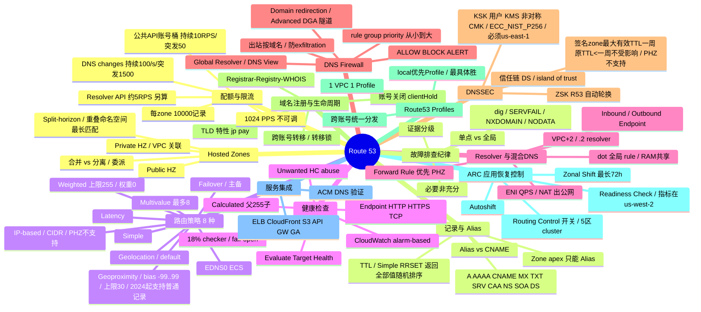

# AWS Route 53 SME - Frameworks & Research Cases

> Knowledge frameworks, canonical facts, case inventories, and failure patterns.

---

# FILE: framework/00-knowledge-framework.md
<!-- SOURCE FILE: framework/00-knowledge-framework.md -->

# Route 53 SME 备考 —— 主知识框架（Master Syllabus / 驱动表）

> **硬数字以 `00b-canonical-facts.md` 为准。** 本总纲、各 topic 正文与题库中的任何硬数字/边界结论若与 `00b-canonical-facts.md` 冲突，一律以 `00b` 为权威单一源。

> **一句话学习目标**：以 15 个真实 case 为锚、以 AWS 官方文档为纲，掌握 Route 53 从公私 Hosted Zone、记录/Alias、8 种路由策略、健康检查、Resolver/混合 DNS、DNS Firewall、DNSSEC、域名生命周期、Profiles、ARC 到配额/限流与故障排查纪律的 SME 级深度与边界结论，能在考试与真实 case 中条件反射地给出正确答案和排查路径。

## 如何用这套材料备考 SME

1. **先读本框架**：看总览 mindmap 建立全局地图，再看「知识域驱动表」了解每个 topic 覆盖什么、绑定哪个真实 case、能做什么实验、对应哪条高频考点。
2. **按驱动表逐 topic 精读**（核心 `01-*.md` ~ `13-*.md`，及扩充的 `00a`、`03b`、`14`~`23`，共 25 个 topic）：每个 topic 文件套用第 4 节的统一模板——概念先行，真实 case 讲故事，动手实验固化，考点/易错点应试，最后一张该域 mermaid 逻辑导图收口。
3. **背边界数字**：内部研究「考点速记」+ 外部「SME 高频考点」两份速记表里的硬限制（1024 PPS、weight 255、18% checker、TTL 强制 1 周……）是高频必考，单独刷。
4. **按第 5 节路线推进**：先打基础域（Hosted Zone / 记录 Alias / 路由策略），再攻高频重灾区（Resolver 优先级 / 健康检查 / DNSSEC），最后补生命周期与治理域。
5. **来源可回溯**：每个 topic 的来源锚点列在驱动表，内部 wiki 需 Midway，外部为 AWS 官方 URL；不确定的边界结论回到锚点核对。

---

## 总览 Mermaid Mindmap



---

## 知识域驱动表（Wave 3 逐 topic 撰写清单）

> 编号 = 最终 topic 文件序号（`NN-<slug>.md`）。核心 01–13 由 inventory 的 A–J 与 external 的 15 节合并而来；后续扩充了 00a（协议底座横切）、03b（路由×HC 交互深度专题）、14–23（技术原理深挖 / 可观测性 / 成本 / 差异诊断 / Traffic Flow / IAM 治理 / Resolver 高级 / Cloud Map / 迁移 / 企业跨区跨账号）。**当前共 25 个 topic 文件**：00a、01–13、03b，及 14–23。
> case ID 取自 `r53-case-inventory.md`；实验主题取自 inventory 第 3b 节 + lab 素材；SME 考点编号 = external `r53-external-research.md` 第 15 节速记编号（A1–F35）。

| 序号 | 知识域名称 | 覆盖的知识点 | 绑定的真实 case（case ID） | 可做的实验（实验主题） | 关联 SME 高频考点编号 | 内部+外部来源锚点 |
|---|---|---|---|---|---|---|
| 01 | Hosted Zones（Public / Private / Split-horizon） | Public vs PHZ；PHZ 需 enableDnsHostnames/Support；VPC 关联、跨账号关联(VpcAssociationAuthorization)；split-view；重叠命名空间最长匹配；PHZ 支持/不支持的路由策略与健康检查；子域 PHZ 合并 vs 分离；apex NS+SOA | 178118102100384（合并 vs 分离，★）、178239640400861（PHZ 只经 VPC DNS）、178782060900806（跨区/跨账号关联、同名 PHZ 冲突） | 子域 PHZ 零停机合并进父域（降 TTL → 建全记录 → 切委派 → 删旧 zone）；`dig @169.254.169.253` 直验 VPC DNS 命中 PHZ | B11, E27（Profile 最具体）, 外部第2节最长匹配 | 内部 §1 + QA-3982；外部 hosted-zone-private-considerations.html / AboutHZWorkingWith.html |
| 02 | 记录类型与 Alias | 支持的记录类型(A/AAAA/CNAME/MX/TXT/SRV/CAA/NS/SOA/DS/CAA…)；Alias vs CNAME 五维差异；CNAME 不能位于 apex（Alias 可以）；Alias 免费/ETH/不能设 TTL；CNAME 不能与他类型共存；Simple RRSET 返回全部值随机排序（8 值上限属 MVA 非 Simple，单 RRset 配额 400 值）；ALIAS 链受支持（末端为合格 AWS 资源仍免费；同 zone 目标通常同类型，zone apex 不能最终指向 CNAME） | 178602594200640（Alias 指向 NLB 场景引出，★配合 topic 05） | 建 apex A-Alias 指向 ELB 并开 Evaluate Target Health，对比同目标 CNAME 的 dig 往返差异 | A1, A2, A3, A4, A5 | 内部 §2 + R53PublicDNS；外部 ResourceRecordTypes.html / resource-record-sets-choosing-alias-non-alias.html |
| 03 | 路由策略（8 种） | Simple/Weighted/Latency/Failover/Geolocation/Geoproximity/Multivalue/IP-based；weight 上限 255、权重 0 行为；geolocation default 兜底、最小区优先；geoproximity bias -99..99（含 0）、2024 起支持普通记录/API/CLI/SDK（仅地图可视化限 Traffic Flow）、上限 30；latency 非实时；multivalue 最多 8；IP-based CIDR 匹配规则、PHZ 不支持；EDNS0/ECS（.2 支持 EDNS0 不支持 ECS）；GeoIP 库(MaxMind 不披露) | 178246722300140（Geolocation/GeoIP/EDNS0，★）、178782060900806（failover 设计） | 加权路由按权重直查权威 NS 并发 ~10K 次统计实际分配比例；用 `dig TXT o-o.myaddr.google.com` 检测 resolver 是否支持 ECS | B6, B7, B8, B9, B10, B11, B12 | 内部 §3 + kyoheibb + TSR53DNSService；外部 routing-policy*.html / routing-policy-edns0.html |
| 04 | 健康检查（Health Check / HaaS） | 三类 HC（Endpoint/Calculated/CloudWatch alarm-based）；18% checker 判定；HTTP 4s+2s、TCP 10s、string match 5120 字节；HTTPS 不校验证书；新 HC 默认健康；calculated 父 255 子；CloudWatch HC 监控数据流非状态；InsufficientDataHealthState 三态；Evaluate Target Health 二选一；fail-open；HC 源 IP prefix list；Unwanted HC abuse 流程 | P460958645（CALCULATED HC 卡 Unhealthy，★）、V2254930641（Unwanted HC abuse，★） | CloudWatch alarm-based HC + `UpdateHealthCheck` 触发重评估观察状态同步；识别 HC User-Agent/prefix list 并演练 abuse outbound 流程（只读理解，禁用需 2PR） | C13, C14, C15, C16, C17, C18, C19 | 内部 §4 + TSR53HealthCheckService + TSOA runbook；外部 health-checks-creating-values.html / dns-failover-determining-health-of-endpoints.html / dns-failover-types.html |
| 05 | Resolver 与混合 DNS（解析优先级） | VPC+2/.2 resolver；Inbound(on-prem→AWS)/Outbound(AWS→on-prem) 方向；conditional forwarding rule；dot(.) 全局 rule；**Forward Rule 优先 PHZ 优先公网**；RAM 跨账号共享 rule；每 endpoint ≤6 ENI、~10K QPS/ENI、经 NLB/SG 降至 ~1.5–1.7K；outbound 出公网需 NAT；多 ENI + NACL 双向放行；VPC DNS 不过 SG/NACL；resolv.conf fallback 到公共 DNS 致 PHZ NXDOMAIN | 178602594200640（Forward Rule > PHZ > 公网，★核心）、178767531400698（多 ENI + NACL，★核心）、178239640400861（resolv.conf fallback）、178782060900806（rule regional 优先 PHZ） | 差分诊断：`nslookup`/`dig` UDP vs TCP(`+tcp`)、SRV 区分出站/入站/路由/目标故障；`kubectl exec` 看 Pod `/etc/resolv.conf` 与 CoreDNS dnsPolicy | D20, D21, D22, D23, D24 | 内部 §5 + QA-385/QA-1466 + Learn108；外部 resolver.html / resolver-availability-scaling.html + re:Post forwarding-rule-and-phz |
| 06 | DNS Firewall / Global Resolver | 出站按域名过滤、防 exfiltration；rule group 关联 VPC、priority 数字从小到大；rule 组内 priority；ALLOW/BLOCK/ALERT（含 domain list 才能 ALLOW，Advanced 只 BLOCK/ALERT）；BLOCK 响应 NXDOMAIN/NODATA/OVERRIDE；Domain redirection 检查整条链；DGA/DNS tunneling 高级检测；与 Network Firewall 区别；Firewall Manager 集中管理；Global Resolver + DNS View + Access Source/Token；OCSF query log；托管列表不公开 | （教学素材，无 Support case） repost_article_dns_firewall / repost_draft_global_resolver_dns_firewall(+lab) / dns_firewall_diagram.drawio | ★完整 lab：建 Global Resolver → DNS View → Access Source → Query Logging → 自定义/托管/DGA 规则 → `dig` 验证 → CloudWatch Logs Insights 查 OCSF `firewall_rule_id`（ALERT 命中 action=Allowed 只能靠日志区分） | E25, E26, 内部 §5 DNS Firewall QA-497(allowlist CNAME 未列被 BLOCK) | 内部 §5 DNS Firewall 段 + inventory §4 架构图；外部 resolver-dns-firewall.html / resolver-dns-firewall-overview.html |
| 07 | DNSSEC | signing 让 resolver 验真；KSK=用户 KMS 非对称 CMK(ECC_NIST_P256)、用户轮换、每 zone ≤2；ZSK=R53 自动 pre-publish 轮换(7–30 天，双 ZSK 并存正常)；信任链需父 zone 支持 DS；island of trust(有 DNSKEY 无父 DS)；禁用需先解信任链、可跳删 DS；签名 zone 记录最大有效 TTL 一周（原 TTL<一周不受影响）；PHZ 不支持；不支持 multi-vendor/vanity NS；负缓存；Resolver DNSSEC validation ≠ signing | 178970323600938（stale delegation SERVFAIL + DNSSEC 禁用/island of trust，★核心） | 启用 DNSSEC signing → 观察 DNSKEY 出现新 ZSK（正常）；按正确顺序禁用（解信任链→删 KSK→删 zone），复现/绕过 island of trust | E28, E29 | 内部 §6 + QA-2638/QA-325/QA-347 + R253；外部 dns-configuring-dnssec.html / resolver-dnssec-validation.html |
| 08 | DNS 安全 / dangling delegation / subdomain takeover | dangling DNS delegation → subdomain takeover；NS hold(StopZoneSniping) 机制与失效排查；Scenario 1–5；删 zone 正确顺序（先删 NS 记录/先解委派）；DNSSEC 作为防护；共享责任；abuse 报告入口 | 178715620200407（subdomain takeover / NS hold，★核心） | 复现 Scenario 1：删 child zone 但不同步删父域委派 → 用他账号"抢注"同名验证 NS hold 是否拦截（受控实验/概念演练） | E28（DNSSEC 防护）, F 排查纪律 | 内部 §1/§12 + inventory 知识域 F；外部 welcome-dns-service.html（委派链） |
| 09 | 域名注册 / TLD 特性 / 生命周期 | Registrar(Amazon Registrar/Gandi)→Registry→WHOIS；R53 Domains 全球/仅 us-east-1/仅商业分区；并非所有 TLD 支持注册（不支持不影响建 zone）；.jp/.pay 特性；账号关闭域名流水线(通知→suspend→~30 天删)、clientHold；跨账号转移须源账号发起、重开自动 unsuspend；转移锁(.jp 2025/10 起不支持)；WHOIS/RDAP 数据策略隐去 | 178238086600080（.jp 到期日机制，★）、178636929200282（账号关闭/clientHold/跨账号转移，★）、178791950000232（不支持的 .pay/LRP/PFR） | 用 `get-contact-reachability-status` 观察 reachability；核对控制台到期日 vs registry WHOIS 到期日的 .jp 月末更新差异（只读核对，非破坏性） | F33 | 内部 §7 + Networking TFC；外部 welcome-domain-registration.html |
| 10 | Route 53 Profiles | 跨账号/多 VPC 统一分发 DNS 配置（RAM，同 Region）；可关联 PHZ/Resolver rules/DNS Firewall rule groups/Interface endpoints/query logging；改 Profile 传播全关联 VPC；**1 VPC 只能 1 Profile**；优先级：local VPC 优先于 Profile，冲突取最具体；>300 VPC-PHZ 关联建议改用；避免与 endpoints 形成 DNS loop | （无独立 Support case，178782060900806 提及作为跨区多 VPC 治理选项） | 建 Profile 关联 PHZ + Resolver rule，跨账号 RAM 共享；构造 local vs Profile 同名冲突验证「最具体胜/local 优先」优先级表 | E27 | 内部 §8 + kyoheibb Profile 段；外部 profiles.html |
| 11 | Application Recovery Controller (ARC) | 2024/08 起独立服务（R53 SME 仍 POC）；Multi-AZ：Zonal Shift/Autoshift 最长 72h、fail-open 不移流量；Multi-Region：Routing Control(开关/5 区 cluster/safety rules)+Readiness Check(每分钟审计)；可配任何支持 HC 的路由策略；指标在 us-west-2；ARC 非必须（failover 记录/手改 simple/固定子域+改 apex Alias 也可切换） | （无独立 Support case，QA-3396/QA-2811 内部先例） | 演练 Zonal Shift 移走某 AZ（设过期时间）；用 routing control 开关做多 Region failover，验证 safety rule 阻止同时关两区 | E30 | 内部 §9 + R253/PeRC + QA-3396/QA-2811；外部 r53recovery routing-control.html / best-practices |
| 12 | 服务集成 + 配额与限流 | Alias 指向 ELB/CloudFront/S3/API GW/GA/VPC endpoint；apex 必 A-Alias；ACM DNS 验证 CNAME；CloudFront resolver identity 间歇 NODATA；**1024 PPS/ENI 不可调**；每 zone 10,000 记录(超收费)；value/record 400；geoproximity 同名同类型仅 30、其他 100；每 PHZ 300 VPC；KSK/zone 2；公共 Route 53 API 账号桶持续 10 RPS/突发 50、DNS changes 持续 100/s/突发 1500、Resolver API 约 5 RPS 另算；配额管理在 us-east-1 | 178602958500732（ip-ranges.json ROUTE53 分类/SNS 变更，★）、178602594200640（Alias→NLB 集成） | 从 ip-ranges.json 用 `jq` 提取 ROUTE53 权威 NS CIDR 并订阅 SNS `AmazonIpSpaceChanged`；用 Interface Analyzer/amzlogs 判断实例是否触顶 1024 PPS | F31, F32, F35, 内部 §11 边界数字 | 内部 §10/§11 + CWR-Route53 + ip-ranges 案例；外部 DNSLimitations.html / route53/pricing |
| 13 | 通用故障排查纪律（横切） | 证据分级(DIRECTLY_OBSERVED/DOCUMENTED_FACT/INFERENCE/UNKNOWN)；单点失败 vs 全局；必要非充分条件；故障签名 SERVFAIL/NXDOMAIN/NODATA/REFUSED；`dig` 用法(+short/+trace/+tcp/CNAME 类型)；标准排查树(whois/NS/HZ/CloudTrail)；内部工具(Info Search Tool/Customer Info Search/Dexter/K2)；LSE 先看 lse.amazon.com | 178222843600312（突然全部解析失败排查树，★）、178970323600938/178767531400698/178239640400861（证据纪律范例） | 对一个真实域构造 SERVFAIL/NXDOMAIN/NODATA 场景并用 dig 逐层定位；练标准排查树（whois→NS→HZ→CloudTrail 逐层收敛） | F 全组 + 各域交叉 | 内部 §12 + TSR53DNSService/TSOA runbook；外部 各故障签名散见于对应域官方页 |
| 00a | DNS 协议基础（横切底座 / RFC 级协议原理） | 迭代 vs 递归解析（stub/recursive/authoritative 三角色，R53=权威非递归）；delegation 与 glue；bailiwick 与 in/out-of-bailiwick glue(RFC 9471)；UDP 截断/TC 位/TCP fallback；EDNS0(RFC 6891)；NXDOMAIN vs NODATA；负缓存与 SOA MINIMUM(RFC 2308)；TTL 语义；DNS 报文头标志(AA/RD/RA/AD/CD，AD≠AA) | （无独立 case/方法论域，为 01/05/07/13/14 的协议底座） | `dig +trace`（看迭代过程）vs `dig @8.8.8.8`（递归结果、AA=0）对比；`dig +tcp`/TC 位/EDNS0 大包；构造 NXDOMAIN vs NODATA 对比 SOA MINIMUM 负缓存 | 外部第2节最长匹配 + F 排查纪律（贯穿 A/D/E 各域协议根） | 外部 RFC 1034/1035/2308/6891/9471；配套 topic 14 权威侧机制底座 |
| 03b | 路由策略 × 健康检查 × Failover 交互（深度专题） | 各路由策略绑 HC 后的完整行为；三层判读框架（是否参与评估→健康判定→策略选取+fail-open）；weighted+HC 含 0-weight 与全挂 fail-open；latency 先延迟后健康；geolocation/IP-based「无匹配」vs「全挂」两条失败路径（唯二不 fail-open）；MVA 全挂返回最多 8 条不健康；simple 不能绑 HC；核心心法「宁可返回可能坏的答案也不返回空」 | 178602594200640、178782060900806（failover 设计交互，承 topic 03/04） | 对每策略构造「全挂」与「无匹配」两场景，dig 验证 fail-open vs no answer；weighted 全不健康观察 0-weight 是否独占兜底 | B6–B12 + C13–C19（03×04 交叉） | 内部 topics/03 + topics/04；exam/codex-review-findings topic 03 第3/4/5/8项、topic 04 全部 |
| 14 | 技术原理深挖（底层机制 / 报文·数据面·信任链） | 递归解析完整路径与 R53 权威定位；权威 anycast/全球 NS 基础设施与四组委派 NS 选择机制；VPC Resolver 数据面架构/EDNS0 client subnet/缓存与负缓存/serve-stale；health checker 全球分布/18% 共识/数据面传播延迟；DNSSEC 验证链密码学；RD/AA/AD 标志层次(AA≠AD)；GetChange=INSYNC 为传播完成权威确认 | （无独立 case，为 01/04/05/07/03b 的机制底座） | `dig +short NS` vs 控制台四条 awsdns 对比；观察冷缓存迭代路径；核对 INSYNC 与下游 TTL 缓存的生效时差 | B/C/D/E 各域机制根 + 外部架构博客 | 外部 route-53-concepts.html + A Case Study in Global Fault Isolation 博客；配套 topic 00a |
| 15 | 可观测性（CloudWatch 指标 + Query Logging + CloudTrail） | 三条独立数据面（指标=趋势/告警、query logging=逐条取证、CloudTrail=谁改配置，不可互替）；Public DNS query logging 只投 CloudWatch Logs+日志组必须 us-east-1+缓存命中不产日志(采样)；Resolver query logging 三目标(CWL/S3/Firehose)+srcids 依路径可变+缓存不产日志；CloudWatch 指标命名空间与「全球服务指标只在 us-east-1」；DNSSECInternalFailure 必设告警；健康检查指标(HealthCheckPercentageHealthy 仅 Endpoint、ChildHealthCheckHealthyCount 仅 Calculated、SSLHandshakeTime 仅 HTTPS) | （无独立 case/方法论域，两方评审标为必补高频盲区） | 建 public/resolver query logging，制造缓存命中验证「缓存不产日志」；CloudWatch Logs Insights 查 ServFail/timeout 率；对 DNSSEC 指标设告警 | 内部 §7/§9/§5/§11 边界 + F 排查纪律 | 外部 Route 53 DG（Public/Resolver query logging、Monitoring hosted zones/health checks/Resolver、CloudTrail）；内部 §5/§7/§9/§11 |
| 16 | 成本 / 计费模型 | 两大收费类（按月固定费 vs 按查询量费）；hosted zone 月费(前25个$0.50，不按天 prorate，12h 宽限但查询照收)；PHZ 查询免费；DNS query 按路由策略分档(standard<latency<geo/geoproximity<IP-based)；NXDOMAIN/类型不匹配也收费；Alias 指向 AWS 资源查询免费(省钱手段)；Traffic policy record $50/月常驻隐形费；Resolver endpoint ENI 小时费；DNS Firewall Advanced/Profiles 小时费；用量类型代码(DNS-Queries/LBR-Queries/Geo-Queries/Cidr-Queries) | 178602958500732（承 topic 12，账单/用量类型） | 从账单区分「新增常驻资源」vs「查询量涨」；核对 Alias→AWS 资源免 query 费；估算 simple 换 geoproximity 单价约+75% | F31/F32/F35 + 内部 §11 边界数字 | 外部 route53/pricing + TLD 价目表 PDF + CloudWatch/KMS/S3 定价；配套 topic 12 |
| 17 | 反例库 / 差异诊断（同症状异根因对照库） | 「症状≠根因」方法论（承 topic 13 纪律落到具体症状）；SERVFAIL 5 根因(DNSSEC/stale 委派/上游超时/限流 conntrack/空 zone)及一句话判别顺序；解析不一致 5 根因(split-view/优先级命中/latency-geo 按 resolver IP/TTL 负缓存/多值加权)；间歇超时根因(多 ENI 某路径阻断/限流/1024 PPS 偷额度/转发目标间歇不响应)；每根因配判别特征+下一步验证命令；同症状可同时多根因(必要非充分) | 178222843600312、178970323600938、178767531400698、178239640400861（各症状范例，承 topic 13） | 按症状类别跑判别流程：`dig +cd`(分 DNSSEC)→`+trace`(分委派)→查 forward rule→查限流指标→核记录；VPC内外双查分 split-view | F 全组 + 各域交叉（差异诊断收口） | 内部 topics/13 纪律 + 各域 case；外部各故障签名对应域页 |
| 18 | Traffic Flow / Policy Record（编排层与可视化） | Traffic Flow 是编排层非第9种策略；三核心对象(traffic policy 免费/version≤1000/policy record=API 里 policy instance $50月费)；可视化编辑器嵌套多策略；geoproximity 地图仅可视化限 Traffic Flow(记录本身2024起可直建)；单向性(只能编排→生成，不能反向导入)；更新/回滚靠版本(UpdateTrafficPolicyInstance 异步需轮询 state+受 TTL 影响)；仅 public HZ、PHZ 不支持；配额(policy 50/账户、record 5/账户默认小需提额) | （无独立 case/方法论域，承 topic 03 路由策略编排） | 可视化建 latency→weighted 嵌套树生成 policy record；新建 version 后选择性更新+回滚验证异步 state；alias 指向 policy record 降本验证 | B 路由策略组 + 内部 §3 Traffic Flow | 外部 traffic-flow.html + DNSLimitations.html + route53/pricing；内部 §3(kyoheibb+TSR53DNSService)；配套 topic 03/16 |
| 19 | IAM / KMS / RAM / SCP 治理（跨账号权限与责任边界） | 权限四件套分层(IAM 主体+记录级/KMS DNSSEC 私钥授权/RAM 跨账号分发/SCP 组织护栏)；hosted zone 支持资源级 ARN，List/Get 逐 action 判断(单 zone 读支持 ARN，账户级枚举 ListHostedZones 必须 Resource:*)；三个记录级条件键(NormalizedRecordNames/RecordTypes/Actions 可「可改不可删」)；KMS key policy 必须授权 dnssec-route53.amazonaws.com(DescribeKey/GetPublicKey/Sign+CreateGrant)；SourceAccount/SourceArn 防 confused deputy；partition 边界(aws/aws-cn/aws-us-gov 不跨)；Profile 专属条件键 | （无独立 case/方法论域，承 topic 07/10/23 治理） | 写「可改 A 记录数据但不能删任何记录」的记录级 IAM 策略；配 DNSSEC KSK 的 KMS key policy + SourceArn；ExternalDNS 拆 ChangeRRSets(zone ARN)+ListHostedZones(*)两 Statement | E27/E28/E29 + 内部治理段 | 外部 Service Authorization Reference(Route53) + DNSSEC key policy 文档；内部 §7/§8/§10；配套 topic 07/10/23 |
| 20 | Resolver 高级能力（delegation / DoH / IPv6-DNS64 / Outposts / HA） | 承 topic 05 只写高级：endpoint 第三方向 INBOUND_DELEGATION(NS 委派+迭代 vs default inbound 转发)；inbound/outbound delegation 把「每子域一条 forward rule」折叠成一条委派(无额外费)；autodefined/system 规则与 `.`(dot) forward rule 交互(内部名默认不转发、SYSTEM 规则反向挖洞)；DoH/DoH-FIPS+SNI；dual-stack/IPv6-only endpoint；DNS64+NAT64；Resolver on Outposts；outbound endpoint HA 与容量规划(≤6 ENI、~10K QPS/ENI) | 178767531400698、178602594200640（承 topic 05 混合 DNS） | 建 INBOUND_DELEGATION 端点+on-prem 父区 NS 委派验证迭代解析；outbound delegation rule 覆盖多子域 vs 逐条 forward rule；SYSTEM 规则让子域就地解析 | D20–D24（承 topic 05） | 外部 CreateResolverEndpoint API + What's New(DoH/IPv6/delegation) + Outposts/scaling DG + hybrid DNS 博客；配套 topic 05/12 |
| 21 | Cloud Map / 服务发现 + ExternalDNS（容器动态命名） | R53 作动态服务发现底座；Cloud Map 三层模型(namespace/service/instance)；三种 namespace(Public DNS 建 public HZ/Private DNS 建 PHZ/HTTP 不建 HZ 只能 DiscoverInstances)；DNS discovery vs API discovery 两条腿(HTTP 只能 API，最易踩坑)；记录类型(A/AAAA/SRV/CNAME 创建后不可改，改类型须删服务重建)；路由策略(MULTIVALUE 最多8健康实例/WEIGHTED 随机等权、alias 场景必用 WEIGHTED)；custom health(UpdateInstanceCustomHealthStatus+30s) vs R53 HC；ECS 服务发现 task 注册注销/Service Connect vs Service Discovery；EKS ExternalDNS(TXT registry/owner-id/domain-filter/IRSA/限流) | （无独立 case/方法论域，承 topic 01/03/04/12） | Cloud Map create-private-dns-namespace→create-service→register-instance 全链；`dig service.namespace` 验 DNS discovery；HTTP namespace 验证只能 DiscoverInstances；EKS ExternalDNS IAM+OIDC+IRSA+Helm | 内部 topic 01/03/04/12 交叉 | 外部 Cloud Map API(DnsConfig/HealthCheckCustomConfig/CreateHttpNamespace)+DG + ECS DG/repost + EKS ExternalDNS repost；配套 topic 01/03/04/12 |
| 22 | DNS 迁移与批量变更剧本 | 注册(registrar)与解析(DNS hosting)是两件独立事(可只迁其一)；迁入编排三路径(手工/zone file 导入/导入后改造)；zone file 导入硬规则(RFC 格式、$GENERATE/$INCLUDE 失败、忽略 SOA+同名 NS、单次≤1000 条、已存在记录整份失败、尾点 FQDN 语义、只能控制台)；ChangeResourceRecordSets 原子性(整批事务、一条失败零落地)、CREATE/DELETE(值须完全一致)/UPSERT(整体替换、幂等首选)；硬上限(1000 ResourceRecord/batch、32000 字符，UPSERT 加倍)；NS 切换四阶段(降 TTL→并行验证→改注册商 NS→监控 INSYNC 非 PENDING)与回滚 | （无独立 case/运维执行域，承 topic 09/02/03/12） | zone file 导入排错(尾点/$GENERATE/幂等)；用 UPSERT 写可重跑批量脚本验证原子性；NS 切换四阶段 dry-run + GetChange 轮询 INSYNC | F 排查纪律 + 内部 §7 生命周期交叉 | 外部 migrate-dns-domain-in-use.html + import zone file/repost + ChangeResourceRecordSets + DNSLimitations.html；配套 topic 09 |
| 23 | 企业级跨区/跨账号 DNS 架构综合选型 | 三层集中式 DNS 要素(PHZ 管谁应答/Resolver 管往哪转/Profile 管怎么批量下发，叠加非替代)；hub-spoke 集中式 Resolver(一套共享 endpoint 服务全组织，TGW/peering+RAM 共享 rule)；跨账号 PHZ 两条路(VpcAssociationAuthorization 逐 PHZ vs Profiles 免授权规模化)；混合云双向条件转发(inbound←on-prem/outbound→on-prem，Forward Rule>PHZ 铁律致「PHZ 加记录不生效」)；多区域 failover(DNS 层负责切、数据面负责通)；所有集中式资源都是 Regional 跨区逐区建；Profiles vs 逐 VPC 关联 vs Resolver rule 三选一判据 | （无独立 case/架构综合域，收口 topic 01/05/10/19 碎片） | 用 Organizations 场景推演 hub-spoke Resolver + Profile 下发；对比逐 PHZ 授权 vs Profile 共享的运维量；构造同名 PHZ+forward rule 验证「PHZ 不生效」根因 | E27（Profile 最具体）+ D 域 + 各治理交叉 | 内部 topic 01/05/10/19 收敛；外部 Profiles/Resolver/RAM 官方页；配套 topic 01/05/10/19 |

---

## 每个 topic 文件的统一模板

> Wave 3 逐 topic 撰写时严格套用以下 5 段结构，产出 `NN-<slug>.md`。每段的写作要求见括注。

```markdown
# NN. <知识域名称>

## 1. 概念（Concept）
- 该域的 SME 级核心概念：定义、组件、工作原理、边界数字。
- 用 external + internal 研究里的权威结论，标来源锚点。
- 边界数字/硬限制单独加粗或列表，便于背记。

## 2. 真实案例说明（Real Case）
- 引用驱动表绑定的 case ID，一句话症状 → 根因 → 知识点落点。
- 讲清"为什么这个概念在真实故障里长这样"，把抽象概念钉到具体故事。
- 多个 case 时先讲 ★核心教学 case，再补充。

## 3. 实验步骤（Hands-on Lab）
- 套用驱动表「可做的实验」主题，写可复现分步命令（含预期输出、清理步骤）。
- 只读/受控/破坏性要标注；禁用/abuse 类只做概念演练，不执行需 2PR 的操作。
- 尽量给 dig/nslookup/jq/aws cli 的确切命令与判读方法。

## 4. SME 考点 / 易错点（Exam Points & Pitfalls）
- 逐条列驱动表「关联 SME 高频考点编号」对应的速记点（A1..F35）。
- 每条写"考点结论 + 常见错误认知"，正误对照。
- 补该域特有的 internal 边界数字速记。

## 5. 该域 Mermaid 逻辑导图（Logic Diagram）
- 一张该域的 mermaid 图（flowchart 表决策/优先级链，或 mindmap 表知识结构）。
- 纯 mermaid 语法，可 git 版本化。
- 例：解析优先级链、健康检查判定流程、DNSSEC 信任链、路由策略选择树。
```

---

## 备考路线（先学哪几个域 / 高频必考）

**第一梯队 —— 基础地基（先学，其它域都依赖）**
- **01 Hosted Zones**、**02 记录与 Alias**、**03 路由策略**。这三域是 Route 53 的骨架，考试占比最大，Alias vs CNAME、8 种路由策略的场景信号词是必考。

**第二梯队 —— 高频重灾区（错误率最高，重点攻）**
- **05 Resolver 与混合 DNS**：`Forward Rule > PHZ > 公网` 优先级、Inbound/Outbound 方向、多 ENI+NACL——真实 case 最集中，考试最爱考优先级链。
- **04 健康检查**：18% checker、HTTPS 不校验证书、Evaluate Target Health 二选一、fail-open——陷阱题密集。
- **07 DNSSEC**：KSK/ZSK 责任划分、TTL 强制 1 周、PHZ 不支持、signing≠validation——细节多易混。
- **06 DNS Firewall**：priority 从小到大、ALLOW 需 domain list、Domain redirection——出站/域名层概念。

**第三梯队 —— 生命周期与治理（补全，考点相对集中）**
- **09 域名注册/TLD/生命周期**、**10 Profiles**、**11 ARC**、**08 DNS 安全/takeover**。

**贯穿全程 —— 速记与纪律**
- **12 配额与限流** 的边界数字（1024 PPS 不可调、每 zone 10000 记录、geoproximity 30、KSK/zone 2、PHZ 300 VPC）+ **13 故障排查纪律**（证据分级、dig 判读、SERVFAIL/NXDOMAIN/NODATA 签名）从第一天起就穿插刷，考试反复出现。

**高频必考清单（务必条件反射）**：Alias 只能建 apex / Alias 免费 + ETH；weight≤255、权重 0 行为；geolocation default、geoproximity bias±99 + 上限 30 + 需 Traffic Flow；multivalue≤8；simple 无 HC；IP-based PHZ 不支持；18% checker；HTTPS 不验证书；Forward Rule 优先 PHZ；重叠命名空间最长匹配；KSK=用户 KMS（非对称 ECC_NIST_P256、必须 us-east-1）/ZSK=R53、DS 在父区且不含完整公钥、签名 zone 记录最大有效 TTL 一周（原 TTL<一周不受影响）；1024 PPS 不可调；公共 API 账号桶持续 10 RPS/突发 50、DNS changes 100/s（突发 1500）、Resolver API 约 5 RPS 另算；GetChange=INSYNC 表示全球已同步；ARC 指标在 us-west-2 / Zonal Shift 72h（Zonal Shift 最长 72h、Autoshift、Readiness Check——详见 topic 11）；R53 全球服务但配额/DNSSEC 管理走 us-east-1。


================================================================================

# FILE: framework/00b-canonical-facts.md
<!-- SOURCE FILE: framework/00b-canonical-facts.md -->

# Route 53 SME —— 硬数字与关键事实单一源（Canonical Facts）

> **本文件是全体系硬数字/边界结论的唯一权威源。** 任何 topic 正文、题库、总纲与本表冲突时，以本表为准；发现冲突就地改齐本表，不要在别处另立数字。
> 采集/复核日期：2026-09-20。每行分级：
> - **[官方现行]** = AWS 官方文档现行结论，可回溯官方 URL；
> - **[内部经验]** = 内部运营/case 经验值，非公开产品契约；
> - **[待验证]** = 需回官方文档或再抽查核对的结论。
>
> 本表已并入 DESIGN-REVIEW（Codex/Claude）与 exam/codex-review-findings.md 三处订正。

---

## 1. 控制面 API 限流（Rate Limiting）

| 事实 | 权威值 | 分级 |
|---|---|---|
| 公共 Route 53 API 账号桶（一般 API 调用） | 持续 **10 RPS**，突发上限 **50** | [官方现行] |
| DNS changes（ChangeResourceRecordSets 等变更类） | 持续 **100 次/秒**，突发上限 **1500** | [官方现行] |
| Route 53 **Resolver** API | 单独计量，约 **5 RPS**（不与上面两桶混用） | [官方现行] |
| 旧文里的「统一 5 RPS」「token bucket 容量 40 补 5/s」 | **已过时/错误**，勿再用 | [官方现行] |

> 说明：超限返回 `Throttling`/`PriorRequestNotComplete`，客户端应指数退避重试。5 RPS 只属 Resolver API，不是公共 Route 53 API 的账号桶。

---

## 2. 健康检查（Health Checks）

| 事实 | 权威值 | 分级 |
|---|---|---|
| Endpoint HC 请求间隔 | 仅 **10s 或 30s**；默认 30s；**创建后不可改** | [官方现行] |
| FailureThreshold（连续失败阈值） | **1–10 次**，默认 **3** | [官方现行] |
| 18% checker 规则 | >**18%** 的全球 checker 判健康才算健康；**仅** Endpoint HC 适用，Calculated/CloudWatch 不适用 | [官方现行] |
| HTTP(S) 响应时间 | **4s** 内建连 + 建连后 **2s** 内收 2xx/3xx | [官方现行] |
| TCP 响应时间 | **10s** 内建连 | [官方现行] |
| 字符串匹配（string match） | 搜索串区分大小写，须完整位于 body 前 **5120 bytes**；状态码后 2s 内收 body | [官方现行] |
| HC 类型 | Endpoint / Calculated / CloudWatch / **Recovery Control（ARC）** 四类（旧「只有三类」已过时） | [官方现行] |
| HTTPS 证书 | HC **不校验证书**；开 SNI 把 FQDN 放进 TLS ClientHello，首次证书名不匹配会重试且省略 SNI | [官方现行] |
| Calculated HC | 按健康子检查数与 HealthThreshold 比较（父上限 255 子检查） | [官方现行] |
| CloudWatch HC | 读 alarm **数据流**而非强制 alarm state；字段 `InsufficientDataHealthStatus`；**不支持跨账号 alarm** | [官方现行] |
| 新建 HC 默认状态 | 视为**健康** | [官方现行] |

---

## 3. 配额（Quotas / Limits）

| 事实 | 权威值 | 分级 |
|---|---|---|
| 每账号 Hosted Zone | 默认 **500**（可提额） | [官方现行] |
| 每 zone 记录数 | **10000**（超出收费，可提额） | [官方现行] |
| 单 RRset 值上限 | **400** 值 | [官方现行] |
| Geoproximity（同名同类型记录数） | 上限 **30**；其他路由策略同名同类型上限 **100** | [官方现行] |
| 每 PHZ 关联 VPC | **300**（超此规模建议改用 Profiles） | [官方现行] |
| 每 zone KSK 数 | 上限 **2** | [官方现行] |
| Resolver Endpoint 每 endpoint ENI | ≤ **6** | [官方现行] |
| 配额管理入口 | 走 **us-east-1**（Route 53 为全球服务，但配额/DNSSEC 管理在 us-east-1） | [官方现行] |
| 「1024 PPS/ENI 不可调」 | 属 EC2 ENI 的 DNS 查询包速率上限，非 Route 53 API 配额；诊断触顶用 Interface Analyzer | [待验证] |

---

## 4. DNSSEC

| 事实 | 权威值 | 分级 |
|---|---|---|
| KSK 密钥 | 用户提供的 **KMS 非对称 CMK**，算法 **ECC_NIST_P256**，**必须位于 us-east-1**；用户轮换；每 zone ≤2 | [官方现行] |
| ZSK | Route 53 自动管理与轮换（pre-publish，双 ZSK 并存正常） | [官方现行] |
| KSK 签名对象 | KSK 签署包含 KSK/ZSK 的**整个 DNSKEY RRset**；ZSK 签署其余 RRset（不是「KSK 签署 ZSK」） | [官方现行] |
| DS 记录 | 是子区 DNSKEY 的**摘要+算法元数据**，位于父区；**不含完整公钥** | [官方现行] |
| 签名 zone 的 TTL | 签名 zone 记录的**最大有效 TTL 为一周**；原 TTL < 一周的记录**不受影响**（不是「TTL 强制一周」） | [官方现行] |
| RRSIG | 对同名同类型的**整个 RRset**签名；inception/expiration 独立于 TTL 控制签名有效期 | [官方现行] |
| DNSSEC 性质 | 只提供**来源认证与完整性**，**不加密**（无机密性）；验证通常由**递归解析器**完成，非权威服务器 | [官方现行] |
| island of trust | 有 DNSKEY 但父区无 DS；禁用顺序=先解信任链（删父区 DS）→删 KSK→删 zone | [官方现行] |
| PHZ | **不支持** DNSSEC signing | [官方现行] |
| NSEC3 | 仅提高区域枚举成本，不保证阻止离线破解 | [官方现行] |

---

## 5. 路由策略（Routing Policies）

| 事实 | 权威值 | 分级 |
|---|---|---|
| Simple | 返回 RRset **全部值**并随机排序；**不是**「最多返回 8 个值」（8 值上限属 Multivalue）；单 RRset 配额 400 | [官方现行] |
| Multivalue | 正常最多返回 **8 条健康**记录；全部不健康时 fail-open 返回最多 8 条不健康记录 | [官方现行] |
| Weighted | 权重上限 **255**；权重 **0** 仅在所有非零权重记录不健康时才考虑，且零权重记录本身仍受 HC 影响（不是自动兜底） | [官方现行] |
| Geoproximity bias | 有效范围 **-99 ~ 99**（含 0）；0=无偏移，正值扩大区域，负值缩小 | [官方现行] |
| Geoproximity 创建方式 | **2024 起**支持普通记录/API/CLI/SDK 创建；**仅地图可视化**仍限 Traffic Flow（不是「必须用 Traffic Flow」） | [官方现行] |
| Latency | 记录须指定一个 AWS Region；**可**指向 AWS 外资源（对外部资源延迟可能不准）；非实时测量 | [官方现行] |
| Failover | Primary 无 HC 视为始终健康，不会切 Secondary；要有效故障转移，Primary 需 HC 或 ETH；Alias Primary 可用 EvaluateTargetHealth | [官方现行] |
| Geolocation | default 兜底、最小区优先 | [官方现行] |
| IP-based 掩码 | 普通条目 IPv4 /1–/24、IPv6 /1–/48；默认位置 * 可表示 /0（::/0）；PHZ 不支持 | [官方现行] |
| EDNS0 / ECS | VPC .2 resolver 支持 EDNS0，不支持 ECS；GeoIP 库 MaxMind（不披露细节） | [内部经验] |

---

## 6. 变更传播（Change Propagation）

| 事实 | 权威值 | 分级 |
|---|---|---|
| ChangeResourceRecordSets 状态机 | 返回后状态 `PENDING` → 全球生效后 `INSYNC` | [官方现行] |
| 确认全球已生效 | 轮询 **GetChange**，状态变为 **INSYNC** 即表示所有 Route 53 权威 DNS 服务器已同步该变更 | [官方现行] |
| 幂等/重试 | 变更是幂等的；并发未完成变更会触发 `PriorRequestNotComplete` | [官方现行] |

---

## 7. ARC（Application Recovery Controller）关键数字

| 事实 | 权威值 | 分级 |
|---|---|---|
| Zonal Shift / Autoshift | 最长 **72h**；fail-open 不移流量 | [官方现行] |
| Routing Control cluster | **5 个区域**数据面端点，≥3/5 quorum（后端复制一致性；客户端只调用一个端点） | [官方现行] |
| 控制平面位置 | 控制平面在 **us-west-2**；ARC 指标在 us-west-2 | [官方现行] |
| Recovery Control HC | 必须**显式创建** RECOVERY_CONTROL health check 并关联 RoutingControlArn（不自动对应） | [官方现行] |

---

## 变更来源对照

- 控制面限流 10/50、DNS changes 100/1500、Resolver 另算：exam/codex-review-findings.md「Topic 12」+ DESIGN-REVIEW（M7 单一事实源缺位）。
- 健康检查 10/30s、阈值 1–10 默 3、18%、4s/2s/10s、5120B：codex-review-findings.md「Topic 04」。
- DNSSEC KMS us-east-1 / 签名最大 TTL 一周：codex-review-findings.md「Topic 07」+「Topic 08」。
- 路由策略 Simple 全部值 / Multivalue≤8 / weight255 权重0 / bias -99..99 / geoproximity 2024：codex-review-findings.md「Topic 03」+「Topic 02」。
- GetChange=INSYNC、配额：00-knowledge-framework.md 驱动表 + 官方 DNSLimitations.html。


================================================================================

# FILE: research/external/r53-external-research.md
<!-- SOURCE FILE: research/external/r53-external-research.md -->

# Route 53 SME 备考 — 外部权威文档研究（AWS 官方 + 业界）

> 来源：AWS Route 53 Developer Guide / API Reference / ARC Developer Guide / re:Post / 业界深度解读。
> 每条附官方 URL。末尾「SME 高频考点与易错点」为应试速记。
> 采集日期：2026-09-20。

---

## 1. DNS 解析路径原理 / Route 53 定位

**Route 53 是什么**：一个 authoritative DNS 服务 + 域名注册商 + 健康检查/流量管理平台。它把域名映射到 IP。
官方递归解析路径（`www.example.com`）：

1. 用户浏览器 → ISP 的 DNS resolver（递归解析器）。
2. Resolver → DNS root name server。
3. Resolver → `.com` TLD name server；TLD 返回 example.com 的 **4 个 Route 53 name server**。
4. Resolver 缓存这 4 个 NS（**典型缓存 2 天**），选一个 Route 53 NS。
5. Route 53 NS 在 hosted zone 里查 `www.example.com` 记录，返回值（如 IP）。
6. Resolver 按记录 **TTL** 缓存该应答，返回浏览器。

- URL: https://docs.aws.amazon.com/Route53/latest/DeveloperGuide/welcome-dns-service.html

**关键角色链**：Registrar（Amazon Registrar 或 associate Gandi）→ Registry（管某 TLD 的公司，如 .com）→ WHOIS。注册域名时 Route 53 自动成为其 DNS 服务、建同名 public hosted zone、分配 4 个 NS 并写回域名。
- URL: https://docs.aws.amazon.com/Route53/latest/DeveloperGuide/welcome-domain-registration.html

---

## 2. Hosted Zones（公有 / 私有）

- **Public hosted zone**：控制 internet 上如何路由域名流量。注册域名时自动创建同名 public zone。
- **Private hosted zone (PHZ)**：与一个或多个 VPC 关联，只在这些 VPC 内经 Route 53 VPC Resolver 解析。使用 PHZ 需 VPC 设 `enableDnsHostnames=true` 且 `enableDnsSupport=true`。
- URL: https://docs.aws.amazon.com/Route53/latest/DeveloperGuide/hosted-zone-private-considerations.html
- URL: https://docs.aws.amazon.com/Route53/latest/DeveloperGuide/AboutHZWorkingWith.html

**PHZ 支持的路由策略**（考点：不是全部）：simple、failover、multivalue answer、weighted、latency、geolocation、geoproximity。**不支持** IP-based。
**PHZ 支持的健康检查**：仅可与 failover、multivalue、weighted、latency、geolocation、geoproximity 记录关联。

**Split-view / split-horizon DNS**：同名建 public + private 两个 hosted zone；VPC 内解析走 PHZ（内部内容），internet 解析走 public zone。
- URL: https://docs.aws.amazon.com/Route53/latest/DeveloperGuide/hosted-zone-private-considerations.html （"Split-view DNS" 段）

**重叠命名空间的解析优先级（most-specific-match / 最长匹配）**：当 public 与 private zone、或多个 PHZ 命名空间重叠（如 `example.com` 与 `accounting.example.com`），VPC Resolver 按**最具体匹配**选中 PHZ；匹配定义 = 完全相同，或 PHZ 名是请求域名的父级（`seattle.accounting.example.com` 命中 `accounting.example.com` 与 `example.com`，取更具体者）。无匹配 PHZ 时转公网递归。
- URL: https://docs.aws.amazon.com/Route53/latest/DeveloperGuide/hosted-zone-private-considerations.html

---

## 3. 记录类型（Record Types）

支持类型：A、AAAA、CAA、CNAME、DS、HTTPS、MX、NAPTR、NS、PTR、SOA、SPF、SRV、SSHFP、SVCB、TLSA、TXT，外加 Route 53 专有的 **Alias**（DNS 扩展，非标准记录类型）。
- URL: https://docs.aws.amazon.com/Route53/latest/DeveloperGuide/ResourceRecordTypes.html

要点：
- **A** = IPv4；**AAAA** = IPv6。
- **CNAME** 与任何其他类型不能同名共存（DNS 规则）；因此 zone apex 不能建 CNAME。
- **CAA** 限制哪些 CA 可为域名签发证书；不能与同名 CNAME 共存。
- **DS**（Delegation Signer）用于 DNSSEC 信任链。
- 域名尾点可选（`www.example.com` 与 `www.example.com.` 等价）。

---

## 4. Alias vs CNAME（SME 高频对比）

Alias 记录是 Route 53 对 DNS 的专有扩展，把查询路由到选定 AWS 资源或同 zone 内另一记录。
- URL: https://docs.aws.amazon.com/Route53/latest/DeveloperGuide/resource-record-sets-choosing-alias-non-alias.html

| 维度 | Alias | CNAME |
|---|---|---|
| 可指向目标 | 仅选定 AWS 资源（CloudFront、S3 静态站点、ELB/ALB/NLB/CLB、API Gateway、VPC 接口端点、Global Accelerator、App Runner、Elastic Beanstalk、OpenSearch、AppSync、**同 zone 同类型的另一记录**） | 任意 DNS 名（可指向非 Route 53 托管域） |
| Zone apex（裸域 example.com） | **可以** | **不可以**（DNS RFC 禁止） |
| TTL | 指向 AWS 资源时**不能设 TTL**，用资源默认 TTL；指向同 zone 记录时用目标记录的 TTL | 可自设 TTL |
| 收费 | Alias 指向 AWS 资源的查询**免费** | 正常按查询计费 |
| 性能 | Route 53 直接回 IP，少一次 DNS 往返 | 需额外一次 DNS lookup 解析别名目标 |
| 目标健康感知 | 可设 **Evaluate Target Health**（自动跟随资源 IP 变化、感知健康） | 无 |
| 记录类型约束 | alias 必须与目标记录同类型；apex 即使 alias 也不支持 CNAME 型 | — |

- 业界佐证（zone apex / 额外 lookup / 性能）：
  - https://jayendrapatil.com/aws-route-53-alias-vs-cname/
  - https://www.repost.aws/questions/QUH6vOhyB6RcCWLbmzRAPLbg/route-53-cname-and-alias-differences
  - https://www.ibm.com/think/topics/alias-vs-cname
  - https://aws.amazon.com/blogs/networking-and-content-delivery/solving-dns-zone-apex-challenges-with-third-party-dns-providers-using-aws/

---

## 5. 路由策略（8 种）

总览 URL: https://docs.aws.amazon.com/Route53/latest/DeveloperGuide/routing-policy.html

1. **Simple** — 单资源单值。不支持关联健康检查（simple 记录）。
   - https://docs.aws.amazon.com/Route53/latest/DeveloperGuide/routing-policy-simple.html
2. **Failover** — active-passive 主备。主健康则回主，主全不健康回备。
   - https://docs.aws.amazon.com/Route53/latest/DeveloperGuide/routing-policy-failover.html
3. **Geolocation** — 按**用户所在地**（查询来源地）路由，可按大洲/国家/美国州；重叠时**最小地理区优先**（Canada 优先于 North America）。可建 **default 记录**兜底无法映射的 IP，否则返回 "no answer"。
   - https://docs.aws.amazon.com/Route53/latest/DeveloperGuide/routing-policy-geo.html
4. **Geoproximity** — 按**资源位置 + 用户位置**路由到最近资源，且可用 **bias** 扩张/收缩某资源的地理吸引范围（**+1..+99 扩大**，**-1..-99 缩小**，正 bias 缩小相邻区）。**需 Traffic Flow**。
   - https://docs.aws.amazon.com/Route53/latest/DeveloperGuide/routing-policy-geoproximity.html
5. **Latency** — 多 Region 部署时路由到延迟最低的 Region。基于 AWS 长期测量的延迟数据（**非实时**），会随网络变化漂移。数据仅覆盖到 AWS 数据中心之间的流量。
   - https://docs.aws.amazon.com/Route53/latest/DeveloperGuide/routing-policy-latency.html
6. **IP-based** — 按客户端源 IP（用你上传的 CIDR-to-endpoint 映射）路由。用 CIDR collection / location / block；查询 CIDR 比集合中更长时按较短的匹配，不匹配回 default `*`。IPv4 掩码 1–24，IPv6 掩码 1–48。**PHZ 不支持**。
   - https://docs.aws.amazon.com/Route53/latest/DeveloperGuide/routing-policy-ipbased.html
7. **Multivalue answer** — 随机返回**最多 8 个**健康记录，可关联健康检查。是"带健康检查的简单负载分散"，非替代 ELB。
   - https://docs.aws.amazon.com/Route53/latest/DeveloperGuide/routing-policy-multivalue.html
8. **Weighted** — 按权重比例分流：某记录流量 = 权重 / 组内权重和。权重 0 = 停止该记录（除非组内全为 0）。
   - https://docs.aws.amazon.com/Route53/latest/DeveloperGuide/routing-policy-weighted.html

**Weighted + 健康检查的 0 权重行为（考点）**：Route 53 先只看非 0 权重记录；仅当所有非 0 权重记录都不健康时，才考虑 0 权重记录。
- https://docs.aws.amazon.com/Route53/latest/DeveloperGuide/routing-policy-weighted.html

**EDNS0 / edns-client-subnet**：geolocation、geoproximity、latency、IP-based 用 EDNS0 拿到用户 IP 的截断前缀来估位。
- https://docs.aws.amazon.com/Route53/latest/DeveloperGuide/routing-policy-edns0.html

---

## 6. 健康检查（Health Checks）

**三种类型**：
1. **Endpoint**（监控 IP/域名+端口，HTTP/HTTPS/TCP，可选 string matching）。
2. **Calculated**（父检查监控多个子检查，1 父可管**最多 255 子**，指定需多少子健康则父健康）。
3. **CloudWatch alarm**（监控 alarm 的**数据流**而非 alarm state；OK→健康，ALARM→不健康，INSUFFICIENT→按配置）。
- URL: https://docs.aws.amazon.com/Route53/latest/DeveloperGuide/health-checks-creating-values.html

**判定机制（考点密集）**：
- 全球多地 health checker，无相互协调；间隔 **10s 或 30s**。
- 聚合规则：**> 18% 的 checker 报健康 → 健康；≤ 18% → 不健康**（18% 防止网络隔离误判）。
- 响应时间阈值：HTTP/HTTPS 需 **4s 内建 TCP 连接** + 连接后 **2s 内**回 2xx/3xx；TCP 检查需 **10s 内**建连；string matching 检查在收到状态码后需再 **2s 内**收到 body，匹配串必须在 body 前 **5,120 字节**内。
- **HTTPS 健康检查不校验证书**（过期/无效证书不会导致失败）。
- 新建健康检查在数据足够前默认视为**健康**（若开启 invert 则默认**不健康**）。
- 不能对 local/private/nonroutable/multicast IP 段建 endpoint 健康检查（建议 EC2 用 EIP 固定 IP）。
- URL: https://docs.aws.amazon.com/Route53/latest/DeveloperGuide/dns-failover-determining-health-of-endpoints.html

**Failover 主备与健康检查绑定（考点）**：
- Active-active：用除 failover 外**任意**路由策略（或组合），所有同名同类型同策略记录都活跃，除非被判不健康。
- Active-passive：用 **failover** 策略，Primary/Secondary。
- **绑定方式二选一**：指向可建 alias 的 AWS 资源时，**别建独立健康检查**，而是把 alias 记录的 **Evaluate Target Health 设 Yes**；指向不能建 alias 的资源时，才关联独立健康检查。
- 多资源主/备记录：只要至少一个关联资源健康，该 failover 记录即视为健康。
- URL: https://docs.aws.amazon.com/Route53/latest/DeveloperGuide/dns-failover-types.html
- 记录选择逻辑：https://docs.aws.amazon.com/Route53/latest/DeveloperGuide/health-checks-how-route-53-chooses-records.html

---

## 7. Route 53 VPC Resolver（.2 / VPC+2 架构）

- VPC Resolver 对 VPC 内资源递归应答 public 记录、VPC 专有 DNS 名、PHZ 记录，**默认在所有 VPC 可用**。
- 接入地址：**VPC+2**（VPC CIDR 基地址 +2，即经典的 ".2 resolver"），连到某 AZ 内的 Resolver。（旧称 Route 53 Resolver，因引入 Global Resolver 而更名 VPC Resolver。）
- **Inbound endpoint**：允许**从**本地/其他 VPC 向本 VPC 发 DNS 查询（on-prem → AWS 解析）。
- **Outbound endpoint**：允许**从**本 VPC 向本地/其他 VPC 发查询（AWS → on-prem 解析）。
- **Resolver rule（conditional forwarding rule）**：每域名一条转发规则，指定把该域名的查询转发到哪；直接作用于 VPC，**可跨账号共享（RAM）**。
- 混合云（VPN / Direct Connect）DNS：outbound endpoint 转发到 on-prem resolver；on-prem 转发到 inbound endpoint 解析 AWS 名。
- URL: https://docs.aws.amazon.com/Route53/latest/DeveloperGuide/resolver.html
- 可用性与扩展：https://docs.aws.amazon.com/Route53/latest/DeveloperGuide/resolver-availability-scaling.html

**PHZ vs Resolver forwarding rule 解析优先级（重要考点）**：对同一域名，**Resolver 转发规则优先于 PHZ**（forwarding rule takes priority over the private hosted zone）。
- re:Post 佐证: https://www.repost.aws/questions/QUptcBFQJeQlmWcaB2URmeZA/dns-resolution-with-forwarding-rule-and-phz
- 业界整理: https://dev.classmethod.jp/articles/private-hosted-zone-with-resolver-rule/

---

## 8. DNS Firewall（出站 DNS 过滤）

- 过滤 VPC **出站** DNS 查询（经 VPC Resolver），主用于防 **DNS 数据渗漏（exfiltration）**；也能拦 PHZ / VPC 端点名 / EC2 实例名的解析。是 VPC Resolver 的特性，无需额外部署。
- **只按域名过滤**，不解析成 IP，也不过滤 HTTPS/SSH/TLS/FTP 等应用层协议。
- 组件：rule group（可复用规则集，关联到 VPC）、rule、domain list（自建或 AWS 托管列表）、DNS Firewall Advanced（防 DNS tunneling / DGA）。
- **动作**：含 domain list 的规则可 ALLOW / BLOCK / ALERT；不含 domain list 的（Advanced）只能 BLOCK / ALERT。可自定义 BLOCK 响应。
- **Domain redirection 设置**：默认检查整条重定向链（CNAME/DNAME…），链上后续域名须显式加入 domain list 并设动作；trust 行为仅在单次查询事务内有效。
- **与 Network Firewall 区别**：DNS Firewall 只看经 VPC Resolver 的出站 DNS 查询；Network Firewall 过滤网络/应用层但看不到 Resolver 发起的查询。
- 可用 **AWS Firewall Manager** 跨组织集中管理 DNS Firewall rule group 关联。
- URL: https://docs.aws.amazon.com/Route53/latest/DeveloperGuide/resolver-dns-firewall.html
- URL: https://docs.aws.amazon.com/Route53/latest/DeveloperGuide/resolver-dns-firewall-overview.html

**处理顺序（考点）**：
- 一个 VPC 关联多个 rule group 时，按**关联的 priority 数字从小到大**处理（lowest numeric priority first）。
- rule group 内每条 rule 有组内唯一 priority，也是**从小到大**处理。
- Firewall Manager 管的关联占据最低（first）与最高（last）优先级位置。
- URL: https://docs.aws.amazon.com/Route53/latest/DeveloperGuide/resolver-dns-firewall-overview.html

---

## 9. DNSSEC signing

- DNSSEC signing 让 resolver 验证应答确来自 Route 53 且未被篡改，用公钥密码对每个应答签名。
- 两类密钥：**KSK（key-signing key）** 基于你自有的 **AWS KMS 非对称 customer managed key**，你负责管理/轮换；**ZSK（zone-signing key）** 由 Route 53 管理。
- 启用 DNSSEC signing 后 hosted zone **TTL 上限强制为 1 周**（设更长不报错但仍按 1 周执行）。
- **不支持 multi-vendor / vanity name server** 配置（须单一 DNS 提供商）。
- 父 zone 的 DNS 提供商必须支持 **DS 记录**，否则子 zone 启 DNSSEC 会变不可解析。
- 强烈建议对 `DNSSECInternalFailure` / `DNSSECKeySigningKeysNeedingAction` 设 CloudWatch 告警，快速处理否则可能整 zone 宕。
- 每 hosted zone **最多 2 个 KSK**。
- URL: https://docs.aws.amazon.com/Route53/latest/DeveloperGuide/dns-configuring-dnssec.html
- Resolver 侧 **DNSSEC validation**（验证，不同于 signing）：https://docs.aws.amazon.com/Route53/latest/DeveloperGuide/resolver-dnssec-validation.html

---

## 10. Route 53 Profiles

- 跨多 VPC / 多账号统一管理 Route 53 DNS 配置；改 Profile 会传播到所有关联 VPC；可用 RAM 在同 Region 跨账号共享。
- 可关联资源：PHZ、Resolver rules（转发 + system）、DNS Firewall rule groups、Interface VPC endpoints、VPC Resolver query logging 配置。
- Profile 上直接管理的配置：反向 DNS lookup（Resolver rules）、DNS Firewall failure mode、DNSSEC validation。
- **一个 VPC 只能关联一个 Profile**；>300 个 VPC-PHZ 关联建议改用 Profiles。
- URL: https://docs.aws.amazon.com/Route53/latest/DeveloperGuide/profiles.html

**Profile 优先级（考点）**：local VPC 设置 优先于 Profile 设置；域名冲突时**最具体（most specific）者胜**。

| DNS query | Profile rule | VPC (local) rule | 生效 |
|---|---|---|---|
| example.com | example.com | example.com | **Local VPC** |
| test.example.com | test.example.com | example.com | **Profile**（更具体） |
| marketing.example.com | 无 | marketing.example.com | **Local VPC** |

- URL: https://docs.aws.amazon.com/Route53/latest/DeveloperGuide/profiles.html

---

## 11. ARC Routing Controls（Application Recovery Controller）

- Routing control 是简单的**开/关开关**，用于在多 Region 副本间切换客户端流量做 failover。
- 通过 **routing control health check**（与 Route 53 DNS failover 记录关联）实现流量重路由。
- 组件：cluster（**5 个 Region 的数据面**，高可用）、control panel、routing control、routing control health check。
- **Safety rules** 防止误操作导致意外恢复副作用（如避免同时把两个 Region 都关掉）。
- 推荐用 **AWS CLI / API**（而非控制台）切换状态，可批量。
- 与普通 Route 53 endpoint 健康检查区别：ARC routing control 是**人为决策的开关**（灾备演练/主动切换），不是被动探测端点健康。
- URL: https://docs.aws.amazon.com/r53recovery/latest/dg/routing-control.html
- 最佳实践: https://docs.aws.amazon.com/r53recovery/latest/dg/route53-arc-best-practices.regional.html

---

## 12. 服务配额（Quotas）

- URL: https://docs.aws.amazon.com/Route53/latest/DeveloperGuide/DNSLimitations.html
- 查看/提额须在 **US East (N. Virginia)** Region（Route 53 是全球服务但配额管理在 us-east-1）；Resolver 配额在对应 Region。

| 实体 | 配额 |
|---|---|
| Domains / 账号 | 20（2021-03 后新客户；老账号可能仍 50） |
| Hosted zones / 账号 | 初始 500（可提额） |
| 同一 reusable delegation set 可用的 hosted zone | 100 |
| 一个 PHZ 可关联的 VPC | 300（更多用 Profiles） |
| Records / hosted zone | 10,000（超出可提额，但**额外收费**） |
| Values / record set | 400 |
| 同名同类型的 geolocation/latency/multivalue/weighted/IP-based 记录 | 100 |
| 同名同类型的 **geoproximity** 记录 | **30** |
| KSK / hosted zone | 2 |
| CIDR collections / 账号 | 5 |
| CIDR blocks / collection | 1000 |
| 跨账号 VPC 关联 authorization | 1000 |

- API 侧可用 `GetAccountLimit` / `GetHostedZoneLimit` / `GetReusableDelegationSetLimit` 查当前配额。

---

## 13. 定价模型要点

- 官方定价页: https://aws.amazon.com/route53/pricing/
- **Hosted zone**：每个 hosted zone 每月按个数收费（前若干个一价，超出更低单价）；同一 zone 12 小时内删除不重复收费。
- **查询（queries）**：按百万次计费，standard / latency-based / geo / geoproximity 分档；**Alias 记录指向 AWS 资源（ELB、CloudFront、S3 站点、API Gateway 等）的查询免费**。
- **Health checks**：AWS endpoint 检查基础价；**非 AWS endpoint、HTTPS、string matching、快速间隔(10s)、延迟测量**等为附加费。
- **Traffic Flow**：按 policy record 每月计费。
- **Resolver endpoint**：按每个 ENI（endpoint IP）每小时计费 + 查询量计费。
- **DNS Firewall**：按 rule group 关联的查询量 + Advanced 规则计费。
- **Domain registration**：按 TLD 年费（转入/续费另计）。
- **DNSSEC**：signing 本身不额外收费，但 KMS KSK 与查询正常计费。
- 备考层面记结构即可（细价随时间变），SME 常考「哪些免费/哪些附加费」而非具体数字。

---

## 14. 业界深度解读（补充视角）

- Route 53 全景架构（routing policies / Resolver / PHZ / hybrid DNS，指出"只会建 A 记录"的心智模型在第二个 Region / 私网 / 第二账号出现时就崩）：
  https://hidekazu-konishi.com/entry/amazon_route_53_dns_architecture_guide.html
- SAA-C03 路由策略与"场景信号词→策略"速查：
  https://sailor.sh/blog/aws-route-53-routing-policies-saa-c03/
- Latency vs Geoproximity vs Geolocation 机制级对比（三者都涉地理但原理不同，混用会导致次优路由）：
  https://www.examcollection.com/blog/comparing-latency-geoproximity-and-geolocation-routing-methods/
- 路由策略完整指南：https://www.bitslovers.com/aws-route53-routing-policies/
- Alias vs CNAME 实务：https://oneuptime.com/blog/post/2026-02-12-route-53-alias-records-vs-cname/view

---

## 15. SME 高频考点与易错点（速记）

### A. Alias vs CNAME
1. **只有 Alias 能建在 zone apex（裸域）**；CNAME 永远不能（DNS RFC）。
2. Alias 指向 AWS 资源**不能设 TTL**（用资源默认）；指向同 zone 记录用目标记录 TTL。
3. Alias 指向 AWS 资源的**查询免费**；CNAME 正常计费且多一次 DNS 往返。
4. Alias 目标限选定 AWS 资源或**同 zone 同类型**记录；CNAME 可指任意 DNS 名（含外部）。
5. Alias 有 **Evaluate Target Health**；CNAME 无。

### B. 路由策略对比 / 边界
6. **Weighted vs Latency**：weighted 按你设的比例分（负载/灰度）；latency 按 AWS 测得的网络延迟（多 Region 性能）。latency 数据非实时、会漂移、只覆盖到 AWS 数据中心。
7. **Geolocation vs Geoproximity**：geolocation 只看**用户位置**、按大洲/国家/州、重叠取最小区、可设 default 兜底；geoproximity 看**资源+用户位置**、可用 **bias(±1..±99)** 移动边界、**需 Traffic Flow**、同名同类型上限仅 **30**。
8. **Geolocation 无 default 记录** → 未映射/未覆盖来源返回 "no answer"（易错：以为会随便返回一个）。
9. **Multivalue answer** 最多返回 **8** 个健康记录、带健康检查，但**不是 ELB 替代**（无真正负载均衡/会话）。
10. **Simple 路由不能关联健康检查**（simple 记录）。
11. **IP-based routing 在 PHZ 不支持**；PHZ 只支持 simple/failover/multivalue/weighted/latency/geolocation/geoproximity。
12. **Weighted 权重 0**：仅当所有非 0 权重记录都不健康时才启用 0 权重记录；单条设 0 = 停流量。

### C. Failover 与健康检查
13. **Active-passive = failover 策略**；**active-active = 除 failover 外任意策略**。
14. 指向可建 alias 的 AWS 资源做 failover 时，用 **Evaluate Target Health=Yes**，**不要**再单独建健康检查（易错点）。
15. **>18% checker 报健康才算健康**（≤18% 判不健康）。
16. HTTP/HTTPS：4s 建连 + 2s 回 2xx/3xx；TCP：10s 建连；string match 串须落在 body 前 **5120 字节**。
17. **HTTPS 健康检查不校验证书**（证书过期/无效不导致失败）——常见陷阱题。
18. **Calculated 健康检查**：1 父最多 255 子；**CloudWatch alarm 健康检查监控 alarm 的数据流**而非直接 alarm 状态；新检查在数据足够前默认健康（除非 invert）。
19. 不能对 private/nonroutable/multicast IP 建 endpoint 健康检查。

### D. Resolver / 混合 DNS / 优先级
20. **VPC+2（.2 resolver）** 是 VPC 内解析入口，默认所有 VPC 可用。
21. **Inbound endpoint = on-prem→AWS 查询**；**Outbound endpoint = AWS→on-prem 查询**（方向易混）。
22. **Resolver 转发规则优先于 PHZ**（同域名冲突时 forwarding rule 胜）。
23. **重叠命名空间取最长/最具体匹配**（`accounting.example.com` 胜过 `example.com`）。
24. Resolver rule **可经 RAM 跨账号共享**。

### E. DNS Firewall / Profiles / DNSSEC / ARC
25. **DNS Firewall 只管出站、只按域名、防 exfiltration**；rule group 与 rule 都按 **priority 数字从小到大** 处理；含 domain list 的规则才能 ALLOW，Advanced 只能 BLOCK/ALERT。
26. **DNS Firewall（域名层）vs Network Firewall（网络/应用层）**：后者看不到 Resolver 发起的 DNS 查询。
27. **Profile 优先级**：local VPC 设置优先于 Profile；冲突取最具体；**1 VPC 只能 1 Profile**。
28. **DNSSEC signing**：KSK=你的 KMS 非对称 CMK（你轮换），ZSK=Route 53 管；**启用后 TTL 强制 1 周**；不支持 multi-vendor / vanity NS；父 zone 提供商须支持 **DS 记录**；每 zone 最多 2 KSK。
29. **DNSSEC validation（Resolver）≠ signing（authoritative）**——两个不同特性别混。
30. **ARC routing control = 人为开/关开关**做多 Region failover（cluster 跨 5 Region），配 safety rules 防误切；不同于被动端点健康检查。

### F. 平台/配额/计费
31. Route 53 是**全球服务**，配额查看/提额、DNSSEC 等管理操作走 **us-east-1**。
32. **每 hosted zone 10,000 记录**（超出收费）；**geoproximity 同名同类型仅 30**（其他分散型策略 100）；**每 PHZ 关联 300 VPC**（更多用 Profiles）。
33. 注册链：**Registrar（Amazon Registrar / Gandi）→ Registry → WHOIS**；注册即自动建 public zone + 分配 4 NS。
34. Resolver 缓存 example.com 的 NS **典型 2 天**；应答缓存按记录 **TTL**。
35. **Alias→AWS 资源查询免费**、非 AWS endpoint / HTTPS / string-match / 10s 快检 / 延迟测量健康检查 **附加费**。


================================================================================

# FILE: research/internal/notebooklm-equivalent-tools.md
<!-- SOURCE FILE: research/internal/notebooklm-equivalent-tools.md -->

# 用户 #7 专项 —— Amazon 内部 NotebookLM 同类工具 / 文档转导图工具调研

> 目的：确定本项目（Route 53 SME 备考）用什么方式从 markdown / 架构描述自动生成"架构逻辑导图（mind map / knowledge graph / auto-diagram）"。
> 检索工具：InternalSearch（ALL / WIKI / BROADCAST 域）。检索日期：2026-09-20。
> 结论先行：**内部有对标 NotebookLM 的工具（Oracle Studio），并且能直接把文档生成 mind map。但"用 API 从 markdown 生成导图"这条路，推荐用内部 Mermaid（文本即导图，可脚本化/版本化），Oracle Studio 作为"一键把整份文档转成可视化 mind map"的补充。**

---

## 一、有没有类似 NotebookLM 的内部工具？—— 有，主力是 Oracle Studio

### 1. Oracle Studio ⭐（首选，Amazon 官方对标 NotebookLM，RED Certified）

- **定位**：Amazon 内部的 NotebookLM 替代品，RED-Certified（可处理关键/机密内部数据，数据不出 Amazon 基础设施）。数千 Amazonian 使用中（2024 底至今）。
- **能生成什么**：把文档（BRD / PRFAQ / 设计文档 / runbook / wiki / spec）转成 **podcast、PowerPoint、infographic、90 秒动画摘要、web app、以及 mind map（思维导图）**。还有 **Study Mode + 3D 可视化**。
- **能否从 markdown/架构描述生成导图**：**能**。官方用例明确写着"**Create interactive mind maps from complex architecture documents**"（从复杂架构文档创建交互式思维导图）、"MindMap visualization — creates structural overviews from wikis and spec documents"。上传/粘贴文档 → 选 mind map 输出即可。
- **入口 / 访问方式**：
  - 通过 **Harmony console** 访问，除 Midway 认证外无需额外 setup。
  - 当前为**申请制**（sign-up sheet / Quip 表单，一分钟注册，早期访问约 4 周，团队在放开长期访问）。
  - Sign-up 入口（从工具目录链出）：TPM AI Builders 页的 "ORACLE-STUDIO-sign-up-sheet"、AI Tools for TPMs 页的 "Oracle Studio [Sign up]"。
  - 支持渠道：Slack **#oracle-studio-support**。
- **是否有可编程 API 从 markdown 生成导图**：**未发现公开的可编程 API**。Oracle Studio 是 web/console 交互式工具（上传文档→选输出格式），目前没有检索到"用 API / CLI 从 markdown 批量生成 mind map"的接口文档。若本项目需要**可脚本化、可版本控制**地生成导图，Oracle Studio 不是理想路径（见第二节 Mermaid）。
- **来源**：
  - All Things AI 2026-02-03（Oracle Studio 专题，列全部输出格式含 MindMap）：https://w.amazon.com/bin/view/AllThingsAI/2026_02_03/
  - FBABlackbird AI Tips 2026-05-06（"Oracle Studio — Amazon's NotebookLM Alternative"，用例含 "Create interactive mind maps from complex architecture documents"，Harmony console 入口）：https://w.amazon.com/bin/view/FBABlackbird/AI/Tips/
  - TPM AI Builders（Oracle Studio 条目 + sign-up sheet 链接）：https://w.amazon.com/bin/view/Tpm-ai-builders/
  - AI Tools for PMs/TPMs/SDMs（工具目录，Knowledge Management 段列 Oracle Studio [Sign up]）：https://w.amazon.com/bin/view/DavidWu/AI-Tools-for-TPMs/
  - Broadcast 演示视频："[AI for All] Document/JIRA Intelligence & Visualization Suite with AI Studio Oracle"（2025-10-10，演示 mind map / PPT / infographic / podcast 生成，作者 Sasha）：https://broadcast.amazon.com/videos/1715924

### 2. LocalNotebookLM（内部自建，可本地/团队部署，路线图含 mind map）

- **定位**：某开发者用内部 AWS 服务自建的 NotebookLM 风格工具。技术栈：**Vectra 向量库 + Titan embeddings + Bedrock LLM + Amazon Polly（音频）**。
- **能力**：文档上传（多格式）、相似度检索、对话式问答、音频摘要（Polly）。**mind maps / quizzes / flashcards 在路线图上（计划中，未必已 GA）**。
- **入口**：内部包 **LocalNotebookLM**（可内部部署）。Kiro PM 已表示兴趣讨论集成。
- **是否有 API 生成导图**：本质是可自建/可改代码的包，理论上可编程，但 mind map 功能"计划中"，当前不成熟。适合想自己控管数据/流程的团队，不适合"开箱即用生成导图"。
- **来源**：All Things AI 2026-01-16（"Amazon Teams Build LocalNotebookLM"）：https://w.amazon.com/bin/view/AllThingsAI/2026_01_16/

### 3. MindCraft（GraphRAG，知识图谱方向）

- **定位**：把 tribal knowledge 做成 **GraphRAG（知识图谱 + RAG）**。宣称 1.6x 生产力、2.6x 更快 CR 审批。
- **与本项目相关性**：偏"知识图谱检索/问答"，不是"从一份文档一键出 mind map 图片"。如果目标是构建 Route 53 知识**图谱**（概念间关系网络）而非流程/思维导图，MindCraft 值得看。
- **入口**：有 UI + Wiki。来源：AI Tools for TPMs 页（Knowledge Management 段）https://w.amazon.com/bin/view/DavidWu/AI-Tools-for-TPMs/

---

## 二、从 markdown / 架构描述"用 API/文本"生成导图 —— 首选内部 Mermaid

### 4. Mermaid（内部版）⭐（最适合"markdown/文本→导图、可版本化"的路线）

- **定位**：文本即图（diagram-as-code）。Mermaid 支持 **mindmap、flowchart、sequence、class、state** 等图类型。任意 LLM（Kiro / Cedric / Q）都能"给我一个这些内容的 mind map，用 mermaid"直接产出 mermaid 代码。
- **内部可用性**：**有内部版 Mermaid**（外部 mermaid.live 非内部；内部有等价渲染服务）。内部 GenAI 分享会明确演示：让 AI 生成 mermaid mind map 代码 → 粘到（内部）Mermaid 渲染即可。
- **能否 API/脚本从 markdown 生成导图**：**能，且这正是它的强项**。mermaid 是纯文本，天然可版本控制（进 git）、可脚本批量渲染、可嵌进 wiki/文档。对本项目"架构逻辑导图 + 要能随知识更新迭代/纳入版本管理"的诉求最契合。
- **相关内部工具**：**AI Draw.io**（AI 驱动的 draw.io 画图，AI Tools for TPMs 页 "Diagramming" 段）也可作为架构图路线，但不是纯文本可版本化。
- **来源**：
  - Broadcast "MMSRO GenAI Knowledge Sharing Series - Existing GenAI tools and how to use them"（演示"give me a good mind map for these ideas in mermaid" → 内部 Mermaid 渲染）：https://broadcast.amazon.com/videos/1525359
  - AI Tools for TPMs（Diagramming 段：Marp / AI Draw.io / Venue / Nova Image Gen）：https://w.amazon.com/bin/view/DavidWu/AI-Tools-for-TPMs/

### 5. DAG — Diagram Architecture Generator（架构图，非思维导图）

- **定位**：Tampermonkey 用户脚本，把 **AWS support case 文本**自动分析成**架构图**（识别 AWS 服务及其关系，10 秒内出图，官方 AWS 图标）。作者 danajid。
- **与本项目相关性**：面向"case 文本→AWS 架构拓扑图"，**不是知识/逻辑思维导图**。若本项目要画的是"Route 53 各组件如何连接"的架构拓扑（如 Resolver endpoint / PHZ / VPC 关系），DAG 思路可参考；但它绑定 support case 场景，不通用于任意 markdown。
- **来源**：https://w.amazon.com/bin/view/Users/danajid/DAG-DiagramArchitectureGenerator/

---

## 三、配套方法：把散乱文档做成"知识库/关系图"的 prompt recipe

### 6. "Build a Complete Knowledge Base"（可复用 prompt recipe，非工具）

- 一个可交给任意 agent（NotebookLM / Kiro / 任意 LLM）的六步 prompt：读全量 → 分类 → **连接知识（建立概念/流程/框架间的显式关系图 relationship graph）** → 设计检索索引 → 找 gap → 汇总产出（map + 文件树 + roadmap）。
- 与本项目相关性：**这正是"生成知识逻辑导图/关系图"的方法论骨架**——先让 agent 建"relationship graph"，再用 Mermaid mindmap/graph 渲染出来，能版本化。
- 来源：https://w.amazon.com/bin/view/Users/trhieung/Kiro_Knowledge_base/

---

## 四、结论与推荐（针对本项目"架构逻辑导图"）

**内部有没有 NotebookLM 同类工具？—— 有。** 主力是 **Oracle Studio**（RED-Certified，能一键把架构文档转 interactive mind map），备选 LocalNotebookLM（自建/可改）、MindCraft（GraphRAG 知识图谱）。

**用哪个生成本项目的导图？分两种诉求：**

1. **要"可版本控制、可随 SME 知识迭代、能进 git/wiki、可脚本生成"的架构逻辑导图** → **首选内部 Mermaid（mindmap/flowchart/graph）**。理由：纯文本、天然版本化、任意 LLM 直接产出 mermaid、内部有渲染。完全契合本项目把产物纳入 route53-sme-versions 版本仓的做法。可先用 "Build a Knowledge Base" recipe 让 agent 输出概念关系，再转 mermaid mindmap。

2. **要"漂亮的交互式 mind map / 一键把整份文档可视化 / 顺带出 PPT/infographic/podcast 复习材料"** → **用 Oracle Studio**（Harmony console，申请制，#oracle-studio-support）。缺点：交互式 web 工具，**未发现可编程 API**，不利于版本化/脚本化，产物难以纳入本地版本仓。

**给本项目的落地建议**：
- **导图产物本体用 Mermaid**（写进 `.md`/`.mmd`，进 route53-sme-versions 快照仓，可随知识更新 diff/版本化）。
- 需要给自己做**沉浸式复习**（podcast/PPT/交互 mind map）时，把 r53-internal-research.md 丢进 **Oracle Studio** 生成一次性复习材料。
- 若后续要做"Route 53 概念**知识图谱**（概念间关系网络）"，评估 **MindCraft (GraphRAG)**。

**关于外部 NotebookLM 本身**：Google NotebookLM 也支持 mind map 输出，且 Canvas 特性在扩展交互可视化；但**Amazon 内部数据不应上传到外部 NotebookLM**（数据合规），这正是 Oracle Studio（RED-Certified）存在的原因。故本项目涉及内部资料时**不要用外部 NotebookLM**。
- 参考（外部 NotebookLM 特性动态）：https://w.amazon.com/bin/view/Users/vencedua/News/tldr-ai/articles/2026-06-02/3-upcoming-notebooklm-features/


================================================================================

# FILE: research/internal/r53-case-inventory.md
<!-- SOURCE FILE: research/internal/r53-case-inventory.md -->

# Route 53 SME 备考 — 真实案例清单与主题聚类

> 来源目录：`/Users/leichenz/Case/r53`（只读摄取，未修改任何源文件）
> 生成时间：2026-09-20
> 案例总数：15 个真实案例（含 Support Case 与内部 HaaS TT）+ 3 份 DNS Firewall 教学素材
> 用途：Route 53 SME 备考的真实案例库与知识域索引

本清单基于每个 case 的 `_analysis.md` / `_investigation.md` / `_full_investigation.md` 一手读取。case ID 末位仅取 analysis 主文件，reply/state 为同一 case 的衍生文档，不单列。

---

## 1. 逐 Case 一行摘要表

| Case ID | 问题域 | 客户症状（一句话） | 根因（一句话） | R53 知识点标签 |
|---|---|---|---|---|
| 178970323600938 | DNS解析 / Hosted Zone / DNSSEC | EC2 上 `dig` 某公网域持续 SERVFAIL，同时想禁用 DNSSEC 遇两处报错 | 解析路径事发时取到旧 NS 委派组、旧 NS 已不托管该 zone 返 REFUSED → SERVFAIL（旧 NS 来源层未唯一确定）；DNSSEC 侧为 island of trust | stale delegation, NS 委派变更, SERVFAIL, DNSSEC disable, island of trust, KMS KSK, 负缓存 |
| 178791950000232 | 域名注册 | 客户想注册 `.pay` 域名，问 AWS 能否走注册局公开 LRP 之外的路径预留/注册 | Route 53 当前不支持 `.pay`；注册局只发布一条 LRP 路径，无面向终端注册人的预留/例外流程 | 不支持的 TLD, LRP, registrar vs registry, Salesforce PFR/TLD feature request, TAM advocacy |
| 178782060900806 | 路由策略 / Resolver / PrivateLink | 大客户 split-horizon + PrivateLink 多区 DR，问关闭爱尔兰路径时如何 failover | 现设计把 DNS 解析和 PrivateLink 数据路径都绑死在爱尔兰 Egress VPC；Resolver rule 优先于同名 PHZ；单 failover pair 无法同时表达两个故障维度（非缺陷） | Resolver rule regional, rule 优先 PHZ, PHZ 跨区关联, 私网 failover 健康检查, 跨区 PrivateLink, Route 53 Profiles, DNS 与连通性解耦 |
| 178767531400698 | Resolver / VPC Networking | Linux EC2 无法加入 AD 域，`nslookup` 对 VPC DNS 三次全超时 | Outbound Resolver Endpoint 的 ENI2 子网 NACL 出站命中 DENY 10.0.0.0/8、入站缺 UDP ephemeral 放行；三次全超时提示 ENI1 路径亦可能有问题（NACL 修复是必要非充分） | Outbound Resolver Endpoint, 多 ENI 行为, NACL DNS 放行, VPC DNS 不过 SG/NACL, AmazonProvidedDNS=CIDR+2, 差分诊断 |
| 178715620200407 | Hosted Zone / DNS安全 | 外部研究员报告子域可被 subdomain takeover（dangling delegation） | child zone 曾存在被删、父域委派未同步删（Scenario 1）；接管时点该组 NS 的 hold 为何不在效需服务团队查后端 | dangling DNS delegation, subdomain takeover, StopZoneSniping/NS hold, 删 zone 顺序（先删 NS 记录）, DNSSEC 防护, 共享责任, abuse 报告流程 |
| 178636929200282 | 域名注册 / Hosted Zone | 源账号在域名转移完成前被关闭，三个域名 clientHold、DNS 全断 | 账号关闭触发域名关闭流水线（通知→suspend→约30天删除），同时阻断自助转移（转移须由源账号发起） | 账号关闭域名流水线, clientHold, 跨账号域名转移, 重开自动 unsuspend, hosted zone AES isolation, 跨账号 support 合规边界, 时效性 TT |
| 178602594200640 | 路由策略 / Resolver | 公网 PHZ 中 A(Alias) 指向新 NLB，但 VPC 内解析仍返回旧 Apigee ELB | VPC 内存在 `spglobal.com` Forward Rule 与 dot(.) 全局 Forward Rule 转发到企业 DNS(Infoblox)，Forward Rule 优先级高于 PHZ/公网，查询在 Resolver 层被拦截转发 | VPC DNS 解析优先级, Resolver Forward Rule > PHZ > 公网, dot(.) 全局 rule, hybrid DNS, 企业 DNS 迁移不同步 |
| 178602958500732 | DNS解析 / IP范围 | 客户问 ip-ranges.json 里哪个 service 是 R53 权威 NS、如何取子网、更新频率 | 纯咨询：`ROUTE53`=权威 NS；用 jq 过滤；无固定更新周期，变更走 SNS `AmazonIpSpaceChanged` | ip-ranges.json, ROUTE53 vs ROUTE53_RESOLVER/HEALTHCHECKS, NS IP 静态, SNS 变更通知, 防火墙放行 DNS delegation, Anycast |
| 178246722300140 | 路由策略 | 客户咨询 Geolocation 路由用什么 IP 库、更新频率 | 纯咨询：R53 用第三方（MaxMind）GeoIP 库，AWS 不公开披露供应商；周更新+自动摄取；用 EDNS0 提升定位精度 | Geolocation routing, MaxMind GeoIP（不对客披露）, EDNS0 client-subnet, Default 记录, dns-test 工具 |
| V2254930641 | 健康检查 (HaaS) | 受害客户 ALB 持续收到不需要的 R53 Health Check 探测 | 另一 AWS 账号创建的 HC 指向了不属于它的 IP（受害账号 ALB）；联系冒犯方7天无回复后经 Mechanic 强制禁用 | Unwanted Health Check abuse, HC IP User-Agent 识别, Mechanic controlapi disable-health-check, 2PR review, 禁用≠删除, outbound case 流程 |
| P460958645 | 健康检查 (HaaS) | CloudWatch Alarm 已转 OK，但 R53 CALCULATED Health Check 卡在 Unhealthy 约53分钟 | CW Alarm 恢复 OK 后 HC 状态同步异常延迟（正常应1-2分钟），疑 HC control plane / 状态传播；`UpdateHealthCheck` 触发重评估后恢复 | CloudWatch alarm-based/CALCULATED HC, InsufficientDataHealthState(Unhealthy/Healthy/LastKnownStatus), HC 状态同步延迟, UpdateHealthCheck 触发重评估 |
| 178239640400861 | Resolver / DNS解析 | 多个 `inner.yxaws` PHZ 私有域名间歇性 "Name does not resolve" | K8s Pod 的 `/etc/resolv.conf` 含公共 DNS fallback（223.5.5.5/223.6.6.6，写死在镜像），CoreDNS 慢时 fallback 到公共 DNS，公共 DNS 无法解析 PHZ → NXDOMAIN | Private Hosted Zone, resolv.conf 多 nameserver fallback, ndots, CoreDNS/EKS dnsPolicy, 公共 DNS 无法解析 PHZ, ENI 1024pps DNS 限流 |
| 178238086600080 | 域名注册 | `.jp` 域名 Route 53 控制台到期日与 JPRS WHOIS 到期日不一致，状态码显示 "-" | `.jp` 注册局已知行为：WHOIS 到期日始终显示到期月月末、旧到期月过后才更新到新年份；`.jp` 不支持锁定故状态 "-"；对客户无影响 | .jp TLD 特性, registry vs Gandi 到期日, 续期窗口 D-30~D-6, 不支持 transfer lock, 无 late renewal |
| 178222843600312 | Hosted Zone / DNS解析 | 客户三个域名 DNS 解析昨天正常今天突然全失效（中文，进行中） | 排查方向（whois/NS/HZ/CloudTrail）：域名过期/被暂停 or NS 被改 or 记录被删 or 账户计费问题（未定性收敛） | 域名突然解析失败排查, NS 记录核对, DeleteHostedZone/ChangeResourceRecordSets 审计, CloudTrail 排查 |
| 178118102100384 | Hosted Zone | 客户问是否应把 `prod.habitat-energy.au` 子域 PHZ 合并进父域 `habitat-energy.au` | 咨询/最佳实践：合并技术可行但推荐保持分离（客户面 vs 内部的管理边界、爆炸半径隔离）；给出零停机合并步骤 | Hosted Zone 合并 vs 分离, 子域委派(NS delegation), TTL 降低零停机迁移, IAM 管理边界, 删 zone 前先建全记录 |

---

## 2. 按 R53 知识域聚类（每个知识域下的可教学真实案例）

### 知识域 A：DNS 解析优先级 / Resolver / Hybrid DNS
VPC 内 DNS 解析优先级、Resolver Endpoint（inbound/outbound）、Forward Rule 与 PHZ 的关系。
- **178602594200640**（★核心教学）— Forward Rule 优先于 PHZ/公网；dot(.) 全局 rule；企业 DNS 迁移不同步。最能讲清"公网记录改对了但 VPC 内还是旧值"的完整优先级链。
- **178767531400698**（★核心教学）— Outbound Resolver Endpoint 多 ENI + 子网 NACL 逐条比对；VPC DNS 不过 SG/NACL 的纠错；必要非充分条件的排查纪律。
- **178782060900806** — Resolver rule regional、同名 rule 优先 PHZ 的文档铁律（split-horizon DR 场景）。
- **178239640400861** — resolv.conf 多 nameserver fallback；PHZ 只能经 VPC DNS 解析；EKS/CoreDNS dnsPolicy。

### 知识域 B：Private Hosted Zone
PHZ 关联 VPC、跨区/跨账号关联、PHZ 覆盖公网行为、NXDOMAIN 不回退。
- **178239640400861**（★核心教学）— PHZ 私有域名解析失败的完整排查（配置正常 → 客户端 resolv.conf 才是根因）。
- **178602594200640** — 全局 PHZ 跨账号搜索、PHZ 无相关记录的排除法。
- **178782060900806** — PHZ 跨区/跨账号关联、同名 PHZ 不能同 VPC 双关联、私网 failover 健康检查。
- **178118102100384** — 子域 PHZ 合并进父域 vs 保持分离的权衡。

### 知识域 C：域名注册 / TLD 特性 / 生命周期
Registrar vs registry、TLD 特殊规则、续期窗口、账号关闭对域名的影响、跨账号转移。
- **178238086600080**（★核心教学）— `.jp` registry vs Gandi 到期日机制、月末更新规则、不支持锁定（附 2 个内部先例 V987680859 / P403473906）。
- **178636929200282**（★核心教学）— 账号关闭域名流水线、clientHold、跨账号转移、重开自动 unsuspend、时效性 TT 与合规边界。
- **178152467300391** — 域名注册卡在 registrar(GANDI) 侧（`.jp` "Pending state at Registrar"），升级 CTI 与 TT 模板。
- **178791950000232** — 不支持的 TLD（`.pay`）、LRP、PFR/TLD feature request 流程。
- **177886223300979** — WHOIS/RDAP Registrant Organization 因 ICANN Registration Data Policy 被后端隐去，registrar 侧修复无明确时间线（对客沟通/期望管理教学）。

### 知识域 D：健康检查（Health Check / HaaS）
Endpoint HC、CloudWatch alarm-based/CALCULATED HC、InsufficientDataHealthState、Unwanted HC abuse。
- **P460958645**（★核心教学）— CALCULATED（CloudWatch alarm-based）HC 卡 Unhealthy；InsufficientDataHealthState 三态；UpdateHealthCheck 触发重评估。
- **V2254930641**（★核心教学）— Unwanted Health Check abuse 全流程（识别 HC User-Agent → outbound case → Mechanic 禁用 → 2PR）。

### 知识域 E：DNSSEC
signing、KSK/CMK、信任链、island of trust、禁用顺序。
- **178970323600938**（★核心教学）— DNSSEC 禁用需先解信任链、island of trust（有 DNSKEY 无父域 DS）可跳删 DS、KSK 的 KMS CMK 要求（asymmetric ECC_NIST_P256）。

### 知识域 F：DNS 安全 / dangling delegation / subdomain takeover
- **178715620200407**（★核心教学）— dangling DNS delegation → subdomain takeover；Route 53 的 NS hold（StopZoneSniping）机制、Scenario 1-5、删 zone 正确顺序、DNSSEC 防护、共享责任、abuse 报告入口。

### 知识域 G：Route 53 基础设施 / IP 范围 / Anycast
- **178602958500732**（★核心教学）— ip-ranges.json 中 `ROUTE53`(权威 NS) vs `ROUTE53_RESOLVER` vs `ROUTE53_HEALTHCHECKS`；NS IP 静态；SNS `AmazonIpSpaceChanged` 变更通知；防火墙放行 zone delegation 流量；Anycast（不对客用此词）。

### 知识域 H：路由策略（Routing Policy）
- **178246722300140**（★核心教学）— Geolocation 路由的 IP 库（MaxMind，不对客披露）、EDNS0 client-subnet、Default 记录、dns-test 工具。
- **178782060900806** — failover 路由策略（组内全不健康返 primary）、私网 failover 设计。

### 知识域 I：DNS Firewall / Global Resolver（教学素材，非 case）
- **repost_article_dns_firewall_cn/en.md** — DNS Firewall repost 文章中英双版。
- **repost_draft_global_resolver_dns_firewall.md** / **...lab.md** — Global Resolver + DNS Firewall 架构草稿与可复现实验步骤。
- **dns_firewall_diagram.drawio** — 架构图（要点见第 4 节）。

### 知识域 J：通用故障排查纪律（横切）
- **178222843600312** — 域名突然全部解析失败的标准排查树（whois/NS/HZ/CloudTrail）。
- **178970323600938 / 178767531400698 / 178239640400861** — 证据分级（DIRECTLY_OBSERVED / DOCUMENTED_FACT / INFERENCE / UNKNOWN）、单点失败 vs 全局问题、必要非充分条件。

---

## 3. 案例适用性标注

### 3a. 特别适合做「知识点 + 案例说明」的 case
这些 case 的根因清晰、知识点单一且典型，讲一个概念带一个真实故事最有效：

| Case | 讲解的知识点 |
|---|---|
| 178602594200640 | VPC DNS 解析优先级：Forward Rule > PHZ > 公网（为什么改对了公网记录 VPC 里还是旧值） |
| 178767531400698 | Outbound Resolver Endpoint 多 ENI + NACL 需双向放行 DNS；VPC DNS 不过 SG/NACL |
| 178239640400861 | PHZ 只能经 VPC DNS 解析；resolv.conf fallback 到公共 DNS 导致间歇失败 |
| 178238086600080 | `.jp` registry vs registrar 到期日机制（月末更新，非 bug） |
| 178970323600938 | stale NS delegation → SERVFAIL；DNSSEC island of trust 与禁用顺序 |
| 178715620200407 | dangling delegation / subdomain takeover 与 NS hold 防护机制 |
| P460958645 | CloudWatch alarm-based HC 的 InsufficientDataHealthState 三态 |
| 178602958500732 | ip-ranges.json 的 ROUTE53 service 分类与 SNS 变更通知 |
| 178246722300140 | Geolocation 路由的 GeoIP 库与 EDNS0 |
| 178636929200282 | 账号关闭对域名/hosted zone 的影响与跨账号转移 |

### 3b. 含可复现实验步骤的素材
| 文件 / Case | 可复现内容 |
|---|---|
| **repost_draft_global_resolver_dns_firewall_lab.md** | ★完整分步 lab：建 Global Resolver → DNS View → Access Source → Query Logging → 自定义/托管/DGA Firewall 规则 → `dig` 验证 → CloudWatch Logs Insights 查 OCSF `firewall_rule_id`（30-40 分钟，含清理步骤） |
| 178767531400698（测试方案节） | 差分诊断命令：`nslookup`/`dig` UDP vs TCP（`-vc`/`+tcp`）、SRV 记录，用结果区分出站/入站/路由/目标 DNS 故障 |
| 178239640400861（调查节） | `dig @169.254.169.253` 直验 VPC DNS Resolver；`kubectl exec` 进 Pod 看 `/etc/resolv.conf` |
| 178602958500732（问题2节） | `jq -r '.prefixes[] \| select(.service=="ROUTE53") \| .ip_prefix'` 从 ip-ranges.json 提取 NS CIDR；SNS 订阅 `AmazonIpSpaceChanged` |
| V2254930641（操作步骤节） | Mechanic `controlapi disable-health-check` 禁用 HC 的完整参数（需 2PR review，仅 Support Ops 可执行，非客户可复现） |

---

## 4. DNS Firewall 架构图（dns_firewall_diagram.drawio）要点

图名 "DNS Firewall Architecture"，描绘 **Route 53 Global Resolver + DNS Firewall** 的端到端查询处理链，分三大区：

**左：Clients（客户端接入，三类）**
- Office（固定 IP / Do53）
- Remote User（Token / DoH）
- Branch Office（固定 IP / DoT）
- 三者的 DNS Query 汇聚指向 AWS 侧的 Anycast 入口。

**中/右：AWS Cloud → Route 53 Global Resolver (Anycast) → DNS View**
查询处理流水线（编号步骤）：
1. **Anycast IP** — Global Resolver 的任播入口。
2. **① Auth** — 按 Access Source / Access Token 鉴权（`✓ Authorized` 才放行到下一步）。
3. **② DNS Firewall**（核心大框）内含四类检测：
   - AWS Managed Domain List（托管恶意域名列表）
   - Custom Domain List（自定义域名列表）
   - DGA Detection（域名生成算法检测，Advanced Protection）
   - DNS Tunneling（DNS 隧道检测，Advanced Protection）
   - 结果动作：**BLOCK → NXDOMAIN**，**ALERT → Log**。
4. **③ Resolve**（ALLOW/Pass 路径）— 命中放行后按目标解析：
   - Private Hosted Zone（内部域名）
   - Public DNS（公网域名）
5. **Query Logging** — 以 **OCSF** 格式输出到 CloudWatch / S3（虚线旁路，记录全部查询）。

**关键教学点（与 lab 文档一致）**：
- Firewall 规则绑定到 **DNS View**，不是 VPC（区别于 VPC 型 Route 53 Resolver DNS Firewall）。
- 鉴权（Access Source/Token）在 Firewall 之前，是 Global Resolver 面向 remote/branch/on-prem 客户端的入口控制。
- Advanced Protection（DGA / DNS Tunneling）与域名列表不能放同一条规则。
- BLOCK 响应三选一：NXDOMAIN / NODATA / OVERRIDE(CNAME 重定向)。
- ALERT 命中的流量 `action_name` 仍为 `Allowed`，只能靠日志的 `firewall_rule_id` 区分，不能仅凭 `dig` 响应判断。

---

## 附：聚类出的知识域清单（速查）
A. DNS 解析优先级 / Resolver / Hybrid DNS
B. Private Hosted Zone
C. 域名注册 / TLD 特性 / 生命周期
D. 健康检查（Health Check / HaaS）
E. DNSSEC
F. DNS 安全 / dangling delegation / subdomain takeover
G. Route 53 基础设施 / IP 范围 / Anycast
H. 路由策略（Routing Policy：Geolocation / Failover 等）
I. DNS Firewall / Global Resolver（教学素材）
J. 通用故障排查纪律（证据分级 / 单点 vs 全局 / 必要非充分条件）


================================================================================

# FILE: research/internal/r53-internal-research.md
<!-- SOURCE FILE: research/internal/r53-internal-research.md -->

# Route 53 SME 备考 —— Amazon 内部资料研究（第一块）

> 目的：为 Route 53 SME 考试构建 SME 级深度的内部权威素材。按知识域分节，每条尽量带来源链接。
> 检索工具：InternalSearch（WIKI/ALL/BROADCAST 域）。检索日期：2026-09-20。
> 说明：以下链接均为 Amazon 内部 wiki（w.amazon.com）、Broadcast、command-center 案例库等，需 Midway 登录访问。

---

## 0. 权威源导航（先看这些"总目录"）

这几个页面是内部 Route 53 知识的骨架，几乎所有专题文章都从这里链出，是 SME 备考的第一入口：

- **Route 53 SME Training Page（SME 认证官方备考页）** — 分 Stage 1/2/3，Week 1–13，每周有"Major competencies checklist"，直接对应 SME 考点。
  https://w.amazon.com/bin/view/AWSSupportPortal/CST/GlobalLearning/CE/SME/SESMEHomepage/Current_%26_Upcoming_SME_Accreditations/Route53SMETrainingPage/
- **New-Route53-SME-Journey / Route53-SME-Journey（SME 学习路径，含 Week 5 高级专题清单）**
  https://w.amazon.com/bin/view/New-Route53-SME-Journey/
  https://w.amazon.com/bin/view/Route53-SME-Journey/
- **Route53 PS Engineer Journey — Stage 1（DNS 基础 + Amazon Learn 1XX/2XX/3XX 视频清单）**
  https://w.amazon.com/bin/view/Route53_PS_Engineer_Journey/Stage1/
- **Route 53 PC/CS PlayBook（Support 参考手册 + Knowledge Center 文章总集）** — 内含 DNS/HealthCheck/Resolver/Domains/ARC 各子手册。
  Knowledge Center Articles 总目录：https://w.amazon.com/bin/view/Route53_PC_CS_PlayBook/KnowledgeCentreArticles/
- **TAM Field Guides — Route 53（概念 + Public DNS 深度页，讲 ALIAS/CNAME/路由策略/EDNS0 很清楚）**
  https://w.amazon.com/bin/view/TAM_Field_Guides/Networking/R53/
  Public DNS 深度页：https://w.amazon.com/bin/view/TAM_Field_Guides/Networking/R53/R53PublicDNS/
- **Networking TFC — Amazon Route 53（架构总览 + Draw.io 源图 + 大量 SME 边界结论 + Feature Demo 视频）** —— 强烈推荐，很多"易错点/内部限制"结论集中在这页。
  https://w.amazon.com/bin/view/AWS/Teams/Technical_Feedback_Communities/Networking/Resources/AWS-Services/Route53/
- **CWR-Route53（ADC/DSE Well-Architected 检查清单，逐项列配额、限流、DR 推荐配置）** —— SME 级"配额/限流/DR"速查表。
  https://w.amazon.com/bin/view/AWSSupport/ADC-SE/Support/DSE-CWR-Checklist/CWR-Route53/
- **内部服务架构（Stage 3 深挖，SME OSA board 必读）** —— Route 53 Domains / DNS / Health check / Resolver "Service Internals"，链接从 SME Training Page 的 Stage 3 段落进入。
- **日文 Networking Profile 案例库（infosearch/Route53/Case）** —— 数百条真实案例 QA（AI 匿名化），是"边界条件/易错点"的金矿；本文多处引用其中的 QA-xxxx。
  https://w.amazon.com/bin/view/AmazonWebServices/SalesSupport/DeveloperSupport-JP/NetworkingProfile/infosearch/Route53/

---

## 1. Hosted Zones（Public / Private）

**核心概念**
- Public Hosted Zone：在互联网上路由域名流量；Private Hosted Zone（PHZ）：在 VPC 内路由。（TAM Field Guides / Networking TFC）
- **Zone apex（顶点）不能建 CNAME**：RFC 规定 CNAME 不能与其他记录共存，而 apex 至少已有 NS + SOA 记录 → apex 只能用 **ALIAS** 记录指向 AWS 资源（ELB、CloudFront、API GW、S3、另一条本 zone 记录）。
  来源：https://w.amazon.com/bin/view/TAM_Field_Guides/Networking/R53/R53PublicDNS/
- **ALIAS vs CNAME 的 SME 级差异**：
  - CNAME 解析会先返回它指向的记录名，再继续解析到目标 IP；ALIAS **只返回 IP**（隐藏背后的 ELB/CloudFront）。
  - 指向 AWS 资源的常见 ALIAS 查询**免费**；ALIAS 指向的目标记录查询由"被指向资源的所有者"付费；ALIAS 指向本 zone 内其他记录仍由本 zone 所有者付费。
  - 来源同上（R53PublicDNS）。

**PHZ 边界/易错点（来自真实案例）**
- **PHZ 与 VPC Resolver Rule 同域名冲突**：若同一 VPC 既关联了 example.com 的 PHZ，又有一条转发 example.com 到网络的 VPC Resolver Rule，则 **Resolver Rule 优先**，DNS 查询会被转发出去而不是用 PHZ 记录解析。迁移/解关联时要先解 PHZ 关联还是先解 Rule 关联，顺序很关键。
  来源：QA-3982 https://w.amazon.com/bin/view/AmazonWebServices/SalesSupport/DeveloperSupport-JP/NetworkingProfile/infosearch/Route53/Case/QA-3982/
- 使用 PHZ 需要 VPC 属性 `enableDnsHostnames` / `enableDnsSupport`；DHCP Option Set 指定自定义 DNS 时 PHZ 记录会 NXDOMAIN（案例 Index-9 系列多条）。
- 跨账号关联 PHZ 到别账号 VPC：需 `VpcAssociationAuthorization`（或用 Route 53 Profiles 免此步）。
- Split-view / 同 VPC 内不同主机返回不同结果：单纯 R53 无法实现（Index-9 QA）。
- 删除带 KSK 的 zone 会报 `HostedZoneNotEmpty`（Index-4 QA-325）。

---

## 2. 记录类型与 ALIAS

- 支持记录类型：A / AAAA / CNAME / MX / TXT / PTR / SRV / SPF(不推荐) / NAPTR / CAA / NS / SOA。
  来源：https://w.amazon.com/bin/view/AWS-Mandarin-CS-LandingPage/AWS-Mandarin-CS-core/Knowledge/Continuous_Education/Route53/
- **TTL**：系统不为记录设默认 TTL，需自行设定（建议 60–172800 秒）。SOA 也可缩短 TTL，无副作用（案例 Index-9 QA-322）。
- **ALIAS 链**：ALIAS 的 target 不能再是另一条 ALIAS/CNAME；CNAME 的 target 可以是 ALIAS/CNAME（案例 Index-9 QA-317）。
- **Simple routing RRSET 行为**：一个命名空间下 simple 记录只能有一条 RRSET；RRSET 内可含多个值，R53 name server 返回该 RRset 的**全部值并随机排序**（不是"每次最多 8 个"——8 值上限属于 **Multivalue answer** 路由策略）；单 RRset 值的数量受**单 RRset 配额 400 个值**约束。
  来源：R53PublicDNS（同上）。
- **NULL MX / SPF / DKIM / DMARC / CAA** 常见配置与验证方法（案例 Index-4 多条）。

---

## 3. 路由策略（Simple / Weighted / Latency / Failover / Geolocation / Geoproximity / Multivalue / IP-based）

**总览来源**：R53PublicDNS、kyoheibb 个人页（路由策略逐条中文/日文笔记）
https://w.amazon.com/bin/view/Users/kyoheibb/AWS/Route53/

- **Simple**：单资源，无健康检查；PHZ 里可建。
- **Weighted（加权）**：单条记录 weight 上限 **255**；总流量按 weight/总和 分配。**同一 ELB 可被多条记录引用**以实现比 256 分割更细的分配（案例 Index-8 QA-483）。测试加权必须直接 dig zone 的权威 NS 并发约 10K 次才看得出比例（1–2 次看不出）。
  来源：TSR53DNSService https://w.amazon.com/bin/view/Route53_PC_CS_PlayBook/TSR53DNSService/
- **Latency-based (LBR)**：路由到延迟最低的 AWS Region 的资源；所有目标必须在 AWS Region。用多数据源推断延迟（含 geo 数据）。
- **Failover**：Active-Standby；**Primary 记录必须关联 Health Check**（否则无法创建 failover 策略）。**Primary+Secondary 健康检查都异常时 → R53 返回 Primary（fail open 到 primary）**，此行为不可配置（案例 Index-9 QA-337）。
- **Geolocation**：按用户地理位置（大洲/国家/州）路由，可设默认 `*` 记录。
- **Geoproximity**：按地理距离 + **Bias**（可调资源影响范围大小）；2024/01 起可在 Traffic Flow 之外直接创建。
  来源：kyoheibb 页。
- **Multivalue Answer (MVA)**：最多 8 个值随机返回，可各带健康检查（DNS 级简单负载均衡）。
- **IP-based routing**：按客户端 IP CIDR 路由（CIDR collection）。**匹配规则**：R53 把比指定 CIDR 更长的查询 CIDR 匹配到更短的指定 CIDR；若无默认 `*` 且查询源 CIDR 不匹配任何 CIDR → 返回 **NODATA**。
  来源：TSR53DNSService（IP-based Routing Troubleshooting 段）。

**EDNS0 / ECS 的 SME 关键点（路由策略正确性的核心）**
- Geo/Latency/IP 类策略依赖客户端信息。若中间 resolver 支持 **EDNS0 / EDNS-Client-Subnet (ECS)**，R53 name server 能拿到更接近真实客户端的信息 → 路由更准；不支持 ECS 时基于 resolver 的 IP 判断，可能"地理定位错误"。
- **VPC DNS resolver (.2) 支持 EDNS0，但不支持 ECS。**
- 检测 resolver 是否支持 ECS：`host -t txt o-o.myaddr.google.com.`（响应含 `edns0-client-subnet` 即支持）；或 `dig TXT o-o.myaddr.google.com -4`。
  来源：Networking TFC 页 + TSR53DNSService。

**Traffic Flow / Traffic Policy**
- 在控制台图形编辑器里编排路由策略并做成 policy；无法把"已建好的普通记录"反向 GUI 化。用 R53 Information Search Tool 查 Traffic Policy Instance。
  来源：kyoheibb 页 + TSR53DNSService。

**路由策略排障文章（Playbook）**
- Troubleshooting LBR / Geolocation / GeoProximity routing decisions
- Troubleshoot weighted routing DNS resolution
- Troubleshoot Latency Based Routing
- Understand & troubleshoot failover routing policy
- Routing Policies & Health Checks — Edge Cases
  以上均从 SME Training Page → Week 6 "Routing Policies" 链出。

---

## 4. 健康检查（Health Checks）

- 三种类型：**Endpoint-based**（HTTP/HTTPS/TCP）、**Calculated**（组合多个子 HC）、**CloudWatch Alarm-based**。
- **健康检查器源 IP**：2023/09 起以 **AWS managed prefix list** 形式提供，IP 会被 AWS 自动更新；该 prefix list 的 weight（消耗名额）为 25，需注意上限缓解。防火墙放行时**不能只放自己 region 的 CIDR**，健康检查器来自多 region。
  来源：kyoheibb 页 + CWR-Route53。
- **Fail-open 行为**：一个 Hosted Zone 的**所有 HC 都不健康**时，R53 **fail open**（当作全部通过来应答）。这是排障 TSOA runbook 明确指出的坑。
  来源：https://w.amazon.com/bin/view/TrafficShift/SOA/MR_TSOA_Troubleshooting_Runbook/
- **Evaluate Target Health (ETH)**：ALIAS 指向 ELB 时用 ETH 而非单独 HC。
- **内部 ALB（非公网）无法用 endpoint HC**（状态会异常）→ 需用 CloudWatch alarm-based HC 或 calculated HC。
- **String matching HC / Inverted HC / 配 Hostname 的 HC** 是常见排障场景。
- 内部工具：Route53 Customer Information Search（用 HealthCheck ID 查配置/CloudWatch metric/PercentageHealthy）、K2 "HealthCheck Failure Reason" 脚本（查最近失败原因 + 检查器 IP + region + epoch 时间）。
  来源：https://w.amazon.com/bin/view/Route53_PC_CS_PlayBook/TSR53HealthCheckService/
- 排障文章：Route 53 health checks service / Troubleshooting Route 53 health check service / Working of health checks in complex configurations / ETH for Alias to LB（SME Training Page → Week 6 "Health Checks"）。

**易错点**：failover 回切（failback）比预期快——HC 间隔 10s/失败阈值 3/TTL 20s 却约 10s 回切（案例 Index-8 QA-482，涉及 HC 评估与 TTL 交互）。

---

## 5. Route 53 Resolver（Inbound / Outbound Endpoints、Resolver Rules、DNS Firewall）

**基础架构（Resolver 是 Regional 服务，非 global）**
- VPC 通过 **VPC+2** 地址连到 Route 53 Resolver。Resolver 自动应答：EC2 本地 VPC 域名、PHZ 记录；公网域名做递归查询。
  来源：QA-385 https://w.amazon.com/bin/view/AmazonWebServices/SalesSupport/DeveloperSupport-JP/NetworkingProfile/infosearch/Route53/Case/QA-385/
- **Inbound Endpoint**：接受外部（on-prem）→ VPC 的 DNS 查询（解析 PHZ 等）。
- **Outbound Endpoint**：把 VPC 的查询转发到外部 DNS（on-prem / 公网）。Outbound 是私有 IP，要发到公网 DNS（8.8.8.8 等）需 **NAT Gateway**。
  来源：BootCamp 1154827 https://w.amazon.com/bin/view/AmazonWebServices/SalesSupport/DeveloperSupport-JP/Route_53/BootCamp/1154827/
- **每个 endpoint 最多 6 个 ENI，可承受高达 60,000 请求/秒**（每 ENI 承担一部分）。多 AZ 分布保证高可用。
  来源：Learn108 https://w.amazon.com/bin/view/Users/kitanish/r53/Learn108/

**Resolver Rules（3 种类型）**
- **Conditional forwarding rules（条件转发）**、**System rules**、**Recursive rules**。Rule 必须关联一个 outbound endpoint 才生效。
- **`.`（dot）rule**：默认自动定义，适用于除 PHZ 内部 AWS 域名/记录外的所有域名；无自定义规则匹配时按 dot rule 转发。要把所有查询转发到网络 DNS，就建一条域名为 `.` 的 forward 规则。
  来源：QA-385（同上）。
- **RAM 共享**：一个账号建的 forwarding rule 可用 AWS RAM 共享给同 region 其他账号；共享 rule 的父账号 outbound endpoint 也随之共享，**无需额外 VPC peering**；需 `PutResolverRulePolicy` 权限；成员账号不能改/删共享 rule。
  来源：Learn108 + QA-1466 https://w.amazon.com/bin/view/AmazonWebServices/SalesSupport/DeveloperSupport-JP/NetworkingProfile/infosearch/Route53/Case/QA-1466/

**QPS / 吞吐边界（SME 高频考点）**
- **每 ENI ~10K QPS**（endpoint 每 ENI），但**经 NLB 或 Security Group 会因强制 connection tracking 把每 ENI 有效 QPS 从 ~10K 降到 ~1.5–1.7K（约 6 倍下降）**。高 QPS 场景应避免把流量经 NLB。
  来源：Networking TFC 页（Resolver QPS 段）。
- 见"配额与限流"节的 1024 PPS（这是 VPC+2 link-local 的实例侧限制，与 endpoint QPS 是两回事，别混淆）。

**Resolver 排障文章合集**（PlayBook Knowledge Center）
https://w.amazon.com/bin/view/Route53_PC_CS_PlayBook/KnowledgeCentreArticles/
包含：Resolver Endpoints How-To、reverse DNS、"Action needed" 状态、Outbound target IP fail 行为、避免 DNS loop 的 endpoint 配置、经 NAT 转发到公网、"Action needed"、小 MTU（VPN）下的最佳实践、QPS Quota 检查、intermittent timeout 因 endpoint throttling、OutboundQueryVolume 与 VQL count 的差异等。
- **Understanding Route53 Resolver Outbound Endpoints Behavior When a Target IP Fails**、**Avoid DNS Loops**（endpoint + Profiles）也在此。
- Resolver Service Internals（SME Training Stage 3）为架构级深读。

**DNS Firewall**
- 通过 Resolver（inbound/outbound）过滤 DNS 请求，allow/deny 域名，可结合 threat intelligence 或解析 query log 自动生成 allow/deny list。
- **AWS 托管域名列表不公开具体域名**，每个列表含数千域名，至少每日更新一次。
  来源：Networking TFC 页（DNS Firewall 段）。
- 易错点：**allowlist 方式**下，若允许域名的 CNAME target 指向另一个未在列表中的域名，会因 `A+AAAA 记录缺失` 而被 `firewall_rule_action: BLOCK`（案例 Index-8 QA-497）。→ 参见 "Trust Redirection Domains Setting"。
  来源：PlayBook DNS Firewall 段。
- 排障文章：DNS Firewall blocks a domain added with 'ALLOW' action / How to read DNS Firewall configuration / DNS Firewall Lab（SME Journey Week 5）。

---

## 6. DNSSEC

- **概念**：DNSSEC signing 让 resolver 验证响应确实来自 R53 且未被篡改；每个响应用公钥密码学签名。
- **KSK vs ZSK 责任划分（SME 关键）**：
  - **KSK（Key Signing Key）**：用户负责，用 AWS **KMS** 里的非对称 CMK；KSK 轮换是用户责任/手动。
  - **ZSK（Zone Signing Key）**：**Route 53 自动管理并轮换**，采用 **Pre-Publish Zone Signing Key Rollover**，签名开始后 **7–30 天**启动定期 ZSK 轮换，之后每 7–30 天重复。因此外部工具看到 DNSKEY 里多出一个新 ZSK（临时两个 ZSK 并存）是**正常现象**，不是异常。
  - 来源：QA-2638 https://w.amazon.com/bin/view/AmazonWebServices/SalesSupport/DeveloperSupport-JP/NetworkingProfile/infosearch/Route53/Case/QA-2638/
- **PHZ 不支持 DNSSEC**（仅 public zone）。
- 删除带 KSK 的 zone 会 `HostedZoneNotEmpty`；需先 deactivate/delete KSK（案例 Index-4 QA-325）。
- **信任链**：父 zone 未签名则子 zone 无法建立 DNSSEC 信任链（案例 Index-4 QA-347）。
- 参考：Resilient Route 53 (R253) 页含 "Configuring DNSSEC signing" 摘录 https://w.amazon.com/bin/view/Abnagpal/UIS/R253/
- 排障文章（SME Journey Week 5）：DNSSEC - A walk through approach / How to verify DNSSEC is enabled / Step by step troubleshoot DNSSEC / Broadcast video on DNSSEC。
- Resolver 侧还有 **Resolver DNSSEC validation**（与 zone signing 不同，是校验方向）。

---

## 7. 域名注册与转移（Route 53 Domains）

- Route 53 Domains 是 **global 服务，仅 us-east-1，仅商业 partition**；endpoint `route53domains.us-east-1.amazonaws.com`。
  来源：TAM Field Guides — Route 53（APIs 段）https://w.amazon.com/bin/view/TAM_Field_Guides/Networking/R53/
- 支持一批 gTLD 和地理 TLD，**并非所有 TLD 都支持注册**；缺某 TLD 不影响用该域名建 Hosted Zone（可在别的 registrar 注册后用 R53 建 public zone）。新 TLD 走 "R53 Request New TLD process"。
- **Premium / special-pricing 域名非公开支持**，特定情况下可例外。
- **不能在 AWS 内部 Isengard 账号用 R53 Domain Registration** → 用 SuperNova 拿 AWS 专用子域名。
  来源：Networking TFC 页（Domain Registration 段）。
- **Domain locking（转移锁）**：防止域名被意外转到别的 registrar；2025/10 起 **.JP 域名不支持转移锁**（此前文档误导为支持）。
  来源：kyoheibb 页 Domain locking 段。
- 常见问题：`ClientHold`（suspended）、`We can't finish registering your domain`、`.jp` Whois 联系人必须完全一致、registrant email reachability 验证（`get-contact-reachability-status` 可能未验证却返回 `DONE`）、NS 切换传播时间等（案例 Index-8/Index-9 大量条目）。
- 排障来源：PlayBook Route 53 Domains 段 + SME Training Stage 3 "Route 53 Domains Service Internals"。

---

## 8. Route 53 Profiles

- 2024/04 GA。用途：把 region 内多 VPC 的 DNS 配置**跨账号统一管理并分发**（借 RAM），包括：**PHZ associations、Resolver forwarding rules、DNS Firewall rule groups**。
- 2025/11 起 Profiles 支持把 **Resolver Query Logging 配置**纳入，建 VPC 时分配 Profile 即自动带上 query logging。
  来源：kyoheibb 页 Profile 段。
- 易错/排障：避免与 Resolver endpoints + Profiles 形成 loop 配置；用 Profiles 简化 VPC endpoint 的 Private DNS；跨账号关联 PHZ 免 `VpcAssociationAuthorization`；共享 Profile 无法关联 PHZ 的问题。
  来源：PlayBook Knowledge Center "Route 53 Profile & RAM" 段。

---

## 9. Application Recovery Controller (ARC)

- **2024/08/22 起 ARC 在案例控制台里成为独立服务**（原在 Route 53 伞下），仍属 Networking & Content Delivery 类目；**Route 53 SME 仍是 POC，R53 Support Ops 处理所有 ARC escalation**。
  来源：https://w.amazon.com/bin/view/Route53_PC_CS_Playbook/Route53_Application_Recovery_Control/
- ARC 两大能力：
  1. **Multi-AZ recovery**：Zonal Shift / Zonal Autoshift（把某 AZ 流量移走）。适用于 NLB 和 **关闭跨区负载均衡的 ALB**。原理：ARC 把该 AZ 对应 IP 的 R53 健康检查设为 unhealthy → 流量不再进该 AZ；shift 必须有过期时间，最长 **72 小时（3 天）**，可更新/取消。**fail-open 场景**（target group 无实例或全不健康）时 zonal shift 不会移流量。
  2. **Multi-Region recovery**：Routing Control（"big red button" 式手动/告警切换）+ Readiness Check（每 1 分钟审计容量/配额/限流/配置版本差异）。面向 RTO < 5 分钟 / 可用性 > 99.99% 的极高可用应用。
  来源：R253 页 + PeRC 页 https://w.amazon.com/bin/view/Route53/ADC-DNS-UK/OK/PeRC/
- **ARC 可与任何支持健康检查的路由策略配合**：Weighted / Geolocation / Latency / Failover。
  来源：Networking TFC 页（ARC 段）。
- **监控 region 的坑（SME 易错）**：ARC routing control / readiness check 的 CloudTrail / CloudWatch（`AWS/Route53RecoveryReadiness` 命名空间）/ EventBridge 事件发生在 **us-west-2（俄勒冈）**；在东京等 region `list-metrics` 查不到。Region switch 的部分控制面 API 事件记录在 **us-east-1**。设计告警要以 us-west-2 为准。
  来源：QA-3396 https://w.amazon.com/bin/view/AmazonWebServices/SalesSupport/DeveloperSupport-JP/NetworkingProfile/infosearch/Route53/Case/QA-3396/
- **ARC 非必须**：region 故障切换也可只用 Failover 记录（public zone 是全球资源，单 region 故障不影响 zone 本身）；手动切换可用 (A) 手改 simple 记录、(B) 固定子域名 + 手动改 apex ALIAS、(C) failover 记录 + 禁用并反转 HC 状态。
  来源：QA-2811 https://w.amazon.com/bin/view/AmazonWebServices/SalesSupport/DeveloperSupport-JP/NetworkingProfile/infosearch/Route53/Case/QA-2811/

---

## 10. 与其他服务集成（CloudFront / ELB / S3 / API Gateway / Global Accelerator）

- **ALIAS 指向 AWS 资源**（ELB、CloudFront、S3 website、API GW、Global Accelerator、VPC endpoint、另一条本 zone 记录）；apex 只能 ALIAS 不能 CNAME。
- **ELB (NLB) 用 A-ALIAS 还是 CNAME**：apex 必须 A-ALIAS；子域可 CNAME，但 ALIAS 免费且能配 ETH（案例 Index-4 QA-305）。
- **CloudFront 集成易错**：CloudFront resolver identity 域名有时返回 **NODATA**（因 EDNS Client Subnet 源不同间歇空应答）；排障要切分 R53 HC 指标缺失与 CloudFront 侧请求失败的因果（案例 Index-8 QA-498/499、SME Journey Week 5 "CloudFront resolver identity domain NODATA"）。
- **S3 wildcard ALIAS**：给 `s3-accesspoint.<region>.amazonaws.com` 建 `*` ALIAS 却 dig 不到期望 VPC endpoint IP 的坑（案例 Index-8 QA-484）。
- **API Gateway**：加权路由指向别账号 API GW 自定义域名用哪种记录（案例 Index-4 QA-314）。
- **Global Accelerator**：用 ALIAS 把自定义域名指向 accelerator DNS 名。
  来源：R253 页 AGA 段。
- **ACM 证书 DNS 验证**：CNAME 建在 R53 还是外部 DNS 的判断（案例 Index-8 QA-517）。

---

## 11. 限流与配额（SME 高频，务必记牢边界数字）

来源主要是 **CWR-Route53 检查清单** https://w.amazon.com/bin/view/AWSSupport/ADC-SE/Support/DSE-CWR-Checklist/CWR-Route53/ + Networking TFC + Internal DNS Modernization MBR。

- **VPC DNS / 1024 PPS（最重要）**：每个 EC2 实例的**每个网络接口**向 Route 53 Resolver（VPC+2 link-local）最多 **1024 packets/second**，超出被丢弃，**此限制不可调**。这是 SME 反复考的硬限制。诊断方法（SME Journey Week 5）：
  - How to determine if DNS query PPS reaches 1024 PPS on **Gunpowder** / **Xen**
  - 用 **amzlogs** 查 Gunpowder 实例是否触顶
  - 用 **Interface Analyzer** 一次性判断 Xen 和 Gunpowder 是否触顶（最简便）
  - 来源：https://w.amazon.com/bin/view/New-Route53-SME-Journey/ Week 5
  - 内部实证：Internal DNS 迁移到 R53 时，超 1024 PPS 的客户会受影响，需逐个改造（Internal DNS Modernization MBR：HKG/NRT/IAD 各识别出 5/6/139 个超限客户）。
    https://w.amazon.com/bin/view/Users/aslanova/Quip/InternalDNSBuilds_on_R53/February_2025_Update/
- **Resolver endpoint ENI 吞吐**：每 ENI ~1.5K–10K PPS/QPS；经 NLB/SG 因 connection tracking 降到 ~1.5–1.7K QPS（见第 5 节）。
- **Route 53 API 限流（token bucket）**：in-region 最大容量 **40**、补充 **5/秒**（account 且 per-API）；无 change-throughput 限速可用 → 自动化要指数退避。
- **配额速查**：Hosted zone 数、每 zone 记录数（`MAX_RRSETS_BY_ZONE`，默认 50 可调，案例 Index-8 QA-516）、Health check 数、Resolver endpoint 数、Resolver rule 数 —— 都在 Service Quotas 里，参见 CWR-Route53 "Service quotas & limits" 段与官方 [Route 53 quotas]。
- **加权记录 weight 上限 255**（见第 3 节）。
- 排障文章：How to investigate for Route 53 API throttling in customer account（PlayBook KC "API Throttling"）；AWS:Route 53-303 API Throttling（Amazon Learn 3XX）。

---

## 12. 常见故障模式与排查（内部 runbook / playbook / 案例）

**排障总入口**
- Troubleshooting Route 53 DNS Issues（PlayBook）：https://w.amazon.com/bin/view/Route53_PC_CS_PlayBook/TSR53DNSService/
- Troubleshooting Route 53 Health Check Issues：https://w.amazon.com/bin/view/Route53_PC_CS_PlayBook/TSR53HealthCheckService/
- MR-TSOA Troubleshooting Runbook（dig/NXDOMAIN/fail-open 实战）：https://w.amazon.com/bin/view/TrafficShift/SOA/MR_TSOA_Troubleshooting_Runbook/
- Core Networking PAN Runbooks（PHZ / ALB HC 简明 runbook）：https://w.amazon.com/bin/view/CoreNetworking/PAN/Runbooks/

**高频故障签名（SME 必须能条件反射）**
- **ServFail**：CNAME 指向 PHZ 记录导致 ServFail；DNS servfail 通用排障；Google 8.8.8.8 单独 SERVFAIL 而其他公共 DNS/权威直查正常的切分（案例 Index-9 QA-318）。
- **NODATA / NOERROR**：wildcard 记录却 NODATA；IP-based 无默认 `*` 且不匹配 → NODATA；CloudFront resolver identity 间歇 NODATA。
- **REFUSED**：R53 对 CNAME(ALIAS) 返回 REFUSED。
- **NXDOMAIN**：PHZ 未正确关联 VPC / DHCP option set 指向自定义 DNS；子域委派失败（Lame delegation，删 public zone 后 `internal type for both IPv4 and IPv6 (A+AAAA)` 报错）。
- **Subdomain Delegation Failure**、**NS delegation 错误**。
- **dig works but dig +trace does not**（递归 vs 迭代查询差异）。
- **VPC DNS options 如何影响 PHZ 与 Resolver rules**。
- **Reverse DNS (PTR / in-addr.arpa)**：Resolver rules 与反向解析、outbound endpoint 反向 DNS 排障。
- 工具：**Route53 Information Search Tool**（route53-information-search.amazon.com）、**Route53 Customer Information Search**、**Dexter**（DNS 网络监控 dexter-vpc-ia-iad.amazon.com）、**Command Center K2 script-runner**（HealthCheck Failure Reason）。
  来源：TSR53DNSService / TSR53HealthCheckService。

**dig 用法要点**（TSOA runbook）
- `dig +short name` 会先找 CNAME 再解到 A；`dig cname +short` 指定 CNAME 类型。
- NXDOMAIN 输出示例（status: NXDOMAIN，ANSWER:0，AUTHORITY 段带 SOA）。
- LSE 期间先查 https://lse.amazon.com。

**China / GovCloud、Service Availability、Security**
- AWS:Route 53-301 Service Availability / 304 Security / 305 China & GovCloud（Amazon Learn 3XX，Stage 1 页）。
- ADC/in-region 差异（CWR-Route53）：**geolocation 和 latency routing 在 in-region 不可用**；DR 用 failover/weighted（public zone 上可 IP-based）。Resolver query log group 在 in-region 必须放 east region（us-iso-east-1 / us-isob-east-1）。

---

## 13. 内部服务架构（Stage 3 / OSA board 深读）

从 SME Training Page Stage 3 "Internal Service Architectures" 段落链出（需从该页跳转）：
- Route 53 **Domains** Service Internals
- Route 53 **DNS** Service Internals（DaaS 架构）
- Route 53 **Health check** Service Internals
- Route 53 **Resolver** Service Internals
- Bootcamp 里对应 session：**DaaS（DNS as a Service）架构**、**HAAS（Health check as a Service）架构**、White Label NS、Reverse Zone Lab。
  来源：Route 53 AMER/EMEA Bootcamp 2026 https://w.amazon.com/bin/view/AWSSupportPortal/CST/GlobalLearning/CE/Bootcamps/BootcampWiki2025/Route53_AMER_EMEA_2026/
- **Draw.io 架构源图**（authoritative NS / recursive resolver / registrar / DNS firewall 全景）在 Networking TFC 页可下载。

---

## 14. 视频 / 培训资源（Broadcast + Amazon Learn）

- **Amazon Learn 系列**（1XX 基础 / 2XX 进阶 / 3XX 高级），完整清单见 PS Engineer Journey Stage 1：
  https://w.amazon.com/bin/view/Route53_PS_Engineer_Journey/Stage1/
  关键：201 DNS Deep Dive、202 Health Checks、203 Simple/Weighted/Failover/MVA、204 Geolocation & Latency、205 Geoproximity & Traffic Flow、206 Private Hosted Zones、302 Health Checks & Conditional Routing Tree、303 API Throttling、304 Security、305 China & GovCloud；Resolver 101/201/202/203；Domains 101–205（含 204 DNSSec）。
- **Networking TFC Feature Demo 视频**（Resolver Endpoints、Inbound Resolver、Profiles、Profiles+DNS Firewall priorities、Make R53 the DNS for existing domain、IP-based routing、Public/Resolver Query Logging、DNSSEC、Resolver DNS Firewall、Firewall Domain Redirection、Ransomware protection、ARC、STOP）——链接在 TFC 页。

---

## 附：可直接用作"考点速记"的 SME 边界数字/结论清单

- Zone apex 不能 CNAME，只能 ALIAS。
- Simple RRSET 返回全部值并随机排序（单 RRset 配额 400 值）；"最多 8 值"是 MVA 特性，非 Simple。MVA 最多 8 值随机。
- Weighted weight 上限 255。
- VPC → Resolver **1024 PPS/ENI，不可调**。
- Resolver endpoint 每 ENI ~10K QPS；经 NLB/SG 降到 ~1.5–1.7K QPS；每 endpoint ≤6 ENI，可达 ~60K req/s。
- R53 API token bucket：容量 40，补充 5/s。
- 每 zone 记录默认配额 50（`MAX_RRSETS_BY_ZONE`）。
- Failover：Primary 必须有 HC；Primary+Secondary 都 unhealthy → 返回 Primary。
- 全 zone HC 都 unhealthy → fail open。
- ZSK 由 R53 自动轮换（7–30 天，pre-publish）；KSK 用户负责（KMS CMK）。PHZ 不支持 DNSSEC。
- ARC 指标在 us-west-2；Zonal shift 最长 72h。
- Resolver / Profiles / ARC(routing control+readiness) 是 **Regional**；Public DNS / Domains 是 **Global(us-east-1)**。
- VPC .2 resolver 支持 EDNS0 但**不支持 ECS**。
- PHZ 与同域名 Resolver Rule 冲突 → Rule 优先。


================================================================================

# FILE: research/internal/r53-internal-supplement-2.md
<!-- SOURCE FILE: research/internal/r53-internal-supplement-2.md -->

# Route 53 SME 备考 —— 内部资料补充（第二块 / Supplement 2）

> 目的：深挖前三块（`r53-internal-research.md` / `r53-sage-qa-supplement.md` / `r53-tt-failure-patterns.md`）**尚未覆盖**的 SME 专题，均为新增点、与已有内容不重复。
> 覆盖面：Reusable Delegation Set / White-label NS、R53↔ACM/CloudFront 证书交互、CAA/SPF/DKIM/DMARC 记录级安全、R53↔Global Accelerator/API Gateway 边界、区域性服务端点、历史故障 COE 教训。
> 检索工具：InternalSearch（SAGE_HORDE / ALL / WIKI 域）。检索日期：2026-09-20。每条带内部来源（需 Midway 登录访问）。

---

## A. Reusable Delegation Set（可复用委派集）—— 大批量域名迁移的 SME 核心

**1. 是什么 / 为什么用**
- 一组**四台权威 NS**，可绑定给**多个** hosted zone。默认 R53 给每个新建 zone 随机分配 NS；迁移大量域名（几百~几千）时，每个 zone 拿到不同的 4 台 NS，要逐个到 registrar 改 NS 记录，是巨大的手工工作量。用 reusable delegation set 后，所有新建 zone 共用同一组 4 台 NS，registrar 侧只需配一次。
  来源：answers 305180（IHAC 700 zones 迁移）https://answers.amazon.com/posts/305180 ；answers 341715（~1k 域名迁移）https://answers.amazon.com/posts/341715
- **仅 API/CLI/SDK 可用，控制台不支持**。且**只能在 zone 首次创建时**关联；**已存在的 zone 无法改绑**到 delegation set（也无法改 NS）。
  ```
  aws route53 create-reusable-delegation-set --caller-reference <ref>
  # 返回固定的 4 台 NS，之后 create-hosted-zone --delegation-set-id 引用它
  ```
  来源：answers 341715（kenkitts 给出完整 CLI）。客户若已建 1000+ zone 才想起要用，就晚了（同帖 ygoel 的实际困境）。

**2. SME 高频边界/权衡（务必背）**
- **默认每个 reusable delegation set 上限 100 个 hosted zone**（软配额，可通过 Service Quotas 提额，硬上限需 TT 到 R53 服务团队确认）。
  来源：answers 139804（25k zones 案例）https://answers.amazon.com/posts/139804
- **NS IP 永不改变**：AWS 为 delegation set 分配的 4 台 NS 的 IP 是**恒定的**（"AWS NS server IP never changes. Its constant."）。
  来源：answers 139804（kbbheemi）。
- **不能索要"指定/相同"的 NS**：删除 delegation set 后，**无法再申请到同一组 NS 值**——所以用 IAM 严格保护 delegation set 的删除/修改权限。
  来源：answers 139804。
- **DDoS blast radius（最重要权衡）**：共用 4 台 NS = 把爆炸半径缩到 4 台 NS。**若其中一个域被 DDoS，可能牵连所有共用该 delegation set 的域**；追求隔离就该拆分。是否可接受要问客户。
  来源：answers 344451（Pros and cons）https://answers.amazon.com/posts/344451 ；answers 139804（andrewjw 警示单账号放数千 zone 的爆炸半径）。
- **命名空间不可重叠限制（gavinmc 补充，极易考）**：同一 reusable delegation set 上的 hosted zone **命名空间不能重叠**——`example.com` 与 `sub.example.com` **不能**共用同一 delegation set。有这种父子委派需求时，此限制会抵消其收益。
  来源：answers 344451（gavinmc 评论）。
- **25k zones 全放一个 delegation set 不推荐**：官方口径是拆分以降低 blast radius，不要把 25000 zone 全绑一个集。
  来源：answers 139804。
- 深入权衡文档（内部）：https://w.amazon.com/bin/view/Route53/ReusableDelegationSets/

---

## B. White-label / Vanity Name Servers（白牌 / 虚名 NS）—— DNS 加固考点

- **是什么**：默认 R53 的 NS 名形如 `ns-2048.awsdns-64.com`（暴露"这是 AWS"）。white-label（又叫 vanity / private name servers）让 NS 名与自己域名一致，如 `ns1.example.com`，**隐藏底层是 Route 53** 的事实（供应商中立 / 品牌 / 安全隐匿）。
  来源：answers 305180（catborsa 引官方 white-label 文档）。
- **配置要点（SME 实操）**：为自定义 NS 名（如 `ns1-b0.warnerbros.com`）建 A 记录，指向 R53 委派集 NS 的**实际 IP**；再在父区/registrar 用这些自定义 NS 名做委派。校验靠**比对 IP**：
  ```
  dig ns1-b0.warnerbros.com +short         -> 205.251.192.167
  dig -x 205.251.192.167 +short            -> ns-167.awsdns-20.com.   # 证明白牌 NS 实为该 AWS NS
  ```
  来源：answers 373952（Trusted Advisor 白牌 NS 案例，含真实 dig 对比）https://answers.amazon.com/posts/373952
- **易错点 / 运营坑（Trusted Advisor 误报）**：TA 检查 **"Amazon Route 53 Name Server Delegations"** 会因白牌 NS **误报 YELLOW**——因为客户 registrar 侧登记的是 `ns1-b0.warnerbros.com`，而 R53 建议值是 `ns-167.awsdns-20.com`，字面不符。这是**已知的 TA 局限**（TA 未做 IP 比对），不是真配置错误；客户可用 TA 的 exclude 功能屏蔽误报，或提 PFR 让 TA 支持白牌 NS 识别。
  来源：answers 373952（msatpat/karakas，附历史 PFR P11448288）。
- **另一个安全类 TA 检查**："Amazon Route 53 MX Resource Record Sets and Sender Policy Framework" 会在 MX 存在但缺 SPF 时报 YELLOW（衔接 C 节 SPF）。
  来源：answers 373952 relevant（chintuj 文章）。

---

## C. R53 ↔ ACM / CloudFront 证书交互 —— 跨账号/跨区/委派断链

**1. CloudFront 备用域名（CNAME/Alternate Domain Name）的证书硬要求**
- CloudFront 的 alternate domain name **必须**绑定由 **ACM 或公共可信 CA** 签发的证书；**内部 CA（Redfort/Infosec 内部证书）不被接受**（不是外部可信）。内部项目要给 CloudFront 配自定义域，正解是走 **Nova/SuperNova 建 R53 zone + ACM 出证**。
  来源：sage 630480 https://sage.amazon.dev/posts/630480
- **CloudFront 的 ACM 证书必须在 us-east-1（N. Virginia）**：edge-optimized / CloudFront 分发引用的证书只认 us-east-1 区的 ACM，跨区 CDK 要用 `DnsValidatedCertificate(region:'us-east-1')` 或 CrossRegion 构造。
  来源：sage 1458273（CloudFront + LambdaRestAPI + CDK，跨区证书报错）https://sage.amazon.dev/posts/1458273

**2. 跨账号：CloudFront/ACM 在 A 账号、Route 53 在 B 账号**
- **可行**，无需把 CloudFront 迁到 R53 账号：
  - B 账号（R53）：建 hosted zone；加 CloudFront 分发的 alias（控制台不会自动提示该目标名，需手填）；**加 A 账号 ACM 给出的 CNAME 验证键值对**（在 A 账号出证时会显示 PENDING_VALIDATION，直到 B 账号落地该 CNAME）。
  - A 账号（CloudFront/ACM）：出证 + 在分发里选该证书 + 加 alternate domain name。
  - 若出证后仍报无法验证，可能需要 **ACM 对 B 账号做 allow-listing**（提 TT）。
  来源：sage 644806（a2z.com 跨账号 CloudFront 证书）https://sage.amazon.dev/posts/644806

**3. `amazonaws.com` / 受限域出证需 AppSec allow-list（易被卡）**
- 给 `amazonaws.com` 或其他**受限域**申请 ACM 证书，账号必须被 **AppSec 显式 allow-list**；否则 CDK 报 `Additional verification required to request certificates` / `describeCertificate did not contain DomainValidationOptions`。控制台手动出证可能"看起来"能建但同样会 Failed。
  来源：sage 1064758 https://sage.amazon.dev/posts/1064758 （含 ACM FAQ 受限域申请链接 `w.amazon.com/bin/view/ACM/FAQ/`）。

**4. 证书长期 PENDING_VALIDATION 的真实根因（补前块）**
- 几乎都是 **DNS 委派/验证 CNAME 未真正解析**，不是 ACM 本身：
  - 子域 hosted zone **未在父区加 NS 委派记录** → 验证 CNAME 解析不到 → 永久 PENDING。加了父区 NS 记录后证书立即激活。
    来源：sage 1951673（beta.pdx.portal-api.csalt.amazon.dev，加父区 NS 后激活）https://sage.amazon.dev/posts/1951673
  - ZHY/BJS 等区域**DNS 验证功能尚未 IA/GA**时，CNAME 建了也不会被验证（历史时点问题）。
    来源：sage 728309 https://sage.amazon.dev/posts/728309
  - 排查：`dig CNAME _<token>.<domain>` 应能解析到 `_<...>.acm-validations.aws`；解析不到就先查委派链。
    来源：sage 903598 https://sage.amazon.dev/posts/903598

---

## D. CAA / SPF / DKIM / DMARC —— 记录级安全（SME 安全考点新增）

**1. CAA（Certificate Authority Authorization）与 ACM 出证**
- CAA 记录限定**哪些 CA 可为该域出证**，防被攻陷的 CA 乱签。**ACM 出证前会检查 CAA**：若 CAA 存在且未包含 `amazon.com`（ACM 的 CA 标识），**ACM 出证会失败**。用 ACM + R53 时若要加 CAA，须把 `amazon.com`（及需要的 `amazontrust.com` 等）列入，否则自锁。
  来源：sage 1323156（Redfort team：ACM+R53+CAA 指南 `docs.aws.amazon.com/acm/latest/userguide/setup-caa.html`）https://sage.amazon.dev/posts/1323110
- **Nova(a2z.com) / SuperNova(amazon.dev/aws.dev) 默认无 CAA 记录**；Amazon 并无统一"必须用某 CA"的策略（如 Twitch 用非 ACM/Redfort 的 CA）。团队若只用 ACM，可自行在 R53 zone 发 CAA 限定只允许 ACM 签发，作为加固——但这并非强制 ORR 项。
  来源：sage 1323156（andrewjw）。

**2. SPF —— 不要用 SPF 记录类型，用 TXT**
- R53 官方口径（承接前块）：**不再推荐建 `Type=SPF` 的记录**（RFC 7208 §14.1 弃用），改用 **TXT** 承载 SPF 内容；SPF 与 TXT 里的内容完全一样，切换无负面影响。
  来源：answers 362247 https://answers.amazon.com/posts/362247
- **超 255 字符的 SPF/TXT**：单个字符串上限 255，长 SPF/TXT 要**拆成多个带引号的字符串**放在同一 RRSET（R53 会拼接）。
  来源：answers 362247 relevant（ajitsury 文章 "How to configure SPF or TXT records that are longer than 255 characters"）。

**3. DMARC / DKIM 的 SME 关键语义**
- **DMARC 保护的是 From header 里的域**，而 `*.amazonaws.com`（ELB/ALB 托管子域）**不是客户可验证的 email identity**——治理 `amazonaws.com` 域下的滥用是 **Amazon 的责任**，客户给 `_dmarc.foo.us-gov-east-1.elb.amazonaws.com` 加记录无法对齐回自己的 `example.com`。正解：把子域**委派到 R53**并在自己域下建 DMARC TXT + alias 到 ALB。
  来源：answers 165344（SPF/DMARC for ELB，含 GovCloud 需在 IAD 调 R53 的提醒）https://answers.amazon.com/posts/165344
- **组织域 DMARC 覆盖子域**：组织域（example.com）的 DMARC 策略（如 `p=reject`）**自动适用于所有无自身 DMARC 策略的子域**——通常不必给每个子域都建 DMARC。但要注意 **`aspf=r`（relaxed，默认）**时，别让某子域有过于宽松的 SPF，否则攻击者可从子域 MAIL FROM 且 DMARC 对齐回可见 From 域。子域策略在收件系统的处理有 "Organizational Domain Discovery" 歧义，别过度假设。
  来源：answers 165344（awszjt EXPERT）。
- **DMARC 不是 SES 前置条件 / 每域仅需一条**：SES 域验证靠**三条 CNAME**（每区独立），**不是 DMARC 记录**；DMARC 每域只需一条，与验证了多少个区无关。多区 CDK 栈都去建 `_dmarc.foo.bar.amazon.com` 会互相冲突——DMARC 应单独一处管理。
  来源：sage 1867542（多 CDK 栈同域 DMARC）https://sage.amazon.dev/posts/1867542
- **SPF pass 但 DMARC fail** 的典型：SPF 对齐的是 MAIL FROM/HELO 域（如 `smtp-fw-6002.amazon.com`），DMARC 看 header From（如 `amazon.sa`）——两者**域不对齐**则 DMARC fail（即使 SPF pass）。自动回复类邮件（Return-Path 为空）尤其常见。
  来源：sage 1397967 https://sage.amazon.dev/posts/1397967
- **"Secure By Default" SPF/DKIM/DMARC 运动**：新注册的**不发邮件的**域会被默认下发**限制性** SPF/DKIM/DMARC（拒绝一切发信），防被冒用发钓鱼。SME 要知道这是企业安全项，不是 R53 自动 DNS 特性。
  来源：sage 1926332（AWS IT Security SPF/DKIM/DMARC Campaign 页）https://sage.amazon.dev/posts/1926332

**4. DS 记录也可编程写（承接 DNSSEC）**
- boto3/CLI 文档一度**漏列 DS** 于合法类型，但 `change-resource-record-sets` **实际支持 DS**（`Type:"DS"`, value 形如 `18380 13 2 <digest>`）——用于把子域 DS 注册到父区建信任链，全程可编程。
  来源：answers 173606 https://answers.amazon.com/posts/173606

---

## E. R53 ↔ API Gateway / Global Accelerator —— 边界与多区 failover

**1. Edge-optimized vs Regional 端点（决定能否做 R53 多区 failover）**
- **Edge-optimized API GW 用 CloudFront**，而 **CloudFront 不允许两个分发共用同一 CNAME** → 因此**同一自定义域名无法在多个区各建一个 edge-optimized 端点** → **不能用 R53 latency/failover 在多区间切换 edge-optimized 域**。
- **要做 R53 多区 failover/latency，必须用 Regional 端点**：在每个区建**同名**的 regional custom domain（在每个区 ACM 各验证一次同域名），再用 R53 failover/latency 策略在区间切换。**ACM 证书必须在该 regional 端点所在区**。
  来源：answers 554732（mdiggins 详解 HOST header / 多区 / edge vs regional）https://sage.amazon.dev/posts/554732 ；answers 332327（API GW Multi-Region Failover，mooretj）https://answers.amazon.com/posts/332327
- **API GW 用 HOST header 判 API**：每个在用的 DNS 名必须在**每个可能被路由到的区**都在 API GW 里配好（否则 Host 不匹配）。
  来源：answers 554732。

**2. R53 failover vs CloudFront Origin Group failover（别叠加）**
- 两条多区 failover 路径：
  - **CloudFront Origin Group / origin failover**（前置 CloudFront + regional API）——每个 regional API 需**不同**的 DNS 端点；支持读类失败切换，PUT/POST/DELETE 需 Lambda@Edge。
  - **R53 failover**——每区建**同名** custom domain（ACM 各区验证），R53 直接在区间切；仅 regional 端点可用。
- **不要把两者叠加使用**（mooretj 明确建议）。
  来源：answers 332327。

**3. Edge→Regional 迁移（零/极小停机，SME 常见操作）**
- 官方顺序（**每步单独部署，切勿合并**，否则可能部署失败需手工回滚）：
  1. 给现有 edge custom domain **追加** regional 端点配置（`endpointConfiguration.types=[EDGE, REGIONAL]` + `regionalCertificateArn`）；
  2. 把 API GW 端点迁为 REGIONAL；
  3. 把 R53 记录指向 regional 目标（alias 用 `attrRegionalDomainName` + `attrRegionalHostedZoneId`，或从 cloudfront.net 改到 execute-api）；
  4.（可选）清理 edge 配置。
  来源：answers 263167 https://answers.amazon.com/posts/263167 ；sage 1655875（CDK 三步迁移，附各步 CR）https://sage.amazon.dev/posts/1168900 、https://sage.amazon.dev/posts/1655875
- 内部已有 `@amzn/apigatewaycustomdomainmanager`（`ApiGatewayDomainMigration` 构造）把 4 步合成**单次部署**（含证书关联、R53 更新、mTLS、冲突重试、DNS 传播等待）。
  来源：sage 1655875 / sage 1168900（2025-09 更新）。

**4. Global Accelerator 边界（承接前块 alias 用法）**
- GA 用**固定 anycast IP**（两个静态 IP），R53 用 alias 指向 accelerator 的 DNS 名；GA 自身在边缘做健康检查与区/端点故障切换，**与 R53 DNS-based failover 是不同层**。做 API GW 跨区 failover 时，GA 是 R53/CloudFront-origin-failover 之外的第三选项（TCP/UDP 层、连接不断）。
  来源：answers 332327 relevant（"Using AWS Global Accelerator for cross-region failover" QUwsSlAelvRtujZcRdJJwAGg）。

---

## F. 区域性服务端点 / 控制面-数据面拓扑（承接前块，新增内部实现细节）

**1. R53 控制面的多区 active-active 前门（内部架构，SME 深读）**
- 公共控制面端点解析链：
  ```
  route53.amazonaws.com → CNAME → ge.r53-mr.amazonaws.com → CNAME →
      route53-direct.us-east-1.amazonaws.com  或  route53-direct.us-west-2.amazonaws.com
  ```
  IAD 为主区、PDX 为次区，DNS-based 路由做多区 active-active。
- 各 partition 区域端点：
  | 区 | 前门 DNS | 说明 |
  |---|---|---|
  | Prod IAD | route53.amazonaws.com | 主 |
  | Prod PDX | route53.amazonaws.com | 次 |
  | ZHY | route53.amazonaws.com.cn | 中国 |
  | NCL | route53.cloud.adc-e.uk | ISO-E |
  | PDT | route53.us-gov.amazonaws.com | GovCloud |
  来源：DaaS Control Plane wiki https://w.amazon.com/bin/view/Route53/ADC-DNS-UK/OK/DaaSControlPlane/

**2. 控制面 vs 数据面区域行为（官方口径 + LSE 印证）**
- **控制面 = Route 53 API + Traffic Flow API**（管理 DNS 记录）。**控制台在 us-east-1**，若 AWS 判定 us-east-1 受损，控制台改由 **us-west-2** 提供。
- **数据面 = 权威 DNS 服务**，跑在 **200+ PoP**，据 hosted zone + health check 应答查询，**独立于控制面**。
- 2025 年一次 LSE 中 us-west-2 控制面是否实际发动"不确定（很可能未发动）"——SME 要能讲清"控制台可切区、但权威解析数据面本就全球独立"。
  来源：JP infosearch Slack QA-117 https://w.amazon.com/bin/view/AmazonWebServices/SalesSupport/DeveloperSupport-JP/NetworkingProfile/infosearch/Route53/Slack/QA-117/

**3. 变更生命周期（内部，理解"控制面改动如何到数据面"）**
- 客户改记录 → DaasCustomerAPIService/Console/SDK → 记入 **JournalDB**（带序号）→ Applier 复制到 SQL 供查询 → Change Propagation 从 Journal 摄取 → Delta Uploader 批量成 delta 推 S3 → 数据面主机（DCD）拉 delta 打进本地 SGF 存储 → ChangeSyncStatusPoller 回查数据面主机确认同步。理解这条链有助解释"改了记录多久生效/为何偶发延迟"。
  来源：DaaS Control Plane wiki（同上）。

---

## G. 历史故障 COE 教训（SME "为什么这样设计"类金矿，全部新增）

> 主源：Gavinmc "DNS Related COEs/Accidents" 内部索引页 https://w.amazon.com/bin/view/Users/Gavinmc/Route53/DNSCustomerCOEs/ ；DaaS Control Plane COE 段 https://w.amazon.com/bin/view/Route53/ADC-DNS-UK/OK/DaaSControlPlane/

**1. IAD 控制面不应触发所有 zonal 数据面（关键设计原则）**
- **COE 86977（DUB2/DUB4/FRA53 EC2 DNS 中断）**：一次 IAD 控制面变更传播把**全球所有** EC2 DNS（后来的 Resolver）主机标记为 "stale"，导致 RI（Resolver Instance）Manager 在**每个 AZ 同时回收主机**；三个 AZ 的 NAT Fleet 暴露 conntrack 上限过低的 bug。**核心教训：绝不让 IAD 控制面触发所有 zonal 数据面的行为**——改为 AZ/cell 内**本地共识**判定 stale（主机彼此比对，而非依赖全局 actor）。
  这解释了为何 R53 强调数据面 zonal 独立、控制面故障不应放大到数据面。

**2. 蜂窝（cell）隔离失效 → 全区数据面受影响**
- **COE 211386（Dexter DNS "Too many open filehandles" in IAD）**：对 IAD6 四个 RI cell 之一的部署触发两个 GI（Gateway Instance）cell 的文件描述符泄漏 bug；**设计缺陷是两个 GI cell 都能用全部四个 RI cell**，于是单 cell 部署重配了两个 GI cell，蜂窝模型失效。教训：把 GI 隔离到**不重叠**的 RI cell 组，单 cell 部署不能影响整个 zonal 数据面。
- **COE 217173 / IAD7 查询超时**：resolver 移除某 cell 10% 的 RI，但很多恰好在同一 "slot"（sub-cell），导致该 slot 不可用——**移除要跨 slot 均匀**。

**3. Quilt/主机替换活动误杀数据面容量**
- **COE 207131（DCA：加新主机反而把公共 DNS 容量砍掉 93%）**：一次 Quilt 主机替换活动给 15/16 bastion 环境各配新主机准备替换，15 个替换各自拆掉对应 EC2 fleet → 杀掉 15/16 的 EC2 DaaS fleet，3/4 stripe 死亡。且 RM&A 网络因**错误地把递归查询转发到 DaaS 权威 NS**而连带中断（权威 NS 不该收递归查询——承接前块 forwarding vs delegation）。

**4. DynamoDB 端点 DNS 全球中断（2025-10-20，最新最重要 COE）**
- **现象**：06:48 UTC 一次针对 DynamoDB 端点（`dynamodb...amazonaws.com` / `api...` / `ddb...`）的 **DNS 控制面更新**与一次**边界网络传播故障**重叠，导致 DNS 传播不完整、resolver 看到**陈旧或缺失**的 A/AAAA → **全球 DynamoDB 端点解析失败**、流量掉到平时约 1/3；**DynamoDB 数据面本身健康**（IPv6 端点全程可解析，证明是 DNS 而非服务故障）。
- **控制面机制（SME 要点）**：控制面**构建新的 DNS record tree 并原子翻转 alias**；此过程被打断，留下混合/陈旧记录对 resolver 可见。
- **缓解**：回滚到上一个稳定的 DNS record tree（alias 重指）；生产网临时部署 **RPZ（Response Policy Zone）**恢复内部解析，公共 DNS 修好后移除 RPZ；**刷新内部与公共 resolver 缓存**（含 Cloudflare / Google / OpenDNS）。查询量正常后系统自恢复，Tiny / Lambda Streams 等下游随 backlog 清空而恢复。
- **SME 教训**：① DNS 数据面健康 ≠ 服务健康，反之亦然，要用 IPv6 vs IPv4 差异等切分；② 大规模端点用 **WRR + 每 IP 健康检查 + 手动 weigh-out（weight=0）**做 AZ 隔离缓解；③ alias 原子翻转 + resolver 缓存 TTL 是控制面变更的风险点，回滚要考虑缓存刷新。
  来源：Oncall Notes 10/20–10/27/2025 https://w.amazon.com/bin/view/AmazonLive/ThirdPartyTools/OnCall/OncallNotes/10-20-2025_to_10-27-2025/ ；DynamoDB DNS Management System（BigBird，DNS 计划执行/BBDNS PE 架构）https://w.amazon.com/bin/view/BigBird/BorderServices/Architecture/DNSManagement/

**5. DynamoDB DNS 管理系统（BigBird）—— 大规模 WRR 的内部实现（SME 深读）**
- 闭环：VipDB 收集端点元数据 → WeightWatcher 算最优权重 → WeightLifter 安全施加权重 → BBDNS 存权威 DNS plan → **BigBirdDNSPlanExecutor 发布 Route53 记录**供客户解析。
- 客户 SDK 解析 `dynamodb.us-east-1.amazonaws.com` 时，R53 用 **Weighted Round Robin** 按权重（1–255，相对值）返回众多 IP 之一；每 IP 属某 NLB（或待退役的 LBIR）。**每区维护 6 个 DNS 域**（主 IPv4、dual-stack、FIPS IPv4、FIPS dual-stack、两个 cells 域）。
- R53 **健康检查持续监控每个端点 IP，不健康自动摘除**；运维可**手动置 weight=0（"weigh out"）**移除间歇可达端点——这是 **AZ 受损/容量事件的首选缓解工具**。
  来源：DynamoDB DNS Management System wiki（同上）。

**6. DaaS 控制面自身 COE（承接 F 节变更链）**
- **COE 390561**：JDWL 中断 → 100% API 失败（复制节点部署引发 leadership 争用）。教训：JDWL 失败会让**所有** ControlAPI 主机同时深健康检查失败 → VIP 摘除全部后端；排查失败要检查**所有共用 journal 的服务**（ControlAPI、ReplicationNode）的部署。
- **COE 330266**：控制面输入校验放松导致 **"poison pill"** → 可传播到 Change Propagation 并**阻塞整个 partition**。
- **COE 370751**：分片控制面冲突的 HZ 查询。
  来源：DaaS Control Plane wiki COE Examples 段。

**7. 其它历史 DNS 基础设施 COE（索引，SME 背景）**
- COE 5260（公司级 DNS 中断）；COE 67741（us-east-1/eu-west-1 amazonaws.com 未 dual-home，针对 Dyn 的 DDoS）；COE 222945（PDX/Prod 误加空 /24 masking zone 遮蔽 /16 内 PTR，致 Kinesis/ALF 因无法解析自身 PTR 而失败，回滚又阻塞 ACC 主机 provisioning）；COE 108337（R53 丢失部分 VPC 关联）；COE 213400（FC 用 CloudFlare/OpenDNS，第三方 resolver 故障时受影响——印证用托管 resolver 的取舍）。
  来源：Gavinmc DNS COEs 索引页（同上）。

---

## 附：本块可直接背诵的"新增考点速记"

1. Reusable delegation set：**仅 API/CLI**、**仅建 zone 时**关联、已存在 zone 不能改绑；默认 **100 zone/set**（可提额）；**NS IP 恒定、删后拿不回同一组**；共用 = 缩 blast radius 但**一域被 DDoS 牵连全体**；**同 set 内命名空间不能重叠**（example.com 与 sub.example.com 不行）。
2. White-label/vanity NS：自定义 NS 名 A 记录指向 AWS NS 的**真实 IP**；**Trusted Advisor 会误报 YELLOW**（未做 IP 比对），用 exclude 或提 PFR。
3. CloudFront alternate domain 只认 **ACM/公共 CA**（拒内部 CA）；CloudFront/edge 证书**必须 us-east-1**；跨账号出证可能需 **AppSec/ACM allow-list**。
4. 证书 PENDING 多为**委派/验证 CNAME 未解析**（子域缺父区 NS 记录最常见）。
5. **CAA 若不含 amazon.com 会让 ACM 出证失败**；Nova/SuperNova 默认无 CAA。
6. **别用 SPF 记录类型，用 TXT**；长 SPF/TXT 拆多段带引号字符串。
7. DMARC 保护 From 域；组织域 DMARC 覆盖无自身策略的子域；**SES 验证靠 3 条 CNAME 不是 DMARC**；DMARC 每域一条；**SPF pass 可 DMARC fail**（域不对齐）。
8. R53 多区 API GW failover **必须用 Regional 端点**（edge-optimized 因 CloudFront CNAME 唯一性做不到）；证书须在端点所在区；**别把 R53 failover 与 CloudFront origin failover 叠加**。
9. Edge→Regional 迁移**分步单独部署，切勿合并**。
10. 控制面 = R53 API（控制台 us-east-1，受损切 us-west-2）；数据面 = 200+ PoP 权威服务、独立。变更链：Journal → Propagation → Delta/S3 → 数据面拉取。
11. **核心设计教训**：IAD 控制面不触发全球 zonal 数据面（COE 86977）；蜂窝隔离（COE 211386）；移除要跨 slot 均匀（COE 217173）。
12. **DynamoDB 端点 2025-10-20 全球 DNS 中断**：控制面 alias 原子翻转被边界网络故障打断 → 陈旧/缺失记录；数据面健康（IPv6 先恢复）；缓解 = 回滚 record tree + 临时 RPZ + 刷 resolver 缓存 + weigh-out。大规模端点用 WRR + 每 IP HC + weight=0 手动摘除。


================================================================================

# FILE: research/internal/r53-sage-qa-supplement.md
<!-- SOURCE FILE: research/internal/r53-sage-qa-supplement.md -->

# Route 53 SME 备考 —— Sage / infosearch case-QA 补充（深化搜索 B）

> 目的：从 **Sage / answers.amazon.com（AWS 内部 Q&A / case 库）** 提炼 SME 高频问答与边界结论，**与已有 `r53-internal-research.md`（wiki/playbook/TFC 骨架）不重复的新内容优先**。
> 说明：这些答复多来自 Route 53 服务团队专家（gavinmc / elsenc / eriknie / devineja / zob / jdamick 等），常带 NDA 级的内部实现细节，是"权威口径"级素材。每条带 Sage/answers 来源链接（需 Midway 登录）。
> 检索工具：InternalSearch（SAGE_HORDE 域）。检索日期：2026-09-20。
> **与第一块的关系**：第一块给的是"知识域 + 边界数字 + wiki 导航"；本块给的是"专家在真实客户 case 里怎么答、坑在哪、为什么"，可直接当口试/情景题答案模板。

---

## A. Evaluate Target Health (ETH) —— SME 最易答错的一组（专家原话）

已有 research 只写了"ALIAS 指 ELB 用 ETH"。以下是团队专家在 case 里澄清的**深层语义**，几乎每条都是常见误区：

- **ETH 只对 ALIAS 记录有效**；非 ALIAS 记录（普通 A/CNAME + Weighted/Latency/Failover）用的是"关联的 Health Check"，两者是不同机制。同一条记录**同时**配 ETH 和 Health Check 是**不推荐**的，会导致不一致/不可预期的结果（gredlerj）。
  来源：https://answers.amazon.com/posts/49136
- **ELB（含 internal / 私网 ALB、NLB）本身已经被 Route 53 健康检查**——ELB 是 R53 的内部客户，R53 对 100% 的 ELB IP（包括客户的）都有健康检查。要利用它，只需在指向 ELB 的 ALIAS/CNAME 记录上勾选 **ETH**，**不需要**再自建 endpoint HC（zob）。这与第一块"内部 ALB 不能用 endpoint HC"的说法互补：**你不需要**对 ELB 自建 HC，用 ETH 即可；只有当目标**不是** ELB（如自建应用、跨服务组合判断）时，才退回 CloudWatch alarm-based / calculated HC。
  来源：https://answers.amazon.com/posts/269205 、https://answers.amazon.com/posts/31821
- **ETH 什么时候"有效"、什么时候"无效"**（gavinmc 的精确表述）：
  - **Simple routing** 下 ETH **无效**（单记录永远按值应答，无论健康与否）。
  - 只有当**同一域名下有多条 ALIAS**（Weighted/Geo/Failover 等）时 ETH 才"有意义"：某条 ALIAS 全部健康检查失败 → 该 ALIAS 整体判为 unhealthy → 流量转到其他 ALIAS。
  - 经典例子：两个 NLB 各挂后端、用 1:1 加权。若对一个 NLB 部署了破坏性变更，想让它退出服务，**必须 ETH=True**；ETH=False 时那条无 HC 的 ALIAS 仍留在 DNS 里、继续吃约一半流量。
  - **VPC Endpoint 通常不需要 ETH**：单 VPC 内一个 service 只能建一个 endpoint，一般没有第二个 endpoint 可切；且 ALIAS 到 VPCE 时**无论 ETH 设什么，AZ 故障时不健康 IP 都会被自动摘除**（gavinmc 建议一律设 True，"要么正确要么无害"）。
  来源：https://answers.amazon.com/posts/225168 、https://answers.amazon.com/posts/102167
- **ETH=True 到底检查了什么（NLB 场景，under the hood）**：不仅看"该 AZ 是否有 NLB 节点在监听端口"，还会看 **NLB 后端 target 是否健康**。判定规则（rupbajaj 整理）：
  - NLB 侧：跨区关闭时，某 AZ 的 NLB 节点只对**本 AZ** target 做 HC；"该 AZ 至少一个 target group 里有健康 target"→ 该 AZ 的 NLB IP 才进 DNS。
  - target 侧：有 >1 个 TG 且任一 UNHEALTHY → FAIL；都非空且都不 UNHEALTHY → PASS。
  - **ETH 与 HC 同时开时：两者都必须通过**，才算 target 健康。
  - NLB 跨区开/关**不影响 ETH 判定**。
  来源：https://answers.amazon.com/posts/302118

## B. Failover 路由的确切判定逻辑（背下来当口试标准答案）

第一块已写"全 unhealthy 时 fail open 到 Primary"。这里补 Route 53 团队/专家的**逐条精确表述**（可直接复述）：

- Primary 健康 → 只返回 Primary。
- Primary 不健康、Secondary 健康 → 返回 Secondary。
- Primary + Secondary **都不健康 → 返回 Primary**（fail-open 到 primary，不可配置）。
- **验证 failover 的实操**：在目标服务器安全组上移除 NLB VPC IP（或直接 term 主 target、关掉 autoscaling）再查记录，观察 IP 变化。
  来源：https://answers.amazon.com/posts/302118
- **基于 CloudWatch alarm 的跨区 failover 的常见坑**：HC 要指向**目标区自定义 CW 指标/alarm**，且主/备记录的 **ETH 都要设 False**（因为健康信号来自 CW alarm 而非 target 本身），否则 failover 不触发。这是一个真实 case 里客户卡住的点。
  来源：https://answers.amazon.com/posts/302118

## C. Resolver —— NDA 级实现细节（第一块没有的"为什么高可用"）

- **一次 EC2 查询是"双路并行 + droplet 缓存"**（gavinmc，标注 NDA、可能变化）：EC2 发起查询时，会**并行**发到**同 AZ 内两个独立 resolver cell**；每个 cell（若未命中缓存）各自经 outbound endpoint 转发。故障时查询仍有很高概率被解析。**Nitro 实例**在 droplet 层还有**stale caching（陈旧缓存）**。→ 这解释了为什么"Resolver rule 没有 failover 也能高可用"。
  来源：https://answers.amazon.com/posts/298092
- **Resolver rule 没有内建 failover**：多个 target IP 时**逐个尝试**（顺序≈随机，不按填写顺序），拿到有效响应即返回。这不是"发给所有 IP 取最快"（那是 droplet 层的并行）。要"切走某上游"只能**改 rule**（控制面操作，可用性略低但事件期大概率可行）。
  来源：https://answers.amazon.com/posts/298092 、https://answers.amazon.com/posts/308985
- **R53 不提供 BIND 的 `forward-first`**：所有查询转发到某上游（如 `.` rule 指 Cisco Umbrella），若上游全挂**不会**自动回落到公网根做递归解析。gavinmc 明确说"这通常是好事，forward-first 结果不可预期"。要回落只能删除 dot rule（API 操作）。
  来源：https://answers.amazon.com/posts/298092
- **`.2` resolver 会缓存 outbound endpoint 回来的响应**（遵守记录 TTL，不会缓存更久），高查询量时 DNS query log 里看到的请求数会**少于**按 TTL 推算的次数。
  来源：https://answers.amazon.com/posts/148541
- **Outbound endpoint 不给转发查询加 EDNS0/ECS**：经 outbound 转出的查询，源看起来是 R53 outbound resolver（RFC1918 私网 IP），不是发起 EC2。**这是遵守 RFC 7871**（私网客户端子网信息不应被转发），不是缺陷。想在权威侧做"按原始源审计"→ 用 **Resolver Query Logging**（会记录经 `.2` 或 inbound endpoint 的全部查询，无论后续是否经 outbound 转发）。
  来源：https://answers.amazon.com/posts/125893
- **多上游返回不一致时**：R53 逐个查 IP、返回第一个有效响应，顺序≈随机。若主/备权威未同步（zone 未传输完），可能拿到旧数据。正解是配好 primary/secondary + 每次改 zone 强制重传，或降低 TTL / 上 DDNS——**R53 无法察觉上游是否是权威误配**（可能是 DNS 劫持征兆）。
  来源：https://answers.amazon.com/posts/308985
- **Inbound 会经 Outbound（同 VPC）**：查 Inbound endpoint 的域名若匹配某条引用 Outbound 的 resolver rule，链路是 `Client → Inbound → Resolver → Outbound → Target IP`——即 inbound 查询也会被 outbound 规则捕获转出去。
  来源：https://answers.amazon.com/posts/250042
- **Resolver endpoint 是 Regional，不能放到 Outposts 子网**：Outposts 上的 resolver ENI 走 LGW 到 on-prem 是**不支持配置**；区域内资源无法经 LGW 连 on-prem，转发流量必须走 VPN/DX。EC2 上 nslookup 直连 on-prem DNS 能通、但经 resolver endpoint 就失败，就是这个原因。
  来源：https://answers.amazon.com/posts/324249

## D. DNSSEC —— 专家口径与深层限制（补第一块的 KSK/ZSK）

- **KSK 只签 ZSK，不签记录；记录由 ZSK 签**。KSK 是 KMS 里的**非对称**客户密钥，**用得极少**（启用 DNSSEC 时、R53 轮换 ZSK 时才用，一年可能就几次）。ZSK 由 R53 托管、不按查询签（只在增删记录或签名过期时签），客户**不为 ZSK/查询付费**。DNSSEC 本身免费，成本≈KMS 存 key（$1/月/key）+ 极少量 KSK 签名请求（非对称 $0.15/万次）。
  来源：https://answers.amazon.com/posts/295706
- **同一 CMK 复用到多个 zone → KSK 相同**：4 个 zone 用同一 CMK，公钥（KSK）相同，但**DS 记录值会不同**（ECDSA P-256 每次签名值不同），任取一个 zone 的 DS 上报 RIR 即可。**注意**：KSK 虽相同但是**不同资源、各有独立状态**（zone1-3 可 ACTIVE、zone4 可 INACTIVE）。最佳实践：**不要跨故障域共用 CMK**（如 prod / non-prod 分开）。
  来源：https://answers.amazon.com/posts/361110
- **R53 DNSSEC 签名算法固定为 ECDSA Curve P-256 with SHA-256（algorithm 13）**，目前不支持选其他算法。
  来源：https://answers.amazon.com/posts/237074
- **不支持 multi-signer / 多厂商 active-active DNSSEC**：多厂商需协调共同的 DNSKEY recordset（共同 KSK/ZSK 并同步轮换），R53 **不实现** RFC 8901。多厂商无 DNSSEC 尚可（限极简 vanilla 记录、无 HC/alias/加权/MVA/geo，同 zone 双发布），加 DNSSEC 就做不到。
  来源：https://answers.amazon.com/posts/193786
- **Resolver（AmazonProvidedDNS / `.2`）的 DNSSEC 校验语义**（gavinmc 澄清文档歧义）：
  - "只对 R53 public signed name 校验、不校验 forwarded zone"的真意是：**只有当 resolver 自己在做递归解析时才做 DNSSEC 校验**，与域名托管在哪无关；转发给其他 resolver 时由那个 resolver 校验。
  - `.2` resolver **会**做 DNSSEC 校验（校验失败返回 **SERVFAIL**，不放行伪造响应），但**忽略 DO/CD bit、不返回 RRSIG、不置 AD bit** → 客户端侧（如 `delv`）无法自行校验。要客户端级 DNSSEC 必须自建递归 DNS。
  来源：https://answers.amazon.com/posts/363292
- **GovCloud DNSSEC**：public zone 当时不在 GovCloud，用商业区（us-east-1）public zone + **us-east-1 的 KMS** 做 DNSSEC 签名指向 GovCloud 资源；这不影响 FedRAMP-high 合规（DNSSEC 继承父服务授权，无附加认证）。DNSSEC **validation** 在所有有 Resolver 的区（含 GovCloud）可用。内部页：`w.amazon.com/bin/view/Route53/GovCloud/UsingIADRoute53FromGovCloud`。
  来源：https://answers.amazon.com/posts/185073
- **该不该开 DNSSEC（客户沟通话术，gavinmc 长文）**：最明确收益是**满足合规要求**（近年需求上升多因监管）；否则收益有限——目前只有少数 resolver 做校验，且校验只在 resolver↔权威之间、client↔resolver 仍可被欺骗；DNSSEC **不加密、不提供隐私**（隐私靠 DoH/DoT）。DNSSEC 复杂、"锋利边缘"多（举 Slack 因 R53 一个 bug + 回滚太快没算 resolver 缓存而放大故障为例）。风险主要在**DS 记录设置/委派**与**KSK 轮换**（仍是手动操作）。建议合规无硬要求的客户"wait and see"。
  来源：https://answers.amazon.com/posts/315038

## E. Public/Private Hosted Zone 解析优先级与"重叠命名"（补第一块）

- **PHZ 优先且"最靠近根的 zone 先匹配"**：真实踩坑——同一 VPC 里若存在覆盖某域名根的 PHZ，会**优先于 public zone**接管解析，即使 public zone 才有想要的记录。公私 zone **不能重叠**（不只是"不能同名"，是不能共享同一根域）。解法：在 PHZ 里补一条镜像记录（如指向 LB 的 A 记录），或删掉不该有的 PHZ。多个用户在同一帖里印证。
  来源：https://sage.amazon.dev/posts/1631425
- **PHZ 不支持委派（NS 记录）**：想在 AWS 内切分命名空间，不必委派——把"父" PHZ（example.com）与"子" PHZ（team1.example.com）**都关联到同一 VPC**，R53 视为"重叠命名空间"，效果≈委派；on-prem 侧再配 outbound endpoint 即可同样解析。只有当子域要委派给/来自**非 R53 权威 NS（如 on-prem）**时才撞上"PHZ 不支持委派"的功能缺口，此时用 DNS 转发绕过。
  来源：https://answers.amazon.com/posts/158095
- **Split-horizon（split-brain）是受支持但不推荐的架构**：公私 zone 同名各维护一份，最大风险是"改了一边忘了另一边"导致解析行为不一致、难排查。专家（girvenj）反复劝退：能用 outbound resolver 指向对方 DNS 就别做 split-brain。
  来源：https://answers.amazon.com/posts/152924 、https://answers.amazon.com/posts/275057
- **跨账号关联 PHZ 到别账号 VPC 无法在控制台做**，必须用 CLI/SDK/API：先 `create-vpc-association-authorization`（在 PHZ 所有者账号）再 `associate-vpc-with-hosted-zone`（在 VPC 所有者账号）。（用 Route 53 Profiles 可免此授权步骤，见第一块第 8 节。）
  来源：https://answers.amazon.com/posts/362257
- **Split-horizon 按"客户端 IP/ISP"路由不可靠**：因无法保证终端用户用的是 ISP 的 DNS（可能用 8.8.8.8），源 IP 判断会错、返回错记录。此类需求应转为**访问控制问题**（Lambda@Edge 判 IP 段重定向 + 网络边缘封锁 IP 段），而非靠 DNS。私网 IP 可以放进 public zone，但仍受"控制不了用哪个 resolver"限制。
  来源：https://answers.amazon.com/posts/327005

## F. 委派 / 子域 / Dangling delegation（补第一块的故障签名）

- **子域不解析 = 父域缺 NS 委派记录**：最常见根因是"在父 zone 忘了建指向子 zone NS 的委派记录"，或**父/子 NS 不匹配**。子域 zone 名与父域里那条委派记录名必须一致，否则报"record not found"（内部会开 Sev2）。
  来源：https://sage.amazon.dev/posts/1169026 、https://sage.amazon.dev/posts/1075333
- **Dangling delegation（悬挂委派）= 安全 Sev2**：父域有 NS 委派指向的子 zone 被删除/迁移到别 tenant 后，委派 NS 指向已无权威的 nameserver，攻击者可能接管子域。**删/迁子 zone 的正确顺序**：删除时先删父域 NS 委派、再删子 zone；迁移时先更新父域 NS 记录。几乎没有防护栏自动阻止（rja）。这解释了 Palisade/AWS Security 的 Dangling Delegation Sev2 来源。
  来源：https://sage.amazon.dev/posts/1341655
- **"两个同名 hosted zone"陷阱**：R53 里存在两个同名 zone、把 apex ALIAS 加到了**没有被委派**的那个 → 解析不到。排查要确认记录建在**被委派的那个 zone ID / 账号**里。CDK/SuperStar 自动化里尤其常见。
  来源：https://sage.amazon.dev/posts/1169026

## G. 域名注册（Route 53 Domains）—— 内部账号的实操口径

- **内部（Isengard/Internal-flagged）账号不能通过 R53 registrar 购买公网域名**（报 "account not authorized"），但**可以正常建 hosted zone**（无特殊限制）。
- **内部测试/项目要域名的正确路径**（重要更新，别再教旧法）：
  - 用 **SuperNova** 自助申请 `aws.dev` / `amazon.dev` 子域（推荐，现代做法）。
  - 或 **Nova** 申请 `a2z.com` 子域（内部/个人用途，免费）。
  - 真实业务域名走 **Hostmaster**（Mark Monitor 是 Amazon 官方 registrar）。
  - ⚠️ **不要**再教"用个人账号买域名再委派到公司账号"——已有专家在帖里指出这是**安全策略违规、会被 flag**；也**不要**把这类请求发给 Route 53 Domains team（会被拒），该走 Hostmaster。
  来源：https://answers.amazon.com/posts/1224

## H. 其他零散 SME 边界结论（Sage 印证，快速记）

- **AZ-specific answer 不支持跨 AZ failover**：需用 az-specific answer + alias + failover primary/secondary + 其他 AZ 的 WRR + HC 组合来实现"先本 AZ、挂了转其他 AZ、全挂 fail-open 回本 AZ"。
  来源：https://sage.amazon.dev/posts/527430
- **同一 ELB 可被多条加权记录引用**（用于比 weight 上限更细的分配）——印证第一块第 3 节。
- **R53 无跨 DNS 厂商 failover**：所有 NS 记录被客户端随机使用，切换 DNS 厂商本身要数小时~数天。AWS 自身仅对**遗留** zone 用多厂商，新 zone 全靠 R53 的四数据面模型（2022/08 起 **100% data plane 可用性 SLA**，唯一 100% SLA 的 AWS 服务）。多厂商同步靠自建 API，风险高（缺原子性、丢 HC/加权等特性、排查难）。
  来源：https://answers.amazon.com/posts/349694
- **Route 53 是"一族服务"**（elsenc 常用澄清）：权威 NS（外部/内部）、递归 Resolver（含转发 endpoint）、DNS Registrar、DNS Firewall——回答 IPv6/功能问题前先问清客户指哪一个。R53 支持 **AAAA 记录 + 端到端 IPv6 解析**；但**指定域名的 health check 默认走 IPv4**，要 IPv6 健康检查须直接填 IPv6 地址。
  来源：https://answers.amazon.com/posts/308256
- **`*.amazonaws.com` 经 R53 Resolver 解析**：R53 Resolver 是递归 resolver，正常**不会**把查询发给 8.8.8.8（除非客户显式配转发规则）；amazonaws.com 域大多已在 R53 Public DNS（权威），Resolver→Public DNS 走 AWS backbone（~95% 命中本 AZ），基本不出网。但**不承诺"零互联网查询"**（递归时可能要问根/com 等外部权威）。
  来源：https://answers.amazon.com/posts/311720
- **PHZ Geolocation 用 VPC 源区域判定**：私网源 IP 无地理元数据，PHZ 里的 geolocation 用"发起查询的 VPC 所在区域"判定。客户担心 R53 公网侧被"画像"时的正解：继续在 AWS 里跑自建 resolver（R53 是托管多租户服务，出网查询混在其他租户里难被单独画像）。
  来源：https://answers.amazon.com/posts/314027

---

## 附：本块可直接背诵的"专家口径速记"

- ETH 只对 ALIAS 有效；Simple 路由下 ETH 无效；同一记录别同时配 ETH + HC。
- ELB（含 internal/私网）已被 R53 健康检查——勾 ETH 即可，别自建 endpoint HC；非 ELB 目标才用 CW alarm/calculated HC。
- Failover：Primary 健康→Primary；Primary 挂 Secondary 健康→Secondary；都挂→Primary（fail-open）。CW-alarm 跨区 failover 时主备 ETH 都设 False。
- EC2 查询双 resolver cell 并行 + Nitro droplet stale cache（NDA）；Resolver rule 无内建 failover、逐个试 target；R53 无 BIND forward-first。
- `.2` 会缓存 outbound 响应（守 TTL）；outbound 不加 EDNS0/ECS（守 RFC 7871）；要按源审计用 Query Logging。
- KSK 只签 ZSK、极少用、客户 KMS 非对称 key；ZSK R53 托管自动轮换、免费；算法固定 ECDSA P-256/SHA-256；不支持 multi-signer；`.2` 校验失败返回 SERVFAIL 但不返回 RRSIG/不置 AD bit。
- 公私 zone 不能重叠；PHZ 优先且最靠近根的先匹配；PHZ 不支持 NS 委派（用同 VPC 挂父+子 PHZ 替代）；跨账号关联 PHZ 只能 CLI/API。
- 悬挂委派 = 安全 Sev2；删/迁子 zone 先处理父域 NS 委派。
- 内部账号不能买公网域名（能建 zone）；测试域名走 SuperNova(aws.dev/amazon.dev) / Nova(a2z.com)，业务域名走 Hostmaster；别用个人账号买了委派（违规）。
- Split-horizon 受支持但不推荐；按 ISP/客户端 IP 路由不可靠（控制不了 resolver），应转为访问控制。
- R53 100% data plane SLA（2022/08，唯一）；无跨厂商 DNS failover。


================================================================================

# FILE: research/internal/r53-tt-failure-patterns.md
<!-- SOURCE FILE: research/internal/r53-tt-failure-patterns.md -->

# Route 53 真实故障模式 —— 内部 TT / Case / 已解决问题提炼（SME 备考）

> 来源：内部检索（InternalSearch — Sage/answers.amazon.com、Broadcast 培训、w.amazon.com wiki、内部 runbook、2026 DNS COE）。
> 每条模式格式：现象 → 根因 → 排查手法 → SME 考点。内部来源 ID 逐条标注。
> 说明：这些来自内部 SA/TAM 问答与支持 runbook，反映的是 R53 数据面/控制面真实工作机制与运营口径，可直接用于 SME 面试/认证的“为什么”类问题。

---

## 一、解析优先级 & PHZ / 转发规则冲突（最高频考点）

### 1.1 VPC .2 Resolver 的解析优先级顺序（必背）
- **现象**：客户抱怨“我建了转发规则/私有区，但解析结果不是我预期的”。
- **根因**：VPC .2 Resolver 对每个查询按固定优先级评估，长匹配（most specific）优先；`.2` 每收到查询都重新按序评估所有关联规则。
- **权威顺序（内部 runbook 与培训一致）**：
  1. **DNS Firewall**（若 VPC 关联了 firewall rule group，先评估；BLOCK 的查询不再往下走）
  2. **Route 53 Resolver Forwarding/Resolver 规则**（含 autodefined system rule）
  3. **Private Hosted Zone**（VPC 关联的 PHZ，最长匹配优先）
  4. **Public DNS**（前面都不匹配才走公网）
  - 关键陷阱：**同一域名同时存在 PHZ 与自定义 forward rule 时，custom forward rule 胜出**（因为客户显式定义的规则要拿到最高优先级，通常是要把流量送到 on-prem）。但**更长前缀的 PHZ（子域）会赢过父域的 forward rule** —— 即“longest match wins”优先于“rule 类型优先”。
- **排查手法**：画出该 VPC 关联的所有 rule + PHZ，按域名前缀长度排序，逐条对照查询名判断命中哪条；用 Resolver Query Log 抓精确时间戳 + 域名确认分类。
- **SME 考点**：能背出四层顺序；能解释“PHZ 子域 vs 父域 forward rule”谁赢（子域 PHZ，longest match）；能解释 custom rule 为何默认压过 autodefined system rule。
- **来源**：Broadcast 360549 “Route53 session 1”；Broadcast 1154819 “Route53Resolver-Concepts-Endpoints-Day4”；wiki `GFSPrincipalTechnologistOffice/.../Architecture`；wiki `AmazonWebServices/.../VPC/Runbooks/DNSAndDHCP` (DNS/DHCP Runbook)；wiki `EC2/Networking/DNS/Support_Overview` (Route53 Resolver Support Overview)。

### 1.2 PHZ 与公网区“重叠命名空间”→ 意外 NXDOMAIN（经典陷阱）
- **现象**：VPC 内 dig 公网记录（如 `publicsb.example.com`）返回 NXDOMAIN，指定 8.8.8.8 却能解析；客户以为 R53 会自动 failover 到公网。
- **根因**：为 `example.com` 建 PHZ 后会生成一条 autodefined 规则；只要查询名落入该 PHZ，就**在 PHZ 内权威解析**。若 PHZ 里没有该记录，Resolver **不会 failover 到公网**，直接返回 NXDOMAIN。这是 documented “Public and private hosted zones that have overlapping namespaces” 行为。
- **排查手法**：确认是否存在覆盖该查询名的 PHZ；解决靠 split-view DNS（公私区记录保持同步，Lambda/EventBridge 或定期导出同步），或把 PHZ 收窄到更具体子域。
- **反模式**：给 `example.com` 建 outbound forward rule 想 fallback 公网 —— 会让整域走公网、PHZ 私有解析失效（forward rule 压过 autodefined），等于白花 endpoint ENI 费用。
- **SME 考点**：解释 R53 为何不做“私区 NXDOMAIN → 公网 fallback”；split-view/split-horizon 是唯一正解；能识别“加 forward rule 解决重叠”是反模式。
- **来源**：answers 367030（Public DNS Resolution fails with NXDOMAIN）；answers 351787（无 fallback 的 workaround）；answers 238767（重叠命名空间转发）；sage 1631425（Hydra UnknownHostException — 私区不能与公网区 overlap，私区优先，靠近 root 的区先解析）。

### 1.3 私区“同根域即冲突”导致服务解析失败
- **现象**：ECS/服务调用报 UnknownHostException / 连不到；删掉某 PHZ 后立即恢复。
- **根因**：客户误以为“私区与公区只要不完全同名即可”，实际**私区与公区不能共享同一根域重叠**；私区优先、且从最靠近根域的区开始解析。多余的父域 PHZ 把子服务查询“吸走”返回空。
- **排查手法**：列出 VPC 关联的全部 PHZ，找到把查询“吸走”的最近父域 PHZ；要么删掉，要么在该 PHZ 内补齐 A/别名记录（社区反复验证：在私区加一条指向 LB 的镜像记录即可修复）。
- **SME 考点**：私区“最长匹配 + 不 fallback”的双重效应；修复两条路（删区 / 补记录）。
- **来源**：sage 1631425。

### 1.4 VPC DNS 属性未开 → PHZ 完全不解析
- **现象**：PrivateLink/PHZ 记录解析不出私有 IP；CloudAuth token prefetch connect timed out。
- **根因**：PHZ 解析要求 VPC 同时打开 **enableDnsSupport** 和 **enableDnsHostnames**；老 VPC / 手工建的 VPC 常默认没开 hostnames。
- **排查手法**：检查 VPC 两个 DNS 属性；两者都为 true 才生效。VPCE(PrivateLink) 私有 DNS、Amazon 提供的 DNS 名解析都依赖它。
- **SME 考点**：能立刻点名这两个 VPC 属性是 PHZ 生效前提。
- **来源**：sage 1177563（CloudAuth token prefetch failed）；wiki DNS/DHCP Runbook。

### 1.5 委派层级错误 → 间歇性 ERR_NAME_NOT_RESOLVED
- **现象**：`dev.api.example.com` 间歇解析失败（ERR_NAME_NOT_RESOLVED）。
- **根因**：多级子域委派必须**从直接父区委派**，不能跳级。把 `dev.api.example.com` 直接从 `example.com` 委派（而非从 `api.example.com`）会造成间歇失败。
- **排查手法**：核对委派链 `example.com → api.example.com → dev.api.example.com`，每级 NS 记录建在直接父区。
- **SME 考点**：委派必须逐级；跳级委派是间歇 DNS 故障的隐蔽根因。
- **来源**：sage 1946115（accepted answer，引 Route53 DNS Best Practices）。

### 1.6 私区不支持 NS 委派 → 混合架构解析缺口
- **现象**：客户想在私区里用 NS 记录把子区委派给 on-prem BIND，失败。
- **根因**：R53 **私有区不支持 delegation/NS 记录**。纯 R53 场景一般不需要委派（用多个 PHZ + 重叠命名空间 + Resolver 规则即可等效）；只有当子区要委派到非 R53 权威（on-prem）时才撞到功能缺口，需用 DNS forwarding 变通。
- **SME 考点**：私区无 NS 委派；纯 R53 用“多 PHZ + overlapping namespace + resolver rule”替代委派。
- **来源**：answers 158095（Route53 Private Zones support delegation）。

---

## 二、Resolver Endpoint 限流 / QPS / 连接跟踪（运营核心考点）

### 2.1 两个不同的硬限：1024 PPS（.2）vs 10,000 QPS（endpoint ENI）
- **现象**：客户 DNS 查询被丢/超时，问“PPS 和 QPS 是不是一回事”。
- **根因/事实**：
  - **VPC .2 Resolver（169.254.169.253 / VPC+2）：每 ENI 硬限 1024 PPS，不可提升**。超限直接 reject。该限制作用在 ENI 上，**droplet 上的缓存命中也算**。IMDS 查询也走这条 ENI、会吃额度。
  - **Resolver Endpoint：每个 ENI/IP 约 10,000 QPS**。超过 50% 容量就应加 ENI。
  - 多数情况下 1 查询 = 1 UDP 包，PPS≈QPS；例外：EDNS0 大包、切 TCP（>4096B）时不等。
- **排查手法**：看 CloudWatch `InboundQueryVolume` / `OutboundQueryAggregateVolume`，确认是否逼近 `10,000 × ENI 数`；`.2` 侧超限查 IMDS 是否在偷额度、应用是否缓存过差、TTL 是否设太低。
- **SME 考点**：能分清两个限、两个数（1024 PPS 不可增 vs 10K QPS 可加 ENI）；能说出 R53 Resolver 给每个入站请求生成**冗余出站查询**，所以出站 ENI 的 QPS 与收到的 QPS 不相等。
- **来源**：answers 340209（PPS Vs QPS）；answers 74644（Throttling）；answers 224004（API limit vs DNS query）；wiki `AWS/Teams/.../Route53`（NetTFC）。

### 2.2 连接跟踪把 10K QPS 打到 ~1,500 QPS（最隐蔽的限流）
- **现象**：endpoint ENI 明明没到 10K QPS 却大量丢包/超时。
- **根因**：NX(AWS 底层)用 connection tracking。当 ENI 用了**限制性安全组规则**，或查询**经过 NLB**（强制 conntrack）时，UDP QPS 被压到低至 **~1,500 QPS**（约 6 倍降幅）。丢包发布 `conntrack_allowance_exceeded_delta` 指标；纯 10K 超限发布 `udp_throttled_count`。两指标都在 Proxy Instance 账户的 `ProxyInstance/ContributorInsightsLog` 日志组（区域级）。
- **服务侧机制**：ENI 进入 conntrack 后，服务会把它**迁到更大实例类型**（capacity_level `CONN_TRACK_FLEXI_FLEET`）以支撑带 conntrack 的 10K QPS；迁移期间流量重分布可能瞬时 throttle（出站 endpoint 属正常，不建议给客户额外建议）。
- **排查手法（内部 runbook 顺序）**：
  1. 查 `conntrack_allowance_exceeded_delta` 状态；NOT OK → conntrack 根因，逐 ENI 看 capacity_level 是否已升到 `CONN_TRACK_FLEXI_FLEET`。
  2. 查 `udp_throttled_count`；NOT OK → 客户超 10K QPS 根因，逐 ENI 看 `IPTableUDPThrottlesStatus`。
  3. 两者都中：迁移前已在大实例 → 主因 throttling；迁移中才升 → 主因 conntrack。
  4. 建议：throttling 全 ENI 中招 → 加 ENI；部分中招 → 均衡分流。conntrack → 去掉限制性 SG / 不走 NLB。
- **SME 考点**：能说出“SG 限制或 NLB 触发 conntrack → 10K 降到 ~1.5K”；能点名两个 CloudWatch 指标及其含义；能给出正确修复（去 SG 限制 / 不走 NLB / 加 ENI / 均衡分流）。
- **来源**：wiki `TestResolverEndpointsRunbook`（内部 Resolver Endpoint 排查 runbook，含精确指标名与判定流程）；wiki NetTFC Route53；wiki JP QA-1928（NLB/SG 把入站压到 1,500 QPS）。

### 2.3 出站 endpoint 目标名服务器不可达/无响应 → SERVFAIL/超时
- **现象**：出站解析大面积超时/SERVFAIL，且非 throttling / 非 conntrack。
- **根因**：**目标 on-prem 名服务器无响应或不可达**（内部 runbook 明确：这是出站 endpoint 支持工单最常见根因）。
- **排查手法**：CloudWatch Insights 按分钟算 `sum(timeout_queries)/sum(received_queries)*100`；持续高 → 目标 NS 不可达。再对 `eniloganalysisdb.eniloganalysis_new` 跑 Athena，按 `destip` 聚合 `respcode='TIMEOUT'` 统计每个目标 NS 的超时数，全部列出让客户排查其名服务器。
- **SME 考点**：SERVFAIL/超时且限流指标正常 → 优先怀疑目标 NS；知道用 timeout% 和按目标 NS 聚合超时来定位。
- **来源**：wiki `TestResolverEndpointsRunbook`。

### 2.4 iterative 查询被静默丢弃 → 极难排查的“无响应”
- **现象**：on-prem 发查询到 Inbound endpoint，无任何响应（silent failure），排查困难。
- **根因**：R53 Resolver endpoint 是**递归 resolver，只接受递归查询（RD=1，默认值）**；发**迭代查询**给 Inbound endpoint 会被**立即丢弃、无错误响应**。
- **SME 考点**：inbound endpoint 只吃递归查询；iterative 查询 → 静默丢弃（不是 REFUSED，是无响应），这是“forwarding vs delegation”里 forwarding 的硬性要求。
- **来源**：wiki `GFSPrincipalTechnologistOffice/.../Architecture`（Forwarded queries must be recursive；iterative 立即丢弃）；Broadcast 360549。

### 2.5 共享出站 endpoint 的“吵闹邻居”→ 真实大规模 DNS 事件（2026-02-04）
- **现象**：某 tier-1 服务（TRE 税务引擎）DNS 大面积超时/丢包约 1 小时；同区其他 tier-1（Datapath、OPF）无恙。
- **根因**：TRE 用**共享**出站 resolver endpoint `rslvr-out-3444560625b4fdf97`；一次 Alexa CDK 变更重启 Redis 集群，Alexa 的 VPC 在事件窗口产生 **2.76 亿+ DNS 查询**，把共享 endpoint 打到 4 倍常量（峰值 **821K QPS**）、8.6 万+ 超时。Datapath/OPF 因有**专用 endpoint（各 ~50 ENI）**未受影响。
- **容量事实**：CAN 共享出站 endpoint 区域容量 IAD 630K QPS、PDX 120K、ZAZ 150K、DUB 28.8K；专用 endpoint 容量公式 `((N×0.80×10000)/2)×0.6`（N=ENI 数），50 ENI ≈ 120K QPS。
- **排查/缓解**：识别高用量客户迁到专用/替代 endpoint；tier-1 服务预置专用 endpoint；共享 endpoint 层加限流。查询量正常后系统自恢复。
- **SME 考点**：能讲清多租户出站 endpoint 无隔离 → 吵闹邻居 blast radius；专用 vs 共享 endpoint 的容量与隔离权衡；单实例最多 1024 PPS 也仍能占满一个 ENI 相当份额（cache-busting 攻击可绕过缓存放大）。
- **来源**：wiki `Viksingh/Operations/2026/.../2026-02-04-dns-resolver-architecture-incident-analysis`（COE 385154，Ticket V2097404680）；wiki `CAN/LimitsInCAN`；wiki `Users/Gavinmc/Route53/ResolverForManagedAD`（noisy neighbour 风险与 SERVFAIL 讨论）。

### 2.6 Route 53 控制面 API 限流 ≠ DNS 查询限流
- **现象**：ChangeResourceRecordSets 报 HTTP 400 `Throttling / Rate exceeded`。
- **根因**：**Route 53 API 每账户 5 请求/秒**（控制面）；DNS 查询是数据面，不受此限。公网权威 DNS 查询 QPS 无限制（不含 DDoS 处理），无需申请提额。
- **SME 考点**：分清控制面 API 限流（5 rps/account）与数据面查询无限；不要把“API throttling”与“resolver QPS”混为一谈。
- **来源**：answers 224004；answers 340209（gavinmc 评论）。

---

## 三、DNSSEC 签名 / DS 传播 / 信任链（安全类考点）

### 3.1 信任链未建立 → 验签不生效 / SERVFAIL
- **现象**：子区已启用 DNSSEC 签名，但验证型 resolver 不做验签；或链中断导致 SERVFAIL。
- **根因**：只启用签名不够，**必须建立 chain of trust**：`example.com` 启签并把 DS 注册到 `.com`；`123.example.com` 把 DS 注册到 `example.com`。DS 是 KSK 的哈希，缺任一级 DS 传播，验签不发生（子区签名也白搭）。
- **关键行为**：VPC 上启用 DNSSEC 验证后，**验签失败会返回 SERVFAIL**（拒绝返回伪造应答）。
- **SME 考点**：能画出逐级 DS 注册链；能解释“启签 ≠ 验签生效”；能解释 R53 Resolver 验签失败 → SERVFAIL 而非放行。
- **来源**：answers 173606（DS 记录支持）；answers 340988（子域委派 DNSSEC 注册链）；answers 374223（有/无委派的子域 DNSSEC）；answers 363292（Resolver 验签失败返回 servfail）。

### 3.2 R53 Resolver 的 DNSSEC 只对“自己递归解析的名字”验签，不覆盖转发区
- **现象**：客户以为开了 Resolver DNSSEC 验证就全链路验签。
- **根因**：R53 Resolver 只在**自己执行递归解析时**做 DNSSEC 验证；**转发给其他 resolver 的查询由那个 resolver 负责验签**。且 `.2` Resolver **忽略 DO/CD 位、不回 AD 位与 RRSIG** → 客户端自己做验签（delv）会失败，需自建递归 resolver。
- **SME 考点**：Resolver 验签范围 = “它自己递归解析的”，转发区不覆盖；`.2` 不返回 DNSSEC 记录/AD 位，客户端验签不支持。
- **来源**：answers 363292（DNSSEC support for AmazonProvidedDNS/Route 53 Resolver）。

### 3.3 复用同一 KMS CMK → 多区 KSK 相同但 DS 值不同
- **现象**：多个 PHZ 复用同一 CMK，客户困惑 DS 记录各异。
- **根因**：复用 CMK → KSK 相同（同一公钥/key id）；但 DS 用 ECDSA P-256 + SHA-256（algo 13），**同一消息多次签名值不同**，故不同 HZ 显示不同 DS 值——任取其一上传给 RIR 即可。ZSK 各区独立（R53 管理）。注意别跨 fault domain 复用 CMK（prod/non-prod 应分开）。
- **SME 考点**：CMK 复用 → KSK 同、DS 值可不同；每个 HZ 仍需各自启用签名；fault domain 隔离建议。
- **来源**：answers 361110（Route 53 reuse DNSSEC CMK）。

### 3.4 禁用 DNSSEC 时 `KeySigningKeyInParentDSRecord 400`
- **现象**：想在 R53 HZ 上禁用 DNSSEC 报 `KeySigningKeyInParentDSRecord 400`。
- **根因**：父区仍有指向该 KSK 的 DS 记录，必须**先从父区/注册商移除 DS**（先解除信任链）才能安全关签。这也是防“回滚太快”类 DNSSEC 事故的关键（Slack 事件：回滚未考虑 resolver 缓存把小故障放大）。
- **SME 考点**：关 DNSSEC 前必须先撤父区 DS；回滚要考虑 resolver 缓存 TTL，分步进行。
- **来源**：answers（SUPPORT ENGINEER 文章 `troubleshoot-keysigningkeyinparentdsrecord-400-error...`，见 answers 340988/374223 relevant content）；answers 315038（Slack DNSSEC rollout 事故引用）。

---

## 四、Health Check 误判 / Failover 不触发（高频运营考点）

### 4.1 Health check 无法探测私有/内部资源 → failover 不动
- **现象**：内部 ALB/私有应用不健康，但 R53 failover 不切换。
- **根因**：R53 health check 从**全球公网 endpoint**发起，**无法探测私有 IP**。内部资源要么用 **CloudWatch alarm 型 health check**（探自定义指标），要么对 ELB 用 **Evaluate Target Health(ETH)**。
- **关键澄清**：**所有 ELB（含内部 ELB）自带 R53 health check**；只要在指向 ELB 的 Alias 记录勾选 **Evaluate Target Health** 即可免费用，不需自建 IP health check。
- **SME 考点**：R53 HC 探不了私有 IP；内部资源用 CW-alarm HC 或 ELB 的 ETH；不要对 ELB IP 自建 HC（用 ETH）。
- **来源**：answers 269205（internal ALB failover）；answers 297811（公网 LB 健康但私有应用不健康）。

### 4.2 ETH vs 显式 Health Check：语义不同、别同时开
- **现象**：客户同时给 Alias 记录开 ETH 和自定义 HC，行为不可预期。
- **根因/事实**：
  - **ETH 只对 Alias 记录有效**；从被指向资源（如 ELB/子记录集）拿健康状态。
  - 非 Alias 记录只能用显式 health check。
  - **Simple routing 下 ETH 无效**（只有一条同名同类型记录时，无论健康与否都返回）。
  - Alias + ETH 与显式 HC **同时开** → 两者都必须通过才算健康（AND），易产生“不一致/不想要”的结果，best practice 是**只开一个**。
- **NLB/ETH 判定细节**：ETH 对 NLB 做两层判断——(1) NLB 是否健康：cross-zone 关时，某 AZ 的 NLB 节点只探同 AZ 目标，“该 AZ 每个目标组至少一个健康目标”则该 AZ IP 进 DNS；(2) 目标是否健康：>1 目标组且有一个 UNHEALTHY → FAIL。
- **SME 考点**：ETH 仅 Alias；Simple routing ETH 无效；ETH+HC 同开是 AND 且不推荐；能讲 NLB 的 AZ 级 ETH 判定。
- **来源**：answers 49136（R53 traffic policies ETH vs HC）；answers 225168（VPCE ETH）；answers 302118（CW alarm failover，含 NLB ETH 判定细节）；answers 278648（Alias 自定义 HC）。

### 4.3 NLB “fail open” → 100% 不健康仍收流量，跨区 failover 不发生
- **现象**：某区 NLB 后端 100% 不健康，R53 仍往该区发流量。
- **根因**：**NLB fail-open**：当目标全部不健康时 NLB 仍放行（fail open），于是 ETH 认为“健康”，跨区 failover 不触发。
- **排查/方案**：改用 failover routing（只能选两个资源）配合能反映真实后端的 health check（如 CW 复合指标 / 应用级 HC）。
- **SME 考点**：NLB fail-open 是“全不健康仍收流量”的根因；ETH 依赖 LB 上报，LB fail-open 就骗过 ETH。
- **来源**：answers 328101（cross-region routing away from 100% unhealthy NLB）。

### 4.4 Health check 403/证书/SNI 导致“假不健康”
- **现象**：新建 health check 立刻 unhealthy（HTTP 403 / HTTPS 探测失败）。
- **根因**：探测被应用鉴权拦（403 Forbidden 即视为不健康）；HTTPS 探测需正确 SNI + 有效证书，子域证书没配好、路径需要鉴权都会误判。
- **排查手法**：确认探测路径返回 2xx/3xx；HTTPS 开 SNI；证书覆盖被探 FQDN；用 `describe-target-health` 拿不到细节时看应用侧日志/SG。
- **SME 考点**：health check 语义——2xx/3xx 才算健康，403 算失败；HTTPS 需 SNI + 证书匹配。
- **来源**：sage 670834（HTTP 403 → unhealthy）；sage 1540208（新域 HTTPS health check 持续 unhealthy，SNI/证书）。

### 4.5 Failover “双记录”返回规则（必背）
- **事实**：主健康 → 只返回主；主不健康、备健康 → 返回备；**主备都不健康 → 返回主**（last resort，不是不返回）。
- **验证手法**：在目标 SG 上移除 NLB VPC IP 制造不健康，观察 DNS 结果变化。
- **SME 考点**：能背“都不健康返回主”的兜底行为。
- **来源**：answers 302118（rupbajaj “How Route 53 works”）。

---

## 五、路由策略意外行为（latency / weighted / geo）

### 5.1 Latency-based routing 结果“反直觉”（按 resolver IP 而非客户端）
- **现象**：同一 DC 内，经 NAT 的服务器解析到 us-east-1（预期），但用带公网 IP 的 resolver 解析却到 us-west-1（意外）。
- **根因**：R53 按**发起解析的 resolver 的源 IP**（不是最终客户端）估算地理/延迟；不同 resolver 的公网 IP 来自不同 ISP 池 → 判到不同区。若 resolver 开了 **EDNS0 (ECS)**，会把客户端子网转给权威，用客户端 IP 判定；不开则用 resolver IP。
- **排查手法**：查两条查询实际用的源 IP（ipinfo.io 看归属）；确认 resolver 是否启用 EDNS0/ECS。
- **注意**：VPC Resolver **不支持 ECS**（RFC7871 建议权威忽略 RFC1918/RFC4193 私网地址，而 VPC 用私网）。
- **SME 考点**：latency/geo 基于 resolver IP，非客户端 IP；ECS 是否启用改变判定源；VPC resolver 不支持 ECS。
- **来源**：answers 350874（unexpected latency-based routing）；wiki NetTFC Route53（VPC Resolver 不支持 ECS）。

### 5.2 Weighted 记录中权重为 0 + health check 的交互
- **现象**：一组 weighted 记录部分权重 0 部分非 0，健康时行为“意外”。
- **根因/事实**：R53 **先只考虑非 0 权重记录**；只有当所有非 0 权重记录都不健康时，才考虑 0 权重记录。可用于“权重 100/0”做手动 failover（换权重触发切换）。
- **SME 考点**：weighted+HC 的 0 权重兜底语义。
- **来源**：answers 52579（引 health-checks-how-route-53-chooses-records，weight 0 行为）。

### 5.3 多 API Gateway / 自定义域 weighted 路由 → 403 / HTTPS 失败
- **现象**：weighted 路由本身通，但 HTTPS 调用 403 或握手失败。
- **根因**：Alias/CNAME 指向的证书与被请求 Host 不匹配（host mismatch）；API Gateway 自定义域 + ACM 未配好会 403。
- **SME 考点**：路由通 ≠ TLS 通；weighted 到多 APIGW 要每个自定义域配好 ACM 证书 & Host 匹配。
- **来源**：sage 1715612（Weighted Routing with Multiple API Gateways）；answers 225168（giupeter 评论 host mismatch 证书错误）。

---

## 六、域名注册 / 转移卡点（Registrar 类考点）

### 6.1 转入卡在 `serverTransferProhibited`
- **现象**：从其他注册商转入 R53，状态卡 `serverTransferProhibited`，域名在原注册商已不可见。
- **根因**：该状态由**注册局(Registry)**设置（Verisign/PIR 等），常因法务/账单/域名状态在注册商侧不同步。`serverTransferProhibited` 比 `clientTransferProhibited` 更难解除（注册商要转呈注册局）。
- **排查手法**：对注册局做 WHOIS（.com/.net 查 Verisign，.org 查 PIR）看真实状态；若局侧显示 OK 则让注册商同步下发；仍是 serverTransferProhibited 多为账单问题；必要时联系原注册商。
- **SME 考点**：client* vs server* 状态码的区别与解除难度；WHOIS 查注册局而非注册商。
- **来源**：answers 11429（ServerTransferProhibited）；answers 203703（EPP 状态码含义）。

### 6.2 EPP 状态码 ≠ 变更请求通道；R53 的防劫持真正靠 IAM
- **现象**：安全审计报“Missing EPP configuration，可能被劫持”。
- **根因/澄清**：EPP 是**注册商↔注册局**的协议（Amazon Registrar ↔ Verisign），命令只接受 allow-list IP + 内部凭证。EPP 状态码（如 clientTransferProhibited）只是**域名状态**，不是发变更的通道。在 R53 Domains，防未授权变更的**真正机制是 IAM 角色/策略**——攻击者只有拿到有相应权限的 AWS 凭证才能改域。
- **SME 考点**：R53 Domains 无独立 EPP“配置”，clientTransferProhibited 有助防转移但可被有权限者移除；访问控制正解是 IAM。
- **来源**：answers 203703（Missing EPP configuration）。

### 6.3 转入卡在 step 5 / step 7；防御性注册(defensive registration)不支持
- **现象**：转入流程卡在第 5 或第 7 步；`.name` 防御性注册转入报 `2303 Object does not exist`。
- **根因**：step 卡住多为 auth code / 授权确认 / 原注册商未放行；**防御性注册**（域名是“blocked”而非真正“registered”）**R53 不支持转入**（2024 起明确）。
- **SME 考点**：能区分转入卡点的常见位置与含义；defensive/blocked registration 不支持。
- **来源**：answers 11429 relevant（Why is my domain transfer stuck at step 5 or 7）；answers 254848（defensive domain 不支持）。

### 6.4 NS 记录集配置错误 → 子域被接管（subdomain takeover）
- **现象**：NS RecordSet 误配导致子域可被第三方接管。
- **根因**：悬空/错误 NS 委派（指向已释放的外部区）→ subdomain takeover 风险。
- **SME 考点**：能识别悬空委派/NS 误配的接管风险，属安全考点。
- **来源**：answers（SUPPORT ENGINEER 文章 `Route 53 - NS RecordSet Misconfiguration - Subdomain takeover`，见 answers 340988 relevant content）。

---

## 七、其他 SME 常考真实点（补充）

### 7.1 ACM DNS 验证 / 委派断链导致证书卡 PENDING_VALIDATION
- **现象**：证书长期 `Pending Validation`；嵌套 CFN stack 因父 stack 失败回滚，把待验证的 DNS stack 删掉（表现为 `User initiated` DELETE，而非正常 rollback）。
- **根因**：ACM 靠 Route53 CNAME 验证记录；委派断链 / 验证 CNAME 未落地 / 嵌套栈父栈失败连带删子栈，都会卡验证。ACM 会周期性轮询 CNAME，DNS 委派完成后一段时间才签发。
- **排查手法**：dig 验证 CNAME 是否解析（`_xxx.domain CNAME _yyy.acm-validations.aws`）；核对委派链；查父 CFN 栈失败。
- **SME 考点**：ACM DNS 验证依赖 R53 记录 + 完整委派；证书卡住常是 DNS/委派问题而非 ACM 本身。
- **来源**：sage 1913139（ACM/嵌套栈回滚）；sage 903598 / sage 1435434 / sage 1093690（证书卡 pending，均为 R53 记录/委派缺失）。

### 7.2 私区“不 fallback”导致 RDS/VPCE 端点解析到公网 IP 或 NXDOMAIN
- **现象**：RDS/VPCE 端点解析到公网 IP（应为私有）或 NXDOMAIN。
- **根因**：VPC DNS 属性未开、PHZ 未关联该 VPC、或重叠命名空间私区无对应记录。
- **SME 考点**：把 1.2/1.4 的机制套到 RDS/PrivateLink 端点解析场景。
- **来源**：sage 1647103（domain NXDOMAIN status）；wiki DNS/DHCP Runbook；answers（RDS 端点解析公网 IP 文章）。

### 7.3 从 on-prem 直接查 VPC `.2`（CIDR+2）不受支持
- **现象**：on-prem 直接把查询转发到 VPC .2 地址，结果不稳定。
- **根因**：**不支持从 on-prem 把私有 DNS 查询转发到任意 VPC CIDR+2**，会不稳定；正解是用 **Inbound Resolver Endpoint**。`.2` 也不应经 DX/VPN 从别处访问（TGW 场景偶发响应某 VPC 的 .2 是 bug）。
- **SME 考点**：on-prem → VPC 私有解析必须走 inbound endpoint，不能直连 .2。
- **来源**：answers 318814（VPC DNS resolving from on-prem without Resolver）；wiki NetTFC Route53。

---

## SME 速记（一句话考点清单）
1. .2 解析优先级：**Firewall → Resolver 规则 → PHZ → 公网**，longest match 优先；同域 PHZ vs forward rule 看长度，等长时 custom forward 胜。
2. PHZ 重叠命名空间**不 fallback 公网** → NXDOMAIN，正解 split-view。
3. PHZ 生效前提：VPC **enableDnsSupport + enableDnsHostnames** 都要开。
4. 两个硬限：`.2` **1024 PPS 不可增**；endpoint ENI **10K QPS 可加 ENI**；R53 生成冗余出站查询。
5. **SG 限制 / 走 NLB → conntrack → 10K 降到 ~1.5K**；指标 `conntrack_allowance_exceeded_delta` / `udp_throttled_count`。
6. 出站超时且限流正常 → 查**目标 NS 不可达**（timeout% + 按 destip 聚合）。
7. inbound endpoint 只吃**递归**查询，iterative **静默丢弃**。
8. 共享出站 endpoint 有**吵闹邻居**风险（2026-02-04 TRE 事件，821K QPS）。
9. DNSSEC：**逐级 DS 注册**建信任链；验签失败 → **SERVFAIL**；`.2` 不返回 DNSSEC 记录/AD 位。
10. 关 DNSSEC 前**先撤父区 DS**（`KeySigningKeyInParentDSRecord 400`）。
11. R53 HC **探不了私有 IP**；ELB 自带 HC，用 **ETH**；Simple routing ETH 无效；ETH 仅 Alias。
12. **NLB fail-open** → 全不健康仍收流量，跨区 failover 不切。
13. latency/geo 基于 **resolver IP**（或 ECS 时客户端子网），非客户端；VPC resolver 不支持 ECS。
14. 域转移 `serverTransferProhibited` 比 client 难解；R53 防劫持靠 **IAM**，EPP 状态码只是状态；防御性注册不支持转入。
15. ACM/证书卡 PENDING 多为 **R53 验证 CNAME / 委派断链**问题。


================================================================================

