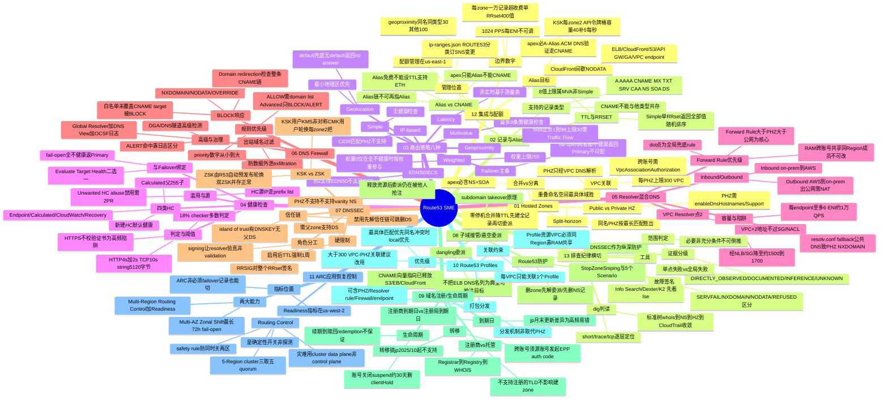

# AWS Route 53 SME - Index & Analysis Reviews

> Symptom index, gap analyses, design reviews, and review mindmap.

---

# FILE: DESIGN-REVIEW-claude.md
<!-- SOURCE FILE: DESIGN-REVIEW-claude.md -->

# Route 53 SME 备考知识体系 —— 独立设计评审（Claude）

> 评审方：Claude（独立评审，批判视角）。范围：framework/00-knowledge-framework.md、topics/01–14（含 03b）、exam/ 全部题库、research/ 概览。**只读评审，未改动任何被评审文件。**
> 评审日期：2026-09-20。
> 评审目标：以「通过 Route 53 SME 考试」为唯一标尺，评估知识域覆盖完整性、四要素结合有效性、题库难度真实性、组织检索动线、技术准确性治理，以及过度/不足。
> 一句话结论：**这是一套完成度很高、以真实 case 为锚、经 Codex 审校的优秀备考体系；主要缺陷不在"错"而在"覆盖偏斜"——高频运维/可观测/成本/IPv6 等成套知识域缺失或单薄，且题库全是"知道答案"的辨识题、缺少真正区分 SME 的多跳诊断题。**

---

## ① 缺陷清单（按严重度）

### 高（会直接导致考场失分或能力盲区）

**H1. CloudWatch 指标 / query logging 作为独立可观测知识域缺失。**
全套 14 个 topic 没有一个系统讲 Route 53 的**监控与可观测面**：Public/PHZ 的 CloudWatch metrics（`DNSQueries`、`HealthCheckStatus`、`HealthCheckPercentageHealthy`、`ConnectionTime`、`TimeToFirstByte`、`SSLHandshakeTime`）、Resolver endpoint 的 `InboundQueryVolume`/`OutboundQueryVolume`/`EndpointHealthyENICount`、以及 **Resolver query logging（不同于 firewall 的 OCSF 日志）** 的配置对象、投递目标（CW Logs / S3 / Firehose）、字段结构。这些散落在 topic 04（HC 的 `get-health-check-status`）、topic 12（几个 CW 指标名）、topic 06（firewall 的 OCSF 日志）里，**没有一处把"如何观测 Route 53"当成独立能力来教**。真实 SME 考试与真实 case 高频考"客户说慢/间歇失败，你看哪个指标"，这是明显盲区。
- 建议落点：**新建 topic 15「监控与可观测（CloudWatch metrics + Query Logging）」**，或至少在 topic 04/12 各补一节；把 topic 14 已提到的 health checker `ConnectionTime/TimeToFirstByte/SSLHandshakeTime` 指标钉进考点。

**H2. 成本 / 计费作为知识域几乎不存在。**
计费信息碎片化散在各 topic 的"边界数字速记"里（hosted zone $0.50/月、Alias 查询免费、query 计费、HC 附加费）。SME 考试与 TAM 场景**必考成本对比与优化**：标准 vs 快速 HC 的价差、string-match/HTTPS/非 AWS endpoint/延迟测量的附加费、query pricing 分档（标准 vs latency/geo/geoproximity 的"特殊查询"更贵）、resolver endpoint 每 ENI 小时费、DNS Firewall 按查询计费、Traffic Flow policy record 月费。没有一处把这些拉通成"给定架构，成本怎么算/怎么省"。
- 建议落点：**在 topic 12（服务集成+配额）内新增「计费与成本优化」大节**，或独立 topic；把散落的计费数字集中成一张对照表 + 2–3 道成本场景题。

**H3. 题库全是"辨识题"，缺少真正区分 SME 的多跳诊断题。**
146 道题（52+46+48）+ 65 题 mock，绝大多数是"给现象/概念 → 选正确结论"的单跳辨识题，且**正确答案高度集中在 B**（exam-bank-01-07 的速查表里 5-1..5-7 全是 B、7-1..7-5 全是 B、4-2..4-7 除一题外全是 B）——这不仅是应试习惯问题，更暴露**题干设计缺乏真正的干扰项工程**：正确选项往往是"最长、最完整、写满限定词"的那条，考生靠"选最详细的"就能蒙对，与真实 SME 考试"每个选项都像对、要靠推理排除"的难度不符。真实 SME 认证/内部测评的难度来自**多跳链式推理**（如 03b 的 Q1–Q8 那种"ALB 挂→ETH→failover→fail-open→恢复"全链判断），而这种题**只在 03b 一处出现**，其余章节几乎没有。
- 建议落点：见 ③ 结构改进。每章至少补 2–3 道"选项等长、需排除法"的场景题，并把答案分布打散。

**H4. Resolver DNS Firewall「Advanced」与托管规则组的深度不足以支撑高频考点。**
topic 06 把 Global Resolver 的**实验流程**写得极详（30–40 分钟分步 lab），但对 **Advanced protections 本身的机制**（DGA / DNS tunneling 检测的置信度阈值 LOW/MEDIUM/HIGH 的语义与误报权衡、Advanced 与 domain-list 不能同规则、confidence threshold 调低的代价）只有寥寥数语；对**托管规则组的类别体系**（AWSManagedDomainsMalwareDomainList / BotnetCommandandControl / AggregateThreatList / AmazonGuardDutyThreatList 等具体列表名与覆盖面）几乎没有。SME 考试会考"选哪个托管列表""Advanced 阈值调高调低的影响"。
- 建议落点：topic 06 §1 补「Advanced protections 阈值语义 + 托管列表清单」小节。

### 中（覆盖偏斜或深度不均，影响得分稳定性）

**M1. Traffic Flow / policy record 作为独立机制缺失。**
Traffic Flow 只在 topic 03（geoproximity 可视化）和 03b（nested failover 的实现载体）里被顺带提到，从未系统讲：policy / policy record / policy version、按 policy record **月费**计费、可视化编排、与手工记录集互引的区别、如何回滚 policy version。ARC 的 nested/多层路由、复杂 geoproximity 都以它为实现载体，SME 会考"怎么搭多层路由"。
- 建议落点：topic 03 或 11 补「Traffic Flow policy record」节，或在 03b nested failover 处补实现细节。

**M2. IPv6 / DNS64 / AAAA 场景单薄。**
AAAA 记录只在 topic 02 记录类型表里一笔带过。没有讲：dual-stack 场景下 A + AAAA 的健康检查独立性、Alias 到 dual-stack 资源时 A/AAAA 记录类型如何随目标而定（topic 02/12 提了一句"类型取决于目标"但没展开）、DNS64/NAT64 与 Route 53 的关系、IPv6-only 客户端解析。SME 考试有 IPv6 相关题。
- 建议落点：topic 02 补 AAAA/dual-stack 节，或在 topic 12 集成处补。

**M3. Outbound endpoint 高可用 / 容量规划散且不成体系。**
关于 endpoint HA 的关键结论散在 topic 05（≤6 ENI、~10K QPS/ENI、NLB 降到 1.5–1.7K）、题库进阶章（conntrack vs throttling 指标区分、共享 vs 专用 endpoint 的吵闹邻居 COE、每 endpoint 至少 2 IP、加 IP 线性扩、迁移时机判主因）。这些**进阶题库里的内容质量很高**，但**没有一个 topic 把它固化成正文**——一旦考生只读 topics 不做进阶题库，就会漏掉"专用 vs 共享 endpoint 隔离""conntrack 6 倍降速""按 destip 聚合 timeout 定位目标 NS"这些真实 SME 核心。**知识存在于题库解析里，但不在教材正文里**，这是结构性隐患。
- 建议落点：把进阶题库第二章的 endpoint HA/限流诊断内容**上提**到 topic 05 正文（新增「endpoint 高可用与容量规划」节）。

**M4. Profiles 缺真实 case 且部分能力边界未覆盖。**
topic 10 明确标注"无绑定真实 case"，用推演场景替代——这在整套"case 为锚"的体系里是**唯一的例外**，削弱了它的说服力。且未覆盖：Profile 与 VPC 级 DNS 设置（reverse DNS、DNSSEC validation、firewall failure mode）的**冲突/覆盖优先级细节**、Profile 关联数量配额、Profile 与 RAM 共享后成员账号能改哪些。
- 建议落点：从内部 case inventory 里找一个真实的多-VPC/多账号治理 case 补进去（178782060900806 只是"提及"，可深挖）；补 Profile 配额与冲突优先级。

**M5. ARC「Zonal Shift / Autoshift」与「Readiness Check」被砍掉。**
framework 驱动表里 topic 11 原本列了「Multi-AZ：Zonal Shift/Autoshift 最长 72h」「Readiness Check 每分钟审计」「指标在 us-west-2」，但**实际 topic 11 正文只写了 Routing Controls**（cluster/safety rule/data plane），**Zonal Shift、Autoshift、Readiness Check 完全没写**。framework 的高频必考清单还写着"Zonal Shift 72h / ARC 指标在 us-west-2"，但正文查不到——**framework 承诺了、topic 没兑现**。这是覆盖与索引不一致的实锤。
- 建议落点：topic 11 补「Zonal Shift / Autoshift（Multi-AZ）」与「Readiness Check」两节，并核对 framework 清单与正文一致。

**M6. CAA / 记录级安全 / SPF-DKIM-DMARC 应用场景单薄。**
CAA 只在记录类型表里定义了"限制哪些 CA 签发"，没有场景题（如"客户证书被非授权 CA 签发怎么用 CAA 防"）。TXT 的 SPF/DKIM/DMARC 邮件安全场景、CAA 与 ACM/CloudFront 的交互也没展开。SME 会考 CAA 场景。
- 建议落点：topic 02 或新增小节补 CAA/邮件安全记录的场景。

**M7. 控制面限流数字在体系内不自洽（治理问题，见 ⑤）。**
topic 12 正文写"公共 API 账号桶 10 RPS 持续/突发 50"，但题库 12-4、12-5、进阶第 17 题都写"控制面 ~5 请求/秒"。两处都在同一体系里、都作为"正确答案"，**考生会困惑到底是 5 还是 10**。这是单一事实源缺位的直接后果。

### 低（打磨项，不影响通过但影响精度/体验）

**L1. 答案分布可预测（B 偏多）**，已在 H3 提及，属可快速修复的打磨项。

**L2. 部分 topic 命名/编号风格不统一**：topic 07/12/13/14 用「# Topic NN —」或「# NN.」混排，topic 01–06/08–11 用「# NN.」，检索时轻微割裂。

**L3. 实验 Lab 大量为"受控/概念演练/需真实资源"，缺少纯离线可练的判读练习。** 例如很多 lab 需要真建 endpoint（有成本）；而 SME 备考更需要"给你一段 dig 输出/一段 flow log/一张 NACL 表，判读结论"这类零成本高频练习。topic 13 的 dig 分层实验方向对，但只有一处。

**L4. framework 的「高频必考清单」是纯文本长句堆叠**，没有做成可勾选的 checklist 或按域分组的速查卡，复习末期"过一遍硬结论"的动线不够顺。

**L5. 时效性数字缺"复核日期"标注机制。** 配额（500 zones、10000 records、300 VPC/PHZ、6 ENI）、边缘规模、TTL 默认值等会变，除 topic 14 对"50+ edge/80% resolver"做了"2014 背景数字非现行值"的免责，其余数字没有"采集/复核日期 + 官方 URL"的统一戳记，未来会悄悄过时（见 ⑤）。

---

## ② 建议补充的具体知识域 / 内容

按你在任务里点名的候选逐一给判定 + 落点：

| 候选知识域 | 现状 | 判定 | 建议落点 |
|---|---|---|---|
| **CloudWatch metrics / query logging** | 碎片化，无独立域 | **必补（H1）** | 新建 topic 15，或 topic 04+12 各补节 |
| **成本 / 计费** | 碎片在各"边界数字" | **必补（H2）** | topic 12 新增「计费与成本优化」大节 + 对照表 |
| **Resolver DNS Firewall Advanced / 托管列表** | 实验详、机制浅 | **补（H4）** | topic 06 §1 补阈值语义 + 托管列表清单 |
| **Traffic Flow policy record** | 顺带提及，无系统讲 | **补（M1）** | topic 03/11 补节 |
| **ARC Zonal Shift / Autoshift / Readiness Check** | framework 列了、topic 没写 | **必补（M5）** | topic 11 补两节 + 对齐 framework |
| **IPv6 / DNS64 / AAAA / dual-stack** | 一笔带过 | **补（M2）** | topic 02 补 dual-stack 节 |
| **Outbound endpoint 高可用 / 容量规划** | 在题库里、不在正文 | **必补（M3）** | 把进阶题库第二章上提到 topic 05 正文 |
| **CAA / 记录级安全 / SPF-DKIM-DMARC** | 定义有、场景无 | **补（M6）** | topic 02 补 CAA/邮件安全场景 |
| **Profiles 跨账号真实 case + 配额/冲突** | 无 case、边界不全 | **补（M4）** | topic 10 补真实 case + 配额 |

**额外发现的、你未点名但同样值得补的域：**

- **N1. `dig` / `dnstools` 判读技能的成套练习**（零成本、高频）——把散在各 topic §3 的 dig 命令与 topic 13 的分层判读，抽成一个「DNS 排障命令速查 + 判读练习集」（可作 topic 13 附录或独立 cheat sheet）。
- **N2. Route 53 与 ACM 证书验证 / CloudFront 的交互**——ACM DNS 验证 CNAME、CloudFront resolver identity 间歇 NODATA（topic 12 提了一句）、证书续期与 DNS 记录的耦合（topic 01 case 合并时提到），值得成节，SME 会考。
- **N3. 私有区 NS 委派缺口的等效替代**（进阶题库第 7 题的"R53 私有区不支持 NS 委派，用多 PHZ + 重叠命名空间 + resolver rule 等效"）——这是真实高频卡点，只在题库里，应上提到 topic 01 或 05 正文。
- **N4. Reusable delegation set / white-label NS**——只在 topic 14 提了一句，SME 会考"多 zone 共用 NS 便于注册商侧配置"，可在 topic 01 补。

---

## ③ 结构 / 流程改进

**S1. 建立"单一事实源"约定，消除数字冲突（对应 H2/M7/⑤）。**
明确规定：**边界数字/配额/计费的权威值只写在 framework 的一张「硬数字总表」里，各 topic 只引用不重复定义**。当前每个 topic 都有自己的"边界数字速记"，导致 5 RPS vs 10 RPS 这类冲突。改为：framework 建「配额与限流总表」（含官方 URL + 复核日期），topic 引用时写"见 framework 总表"或直接同步。这条能根治体系内自相矛盾。

**S2. framework 驱动表 ↔ topic 正文 ↔ 题库，做一次三向一致性核对（对应 M5）。**
现在 framework 承诺了 topic 11 有 Zonal Shift、高频清单写了 Zonal Shift 72h，但 topic 11 正文没有。应建一个轻量核对表：每个 framework 承诺的知识点，标注它在哪个 topic 的哪节兑现、在题库哪几题被考。**任何 framework 列出但正文/题库缺失的，就是覆盖漏洞**。这也顺带发现 M3（endpoint HA 在题库不在正文）这类"正文欠题库"的反向漏洞。

**S3. 题库难度分层 + 干扰项工程（对应 H3/L1）。**
- 把题库显式分三层：**L1 辨识（现有大部分）/ L2 单跳诊断 / L3 多跳链式**。SME 通过靠 L2/L3，现在几乎只有 L1（除 03b）。每章补 2–3 道 L3。
- **干扰项工程**：正确选项不再是"最长最全"那条；每个错误选项都要是"真实世界里有人会犯的具体误解"，且长度与正确项相当。
- **打散答案分布**：当前 B 严重偏多，考生可能形成"选 B/选最长"的应试捷径，这会让 mock 分数虚高、掩盖真实掌握度。
- mock-exam-scored 的加权（03/04/05/02 加重）方向正确，但应确保加重域里 L2/L3 题占比更高，而不是靠堆 L1 题数加权。

**S4. 把"存在于题库解析、缺席于正文"的知识上提为正文（对应 M3/N3）。**
进阶题库（exam-bank-advanced-tt-principles）里含大量正文没有的真实 COE/TT 知识（conntrack vs throttling 指标判主因、共享 endpoint 吵闹邻居、私有区无 NS 委派的等效替代、`.` rule 无 forward-first 回落、跳级委派间歇失败）。这些**质量极高但只有做题才能学到**。应把它们反哺进对应 topic 正文，让"只读 topic"的考生也能覆盖。否则题库解析实际承担了教材职责，结构失衡。

**S5. 新增末期复习动线：一页硬结论 checklist + 零成本判读练习集（对应 L3/L4）。**
- 把 framework 的高频必考长句，重排成**按域分组、可勾选的 checklist 卡**（diagrams/00-review-mindmap.md 已有 mindmap，可配一张纯文字硬结论卡）。
- 建一个「给输出判结论」的零成本练习集（dig 输出 / flow log 片段 / NACL 表 / OCSF 日志行 → 判读），补足现有 lab"需真实资源、有成本"的短板。

**S6. 统一 topic 文件的标题/编号/分节骨架（对应 L2）。**
framework §"每个 topic 文件的统一模板"已定义 5 段结构，但 topic 07/12/13/14 的一级标题风格与 01–06 不一致。做一次格式归一，让检索与自动化处理（如按节抽取考点）更稳。

**S7. 为所有时效性数字加"采集/复核日期 + 官方 URL"戳记，并设复核周期（对应 L5）。**
research/ 已标"采集日期 2026-09-20"，但 topic 正文的硬数字没有逐条戳记。建议每个配额/计费/默认值旁标注来源 URL + 复核日期；配一个"季度复核"提醒。topic 14 对 2014 博客数字做的免责是好范例，应推广。

---

## 评审收尾说明

**这套体系的突出优点**（评审需诚实记录，避免只挑刺）：case-锚定极强、四要素（概念-案例-实验-考点）结构统一且大部分执行到位、Codex 审校发现的技术错误（glue 必需性、AA vs AD、5 Scenario 只防 1、fail-open vs no-answer、DS 不含公钥、weight-0 兜底、negative TTL = min(MINIMUM,TTL) 等）都已订正、topic 03b 和进阶题库的多跳/COE 内容达到了真正的 SME 深度。**缺陷集中在"覆盖偏斜"而非"内容错误"**：可观测/成本/IPv6/Traffic Flow/Zonal Shift 等成套域缺失或单薄，题库难度结构偏辨识、答案可预测，以及少数 framework↔正文↔题库的一致性裂缝和单一事实源缺位导致的数字冲突。按 ① 的高/中优先级补齐 + ③ 的 S1/S2/S3/S4 四条结构改进，即可从"很好的备考材料"提升到"能真实区分并保证通过 SME"的体系。

================================================================================

# FILE: DESIGN-REVIEW-codex.md
<!-- SOURCE FILE: DESIGN-REVIEW-codex.md -->

# Route53 SME 体系设计评估 — Codex 端（cx ask，2026-09-20）

总体：体系已有很强的「案例—原理—实验—考点」闭环，但更像 R53 支持工程知识库，而非按考试蓝图校准的备考产品。最大风险不是覆盖不足，而是少数过时/内部结论被提升为硬考点。

## 设计缺陷
### 严重
1. Master Syllabus 未成为准确性单一事实源——总纲仍残留已在 topic 修正的错误（DNSSEC TTL 强制一周 / API 40-5 限流 / Alias 链不可再指 Alias），总纲错误会覆盖 topic 正文修正。
2. 缺可验证的考试蓝图与权重依据（"前三域占比最大/高频必考"无题目统计支撑；15 个 case 偏异常 support 场景 abuse/账号关闭/.jp 特例，不足以代表真实 SME 分布）。
3. 内部事实 / 公开产品契约 / 个案推断 混为同级硬考点（MaxMind、内部吞吐经验、StopZoneSniping 后端、Support Ops 流程）。应分级：公开且现行 / 内部运营 / case-specific / 推断待验证。
4. 缺内容版本治理（Profiles/Global Resolver/ARC/API 限流变化快；ARC 已增 Region switch，框架仍围绕 routing control/readiness）。
5. 部分实验安全等级与实际动作不符（他账号抢注同名 zone、DNSSEC 禁用、Zonal Shift、建 ALB/endpoint 非只读；应给隔离账户/费用/回滚/禁止执行版本）。
### 较高
6. 四要素模板过度强制（并非每主题都需真实 case/实验/Mermaid，易造低价值或高风险实验）。
7. 题库偏数字背诵（缺"多答案均可行选最佳""条件不足""排除干扰项"真实判断）。
8. 考试知识与 Support 运营混杂（case ID/内部工具/2PR/abuse 应移入独立 Operations 附录）。
9. 主题粒度失衡（DNS Firewall+Global Resolver、集成+配额过宽；Traffic Flow、可观测性无独立主题）。
10. 知识域编号不一致（名义 13 topic，实际有 03b、14；主线/专题/横切缺层级）。
### 中
11. 案例锚定过拟合风险（单 case 偶然配置被误记为通用规则）。
12. 缺反例训练（只给正确路径，无"相似症状不同根因"）。
13. 跨主题重复多（ETH/fail-open/ECS/TTL/优先级 多处重复→版本漂移）。
14. 检索入口单一（只按产品域，缺按症状/错误码/API/硬数字/选型信号词索引）。
15. 题库缺质量指标（难度/区分度/干扰项有效率/错题原因/知识点覆盖率）。
### 低
16. Mermaid 过量；17. 实验命令过长应移入 Lab Manual；18. 学习路线仅线性，缺诊断测验/薄弱域分支/冲刺路线。

## 建议补充知识域
- 00 DNS 协议基础（delegation/glue/bailiwick、UDP 截断 TCP fallback、EDNS0、NXDOMAIN vs NODATA、负缓存）
- Traffic Flow 独立专题（traffic policy/版本/policy instance/复杂 alias tree/回滚/计费）
- 日志与可观测性（Public DNS query logging、Resolver query logging、CloudWatch 指标、CloudTrail、缓存对日志影响）
- Resolver 高级（delegation rules、autodefined/system rules、DoH/DoH-FIPS、IPv6/dual-stack、DNS64、Resolver on Outposts）
- ARC Region switch（与 routing control/readiness/zonal shift 的职责边界）
- IAM 与治理（R53/Resolver 权限、KMS policy、RAM、SCP、防误删、跨账号责任）
- 控制面语义（PENDING/INSYNC、批量变更、幂等、重试、PriorRequestNotComplete、现行限流模型）
- 成本模型（hosted zone/query/health check/resolver endpoint/traffic flow/日志费用）
- 反例库（相似症状不同根因）

================================================================================

# FILE: GAP-ANALYSIS-claude.md
<!-- SOURCE FILE: GAP-ANALYSIS-claude.md -->

# Route 53 SME —— 独立知识缺口分析（GAP ANALYSIS · Claude 独立评审）

> **评审方**：独立评审 sub-agent（Claude）。**日期**：2026-09-20。
> **评审范围（只读）**：`framework/00-knowledge-framework.md`、`framework/00b-canonical-facts.md`、全部 `topics/*.md`（22 个）标题+考点节、`INDEX-by-symptom.md`、`exam/` 题库标题。
> **方法**：对照真实 Route 53 SME 应覆盖面，只找「缺 / 薄 / 可能过时 / 错配」，不复述已覆盖内容。
> **权威冲突处理**：本文件只提缺口，不改任何硬数字；硬数字仍以 `00b-canonical-facts.md` 为准。

---

## ① 缺口清单（按重要度：高 / 中 / 低）

> 每条 = **缺什么** + **为何该补** + **建议落点**（新建 topic 或塞进现有 topic）。

### 🔴 高优先级（真实 case / 考试大概率命中，现体系几乎空白）

**H1. AWS Cloud Map / ECS Service Connect / 服务发现（整类缺失）**
- **缺什么**：Cloud Map（`servicediscovery`）如何用 Route 53 做服务发现——namespace = PHZ、service = 记录集、SRV/A/AAAA 自动注册注销、`DiscoverInstances` API 路径、Cloud Map 私有 vs 公共 namespace、ECS service discovery 与新的 Service Connect 的区别、Cloud Map 自动建的 PHZ 与手工 PHZ 的关系（删 namespace 会连带删 zone）。
- **为何该补**：这是 R53 在容器/微服务场景最高频的真实集成，SME case 常见「Cloud Map 建的 PHZ 里记录莫名消失/无法手删」「ECS 任务退出后 SRV 记录不清理」。现体系 22 个 topic 对 Cloud Map **零覆盖**，`servicediscovery` 关键字仅出现在 research 文件，从未进 topic。
- **建议落点**：**新建 topic 21 — Cloud Map / 服务发现与 R53 的耦合**，与 topic 01（PHZ）、topic 20（Resolver 高级）交叉引用。

**H2. HTTPS / SVCB 记录（RFC 9460）深度（现仅列表级，深度为零）**
- **缺什么**：topic 02 只把 `HTTPS`/`SVCB` 列在「支持的记录类型」清单里，**无任何 RFC 9460 细节**：SvcPriority（AliasMode=0 vs ServiceMode）、SvcParams（`alpn`、`port`、`ipv4hint`/`ipv6hint`、`ech`）、HTTPS 记录如何让浏览器免一跳直接 HTTP/3/ECH、SVCB 与 CNAME-at-apex 问题的关系（HTTPS 记录可在 apex 表达「等价 CNAME」语义）、R53 对这两类记录的录入格式。
- **为何该补**：HTTPS/SVCB 是近年新增标准记录类型，浏览器（Chrome/Safari/Firefox）已广泛查询，ECH/HTTP3 推广使其考点权重上升；SME 被问「apex 想要 CNAME 效果又想指外部域，能不能用 HTTPS 记录」「客户端在查 type65 是什么」时现体系答不出深度。
- **建议落点**：**加深 topic 02**（新增 §1.4「HTTPS/SVCB 记录与 RFC 9460」），或并入 H1 附近的新记录类型专题。

**H3. Route 53 ↔ PrivateLink / VPC Interface Endpoint 深度（现仅一行 Alias 目标）**
- **缺什么**：topic 12 只有一行「VPC Interface Endpoint（PrivateLink）→ ✅ 可做 Alias 目标」。缺：Private DNS for endpoint 开关（`PrivateDnsEnabled`）如何自动建/劫持 zone、endpoint-specific vs service-wide 的 regional/zonal DNS 名、开 Private DNS 后与自建 PHZ 的**命名空间冲突**、跨 VPC/跨账号消费 endpoint 的 DNS、endpoint DNS 与 Resolver 转发规则的优先级交互。exam-bank-advanced Q5（PrivateLink 端点解析不出私有 IP + CloudAuth token prefetch timeout）已在考、但无 topic 深度支撑。
- **为何该补**：PrivateLink DNS 是企业内网/SaaS 消费最常见的 R53 疑难，且题库已经出题却无对应正文（见④错配 M-mismatch-1）。
- **建议落点**：**加深 topic 05（Resolver）或 topic 12（集成）**，新增「PrivateLink Private DNS 与 PHZ 冲突」专节；与 topic 01 split-horizon 交叉。

**H4. EKS ExternalDNS 作为独立能力（现仅当作「合并 zone 的坑」提了一句）**
- **缺什么**：ExternalDNS 目前只在 topic 01（合并 zone 时改 `--zone-id-filter`）和 topic 19（IAM 拆 `ListHostedZones` Statement）里被顺带提到。缺：ExternalDNS 的工作模型（TXT registry `heritage=external-dns`、owner-id、`txtOwnerId`、sync vs upsert-only policy）、它对 R53 API 的调用节奏（易触发 topic 12 的 100 changes/s 限流）、IRSA 权限最小集、多集群共享一个 zone 的 owner 隔离。
- **为何该补**：EKS + ExternalDNS 是 K8s 上 R53 的事实标准，故障（记录漂移、删不掉、限流）频繁进 case。
- **建议落点**：并入 **H1 新建 topic 21**（服务发现族）或 topic 12 增设「ExternalDNS 运维」节。

### 🟡 中优先级（真实存在、考点中等，现体系薄或缺角）

**M1. 迁移场景：zone 导入 / 大批量记录变更 / 从他方 DNS 迁入 R53（整类偏薄）**
- **缺什么**：BIND zone file 导入（控制台 Import zone file / CLI）、`ChangeResourceRecordSets` 单次打包 vs 循环单条（topic 12 只提了一句限流，无迁移剧本）、`GetHostedZoneCount`/`ListResourceRecordSets` 分页导出、迁移四阶段剧本（降 TTL → 双跑 → 切 NS → 观察 → 拆旧）、跨 registrar 迁移与 DNS 迁移的解耦。topic 00a §有「降 TTL 提前 24h」的锚点，但没有成体系的迁移 topic。
- **为何该补**：「帮我把 DNS 迁到 R53 / 大批量改记录报 Throttling」是高频咨询型 case。
- **建议落点**：**新建 topic 22 — DNS 迁移与批量变更剧本**，聚合 00a 的 TTL 锚点 + 12 的限流 + 01 的 NS 委派切换。

**M2. 私有 DNS 与 on-prem AD / Windows DNS 集成模式（现只有通用 Resolver 转发）**
- **缺什么**：topic 05/20 讲了 Inbound/Outbound/Delegation 通用机制，但缺针对 **Active Directory / Windows DNS** 的具体模式：AD 的 `_msdcs`/SRV 记录如何经 Outbound 转发、条件转发器双向配置、AD 加域主机的 DNS suffix search list、Managed AD（Directory Service）自带的 DNS 与 Resolver 的关系、Simple AD vs AWS Managed Microsoft AD 的 DNS 行为差异。
- **为何该补**：混合云里 on-prem 侧几乎都是 AD/Windows DNS，SME 需要能对着 AD 的 SRV 结构排障，而不只是「转发规则优先级」抽象。
- **建议落点**：**加深 topic 05**（新增「与 on-prem AD/Windows DNS 集成」节）。

**M3. 跨区域 / 跨账号复杂 DNS 架构（散点存在，无统一架构 topic）**
- **缺什么**：现体系把跨区/跨账号碎片散在 01（PHZ 跨账号关联）、05（RAM 共享 rule）、10（Profiles）、19（RAM/partition 边界）。缺一个**架构综合 topic**：多区 active-active/active-passive 的 DNS 分层、跨账号「hub-and-spoke Resolver」中心账号出站 + RAM 分发模式、centralized DNS account 反模式与最佳实践、跨账号 PHZ + Profiles + Resolver rule 三者的选型决策树、跨 Region PHZ 关联的适用边界。
- **为何该补**：SME 常被要求「设计一个多账号多区的企业 DNS」，需要能把碎片拼成架构而非逐点回答。
- **建议落点**：**新建 topic 23 — 企业级跨区/跨账号 DNS 架构（综合选型）**，或在 topic 10 增设「架构模式」节。

**M4. Resolver DNSSEC validation（与 signing 明确区分，现只有一句锚点）**
- **缺什么**：topic 07 反复讲 signing（KSK/ZSK/DS），并点了「validation ≠ signing」，但**没有独立展开 Resolver 端 DNSSEC validation 的开关、行为、故障**：在 VPC Resolver 上启用 validation 后，验签失败返回 SERVFAIL 的现象、如何区分「权威没签 vs 递归验签失败」、启用 validation 对 topic 17 SERVFAIL 差分诊断的影响。
- **为何该补**：客户启用 Resolver DNSSEC validation 后「某些域突然 SERVFAIL」是真实 case，需与 signing 故障切开。
- **建议落点**：**加深 topic 07**（新增「Resolver 端 validation」节）+ topic 17 SERVFAIL 类别补一行。

**M5. DNS over HTTPS/TLS（DoH/DoT）在 topic 20 出现于标题但正文深度存疑**
- **缺什么**：topic 20 标题含 `DoH`，但需确认正文是否讲清 R53 Resolver 对 DoH/DoT 的支持边界、与 DNS Firewall/query logging 的交互、客户端加密 DNS 绕过企业 DNS Firewall 的风险。（本评审只读标题+考点节，正文深度需 owner 自查；列为中优先「疑薄」。）
- **建议落点**：确认 topic 20 正文覆盖，不足则加深。

### 🟢 低优先级（补全度问题，考点较窄或偏冷）

**L1. 反向 DNS（PTR）/ IP → 名称 与 in-addr.arpa 委派**：topic 02 列了 PTR 类型，但无反向区、无 EC2/EIP 反向 DNS 申请流程（邮件发送 IP 声誉相关）、无 `ip6.arpa`。建议 topic 02 或新记录专题补一小节。
- **L2. R53 Resolver on Outposts / 混合边缘**：topic 20 标题提 Outposts，深度需自查；偏冷，低优先。
- **L3. CAA 记录与 ACM/证书签发链路**：topic 02 提了 CAA 不能与 CNAME 共存，但没讲 CAA 如何影响 ACM DNS 验证与第三方 CA 签发失败的排障。低优先补 topic 02。
- **L4. IPAM / ip-ranges 之外的公共 NS IP 生命周期**：topic 12 有 ip-ranges.json + SNS，够用；IPAM 关联极弱，可忽略。

---

## ② 现有 topic 里偏薄、需加深的（结构骨架够但深度不足）

| topic | 现状 | 需加深点 |
|---|---|---|
| **02 记录与 Alias** | HTTPS/SVCB **仅列表级**，PTR 无反向区，CAA 无签发链路 | 见 H2 / L1 / L3 |
| **12 集成与配额** | PrivateLink **仅一行 Alias 目标**；批量变更**仅一句限流** | 见 H3 / M1 |
| **05 Resolver** | 通用 Inbound/Outbound 强，但**无 AD/Windows DNS 具体模式**、**无 PrivateLink Private DNS 冲突** | 见 M2 / H3 |
| **07 DNSSEC** | signing 侧扎实，**validation 侧仅一句** | 见 M4 |
| **10 Profiles / 01 PHZ / 19 IAM** | 跨账号能力散点，**无综合架构视图** | 见 M3 |
| **20 Resolver 高级** | 标题含 DoH/Outposts/DNS64，**正文深度需 owner 自查**（本评审只读标题） | 见 M5 / L2 |
| **11 ARC** | 正文标注 Readiness Check「不再对新客户开放」——**需确认体系其他处（框架/canonical）是否已同步这条时效性变化**，避免过时表述残留 | 时效性核对 |

---

## ③ 题库覆盖 vs topic 覆盖的错配（exam ⟷ topics 对不齐）

- **Mismatch-1（PrivateLink）**：`exam-bank-advanced-tt-principles.md` Q5 已考「PrivateLink 端点解析不出私有 IP，CloudAuth token prefetch timeout，先查哪两个 VPC 属性」，但 topic 侧只有 topic 12 一行 Alias 目标——**考在正文之外**。→ 补 H3 后回填题目落点。
- **Mismatch-2（ECS + PHZ）**：Q4「ECS 服务 UnknownHostException，删某 PHZ 后恢复」实为服务发现/命名空间冲突场景，但无 Cloud Map/服务发现 topic 承接。→ 补 H1。
- **Mismatch-3（conntrack / 共享 endpoint 吵闹邻居）**：advanced 题库 Q12–Q18 大量考 `conntrack_allowance_exceeded_delta`、`udp_throttled_count`、共享 vs 专用 endpoint 隔离、TRE COE——这些**深度在 research/内部素材里**，但对照 framework 驱动表，topic 05/20 的**考点节是否把这些指标名与判别纪律固化进正文**需核对；若只在题库解析里出现而正文缺，属错配。→ 核对 topic 05/20 正文，必要时把 conntrack/throttle 指标判别补进 topic 05 考点节。
- **一致性抽查建议**：对 `exam/` 每道题解析里引用的「（Topic NN §x）」锚点做一次自动化回链校验，确认每个被引小节真实存在——本评审抽样发现 advanced 题库多题只引 research 而不引 topic 小节，存在锚点悬空风险。

---

## ④ framework 承诺但正文可能没有的（驱动表 vs 落地）

- **F1**：框架驱动表 topic 06 承诺「Global Resolver + DNS View + Access Source/Token + OCSF query log」完整 lab；topic 06 标题节可见 lab 骨架，但 **Global Resolver / DNS View 属较新特性，需核对正文是否真讲清 Access Source/Token 与 OCSF 字段**，避免只有 lab 步骤无概念深度。
- **F2**：框架把 topic 00a/14/15/16/17/18/19/20 列为已扩展域，但**驱动表（第「知识域驱动表」表格）只列到 01–13**，14–20 与 00a 未进驱动表 → framework 的「驱动表」与实际 topic 清单**已脱节**（INDEX 全清单列到 17，driver table 列到 13，实际到 20）。建议把驱动表补齐到 20 并纳入 00a，否则新学员按驱动表学会漏掉 7 个 topic。**（这是一条 framework 自身的结构性缺口，优先级等同高。）**
- **F3**：canonical-facts `00b` 覆盖限流/HC/配额/DNSSEC/路由/传播/ARC 七类硬数字，但**未收录**：HTTPS/SVCB 无硬数字条目、Cloud Map/服务发现相关配额（每 namespace 记录数等）、Traffic Flow versioning 默认 1000（散在 topic 18 来源行，未进 00b）、query logging 指标保留期「two weeks」（散在 topic 15）。建议把这些边界数字**上收进 00b** 以维持单一权威源承诺。

---

## ⑤ 优先级建议（补齐顺序）

1. **先补 framework 自身脱节（F2）**——驱动表补齐到 topic 20 + 纳入 00a。这是元层缺口，不补则后续所有「按驱动表备考」都漏 7 个域，**成本最低、影响最大**。
2. **H1 Cloud Map/服务发现 + H4 ExternalDNS**（合并为新 topic 21）——真实 case 最密集的整类空白，且已有题库悬空（Mismatch-2）。
3. **H3 PrivateLink 深度**——题库已考、正文缺（Mismatch-1），加深 topic 05/12 即可，不必新建。
4. **H2 HTTPS/SVCB RFC 9460**——加深 topic 02，工作量小、时效性考点上升快。
5. **M1 迁移剧本（新 topic 22）+ M3 跨区跨账号架构（新 topic 23）**——咨询型 case 高频，但可由现有碎片聚合，非从零。
6. **M2 AD/Windows DNS + M4 Resolver validation + M5 DoH 核对**——加深 topic 05/07/20。
7. **F3 硬数字上收 00b + ③ 题库锚点回链校验**——一致性维护，随上述各项顺带完成。
8. **低优先 L1–L4**——补全 topic 02/20 的窄考点，最后处理。

> **元建议**：③ 的「题库解析锚点回链校验」和 F2 的「驱动表补齐」应做成一次性脚本/清单，纳入项目 versioning 流程，避免 topic 继续扩张时 framework 与 exam 再次脱节。

================================================================================

# FILE: GAP-ANALYSIS-codex.md
<!-- SOURCE FILE: GAP-ANALYSIS-codex.md -->

# Route53 SME 体系缺口分析 — Codex 端（cx ask，2026-09-20）

以现有 22 topic 为基线，从 AWS 官方现行文档 + 2024-2025 新特性找缺失/待更新的 SME 考点：

1. **API 限流模型整体更新**：旧 40/5 或统一 5 RPS 已过时；现行账号级+operation 级双 token bucket，常规 burst 50/持续 10 RPS，DNS 变更 burst 1500/持续 100 changes/s，UPSERT 消耗 2。自动化/IaC 限流题常考。
2. **ARC 缺 Region switch + Readiness Check 定位变化**：补 plan/workflow/execution block/graceful vs ungraceful/cross-account/plan evaluation/恢复时间；Readiness Check 已不向新客户开放，官方推荐 Region switch。
3. **HTTPS/SVCB 需 RFC 9460 深度**：alias mode(priority 0)/service mode/优先级/alpn/port/ipv4hint/ech/ipv6hint/dohpath；R53 不支持 keyNNNNN；HTTPS/SVCB 支持 public/PHZ，SSHFP/TLSA 仅 public。
4. **缺 Cloud Map/ECS DNS 服务发现专题**：Cloud Map namespace/service/instance、DNS vs API discovery、MULTIVALUE/WEIGHTED、A/AAAA/SRV/CNAME、custom health vs R53 HC、ECS task 注册/注销生命周期。
5. **Global Resolver 独立成专题(标 Preview)**：anycast resolver/DNS Views/access source/DNSSEC validation/独立日志；易与 VPC Resolver 混。（What's New 2025-11）
6. **Profiles 2025 扩展**：interface VPC endpoint managed PHZ、Resolver query logging、同 Region/RAM/资源所有权、local-over-profile 冲突。
7. **Alias 目标矩阵刷新**：CloudFront distribution tenant、OpenSearch custom domain、VPC Lattice service custom domain；标 public/PHZ/ETH/计费边界。
8. **DNS Firewall Advanced 深度**：Dictionary DGA、DNS tunneling、LOW/MEDIUM/HIGH confidence threshold、规则互斥、Security Hub findings。
9. **Resolver 管理 API PrivateLink 边界**：2025-10 起可私网访问 Resolver 管理 API；保护控制面、不承载 DNS 查询，≠ authoritative API PrivateLink。
10. **Resolver 容量可观测性更新**：ResolverEndpointCapacityStatus + RNI/目标 DNS 延迟/rcode/timeout 指标；不能只靠 QueryVolume 推算容量。
11. **配额表改「默认/硬限制/可提额」三态**：Resolver endpoints、IP/endpoint、target IP/rule、rules、rule-VPC associations、Profiles、HC 现行配额；别把默认背成硬限。
12. **缺 EKS DNS 集成边界**：CoreDNS→VPC Resolver 数据面、私有 EKS endpoint managed PHZ、ExternalDNS 的 R53 API/IAM/TXT ownership/zone filter/限流；ExternalDNS 非托管 R53 功能。
13. **健康检查依赖删除风险**：删 HC 前需解除对它的引用依赖（route/policy）等。

================================================================================

# FILE: INDEX-by-symptom.md
<!-- SOURCE FILE: INDEX-by-symptom.md -->

# Route 53 SME —— 多维检索入口索引（INDEX-by-symptom）

> **用途**：接到 case / 考题时，先在本索引按「症状 / 响应码 / API·CLI / 硬数字 / 选型信号词」定位，直达对应 topic 与小节，再去读正文。硬数字冲突一律以 `framework/00b-canonical-facts.md` 为权威。
> **topic 目录**：`/Users/leichenz/case-knowledge-base/route53-sme-versions/snapshots/route53-sme/topics/`
> topic 文件全清单：`00a` DNS协议基础、`01` Hosted Zones、`02` 记录与Alias、`03` 路由策略、`03b` 路由×HC×Failover深挖、`04` 健康检查、`05` Resolver混合DNS、`06` DNS Firewall、`07` DNSSEC、`08` subdomain takeover、`09` 域名注册生命周期、`10` Profiles、`11` ARC、`12` 集成与配额、`13` 排查纪律、`14` 技术原理深挖、`15` 可观测性、`16` 成本模型、`17` 同症状异根因对照库。

---

## 维度一：按症状（Symptom → Topic）

### SERVFAIL（服务器返回失败）
| 症状细分 | 最可能根因方向 | 直达 topic·小节 |
|---|---|---|
| 全域突然全部 SERVFAIL | stale delegation（父区委派 NS 指向已删/失效 zone）、DNSSEC 信任链断 | `17`§类别一SERVFAIL；`07` DNSSEC 信任链/island of trust；`08`§1 悬空委派 |
| 启用 DNSSEC 后 SERVFAIL | DS 记录未在父区/算法不匹配、island of trust、resolver 验签失败 | `07`§信任链·DS·island of trust；`14` 底层机制 |
| 仅混合 DNS 环境 SERVFAIL | 转发规则目标不可达、outbound endpoint 故障、on-prem DNS 拒答 | `05`§Resolver Rule / Inbound·Outbound；`17`§SERVFAIL |
| 排查方法论（SERVFAIL 定位树） | 证据分级 + dig 逐层 | `13`§证据分级·dig；`17`§使用方法 |

### NXDOMAIN（域名不存在）
| 症状细分 | 最可能根因方向 | 直达 topic·小节 |
|---|---|---|
| PHZ 记录存在却返回 NXDOMAIN | resolv.conf fallback 到公共 DNS 未命中 PHZ、VPC 未关联 PHZ、DNS hostnames/support 未开 | `05`§resolv.conf fallback / .2 resolver；`01`§1.2 PHZ 启用前提与关联 |
| DNS Firewall 命中后 NXDOMAIN | BLOCK 动作响应 NXDOMAIN；allowlist 里 CNAME 目标未列被拦 | `06`§ALLOW·BLOCK·ALERT / BLOCK 响应；`06`§Domain redirection |
| 重叠命名空间解析到错 zone | 最长匹配未命中预期 zone | `01`§split-horizon / 重叠命名空间最长匹配 |

### NODATA（域名存在但该类型无记录）
| 症状细分 | 最可能根因方向 | 直达 topic·小节 |
|---|---|---|
| CloudFront/AWS 资源间歇 NODATA | resolver identity 间歇、目标资源类型无该记录 | `12`§服务集成 Alias·CloudFront NODATA；`17`§间歇超时 |
| DNS Firewall ALERT 命中难区分 | ALERT action=Allowed，只能靠日志区分 | `06`§ALERT / OCSF query log；`15`§Query Logging |

### 解析不一致（同名不同答案 / 时对时错）
| 症状细分 | 最可能根因方向 | 直达 topic·小节 |
|---|---|---|
| 同名内外网不同答案 | split-view / split-horizon 设计 | `01`§split-horizon；`17`§类别二解析不一致 |
| 加权/延迟策略返回值飘 | 策略本就返回不同值、latency 非实时、weight 分配 | `03`§路由策略；`03b`§各策略+HC 行为 |
| resolver 缓存 vs 权威不一致 | TTL 未过期、负缓存 | `14` 底层机制；`00a` DNS 基础 |

### failover 不切换 / 切换异常
| 症状细分 | 最可能根因方向 | 直达 topic·小节 |
|---|---|---|
| 主挂了不切备 | HC 判定未 Unhealthy、18% checker、Evaluate Target Health 配置、fail-open | `04`§判定机制·18% checker·fail-open；`03b`§Failover+HC |
| CALCULATED HC 一直 Unhealthy | 父子 HC 阈值、子 HC 健康数不足 | `04`§四类HC·Calculated 父255子 |
| Alias 目标健康但不切 | Evaluate Target Health 二选一未开、Alias 与 HC 冲突 | `12`§Evaluate Target Health；`02`§Alias |
| 多 Region/AZ 灾备切换 | ARC Routing Control / Zonal Shift / 手改 failover 记录 | `11`§Routing Control·Zonal Shift；`03b`§Failover |

### 间歇超时（时好时坏 timeout）
| 症状细分 | 最可能根因方向 | 直达 topic·小节 |
|---|---|---|
| VPC 内解析间歇超时 | 触顶 1024 PPS/ENI、endpoint ENI QPS、NACL 双向 | `12`§1024 PPS；`05`§ENI QPS·多ENI+NACL；`17`§间歇超时 |
| 混合 DNS 间歇超时 | outbound endpoint 过载、NAT 出公网、UDP vs TCP | `05`§ENI/NLB 降速·outbound NAT；`13`§dig +tcp |

### subdomain takeover / 安全类
| 症状细分 | 最可能根因方向 | 直达 topic·小节 |
|---|---|---|
| 删 zone 后子域被他人接管风险 | dangling delegation、NS hold 失效 | `08`§1.3 StopZoneSniping·5 Scenario；`08`§删 zone 正确顺序 |
| DNS 数据外泄怀疑 | 需 DNS Firewall 出站过滤、DGA/隧道检测 | `06`§防 exfiltration·DGA·DNS tunneling |

---

## 维度二：按错误码 / 响应码 / 状态（Code → 落点）

| 码 / 状态 | 含义 | 直达 topic·小节 |
|---|---|---|
| SERVFAIL | 递归器无法完成解析（委派断、DNSSEC 验签失败、转发目标不可达） | `17`§SERVFAIL；`07` DNSSEC；`05` Resolver Rule |
| NXDOMAIN | 权威明确「无此名」（或 Firewall BLOCK） | `01` 最长匹配；`05` resolv.conf fallback；`06` BLOCK |
| NODATA（NOERROR + 空 answer） | 名存在但无该类型记录 | `12` CloudFront NODATA；`17` |
| REFUSED | 服务器拒答（非权威、ACL 拒绝） | `13`§故障签名；`14` 权威定位 |
| InsufficientDataHealthState | HC 三态之一，数据不足 | `04`§判定机制·三态 |
| Healthy / Unhealthy（HC） | 18% checker 多数判定 | `04`§18% checker |
| GetChange = PENDING / INSYNC | 变更未/已全球同步（INSYNC=全球生效） | `12`§DNS changes 同步；`13` |
| clientHold（域名 EPP 状态） | 账号关闭/欠费导致解析停 | `09`§生命周期·clientHold |
| DNSKEY / DS / RRSIG | DNSSEC 记录（新 ZSK 出现属正常轮换） | `07`§KSK·ZSK·RRSIG·DS |

---

## 维度三：按 API / CLI（命令 → 落点）

| API / CLI / 工具 | 场景 | 直达 topic·小节 |
|---|---|---|
| `dig` `+short` `+trace` `+tcp` `CNAME` 类型 | 逐层解析定位、UDP/TCP 区分 | `13`§dig 用法；`17`§使用方法；`00a` |
| `dig @169.254.169.253` / `.2 resolver` | 直验 VPC DNS 命中 PHZ | `05`§.2 resolver；`01` |
| `dig TXT o-o.myaddr.google.com` | 检测 resolver 是否支持 ECS | `03`§EDNS0/ECS |
| `nslookup` UDP vs TCP | 出站/入站/路由/目标故障区分 | `05`§差分诊断；`17` |
| `UpdateHealthCheck`（CLI/API） | 触发 HC 重评估 | `04`§CloudWatch alarm-based HC lab |
| `VpcAssociationAuthorization` / `AssociateVPCWithHostedZone` | 跨账号 PHZ 关联 | `01`§1.2 跨账号关联 |
| `get-contact-reachability-status` | 域名联系人可达性 | `09`§reachability |
| `GetChange` | 判断变更是否 INSYNC 全球同步 | `12`；`13` |
| `jq` 解析 `ip-ranges.json`（ROUTE53 分类） | 提取权威 NS CIDR + 订阅 SNS | `12`§ip-ranges·AmazonIpSpaceChanged |
| CloudWatch Logs Insights 查 OCSF `firewall_rule_id` | 区分 ALERT/ALLOW 命中 | `06`§OCSF query log；`15`§Query Logging |
| `kubectl exec` 看 `/etc/resolv.conf` / CoreDNS dnsPolicy | Pod 解析路径 | `05`§resolv.conf fallback |
| 内部工具 Info Search / Customer Info Search / Dexter / K2 / lse.amazon.com | 排查起点 | `13`§内部工具 |

---

## 维度四：按硬数字 / 边界（Number → 落点）

> 权威源：`framework/00b-canonical-facts.md`。以下为「见到这个数字/限制该翻哪」。

| 硬数字 / 边界 | 结论要点 | 直达 topic·小节 |
|---|---|---|
| **1024 PPS / ENI 不可调** | VPC DNS 每弹性网卡查询上限，触顶即间歇失败 | `12`§配额·1024 PPS；`05` |
| 每 zone 10,000 记录（超收费） | Hosted Zone 记录上限 | `12`§配额 |
| 单 RRset 400 值 | 记录集值上限 | `02`§RRSET；`12` |
| weight ≤ 255；权重 0 | 加权路由上限与 0 行为 | `03`§Weighted；`03b`§1.1 |
| geoproximity bias −99..99（含0）；上限 30（同名同类型），其他 100 | 地理近邻偏置与配额 | `03`§Geoproximity；`12` |
| multivalue ≤ 8 | 多值应答上限 | `03`§Multivalue |
| 18% checker | 健康检查多数判定阈值 | `04`§18% checker |
| HTTP 4s+2s / TCP 10s / string match 5120 字节 | HC 超时与匹配限制 | `04`§判定机制 |
| KSK / zone ≤ 2；ZSK 轮换 7–30 天 | DNSSEC 密钥限制 | `07`§KSK·ZSK；`12` |
| 签名 zone 记录最大有效 TTL 一周（原 TTL<一周不受影响） | DNSSEC TTL 强制 | `07`§TTL |
| 每 PHZ 300 VPC 关联（>300 建议改 Profiles） | PHZ 关联上限 | `01`；`10`§何时用 Profiles；`12` |
| 1 VPC 只能 1 Profile | Profile 关联约束 | `10`§1.3 |
| 公共 API 账号桶：持续 10 RPS / 突发 50 | Route 53 API 限流 | `12`§配额限流 |
| DNS changes：持续 100/s / 突发 1500 | 变更限流 | `12`§配额限流 |
| Resolver API 约 5 RPS（另算） | Resolver 独立限流 | `12`§配额限流 |
| endpoint ≤ 6 ENI、~10K QPS/ENI（经 NLB/SG 降至 ~1.5–1.7K） | Resolver endpoint 吞吐 | `05`§ENI QPS |
| Zonal Shift 最长 72h | ARC 时限 | `11`§Zonal Shift |
| ARC 指标在 us-west-2；DNSSEC/配额管理走 us-east-1 | 区域约束 | `11`；`07`；`12` |
| GetChange = INSYNC 表示全球已同步 | 变更同步判据 | `12`；`13` |
| 成本档位（HZ 月费 / query 分档 / HC 计费） | 计费模型 | `16`§Hosted Zone 月费·Query 分档 |

---

## 维度五：按选型信号词（客户说 X → 看哪个 topic）

| 客户 / 题干说的话（信号词） | 指向能力 / 结论 | 直达 topic·小节 |
|---|---|---|
| "顶点/根域名要指向 ELB/CloudFront/S3" | 只能用 A/AAAA Alias（CNAME 不能在 apex），Alias 免费+可开 ETH | `02`§1.3 Alias vs CNAME；`12`§集成 Alias |
| "按比例/灰度/金丝雀分流" | Weighted 路由（weight≤255，权重0=不参与） | `03`§Weighted；`03b`§1.1 |
| "就近/最低延迟访问" | Latency 路由（非实时，基于 AWS 测量） | `03`§Latency |
| "主备/自动灾备切换" | Failover 路由 + HC（+可选 ARC） | `03`§Failover；`03b`；`11` |
| "按国家/地区返回不同内容/合规" | Geolocation（配 default 兜底，最小区优先） | `03`§Geolocation |
| "按地理距离并想手动偏置流量" | Geoproximity（bias±99，2024 起支持普通记录） | `03`§Geoproximity |
| "返回多个健康 IP 让客户端自选" | Multivalue（≤8，带 HC） | `03`§Multivalue |
| "按客户端 IP 段路由" | IP-based（CIDR；PHZ 不支持） | `03`§IP-based |
| "内网私有域名解析 / 内外网不同答案" | Private Hosted Zone / split-view | `01`§PHZ·split-horizon |
| "on-prem 与 AWS 互相解析 / 混合云 DNS" | Resolver Inbound/Outbound + 转发规则（Rule>PHZ>公网） | `05` 全篇 |
| "统一给多账号多 VPC 下发 DNS 配置" | Route 53 Profiles（RAM 同 Region，1 VPC 1 Profile） | `10` 全篇 |
| "阻止 DNS 出站到恶意域 / 防数据外泄 / 防隧道" | DNS Firewall（出站按域名，DGA/tunneling 检测） | `06` 全篇 |
| "要让解析结果可被验真 / 防篡改" | DNSSEC signing（KSK 用户 KMS，DS 在父区） | `07` 全篇 |
| "删了子域担心被别人接管" | dangling delegation / subdomain takeover 防护 | `08` 全篇 |
| ".jp / .pay 域名 / 到期日对不上 / 转移锁" | TLD 特性与生命周期 | `09`§TLD·到期日·转移 |
| "AZ 级/Region 级快速隔离故障" | ARC Zonal Shift / Autoshift / Routing Control | `11` 全篇 |
| "要看 DNS 查询日志 / 谁改了记录 / 趋势告警" | Query Logging + CloudTrail + CloudWatch 指标 | `15` 全篇 |
| "这套 DNS 方案要花多少钱 / 怎么省" | 成本模型（HZ 月费 + query 分档 + HC） | `16` 全篇 |
| "解析全挂了帮我查" / "先从哪查" | 通用排查树 + 证据纪律 | `13` 全篇；`17` |
| "同样报错但原因好像不一样" | 同症状异根因对照库 | `17` 全篇 |
| "想搞懂 DNS 底层怎么走的 / 递归迭代 / anycast" | 协议基础 + 技术原理深挖 | `00a`；`14` |

---

> 检索建议：先用「维度五选型信号词」或「维度一症状」锁定 1–2 个 topic，再用「维度四硬数字」核对边界结论，最后回 `00b-canonical-facts.md` 确认权威数字。

================================================================================

# FILE: diagrams/00-review-mindmap.md
<!-- SOURCE FILE: diagrams/00-review-mindmap.md -->

# Route 53 SME 全局复习思维导图（Mermaid Mindmap）

> 用途：一张图串起 13 个知识域的全局复习地图。根 = Route53 SME；一级 = 13 个知识域；二级 = 每域关键子点；三级 = 每子点下 SME 高频考点/易错点（一句词，可条件反射）。
> 来源：`framework/00-knowledge-framework.md` 驱动表 + `topics/01-13` 各域「SME 考点/易错点」节。
> 可 git 版本化；可直接粘贴进支持 Mermaid 的编辑器；下附「如何用 Oracle Studio 生成交互式 mind map」。

---

## 全局复习 Mindmap

---

## 高频必考速记（配合上图条件反射）

- **Alias**：只能建 apex（CNAME 不能）/免费/不能设 TTL/支持 Evaluate Target Health/不可链指另一 Alias。
- **路由策略**：weight≤255、权重 0 行为；geolocation 有 default 兜底、无则 no answer；geoproximity bias±99 + 上限 30 + 需 Traffic Flow；multivalue≤8；Simple 无 HC；IP-based PHZ 不支持。
- **健康检查**：18% checker 多数判定；HTTPS 不校验证书；Evaluate Target Health 二选一；fail-open 全不健康返 Primary。
- **Resolver**：`Forward Rule > PHZ > 公网`；VPC DNS 不过 SG/NACL；outbound 出公网需 NAT；resolv.conf fallback 致 PHZ NXDOMAIN。
- **DNS Firewall**：priority 数字从小到大；ALLOW 需 domain list；Domain redirection 查整条 CNAME 链。
- **DNSSEC**：KSK=用户 KMS / ZSK=R53 自动；启用后 TTL 强制 1 周；PHZ 不支持；signing≠validation；island of trust。
- **Profiles**：每 VPC 只 1 个；同 Region；最具体胜、同名冲突 local 优先。
- **ARC**：Routing Control 是开关非探测；Zonal Shift ≤72h；5-Region cluster；指标在 us-west-2。
- **配额**：1024 PPS/ENI 不可调；每 zone 10000 记录；geoproximity 30；KSK/zone 2；API token bucket 40/5；配额/DNSSEC/Domains 管理走 us-east-1，R53 本身全球服务。

---

## 如何用 Oracle Studio 生成交互式 mind map

上面的 Mermaid mindmap 已可版本化、可粘贴进任何支持 Mermaid 的渲染器。若要一份**可交互展开/折叠、可点击下钻**的 mind map，用内部的 **Oracle Studio**（不要用外部工具处理内部资料）：

1. **访问入口**：通过内部 **Harmony console** 进入 Oracle Studio。该工具为**申请制**，需先申请访问权限;支持渠道为 Slack **#oracle-studio-support**。
2. **准备上传素材**：把本项目的知识资料作为语料上传——
   - `framework/00-knowledge-framework.md`（主框架 / 驱动表 / 总览 mindmap）；
   - `topics/01-*.md` ~ `topics/13-*.md`（13 个知识域全文）。
   这些是内部研究整理的备考资料。
3. **选择输出类型**：在 Oracle Studio 里选择 **MindMap 输出**，让它基于上传语料生成分层、可交互的思维导图（可展开各知识域到子点、考点层级下钻）。
4. **迭代**：以本文件的三级结构（域 → 子点 → 考点一句词）作为组织提示，让生成的 mind map 与本复习地图对齐；再按需精修节点。

> **合规红线（务必遵守）**：内部资料一律走内部工具（Oracle Studio / Harmony console），**不上外部 Google NotebookLM 或任何外部 AI 服务**。framework 与 topics 属内部研究整理内容，只在内部受控环境处理。

================================================================================

