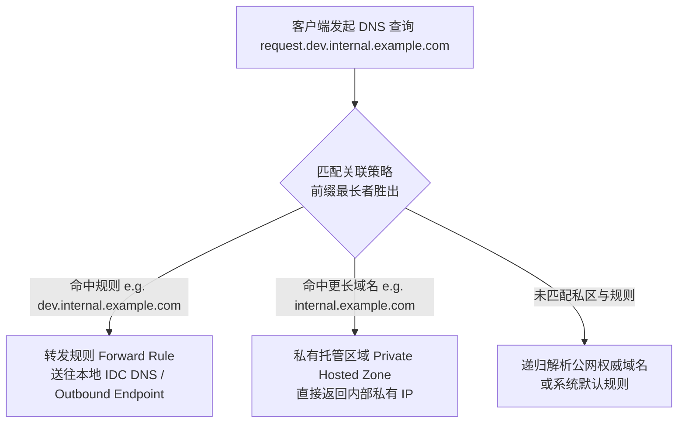
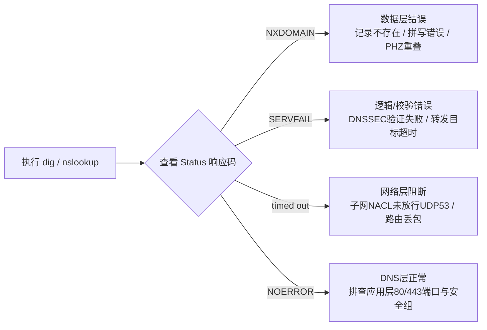
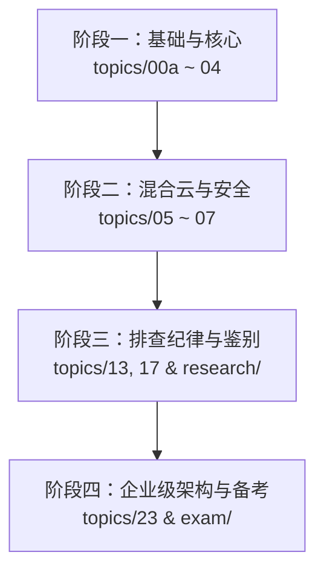

<<<<<<< HEAD
# AWS
For anything about AWS
=======
# AWS Route 53 SME Master Knowledge Base 🚀

[](https://aws.amazon.com/route53/)
[](LICENSE)
[](https://notebooklm.google.com/)

> **AWS Route 53 主题专家（SME）完整知识体系与架构实战指南**。本仓库整理汇集了 50 个深度技术模块、混合云 DNS 架构范式、真实生产故障排查纪律以及高阶模拟题库，专为备考 AWS 认证与解决复杂企业级 DNS 架构问题设计。

---

## 🧭 仓库阅读架构指南 (Repository Architecture)

为了让您能够高效阅读与检索，本仓库按照 **“基础与核心技术 $\rightarrow$ 架构范式与混合云 $\rightarrow$ 诊断纪律与故障模式 $\rightarrow$ 实战考题与评审”** 进行层级化组织：

```text
aws-route53-sme-mastery/
├── 00_Route53_SME_ALL_IN_ONE_MASTER.md  # 🌟 NotebookLM / AI 单文件母本（合集装订）
├── README.md                           # 📖 本主目录导航指南
│
├── 📂 topics/                           # 📚 25 个核心技术 Deep-Dive 专题
│   ├── 00a-dns-protocol-basics.md       # DNS 核心协议、响应码(RCODE)与报文结构
│   ├── 01-hosted-zones.md               # 公有与私有托管区域 (Public/Private Hosted Zones)
│   ├── 02-records-and-alias.md          # 记录类型 (A/AAAA/CNAME/MX) 与 Alias 别名记录
│   ├── 03-routing-policies.md           # 8 大路由策略选型 (Weighted, Latency, Geo, Failover...)
│   ├── 03b-routing-failover-deepdive.md # 高可用灾备与 Route 53 Health Checks 深度剖析
│   ├── 04-health-checks.md              # 健康检查机制、18% 规则与 CloudWatch 联动
│   ├── 05-resolver-hybrid-dns.md        # Resolver 入站/出站 Endpoint 混合云架构
│   ├── 06-dns-firewall.md               # Route 53 Resolver DNS Firewall 域名过滤
│   ├── 07-dnssec.md                     # DNSSEC 签名、DS 记录与信任链校验
│   ├── 08-subdomain-takeover.md         # 子域名接管 (Subdomain Takeover) 防御与防护
│   ├── 09-domain-registration.md        # 域名注册、TLD 转移与 Locks
│   ├── 10-profiles.md                   # Route 53 Profiles 跨账号配置管理
│   ├── 11-arc.md                        # Application Recovery Controller (ARC) 自动故障切换
│   ├── 12-integration-quotas.md         # 限额 (Quotas)、硬限制 (1024 PPS) 与提升途径
│   ├── 13-troubleshooting-discipline.md # SME 通用排查纪律（证据定级、必要非充分条件）
│   ├── 14-technical-deep-principles.md  # 底层协议原理与 EDNS0/ECS 扩展
│   ├── 15-observability.md              # 可观测性：Query Logs、CloudWatch 指标与 VPC Flow Logs
│   ├── 16-cost-model.md                 # 成本模型：按查询量、托管区及 Endpoint 计费优化
│   ├── 17-differential-diagnosis.md     # 鉴别诊断库：同症状异根因对照与分流决策树
│   ├── 18-traffic-flow.md               # Traffic Flow 可视化流量策略管理
│   ├── 19-iam-governance.md             # IAM 策略、Resource Policy 与安全治理
│   ├── 20-resolver-advanced.md          # Resolver 高级特性：Autodefined Rules 与规则匹配
│   ├── 21-cloudmap-service-discovery.md # AWS Cloud Map 服务发现与微服务集成
│   ├── 22-migration-bulk-change.md      # 批量记录变更、Zone 文件导入与无缝迁移
│   └── 23-enterprise-multiaccount-dns.md# 企业级多账号 Hub-Spoke DNS 架构设计
│
├── 📂 framework/                        # 🏛️ 知识框架与规范事实
│   ├── 00-knowledge-framework.md        # 知识体系拓扑结构与学习路径
│   └── 00b-canonical-facts.md           # 官方权威事实与数值速查 (Canonical Facts)
│
├── 📂 exam/                             # 📝 模拟考题与评估
│   ├── exam-bank-01-07.md               # 专项练习题集（基础与路由策略）
│   ├── exam-bank-08-13.md               # 专项练习题集（Resolver 与安全）
│   ├── exam-bank-advanced-tt-principles.md# 专家级高难排查综合题
│   ├── mock-exam-scored.md              # 仿真带评分全长模拟试卷
│   └── exam-difficulty-guide.md         # 考题难度梯度说明
│
└── 📂 research/                         # 🔬 案例研究与故障模式库
    ├── internal/r53-tt-failure-patterns.md  # 生产环境高频故障模式 (Troubleshooting Patterns)
    ├── internal/r53-case-inventory.md       # 真实 Customer Case 案例复盘
    └── external/r53-external-research.md    # 行业对比与外部研究报告
```

---

## 🎯 核心架构范式速览 (Architecture Overview)

### 1. VPC Resolver 解析优先级铁律 (Longest Match Rule)

在混合云与 VPC 环境中，`VPC Resolver`（即 `10.x.x.2` / `AmazonProvidedDNS`）按照**最长前缀匹配 (Longest Prefix Match)** 决定解析流量去向：



> ⚠️ **关键注意**：Private Hosted Zone (PHZ) **默认不向公网 Fallback**。如果 VPC 关联了 `example.com` 的 PHZ 但里面缺失 `test.example.com` 记录，Resolver 会直接返回 `NXDOMAIN`，而不会去公网查询！

---

### 2. 诊断命令与响应码 (RCODE) 对应矩阵

在排查 DNS 故障时，请遵循**“响应码归因法”**：



#### SME 常用诊断命令 Cheat Sheet

```bash
# 1. 普通递归查询
dig example.com A

# 2. 绕过缓存直查 AWS 权威 NS（确认配置是否已生效）
dig @ns-1234.awsdns-56.org example.com A

# 3. 关闭 DNSSEC 校验（区分是记录错误还是签名验证失败）
dig +cd example.com A

# 4. 从根 (.) 逐级跟踪委派路径（排查 NS 委派断裂）
dig +trace example.com

# 5. 强制使用 TCP 协议（测试 53 端口 TCP 连通性与 MTU 切片）
dig +tcp example.com A
```

---

## 🗺️ 推荐学习路径 (Learning Roadmap)

根据您的学习目标，建议按照以下阶段推进：



1. **🚀 入门阶段（理解核心概念）**：
   - 重点阅读：`topics/00a-dns-protocol-basics.md` $\rightarrow$ `topics/01-hosted-zones.md` $\rightarrow$ `topics/03-routing-policies.md`
2. **🏗️ 进阶阶段（攻克混合云与安全）**：
   - 重点阅读：`topics/05-resolver-hybrid-dns.md` $\rightarrow$ `topics/06-dns-firewall.md` $\rightarrow$ `topics/07-dnssec.md`
3. **🛠️ 实战阶段（掌握故障排查）**：
   - 重点阅读：`topics/13-troubleshooting-discipline.md` $\rightarrow$ `topics/17-differential-diagnosis.md`
4. **🎯 冲刺阶段（模拟刷题与高阶架构）**：
   - 重点阅读：`topics/23-enterprise-multiaccount-dns.md` $\rightarrow$ `exam/mock-exam-scored.md`

---

## 🤝 如何配合 AI 工具高效学习？

本仓库已被优化为 **AI-Native** 结构：

1. **在 NotebookLM 中使用**：
   - 直接导入根目录下的 `00_Route53_SME_ALL_IN_ONE_MASTER.md`。
   - 利用 NotebookLM 的 **音频概览 (Audio Overview)** 生成对谈播客，或点击 **生成报告 / 测验**。
2. **在 Google Colab 中使用**：
   - 打开项目中的 `Route53_Knowledge_Base_Colab.ipynb`，即可用 Python/Pandas 对全部 50 个主题进行搜索与检索。

---

## 📄 License & Maintainers

Distributed under the MIT License. See `LICENSE` for more information.
>>>>>>> 1e5dd12 (feat: add AWS Route 53 SME knowledge base and GitHub README architecture)
